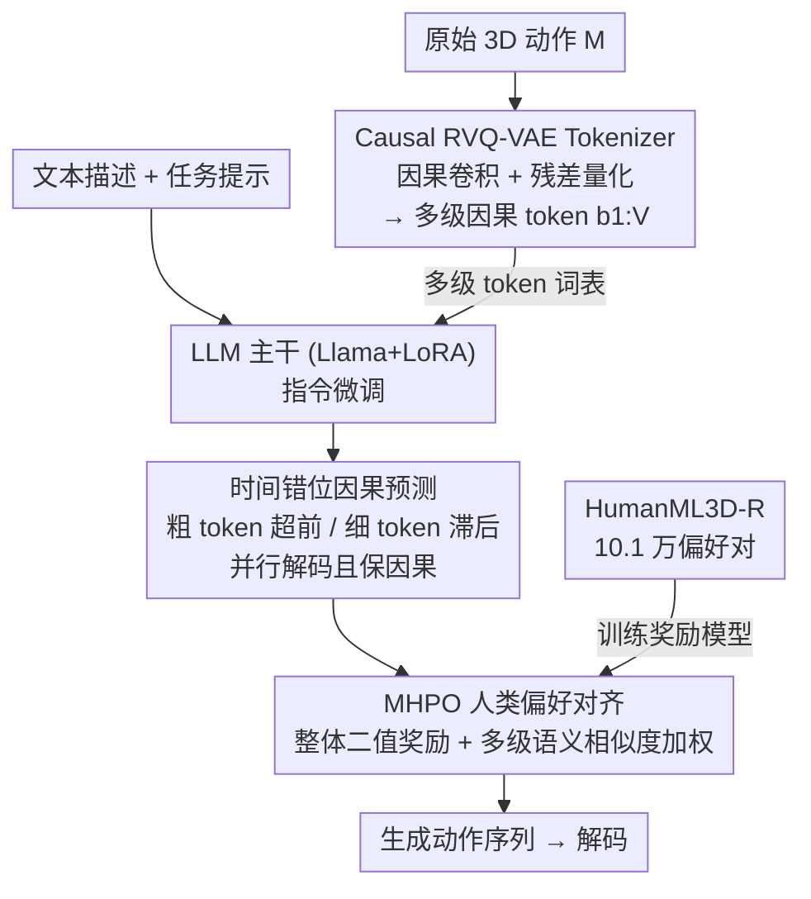

# Multi-level Causal LLM-based Text-to-Motion Generation with Human Alignment (MoTiGA)

**会议**: CVPR 2026  
**论文**: [CVF Open Access](https://openaccess.thecvf.com/content/CVPR2026/html/Chen_Multi-level_Causal_LLM-based_Text-to-Motion_Generation_with_Human_Alignment_CVPR_2026_paper.html)  
**代码**: 无（论文未给明确仓库）  
**领域**: 人体理解 / 文本驱动动作生成  
**关键词**: 文本到动作, LLM, 因果残差量化, 偏好对齐, 动作生成

## 一句话总结
MoTiGA 把 LLM 文本生成动作的三大短板——细粒度量化误差、"因果 LLM vs 非因果 VQ-VAE"的表征错配、缺人类偏好对齐——分别用因果残差量化（Causal RVQ-VAE）、时间错位因果预测、以及多层混合加权偏好优化（MHPO）逐一解决，在 HumanML3D 上把 FID 相对其它 LLM 方法降 82.3%、KIT-ML 降 64.7%。

## 研究背景与动机
**领域现状**：文本驱动人体动作生成（text-to-motion）分两派——任务专用模型（T2M-GPT、Motion Diffusion 等用专门的 transformer/扩散架构）和 LLM 派（MotionGPT、MotionLLM，用统一架构把动作当成"外语"，借 LLM 的世界知识）。LLM 派因泛化性强、能统一多任务而越来越受关注。

**现有痛点**：LLM 派普遍先用 **VQ-VAE** 把原始动作离散成 token 再喂给 LLM，但这带来三个具体问题。① **量化太粗**：朴素向量量化损失细粒度，丢掉细微动作细节；② **因果性错配**：因果 LLM（Llama、GPT）只能看当前和过去，而 VQ-VAE 是**非因果全局编码**——每个 token 同时受过去和未来帧影响，这与 LLM 的自回归本质冲突；③ **没对齐人类偏好**：现有 LLM 动作模型几乎不做偏好对齐，生成常出现"镜像动作错误（左右反了）""不完整动作错误（漏关键姿态）"等主观上不可接受的输出。

**核心矛盾**：要想用残差量化把表征做细（多级 token），token 数会翻 V 倍，自回归推理步数暴增、雪球误差（exposure bias）放大；可若并行解码各级 token 又会**打破因果依赖**。即"细粒度表征 ↔ 因果性 ↔ 推理效率"三者难以兼得。

**本文目标**：在保持 LLM 统一架构的前提下，同时拿到细粒度、因果一致、并行高效的动作表征，并补上人类偏好对齐。

**切入角度**：既然 LLM 是因果的，就把动作 tokenizer 也改造成因果的（因果卷积 + 残差量化），再设计一种"让粗粒度 token 先于细粒度 token 生成"的错位调度，在并行解码里仍保住因果链。

**核心 idea**：Causal RVQ-VAE 产出多级因果动作 token（基层管全局、残差层管细节）+ 时间错位因果预测做并行解码 + MHPO 把人类偏好按语义相似度分层注入奖励。

## 方法详解

### 整体框架
MoTiGA 以 Llama-7B 为主干（LoRA 微调），分两阶段。**指令微调阶段**：先用 Causal RVQ-VAE 把 3D 动作序列 $M$ 离散成多级因果 token（基层 $b^1$ 抓整体运动，残差层 $b^{2:V}$ 逐级补细节），再让 LLM 在"任务提示 + 文本描述"条件下、按时间错位因果预测策略并行地生成各级 token，解码回动作。**人类偏好对齐阶段**：在指令微调好的模型上做 MHPO——对每个文本采样 G 条动作，按整体二值奖励 + 各级语义相似度的混合加权奖励，用 PPO 式目标把模型推向人类偏好；偏好数据来自自建的 HumanML3D-R。

### 关键设计

**1. Causal RVQ-VAE：把动作 tokenizer 从非因果改成因果且多级，同时压量化误差**

针对"VQ-VAE 量化太粗 + 非因果与 LLM 错配"两个痛点，本文用因果残差量化。它含一个 1D **因果卷积**编码器 $E$、因果卷积解码器 $D$、以及 $V$ 个共享可学习码本。给定动作 $M$，编码器先下采样得基层潜向量 $z^1=E(M)$；每一级做 $b^v=Q(z^v)$、$z^{v+1}=z^v-b^v$（对残差再量化），最终近似 $\hat z=\sum_{v=1}^{V}b^v$ 喂回解码器重建。残差量化继承自 RVQ-VAE，逐级"由粗到细"地逼近，显著降低量化误差；而**因果卷积**保证每个时间步的编码只依赖当前和过去帧——这正是与因果 LLM（如 Llama）训练/推理对齐的关键，把"非因果表征喂给因果模型"的根本错配消掉。

**2. 时间错位因果预测：并行解码多级 token 却不破坏因果链**

Causal RVQ-VAE 的代价是 token 数变 V 倍，逐步（step-by-step）解码会让推理步数翻倍、雪球误差放大。一个朴素补救是**时间同步并行预测**（共享主干 $F_b$ + 共享头 $F_h$ + 各级一个 neck 网络 $F_n^v$，一步同时吐出所有级 token），但它破坏了因果依赖——数学上

$$P(b^{v+1}_{t+1}\mid b^{1:v+1}_{1:t},X,\tau)\neq P(b^{v+1}_{t+1}\mid b^{1:v}_{t+1},b^{1:v+1}_{1:t},X,\tau)$$

缺了 $b^{1:v}_{t+1}$ 这个同帧粗层条件，因果就断了。本文的**时间错位（time-lagged）因果预测**让粗层 token 为**更靠后**的时间步生成、细层 token 为**更靠前**的时间步生成（如 $b^1$ 预测 $t_4$、$b^4$ 预测 $t_1$）。这样每个细级 token 生成时，所需的粗级上下文已在前几步就绪——既保住了 tokenizer 的因果结构，又留住了多级并行解码的效率，把"细粒度 ↔ 因果 ↔ 效率"的三难调和。

**3. MHPO + HumanML3D-R：把人类偏好按语义相似度分层、加权注入奖励**

针对"没做偏好对齐导致镜像/不完整动作"的痛点，本文提出多层混合加权偏好优化。基线是 GRPO：给一条动作整体二值奖励（偏好 +1 / 非偏好 −1）做 PPO 式优化。但对动作生成，整体二值奖励**太稀疏**——即便都是"偏好样本"，各级 token 仍有细微质量差，粗粒度奖励无法精修这些细节。于是 MHPO 把**多级语义相似度**作为自适应 bonus。对偏好序列里第 $v$ 级 token，奖励为

$$\hat r^{+}_{i,t}=\begin{cases}(1-\varepsilon)r_i+\varepsilon\,\delta_v, & v=1\\(1-\varepsilon)r_i+\varepsilon(\delta_v-\delta_{v-1}), & v\in[2,V]\end{cases}$$

其中 $\delta_v=S_{[0,1]}\big(X,\,D(\sum_{k=1}^{v}b^k)\big)$ 是用动作检索模型 TMR 算出的"前 $v$ 级解码动作与文本 $X$ 的归一化语义相似度"，从而把奖励集中到**语义相似度高的关键级关键 token** 上，激励模型精修要害；对非偏好序列（整体轨迹就错了）则只在末级 $\delta_V$ 趋近 0 的硬样本上加重惩罚 $\hat r^{-}_{j,t}=(1-\varepsilon)r_j+\varepsilon(1-\delta_V)(-1)$。配套开源的 HumanML3D-R 含 **101,490 对人类偏好样本**（每对一个文本 + 偏好/非偏好两条动作），训练阶段用它训一个分类器来预测整体二值奖励 $r$。

### 损失函数 / 训练策略
Causal RVQ-VAE 用"动作重建损失 + 各级隐变量嵌入损失"训练（与 Momask/T2M-GPT 一致）。LLM 主干为 Llama-7B + LoRA（秩 64），指令微调 240K 步、lr $6\times10^{-4}$（单卡约 72 小时）；偏好对齐阶段 120K 步、lr $6\times10^{-6}$（约 36 小时）。MHPO 的最终目标把偏好与非偏好两支的归一化奖励 $\hat A^+,\hat A^-$（零填充后做均值-方差标准化）合进一个 PPO 风格的裁剪目标 $J_{MHPO}(\theta)$，省略了 KL 项的简化形式。

## 实验关键数据

### 主实验
在 HumanML3D 和 KIT-ML 上评测，指标含 FID、R-Precision（Top-1/3）、MM-Dist、Diversity。重复 20 次取均值。

| 方法 | 类型 | HumanML3D FID ↓ | Top-1 ↑ | KIT-ML FID ↓ | Top-1 ↑ |
|------|------|-----------------|---------|--------------|---------|
| MotionGPT (FLAN-T5) | LLM | 0.232 | 49.2 | 0.510 | 36.6 |
| MotionGPT (Llama) | LLM | 0.590 | 37.6 | – | – |
| MotionLLM (Gemma) | LLM | 0.491 | 48.2 | 0.781 | 40.9 |
| Momask | 任务专用 | 0.045 | 52.1 | 0.204 | 43.3 |
| **MoTiGA (Llama)** | LLM | **0.041** | **52.3** | **0.180** | **44.3** |

MoTiGA 把 HumanML3D 的 FID 从 LLM 派最好的 0.232 降到 0.041（相对 −82.3%），KIT-ML 从 0.510 降到 0.180（−64.7%），并且 R-Precision/MM-Dist 全面领先——已经**追平甚至反超任务专用模型**（如 Momask 0.045），同时保持 LLM 架构的灵活与可扩展。

副任务也强：动作描述（motion captioning）上 BLEU-1 49.0、Top-1 R-Precision 55.9 均超 MotionGPT；给定初始姿态的文本生成动作上 FID 0.040、单样本仅 3.684 秒，比 MotionGPT 的 14.494 秒快 **−74.5%**。

### 消融实验
组件逐项叠加（HumanML3D）：

| 配置 | FID ↓ | Top-1 ↑ | 说明 |
|------|-------|---------|------|
| VQ-VAE + 逐步解码 | 0.213 | 46.4 | 基线 |
| Causal RVQ-VAE + 逐步 | 0.186 | 46.6 | 因果残差量化，保动作细节 |
| + 时间同步并行 | 0.064 | 51.0 | 并行解码大幅提升 |
| + 时间错位因果 | 0.055 | 51.9 | 保因果，进一步更好 |
| + GRPO 对齐 | 0.047 | 52.1 | 加偏好对齐 |
| + MHPO 对齐 | **0.041** | **52.3** | 多级加权，最佳 |

量化级数 $V$ 的对比（Causal RVQ-VAE 的生成 FID）显示 $V=4$ 最优（生成 FID 0.055），过多反而退化（$V=6$ 升到 0.058）。

### 关键发现
- **时间错位 vs 时间同步**：从 0.064→0.055，证明并行解码若不补回同帧粗层条件就会损因果；错位调度在不牺牲并行效率的前提下把因果找回来。
- **MHPO 优于 GRPO**：0.047→0.041，多级语义相似度加权确实比"整体一刀切奖励"更能精修关键 token，缓解镜像/不完整动作。
- Causal RVQ-VAE 相对原 RVQ-VAE 在合适级数下生成质量更好（如 $V=4$ 时 0.055 vs 0.085），尽管重建 FID 略逊——说明**对下游因果 LLM 友好的表征**比单纯重建精度更重要。

## 亮点与洞察
- **"让 tokenizer 也变因果"是治本之策**：用因果卷积把动作编码改成只看过去，从根上消除"非因果表征喂因果 LLM"的错配，比在 LLM 端打补丁更干净。
- **时间错位调度很巧**：粗层超前、细层滞后，让并行解码时每个细 token 都拿得到同帧粗层上下文，一招同时拿下因果、效率、细粒度——这种"按层错峰"的思路可迁移到任何多级残差自回归生成。
- **MHPO 把 RL 奖励从"整条序列一个分"细化到"按级按语义相似度分配"**，并用动作检索模型 TMR 当语义打分器，给"如何对动作做细粒度 RLHF"提供了可复用范式。
- 开源 HumanML3D-R（10 万级偏好对）填补了动作生成缺偏好数据的空白，价值独立于方法本身。

## 局限与展望
- 偏好对齐依赖自建 HumanML3D-R 与训练出的二值奖励分类器，标注质量与分类器偏差会直接传导到对齐效果；数据采集细节放在补充材料，正文难独立评估。⚠️
- 量化级数 $V$ 敏感（$V=4$ 最优，过多退化），需要按数据集调参。
- 评测限于 HumanML3D/KIT-ML 两个常规基准，对长序列、多人物、复杂交互动作的泛化未充分验证。
- 主干为 Llama-7B + LoRA，训练成本（单卡 72h + 36h）对小团队仍偏重；推理虽因并行解码加速，但多级 token 的整体开销与任务专用轻量模型相比未细致比较。

## 相关工作与启发
- **vs MotionGPT / MotionLLM（LLM 派）**：它们用非因果 VQ-VAE + 逐 token 解码，量化粗、因果错配、无偏好对齐；MoTiGA 用因果 RVQ-VAE + 错位并行 + MHPO 三处对症下药，FID 数量级下降。
- **vs Momask / T2M-GPT（任务专用派）**：专用架构精度高但泛化与多任务受限；MoTiGA 在保持 LLM 统一架构的同时把指标追到与 Momask 同档（0.041 vs 0.045），兼顾了精度与通用性。
- **vs GRPO（通用 RL 对齐）**：GRPO 整条序列均匀奖励，对动作太稀疏；MHPO 引入多级语义相似度 bonus，把奖励聚到关键级关键 token，是面向动作任务的 RL 改造。

## 评分
- 新颖性: ⭐⭐⭐⭐⭐ 因果 tokenizer + 时间错位并行 + 多级偏好对齐三件套针对性强，组合新颖。
- 实验充分度: ⭐⭐⭐⭐ 两基准 + 多任务 + 组件/级数/对齐消融较全，惜泛化场景偏窄。
- 写作质量: ⭐⭐⭐⭐ 三大痛点-三大设计对应清晰，公式略密但逻辑顺。
- 价值: ⭐⭐⭐⭐⭐ 把 LLM 派动作生成追平任务专用模型，并开源首个大规模动作偏好数据集。

<!-- RELATED:START -->

## 相关论文

- [\[CVPR 2026\] MoLingo: Motion-Language Alignment for Text-to-Human Motion Generation](molingo_motion-language_alignment_for_text-to-motion_generation.md)
- [\[CVPR 2026\] FrankenMotion: Part-level Human Motion Generation and Composition](frankenmotion_part-level_human_motion_generation_and_composition.md)
- [\[CVPR 2026\] Hierarchical Enhancement of Semantic Priors for Disentangled Text-Driven Motion Generation](hierarchical_enhancement_of_semantic_priors_for_disentangled_text-driven_motion_.md)
- [\[CVPR 2026\] LaMoGen: Language to Motion Generation Through LLM-Guided Symbolic Inference](lamogen_language_to_motion_generation_through_llm-guided_symbolic_inference.md)
- [\[CVPR 2026\] Towards Decompositional Human Motion Generation with Energy-Based Diffusion Models](towards_decompositional_human_motion_generation_with_energy-based_diffusion_mode.md)

<!-- RELATED:END -->
