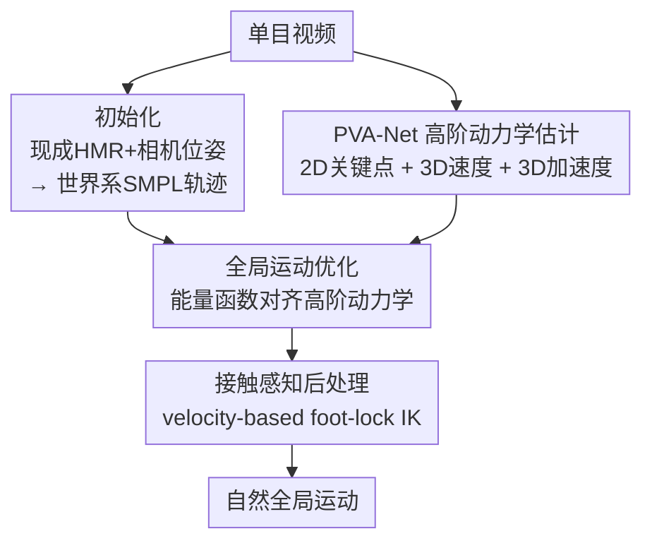

# Natural Human Motion Recovery by Aligning High-Order Temporal Dynamics from Monocular Videos

**会议**: CVPR 2026  
**arXiv**: [2605.26879](https://arxiv.org/abs/2605.26879)  
**代码**: https://zju3dv.github.io/htd-refine/ (project page)  
**领域**: 3D视觉 / 人体运动恢复 (HMR)  
**关键词**: 单目运动恢复, 高阶时序动力学, 速度加速度场, 全局轨迹优化, 后处理精修

## 一句话总结
针对单目人体运动恢复"关节位置准但动起来要么抖要么过平滑"的痛点，本文提出 HTD-Refine——用一个轻量时序网络 PVA-Net 直接从视频显式预测每个关节的 3D 速度和加速度，再把这些高阶动力学当成软约束去优化全局轨迹，能即插即用地给 TRAM / GVHMR / Human3R 等现有方法降抖动、抑过平滑，并提升全局精度。

## 研究背景与动机
**领域现状**：单目世界系人体运动恢复（world-grounded HMR）的目标是从一段普通视频里重建出人在全局坐标系下的 3D 轨迹。主流路线大致三类：先估相机再转全局（SLAHMR、TRAM），直接逐帧自回归吐全局运动（WHAM、GVHMR），以及连人带场景一起重建（JOSH、Human3R）。这些方法把关节位置误差（MPJPE 类指标）压到了厘米级。

**现有痛点**：但"位置准"不等于"动得自然"。同样低位置误差的轨迹，重建出来要么**抖动**（TRAM、Human3R），要么被**过度平滑**抹掉了高频细节（GVHMR）。作者的关键观察是：人体运动对微小数值误差极其敏感——一点点姿态偏差会沿运动学链累积，明显破坏动力学保真度，哪怕位置误差很低。雪上加霜的是，训练和评测普遍用 30 FPS 低帧率数据，根本抓不住高频瞬态，模型系统性地欠拟合快速动作。

**核心矛盾**：现有补救手段都"隐式"地正则动力学，因此顾此失彼。**时序平滑类**（TRAM 的网络连续性、WHAM 的自回归预测、额外的高斯滤波）太弱，恢复不了高频变化，加滤波又会把真实运动一并压掉；**生成先验类**（RoHM 的扩散、HuMoR 的 VAE 转移先验）能产出貌似合理的序列，却难以在全局一致性和逐帧 2D 证据之间平衡，既不稳又贵。本质问题是：缺少**可靠的高阶时序线索（速度、加速度）**——而恰恰是这些一阶/二阶信号决定了运动的动量、节奏和高频细节。

**本文目标 / 核心 idea**：与其隐式正则，不如**显式估计**速度-加速度场，把它当成精修的硬证据。用一句话概括：**先从视频直接预测每关节的 3D 速度和加速度，再用它们作为软约束去对齐（align）现有重建结果的高阶动力学**，从而在不重训主干、即插即用的前提下，同时降抖动、抑过平滑、还原物理上可信的运动。

## 方法详解

### 整体框架
HTD-Refine 是一个**后处理精修框架**，挂在任意现成 HMR pipeline 之后，不动主干。给定一段长度 $T$ 的单目视频，用 SMPL/SMPL-X 参数 $\{\boldsymbol{\theta}^t,\boldsymbol{\beta},\boldsymbol{\tau}_w^t,\Gamma_w^t\}$ 表示全局运动，整个流程分三步：

（a）**初始化**：跑一个现成的人体网格恢复模型（TRAM/GVHMR）和一个相机位姿估计器，得到逐帧相机系姿态与相机外参，再按式 $\Gamma_w^t=\mathbf{R}_c^t\Gamma_c^t$、$\boldsymbol{\tau}_w^t=\mathbf{t}_c^t+(\mathbf{R}_c^t(\boldsymbol{\tau}_c^t+\mathbf{t}_{\text{root}})-\mathbf{t}_{\text{root}})$ 把相机系运动转到世界系。这一步给出一致的全局轨迹，但缺高阶时序线索。

（b）**高阶动力学估计**：核心模块 PVA-Net 从视频直接预测每关节的 2D 关键点、相机系 3D 速度 $V_c^t$、相机系 3D 加速度 $A_c^t$，作为后续优化的"动力学锚点"。

（c）**全局运动优化**：从当前全局运动里用有限差分算出速度/加速度，与 PVA-Net 的预测做对齐损失，再叠加重投影损失、jerk 平滑、参数正则，用 Adam 迭代 $N$ 次优化 $\{\boldsymbol{\theta}_w^t,\Gamma_w^t,\boldsymbol{\tau}_w^t\}$。最后一步可选的接触感知后处理做 foot-lock IK。

### 关键设计

**1. PVA-Net：从视频直接回归 2D 关键点 + 3D 速度 + 3D 加速度**

这是整套方法的"信号源"，专治初始化缺高阶线索。PVA-Net 是个轻量时序 transformer：用 ViTPose-L 初始化的 ViT 主干（冻结）逐帧抽空间特征，接 8 个 block 的可训练时序 transformer，最后用三个小预测头分别吐出 $\{K^t\in\mathbb{R}^{J\times2}\}_{t=1}^T$、$\{V_c^t\in\mathbb{R}^{J\times3}\}_{t=2}^T$、$\{A_c^t\in\mathbb{R}^{J\times3}\}_{t=2}^{T-1}$。时序注意力里引入旋转位置编码 RoPE，给时间偏移一个连续、几何感知的编码，让模型更好地捕捉运动起始、反转、节律循环这类高阶模式，并对序列长度和全局相位平移保持鲁棒。同时输出稳定的 2D 关键点也很关键——单帧检测器（ViTPose-L）在视频上会抖、会因遮挡失败，PVA-Net 的时序版本相当于做了时序平滑的 2D 证据。

**2. 在相机系预测、并以二阶差分（加速度）为主监督，避开尺度与相机漂移**

为什么不直接预测世界系动力学？因为单目 3D 重建里速度直接正比于未知的全局尺度——更高的人、更近的相机、不准的焦距都会等比例缩放所有 3D 位置，进而等比例缩放速度场；速度还会被低频相机漂移污染（漂移表现为平滑的"假运动"，难和真实运动区分）。作者的处理有两层：其一，**全部量在每帧的相机坐标系下预测**（$V_c^t=\frac{\mathbf{J}_c^t-\mathbf{J}_c^{t-1}}{\Delta t}$，$A_c^t=\frac{\mathbf{J}_c^{t+1}-2\mathbf{J}_c^t+\mathbf{J}_c^{t-1}}{(\Delta t)^2}$），避免和全局尺度、相机自运动纠缠。其二，**强调二阶差分（加速度）作为更干净的监督**：二阶差分会衰减近似常值的相机漂移这类缓变全局趋势，同时放大运动起停、方向反转这些时序显著事件——这些高曲率特征对尺度更不敏感、对相机运动更鲁棒。消融里加速度确实是降抖动的关键信号。

**3. 高阶动力学对齐的全局运动优化能量函数**

拿到 PVA-Net 的预测后，精修被写成一个能量最小化问题。固定形状 $\boldsymbol{\beta}$，优化姿态 $\boldsymbol{\theta}$、全局平移 $\boldsymbol{\tau}$、全局朝向 $\Gamma$。每次迭代用当前 SMPL 参数前向算出世界系关节，投影回图像得 2D 关键点，对关节做时序有限差分得 3D 速度/加速度，然后最小化：

$$E=\lambda_V E_V+\lambda_A E_A+\lambda_K E_K+\lambda_{\text{jerk}} E_{\text{jerk}}+\lambda_{\text{reg}} E_{\text{reg}}$$

其中 $E_V,E_A,E_K$ 分别是当前运动算出的速度/加速度/2D 关键点与 PVA-Net 预测的 L2 一致性（如 $E_V=\frac{1}{T-1}\sum_t\|\mathbf{V}_c^t-\hat V_c^t\|_2^2$）；$E_{\text{jerk}}=\frac{1}{T-3}\sum_t\|\mathbf{J}^{t+3}-3\mathbf{J}^{t+2}+3\mathbf{J}^{t+1}-\mathbf{J}^t\|_2^2$ 是三阶差分的 jerk 平滑项；$E_{\text{reg}}$ 把优化后的 SMPL 参数拽住、别偏离初始太多。权重 $\lambda_K=1.0,\lambda_V=1.0,\lambda_A=0.1,\lambda_{\text{jerk}}=10^4,\lambda_{\text{reg}}=10^4$，用 Adam 反传通过 SMPL 和投影更新。关键在于：速度、加速度是**软但有信息的约束**——既保留高频细节、又纠正时序不一致，比纯滤波或 clip 级生成先验在相机位姿有噪声时更可靠。优化前还有一个轻量标定，让初始 3D 关节速度幅度和预测幅度一致，把全局尺度先对齐好。

**4. 接触感知后处理：velocity-based foot-lock IK**

为了让脚/手在接触环境时不滑动（高质量全局运动要求接触点精确无滑移，哪怕微小漂移都显得不自然），作者用一个简单的速度阈值规则：给定阈值 $\xi_v=0.1$，由预测的相机系速度幅度算静止概率 $p_s=\max(0,1-\|\mathbf{V}^t\|/\xi_v)$，再用它插值出目标关节位置 $\hat{\mathbf{J}}^t=p_s\mathbf{J}^t+(1-p_s)\mathbf{J}^{t+1}$，喂给一步逆运动学（IK）精修全局运动。这是一个**可选**步骤——消融显示它降 foot sliding，但会把接触点偏差传播到其他关节、略损整体精度，因此默认保留只为了视觉质量。

### 损失函数 / 训练策略
PVA-Net 从 ViTPose-L 初始化，在带 3D 标注的视频数据集（BEDLAM、RICH、H36M）上训练，**冻结 ViT 主干、只训时序 transformer 和预测头**。总损失为
$$L_{\text{total}}=\alpha_H L_H+\alpha_V L_V+\alpha_A L_A+\alpha_{tgm}L_{tgm}$$
其中 $L_V,L_A$ 是速度/加速度的 L2 回归（速度/加速度的真值由式 3、式 4 的有限差分算出），$L_H$ 是逐关节热图回归（2D 关键点由热图 argmax 得到），$L_{tgm}$ 是受 VDA 启发的时序梯度匹配损失 $\frac{1}{T-1}\sum_t\|(\hat H^t-\hat H^{t-1})-(H^t-H^{t-1})\|^2$，鼓励 2D 关键点的时序一致性。注意训练阶段只训 PVA-Net；测试时的全局运动优化是**逐视频在线优化**，不需要再训。

## 实验关键数据

### 主实验
评测在两个 in-the-wild 基准：EMDB-2（25 段、移动相机）和 RICH 测试集（191 段、静态相机）。指标包含全局稳定性（Jitter m/s³、FS foot sliding mm）、全局精度（WA-MPJPE、W-MPJPE、RTE），以及本文新提的动力学保真度指标 **MPJVE**（Mean Per-Joint Velocity Error，相机系速度的 L2 误差 $\frac{1}{T-1}\sum_t\|\hat{\mathbf{V}}_c^t-\mathbf{V}_c^t\|_2^2$）和 **MPJAE**（Mean Per-Joint Acceleration Error，加速度同理）。

EMDB-2（移动相机）主结果——HTD-Refine 给每个 baseline 都即插即用涨点：

| 模型 | Jitter↓ | FS↓ | MPJVE↓ | MPJAE↓ | WA-MPJPE↓ | W-MPJPE↓ |
|------|---------|-----|--------|--------|-----------|----------|
| TRAM (w/ traj filter) | 25.1 | 12.0 | 0.6 | 12.3 | 78.8 | 221.3 |
| **TRAM + HTD-Refine** | **6.6** | **7.5** | **0.4** | **8.0** | **71.7** | **204.9** |
| GVHMR | 17.2 | 4.0 | 0.6 | 10.4 | 118.7 | 292.7 |
| **GVHMR + HTD-Refine** | **7.2** | 5.7 | **0.4** | **7.9** | **69.2** | **192.4** |
| Human3R | 529.6 | 60.0 | 2.9 | 143.3 | 169.0 | 367.1 |
| **Human3R + HTD-Refine** | **132.5** | **23.2** | **1.3** | **39.4** | **156.2** | 391.4 |

跨 baseline 看：Jitter 降 58.1%–75.0%，FS（TRAM/Human3R）降 37.5%–61.3%，MPJVE 降 33.3%–55.2%、MPJAE 降 24.0%–72.5%，WA-MPJPE 降 7.6%–41.7%。RICH（静态相机）上趋势一致：Jitter 降 72.3%–77.5%，MPJVE/MPJAE 各降 25%–41% 量级。

与其他精修方法对比（EMDB，TRAM 初始化）：

| 模型 | Jitter↓ | FS↓ | WA-MPJPE↓ | W-MPJPE↓ |
|------|---------|-----|-----------|----------|
| TRAM (w/ traj filter) | 25.1 | 12.0 | 78.8 | 221.3 |
| TRAM + RoHM | 28.4 | 9.9 | - | - |
| **TRAM + HTD-Refine** | **6.6** | **7.5** | **71.7** | **204.9** |

值得注意的是 RoHM（扩散精修）的 Jitter 反而比高斯滤波更差——因为在带噪相机位姿下把运动对齐到图像观测，会引入逐 clip 不一致的修正、放大帧间不连续。RICH 上与 NeMF/PACE 比，HTD-Refine 也全面领先（vs NeMF：Jitter 降 69.0%、FS 降 80.7%）。

### 消融实验
在 EMDB 上拆 5 个变体（基线 TRAM）：

| 配置 | Jitter↓ | FS↓ | MPJAE↓ | WA-MPJPE↓ | PA-MPJPE↓ | 说明 |
|------|---------|-----|--------|-----------|-----------|------|
| TRAM (raw) | 96.0 | 18.2 | 27.2 | 80.6 | 36.4 | 原始预测 |
| TRAM + Traj-Filter | 25.1 | 12.0 | 12.3 | 78.8 | 36.4 | 纯高斯平滑 |
| w/o vel & acc | 10.1 | 10.5 | 9.8 | 73.4 | 36.7 | 只用 2D 约束 |
| w/o acc | 9.7 | 8.0 | 8.6 | 73.0 | 34.6 | 去加速度监督 |
| w/o vel | 7.9 | 8.8 | 8.3 | 72.5 | 35.2 | 去速度监督 |
| w/o post-proc | 6.5 | 7.9 | 8.0 | 71.2 | 34.0 | 去 foot-lock |
| **Full** | **6.6** | **7.5** | **8.0** | 71.7 | 34.1 | 完整模型 |

### 关键发现
- **加速度是降抖动的核心信号**：去掉加速度监督后 Jitter 从 6.6→9.7、MPJAE 从 8.0→8.6，二阶动力学一旦失约束，振荡明显回潮。
- **速度主管一阶/接触相位一致性**：去掉速度后 FS 涨得最多（7.5→8.8），说明速度线索维持高频稳定性和接触相位保真。两者互补——速度调相位、加速度稳高阶。
- **纯 2D 不够**：w/o vel & acc 时优化为了满足 2D 重投影会扭曲局部姿态（PA-MPJPE 36.4→36.7，出现脚背过度背屈、手臂拧曲），印证了深度歧义下 2D 约束的天花板。
- **后处理是精度-视觉的权衡**：foot-lock 降 FS（7.9→7.5）但略损 WA-MPJPE（71.2→71.7），因为锁脚会把偏差传到别处，故设为可选。

## 亮点与洞察
- **"位置准 ≠ 动得自然"的诊断很到位**：把问题归到"缺高阶时序线索"，并用显式预测速度/加速度场来补，是个干净且可解释的切口——比起一股脑上扩散先验，思路更聚焦。
- **二阶差分天然抗尺度/抗漂移**：在单目尺度未知、相机漂移污染的设定下，选加速度（二阶差分）作主监督是个聪明的物理直觉——它衰减缓变全局趋势、放大显著事件，等于免费做了一层去偏。这个 trick 可迁移到任何"全局尺度不可靠但要估动力学"的单目任务。
- **即插即用、不重训主干**：作为后处理框架套在 TRAM/GVHMR/Human3R 上都涨点，工程上很友好；PVA-Net 冻结 ViT 只训时序头也降低了训练成本。
- **MPJVE / MPJAE 两个新指标**：把"动力学保真度"从感性描述变成可量化的速度/加速度误差，补了 HMR 评测里只看位置误差的盲区，值得后续工作沿用。

## 局限性 / 可改进方向
- **依赖初始化质量**：HTD-Refine 是后处理，初始轨迹烂（如 Human3R 在 EMDB 上 Jitter 高达 529.6）时虽大幅改善但仍远逊于好的基线，且 W-MPJPE 偶尔不升反降——精修拉不动彻底失败的重建。
- **后处理 foot-lock 是双刃剑**：锁脚降 FS 却传播偏差损全局精度，作者也只能设为可选，说明接触约束和全局一致性之间仍未真正解开。
- **2D 监督的固有歧义**：纯 2D 会扭曲局部姿态，本文靠速度/加速度缓解，但深度歧义并未根除，复杂遮挡/快速动作下高阶预测本身的可靠性存疑。
- **低帧率根因未直接解决**：论文指出 30 FPS 训练数据欠拟合高频，但 PVA-Net 仍在这类数据上训练，更高帧率数据或时序超分或许能进一步打开上限。

## 相关工作与启发
- **vs 时序平滑类（TRAM traj-filter / WHAM / GVHMR）**：它们隐式正则连续性，太弱抓不住高频、加滤波又压真实运动；本文显式预测速度/加速度作软约束，既降抖又保高频（消融里 Traj-Filter 把 Jitter 96→25，HTD-Refine 进一步到 6.6）。
- **vs 生成先验类（RoHM 扩散 / HuMoR VAE）**：它们采样自学习分布，在噪声相机位姿下逐 clip 修正不一致、反而放大帧间跳变（RoHM Jitter 28.4 还差于滤波 25.1），且慢；本文用确定性的高阶动力学对齐，更稳更可靠。
- **vs 直接全局重建（WHAM / GVHMR / Human3R）**：它们自回归滚动或重建几何，但不显式监督每关节速度/加速度场；本文正是补上这块显式高阶监督，且可挂在它们之后增益。

## 评分
- 新颖性: ⭐⭐⭐⭐ 显式预测速度/加速度场并作软约束精修是个清晰且少见的切口，二阶差分抗尺度/漂移的物理直觉巧妙。
- 实验充分度: ⭐⭐⭐⭐ 两基准 × 三 baseline + 与四种精修方法对比 + 5 变体消融，并提出 MPJVE/MPJAE 新指标；但仅限两个 in-the-wild 数据集。
- 写作质量: ⭐⭐⭐⭐ 动机诊断—方法—消融逻辑顺畅，公式与权重交代清楚。
- 价值: ⭐⭐⭐⭐ 即插即用、不重训主干就能给现有 SOTA 普涨动力学保真度，对动画/具身模仿等下游实用。

<!-- RELATED:START -->

## 相关论文

- [\[CVPR 2026\] MetricHMSR: Metric Human Mesh and Scene Recovery from Monocular Images](metrichmsr_metric_human_mesh_and_scene_recovery_from_monocular_images.md)
- [\[CVPR 2026\] Mocap-2-to-3: Multi-view Lifting for Monocular Motion Recovery with 2D Pretraining](mocap-2-to-3_multi-view_lifting_for_monocular_motion_recovery_with_2d_pretrainin.md)
- [\[CVPR 2025\] HumanMM: Global Human Motion Recovery from Multi-shot Videos](../../CVPR2025/human_understanding/humanmm_global_human_motion_recovery_from_multi-shot_videos.md)
- [\[CVPR 2026\] SAM 3D Body: Robust Full-Body Human Mesh Recovery](sam_3d_body_robust_full-body_human_mesh_recovery.md)
- [\[CVPR 2026\] UniDex: A Robot Foundation Suite for Universal Dexterous Hand Control from Egocentric Human Videos](unidex_a_robot_foundation_suite_for_universal_dexterous_hand_control_from_egocen.md)

<!-- RELATED:END -->
