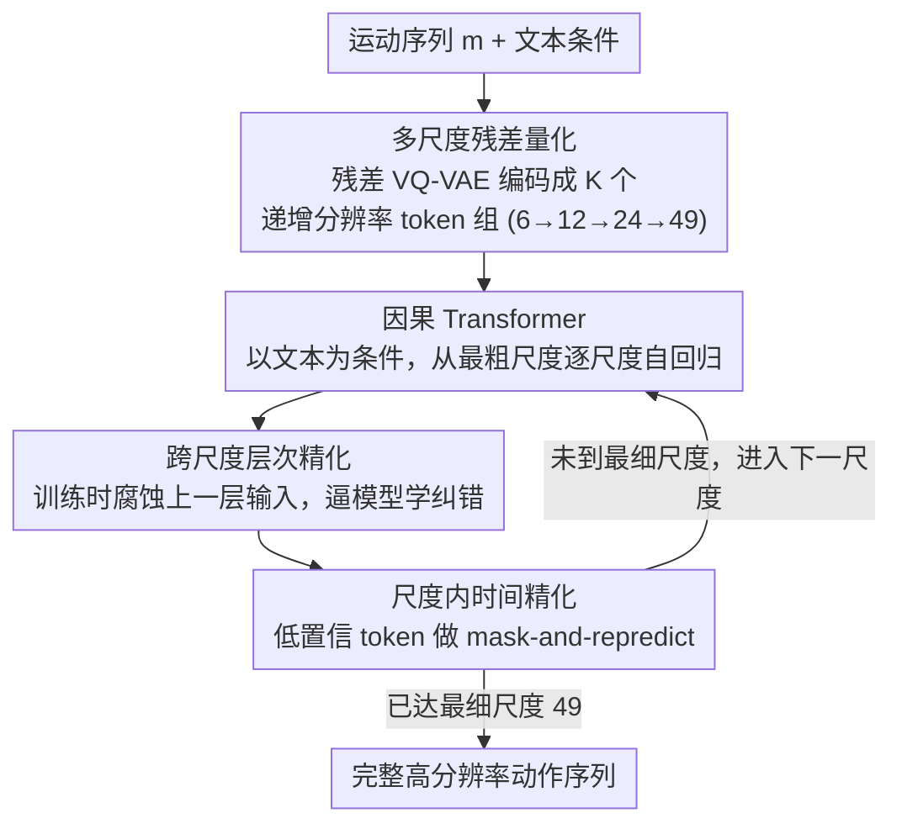

# Next-Scale Autoregressive Models for Text-to-Motion Generation

**会议**: CVPR 2026  
**arXiv**: [2604.03799](https://arxiv.org/abs/2604.03799)  
**代码**: 见项目主页  
**领域**:人体理解
**关键词**: 文本到动作生成, 自回归模型, 多尺度预测, 层次化生成, 运动合成

## 一句话总结

MoScale 提出了一种 next-scale 自回归动作生成框架，替代传统 next-token 预测，通过从粗到细的层次化因果生成来捕获全局语义结构，并引入跨尺度层次精化和尺度内时间精化，在 HumanML3D 和 KIT-ML 上达到 SOTA（Top-1 0.540，FID 0.046）。

## 研究背景与动机

1. **领域现状**：文本到动作生成旨在生成忠实反映文本描述意图的人体运动序列。当前方法主要有三类：next-token 自回归（T2M-GPT、AttT2M）、扩散模型（MDM、ReMoDiffuse）、掩码Transformer（MoMask、MoMask++）。

2. **现有痛点**：
    - **扩散模型和掩码Transformer**：先生成全分辨率序列草稿再迭代精化，初始全局语义不准确；后续精化主要改善局部一致性而非全局结构
    - **Next-token AR**：人体运动短期可预测性极强（未来姿态可由短历史推断），导致训练时 AR 模型利用短视距捷径最小化损失，不学习长程语义结构。VQ-VAE 的时间卷积进一步加剧了局部相关性
    - **共同问题**：难以捕获重复次数（"两次开合跳"）和序列级动作模式（"转身，捡东西，再转身"）

3. **核心矛盾**：next-token 的因果方向（时间维度逐帧）与人体运动的特性（短期高度可预测）构成捷径，阻碍了全局语义推理。

4. **本文目标** 设计一种因果层次结构，使模型在生成的最早阶段就承诺全局语义布局，避免短视距捷径。

5. **切入角度**：受图像领域 next-scale 建模（VAR）的启发，将运动序列按时间分辨率组织为层次化离散 token 组，从最粗尺度（全局语义）到最细尺度（局部细节）自回归生成。

6. **核心 idea**：用 next-scale 替代 next-token，在最粗尺度确定全局运动结构，逐层精化至高时间分辨率。

## 方法详解

### 整体框架

MoScale 想解决的是「next-token 自回归只学局部、不学全局语义」这个老毛病，办法是把生成顺序从「沿时间逐帧」改成「沿分辨率从粗到细」。整条 pipeline 分三步：先用一个残差 VQ-VAE 把运动序列编码成 K 个递增时间分辨率的离散 token 组（如 6→12→24→49），最粗那组只有 6 个 token，被迫承担「整段动作的全局结构」，最细那组补的是逐帧的局部细节；然后一个因果 Transformer 以文本为条件，从最粗尺度开始逐尺度自回归生成，每个尺度内部用双向注意力一次性出全部 token；生成过程中再叠两套精化机制，一套管跨尺度的误差累积、一套管尺度内的时间一致性。关键在于：模型在第一步（最粗尺度）就被逼着把全局语义布局定下来，没法再用「看前几帧猜下一帧」的捷径糊弄过去。

### 关键设计

**1. 多尺度残差量化：让不同层对应不同时间分辨率，而非同一分辨率的残差**

传统 next-token AR 在运动上偷懒，根子在于「逐帧」这个粒度本身——人体姿态短期高度可预测，模型只要盯着前一帧就能压低损失。MoScale 的第一刀就砍在表示层：编码器把运动 $\mathbf{m} \in \mathbb{R}^{T \times D_m}$ 压成潜变量 $\mathbf{f}$，再按 K 个递增长度 $(L_1, ..., L_K)$ 逐层量化，第 k 层量化的是前 k-1 层没捕到的残差 $\mathbf{f} - \hat{\mathbf{f}}_{:k-1}$ 被降采样到长度 $L_k$ 之后的结果，所有尺度共用一个码本 $\mathbf{Z} \in \mathbb{R}^{V \times D_e}$。这和普通残差 VQ 的区别是要害：普通残差 VQ 每一层都在同一时间分辨率上抠残差，而这里每层换一个时间分辨率，于是「粗尺度=全局结构、细尺度=局部细节」这件事是表示结构天然保证的，不靠模型自觉。

**2. 跨尺度层次精化：训练时故意喂被腐蚀的上一层输入，逼模型学会纠错**

next-scale 把误差从「沿时间累积」换成了「沿尺度累积」——粗尺度若猜歪了，细尺度只会在错的骨架上补细节，越补越偏。问题来自标准 teacher forcing：训练时每一层都只见到完美的上一层输入，推理时却要吃自己生成的、带噪声的中间结果，这就是经典的 exposure bias。MoScale 的修法是在训练时主动制造这种不完美：把第 k-1 尺度的 token 按腐蚀率 $\gamma_k \sim U[0, \gamma_{max}]$ 随机替换成码本里的随机 token，再让第 k 尺度基于这个被污染的输入去预测正确的残差目标。有个分寸要拿捏——腐蚀只动第 k 尺度看到的输入，不改第 k-1 尺度自己的学习目标，否则会污染前一层的监督信号。实验里 $\gamma_{max}=0.6$ 最好：太低暴露不出误差，模型没学到纠错；太高则注入噪声过多，反而学坏。

**3. 尺度内时间精化：每个尺度内对低置信 token 做 mask-and-repredict，借双向上下文补一致性**

逐尺度的因果生成保证了全局结构，但单个尺度内部一次性出全部 token，难免有几个 token 时间上不连贯。这一步在每个尺度内补一道「迭代精化」：先挑出低置信度的 token，构建二值掩码 $\mathbf{m}_k^i$ 把它们换成 [MASK]，与之前尺度的累积特征拼接后再送进 Transformer 重新预测，按余弦重掩码调度反复几轮（各尺度精化步数设为 $(1, 2, 5, 10)$，越细的尺度精化越多）。之所以在低数据场景敢这么做，是因为文本-动作数据集远小于语言语料，扩散式的迭代精化和双向上下文在小数据下被验证过有优势。额外的好处是：这个 mask-and-repredict 机制本身就是一种条件补全，让 MoScale 不用改结构就天然支持零样本的动作编辑、补全、续写。

### 一个完整示例

以「转身，捡东西，再转身」这种带序列级模式的描述为例，走一遍生成：模型先在最粗尺度（6 个 token）落子，这一步只能描出「转—蹲—转」的全局骨架，没有空间偷看后续局部帧来抄捷径；接着进第二尺度（12 个 token），跨尺度精化在这里起作用——训练时它见过被腐蚀的粗尺度输入，所以哪怕上一层的「转身」token 有点歪，它也能据文本把残差拉回正轨；同尺度内再对几个置信度低的 token 做 mask-and-repredict（这层做 2 轮）补时间连贯；如此一路 6→12→24→49，越细的尺度精化轮数越多（1→2→5→10），最终把全局骨架逐层填成高分辨率的完整动作。整个过程「全局先定、细节后补」，正好对上消融里 HR 把 Top-1 从 0.481 拉到 0.534 的那段主增益。

### 损失函数 / 训练策略

- VQ-VAE 训练：重建损失 + 关节位置损失 + commitment 损失
- Transformer 训练：teacher forcing + 交叉熵损失，10% 概率随机丢弃文本条件（CFG）
- HumanML3D 训练 120 epochs，学习率 $3 \times 10^{-4}$；KIT-ML 训练 60 epochs
- 推理时 CFG scale 设为 5（HumanML3D）/ 3（KIT-ML）
- 码本大小 512，4 个层次尺度，序列长度 (6, 12, 24, 49)

## 实验关键数据

### 主实验

HumanML3D：

| 方法 | 类型 | Top-1↑ | FID↓ | MM-Dist↓ | Diversity |
|------|------|--------|------|----------|-----------|
| T2M-GPT | Next-token | 0.492 | 0.141 | 3.121 | 9.722 |
| ParCo | Next-token | 0.515 | 0.109 | 2.927 | 9.576 |
| ReMoDiffuse | Diffusion | 0.510 | 0.103 | 2.974 | 9.018 |
| MoMask++ | MaskedTrans | 0.528 | 0.072 | 2.912 | - |
| **MoScale (S=18)** | **Next-scale** | **0.540** | **0.046** | **2.830** | 9.525 |

KIT-ML：

| 方法 | Top-1↑ | FID↓ | MM-Dist↓ |
|------|--------|------|----------|
| ParCo | 0.430 | 0.453 | 2.820 |
| MoMask | 0.433 | 0.204 | 2.779 |
| **MoScale (S=18)** | **0.442** | 0.173 | **2.717** |

### 消融实验

| 配置 | Top-1↑ | FID↓ | MM-Dist↓ |
|------|--------|------|----------|
| Base (无精化) | 0.481 | 0.176 | 3.136 |
| + 层次精化 (HR) | 0.534 | 0.090 | 2.853 |
| + 时间精化 (TR) | 0.497 | 0.129 | 3.043 |
| + HR & TR (完整) | **0.540** | **0.046** | **2.830** |

文本复杂度分析（Top-3）：

| 方法 | FULL | MEDIUM+HIGH | HIGH |
|------|------|-------------|------|
| ParCo | 0.801 | 0.778 | 0.709 |
| MoMask++ | 0.811 | 0.802 | 0.762 |
| **MoScale** | **0.817** | **0.812** | **0.775** |

### 关键发现

- **层次精化是文本对齐提升的主要驱动力**：HR 贡献了 Top-1 从 0.481→0.534 的巨大提升，而 TR 主要改善局部时间一致性
- **文本越复杂，MoScale 优势越大**：在高复杂度子集上，MoScale 相对 ParCo 提升 0.066（6.6个百分点），远大于整体的 0.016
- **最佳腐蚀率 $\gamma_{max} = 0.6$**：过低不够暴露误差，过高引入过多噪声
- **模型规模可扩展**：4层到16层 Transformer，性能持续提升，训练效率高

## 亮点与洞察

- **next-token 的短视距捷径**是一个深刻洞察：人体运动的短期可预测性使 AR 模型"偷懒"，只学局部动力学忽略全局语义。next-scale 通过在最粗尺度强制编码全局结构来打破这一捷径
- **跨尺度精化**的设计巧妙：通过腐蚀上一层的输入训练当前层，在保持单次前向传播训练效率的同时模拟了推理时的误差累积情况
- **统一的零样本能力**：同一个 mask-and-repredict 机制支持动作编辑、补全、续写等多种任务，用户研究中 78-82% 的偏好率
- 训练效率优于对比方法，模型规模可扩展，具有实用价值

## 局限与展望

- VQ-VAE 的量化误差仍是瓶颈，尤其在细粒度动作上可能信息丢失
- 当前仅用 T5 文本特征，未探索更强的文本表示（如 LLM embeddings）对语义对齐的进一步提升
- MModality（多模态性）指标较低（0.873），说明生成多样性有下降
- 尺度数量和序列长度的设定依赖经验，缺乏自适应机制
- 推理速度（S=18 时 0.28s）虽可接受但远不如 S=4（0.08s），精化步数与质量的权衡值得进一步探索

## 相关工作与启发

- **vs MoMask++**：MoMask++ 用共享码本 + 统一 Transformer + 随机 token 扰动，但扰动打破了层次因果性。MoScale 严格维持粗到细因果结构，Top-1 高 0.012
- **vs ParCo**：ParCo 是标准 next-token AR 的改进，引入复杂模块但收益有限。MoScale 改变生成方向（尺度 vs 时间），在更高效的训练下获得更大提升
- **vs VAR (图像)**：MoScale 借鉴了 VAR 的 next-scale 思想但做了关键适配——引入跨尺度精化和尺度内时间精化来应对运动数据特有的低数据挑战
- 该工作验证了"生成顺序"对于序列建模至关重要，对其他时序生成任务也有启发

## 评分

- 新颖性: ⭐⭐⭐⭐⭐ 将 next-scale 引入运动生成并深入分析了 next-token 的短视距捷径，洞察深刻
- 实验充分度: ⭐⭐⭐⭐⭐ 两个基准、用户研究、文本复杂度分析、详细消融，全面且有说服力
- 写作质量: ⭐⭐⭐⭐⭐ 问题动机清晰、方法表述流畅、实验分析深入
- 价值: ⭐⭐⭐⭐ 对运动生成领域贡献大，跨尺度自回归的思路有通用性

<!-- RELATED:START -->

## 相关论文

- [\[CVPR 2026\] LLaMo: Scaling Pretrained Language Models for Unified Motion Understanding and Generation with Continuous Autoregressive Tokens](llamo_scaling_pretrained_language_models_for_unified_motion_understanding_and_ge.md)
- [\[CVPR 2026\] RoMo: A Large-Scale, Richly Organized Dataset and Semantic Taxonomy for Human Motion Generation](romo_a_large-scale_richly_organized_dataset_and_semantic_taxonomy_for_human_moti.md)
- [\[CVPR 2026\] Towards Decompositional Human Motion Generation with Energy-Based Diffusion Models](towards_decompositional_human_motion_generation_with_energy-based_diffusion_mode.md)
- [\[CVPR 2026\] MoLingo: Motion-Language Alignment for Text-to-Human Motion Generation](molingo_motion-language_alignment_for_text-to-motion_generation.md)
- [\[CVPR 2026\] MotionMaster: Generalizable Text-Driven Motion Generation and Editing](motionmaster_generalizable_text-driven_motion_generation_and_editing.md)

<!-- RELATED:END -->
