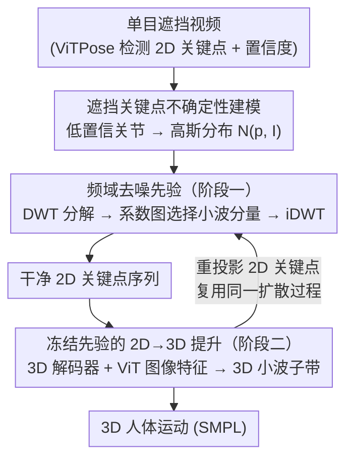

# Occluded Human Body Capture with Frequency Domain Denoising Prior

**会议**: CVPR 2026  
**论文**: [CVF Open Access](https://openaccess.thecvf.com/content/CVPR2026/html/Huang_Occluded_Human_Body_Capture_with_Frequency_Domain_Denoising_Prior_CVPR_2026_paper.html)  
**代码**: https://github.com/boycehbz/FreqMotion  
**领域**: 人体理解 / 3D视觉  
**关键词**: 遮挡人体重建, 频域去噪, 离散小波变换, 扩散模型, 运动捕捉

## 一句话总结
把单目遮挡视频下的 3D 人体运动捕捉重新建模成「小波系数选择」问题：先用高斯分布刻画遮挡关键点的不确定性，再用频域扩散先验在离散小波域里挑出可信系数，从而在长时遮挡下恢复出连贯且保留周期性的人体运动。

## 研究背景与动机
**领域现状**：单目 3D 人体运动捕捉近年进展很快，但绝大多数方法都默认人体可见，没有专门考虑现实中极常见的遮挡场景。少数显式处理遮挡的工作分两类——基于单图的方法（靠人体表示、数据增强、训练策略）和基于视频的方法（学习时域运动先验补全被挡部分）。

**现有痛点**：单图方法缺乏时序约束，结果不可靠；视频方法虽然引入时域先验，但时域一致性在「长时遮挡」下提供的信息不够，往往把运动过度平滑（over-smoothing），丢掉真实的动态细节。

**核心矛盾**：遮挡部位本质上是「信息缺失 + 多解歧义」——一个被挡的 2D 区域可以对应多个合理的 3D 姿态。时域先验只会沿时间轴抹平噪声，无法利用人体运动里更本质的结构信息。

**切入角度**：作者观察到（论文 Fig.1）即便部分遮挡，人体关节（如左右膝）的运动轨迹仍保持**周期性**和**一致的动量**。这种周期与动量在频域里能被自然刻画，于是把问题搬到频域来解。

**核心 idea**：用离散小波变换（DWT）把遮挡运动捕捉表述为「小波系数选择」过程——在频域里学一个去噪先验，从可信的图像观测中挑出有效小波分量、滤掉遮挡引入的噪声，再逆变换回干净运动。相比相位表示和 DCT，DWT 的多尺度分析能抓住**局部周期性**、对非平稳信号（突发动作）和高低频噪声都更鲁棒。

## 方法详解

### 整体框架
方法是一个两阶段、共享同一套扩散过程的频域去噪流水线。输入是一段单目遮挡视频，输出是逐帧的 SMPL 3D 人体运动。先用现成 2D 检测器（ViTPose）拿到关键点和置信度；对置信度低的遮挡关节，不直接信它的坐标，而是用高斯分布建模其不确定性。把可见关键点（可信）和遮挡关键点（采样自分布）拼成完整 2D 序列，经 DWT 分解成多个小波子带，再由一个 transformer 扩散模型逐时间步预测「系数图」来选择有效小波分量、iDWT 重建出干净 2D 关键点（阶段一）。阶段一训完后冻结编码器，把潜在嵌入和子带送进 3D 解码器，在图像特征引导下预测 3D 小波子带、iDWT 得到 3D 运动；再把 3D 关节重投影回 2D，就能用**同一套扩散过程**继续训练 3D 解码器。

### 关键设计

**1. 遮挡关键点不确定性建模：不再盲信被挡关节的坐标**

遮挡会带来严重的像素级歧义，连最强的人体解析模型也给不出可靠语义，而以往方法直接从图像特征或 2D 关键点回归 3D 运动、完全忽略了这种不确定性，于是在遮挡时崩掉。本文对每个关节按置信度分流：高置信的可见关节直接采用其检测坐标；置信度低于阈值的遮挡关节，则用其检测像素坐标 $p_i$ 作为均值、构造高斯分布 $\mathcal{N}(p_i, I)$（$I$ 为单位阵）来表达其不确定性。这样一帧 2D 姿态就被表示成「一组确定坐标 + 一组分布」，后续再用可信关键点去精化这些分布——把「缺失/歧义」显式编码进概率，而不是用一个虚假的点坐标硬填。

**2. 频域去噪先验：把遮挡补全变成小波系数选择**

时域先验在长时遮挡下信息不足、易过平滑，这是核心痛点。作者改在频域用扩散模型做去噪。前向过程与常规扩散不同：它不是把数据扩散到标准高斯，而是把真值 2D 关键点扩散到前面构造的初始分布 $q(p_t\mid\hat p_0)=p+\sqrt{\hat\alpha_t}(\hat p_0-p)+\sqrt{1-\hat\alpha_t}\,\epsilon$，从而把 2D 检测器的先验知识带进估计；且只对不可信关键点加噪，可信关键点在前向/反向全程保持不变，让模型学会「从可信点推断遮挡点」。每个反向步把含噪 2D 序列 $P$ 沿空间和时间两个维度做 DWT，得到四个子带 $y=\mathrm{cat}(y_{L,L},y_{H,L},y_{L,H},y_{H,H})$；transformer 网络 $F$ 对每个子带回归一张系数图 $m$，通过 Hadamard 积 $\bar y_{h,v}=m_{h,v}\cdot\hat y_{h,v}$ 对小波系数做**逐元素加权选择**，再 iDWT 重建干净关键点、喂给下一个扩散步。与只处理高频带的传统小波滤波不同，作者给每个子带都学系数图，因为遮挡运动里高、低频噪声都有。训练仅用 2D 关键点上的 L1 损失 $L_{keyp}=|P-\hat P|$。DWT 的多尺度特性让它能保留局部周期与时空信息，比直接丢高频的 DCT 更适合「局部遮挡」。

**3. 冻结先验的 2D→3D 提升与联合重投影：让同一套扩散过程也能训 3D 解码器**

直接把噪声 2D 检测提升到 3D 很难——时域 3D 扩散去不掉 2D 检测里的噪声，没有 2D 先验的纯 3D 小波选择又分不清可信信号。作者复用阶段一：冻结编码器参数，把它产出的潜在嵌入 $z$ 和子带连同 ViT 提取的图像特征 $I$ 一起送进 3D 解码器 $D$，预测 3D 运动的小波子带和形状参数 $Y_{h,v},\beta=D(y,z,I)$，再经 $x=\mathrm{iDWT}(Y)$ 还原姿态与平移。关键巧思是**联合重投影**：把 3D 关节投回 2D 图像平面就能产生 2D 关键点，于是阶段一那套频域扩散过程可以原封不动地继续训练 3D 解码器。总损失 $L=L_{smpl}+L_{joint}+L_{verts}+L_{keyp}$ 把 SMPL 参数、3D 关节、顶点位置和重投影关键点的监督叠加起来。冻结先验编码器保证只有可信信号参与 3D 频率预测。

**4. OcMotion 数据集：第一个真实遮挡的视频级 3D 运动基准**

遮挡研究长期缺真实训练数据。作者在图像级遮挡数据集 3DOH50K 基础上补全运动标注，构建了首个**视频级** 3D 遮挡运动数据集 OcMotion：43 段序列、6 个视角、超过 30 万帧（10 FPS），含 SMPL 表示的 3D 运动、2D 姿态和相机参数。对随机抽取的 5K 张图人工标注 2D 姿态，重投影误差仅 7.3 像素。它弥补了 AGORA（合成）、3DOH50K（仅图像）等数据集在「真实物体遮挡 + 视频」上的空白，同时服务训练与评测。

### 损失函数 / 训练策略
阶段一频域先验仅用 2D 关键点 L1 损失 $L_{keyp}=|P-\hat P|$ 训练。阶段二冻结编码器，用 $L=L_{smpl}+L_{joint}+L_{verts}+L_{keyp}$ 训练 3D 解码器，其中 $L_{smpl}=\|[\beta,\theta]-[\hat\beta,\hat\theta]\|_2^2$，$L_{joint}=\|J_{3D}-\hat J_{3D}\|_2^2$，$L_{vert}=\|V_{3D}-\hat V_{3D}\|_2^2$，$L_{keyp}$ 用重投影后的关键点计算。采用 SMPL 6D 旋转表示，姿态 $\theta\in\mathbb{R}^{144}$、平移 $\tau\in\mathbb{R}^3$、形状 $\beta\in\mathbb{R}^{10}$。

## 实验关键数据

> 指标说明：**MPJPE** 平均每关节位置误差（mm，越低越好）；**PA-MPJPE** 刚性对齐（Procrustes）后的 MPJPE；**PVE** 每顶点误差（衡量网格质量）；**Accel.** 加速度误差（衡量运动平滑/抖动）。

### 主实验

OcMotion / 3DPW / 3DPW-OC 上与 SOTA 对比（节选；标 ∗ 为单图方法，† 为显式处理遮挡的方法）：

| 方法 | OcMotion MPJPE↓ | OcMotion Accel.↓ | 3DPW MPJPE↓ | 3DPW-OC MPJPE↓ | 3DPW-OC Accel.↓ |
|------|------|------|------|------|------|
| VIBE | 106.3 | 51.6 | 93.5 | 98.3 | 39.0 |
| TCMR | 112.9 | 23.7 | 95.0 | 90.3 | 8.0 |
| †PhaseMP | 97.8 | 28.8 | 83.5 | 86.4 | 13.4 |
| ScoreHMR | 81.1 | 24.6 | 68.7 | 65.9 | 10.3 |
| GVHMR | 80.6 | 20.5 | – | – | – |
| **Ours (w/o OcMotion 训练)** | **79.2** | **20.1** | **67.3** | **63.1** | **9.1** |

即便不在 OcMotion 上训练，本文在遮挡数据上的关节精度和加速度误差均领先；在非遮挡的 3DPW 上也与 SOTA 持平。Hi4D 双人重遮挡场景同样取得最好结果（MPJPE 61.5 vs. CloseInt 63.1，Accel. 15.6 vs. 19.9）。

### 消融实验

所有配置在 OcMotion 上训练评测，「+」表示在 Temporal Regression 基线上叠加模块：

| 配置 | MPJPE↓ | PA-MPJPE↓ | Accel.↓ | 说明 |
|------|------|------|------|------|
| Temporal Regression（基线） | 51.7 | 37.7 | 28.2 | 直接从图像特征回归 |
| + Ground-Truth Keypoints | 32.5 | 22.2 | 12.5 | 2D 关键点确实提供有效信息（上界） |
| + Predicted Keypoints | 52.3 | 37.7 | 28.2 | 含噪检测反而无增益 |
| + Denoised Keypoints | 51.4 | 37.7 | 23.3 | 时域去噪只压住部分高频抖动 |
| + Denoised Keypoints + DCT | 51.6 | 37.5 | 17.6 | DCT 丢全局高频，细节受损 |
| + Denoised Keypoints + DWT | 49.6 | 36.4 | 18.8 | DWT 抓局部周期，优于 DCT |
| + 3D Diffusion + DWT | 51.0 | 36.9 | 19.8 | 无阶段一先验、类 MotionWavelet |
| + Prior | 49.1 | 36.3 | 18.5 | 频域先验编码器带来更多信息 |
| **+ Prior + 3D Diffusion** | **48.5** | **35.4** | **15.5** | 完整模型，联合重投影再提升 |

### 关键发现
- **频域 + DWT 是涨点关键**：在去噪关键点上，DWT（49.6）明显优于 DCT（51.6），因为遮挡是「局部」现象，DCT 直接砍全局高频会误伤运动细节，而 DWT 的多尺度分析保留局部周期与时空信息。
- **冻结先验比纯 3D 扩散更有效**：「+ 3D Diffusion + DWT」（无阶段一先验）只到 51.0，而引入预训练频域先验后降到 49.1，说明先验编码器的潜在嵌入比直接对含噪 2D 检测做 3D 提升携带更多可用信息。
- **联合重投影闭环再压加速度误差**：完整模型把 Accel. 从 18.5 压到 15.5，时序更连贯，验证了「3D 重投影回 2D、复用同一扩散过程训 3D 解码器」的价值。
- ⚠️ Tab.4 中 DCT 行的 Accel.（17.6）略低于 DWT 行（18.8），但作者主张综合 MPJPE/PA-MPJPE/细节质量看 DWT 更优，此处单看加速度不宜直接下结论。

## 亮点与洞察
- **把遮挡补全转译成「小波系数选择」**：用一张可学习的系数图对每个子带做 Hadamard 加权，等价于在频域里「挑选可信分量、压制遮挡噪声」，这个视角比时域逐帧去噪更贴合人体运动的周期本质——是最让人「啊哈」的设计。
- **非标准前向扩散把检测器先验注入扩散**：把真值扩散到「以检测坐标为均值的初始分布」、且只对不可信点加噪，让可见关键点全程不变，巧妙地把 2D 检测的先验当成扩散锚点，可迁移到任何「部分可信观测 + 部分缺失」的结构化预测任务。
- **一套扩散过程串起 2D 去噪与 3D 提升**：靠重投影把 3D 监督转回 2D，复用阶段一流程训 3D 解码器，省掉为 3D 单独设计扩散框架，工程上很省。

## 局限与展望
- 依赖现成 2D 检测器（ViTPose）的输出与置信度阈值；若检测器在极端遮挡下连可见关节都判错，高斯不确定性建模的「锚点」就不可信。
- 周期性 + 一致动量的先验假设对「locomotion / 重复性动作」最有利，对完全非周期、突发且长时被挡的运动，频域先验能提供的信息上限可能受限（⚠️ 论文未给出这类失败案例的定量分析）。
- OcMotion 由 3DOH50K 扩展、部分严重遮挡帧靠人工调整运动得到，标注本身可能引入偏差；30 万帧但仅 43 段序列，动作多样性相对有限。
- 改进方向：把不确定性建模从各向同性高斯换成可学习的协方差、或引入人-物接触约束，可能在物体遮挡下更准。

## 相关工作与启发
- **vs PhaseMP（相位表示）**: 二者都用频域知识处理遮挡，但 PhaseMP 用傅里叶相位流形 + 测试时优化，难以刻画非平稳信号（突发动作）且有严重深度歧义；本文用 DWT 多尺度分析抓局部周期、且是前馈推理，遮挡数据上精度更高（3DPW-OC MPJPE 63.1 vs 86.4）。
- **vs DCT-based 方法**: DCT 把信号分解为全局频率分量并直接丢高频去噪，但遮挡是局部现象，全局砍高频会误伤细节；DWT 聚焦局部、保留时空信息，消融中 DWT 优于 DCT。
- **vs MotionWavelet（纯 3D 小波）**: 直接在 3D 空间做小波系数选择无法区分可信的图像观测，会与图像不一致；本文从「可信 2D 部分观测」用 2D 频域先验去噪，再提升到 3D，对长时遮挡和高频噪声都更鲁棒。
- **vs 时域视频方法（TCMR / VIBE / ScoreHMR）**: 它们靠时域一致性补全遮挡，长时遮挡下信息不足、易过平滑；本文在频域引入周期信息，加速度误差更低、运动更连贯。

## 评分
- 新颖性: ⭐⭐⭐⭐⭐ 把遮挡运动捕捉重述为频域小波系数选择，并设计非标准前向扩散注入检测先验，视角新颖且自洽。
- 实验充分度: ⭐⭐⭐⭐ OcMotion/3DPW/3DPW-OC/Hi4D 多基准 + 细致消融，但部分指标（DCT vs DWT 的 Accel.）结论需更谨慎，缺非周期长遮挡的失败分析。
- 写作质量: ⭐⭐⭐⭐ 动机—方法—实验逻辑清晰，公式完整；部分符号（系数图/子带拼接）初读需对照图理解。
- 价值: ⭐⭐⭐⭐⭐ 同时贡献了方法与首个真实遮挡视频级 3D 数据集 OcMotion，对遮挡人体重建社区有长期价值。

<!-- RELATED:START -->

## 相关论文

- [\[CVPR 2026\] Spatial-Frequency Collaborative Learning for Occluded Visible-Infrared Person Re-Identification](spatial-frequency_collaborative_learning_for_occluded_visible-infrared_person_re.md)
- [\[CVPR 2026\] SAM 3D Body: Robust Full-Body Human Mesh Recovery](sam_3d_body_robust_full-body_human_mesh_recovery.md)
- [\[CVPR 2026\] Bézier Degradation Modeling for LiDAR-based Human Motion Capture](bézier_degradation_modeling_for_lidar-based_human_motion_capture.md)
- [\[CVPR 2026\] HUM4D: A Dataset and Evaluation for Complex 4D Markerless Human Motion Capture](hum4d_markerless_motion_capture.md)
- [\[CVPR 2026\] PAMotion: Physics-Aware Motion Generation for Full-Body Interaction with Multiple Objects](pamotion_physics-aware_motion_generation_for_full-body_interaction_with_multiple.md)

<!-- RELATED:END -->
