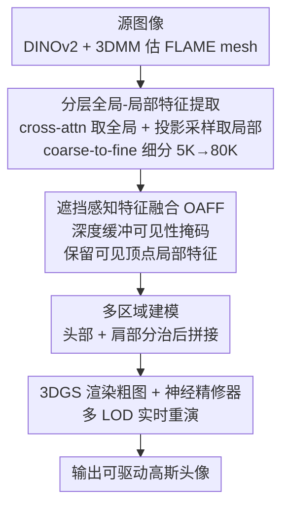

# OMG-Avatar: One-shot Multi-LOD Gaussian Head Avatar

**会议**: CVPR 2026  
**论文**: [CVF Open Access](https://openaccess.thecvf.com/content/CVPR2026/html/Ren_OMG-Avatar_One-shot_Multi-LOD_Gaussian_Head_Avatar_CVPR_2026_paper.html)  
**代码**: 待确认  
**领域**: 3D视觉 / 数字人  
**关键词**: 高斯头部化身、单图重建、多 LOD、遮挡感知融合、coarse-to-fine

## 一句话总结
OMG-Avatar 用单张图在 0.2 秒内重建一个可驱动的 3D 高斯头部化身，通过「由粗到细的分层特征提取 + 深度缓冲引导的遮挡感知融合 + 头肩分治建模」，让同一个统一模型在运行时动态切换细节级别（LOD），在更少高斯点数下同时拿到 SOTA 的重建质量和 85 FPS 的实时速度。

## 研究背景与动机

**领域现状**：从单图重建可驱动的 3D 头像是数字人、虚拟会议、元宇宙的核心技术。2D 路线（GAN warping、扩散模型）画质不错但缺乏 3D 约束、大姿态下多视角不一致且算力开销大；3D 路线里 3DGS（3D Gaussian Splatting）凭渲染速度成为主流，已有 GAGAvatar、LAM、Avat3r 等单图前馈方法。

**现有痛点**：现有单图高斯头像方法都各有结构性缺陷——GAGAvatar 从背景双升降平面采样高斯点，冗余且低效；LAM 把细分后的全部顶点（约 80K）都拿去做 cross-attention，计算复杂度随细分级数指数增长；Avat3r 依赖额外的 3D GAN 做 3D lifting，引入误差累积。更关键的是，它们都无法在推理时动态调整计算量去适配不同硬件和速度需求。

**核心矛盾**：质量与效率的根本矛盾在于「高分辨率几何 = 高顶点数 = 高昂的 2D→3D 特征映射开销」。若直接在高分辨率 mesh 上做特征映射，算力爆炸；若在低分辨率上做，又丢失高频细节。此外 FLAME 这类 3DMM 本身不覆盖肩部，导致非头部区域重建模糊。

**本文目标**：用一个统一模型实现 (1) 单图前馈、(2) 运行时可调的多 LOD 渲染、(3) SOTA 质量 + 实时速度、(4) 头肩完整。

**切入角度**：作者观察到「高分辨率几何可以由低分辨率几何通过细分（subdivision）渐进得到」，于是把昂贵的全局特征提取放在低分辨率（5K 顶点）做一次，再通过廉价的细分 + 投影采样把特征逐级搬运到高分辨率，天然支持多 LOD。

**核心 idea**：用「低分辨率提全局特征 + 投影采样补局部细节 + coarse-to-fine 细分」替代「高分辨率上直接做 cross-attention」，并用深度缓冲做遮挡感知融合保证可见性正确。

## 方法详解

### 整体框架
给定一张源图像，OMG-Avatar 先用 DINOv2 提取局部特征 $F_{local}$ 和身份特征 $F_{id}$，再用 3DMM modeler 估出 FLAME 头部 mesh（初始 $N_0=5023$ 顶点）。随后两路并行取特征：投影采样模块（HPFS）把 mesh 投到图像平面、在对应像素做双线性采样得到局部特征；全局特征则用 FLAME 位置编码当 query、做 cross-attention 得到。两路特征在遮挡感知融合模块（OAFF）里被深度缓冲引导着融合，保证可见性正确。头部与肩部用共享特征**分别**预测高斯属性再拼接，最后用 3DGS 渲染出粗特征图、再过一个 UNet 神经精修器（Neural Refiner）输出高质量图像。训练时沿用 coarse-to-fine：把 mesh 和特征逐级细分（$K=2$，最终 79,936 顶点），让网络由粗到细地感知层次细节。

### 关键设计

**1. 分层全局-局部特征提取与 coarse-to-fine 细分：把昂贵的全局计算锁在低分辨率，再廉价升采样**

这一步直接针对「高分辨率直接做特征映射算力爆炸」的痛点。作者只在初始 $N_0=5K$ 顶点上做一次 cross-attention 提全局特征 $F^{GS_0}_{global}$（FLAME 每个顶点配可学习位置编码当 query），用一个 MLP $\Psi_{offset}$ 预测顶点偏移精修头部 mesh：$T_p = T + B_S + B_P + B_E + \Psi_{offset}(F^{GS_0}_{global})$。随后用细分算子 $\Phi$ 把全局特征和顶点逐级升采样 $F^{GS_{k+1}}_{global},V_{k+1}=\Phi(\Psi_k(F^{GS_k}_{global}),V_k)$，局部特征则在每一级通过相机投影 $P$ 在 $F_{local}$ 上重新采样 $F^{GS_k}_{local}=Sampling(P(V_k),F_{local})$。相比 LAM 在全部 80K 顶点上做 cross-attention，OMG-Avatar 只在 5K 上做注意力、用廉价的细分+采样把分辨率推到 80K，显存和算力大幅下降；同一套权重在不同细分级停下来就是不同 LOD，天然支持运行时调速。

**2. 遮挡感知特征融合（OAFF）：用深度缓冲挡掉被遮挡顶点的污染局部特征**

投影采样有个隐患：可见顶点采到的局部特征是准的，但被遮挡顶点投到图像上采到的其实是「挡在它前面那块」的特征，是错的。作者用光栅化时的深度缓冲构造可见性掩码：对每个顶点 $v_i$ 比较其相机空间深度 $z_i$ 与深度缓冲记录的 $\hat z_i$，$z_i=\hat z_i$ 记可见（$M^{GS_k}_i=1$），$z_i>\hat z_i$ 记遮挡（$M^{GS_k}_i=0$）。融合时只把可见顶点的局部特征加进来：$F^{GS_k}_h=F^{GS_k}_{global}+F^{GS_k}_{local}\odot M^{GS_k}$。这样遮挡区域只靠语义性强的全局特征推断出合理外观（虽缺高频细节但不会被错误局部特征带偏），可见区域则享受局部特征的高频细节。消融显示去掉局部特征后 CSIM 从 0.869 掉到 0.429，去掉全局特征同样掉到 0.429——两路缺一不可。

**3. 多区域建模（头肩分治）：补上 FLAME 不覆盖的肩部**

FLAME 没有肩部顶点，导致先前方法肩部模糊。作者对源图做分割得到肩部掩码 $M_s$（实现上用底部人像掩码与深度缓冲掩码作差，不需外接分割模型），把 $F_{local}$ 过一个卷积网络生成特征平面、各通道编码高斯属性，再用掩码抠出肩部参数：$c_s,o_s,s_s,r_s,O_s=\text{Flatten}(\text{Conv}(F^{GS}_{local})\odot M_s)$；肩部 3D 点在图像对齐平面上生成 $p_s=\hat p_s+O_s\cdot n_s$。最后把头部高斯集 $H$ 和肩部高斯集 $S$ 沿属性维拼接成完整集合 $G=H\cup S$。肩部平均约 9K 个高斯点。

**4. 神经精修与实时重演：只更新位置即可重演，UNet 补回高频**

重演时给定驱动图，用 3DMM estimator 抽表情/姿态参数，与源图身份参数组合生成新 FLAME 顶点、再细分得到最终头部位置 $p_h$。关键在于**重演只需更新高斯参数集 $G$ 里的位置分量 $p_h$**（颜色/不透明度/尺度/旋转都复用），因此能实时渲染动画。渲染端不直接出 RGB，而是出多通道特征图（前 3 通道是粗 RGB $I_c$），再用 UNet 神经精修器细化成最终图 $I_r$；消融显示精修器对牙齿、抬眉时的额头皱纹等表情相关细节贡献明显。

### 损失函数 / 训练策略
在大规模人像视频 VFHQ 上自监督训练：每个视频随机采两帧，一帧当源、一帧当驱动，目标是让输出贴近驱动帧。总损失对粗图 $I_c$ 和精修图 $I_r$ 同时计算 L2 + SSIM + 感知损失，外加约束 FLAME 顶点偏移的正则项：$L=\lambda_1 L_2 + \lambda_2 L_{SSIM} + \lambda_3 L_{percep} + \lambda_4 L_{reg}$，其中 $L_{reg}=\|offset\|_2$。取 $\lambda_1=10,\lambda_2=1,\lambda_3=\lambda_4=0.1$；单卡 A100 训 6 epoch，细分级随训练阶段逐步增大；DINOv2 与 3DMM estimator 冻结。

## 实验关键数据

数据集：训练用 VFHQ（766,263 帧 / 15,204 片段），测试用官方 split（50 视频 2,500 帧）；并在 HDTF（19 序列）上做零样本泛化测试。指标含 PSNR/SSIM/LPIPS（重建质量），CSIM（身份一致性，源与重演脸的人脸识别特征余弦距离），AED（平均表情距离）、APD（平均姿态距离）、AKD（平均关键点距离，用人脸 landmark 衡量运动控制精度）。

### 主实验（VFHQ，自重演 + 跨身份重演节选）

| 方法 | 高斯点数 | PSNR↑ | SSIM↑ | LPIPS↓ | CSIM↑ | AED↓ |
|------|---------|-------|-------|--------|-------|------|
| GAGAvatar | 180K | 21.83 | 0.818 | 0.122 | 0.816 | 0.111 |
| LAM | 80K | 22.65 | 0.829 | 0.109 | 0.822 | 0.102 |
| **Ours (Sub #2)** | ~80K | **22.72** | **0.831** | **0.091** | **0.869** | **0.088** |
| **Ours (Sub #1)** | ~29K | 22.68 | 0.830 | 0.094 | 0.858 | 0.089 |
| Ours (Sub #0) | ~5K | 22.18 | 0.817 | 0.102 | 0.855 | 0.134 |

关键看点：低分辨率 LOD（Sub #1，仅 29K 高斯点）就已在 PSNR/SSIM/LPIPS/CSIM 上全面超过 LAM（80K）和 GAGAvatar（180K），用 1/3~1/6 的高斯点拿到更好结果，验证分层特征提取+融合的有效性。在 HDTF 上 Sub #2 把 LPIPS 从 LAM 的 0.097 进一步压到 0.061，泛化也很强。

### 效率对比（重演速度 FPS，100 帧平均）

| 方法 | A100 FPS | RTX 4090 FPS |
|------|----------|--------------|
| GAGAvatar | 67.12 | — |
| LAM（无神经渲染） | 280 | — |
| **Ours Sub #2** | **85.94** | **126.44** |
| Ours Sub #1 | 148.04 | — |
| Ours Sub #0 | 152.57 | — |

OMG-Avatar 在带神经渲染的方法里速度最高（85 FPS@A100、126 FPS@4090）；LAM 虽然 280 FPS 更快但不带神经渲染、几何细节与动态纹理更差。⚠️ 表中 Sub 各档 FPS 顺序以原文为准（LOD 越低越快）。

### 消融实验（VFHQ）

| 配置 | PSNR↑ | SSIM↑ | LPIPS↓ | CSIM↑ |
|------|-------|-------|--------|-------|
| w/o Global Feature | 20.85 | 0.796 | 0.121 | 0.429 |
| w/o Local Feature | 21.21 | 0.802 | 0.128 | 0.429 |
| w/o Refiner | 21.42 | 0.809 | 0.115 | 0.842 |
| w/o Shoulder | 22.42 | 0.828 | 0.099 | 0.867 |
| **Ours (full)** | **22.72** | **0.831** | **0.091** | **0.869** |

### 关键发现
- 全局/局部特征**缺一不可**：任去其一，CSIM 都从 0.869 暴跌到 0.429；去局部丢身份细节，去全局则在眼睛、嘴等动态区域出现与源图不一致的伪影。
- 细分到 2 级后**性能饱和**：作者归因于 DINOv2 特征图分辨率限制（296×296 的特征网格约 88K，超过 80K 顶点的投影采样无法再恢复更多几何细节），更高分辨率特征才可能进一步提升。
- 神经精修器主要补高频表情细节（牙齿、皱纹），去掉后 LPIPS 从 0.091 升到 0.115。

## 亮点与洞察
- **「低分辨率算一次 + 细分搬运」的算力分配很巧**：把 cross-attention 这个最贵的操作锁死在 5K 顶点、其余靠廉价细分+投影采样升采样，既省算力又天然得到多 LOD——同一套权重在不同细分级停下来就是不同档位，不需要训多个模型。
- **深度缓冲当可见性门控**：用渲染天然产物（depth buffer）做遮挡掩码，几乎零额外成本就解决了投影采样在遮挡区采错特征的老问题，思路可迁移到任何「mesh 投影到图像采特征」的场景。
- **重演只动位置分量**：颜色/不透明度/尺度/旋转全复用、只更新高斯位置 $p_h$，是实时重演的关键工程取舍。
- **肩部掩码免外接分割**：用人像掩码与深度缓冲掩码作差得到肩部 mask，省掉一个语义分割模型，是个实用的小 trick。

## 局限与展望
- 作者承认依赖 FLAME 先验和准确的 3DMM 跟踪，而 FLAME 抓不到舌头运动、头发形变等精细动态，限制了化身表现力。
- 仅在单目视频上训练，对大视角变化（>60°）鲁棒性差，会出现明显伪影；作者计划引入多视角数据集增强空间理解。
- ⚠️ 自己看：细分到 2 级即饱和的瓶颈被归到 DINOv2 特征分辨率，若换更高分辨率 backbone 算力优势是否还在、是否会重新逼近 LAM 的开销，值得验证。
- 头肩分治后两区域接缝处的一致性、以及肩部点在大幅肩部运动下的稳定性，论文未深入分析。

## 相关工作与启发
- **vs LAM**：LAM 把 80K 细分顶点全拿去 cross-attention，复杂度随细分级指数增长；OMG-Avatar 只在 5K 上做注意力、靠细分升采样，用 29K 高斯点就反超 LAM 的 80K，效率与质量双赢。
- **vs GAGAvatar**：GAGAvatar 从背景双升降平面采样高斯点导致冗余（180K 点）；本文用 mesh 锚定 + 投影采样，点数更省、质量更高。
- **vs LODAvatar**：LODAvatar 也做 LOD 但不支持面部动画（不可驱动）；本文在支持 LOD 的同时实现可驱动的实时重演。
- **vs Avat3r**：Avat3r 靠额外 3D GAN 做 3D lifting 引入误差累积；本文直接前馈，0.2s 完成重建。

## 评分
- 新颖性: ⭐⭐⭐⭐ coarse-to-fine 多 LOD + 深度缓冲遮挡融合的组合很扎实，但各组件多为已有思路的精巧整合
- 实验充分度: ⭐⭐⭐⭐⭐ 两数据集、11 个 baseline、多 LOD/效率/消融全覆盖，结论自洽
- 写作质量: ⭐⭐⭐⭐ 方法叙述清晰、公式完整，图示丰富
- 价值: ⭐⭐⭐⭐ 实时 + 可调 LOD + 单图，对落地部署（不同硬件适配）实用价值高

<!-- RELATED:START -->

## 相关论文

- [\[CVPR 2026\] Avatar Forcing: Real-Time Interactive Head Avatar Generation for Natural Conversation](avatar_forcing_real-time_interactive_head_avatar_generation_for_natural_conversa.md)
- [\[CVPR 2026\] SyncDreamer: Controllable and Expressive Avatar Generation Beyond the Talking Head](syncdreamer_controllable_and_expressive_avatar_generation_beyond_the_talking_hea.md)
- [\[CVPR 2025\] FATE: Full-head Gaussian Avatar with Textural Editing from Monocular Video](../../CVPR2025/human_understanding/fate_full-head_gaussian_avatar_with_textural_editing_from_monocular_video.md)
- [\[CVPR 2026\] AVATAR: Reinforcement Learning to See, Hear, and Reason Over Video](avatar_reinforcement_learning_to_see_hear_and_reason_over_video.md)
- [\[CVPR 2026\] LCA: Large-scale Codec Avatars - The Unreasonable Effectiveness of Large-scale Avatar Pretraining](lca_large-scale_codec_avatars_the_unreasonable_effectiveness_of_large-scale_avata.md)

<!-- RELATED:END -->
