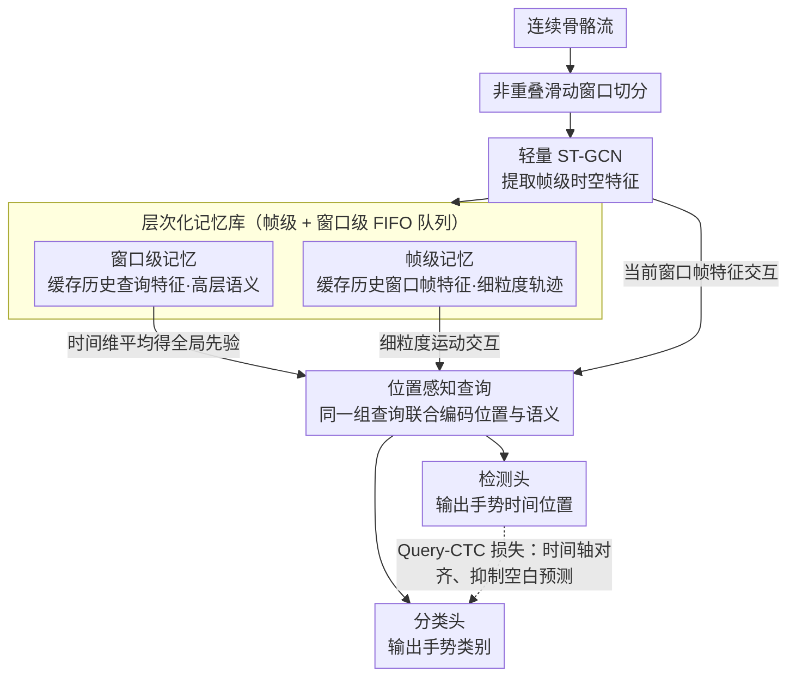

# OMG-Bench: A New Challenging Benchmark for Skeleton-based Online Micro Hand Gesture Recognition

**会议**: CVPR 2026  
**arXiv**: [2512.16727](https://arxiv.org/abs/2512.16727)  
**代码**: [项目页面](https://omg-bench.github.io/)  
**领域**: 人体理解 / 手势识别  
**关键词**: 微手势识别, 在线手势识别, 骨骼数据, 层次记忆, VR/AR交互

## 一句话总结

本文构建了首个大规模公开的基于骨骼数据的在线微手势识别基准OMG-Bench（40类、13948个实例），并提出HMATr框架，通过层次化记忆库和位置感知查询实现检测-分类的端到端统一，在检测率上超越SOTA方法7.6%。

## 研究背景与动机

**领域现状**：随着Meta Quest、PICO等头显设备上手部姿态估计技术的成熟，基于骨骼数据的手势识别在VR/AR交互中越来越重要。当前研究主要关注宏观手势（大幅度动作），使用滑动窗口+分类或两阶段检测-分类方案。

**现有痛点**：（1）**数据集问题**：现有数据集规模小（如SHREC'22仅288序列、1152实例）、骨骼质量差（使用过时的单视角手部姿态估计器）、动态性不足（手势间有明显时间间隔，不反映真实连续交互场景）。（2）**微手势空白**：宏观手势长时间使用会导致手臂肌肉疲劳，微手势更适合长时交互，但目前没有公开的基于骨骼的微手势数据集。（3）**算法局限**：两阶段方法无法端到端优化；CTC方法对微弱信号易产生空白预测；滑动窗口对超参数敏感，非重叠窗口可能截断手势，重叠窗口导致冗余计算。

**核心矛盾**：微手势的三大挑战——类间差异细微（如拇指碰食指尖 vs 碰中指尖）、动态快速（平均持续仅0.57秒）、时间长度差异大——使得现有方法的设计难以应对。

**本文目标** （1）构建高质量的大规模微手势基准数据集；（2）设计一个端到端框架统一检测和分类，解决窗口截断和跨窗口上下文不足的问题。

**切入角度**：在数据端，利用多视角自监督手部姿态估计+半自动标注pipeline保证质量和规模；在算法端，借鉴目标检测中query机制的思路，用可学习查询统一检测和分类。

**核心 idea**：构建首个在线微手势基准，并提出层次化记忆增强Transformer，通过帧级和窗口级记忆库保持跨窗口上下文连续性，用位置感知查询隐式编码手势时空信息。

## 方法详解

### 整体框架

HMATr 要解决的是流式场景下的一个根本矛盾：微手势平均只持续 0.57 秒、信号微弱，可在线识别又必须把骨骼流切成一个个短窗口逐窗处理——窗口一旦切窄就会把手势从中间截断，切宽又带来重叠冗余和延迟。它的做法是用非重叠窗口逐窗推理，但额外挂一套"记忆"把历史窗口的信息带过来，从而既不重叠又不丢上下文。

整条流水线是：连续骨骼流先按非重叠滑动窗口切分，每个窗口送进轻量级 ST-GCN 提取帧级时空特征；这些特征不仅参与当前窗口的识别，还要和层次化记忆库（帧级 + 窗口级两层历史缓存）交互，把"前几个窗口发生了什么"补进来；最后一组位置感知可学习查询同时吃下记忆和当前帧特征，经检测头和分类头直接输出每个手势的时间位置与类别。整个检测—分类不再分两阶段，而是由查询一次性端到端完成。

### 关键设计

**1. 层次化记忆库：让非重叠窗口也能看到历史**

非重叠窗口的好处是无冗余、低延迟，代价是每个窗口都是"失忆"的——一个跨窗口的手势被切成两半后，后半个窗口看不到前半段在做什么。层次化记忆库就是为这个缺口设计的，它维护两个定长 FIFO 队列把历史信息缓存下来：帧级记忆 $\mathcal{M}_f \in \mathbb{R}^{B \times L_f \times C}$ 存最近历史窗口的帧级骨骼特征，保留手指运动轨迹这类细粒度时空细节；窗口级记忆 $\mathcal{M}_w \in \mathbb{R}^{B \times L_w \cdot N \times C}$ 存历史查询特征，是被压缩过的高层语义抽象。每来一个新窗口就追加新特征、淘汰最早的，队列长度固定（$L_f=16$, $L_w=3$）。

之所以要两层而不是一层，是因为微手势的持续时长差异很大，单一粒度顾不过来：帧级记忆回答"刚才到底发生了什么动作"，提供原始证据；窗口级记忆回答"这些动作意味着什么手势"，提供抽象语义。两者一个管细节、一个管语义，配合起来才能同时应付快速短手势和稍长手势。消融里去掉双层记忆后 DR 直接掉 5.8%，是所有模块里影响最大的。

**2. 位置感知查询：用一组查询同时干检测和分类**

传统做法把"什么时候有手势"（检测）和"是哪个手势"（分类）拆成两阶段，既不能端到端优化，检测精度还会成为分类的天花板。但微手势里这两件事其实强耦合——要定位手势得靠类别线索把有效动作和无意义晃动区分开，要分类又得靠精确定位才能抓住关键动作段。位置感知查询就把它们合到一组可学习查询上联合编码。

具体来说，查询先用窗口级记忆初始化以获得历史先验：把 $\mathcal{M}_w^t$ 沿时间维度平均得到全局记忆查询 $Q_m^t$，加到当前窗口的查询上。带着这份先验，查询再分别与帧级记忆交互（取细粒度运动信息）、与当前窗口帧特征交互（取当下观察），最后由检测头和分类头从同一组查询里读出手势的时间位置和类别。因为位置和语义被编码进了同一个载体，检测与分类得以共享表示、互相约束，比解耦的两阶段方案更优雅也更准。

**3. Query-CTC 损失：别让微弱信号被预测成空白**

微手势信号短而弱，纯 CTC 这类时序对齐损失很容易"摆烂"，干脆把整段预测成空白 token。HMATr 在标准的二分匹配损失（分类交叉熵 + 位置 L1/IoU）之外，再加一项基于 query 的 CTC 损失，强制预测手势与 GT 在时间轴上对齐。关键在于它不是裸用 CTC，而是把 CTC 接到 query 机制上——借助查询里已经编码好的语义信息辅助对齐，从而在快速连续的微手势上仍能稳定出非空白预测。消融中去掉这一项 DR 掉 1.9%，验证了它对微弱信号的兜底作用。

### 损失函数 / 训练策略

总损失为 $\mathcal{L} = \lambda_{cls} \mathcal{L}_{cls} + \lambda_{pos} \mathcal{L}_{pos} + \lambda_{q-CTC} \mathcal{L}_{q-CTC}$，其中 $\lambda_{cls}=2$, $\lambda_{pos}=5$, $\lambda_{q-CTC}=0.2$。分类损失使用交叉熵，位置损失结合L1和IoU，未匹配查询归为背景类。使用Adam优化器，batch size=64，学习率0.001，weight decay=0.0004。

## 实验关键数据

### 主实验

| 方法 | 类型 | DR↑ | FP↓ | JI↑ | NLD↑ | 推理时间(ms)↓ | 平均延迟(帧)↓ |
|------|------|-----|-----|-----|------|-------------|------------|
| **HMATr (Ours)** | 端到端 | **89.2%** | **0.22** | **0.71** | **0.77** | **1.61** | **7.67** |
| HiOD | 滑窗离线 | 81.2% | 0.29 | 0.66 | 0.70 | 72.44 | 8.66 |
| Bound.Reg. | 边界监督 | 81.6% | 0.37 | 0.59 | 0.61 | 22.64 | 8.82 |
| AG-MAE | 边界监督 | 80.7% | 0.28 | 0.65 | 0.72 | 2.36 | 8.25 |
| BlockGCN | 滑窗离线 | 78.3% | 0.32 | 0.66 | 0.65 | 7.83 | 7.89 |

在SHREC'22上的泛化性：

| 方法 | DR↑ | FP↓ | JI↑ |
|------|-----|-----|-----|
| HMATr | **0.85** | **0.08** | **0.79** |
| AG-MAE | 0.82 | 0.13 | 0.74 |
| DSTA | 0.77 | 0.11 | 0.71 |

### 消融实验

| 配置 | DR↑ | FP↓ | JI↑ | NLD↑ |
|------|-----|-----|-----|------|
| Full HMATr | **89.2%** | **0.22** | **0.71** | **0.77** |
| w/o 帧级记忆 | 85.7% | 0.26 | 0.67 | 0.73 |
| w/o 窗口级记忆 | 86.1% | 0.25 | 0.68 | 0.74 |
| w/o 双层记忆 | 83.4% | 0.30 | 0.63 | 0.70 |
| w/o query-CTC损失 | 87.3% | 0.24 | 0.69 | 0.75 |

### 关键发现
- HMATr在四个指标上全面超越所有对比方法，检测率提升7.6%（相对Bound.Reg.），同时推理速度最快（1.61ms）、延迟最低（7.67帧）
- 层次化记忆贡献显著：去掉双层记忆后DR下降5.8%，说明跨窗口上下文对微手势识别至关重要
- 帧级记忆和窗口级记忆都有独立贡献，证明多粒度设计的必要性
- 非重叠窗口+记忆机制避免了重叠窗口的冗余计算，同时保持了上下文连续性

## 数据集亮点
- **OMG-Bench数据集规模**：40类微手势、18位受试者、1272个序列、13948个实例，远超之前最大的SHREC'22（16类、288序列、1152实例）
- **数据质量**：多视角自监督手部姿态估计，平均关节位置误差仅2.78mm，显著优于商用单视角方案
- **挑战性统计**：平均手势持续仅0.57秒、连续同类手势占比27.60%（SHREC'22仅0.09%）、归一化关节位移仅8.95（SHREC'22为128.73），真正反映了微手势的"微"

## 亮点与洞察
- **多视角自监督+半自动标注pipeline**：解决了微手势数据集构建中骨骼质量差和标注困难的痛点，这一pipeline具有通用性
- **记忆机制替代重叠窗口**：既避免了冗余计算，又保持了跨窗口上下文——在效率和性能间找到了更好的平衡点
- **统一检测-分类**：利用手势时间位置与类别的强相关性，比两阶段方案更优雅且更有效

## 局限与展望
- 目前仅支持单手微手势，双手交互、手-物交互场景未覆盖
- 40类手势主要是拇指与其他手指的交互，未包含掌面手势或空间轨迹手势
- 记忆库长度（$L_f=16$, $L_w=3$）是固定的，对于不同节奏的交互场景可能需要自适应调整
- 数据集规模虽然远超前作，但18位受试者的多样性仍有限

## 相关工作与启发
- **vs SHREC'22**: OMG-Bench在规模(12×)、质量(多视角)、挑战性(微手势)上全面超越
- **vs STMG**: 首个骨骼微手势方法，仅用拇指和食指的7类手势。本文用全手21关节、40类手势，难度更大
- **vs OO-dMVMT**: 边界监督方法，本文在DR上高8.1%，归功于统一查询机制和层次记忆
- 该数据集pipeline可迁移到其他细粒度动作识别场景（如手术操作识别、手语识别）

## 评分
- 新颖性: ⭐⭐⭐⭐ 数据集和方法都有创新，微手势识别方向填补了重要空白
- 实验充分度: ⭐⭐⭐⭐⭐ 多个SOTA方法对比、消融实验、跨数据集泛化、效率分析非常全面
- 写作质量: ⭐⭐⭐⭐ 结构清晰，数据集统计分析详尽，方法动机阐述到位
- 价值: ⭐⭐⭐⭐ 作为benchmark贡献价值高，数据集将推动VR/AR微手势交互研究

<!-- RELATED:START -->

## 相关论文

- [\[AAAI 2026\] New Synthetic Goldmine: Hand Joint Angle-Driven EMG Data Generation Framework for Micro-Gesture Recognition](../../AAAI2026/human_understanding/new_synthetic_goldmine_hand_joint_angle-driven_emg_data_generation_framework_for.md)
- [\[CVPR 2026\] Active Inference for Micro-Gesture Recognition: EFE-Guided Temporal Sampling and Adaptive Learning](active_inference_for_micro-gesture_recognition_efe-guided_temporal_sampling_and_.md)
- [\[CVPR 2026\] Miburi: Towards Expressive Interactive Gesture Synthesis](miburi_towards_expressive_interactive_gesture_synthesis.md)
- [\[CVPR 2026\] OpenFS: Multi-Hand-Capable Fingerspelling Recognition with Implicit Signing-Hand Detection and Frame-Wise Letter-Conditioned Synthesis](openfs_multi-hand-capable_fingerspelling_recognition_with_implicit_signing-hand_.md)
- [\[CVPR 2026\] HandDreamer: Zero-Shot Text to 3D Hand Model Generation](handdreamer_zero_shot_text_to_3d_hand_model_generation.md)

<!-- RELATED:END -->
