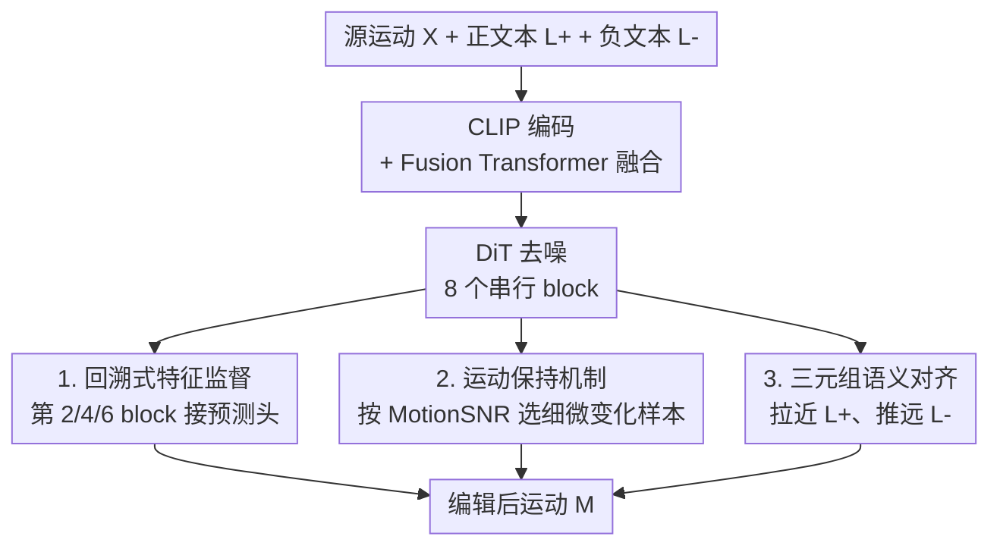

# Omni-Supervised Motion Editing: Balancing Change and Invariance through Positive-Negative Learning

**会议**: CVPR 2026  
**论文**: [CVF Open Access](https://openaccess.thecvf.com/content/CVPR2026/html/Shi_Omni-Supervised_Motion_Editing_Balancing_Change_and_Invariance_through_Positive-Negative_Learning_CVPR_2026_paper.html)  
**代码**: https://github.com/rocket-ycyer/OmniME  
**领域**: 人体理解 / 文本驱动运动编辑 / 扩散模型  
**关键词**: 运动编辑, 正负监督, 回溯特征监督, 运动保持, 三元组对齐

## 一句话总结
OmniME 针对文本驱动的人体运动编辑，把监督拆成"正监督"（回溯式中间层特征监督 + 基于相似度的运动保持）和"负监督"（三元组语义对齐）两条互补支路，在一个扩散框架里同时约束"该改的地方改、不该动的地方不动"，在 MotionFix 和 STANCE Adjustment 上把平均检索排名（AvgR）分别从 20.88 降到 13.06、29.05 降到 22.77。

## 研究背景与动机
**领域现状**：文本驱动的人体运动编辑要做的事是——给定一段源运动 $X$ 和一句自然语言指令 $L$（如"第二次重复时做得快一点"），生成符合指令语义、但又保留未提及部分的目标运动 $M=G(X,L)$。当前主流做法是基于扩散模型（diffusion）做条件生成，把源运动和文本一起作为条件喂进去去噪。

**现有痛点**：现有扩散类方法要么用粗粒度的全局条件（global conditioning），容易把细粒度语义"糊掉"——指令说"手抬到肩膀高度"，模型却顺手把整个动作幅度都改了；要么走启发式的相似度线索做局部编辑，但局部硬改又容易破坏运动的时间连贯性，产生抖动或物理上不合理的姿态。论文点名两个 baseline：MotionFix 缺少显式区分"可编辑区/不可编辑区"的机制；SimMotionEdit 引入了基于相似度的辅助监督，缓解了运动保持问题，但在层级对齐和语义一致性上仍然受限。

**核心矛盾**：运动编辑的根本难点是 **change 与 invariance 的权衡**——既要按文本精确修改目标区域（change），又要原封不动地保留未编辑区域以维持时序连贯和真实感（invariance）。这两个目标天然冲突：偏向 change 就伤连贯，偏向 invariance 就改不动。论文用一个保留因子 $m\in[0,1]^F$ 把这个权衡写成 $M = m\odot X + (1-m)\odot\tilde{X}$，显式表达"每一帧有多少来自源、多少来自编辑内容"。

**切入角度与核心 idea**：作者的关键观察是——以往方法只用了"正监督"（让生成结果靠近目标），却忽略了"负监督"（明确告诉模型什么是错的语义）。于是 OmniME 把监督一分为二：**正监督支路**负责"改对 + 保住"，**负监督支路**负责"语义别跑偏"，二者合成一个"全监督（omni-supervised）"系统，在特征层、运动层、语义层三个层级同时施加约束。

## 方法详解

### 整体框架
OmniME 是一个扩散式运动编辑器，骨架是"Fusion Transformer（融合）→ Diffusion Transformer / DiT（去噪）"。输入是源运动 + 正文本（指令）+ 随机采样的负文本，输出是编辑后运动。整体流程：正/负文本先经 CLIP（ViT-L/14）编码成语义特征；源运动与正文本特征经 4 层 Fusion Transformer 融合成 fused info；融合特征送入由 **8 个串行 transformer block** 组成的 DiT 做扩散去噪。在这条主干上挂三套额外监督——它们不改网络结构，只改训练时的监督信号，这正是"omni-supervised"的含义。

具体地：① DiT 的第 2、4、6 个 block 各挂一个轻量预测头，用对应的 ground-truth 目标运动做中间层监督（回溯式特征监督）；② 在数据侧先算源-目标的逐帧相似度，筛出"只发生细微变化"的样本，对这些样本额外加一个保留损失（运动保持）；③ 取 DiT 最后一层的运动嵌入，和正/负文本嵌入做三元组损失（语义对齐）。最终目标是扩散损失 + 分类损失 + 这三个辅助损失的加权和。

### 关键设计

**1. 回溯式特征监督：让中间层也对齐目标，稳住优化**

痛点是扩散 transformer 只在最后一层监督，中间表示放任自流，训练时容易在浅层就跑偏，导致运动失稳。OmniME 沿用 SimMotionEdit 的思路，把监督"提前"到中间层：在 DiT 第 $l\in\{2,4,6\}$ 个 block 后接一个轻量投影头 $f^{(l)}(\cdot)$，把隐表示 $h^{(l)}\in\mathbb{R}^{B\times T\times D}$ 映射回运动空间 $\hat{x}^{(l)}=f^{(l)}(h^{(l)})$，再与真值目标运动 $x$ 算逐帧 MSE：$L^{(l)}=\frac{1}{BTJ}\sum_{b,t}\lVert \hat{x}^{(l)}_{b,t}-x_{b,t}\rVert_2^2$。

聚合方式是"回溯（retrospective）"的关键：先把第 2/4/6 层的损失加权平均，再和第 8 层（最终重建损失）组合，即 $L_{\text{retro}}=\sum_{l\in\{2,4,6\}}\lambda_l L^{(l)}$ 与最终层结合。这样保证**最后一层仍是主监督信号**，中间层只是"渐进地把表示往目标分布上拽"，从而提升优化稳定性，引导模型学到从细到粗（fine-to-coarse）的编辑-目标对应。

**2. 运动保持机制：用 MotionSNR 挑出"只动一点点"的样本重点保住**

痛点是"哪些帧该原样保留"没有显式信号，全局监督会把本该不变的帧也一起重写。OmniME 不靠人工 mask，而是从数据里算出来。逐帧相似度分三步：先在旋转空间和关节位置空间用大小为 $W$ 的滑窗算原始相似度 $SR^r_i=-\min_{|i-j|\le W}d_r(x_i,m_j)$，两路加权合成 $SR_i=w_1 SR^r_i+w_2 SR^l_i$；再归一化到 $[0,1]$ 得到尺度无关、平滑的时序相似度曲线；最后算 **MotionSNR**（运动信噪比）$\text{MotionSNR}=\frac{\sum_{x\in TR}x}{\sum_{x\in BR}x}$，其中 $TR$、$BR$ 是按相似度排序的 top-$\kappa$ 和 bottom-$\kappa$ 帧。

MotionSNR 越高，说明编辑后运动和源越一致，即"这个编辑只是细微、局部的改动"。对这类高 SNR 样本（超过阈值 $\tau$）额外加保留损失：$L_{\text{presv}}=\mathbb{I}\big(\text{MotionSNR}(x,m)>\tau\big)\cdot\frac{1}{T}\sum_i\lVert m_i-x_i\rVert_2^2$。直觉是——既然这次编辑本来就改得少，那就让模型把没改的帧老老实实重建回源运动，把注意力集中到学那一点点细微变化上，而不是大刀阔斧乱改。论文给的超参：STANCE 上 $w_1=w_2=1.0$、$\kappa=5$，MotionSNR 阈值 1.5（⚠️ 原文中 $W$ 的取值与 $\tau$ 是否等同 1.5 表述略含糊，以原文为准）。

**3. 三元组语义对齐：用负样本把语义"推开"，强化文本-运动对应**

痛点是只用正监督时，模型只知道"靠近目标"，对"什么是不对的语义"没有概念，导致语义对齐不够锐利。这是 OmniME 的负监督支路。取 DiT 最后一层隐表示 $h^{(L)}$ 做时序均值池化得运动嵌入 $z_m=\frac{1}{T}\sum_t h^{(L)}_t\in\mathbb{R}^{B\times D}$；设 $z_p$ 为对应编辑的正文本特征、$z_n$ 为随机采样的负文本特征，三元组损失为 $L_{\text{triplet}}=\frac{1}{B}\sum_i\big[\lVert z^i_m-z^i_p\rVert_2^2-\lVert z^i_m-z^i_n\rVert_2^2+\alpha\big]_+$，margin $\alpha=0.2$。它把编辑后运动往正文本语义拉近、往无关的负文本推远，让生成结果更贴指令。

### 损失函数 / 训练策略
总损失把扩散主损失、分类损失和三个辅助损失加权相加：

$$L_{\text{total}} = L_{\text{diff}} + \lambda_{\text{cls}}L_{\text{cls}} + \lambda_{\text{retro}}L_{\text{retro}} + \lambda_{\text{preserve}}L_{\text{preserve}} + \lambda_{\text{triplet}}L_{\text{triplet}}$$

权重设置：$\lambda_{\text{retro}}=1$、$\lambda_{\text{triplet}}=0.01$，$\lambda_{\text{preserve}}$ 在 MotionFix 上取 0.2、STANCE 上取 0.1。扩散过程 300 步、cosine 噪声调度，文本/源运动两路条件的 guidance scale 均为 2；Fusion / Diffusion transformer 分别 4 层和 8 层、各 8 头、隐维 512；AdamW、学习率 $1\times10^{-4}$、batch 128，训练 1500 epoch，单张 A6000 上 MotionFix 约 19 小时、STANCE 约 14 小时。

## 实验关键数据

评测采用 MotionFix 提出的"运动到运动检索"协议：用预训练 TMR 抽特征，在固定大小的运动 batch 内算检索准确率，报告 R@1/R@2/R@3 和平均排名 AvgR（越低越好），分 Batch（batch=32）和全测试集（Test Set）两种设定。

### 主实验

MotionFix 数据集（Generated-to-Target）：

| 方法 | 会议 | R@1↑(Batch) | AvgR↓(Batch) | R@1↑(Test) | AvgR↓(Test) |
|------|------|------|------|------|------|
| MDM | ICLR'23 | 4.03 | 15.55 | 0.10 | — |
| TMED | SIGGRAPH Asia'24 | 62.90 | 2.71 | 14.51 | 56.63 |
| MotionReFit | CVPR'25 | 66.33 | 2.64 | — | — |
| SimMotionEdit | CVPR'25 | 70.62 | 2.38 | 25.49 | 23.49 |
| SimMotionEdit* | CVPR'25 | 71.04 | 2.22 | 26.88 | 20.88 |
| **OmniME（本文）** | — | **77.29** | **1.79** | **32.02** | **13.06** |

STANCE Adjustment 数据集（Generated-to-Target）：

| 方法 | 会议 | R@1↑(Batch) | AvgR↓(Batch) | R@1↑(Test) | AvgR↓(Test) |
|------|------|------|------|------|------|
| TMED | SIGGRAPH Asia'24 | 29.69 | 6.97 | 11.22 | 35.56 |
| SimMotionEdit* | CVPR'25 | 36.46 | 5.71 | 12.76 | 29.05 |
| MotionReFit | CVPR'25 | 42.45 | 5.12 | — | — |
| **OmniME（本文）** | — | **43.75** | **4.66** | **22.45** | **22.77** |

OmniME 在两个数据集、Batch 与 Test Set 两种设定下全面领先，全测试集 AvgR 从 20.88→13.06、29.05→22.77 是最显著的提升（注：`*` 表示 DiT 阶段无显式文本条件的变体）。

### 消融实验

在 MotionFix（Batch / Test）上逐个加监督组件（基线为 SimMotionEdit* 复现，对应 #1）：

| # | $L_{\text{retro}}$ | $L_{\text{triplet}}$ | $L_{\text{preserve}}$ | R@1↑(Batch) | AvgR↓(Batch) | R@1↑(Test) | AvgR↓(Test) |
|---|---|---|---|------|------|------|------|
| 1 | | | | 71.04 | 2.22 | 26.88 | 20.88 |
| 2 | ✓ | | | 72.71 | 2.09 | 30.63 | 18.62 |
| 3 | | ✓ | | 73.54 | 2.04 | 28.26 | 17.99 |
| 4 | | | ✓ | 75.62 | 1.88 | 30.24 | 15.58 |
| 5 | ✓ | ✓ | | 74.58 | 1.98 | 31.82 | 16.82 |
| 6 | ✓ | ✓ | ✓ | **77.29** | **1.79** | **32.02** | **13.06** |

跨数据集鲁棒性（在 MotionFix 训练、直接在 STANCE 测试，Test Set）：

| 方法 | R@1↑ | R@2↑ | R@3↑ | AvgR↓ |
|------|------|------|------|------|
| SimMotionEdit*† | 21.43 | 33.04 | 42.41 | 8.80 |
| **OmniME（本文）** | **22.40** | **35.94** | **47.40** | **7.44** |

### 关键发现
- **三个组件互补、缺一不可**：单加任一组件（#2/#3/#4）都比基线好，其中运动保持（#4）单独带来的 AvgR(Test) 提升最大（20.88→15.58），说明"挑出细微变化样本重点保住"对这个任务最对症；三者全开（#6）才拿到最佳 13.06，验证了正/负监督的互补性。
- **负监督确有价值**：仅加三元组损失（#3）就把 AvgR(Test) 从 20.88 降到 17.99，证明"用负文本把错误语义推开"不是可有可无的点缀。
- **泛化不是过拟合**：跨数据集（MotionFix→STANCE）零调优仍全面超过 SimMotionEdit，作者据此论证 change/invariance 的平衡捕捉到的是通用的运动编辑原则，而非特定数据集特性。
- **人类感知一致**：30 人用户研究（1–10 分）在语义对齐、运动保持、过渡平滑、整体自然度四项上，OmniME 在两个数据集上均优于 SimMotionEdit。

## 亮点与洞察
- **把"负监督"显式引入运动编辑**：以往方法几乎都只做正监督（靠近目标），OmniME 用三元组损失明确告诉模型"哪种语义是错的"，这个"正-负"二分视角是它区别于 MotionFix/SimMotionEdit 的核心。
- **用数据自带的相似度信号替代人工 mask**：MotionSNR 把"哪些帧该保留"从需要标注/启发式 mask 的问题，变成可计算的逐帧相似度统计量，自动筛出"细微编辑"样本重点约束——这个"让难易程度决定监督强度"的思路可迁移到图像/视频编辑里区分"大改 vs 微调"。
- **回溯式中间层监督几乎零成本**：只在 DiT 第 2/4/6 block 挂轻量预测头，不改主干结构，却稳住了扩散训练，是一个可复用的"中间层对齐"trick。
- **三个监督正交叠加**：特征层（retro）、运动层（preserve）、语义层（triplet）分别管不同层级，消融显示三者收益基本可加，工程上容易按需裁剪。

## 局限性 / 可改进方向
- **作者承认的局限**：当前框架只处理单人运动编辑，多人交互运动编辑和交互式逐步精修留作未来工作；跨数据集泛化也只是"直接测"，没有做真正的域适应（domain adaptation）。
- **依赖相似度超参**：MotionSNR 的滑窗 $W$、top/bottom-$\kappa$、阈值 $\tau$ 都需按数据集调（MotionFix vs STANCE 的 $\lambda_{\text{preserve}}$ 也不同），对新数据集的迁移可能要重新调参；⚠️ 原文对部分超参（如 $W$ 的具体值）表述略含糊。
- **评测口径单一**：主结果几乎只用 TMR 的运动检索准确率（R@k / AvgR），缺少 FID 类生成质量或物理合理性的定量指标，"更自然"主要靠定性图和用户研究支撑。
- **可改进**：负样本是随机采样的文本，若改成 hard negative（语义接近但方向相反的指令）挖掘，三元组的判别力可能更强。

## 相关工作与启发
- **vs MotionFix（TMED）**：MotionFix 建立了 source-target-text 三元组数据集和扩散 baseline，但缺少显式区分可编辑/不可编辑区的机制；OmniME 在同一框架上补了运动保持 + 多层级监督，把全测试集 AvgR 从 56.63 降到 13.06。
- **vs SimMotionEdit**：SimMotionEdit 首次用源-目标相似度曲线设计辅助损失来做运动保持，OmniME 直接继承并扩展了它（回溯监督、MotionSNR 都建立在其基础上），再加上它没有的负监督（三元组）和中间层回溯监督，在层级对齐和语义一致性上补齐短板。
- **vs MotionReFit**：MotionReFit 靠 MotionCutMix（MCM）数据增强 + coordinator 提升编辑灵活性和时序连贯；OmniME 不动数据增强，而是从"监督设计"入手，两条路线正交，OmniME 在 MotionFix Batch R@1 上 77.29 vs 66.33 领先明显。

## 评分
- 新颖性: ⭐⭐⭐⭐ 把监督显式拆成正/负两支、引入负监督到运动编辑是清晰的新视角，但回溯监督和相似度机制多为对 SimMotionEdit 的延伸。
- 实验充分度: ⭐⭐⭐⭐ 两数据集 + 消融 + 跨数据集 + 用户研究覆盖较全，但缺生成质量/物理合理性的定量指标。
- 写作质量: ⭐⭐⭐⭐ 框架图和公式清楚，正负监督的故事线讲得顺，个别超参表述略含糊。
- 价值: ⭐⭐⭐⭐ 在文本运动编辑上刷到 SOTA 且代码开源，MotionSNR 选样与负监督思路对相关编辑任务有迁移价值。

<!-- RELATED:START -->

## 相关论文

- [\[CVPR 2026\] MotionMaster: Generalizable Text-Driven Motion Generation and Editing](motionmaster_generalizable_text-driven_motion_generation_and_editing.md)
- [\[CVPR 2026\] LaMoGen: Language to Motion Generation Through LLM-Guided Symbolic Inference](lamogen_language_to_motion_generation_through_llm-guided_symbolic_inference.md)
- [\[ECCV 2024\] CoMo: Controllable Motion Generation Through Language Guided Pose Code Editing](../../ECCV2024/human_understanding/como_controllable_motion_generation_through_language_guided_pose_code_editing.md)
- [\[CVPR 2026\] Geometric Neural Distance Fields for Learning Human Motion Priors](geometric_neural_distance_fields_for_learning_human_motion_priors.md)
- [\[CVPR 2026\] Learning Long-term Motion Embeddings for Efficient Kinematics Generation](learning_long-term_motion_embeddings_for_efficient_kinematics_generation.md)

<!-- RELATED:END -->
