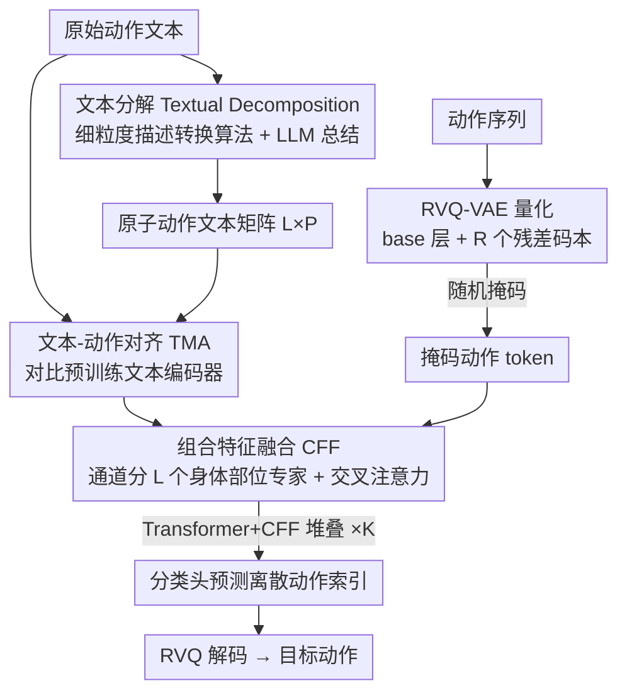

# Open the Motion Door: Atomic Motion Decomposition and Recomposition for Open-Vocabulary Motion Generation

**会议**: CVPR 2026  
**论文**: [CVF Open Access](https://openaccess.thecvf.com/content/CVPR2026/html/Fan_Open_the_Motion_Door_Atomic_Motion_Decomposition_and_Recomposition_for_CVPR_2026_paper.html)  
**代码**: 项目页 https://vankouf.github.io/OpenTheMotionDoor/  
**领域**: 人体理解 / 文本驱动动作生成  
**关键词**: 文本到动作, 开放词表, 原子动作, 分解-重组, RVQ-VAE  

## 一句话总结
针对文本到动作（T2M）模型在训练集外文本上泛化差的问题，本文提出"原子动作分解-重组"框架：先把任意原始文本拆成各身体部位、各时间段的低层"原子动作"描述，再学习把这些原子动作重新组合成完整动作，仅用 HumanML3D 训练就能在两个域外数据集（IDEA400、Mixamo）上大幅超越 SOTA。

## 研究背景与动机
**领域现状**：文本到动作生成主流有三类范式——直接映射（simple mapping，如 T2M-GPT、MMM 学一个从文本到动作的直接变换）、跨域对齐（如 MotionCLIP/OOHMG 借 CLIP 把文本、动作、图像空间对齐）、先预训练后微调（如 OMG 在大量无标注动作上预训练扩散模型再用少量配对数据微调）。

**现有痛点**：这三类范式本质上都在学"原始文本 → 原始动作"的直接映射。受限于配对数据集（如 HumanML3D）的规模和语义多样性，模型无法覆盖完整的开放动作空间，遇到训练集没出现过的新颖、复杂或细粒度描述就掉链子。即便是最大规模的 MotionMillion（2000+ 小时、7B 参数）也仍受数据质量和规模瓶颈，且含大量低质、噪声、重复样本。

**核心矛盾**：高层动作语义千变万化（长尾、高多样性），但配对数据永远补不齐这个长尾；一味堆数据和模型规模成本极高且收益递减。

**切入角度**：作者受 PRIMAL 的观察启发——人体动作在短时间窗内由物理主导、长时间窗内由语义主导，很短的动作片段就能张成整个动作空间。由此提出关键洞察：**虽然高层语义各不相同，但很多动作共享一组底层"原子动作"（简单、可复用的身体部位运动）**。例如"中弹倒地、跪下"虽不在训练集，但它的组成成分（前倾、屈膝）在其他样本（如游泳）里出现过。

**核心 idea**：用"原子动作"作为中间表征，把生成过程拆成两步——把域外原始文本分解成一串原子动作描述，再把这些原子动作重组成目标动作。因为域外文本分解出的原子动作往往与域内重叠，这个"分解-重组"范式显著提升了泛化能力。

## 方法详解

### 整体框架
方法整体采用**离散生成式掩码建模**范式，分两大阶段：先训练一个 Residual VQ-VAE（RVQ）把动作量化成离散 token，再训练一个文本到动作的掩码生成模型。给定动作-语言描述，生成模型通过两个顺序耦合的阶段合成动作：(1) **文本分解（Textual Decomposition）**——把任意文本映射成一组原子描述，每个描述刻画某身体部位在某短时间段内的运动，得到 $L\times P$ 矩阵（$L$ 为身体部位数，$P$ 为时间段数）；(2) **原子重组（Atomic Recomposition）**——通过文本-动作对齐（TMA）模块和组合特征融合（CFF）模块，从原子动作合成目标动作。

生成模型由 $K$ 层"Transformer 层 + CFF 块"交替堆叠组成：Transformer 层做动作与文本的全局交互，CFF 块强制原子输入的局部组合性。训练时动作 token 被随机比例掩码后预测；推理时全部 token 初始化为 `[MASK]`，由 LLM 先抽取原子文本，再迭代式地预测掩码 token（低置信 token 重新掩码、高置信 token 固定），直到全部解出，最后用 RVQ 解码器还原成动作序列。

### 关键设计

**1. 原子动作作为中间表征：把"覆盖不全的语义空间"换成"可复用的动作基元空间"**

这是全文最核心的观察。直接学"原始文本 → 原始动作"之所以泛化差，是因为原始文本携带抽象、高层的语义，配对数据又不够，模型学到的只是文本空间一个受限子集到动作空间一个受限子集的映射。作者改用原子动作（短时间窗内单一身体部位的低层运动，如"屈膝""左手下放"）作为桥梁：高层语义虽多变，但底层原子动作高度共享且可组合。论文用 t-SNE 验证——原始文本特征在 HumanML3D、IDEA400、Mixamo 三个数据集间分布差异显著（说明 HumanML3D 规模不足以覆盖全动作空间），但经文本分解后三者分布几乎重合，证明原子动作既能覆盖跨数据集的行为，又消除了域间 gap。

**2. 文本分解：规则化细粒度描述 + LLM 总结，保证原子文本忠实于真实动作**

直接把动作分解成原子动作很难，且现有方法仅靠原始文本让 LLM 拆解 body-part 叙述，无法保证与真实动作一致。本文设计一个**细粒度描述转换算法**，从速度、幅度、行为类别三个视角刻画关节级变化，分四步：① **姿态提取**——每帧抽取关节角、朝向、绝对位置、关节间距等描述子 $PD_i$（如肘弯角由肩-肘-腕三关节坐标的内积算得）；② **姿态聚合**——比较连续三帧的差分 $\Delta PD_{i-1}=PD_i-PD_{i-1}$、$\Delta PD_i=PD_{i+1}-PD_i$，若符号一致（单调变化）则合并成片段，累计变化 $SP_{D_i}=\sum_{t=i}^{i+T_i}\Delta PD_t$、速度 $V_{P_{D_i}}=|SP_{D_i}|/T_i$；③ **片段聚合**——把序列均匀分成 $P$ 个时间 bin，按起始时间归入对应 bin；④ **描述转换**——按片段描述子映射成行为标签（如关节角 $SP_{D_i}$ 为负标"bending"、为正标"extending"；幅度超阈值加"significant"、速度低于阈值加"slow"），生成如"缓慢且显著地弯曲"的短语。随后把细粒度描述与原始文本一起喂给 LLM 做总结，对每个时间 bin 生成 $L$ 个原子动作描述（脊柱、左/右上肢、左/右下肢、根轨迹）。推理时直接用带 in-context 示例的 LLM 完成分解。这套"先规则后 LLM"的两步策略，比纯 LLM 拆解更能保证原子文本语义上贴合真实动作行为。

**3. 文本-动作对齐 TMA：用动作配对数据训文本编码器，替掉错配的 CLIP 文本特征**

传统 T2M 用 CLIP 抽文本特征再线性/注意力对齐到动作空间。但 CLIP 在文本-图像对上训练，文本是对静态图像的描述，与含时序动态的动作描述存在巨大 gap，训练时学这个对齐既费力又干扰网络专注于"原子→目标"的组合学习。受文本-动作检索方法 TMR 启发，作者用对比学习在**文本-动作配对数据**上预训练一个文本编码器 TMA，损失为 InfoNCE：

$$\mathcal{L}_{NCE}=-\frac{1}{2M}\sum_i\left(\log\frac{\exp(A_{ii}/\tau)}{\sum_j\exp(A_{ij}/\tau)}+\log\frac{\exp(A_{ii}/\tau)}{\sum_j\exp(A_{ji}/\tau)}\right)$$

其中 $A_{ij}$ 是动作与文本嵌入的相似度、$\tau$ 是温度。训练好的 TMA 用来抽取原始文本和原子文本的特征。因为这些特征天然对齐到动作空间，下游 CFF 模块就能从对齐噪声中解放出来、专注于结构化融合——消融显示加入 TMA 后 R-Precision 几乎翻倍。

**4. 组合特征融合 CFF：把动作通道拆成身体部位专家，与原子文本做交叉注意力**

CFF 负责把原子文本特征注入动作特征，引导生成模型按结构化组合过程合成全身动作。具体地，把上一层 Transformer 产出的精炼动作嵌入 $\tilde m_1\in\mathbb{R}^{N\times D_m}$ 沿通道维拆成 $L$ 个分支（$L\times D_W=D_m$），每个分支充当一个身体部位的"专家"，reshape 成 $\tilde m_2\in\mathbb{R}^{L\times N\times D_W}$。以原子文本嵌入 $T_a\in\mathbb{R}^{L\times P\times D_W}$ 作 Key/Value、$\tilde m_2$ 作 Query 做交叉注意力 $\tilde m_3=F_{CFF}(\tilde m_2;T_a)$，得到原子动作的融合表示，再 reshape、线性投影回 $\tilde m_o\in\mathbb{R}^{N\times D_m}$。由于 $T_a$ 由 TMA 抽取、已对齐动作空间，融合输出能反映语义上有意义的原子重组。这种"Transformer 管全局交互、CFF 管局部组合"的混合设计重复 $K$ 层，最后由分类头预测离散动作索引、交叉熵监督。与相关工作 ATOM（原子元素仅靠 cross-attention 与 pose 特征交互、时序上下文不足）相比，CFF 让每个原子动作能与多个 pose 特征交互，提供更丰富的时序信息。

### 损失函数 / 训练策略
RVQ-VAE 在大规模无标注动作数据上预训练以获得离散动作表征；TMA 文本编码器用 InfoNCE 对比损失在文本-动作配对数据上预训练；主生成模型用掩码建模训练，最终动作特征经分类头预测离散索引、交叉熵监督。训练仅用 HumanML3D 配对数据。

## 实验关键数据

### 主实验
训练只用 HumanML3D，推理在域内（HumanML3D）+ 两个域外数据集（IDEA400 日常动作、Mixamo 艺术家动画）上评估，按文献做法在 IDEA400/Mixamo 上各训一个 evaluator 来算指标。指标含 FID（↓越好，动作分布质量）、R-Precision（↑，文本-动作匹配检索精度）、Diversity（↑，多样性）。

| 数据集 | 指标 | 本文 | T2M-GPT | MMM | ATOM |
|--------|------|------|---------|-----|------|
| HumanML3D（域内） | FID↓ / R-Prec↑ | 0.132 / 0.498 | 0.116 / 0.491 | **0.080** / 0.504 | 1.691 / 0.343 |
| IDEA400（域外） | FID↓ / R-Prec↑ | **0.847** / **0.449** | 0.934 / 0.211 | 1.051 / 0.183 | 0.946 / 0.190 |
| Mixamo（域外） | FID↓ / R-Prec↑ | **0.186** / **0.516** | 0.221 / 0.249 | 0.471 / 0.171 | 0.342 / 0.249 |

域内 HumanML3D 上本文与 SOTA 持平（MMM 的 FID 略优），但**域外两个数据集上本文大幅领先**：IDEA400 的 R-Precision 从次优 0.249（T2M-GPT/ATOM）跃升到 0.449，Mixamo 的 R-Precision 从 0.249 升到 0.516。定性上，本文还能正确生成 MotionMillion（7B、百万级数据）都做不对的复合动作——例如"举物过头并同时行走"，MotionMillion 只产出原地举物而漏掉行走，本文却能复现完整复合行为。

### 消融实验
在 HumanML3D 和 IDEA400 上验证各模块作用（CFF\* 表示直接把原子文本与原始文本拼接的朴素做法）：

| 配置 | IDEA400 FID↓ | IDEA400 R-Prec↑ | 说明 |
|------|-------------|-----------------|------|
| Baseline | 0.898 | 0.160 | 仅原始文本 |
| Baseline+CFF\* | 0.890 | 0.162 | 朴素拼接原子文本，几乎无提升甚至更差 |
| Baseline+CFF | 0.886 | 0.170 | 特征级融合原子动作，小幅提升 |
| Baseline+TMA | 0.844 | 0.380 | R-Precision 几乎翻倍 |
| Baseline+TMA+CFF（Full） | 0.847 | **0.449** | 完整模型 |

### 关键发现
- **TMA 是泛化的主引擎**：单加 TMA 就让 IDEA400 的 R-Precision 从 0.160 跳到 0.380（接近翻倍），说明把文本特征对齐到动作空间确实释放了模型学组合的负担。
- **CFF 必须建立在 TMA 之上**：在 TMA 基础上加 CFF，R-Precision 再涨约 11%（0.380→0.449）；而没有 TMA 时单加 CFF 只涨约 3%（0.160→0.170）。直接拼接原子文本（CFF\*）则几乎无效甚至损害 FID，证明特征级、按身体部位拆通道的结构化融合才是关键。
- **CFF 主要利好域外**：CFF 在域外 IDEA400 上的增益明显大于域内 HumanML3D，因为它本就是为提升开放词表泛化而设计的。

## 亮点与洞察
- **"分解-重组"把泛化问题转成了组合问题**：与其指望配对数据覆盖长尾语义，不如承认底层原子动作可复用、可组合——这是一个"换赛道"式的视角，把数据规模瓶颈绕开了，对低资源生成任务很有启发。
- **先规则后 LLM 的文本分解很务实**：纯 LLM 拆解容易脱离真实动作，先用确定性的关节级规则算法把动作描述"锚定"到真实运动、再让 LLM 总结成自然语言，兼顾了忠实性与可读性，这套思路可迁移到任何需要"结构化标注 + 自然语言"的任务。
- **按通道拆身体部位专家 + 交叉注意力**：把动作特征沿通道维拆成 $L$ 个身体部位分支，用对齐过的原子文本做 Key/Value，这种"专家 + 文本引导"的局部组合设计可复用于其他部件可分解的生成任务（如手部、面部）。
- **t-SNE 验证域间分布对齐**很直观地证明了原子表征的价值——原始文本分布散、原子分解后重合，这种"用表征证明泛化"的论证方式值得借鉴。

## 局限与展望
- 文本分解依赖一个手工设计的细粒度描述转换算法（阈值、bin 数 $P$、身体部位划分 $L$ 都是先验设定），对不同骨架/数据格式的迁移性、以及阈值敏感性论文未充分讨论。⚠️ 阈值与 bin 的具体取值留在 supplementary，正文未给。
- 推理依赖 LLM 在线做文本分解，引入额外延迟与 LLM 调用成本，对实时应用不友好；分解质量也受 in-context 示例和 LLM 能力影响。
- 身体部位被固定为脊柱、左/右上肢、左/右下肢、根轨迹共 6 类，可能不足以刻画手指、面部等更细粒度运动；原子动作的时序划分按均匀 bin，遇到节奏剧烈变化的动作可能不够灵活。
- 域内 HumanML3D 上 FID 略逊于 MMM，说明把建模重心放在泛化上对域内拟合有轻微代价。

## 相关工作与启发
- **vs 直接映射（T2M-GPT / MMM）**：它们学原始文本到原始动作的直接变换，域内强但域外崩；本文插入原子动作中间表征，用域内可复用的基元覆盖域外语义，域外大幅领先。
- **vs ATOM**：ATOM 也用可学习的原子动作码本分解复杂动作，但其原子元素仅靠 cross-attention 与 pose 特征交互、时序上下文不足；本文的原子是"短时身体部位文本描述"，且 CFF 让每个原子与多个 pose 特征交互，时序信息更丰富。
- **vs 跨域对齐（MotionCLIP / OOHMG）**：它们靠静态 pose-image 对齐借 CLIP 先验，但丢弃时序动态、常生成不真实动作；本文用 TMA 在文本-动作对上对齐、保留动态。
- **vs 先预训练后微调（OMG）/ 规模化（MotionMillion）**：前者受高质量标注稀缺限制、后者受数据规模质量瓶颈，本文不靠堆数据，而靠"分解-重组 + LLM"在有限配对数据下实现开放词表生成。

## 评分
- 新颖性: ⭐⭐⭐⭐⭐ 用原子动作作中间表征把泛化转成组合问题，视角新颖且自洽
- 实验充分度: ⭐⭐⭐⭐ 三数据集主实验 + 模块消融 + t-SNE 分布验证扎实，但缺超参敏感性与更细粒度运动的评估
- 写作质量: ⭐⭐⭐⭐ 动机推导清晰、图文配合好，部分实现细节被推到 supplementary
- 价值: ⭐⭐⭐⭐⭐ 为低资源开放词表动作生成提供了可复用的"分解-重组"范式，对数据受限场景启发大

<!-- RELATED:START -->

## 相关论文

- [\[CVPR 2026\] OpenT2M: No-frill Motion Generation with Open-source, Large-scale, High-quality Data](opent2m_no-frill_motion_generation_with_open-source_large-scale_high-quality_dat.md)
- [\[CVPR 2026\] OSMO: Open-vocabulary Self-eMOtion Tracking](osmo_open-vocabulary_self-emotion_tracking.md)
- [\[CVPR 2026\] Learning to Diversify and Focus: A Reinforcement Framework for Open-Vocabulary HOI Detection](learning_to_diversify_and_focus_a_reinforcement_framework_for_open-vocabulary_ho.md)
- [\[CVPR 2026\] Towards Decompositional Human Motion Generation with Energy-Based Diffusion Models](towards_decompositional_human_motion_generation_with_energy-based_diffusion_mode.md)
- [\[CVPR 2026\] Hierarchical Enhancement of Semantic Priors for Disentangled Text-Driven Motion Generation](hierarchical_enhancement_of_semantic_priors_for_disentangled_text-driven_motion_.md)

<!-- RELATED:END -->
