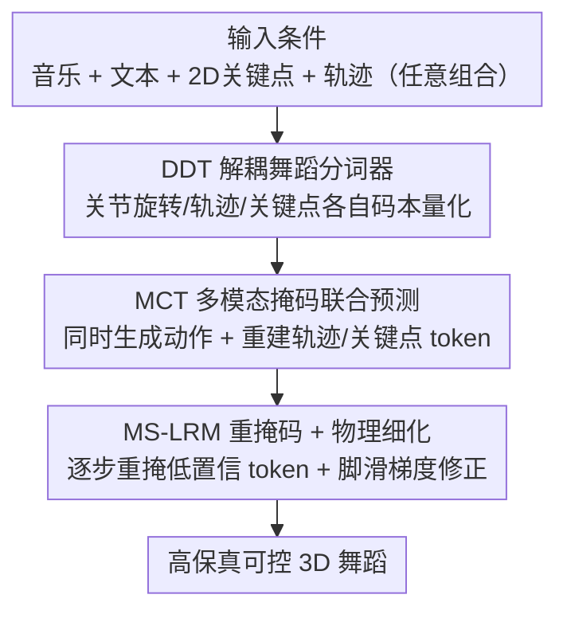

# OpenDance: Multimodal Controllable 3D Dance Generation with Large-scale Internet Data

**会议**: CVPR 2026  
**论文**: [CVF Open Access](https://openaccess.thecvf.com/content/CVPR2026/html/Zhang_OpenDance_Multimodal_Controllable_3D_Dance_Generation_with_Large-scale_Internet_Data_CVPR_2026_paper.html)  
**代码**: https://open-dance.github.io （项目页）  
**领域**: 人体理解 / 3D舞蹈生成  
**关键词**: 3D舞蹈生成, 多模态可控, 掩码建模, 运动数据集, 物理合理性

## 一句话总结
OpenDance 一边从网络视频造了个 100 小时、14 个舞种、带音乐/文本/2D关键点/轨迹多模态标注的大规模 3D 舞蹈数据集 OpenDanceSet，一边用"解耦分词 + 多模态掩码联合预测 + 推理期重掩码细化"的统一框架 OpenDanceNet，实现以"音乐 + 任意条件组合"驱动、高保真又可精细控制的 3D 舞蹈生成。

## 研究背景与动机
**领域现状**：音乐驱动 3D 舞蹈生成在虚拟人、游戏、AR/VR 里潜力巨大。近年扩散模型、自回归模型配上音乐-舞蹈配对数据，已能不靠手工就合成舞蹈动作。

**现有痛点**：这些方法几乎都缺"灵活可控性"——真实编舞里艺术家需要精确的空间控制（关键动作、舞台站位）和风格控制（音乐节拍、舞种、动作风格），但主流生成模型大多只吃音乐、不接受用户精细条件。少数支持空间编辑或种子动作微调的工作，也没有一个统一框架能处理"文本 + 关键帧 + 轨迹"等任意多模态条件组合。

**核心矛盾**：可控生成卡在两个根上。其一是**数据**——现有数据集多用动捕系统采集，规模小、每个舞种常不足 1 小时、且缺多模态配对标注（文本、2D 关键点），无法支撑多样的条件生成；有人用文本-动作数据集混训来补，但普通人体动作和舞蹈动作分布差异大，效果次优。其二是**模型**——不同控制模态（语言/动作/空间位置）提供的监督信号强弱不等，朴素地联合优化会让网络"偷懒"只学高层风格信号、忽略难学的细粒度空间信号。

**本文目标**：① 造一个大规模、富标注的多模态舞蹈数据集；② 设计一个能从任意多模态条件组合做可控生成的统一模型。

**切入角度**：数据上，借视频运动重建的进展，从海量网络视频（而非昂贵动捕）规模化提取 3D 舞蹈，并配齐风格信号（音乐、文本）与空间信号（关键点、轨迹）；模型上，把各模态**先解耦再用掩码联合预测统一**，并把难学的空间 token 也当预测目标，逼模型真正用上它们。

**核心 idea**：用解耦的离散 token 表示各控制模态，再用一个"既生成动作 token、也重建轨迹/关键点 token"的多模态掩码 Transformer，配合推理期物理细化，做到任意"音乐 + X"条件下的可控舞蹈生成。

## 方法详解

### 整体框架
OpenDanceNet 把可控舞蹈生成拆成"分词 → 联合预测 → 推理细化"三段。先用**解耦舞蹈分词器（DDT）**把关节旋转、全局轨迹、2D 关键点三类空间信号各自独立编码成离散 token（避免编码器内过早跨模态融合）；再用**多模态条件 Transformer（MCT）**做掩码联合预测——音乐、文本作为风格条件，关键点、轨迹作为空间条件，模型不只预测动作 token，还重建被掩码的轨迹/关键点 token；推理时跑迭代式掩码预测，用 **MS-LRM 重掩码 + 物理细化**逐步提升质量和物理合理性。框架天然支持只给稀疏帧级约束（如部分关键点或轨迹），照样生成连贯舞蹈。

### 关键设计

**1. OpenDanceSet：从网络视频规模化造多模态舞蹈数据集**

针对"数据小、缺多模态标注"的痛点，作者从约 600 小时野外视频里筛出 100.26 小时、14 个细分舞种、147 位舞者、41K 条长于 60 秒的舞蹈序列，全部重采样到 30FPS。半自动标注管线串起预训练估计器、LLM、人工标注与专业艺术家：用 GPT 生成检索 query 找视频、YOLOX 框人滤掉非独舞，2D 关键点用估计器抽取后做帧级去抖，3D 动作用世界坐标系下的学习型估计器拟合 SMPL（避开逐帧优化太慢、且能给世界系轨迹），文本由专业艺术家标主/细分舞种、人工标起止/性别/动作风格、LLM 据关键点可视化生成肢体细节描述，音频用 Jukebox（4800 维高维特征）+ Librosa（节拍及 35 维低维特征）。后处理再用 Kalman 滤波去抖、PFC 分惩罚脚滑，并按 jitter/stillness/PFC/人体对齐分过滤——人体对齐用 MotionCritic，但它训练在文本-动作数据上、与舞蹈分布有差距，于是以高质量 AIST++ 的 MotionCritic 分布为参考去逼近过滤。用户研究里 OpenDanceSet 相对 AIST++ 在动作真实感（62.4%）、多样性（58.8%）胜率更高。⚠️ 表中"小时/舞种 7.16、总 100.26 小时、147 subjects"等数字读自 OCR 缓存，以原文为准。

**2. DDT 解耦分词器：各模态独立量化，让稀疏空间约束直接可注入**

现有方法受限于动作多样性不足（多为近静止重复动作，可控设定下易 OOD）和连续控制信号与潜空间对齐弱。DDT 把 OpenDanceSet、AIST++、更多样的 AMASS 统一到共享动作表示上联合训练一个分词器，输入关节旋转 $J$、全局轨迹 $X$、2D 关键点 $K$ 三模态，编码器把各模态**独立**映成潜特征 $z_i$ 再用三个独立码本 $C_i=\{c_n\}_{n=1}^N$ 量化成离散 token，堆成统一离散表示 $\hat z\in\mathbb R^{3\times T\times d}$。关键在于**刻意不在编码器里做早期跨模态融合**——这样稀疏的帧级约束（如只给部分 2D 关键点或全局轨迹）能直接 padding 后经各自分支编码成 token，每个控制模态到其 token 序列有明确一致的映射，为精确灵活的多条件生成打底。

**3. 多模态掩码联合预测（MCT）：把难学的空间 token 也设成预测目标**

朴素做法把 2D 关键点和全局轨迹仅当"附加条件"、只生成动作 token，作者发现这不够——因为空间信号施加严格帧级约束、要求网络合成精确 3D 位置，网络会偏向从粗粒度风格条件学、忽略细粒度空间条件。MCT 因此被设计成**联合预测器**：不只从掩码动作序列生成动作，还要从被掩版本重建轨迹和 2D 关键点的真值 token。各模态分别分词（音乐用 Jukebox 式编码、文本用 CLIP、关键点和轨迹用 DDT），拼成 $Z=[Z_{music},Z_{text},Z_{traj},Z_{kpts}]$；构造掩码输入时对音乐/文本做概率 $p_{mask}$ 的**模态级随机掩码**、对轨迹/关键点做 token 级掩码，避免动作流过度依赖单一模态。设掩码位置集合 $M$，优化交叉熵

$$L^{mask}_{CE}=-\mathbb E_Z\Big[\sum_{i\in M}\log p_\theta(z_i\mid Z_{mask})\Big].$$

联合预测空间 token 让模型真正捕捉跨模态关系、缓解脚滑、增强整体生成力。

**4. 推理期 MS-LRM 重掩码 + 物理细化：稳住质量并压物理瑕疵**

因为训练用了多模态掩码，MCT 天然支持任意条件组合推理，用户给的稀疏帧级约束经 DDT 分词后作为硬条件注入。推理做 $N$ 步迭代掩码预测：每步对所有 `[MASK]` 位预测分布，维护每 token 置信度，用 **MS-LRM（Multi-Step Logit-Ranked Re-Masking）跨所有迭代重掩低置信 token**——比 MoMask 那种只重掩最新一步 token 更稳更准。为压脚滑（解耦旋转与轨迹带来的），每步还做物理感知细化：Gumbel-Softmax 采样动作 token、DDT 解码、前向运动学算 3D 关节、用脚滑损失 $L_{fs}$ 的梯度更新 logit $\hat e_{logits}=e_{logits}-\epsilon\nabla_{e_{logits}}L_{fs}$ 后重采样；最后一步再对动作嵌入做同样细化，并接一个轻量后处理抑制残余脚滑，产出贴地稳定的平滑动作。

### 损失函数 / 训练策略
除 MCT 的掩码交叉熵外，还有**空间辅助监督**把全局轨迹、2D 关键点、关节旋转紧耦合：经 Gumbel-Softmax 可微采样从 DDT 解码出预测轨迹/关键点并对真值监督，目标含轨迹损失 $L_{traj}$、关键点损失 $L_{kpts}$、前向运动学损失 $L_{fk}$（用 $F(\cdot)$ 把旋转+轨迹映到 3D 关节位置）和脚接触损失 $L_{con}$（按二值脚接触标签 $b_i$ 加权）。训练数据用非均匀采样步长做增强（数据多的舞种如 Street 用大步长、稀缺舞种密采样）；姿态用 24 关节 SMPL、6-DoF 旋转 + 3D 根平移 + 二值脚跟/脚尖接触标签；音乐 Jukebox、文本 CLIP；整模型在单张 RTX 4090 (24GB) 上训练。

## 实验关键数据
指标说明：**FIDk/FIDg** 为基于运动学/几何特征的 Fréchet 距离（越低越好）；**Divk/Divg** 为多样性（越接近真值越好）；**BAS**（Beat Alignment Score）衡量节拍对齐（越高越好）；**PFC**（Physical Foot Contact）衡量脚部物理合理性/脚滑（越低越好）。⚠️ 缓存里各列箭头方向经 OCR 已乱码，此处方向按这些指标的通行约定标注。

### 主实验
AIST++ 数据集：

| 方法 | PFC↓ | FIDk↓ | FIDg↓ | BAS↑ |
|------|------|-------|-------|------|
| Ground Truth | 1.332 | 17.10 | 10.60 | 0.2374 |
| EDGE | 1.536 | 31.82 | 22.16 | 0.2043 |
| MoMask | 1.648 | 44.92 | 26.20 | 0.2312 |
| **OpenDanceNet** | **1.140** | **24.82** | 12.54 | **0.2513** |

OpenDanceSet 数据集：

| 方法 | PFC↓ | FIDk↓ | FIDg↓ | BAS↑ |
|------|------|-------|-------|------|
| Ground Truth | 0.1578 | 8.05 | 2.98 | 0.2453 |
| EDGE | 0.2386 | 36.42 | 9.97 | 0.2372 |
| TM2D | 2.8794 | 69.95 | 23.42 | 0.2201 |
| MoMask | 0.3281 | 61.11 | 20.19 | 0.2344 |
| **OpenDanceNet** | 0.3462 | **23.19** | 11.89 | **0.2472** |
| **+ 物理细化** | 0.2733 | 37.40 | **7.72** | 0.2389 |

要点：在 AIST++ 上 OpenDanceNet 拿到最低 PFC、最好 FIDk(24.82)、最高 BAS(0.2513)，物理合理性与节拍对齐双优；在 OpenDanceSet 上 FIDk(23.19) 最好，叠加物理细化后 FIDg 进一步降到 7.72，且多样性强（Divk 7.82、Divg 6.41），整体在真实感/保真/多样性/节拍上取得最佳折中。

### 消融实验
| 消融对象 | 关键现象 | 结论 |
|----------|----------|------|
| 联合预测机制 (表5) | 去掉轨迹/关键点的联合预测，FIDk 从 ~47 飙到 171.69、FIDg 到 39.11 | 联合预测空间 token 是质量基石 |
| 多条件训练 (表6) | 仅音乐训 FIDk 102.87；逐步加轨迹/关键点/文本后 FIDk 降到 ~48 | 多条件训练显著提多样性与质量 |
| 推理控制信号 (表4) | 注入 Traj/Kpts 后对应距离误差大降（如 Kpts dist. 0.14→0.044），FID 基本不退 | 能有效利用空间控制做细粒度引导 |
| MCT 损失项 (表7) | 逐项加 $L_{con}/L_{fk}/L_{traj}/L_{kpts}$，PFC 0.3142→0.2966、FIDg 22.32→20.38 | 各空间损失协同改善物理与保真 |

### 关键发现
- **把空间信号设成预测目标**（而非纯条件）是涨点最猛的一招：去掉它 FIDk 直接退化数倍（47→171.69），印证了"网络会忽略难学的细粒度条件"的判断。
- 多条件训练让模型见过各种条件组合，推理时才能稳健应对任意"音乐 + X"，并显著提升多样性。
- 物理细化（MS-LRM + 脚滑梯度）在 OpenDanceSet 上把 FIDg 从 11.89 压到 7.72、PFC 从 0.3462 降到 0.2733，但 FIDk 略升——存在保真子指标间的权衡。

## 亮点与洞察
- **"从网络视频规模化造舞蹈数据"绕开动捕瓶颈**：用 GPT 检索 + 多估计器 + LLM/人工/艺术家分层标注，把每舞种时长和总规模拉到现有数据集数倍，还配齐风格+空间多模态标注——这套半自动管线可复用到其他难以动捕的运动域。
- **解耦分词是灵活控制的关键前提**：各模态独立码本 + 不早融合，让稀疏帧级约束能直接当 token 注入，天然支持"只给最后一帧关键点"或"只给一条圆形轨迹"这类不完整输入。
- **联合预测对抗"模态偷懒"**：用"也要重建被掩空间 token"逼模型真正用上难学的强约束信号，是一个可迁移到其他多模态条件生成（强弱信号混合）的通用 trick。
- **推理期物理细化用可微 FK + 脚滑梯度直接改 logit**：把物理先验以梯度形式注入采样过程，而非只靠后处理，思路干净。

## 局限与展望
- 物理细化提升 FIDg/PFC 的同时 FIDk 反升，说明不同保真维度间需权衡，未给统一最优配置。
- 数据来自网络视频，3D 动作由视频重建估计而非动捕，绝对精度受估计器与重建质量上限约束；隐私上仅释出派生 2D/3D 表示与源链接。
- ⚠️ 缓存中的指标箭头方向、部分数据集统计数字经 OCR 有乱码，复现前应以原文/项目页为准。
- 评测仍以 FID/BAS/PFC 等自动指标 + 小规模用户研究为主，缺更大规模主观编舞质量评估。
- 改进方向：联合细化多保真维度、扩到群舞/长时编舞、把更多控制模态（如音乐情感、镜头）纳入统一掩码框架。

## 相关工作与启发
- **vs AIST++/FineDance/SoulDance 等动捕数据集**：它们高保真但规模小（多 <15 小时）、舞种风格有限、缺文本/关键点配对；OpenDanceSet 用网络视频把规模与多模态标注同时拉满。
- **vs EDGE/Bailando/FACT（音乐驱动单模态生成）**：它们大多只吃音乐、不支持精细空间/风格控制；OpenDanceNet 统一接受任意"音乐 + X"条件并在 FIDk/BAS 上更优。
- **vs MoMask（掩码动作生成）**：MoMask 推理只重掩最新步 token，OpenDanceNet 的 MS-LRM 跨所有迭代重掩低置信 token，更稳更准。
- **vs TM2D/LM2D/MotionAnything（多模态舞蹈生成）**：它们多提供粗粒度控制，OpenDanceNet 用解耦表示 + 联合预测做到帧级精确的多模态可控。

## 评分
- 新颖性: ⭐⭐⭐⭐ 数据集 + 解耦分词 + 掩码联合预测的组合扎实，单个零件（掩码生成/VQ 分词）多有前作，胜在系统性整合与"空间 token 当预测目标"的洞见。
- 实验充分度: ⭐⭐⭐⭐⭐ 两数据集对比 + 四组消融 + 控制信号可视化 + 用户研究，覆盖全面。
- 写作质量: ⭐⭐⭐⭐ 动机-方法逻辑清晰、图示完整；公式与流程讲得明白（缓存 OCR 噪声非论文本身问题）。
- 价值: ⭐⭐⭐⭐⭐ 大规模多模态舞蹈数据集 + 可控生成框架对数字人/编舞应用价值高，且单卡可训、数据与项目页开放。

<!-- RELATED:START -->

## 相关论文

- [\[CVPR 2026\] OpenT2M: No-frill Motion Generation with Open-source, Large-scale, High-quality Data](opent2m_no-frill_motion_generation_with_open-source_large-scale_high-quality_dat.md)
- [\[CVPR 2026\] M4Human: A Large-Scale Multimodal mmWave Radar Benchmark for Human Mesh Reconstruction](m4human_a_large-scale_multimodal_mmwave_radar_benchmark_for_human_mesh_reconstru.md)
- [\[CVPR 2026\] LCA: Large-scale Codec Avatars - The Unreasonable Effectiveness of Large-scale Avatar Pretraining](lca_large-scale_codec_avatars_the_unreasonable_effectiveness_of_large-scale_avata.md)
- [\[CVPR 2026\] RoMo: A Large-Scale, Richly Organized Dataset and Semantic Taxonomy for Human Motion Generation](romo_a_large-scale_richly_organized_dataset_and_semantic_taxonomy_for_human_moti.md)
- [\[CVPR 2026\] Text-Driven 3D Hand Motion Generation from Sign Language Data](text-driven_3d_hand_motion_generation_from_sign_language_data.md)

<!-- RELATED:END -->
