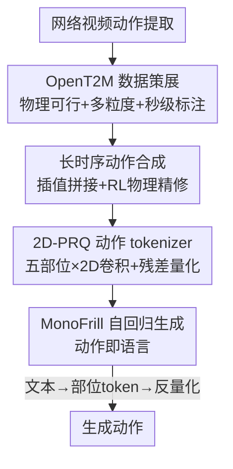

# OpenT2M: No-frill Motion Generation with Open-source, Large-scale, High-quality Data

**会议**: CVPR 2026  
**论文**: [CVF Open Access](https://openaccess.thecvf.com/content/CVPR2026/html/Cao_OpenT2M_No-frill_Motion_Generation_with_Open-source_Large-scale_High-quality_Data_CVPR_2026_paper.html)  
**代码**: 项目页 https://research.beingbeyond.com/opent2m （数据集开源）  
**领域**: 人体理解 / 文本到动作生成  
**关键词**: 文本到动作、动作数据集、动作 tokenizer、残差量化、零样本泛化

## 一句话总结
作者发现现有文本到动作（T2M）基准存在训练/验证集泄漏、模型只是过拟合而非真泛化，于是构建了百万级、物理可行、秒级标注、含长时序的开源动作数据集 OpenT2M，并配套一个"无花哨设计"的自回归生成模型 MonoFrill——其核心是把动作当成"时间×身体部位"的 2D 图像、用 2D 卷积+残差量化的 tokenizer 2D-PRQ，最终在去除泄漏的 OOD 基准上把零样本 R@1 从约 0.07 拉到 0.24。

## 研究背景与动机
**领域现状**：文本到动作生成（给一句话生成一段人体动作）近年进展很快，主流做法是先用一个 tokenizer（VQ-VAE 类）把连续动作离散成 token，再用自回归模型/扩散模型按文本生成 token。评测基本都跑在 HumanML3D 和 Motion-X 这两个基准上。

**现有痛点**：作者做了一次统计审计，揭穿了"虚假繁荣"。用 CLIP 画出 HumanML3D 与 Motion-X 训练集/验证集的文本分布，发现两者大量重叠：HumanML3D 有 10.62%、Motion-X 有 16.97% 的验证集文本**逐字出现在训练集里**，而且大多对应几乎相同的动作；验证集内部也有重复描述。一旦把这些泄漏样本清洗掉（记为带 ∗ 的版本），现有 SOTA 模型性能**断崖式下跌**。更可疑的是这些模型往往要训几百个 epoch 才收敛——典型的过拟合信号。也就是说，标准基准上的"提升"很多只是对训练分布的记忆，而非真正的泛化能力。

**核心矛盾**：要真泛化就得有大规模、多样的高质量动作数据，但高质量动作数据自 AMASS 之后基本停滞——专业动捕设备太贵、难以规模化。退而求其次从网络视频里用姿态估计工具提动作，虽然量大多样，却引入大量物理不可信的伪影（脚部滑步、身体漂移、肢体穿插），这些噪声会严重污染训练。规模和质量在现有路线下不可兼得。

**本文目标**：①造一个既大又干净（物理可信）的开源数据集；②建一个不泄漏、能真实衡量泛化的基准；③证明只要数据对了，不需要花哨技巧也能做好 T2M。

**核心 idea**：用一条带"物理可行性 RL 过滤"的策展管线把网络视频动作洗成接近动捕质量的百万级数据（OpenT2M），再用一个把人体拆成 5 个部位、把动作当 2D 图像编码的简单 tokenizer（2D-PRQ）撑起一个"无花哨"的自回归模型（MonoFrill）。

## 方法详解

### 整体框架
整篇工作由两块组成：**数据**（OpenT2M 数据集 + 策展管线）和**模型**（MonoFrill 自回归生成器，核心是 2D-PRQ tokenizer）。数据侧把海量网络视频提取的含噪动作，经过物理可行性验证、多粒度过滤、秒级文本标注、长时序合成四步洗成高质量样本；模型侧先用 2D-PRQ 把连续动作离散成"部位级 token"，再用一个 LLM 主干以自回归方式按文本预测这些 token，最后反量化回动作。整条链路刻意做得简单——作者反复强调"no-frill / 无花哨"，把性能押在数据质量和动作表示上而非复杂结构。

### 关键设计

**1. OpenT2M 数据策展：把网络视频的脏动作洗成动捕级质量**

针对"视频动作量大但物理不可信"这个痛点，作者设计了一条三步串行的清洗管线，让数据既保规模又保质量。第一步是**物理可行性验证**：他们在 AMASS 上训练一个鲁棒的模仿/跟踪策略 $\pi_{\text{refine}}$，让它去"跟踪"从视频里提取的动作——只有这个策略能成功复现的动作才保留，跟不动的（抖动、脚滑等不符合物理的）直接丢弃。实测约 63% 的提取动作能通过这道验证，且保留下来的仍包含跳舞、击剑、投掷这类高动态动作，说明过滤没有把"难"动作误杀。第二步是**多粒度过滤**：先用预训练检测器提 2D 关键点，再按三条标准筛——每帧最少关键点数（去遮挡/残缺人体）、人体包围框的最低占比（保证人体足够大、估计够准）、最短时长（去碎片化片段）。第三步是**秒级文本标注**：不同于以往给整段视频配一句粗描述（漏掉很多动作细节），他们用 Gemini-2.5-pro 两阶段标注——先逐秒生成精确到肢体动作的细粒度描述，再把这些描述合成为一段覆盖全片段动作的连贯总结，从而保证文本与动作的细粒度对齐。

**2. 长时序动作合成：让数据集自带"10 秒以上"的复杂序列**

现有动作数据几乎都是短片段，无法支撑长时序基准。作者设计了一条自动合成长序列的管线：先把若干原始动作通过插值（Slerp 球面插值）拼接，并做朝向对齐和全局坐标对齐。但这种"硬拼"会在衔接处产生物理上不可能的过渡，所以他们再做**两步精修**——同样用 RL 策略过滤掉无法被跟踪（不可信）的过渡，并用 avatar 的运动轨迹来保证衔接处物理可行。文本侧也不简单地把各段描述硬拼（那样会塞进大量与动作无关的冗余、引入噪声），而是用 Gemini-2.5-pro 把精炼后的简短指令（如"挥左手"）合并成干净、面向用户的描述。最终 OpenT2M 平均动作时长超过 10 秒（见下表 Table 1），是已知首个平均时长破 10 秒的数据集。

**3. 2D-PRQ：把动作当成"时间×部位"的 2D 图像来量化**

这是整个模型的核心，针对"VQ 类 tokenizer 用 1D 时序卷积+全身单一 embedding 导致信息损失、规模上去后重建变差"的痛点。以往细粒度做法（拆上下身、拆五部位）虽然分了部位，却**各部位独立编码量化、丢掉了骨架间的空间约束**。2D-PRQ 的关键观察是：把动作序列 $m_{1:T}\in\mathbb{R}^{T\times D}$ 先拆成部位级特征 $\tilde m_{1:T}\in\mathbb{R}^{T\times p\times d}$（$p=5$：左臂、左腿、躯干、右腿、右臂），然后**把它看作一张 2D 图像——时间当宽、身体部位当高**，于是可以直接用 2D 卷积块编码，同时捕捉跨帧的时间相关性和跨部位的空间依赖，这对维持全身协调一致至关重要。编码后每个潜向量 $\tilde b_{i,j}$ 用共享码本 $C$ 做残差量化（多层逐次逼近残差），得到分层 token $[b^k_{1:p;1:n}]_{k=0}^{K}$；解码端用对称的 2D 解码器重建部位特征再聚合回整段动作。重建损失把整体、各部位、以及残差量化的承诺项加在一起：

$$
\mathcal{L} = \|m-\hat m\|_1 + \sum_{i=0}^{p}\|m_i-\hat m_i\|_1 + \beta\sum_{k=1}^{K}\sum_{i=1}^{p}\|r^k_i - \mathrm{sg}[b^k_i]\|_2^2.
$$

正是这个"时间×部位的 2D 卷积"让它在大规模数据上重建误差远低于把部位独立处理的 PRQ（数据越大优势越明显）。

**4. MonoFrill：把动作当语言，用自回归 LLM 一把生成**

针对"现有 T2M 模型堆了一堆复杂设计"的现状，作者反其道而行，把动作建模成一种"特殊语言"：用 2D-PRQ 离散化后，直接用一个 LLM 主干自回归预测动作 token。具体是扩展 LLM 词表、把 $K$ 个码本码加进去，并引入 `<mot>/</mot>` 界定动作序列、`<part>/</part>` 分隔不同身体部位的子序列，让输入结构化。训练分两阶段：先训 tokenizer 把动作压成 token（最小化重建误差），再做文本-动作对齐的指令微调，优化标准的负对数似然：

$$
\mathcal{L}(\Theta) = -\sum_{j=1}^{L}\log P_\Theta(y_j \mid \text{desc}, \hat y_{1:j-1}).
$$

整个模型没有任何花哨结构（故名 MonoFrill），可即插不同规模主干（GPT2-medium / LLaMA2-7B / LLaMA3-8B），把性能完全押在数据和 2D-PRQ 表示上。

### 损失函数 / 训练策略
两阶段：①tokenizer 用重建损失（上式公式 2，含整体 L1 + 部位 L1 + 残差量化承诺项，$\beta$ 加权）；②生成器用 token 级负对数似然（公式 1）。tokenizer 学习率 2e-4、batch 256、时序下采样率 $\alpha=4$；MonoFrill 在 8×A800 上全参训练，学习率 2e-4、batch 1024、5000 步。下游评测时刻意只微调 50 个 epoch（而非以往的 300 epoch），以隔离"真泛化"和"长训过拟合"两个因素。

## 实验关键数据

### 主实验
**零样本 OOD 泛化（Table 2，OpenT2M_zero 上，1.2 万条与训练无重叠的留出动作）**：核心结论是"换数据集训练 = 泛化质变"。无论哪个 baseline，只要把训练数据从 HumanML3D/Motion-X 换成 OpenT2M，零样本指标都大幅提升；MonoFrill 自己在 OpenT2M 上训练后达到最佳。

| 模型 | 训练数据 | R@1 ↑ | R@3 ↑ | FID ↓ | MMDist ↓ |
|------|---------|-------|-------|-------|----------|
| Real（上界） | - | 0.316 | 0.621 | - | 3.771 |
| MDM | HumanML3D | 0.065 | 0.180 | 51.31 | 7.642 |
| MDM | OpenT2M | 0.194 | 0.447 | 8.153 | 4.889 |
| T2M-GPT | HumanML3D | 0.070 | 0.186 | 62.04 | 8.093 |
| T2M-GPT | OpenT2M | 0.159 | 0.357 | 5.566 | 5.072 |
| Being-M0 | HumanML3D | 0.073 | 0.190 | 58.54 | 7.956 |
| Being-M0 | OpenT2M | 0.155 | 0.356 | 5.811 | 5.110 |
| **MonoFrill-2D-PRQ4** | **OpenT2M** | **0.240** | **0.512** | **1.475** | **4.281** |

可以看到，所有方法在 HumanML3D 上训练的零样本 R@1 都只有 0.05~0.07（FID 高达 50~62，几乎崩），换成 OpenT2M 后普遍跳到 0.15~0.19；而 MonoFrill 配 2D-PRQ 在 OpenT2M 上训练拿到 R@1=0.240、FID=1.475，逼近真实数据上界 0.316。

**动作重建（Table 6，码本 1024、特征维 512）**：2D-PRQ 验证了"数据越大、2D 表示优势越大"的假设。

| Tokenizer | HumanML3D MPJPE ↓ | Motion-X MPJPE ↓ | OpenT2M MPJPE ↓ |
|-----------|-------------------|------------------|------------------|
| VQ-VAE1 | 83.902 | 115.382 | 178.534 |
| RQ-VAE8 | 45.633 | 65.484 | 84.655 |
| PRQ6（部位独立） | 25.485 | 58.155 | 67.569 |
| **2D-PRQ6** | **25.417** | **48.099** | **37.922** |

在小数据 HumanML3D 上 2D-PRQ 与独立部位的 PRQ 几乎打平（25.417 vs 25.485），但随数据规模增大优势急剧拉开：OpenT2M 上 MPJPE 从 67.569 降到 37.922（PRQ4 更是从 95.743 降到 49.134），印证"联合建模时空依赖在大规模下才真正发力"。

### 消融实验

| 配置 | 关键指标 | 说明 |
|------|---------|------|
| MonoFrill + OpenT2M 预训练（Table 3，LLaMA3-8B） | R@1 0.518 / FID 0.238 | 有预训练 |
| MonoFrill 无预训练（LLaMA3-8B） | R@1 0.503 / FID 0.546 | 去掉 OpenT2M 预训练，FID 翻倍变差 |
| 长时序：无 text refine + 无 long-horizon 数据（Table 4） | R@1 0.091 / FID 36.84 | 完全不训长序列，几乎崩 |
| 长时序：+long-horizon 数据 | R@1 0.484 / FID 0.430 | 加长序列数据，质变 |
| 长时序：+text refine +long-horizon | R@1 0.510 / FID 0.297 | 再加文本精炼，进一步提升 |
| 文本精炼（Table 5，HumanML3D） | R@1 0.520→0.533 | 去无关细节、转成干净指令，小幅提升对齐 |
| 零样本 tokenizer（Table 8，HumanML3D MPJPE） | PRQ4 135.96 → 2D-PRQ4 77.70 | 2D 设计显著缓解 tokenizer 过拟合 |

### 关键发现
- **泄漏审计是全文最有冲击力的发现**：现有基准训练/验证集逐字重叠 10.6%~17.0%，清洗后 SOTA 普遍崩盘——很多"进步"是过拟合假象。这把整个 T2M 评测的可信度打了个问号。
- **数据 > 技巧**：MonoFrill 结构极简，但靠 OpenT2M 预训练就在 OOD 上反超 T2M-GPT、Being-M0、MDM 等带复杂设计的强基线。
- **2D-PRQ 的收益与数据规模强耦合**：小数据上和独立部位 PRQ 几乎无差，大数据上重建/零样本大幅领先；反过来在小数据集（HumanML3D）上 token 数更多的 2D-PRQ 反而会掉点，因为它需要大规模数据才能训好。
- **主干存在饱和点**：从 GPT2-medium 升到 LLaMA2-7B 收益巨大，但再升到 LLaMA3-8B 收益递减，且 VQ-VAE 和 2D-PRQ 都如此——说明瓶颈不在主干与 tokenizer 的交互，而是性能在某点后对 LLM 规模不再敏感。

## 亮点与洞察
- **"先证伪基准，再立新数据"的叙事**：先用 CLIP 嵌入可视化 + 逐字匹配统计戳破现有基准的数据泄漏，再顺势论证为什么需要新数据集——动机扎实、说服力强，而不是空喊"我们更大更好"。
- **把物理可行性当成数据过滤器**：用一个 AMASS 上训练的 RL 跟踪策略"能不能复现这个动作"来判定物理合理性，是个很聪明的可扩展过滤信号，比规则化的脚滑/穿插检测更通用，还顺带保住了高动态动作。
- **"动作即 2D 图像"的表示视角**：把"时间×身体部位"显式当成图像的两个空间轴、用 2D 卷积同时建模时空依赖，简单却抓住了"以往独立处理部位丢了骨架空间约束"的要害，这个表示思路可迁移到任何带部位结构的序列建模（如手部、人脸、四足）。
- **诚实的负结果**：作者主动报告 2D-PRQ 在小数据上会掉点、LLM 主干存在饱和，这种自曝短板反而增强了结论可信度。

## 局限与展望
- **依赖商业大模型做标注**：秒级标注和文本精炼都靠 Gemini-2.5-pro，标注质量、成本和可复现性都受制于闭源 API；标注噪声的上界没有量化分析。
- **物理过滤丢弃近 37% 数据**：只有 ~63% 提取动作通过物理验证，被丢掉的动作分布是否引入选择偏差（如某些罕见但合理的动作被误杀）没有充分讨论。
- **"开源数据 + 简单模型"的边界**：MonoFrill 的简单性建立在"有了 OpenT2M"的前提上，论文没有在同等大数据下系统比较复杂结构是否仍有额外收益——"无花哨即最优"更像是数据红利下的结论。
- **长时序仍偏脆**：从 Table 4 看，不训长序列数据时 FID 高达 36.8、几乎不可用，说明长时序能力高度依赖合成数据而非模型本身的外推。
- 改进方向：用开源 VLM 替换 Gemini 标注以提升可复现性；量化物理过滤的选择偏差；在 OpenT2M 这种大数据上重新公平评测复杂结构，厘清"数据 vs 结构"各自的贡献边界。

## 相关工作与启发
- **vs MotionLib / Being-M0（Wang et al.）**：MotionLib 是首个百万级动作数据集并强调"规模重要"，但要么不公开、要么缺乏物理感知的质量控制；OpenT2M 同为百万级（约 2815 小时、平均 10.1 秒）但全开源、带物理可行性验证和长时序，且 Being-M0 的五部位 tokenizer 是独立量化各部位，OpenT2M 的 2D-PRQ 用 2D 卷积联合建模时空依赖。
- **vs HuMo100M（Cao et al.）**：HuMo100M 规模更大（5.7M、8508 小时）、也做多粒度标注，但 OpenT2M 的差异点在物理可行性 RL 过滤 + 长时序合成基准，定位是"质量与基准可信度"而非纯规模。
- **vs PRQ / 五部位拆分（Chen et al.、Cao et al.）**：它们把人体拆成上下身或五部位，但各部位独立编码量化、缺骨架约束；2D-PRQ 把部位当图像的"高"维度、用 2D 卷积保留跨部位空间依赖，大规模下重建与零样本显著更好。
- **vs T2M-GPT / MDM**：T2M-GPT 用 VQ-VAE+GPT、MDM 用扩散，都在小规模且泄漏的基准上长训；本文揭示这类结果含过拟合成分，并用"无花哨"的 MonoFrill 在干净 OOD 基准上反超。

## 评分
- 新颖性: ⭐⭐⭐⭐ 数据泄漏审计 + 物理可行性 RL 过滤 + "动作即 2D 图像"的 2D-PRQ 三点都有新意，但单看模型是已知组件的巧妙组合
- 实验充分度: ⭐⭐⭐⭐⭐ 8 张表覆盖零样本/指令微调/长时序/重建/消融，跨三数据集多主干，且自报负结果
- 写作质量: ⭐⭐⭐⭐ 叙事清晰、动机扎实；个别公式与符号（如 $V\in\mathbb{R}^{n\times p\times l}$、下采样率定义）略简，细节需查附录
- 价值: ⭐⭐⭐⭐⭐ 开源百万级高质量数据集 + 揭穿基准泄漏，对整个 T2M 社区的评测信誉和数据基建都有实打实的推动

<!-- RELATED:START -->

## 相关论文

- [\[CVPR 2026\] Open the Motion Door: Atomic Motion Decomposition and Recomposition for Open-Vocabulary Motion Generation](open_the_motion_door_atomic_motion_decomposition_and_recomposition_for_open-voca.md)
- [\[CVPR 2026\] OpenDance: Multimodal Controllable 3D Dance Generation with Large-scale Internet Data](opendance_multimodal_controllable_3d_dance_generation_with_large-scale_internet_.md)
- [\[CVPR 2026\] RoMo: A Large-Scale, Richly Organized Dataset and Semantic Taxonomy for Human Motion Generation](romo_a_large-scale_richly_organized_dataset_and_semantic_taxonomy_for_human_moti.md)
- [\[CVPR 2026\] LCA: Large-scale Codec Avatars - The Unreasonable Effectiveness of Large-scale Avatar Pretraining](lca_large-scale_codec_avatars_the_unreasonable_effectiveness_of_large-scale_avata.md)
- [\[CVPR 2026\] Next-Scale Autoregressive Models for Text-to-Motion Generation](next-scale_autoregressive_models_for_text-to-motion_generation.md)

<!-- RELATED:END -->
