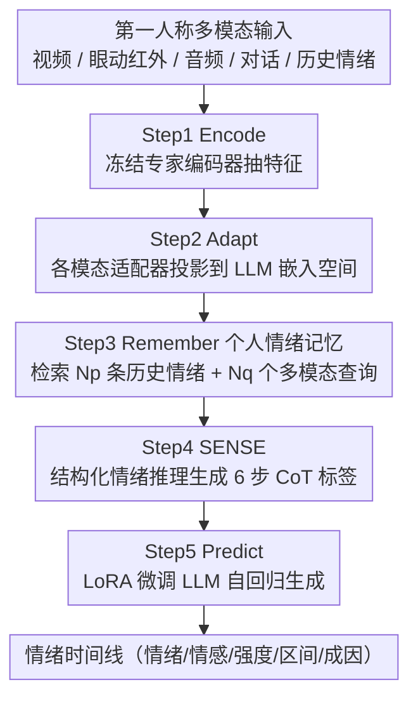

# OSMO: Open-vocabulary Self-eMOtion Tracking

**会议**: CVPR 2026  
**论文**: [CVF Open Access](https://openaccess.thecvf.com/content/CVPR2026/html/Abdelfattah_OSMO_Open-vocabulary_Self-eMOtion_Tracking_CVPR_2026_paper.html)  
**代码**: 项目页 https://osmo-emos.github.io  
**领域**: 人体理解 / 情感计算 / 第一人称多模态  
**关键词**: 自我情绪追踪, 智能眼镜, 第一人称, 开放词表情绪, 多模态大模型  

## 一句话总结
本文提出"第一人称自我情绪追踪"新任务——从智能眼镜的多模态流（语音、视觉环境、对话文本、眼动）推断佩戴者随时间演变的情绪，并配套发布 OSMO 数据集（110 小时、首个带逐主体情绪时间线的最大第一人称情绪数据集）、OSMO 基准（5 个任务）和 OSIRIS 模型（首个联合视频/音频/对话/眼动红外、用情绪历史做时序推理的情绪 LMM），在各项指标上大幅刷新 SOTA。

## 研究背景与动机
**领域现状**：自我情绪追踪能显著改善心理健康（文献称可降低抑郁症状 34%、焦虑 20%），但现有方案（如手机 App）依赖高摩擦的手动情绪记录，普及率低。智能眼镜作为可全天佩戴、被动无感的设备，集成多模态传感器（语音音色、注视行为、环境上下文），天然适合连续、上下文感知的情绪追踪。

**现有痛点**：现有情绪识别数据集不适合训练可部署到智能眼镜的模型——它们要么是**第三人称（exo-centric）**，要么是**短而孤立的视频片段**（无法建模情绪的连续性）；且主要来源（实验室、电影、网络 vlog）充满夸张、表演式的表情，无法刻画真实世界中微妙、自发的情绪。由此训练出的情绪 LMM 继承了四个缺陷：(1) 依赖面部视角，在第一人称下表现差；(2) 孤立处理单句话，误判上下文相关的含义（如"那可真棒"是真诚还是讽刺）；(3) 忽略先前情绪的影响（情绪的延续/carry-over 效应）；(4) 缺乏可解释推理，输出虚假无依据。

**核心矛盾**：情绪本质上是**连续、上下文相关、有时间惯性**的过程，但现有数据和模型却把它当成对修剪好视频片段的离散分类。

**本文目标**：把情绪理解重新定义为"连续、上下文感知的追踪过程"，并解决数据（缺第一人称真实情绪数据）、任务（缺连续追踪基准）、模型（缺时序+多模态+可解释的模型）三方面缺口。

**切入角度 / 核心 idea**：不去新采数据，而是给三个已有的第一人称数据集（EgoLife、Nymeria、AEA，它们已满足"真实、纵向、有主体身份、智能眼镜多模态"四要求、只缺情绪标签）补上高质量情绪标注；同时设计一个能"先推理后判断"、并记住个人情绪历史的多模态大模型。

## 方法详解

### 整体框架
本文是一篇"数据集 + 基准 + 模型"三位一体的工作，三个贡献环环相扣：

- **OSMO 数据集**：用三阶段 human–LMM 协同流程，对 110 小时智能眼镜录制（EgoLife/Nymeria/AEA）做标注，得到逐主体、带时间戳的开放词表情绪时间线（含情绪、情感极性、强度、时间区间、成因），并补充 LMM 生成的模态描述与思维链（CoT）标签。覆盖英语（41.3%）与普通话（58.7%）。
- **OSMO 基准**：把情绪理解拆成 5 个连续任务——开放词表情绪识别、情感分析、强度预测、时间定位、情绪推理；并定义 4 种泛化协议（跨主体 XSub、跨时间 XTime、跨语言 XLang、跨集 XSet）。
- **OSIRIS 模型**：第一个联合处理第一人称视频、音频、对话、眼动红外的情绪追踪 LMM，通过 Encode → Adapt → Remember → SENSE → Predict 五步，对个人情绪历史 + 当前表情 + 第一人称观察做推理，输出情绪状态及其解释。

下图是 OSIRIS 模型的五步推理流程（数据集构建管线见下方「关键设计 1」）：

### 关键设计

**1. 三阶段 human–LMM 协同标注：用 LMM 筛、用人精标、用 LLM+人验**

情绪表达在真实录制中非常稀疏，对 750 小时原始录制全人工标注不现实。作者设计三阶段流程：**Stage 1（LMM 预筛）**——先用 Whisper 生成带时间戳转写、切成 20 万条句级片段，再用四个 SOTA 情绪 LMM（Emotion-LLaMA、AffectGPT、DeSTA2.5-Audio、Qwen-Audio2）给每段打 Ekman 六情绪或中性的伪标签，多数投票（≥3 票一致）去噪，保留 1.78 万高置信片段并扩成 30 秒上下文段，得到 125 小时待标子集；**Stage 2（人工标注）**——招募 41 名标注员（性别均衡、教育多元），经多阶段培训，对每段标注开放词表情绪（一级+二级，借 Plutchik 情绪轮 + 开放词）、情感极性、三级强度（low/medium/high）、起止时间、以及仅依据可观察视听线索的情绪成因，全程隐藏 LMM 预测以防偏置，累计投入 8000+ 小时；**Stage 3（质量评估）**——LLM 辅助校验（检查缺失信息、异常时长 <1s/>25s、过短描述 <7 词、重叠片段，并用 LLaMA3 当裁判按 rubric 打 1–10 分、<8 拒收）+ 人工三维评估（类别正确性、定位准确性、推理有效性），不合格样本迭代重标。最终人审一致率达 87.0%（类别）、91.2%（定位）、82.6%（推理）。这套分工证实了"LMM 擅长缩小候选（88% 候选被人保留）但精分类弱（与人标重叠率仅 48.6）"的互补性。

**2. SENSE 结构化情绪推理：先看证据再下结论，自动造 CoT 监督标签**

现有模型常用单步、不透明的方式推断情绪，依赖"流泪=悲伤"这类虚假关联，忽视了泪也可能是喜悦、且不发挥 LLM 擅长的自回归推理。作者把情绪识别重构成结构化推理问题：OSIRIS 必须先解读感知线索再推断情绪。但人工标注如此细的多模态线索成本过高。观察到"人类描述能抓准情绪但缺感知细节、多模态描述模型富细节却缺情绪深度"，作者提出 **SENSE（Structured Emotional reasoNing from SEnsory inputs）**：先用 SOTA 视频/音频描述模型抽细粒度视觉 $R_v$、声学 $R_a$ 描述，并把情绪映射到眼部动作单元得到眼部线索 $R_e$；再把人类情绪描述 $R_h$、$R_v$、$R_a$、$R_e$、对话文本 $X_c$、历史情绪 $X_{emo}$ 喂给 LLaMA3 当"认知代理"，产出 6 步推理链 $R=\{r_1,\dots,r_6\}$（依次为视觉、音频、对话、眼部、先前情绪、最终推断）。用这些 CoT 标签微调 OSIRIS，教模型不只"预测什么"还要"如何推理"，把任务从直接分类转成模仿人类内省的认知过程。消融显示 SENSE 是单项增益最大的组件。

**3. 个人情绪记忆模块：显式建模情绪的延续/carry-over 效应**

情绪并非离散瞬时，而是带惯性地随时间演变（如喜悦的惊喜会留下持续的暖意与乐观）。OSIRIS 维护一个个性化情绪日志 $\mathbf{L}=\{E^{(1)},\dots,E^{(j-1)}\}$，每个情绪事件 $E^i=\{\mathbf{O}^i,\mathbf{Q}^i,t^i,D^i\}$ 记录三件事：**What**（开放词表语义描述 $\mathbf{O}^i$，如"happy""disappointed"）、**How**（多模态表达签名——各模态嵌入投影池化归一为描述子 $\tilde z^i_m$，按模态门 $\alpha_m=\sigma(g_m)$ 加权后拼接，再用 $N_{ms}$ 个可学习查询 $\mathbf{Q}$ 做交叉注意力精炼成 $\mathbf{Q}^i$）、**When**（时间戳 $t^i$ 与时长 $D^i$）。推理时刻 $t^j$ 检索最近 $N_p$ 条历史情绪 $\mathbf{X}^j_{emo}$ 和 $N_q$ 个多模态查询 $\mathbf{Q}^j_{exp}$，各自配上时间元数据（$\Delta t^i=t^j-t^i$ 与 $D^i$）：语义情绪并入文本输入、多模态码直接插入 LLM token，使模型把情绪当成连续时间轨迹的一部分来解读。消融显示历史长度 $N_p$ 从 0 增到 4 显著提升、$N_q$ 在 32 时峰值，但记忆槽 $N_{ms}$ 超过 1 之后增益微弱。

**4. 全模态融合并首次引入眼动：用冻结专家编码器 + 适配器统一进 LLM 空间**

OSIRIS 在 Encode 步用冻结的现成编码器分别处理第一人称视频 $X_v$、眼动红外视频 $X_e$、音频 $X_a$，对话文本 $X_c$ 由 LLM 词嵌入层编码；其中**它是首个把眼动红外显式纳入情绪建模的模型**（如惊讶时睁大眼、大笑时闭眼这类眼部动态强相关于情绪）。Adapt 步给每个模态一个可学习适配器 $G_m(\cdot)$ 把表征映射到 LLM 嵌入维度 $d$，统一异构模态以便 LLM 内跨模态推理。这种"冻结专家编码 + 轻量适配器 + LoRA 微调 LLM"的设计在保留预训练能力的同时高效接入多模态。消融显示去掉任一模态都掉点，其中**去掉对话文本掉点最多（-11.8），眼动其次（-9.1）**。

### 损失函数 / 训练策略
Predict 步给定多模态上下文 $\mathcal{X}=\{X_v,X_e,X_a,X_c,X_{emo},\mathbf{Q}\}$ 和指令 $\mathbf{I}$，OSIRIS 自回归最大化生成推理链 $R$ 的似然 $\theta^*=\arg\max_\theta\prod_{l=1}^{L_r}P_\theta(r_l\mid\mathcal{X},\mathbf{I},r_{<l})$；用 LoRA 在注意力与前馈层插入低秩适配器微调基础 LLM，冻结大部分预训练权重以高效优化。

## 实验关键数据

### 主实验
基准 5 个任务的自定义指标：**OVER**（开放词表情绪识别，SOS = Set Overlap Score 预测/真值开放词情绪集合重叠度，HR = Hit Rate 任一真值情绪是否被预测命中）、**SA**（情感分析，准确率 + 加权 F 值 WAF）、**IP**（强度预测，WAF + 准确率）、**EL**（时间定位，mIoU + $R_{n,U}@m$）、**ER**（情绪推理，BLEU/ROUGE-L/METEOR + LLaMa 裁判按 IC 信息正确性/DO 细节导向/CU 上下文理解/TUC 时序一致性打 1–100）。Mean Δ 为相对零样本 LLaMa3 基线的平均增益。

| 协议 | 模型 | OVER HR | SA WAF | IP WAF | EL mIoU | Mean Δ |
|------|------|---------|--------|--------|---------|--------|
| XSub | 零样本 LLaMa3（基线） | 45.4 | 47.7 | 32.5 | 25.4 | — |
| XSub | AffectGPT（微调） | 66.7 | 67.5 | 47.6 | 43.5 | +24.4 |
| XSub | **OSIRIS（全模态含眼动）** | **77.6** | **76.7** | **58.0** | **51.2** | **+35.1** |
| XTime | AffectGPT（微调） | 67.4 | 71.2 | 45.3 | 42.6 | +25.5 |
| XTime | **OSIRIS（全模态含眼动）** | **78.4** | **79.1** | **55.2** | **50.1** | **+35.6** |

OSIRIS 在 XSub/XTime 上分别比零样本 LLaMa3 高 +35.1/+35.6，在微调设定下比此前 SOTA AffectGPT 平均高 +10.7（XSub）/+10.1（XTime），其中**推理任务增益最大（LLaMa 裁判指标平均 +14.1）**，验证 SENSE 策略的有效性。跨语言（XLang）上所有模型都是英→中迁移优于中→英（因英文子集主体多样性更高，282 vs 6 主体，说明多样性比规模更重要）；跨集（XSet）上在 OSMO 训练的模型能更好泛化到未见的 AEA。

### 消融实验
在 OSMO-XSub 上相对微调 AffectGPT 的组件贡献（Mean Δ）：

| 配置 | 相对增益 | 说明 |
|------|---------|------|
| + 历史情绪 $X_{emo}$ | +3.6 | 建模情绪连续性（如 confusion→frustration） |
| + 记忆查询 $Q_{exp}$ | +6.8 | 建模情绪 carry-over 效应 |
| + 对话上下文 | +7.7 | 厘清歧义语气（"really?" 是惊讶还是愤怒） |
| + SENSE 推理 | +8.2 | 单项增益最大，先推理后判断 |
| 全部组合 | +10.5 | 时序+上下文+推理协同 |

去模态消融（性能变化）：w/o 对话 **-11.8（最关键）**、w/o 眼动 -9.1、w/o 音频 -7.8、w/o 视频 -7.5。

### 关键发现
- **SENSE 是单项贡献最大的组件（+8.2）**，且让推理类指标涨得最多，说明"把情绪识别变成结构化推理"是核心增益来源。
- **对话文本是最关键的模态**（去掉掉 -11.8），印证情绪高度依赖会话上下文——同一句"难以置信"在"我们赢了"还是"我们输了"之后含义截然相反；扩大对话历史 $N_u$ 从 1 到 16，OVER HR 增益从 +6.4 升到 +11.4。
- **个人历史有饱和点**：先前情绪数 $N_p$ 在 4、记忆查询 $N_q$ 在 32 附近收益见顶，记忆槽 $N_{ms}$ 超过 1 几乎无增益——说明建模"最近几个情绪"已足够捕捉时间惯性，不必无限堆历史。
- **数据质量**：OSMO 带 SENSE 的 CoT 描述被 LLaMa3 / DeepSeek-V2 评分分别比 E3 高 +24.2 / +40.9，佐证人–LLM 协同标注的质量优势。

## 亮点与洞察
- **重定义任务**：把"对修剪片段做离散情绪分类"升级为"连续、上下文感知的情绪追踪"，并配齐数据/基准/模型，这种"立一个新方向"的工作对领域的牵引力很大。
- **不采新数据、改标已有数据**：选三个已满足"真实+纵向+主体身份+智能眼镜多模态"的数据集只补情绪标签，既省成本又拿到真实自发情绪，是很聪明的数据策略。
- **SENSE 把"人标的准 + LMM 描述的细"互补起来**自动造 CoT：用 LLM 当认知代理把多源描述串成推理链，这种"用模型补人标短板"的造标思路可迁移到任何需要可解释中间推理的任务。
- **首次纳入眼动红外**做情绪建模，且消融显示眼动是第二关键模态，提示眼动这一被忽视的廉价信号在情感计算里大有可为。
- **记忆模块显式建模情绪惯性**（What/How/When 三元 + 门控多模态签名 + 时间元数据），为"时序情感建模"提供了可复用的结构。

## 局限与展望
- **主体多样性仍偏低**：跨语言不对称（英→中优于中→英）源于英文子集仅 6 个主体 vs 普通话 282，作者也承认需进一步扩展主体与文化覆盖才能做"普世"情绪追踪。
- **依赖大量人力与 LMM 调用**：8000+ 小时人工标注 + 多个 SOTA LMM 预筛/造标，构建成本高，复现门槛大。
- **聚焦"具身情绪"（可观察生理表达）**，明确排除需侵入式传感的内部情绪，适用范围有边界；且眼部线索 $R_e$ 由"情绪→眼动单元"映射得到，可能引入循环依赖（用情绪反推眼部线索再用于推情绪）。⚠️ 该映射是否会造成标签泄漏，正文未明确讨论。
- **隐私与伦理**：全天佩戴智能眼镜持续追踪个人情绪轨迹，涉及强隐私风险，论文未深入展开部署伦理与同意机制。

## 相关工作与启发
- **vs 第三人称/短片段情绪数据集（MELD / MER-Caption / MAFW 等）**：它们 exo-centric、表演式、无情绪时间线；OSMO 是第一人称、真实自发、首个带逐主体时间线 + 眼动 + 开放词表的最大第一人称情绪数据集。
- **vs E3（唯一的第一人称数据集）**：E3 是噪声大的手持 vlog、无眼动/无主体级时间线、闭集标签；OSMO 用智能眼镜采集、带时间戳逐主体开放词标注，且 CoT 质量被 LLM 裁判评分远高于 E3。
- **vs 情绪 LMM（AffectGPT / Emotion-LLaMA / E3-LLaMA）**：它们孤立处理单句、忽略对话历史与情绪连续性、缺可解释推理；OSIRIS 用个人情绪记忆建模连续性、用 SENSE 做显式 CoT 推理，微调后全面超越。
- **vs 单模态情绪模型**：单模态（视频/眼/音频/文本之一）缺其他模态上下文；OSIRIS 全模态融合并首次纳入眼动红外。

## 评分
- 新颖性: ⭐⭐⭐⭐⭐ 提出第一人称自我情绪追踪新任务，数据/基准/模型三位一体且首纳眼动
- 实验充分度: ⭐⭐⭐⭐⭐ 4 协议 + 5 任务 + 组件/模态/历史长度多维消融 + 数据质量评估，非常扎实
- 写作质量: ⭐⭐⭐⭐ 动机与贡献清晰、图表丰富，部分公式在缓存中渲染不全需对照原文
- 价值: ⭐⭐⭐⭐⭐ 为可穿戴情感计算立了新方向并开源资源，落地与研究价值都高

<!-- RELATED:START -->

## 相关论文

- [\[CVPR 2026\] Open the Motion Door: Atomic Motion Decomposition and Recomposition for Open-Vocabulary Motion Generation](open_the_motion_door_atomic_motion_decomposition_and_recomposition_for_open-voca.md)
- [\[CVPR 2026\] Learning to Diversify and Focus: A Reinforcement Framework for Open-Vocabulary HOI Detection](learning_to_diversify_and_focus_a_reinforcement_framework_for_open-vocabulary_ho.md)
- [\[CVPR 2026\] Humanoid-GPT: Scaling Data and Structure for Zero-Shot Motion Tracking](humanoid-gpt_scaling_data_and_structure_for_zero-shot_motion_tracking.md)
- [\[CVPR 2026\] LAMP: Localization Aware Multi-camera People Tracking in Metric 3D World](lamp_localization_aware_multi-camera_people_tracking_in_metric_3d_world.md)
- [\[CVPR 2026\] OpenT2M: No-frill Motion Generation with Open-source, Large-scale, High-quality Data](opent2m_no-frill_motion_generation_with_open-source_large-scale_high-quality_dat.md)

<!-- RELATED:END -->
