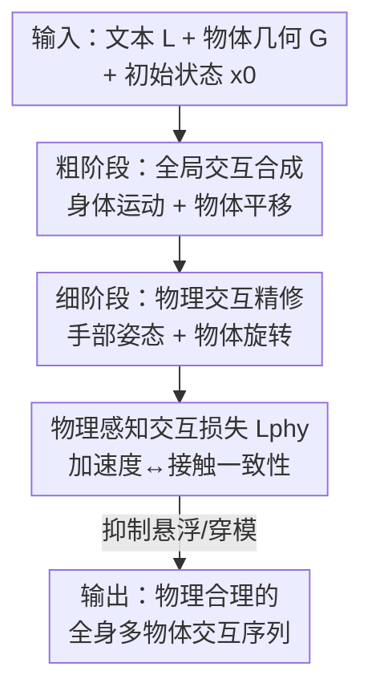

# PAMotion: Physics-Aware Motion Generation for Full-Body Interaction with Multiple Objects

**会议**: CVPR 2026  
**论文**: [CVF Open Access](https://openaccess.thecvf.com/content/CVPR2026/html/Di_PAMotion_Physics-Aware_Motion_Generation_for_Full-Body_Interaction_with_Multiple_Objects_CVPR_2026_paper.html)  
**代码**: https://github.com/liyuheng520/PAMotion  
**领域**: 人体动作生成  
**关键词**: 人物-物体交互, 动作生成, 扩散模型, 物理感知, 全身交互

## 一句话总结
PAMotion 用「物体加速度暴露接触状态」这一物理直觉，设计了一个软性的物理感知交互损失，再配合粗到细的两阶段条件扩散，让文本驱动的全身多物体交互动作既贴合语义又不再出现手穿模、物体悬空，在 HIMO 和 ParaHome 上刷新 SOTA。

## 研究背景与动机
**领域现状**：给定一句话指令生成真实的人物-物体交互（HOI）动作，是 CV/图形学里的基础问题，在 AR/VR、机器人、行为理解上都有用。扩散模型已经能把「单人操作单个物体」的动作生成得不错，代表工作如 HIMO-Gen 用双分支扩散网络联合预测人体运动和物体运动。

**现有痛点**：真实场景往往要同时操作多个物体（"把啤酒倒进高脚杯，再倒进垃圾桶"），把单人单物方法直接外推到多物体后，频繁出现物理不合理：手穿透物体、物体凭空悬浮、接触发生的时机和受力对不上。

**核心矛盾**：根因在于这些方法把交互当成纯运动学信号来建模——只学关节/物体的位置轨迹，**完全没建模背后的物理因果**。多物体交互里接触关系错综复杂，缺了物理约束，生成结果自然到处违反常识。

**本文目标**：在生成框架里显式回答"物体为什么会这样动"，即把运动学合成和物理推理桥接起来，同时还要兼顾"动作要符合文本语义"这个高层目标。

**切入角度**：作者从一个朴素却关键的观察切入——在日常的、慢速的人物交互里，**物体的加速度本身就泄露了它的接触状态**。如果物体加速度约等于重力 $g$，它多半在自由运动、没有接触；如果加速度偏离 $g$（包括悬停时 $\hat a = 0$），那一定有外力，即与手或其它物体存在直接/间接接触。

**核心 idea**：把上面三种情况转成一个软性的"物理感知交互损失"——当物体加速度偏离重力时，强制它与手/其它物体保持贴近且不穿透；再套一个粗到细的两阶段扩散，先生成贴合文本的全局运动，后精修受物理约束的手部和物体姿态。

## 方法详解

### 整体框架
PAMotion 要解决的是：给定文本指令 $L$、物体几何 $G=[g^n]$ 和初始状态 $x_0$，生成 $T$ 帧、$N$ 个物体的全身多物体交互序列 $X=[x_i]$，每帧 $x_i=(h_i, o^n_i)$ 含人体状态和各物体状态。人体用 SMPL-X 表示、关节旋转用 R6D 参数化，并拆成身体部分 $(J_{b,i}, Q_{b,i})$ 和手部 $(J_{h,i}, Q_{h,i})$；物体状态 $o^n_i$ 拆成平移 $T^n_i$ 和旋转 $R^n_i$。

整体是一个**两阶段粗到细的条件扩散框架**：粗阶段先生成贴合文本的全局运动——全局平移 $g_i$、身体运动 $(J_{b,i}, Q_{b,i})$ 和物体平移 $T^n_i$；细阶段再精修细粒度的手部关节 $(J_{h,i}, Q_{h,i})$ 和物体旋转 $R^n_i$，并由物理感知交互损失 $\mathcal{L}_{phy}$ 约束。这样切分的动机很具体：人描述任务都是高层视角（"把台灯从桌子移到床上"），不会说手怎么走、物体怎么转；如果一上来就让网络同时管躯干、手和精细物体动力学，它会在"达成语义目标"和"抠物理细节"之间失衡。所以先估出文本定义的目标级运动，再拿它当条件去优化局部物理交互。

### 关键设计

**1. 物理感知运动建模：用物体加速度当接触状态的探针**

这是全文的核心洞察，直接针对"纯运动学生成不懂物理"的痛点。作者把日常慢速交互归纳成三种情形：物体只受重力（自由落体/抛物线）时加速度 $\hat a \approx g$，称为**自由运动态（Free-Motion State）**；物体悬停静止时 $\hat a = 0$，手的支撑力平衡了重力；物体被用来切/碰其它物体时 $\hat a \neq g$，后两种统称**接触运动态（Contact-Motion State）**。直接硬约束 $\hat a = g$ 或显式建接触损失在真实数据上很不稳定（手会微形变、测得的加速度有噪声、物理假设不总成立），于是作者改成一个软性、可微的约束，把物体加速度 $\hat a$ 和物体到手/其它物体的最小距离 $d_t$ 耦合起来，得到物理感知交互损失：

$$\mathcal{L}_{phy} = \mathbb{E}_t\left[\left|\log\frac{d_t}{\beta}\right| \cdot |(a_t - g)\cdot t|\right]$$

其中 $\beta$ 是允许手/物体轻微形变的超参（实验取 0.01）。这个损失的精妙在于两项的乘法门控：当物体处于自由运动态（$a_t \approx g$），权重 $|(a_t-g)\cdot t|$ 趋近 0，不管距离项多大，损失都被压到接近 0，手和物体可以自由独立运动、不强加接触；当处于接触运动态，$|(a_t-g)\cdot t|$ 变成正权重激活距离约束，模型要降低 $|\log(d_t/\beta)|$，把 $d_t$ 推向 $\beta$。由于 $\log(\cdot)$ 的形状，**穿透时（$d_t$ 很小）损失急剧上升**狠罚穿模，而物体轻微脱离（悬浮）时损失缓慢上升给软监督，不在不需要接触时强加约束——一个损失同时压制了悬浮和穿透两个老毛病。⚠️ 公式中 $|(a_t-g)\cdot t|$ 里 $t$ 同时被当帧索引与点乘项，含义以原文为准。

**2. 粗到细两阶段生成：先对齐语义，再抠物理**

这一设计解决"高层目标 vs 低层物理"的学习失衡。**粗阶段（Stage I）**生成全局人体运动 $(g_i, J_{b,i}, Q_{b,i})$ 和物体平移 $T^n_i$，沿用 HIMO 的双分支扩散网络——一支管人体、一支管物体，两支通过 mutual interaction 模块交换信息；条件是文本 $L$（CLIP 编码）、物体几何 $G$（BPS 表示）和初始状态 $x_0$。监督用运动学+几何一致性项：对身体关节位置和一阶导都加 L2（$\mathcal{L}_{pv}=\sum_i\|J_{b,i}-\hat J_{b,i}\|_2^2+\sum_i\|\dot J_{b,i}-\hat{\dot J}_{b,i}\|_2^2$，兼顾空间对齐和时间平滑），旋转、物体平移、全局平移同理得 $\mathcal{L}_{qv}, \mathcal{L}_{tv}, \mathcal{L}_{gv}$，再加物体间相对距离约束 $\mathcal{L}_{dist}$，合成 $\mathcal{L}_{coarse}=\mathcal{L}_{pv}+\mathcal{L}_{qv}+\mathcal{L}_{tv}+\mathcal{L}_{gv}+\lambda_0\mathcal{L}_{dist}$。

**细阶段（Stage II）**在粗阶段结果之上精修手部运动 $(J_{h,i}, Q_{h,i})$ 和物体旋转 $R^n_i$，把粗阶段输出 $(g_i, J_{b,i}, Q_{b,i})$ 和 $T^n_i$ 一并作为条件预编码进网络，同样用双分支结构但改了最后输出层。关键是物体加速度的计算：在物体表面随机采 1024 个点，对点 $p$ 用刚体运动公式 $\hat a^n_i = R^n_i\big(\dot\omega\times p + \omega\times(\omega\times p)\big) + \ddot T^n_i$（$\omega$ 是角速度），再取所有点中 $|(a_t-g)\cdot t|$ 的最大值代入 $\mathcal{L}_{phy}$。细阶段总损失 $\mathcal{L}_{fine}=\mathcal{L}^r_{pv}+\mathcal{L}^r_{qv}+\mathcal{L}^r_{rv}+\lambda_1\mathcal{L}_{phy}$。一个工程细节：训练时细阶段用 ground-truth 的躯干和物体平移做条件，推理时换成粗阶段的预测。

### 损失函数 / 训练策略
单卡 RTX 3090、batch 32 训 1000 epoch，约 25 小时（粗阶段 10h + 细阶段 15h）。文本用冻结的 CLIP-ViT-B/32 编码；注意力 4 头、隐维 512；去噪网络含 8 层 mutual interaction 模块。超参 $\{\beta, \lambda_0, \lambda_1\}=\{0.01, 1.0, 0.1\}$。推理时跑 1000 步扩散、为所有人和物体生成动作约需 2.1 秒。

## 实验关键数据

### 主实验
在 HIMO（3.3K 条 4D HOI 序列、34 人 × 53 物体）上对比 SOTA，分两物体和三物体设置（↑ 越高越好、↓ 越低越好、→ 越接近 Real 越好）：

| 设置 | 方法 | R-Prec.↑ | FID↓ | MM-Dist↓ | Diversity→ |
|------|------|----------|------|----------|-----------|
| 两物体 | Real | 0.7988 | 0.0176 | 3.5659 | 11.3973 |
| 两物体 | HIMO-Gen | 0.6369 | 1.4811 | **3.6491** | 11.6603 |
| 两物体 | **PAMotion** | **0.6914** | **0.8285** | 3.9841 | **11.4431** |
| 三物体 | Real | 0.6988 | 0.1811 | 3.7696 | 9.7674 |
| 三物体 | HIMO-Gen | 0.5350 | 4.7712 | 5.0866 | 8.9460 |
| 三物体 | **PAMotion** | **0.6750** | **1.3763** | **3.7707** | **9.4573** |

两物体下 R-Precision、FID 比 HIMO-Gen 高 5.45%、低 0.653，唯一吃亏是 MM-Dist 略降 0.335（物体少时两者文本一致性都强）。**三物体下优势拉大**：R-Precision、FID、MM-Dist 分别领先次优 14.0%、3.395、1.316，Diversity 也更接近 Real。

ParaHome（207 条捕捉、随机选 500 条 HOI）上同样全面领先，FID 提升尤其大：

| 方法 | R-Prec.↑ | FID↓ | MM-Dist↓ | Diversity→ |
|------|----------|------|----------|-----------|
| Real | 0.6818 | 0.0017 | 5.3107 | 6.4100 |
| HIMO-Gen | 0.5909 | 3.2398 | 5.4455 | 6.1703 |
| **PAMotion** | **0.6364** | **0.7962** | **5.3356** | **6.3145** |

### 消融实验
核心消融就是去掉物理损失 $\mathcal{L}_{phy}$，两设置下都一致掉点：

| 设置 | 配置 | R-Prec.↑ | FID↓ | MM-Dist↓ | Diversity→ |
|------|------|----------|------|----------|-----------|
| 两物体 | Ours (full) | **0.6914** | **0.8285** | **3.9841** | 11.4431 |
| 两物体 | w/o $\mathcal{L}_{phy}$ | 0.6758 | 0.9046 | 4.0274 | 11.5996 |
| 三物体 | Ours (full) | **0.6750** | **1.3763** | **3.7707** | 9.4573 |
| 三物体 | w/o $\mathcal{L}_{phy}$ | 0.6312 | 1.5736 | 3.8260 | 9.4524 |

### 关键发现
- 物理损失 $\mathcal{L}_{phy}$ 在三物体（更复杂、更易出物理错误）下增益更明显：FID 从 1.5736 降到 1.3763、R-Precision 从 0.6312 升到 0.6750，比两物体的提升幅度大，说明物理约束对越难的多接触场景越有价值。
- 定性上 $\mathcal{L}_{phy}$ 直接缓解了悬浮和穿透两类典型 artifact，这也解释了为什么 FID（分布相似度）改善最显著——物理不合理的帧最拉低视觉真实度。
- 物体数越多，PAMotion 相对 HIMO-Gen 的差距越大，印证了"纯运动学外推到多物体会崩、物理推理才扛得住"的论点。

## 亮点与洞察
- **把物理直觉编码成一个乘法门控的软损失**很巧：$|\log(d_t/\beta)|$ 管距离、$|(a_t-g)\cdot t|$ 当动态权重，只在物体真有接触（加速度偏离重力）时才激活距离约束，自由运动时自动失效——避免了硬约束 $\hat a=g$ 在噪声数据上的不稳定，是个可迁移到其它接触建模任务的设计。
- **加速度作为接触探针**这个观察本身就是"啊哈"点：不需要显式的接触标注或力学仿真，仅从运动学量（加速度）反推物理接触状态，把生成和物理推理低成本地桥接起来。
- 粗到细解耦"语义目标"和"物理细节"的思路，可迁移到任何"高层指令 + 低层精修"的生成任务（如长程操作、双手协同），用粗阶段结果当条件喂细阶段是简单有效的工程范式。

## 局限与展望
- 作者承认的局限：$\mathcal{L}_{phy}$ 只保证接触态下手和物体保持接触，**不约束抓握姿态本身**，会出现"手碰到了灯泡但抓握姿势物理上不成立"的失败案例。设想用预训练大规模抓握模型（如 GraspNet）来正则抓握姿态，但扩展到多物体还要处理双手协调和手间一致性，需要大量数据和训练。
- 自己发现的局限：物理假设建立在"日常慢速交互"前提上，对快速运动（加速度噪声大、惯性效应强）是否成立存疑；只考虑手与物体接触、显式忽略躯干接触，碰到坐靠/抱持等躯干主导的交互可能失效。
- 评测仍依赖 HIMO/ParaHome 两个数据集和 HIMO 的运动-文本特征提取器，物理合理性主要靠 FID 和定性图体现，缺一个直接量化穿透/悬浮的物理指标。

## 相关工作与启发
- **vs HIMO-Gen**：HIMO-Gen 用双分支扩散把人体和物体当纯运动学信号联合预测，不建物理；PAMotion 沿用它做粗阶段骨架，但加了物理感知损失和细阶段精修，本质区别是把"接触/受力"显式建进生成，物体越多优势越大。
- **vs 物理类 HOI 方法**：传统物理法显式建模力、接触和环境约束求真实感，但通常重、需仿真；PAMotion 走运动学生成 + 软物理损失的折中，只用加速度当接触代理，轻量且端到端可训，代价是物理保真度不如全仿真、且不管抓握姿态。

## 评分
- 新颖性: ⭐⭐⭐⭐ 用物体加速度反推接触状态、转成乘法门控软损失，观察朴素但桥接运动学与物理的角度很巧
- 实验充分度: ⭐⭐⭐ 两数据集 × 两难度设置 + 物理损失消融到位，但消融维度较单一（基本只消 $\mathcal{L}_{phy}$），缺直接的穿透/悬浮量化指标
- 写作质量: ⭐⭐⭐⭐ 从观察到损失到 pipeline 推导清晰，三种接触态的物理直觉讲得很好懂
- 价值: ⭐⭐⭐⭐ 多物体全身 HOI 生成刷新 SOTA，物理软损失思路对接触敏感的动作生成任务有普适借鉴意义

<!-- RELATED:START -->

## 相关论文

- [\[CVPR 2026\] SAM 3D Body: Robust Full-Body Human Mesh Recovery](sam_3d_body_robust_full-body_human_mesh_recovery.md)
- [\[CVPR 2026\] HandX: Scaling Bimanual Motion and Interaction Generation](handx_scaling_bimanual_motion_and_interaction_generation.md)
- [\[CVPR 2026\] InterAgent: Physics-based Multi-agent Command Execution via Diffusion on Interaction Graphs](interagent_physics-based_multi-agent_command_execution_via_diffusion_on_interaction_graphs.md)
- [\[CVPR 2026\] ReGenHOI: Unifying Reconstruction and Generation for 3D Human-Object Interaction Understanding](regenhoi_unifying_reconstruction_and_generation_for_3d_human-object_interaction_.md)
- [\[CVPR 2026\] SyncMos: Scalable Motion Synchronisation for Multi-Agent Scene Interaction](syncmos_scalable_motion_synchronisation_for_multi-agent_scene_interaction.md)

<!-- RELATED:END -->
