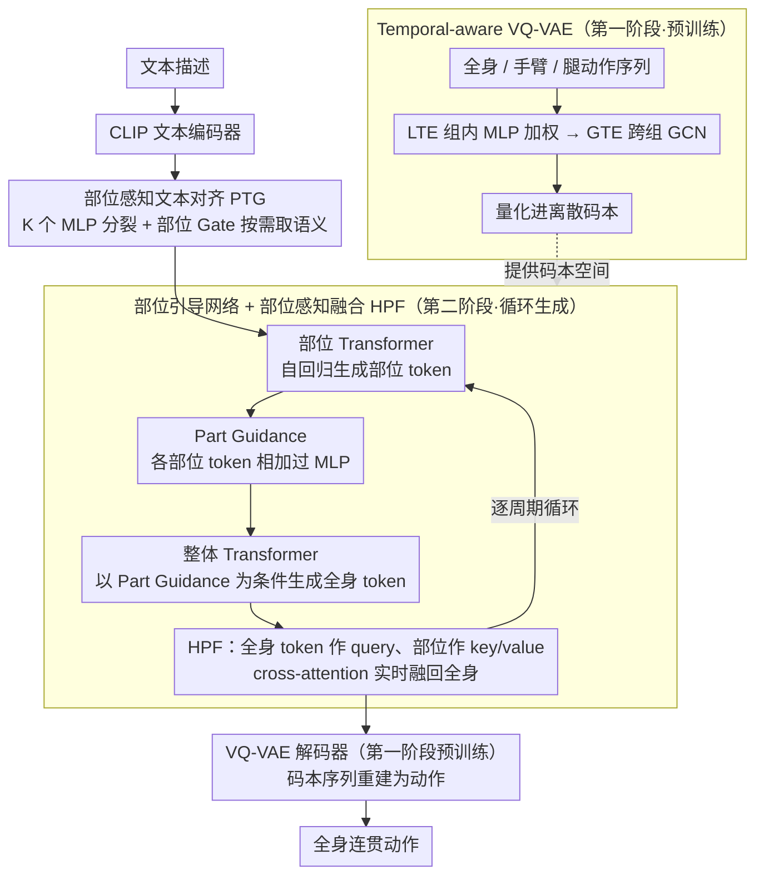

# ParTY: Part-Guidance for Expressive Text-to-Motion Synthesis

**会议**: CVPR 2026  
**arXiv**: [2603.09611](https://arxiv.org/abs/2603.09611)  
**代码**: [项目主页](https://heokunho.github.io/ParTY/)  
**领域**: 人体理解  
**关键词**: text-to-motion, 身体部位引导, VQ-VAE, 部位感知文本对齐, 动作连贯性

## 一句话总结

提出 ParTY 框架，通过部位引导网络（Part-Guided Network）和部位感知文本对齐（Part-aware Text Grounding），在保持全身动作连贯性的同时大幅提升身体各部位的文本-动作语义对齐精度，解决了现有整体式方法与部位拆分方法之间"部位表达力 vs 全身连贯性"的根本矛盾。

## 研究背景与动机

- **文本驱动动作生成的应用前景**：text-to-motion 在动画、VR、游戏、机器人等领域有广泛应用，近年在架构层面取得了显著进展（VQ-VAE + Transformer、扩散模型等）。
- **整体式方法的局限**：大多数现有方法将人体视作单一整体生成全身动作，虽然全局连贯性好，但对文本中涉及特定肢体部位的细粒度描述难以准确建模，部位级别的语义常被忽略或误表达。
- **部位拆分方法的两大缺陷**：ParCo、LGTM 等部位拆分方法将身体拆解为手臂、腿等独立生成，虽然部位控制力更强，但（i）缺乏将文本语义与各部位显式对齐的机制；（ii）独立生成后简单拼合导致全身动作不连贯（如颈部扭曲、上下身朝向不一致）。
- **核心矛盾**：部位表达力与全身连贯性之间存在根本性权衡——部位拆分方法提升了前者却牺牲了后者，目前没有方法能同时兼顾两者。
- **评估协议缺失**：现有评估指标（如 FID、R-Precision）仅在全身层面操作，无法准确衡量部位级语义对齐质量，也没有直接评估跨部位动作连贯性的度量。
- **本文目标**：设计一个统一框架，桥接整体式和部位拆分方法的优势——既实现精细的部位-文本对齐，又保持全身连贯的动作输出；同时提出部位级和连贯性级别的新评估指标。

## 方法详解

### 整体框架

ParTY 采用两阶段训练策略。**第一阶段**训练 Temporal-aware VQ-VAE，将全身和各部位（手臂、腿）的动作序列分别量化为离散码本。**第二阶段**训练整体 Transformer 和部位 Transformer：文本 embedding 经 Part-aware Text Grounding (PTG) 处理后分别送入各部位 Transformer，先生成部位动作 token 构建 Part Guidance，再将其注入整体 Transformer 引导全身动作生成，并在生成过程中通过 Holistic-Part Fusion (HPF) 持续融合部位信息。推理时，预测的码本序列由第一阶段预训练的 VQ-VAE 解码器重建为动作。

### 关键设计

**1. Temporal-aware VQ-VAE：让大压缩窗口下也不丢时序流**

标准 VQ-VAE 在固定窗口里压缩动作时，窗口一大就会把帧间的时序流抹平，量化质量随之崩塌——可窗口小又意味着更多 token、更慢的推理。ParTY 用两级时序增强把这对矛盾拆开：Local Temporal Enhancement (LTE) 先把帧级特征按窗口分组，组内用一个 MLP 算权重再加权求和得到组级特征，保住窗口内的局部动态；Global Temporal Enhancement (GTE) 再在组级特征上搭一张图卷积网络（GCN），跨组捕捉全局时序依赖，最后才量化进码本。这样即便窗口从 4 放大到 12（推理时间缩减约 64%），量化后的 FID 也只微升到 0.042，仍远好于同等窗口下原始 MoMask 的 0.126。

**2. Part-aware Text Grounding (PTG)：让每个部位读到「为它定制」的文本语义**

一句话动作描述往往同时管着手臂、腿、躯干，单一文本 embedding 喂给所有部位，细粒度的部位语义就被稀释了。PTG 的做法是先「分裂」再「按需取用」：CLIP 文本 embedding 经 K 个独立 MLP 变换成 K 个多样化 embedding，再由每个部位专属的 Gate 网络自适应加权，挑出对该部位最相关的语义方向。为了让这 K 个 embedding 既彼此不同又不跑偏，训练时加一个对比式的多样性损失 $\mathcal{L}_{\text{div}}$ 约束它们语义一致但方向发散；同时用 LLM 为每个部位生成辅助描述（如原句"向前走并左手捡东西"→ 手臂描述"左臂捡起地上的东西"），用 L1 loss 把 Gate 选出的部位 embedding 对齐到这段描述上。关键在于 LLM 只在训练时用——推理阶段 Gate 已经学会了如何拆分语义，不再需要 LLM，因此也避开了 LGTM 那种直接让 LLM 切分文本、丢掉整句上下文的问题。

**3. Part-Guided Network + Holistic-Part Fusion：让部位「先行一步」引导全身，而非事后拼合**

部位拆分方法连贯性差的根因，是各部位独立生成完再硬拼，颈部扭曲、上下身朝向打架都出在这一步。ParTY 改成循环式的「部位先走、全身跟上」：每个周期里，部位 Transformer 先自回归生成 T 步 token，各部位 token 相加后过 MLP 融成 Part Guidance；整体 Transformer 在同一时间段以这份 Part Guidance 为额外条件生成全身 token，相当于全身生成时手里已经攥着部位的前瞻信息。Holistic-Part Fusion (HPF) 则负责每一步的动态对齐——它把全身、手臂、腿 token 拼起来做 self-attention，再以全身 token 为 query、各部位 token 为 key/value 做 cross-attention，把部位信息实时融回全身表示。注意力图显示，文本里被点名的部位会拿到显著更高的权重，说明这种持续融合确实在按语义分配注意力，而不是简单平均，从根本上避开了"拼合"带来的不连贯。

### 一个完整示例：生成"向前走并左手捡东西"

输入这句文本后，CLIP 先把它编码成一个全局 embedding，PTG 再把它分裂成 K 个多样化 embedding——腿部的 Gate 主要取到"向前走"的语义方向，左臂的 Gate 取到"捡东西"的方向。第一个生成周期里，腿部 Transformer 自回归生成前 T 步迈步 token，手臂 Transformer 生成对应的弯腰伸手 token，两者相加融成 Part Guidance；整体 Transformer 拿着这份引导，在同一时间段生成"既在走路、左手又向下探"的全身 token，HPF 此刻把全身 query 对齐到"左臂" key 上、给它更高权重，保证伸手动作不会和走路的躯干姿态打架。如此逐周期推进直到序列结束，最后由第一阶段预训练的 VQ-VAE 解码器把码本序列重建成连续动作。

## 损失函数

总损失由四部分组成：

$$\mathcal{L} = \mathcal{L}_{\text{hol}} + \mathcal{L}_{\text{part}} + \lambda_{\text{div}} \mathcal{L}_{\text{div}} + \lambda_{\text{aux}} \mathcal{L}_{\text{aux}}$$

- $\mathcal{L}_{\text{hol}}$：整体 Transformer 的交叉熵损失，监督全身动作 token 的自回归预测
- $\mathcal{L}_{\text{part}}$：部位 Transformer 的交叉熵损失（手臂 + 腿），监督各部位动作 token 预测
- $\mathcal{L}_{\text{div}}$：对比学习多样性损失，鼓励 K 个变换 embedding 彼此不同但与原始 embedding 语义一致
- $\mathcal{L}_{\text{aux}}$：辅助 L1 损失，将 PTG 输出与 LLM 生成的部位描述 embedding 对齐（仅训练时）

VQ-VAE 阶段：$\mathcal{L}_{vq} = \mathcal{L}_{rec} + \lambda_{app} \cdot \mathcal{L}_{app}$，包含 L1 重建损失和 L2 码本逼近损失。

## 实验

在 HumanML3D（14,616 动作，44,970 文本）和 KIT-ML（3,911 动作，6,278 文本）上评估。

**表1：HumanML3D 全身级别主实验**

| 方法 | R-Prec Top-1↑ | R-Prec Top-3↑ | FID↓ | MM-Dist↓ |
|------|--------------|--------------|------|----------|
| T2M-GPT | 0.491 | 0.775 | 0.116 | 3.118 |
| ParCo | 0.515 | 0.801 | 0.109 | 2.927 |
| MoMask | 0.521 | 0.807 | 0.045 | 2.958 |
| BAMM | 0.525 | 0.814 | 0.055 | 2.919 |
| **ParTY** | **0.550** | **0.836** | **0.035** | **2.779** |

ParTY 在所有核心指标上均取得 SOTA，R-Prec Top-1 比第二名 BAMM 高 2.5 个百分点，FID 降低 36%。

**表2：部位级别评估（HumanML3D）**

| 方法 | 部位 | R-Prec Top-1↑ | FID↓ | MM-Dist↓ |
|------|------|--------------|------|----------|
| MoMask | Arms | 0.452 | 0.175 | 3.440 |
| ParCo | Arms | 0.468 | 0.215 | 3.326 |
| **ParTY** | **Arms** | **0.506** | **0.133** | **3.079** |
| MoMask | Legs | 0.403 | 0.104 | 3.513 |
| ParCo | Legs | 0.407 | 0.118 | 3.482 |
| **ParTY** | **Legs** | **0.463** | **0.078** | **3.122** |

**表3：连贯性评估**

| 方法 | Temporal Coherence↑ | Spatial Coherence↑ |
|------|--------------------|--------------------|
| ParCo | 0.49 | 0.59 |
| MoMask | 0.84 | 0.90 |
| **ParTY** | **0.88** | **0.92** |

ParTY 在部位表达力上远超整体式和部位拆分方法，同时连贯性甚至略优于整体式方法 MoMask，验证了同时兼顾两个目标的有效性。

**表4：Temporal-aware VQ-VAE 移植到 MoMask 的效果**

| 方法 | 窗口大小 | 重建 FID↓ | 生成 FID↓ | 推理时间 |
|------|----------|----------|----------|----------|
| MoMask | 4 | 0.020 | 0.045 | 80ms |
| MoMask + Ours | 4 | 0.003 (+85%) | 0.033 (+26%) | - |
| MoMask | 8 | 0.042 | 0.094 | 43ms (-46%) |
| MoMask + Ours | 8 | 0.005 (+88%) | 0.039 (+58%) | - |
| MoMask | 12 | 0.079 | 0.126 | 29ms (-64%) |
| MoMask + Ours | 12 | 0.011 (+86%) | 0.042 (+67%) | - |

**表5：各组件消融**

| PG | PTG | HPF | R-Prec Top-1↑ | FID↓ | MM-Dist↓ |
|----|-----|-----|-------------|------|----------|
| | | | 0.494 | 0.158 | 3.087 |
| ✓ | | | 0.520 | 0.086 | 2.913 |
| ✓ | ✓ | | 0.545 | 0.051 | 2.799 |
| ✓ | ✓ | ✓ | **0.550** | **0.035** | **2.779** |

## 亮点

- **解决核心矛盾**：首次有效解决部位拆分方法"部位表达力 vs 全身连贯性"的根本权衡，Part-Guided Network 让部位信息前瞻引导全身生成而非事后拼合。
- **PTG 模块设计精巧**：通过对比学习产生多样化 embedding + Gate 动态选择，比 LGTM 的 LLM 文本分解方案更优雅，且 LLM 辅助仅限训练阶段，推理无额外开销。
- **Temporal-aware VQ-VAE 通用性强**：可直接移植到 MoMask 等方法上带来显著提升（FID 降低 26%-67%），大窗口时推理时间缩减 64% 而性能几乎不降。
- **完善的评估体系**：提出部位级和连贯性级别评估指标（TC、SC），填补了该领域的评估空白，首次量化验证了部位拆分方法的连贯性缺陷。

## 局限性

- 身体部位仅拆分为手臂和腿两大组，缺乏对手指、头部、躯干等更细粒度部位的建模能力。
- 训练阶段依赖 LLM 生成部位辅助描述，数据准备成本增加，且 LLM 描述质量可能影响 PTG 训练效果。
- 循环式"先部位后全身"的生成流程增加了推理步数，虽然 Temporal-aware VQ-VAE 可通过大窗口部分补偿，但总体推理时间仍高于单一 Transformer 方法。
- 仅在 HumanML3D 和 KIT-ML 上验证，未涉及更复杂场景（如多人交互、物体交互、长序列生成）。
- TC 和 SC 连贯性指标虽然有效区分了部位拆分方法的缺陷，但其统计特性和与人类感知的相关性还需更广泛验证。

## 相关工作

- **整体式 text-to-motion**：T2M-GPT、MoMask、BAMM、MMM 等基于 VQ-VAE + Transformer 或扩散模型的方法，全身生成连贯性好但部位细节不足。
- **部位拆分方法**：SCA（上下半身拆分）、AttT2M（身体部位注意力编码器）、ParCo（各部位独立 VQ-VAE + token sharing）、LGTM（LLM 分解文本为部位描述），在部位控制上有进展但连贯性差。
- **动作量化**：VQ-VAE 在 text-to-motion 中被广泛采用，但固定窗口导致时序信息丢失，本文的 Temporal-aware VQ-VAE 从局部和全局两个层面增强时序保留。

## 评分

| 维度 | 评分 |
|------|------|
| 创新性 | ⭐⭐⭐⭐ |
| 实验充分度 | ⭐⭐⭐⭐⭐ |
| 写作清晰度 | ⭐⭐⭐⭐ |
| 实用价值 | ⭐⭐⭐⭐ |

<!-- RELATED:START -->

## 相关论文

- [\[CVPR 2026\] Miburi: Towards Expressive Interactive Gesture Synthesis](miburi_towards_expressive_interactive_gesture_synthesis.md)
- [\[CVPR 2026\] FrankenMotion: Part-level Human Motion Generation and Composition](frankenmotion_part-level_human_motion_generation_and_composition.md)
- [\[CVPR 2026\] MoLingo: Motion-Language Alignment for Text-to-Human Motion Generation](molingo_motion-language_alignment_for_text-to-motion_generation.md)
- [\[ICLR 2026\] Event-T2M: Event-level Conditioning for Complex Text-to-Motion Synthesis](../../ICLR2026/human_understanding/event-t2m_event-level_conditioning_for_complex_text-to-motion_synthesis.md)
- [\[CVPR 2026\] MotionHiFlow: Text-to-Motion via Hierarchical Flow Matching](motionhiflow_text-to-motion_via_hierarchical_flow_matching.md)

<!-- RELATED:END -->
