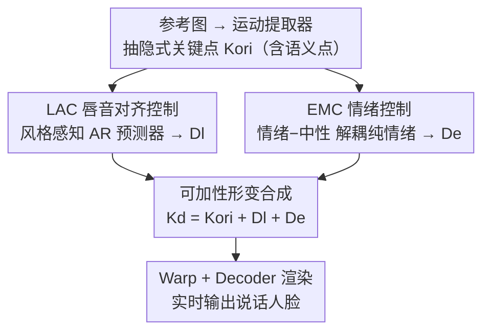

# PC-Talk: Precise Facial Animation Control for Audio-Driven Talking Face Generation

**会议**: CVPR 2026  
**论文**: [CVF Open Access](https://openaccess.thecvf.com/content/CVPR2026/html/Wang_PC-Talk_Precise_Facial_Animation_Control_for_Audio-Driven_Talking_Face_Generation_CVPR_2026_paper.html)  
**代码**: [项目页](https://bq-wang0511.github.io/PC-Talk/)  
**领域**: 数字人 / 说话人脸生成  
**关键词**: 音频驱动说话人脸、隐式关键点、唇音对齐、情绪控制、说话风格

## 一句话总结
PC-Talk 在隐式关键点（implicit keypoint）这一中间表示上做「可加性形变」，用 LAC 模块控制带说话风格的唇音对齐、用 EMC 模块通过「减去中性表情」解耦出纯情绪形变，从而对说话风格、唇动幅度、情绪强度乃至分区域复合情绪做精细可控的实时（30 FPS）说话人脸生成，并在 HDTF / MEAD 上取得 SOTA。

## 研究背景与动机

**领域现状**：音频驱动说话人脸广泛用于数字人、影视、语音助手。近年方法在唇同步精度上进步显著（Wav2Lip 引入唇同步判别器、扩散类方法 EchoMimic/Hallo/Sonic 画质提升），也有 EAT、VASA、Ditto 等用中间表示（隐式关键点）做两阶段（audio-to-motion + motion-to-image）生成。

**现有痛点**：当前方法**缺乏对说话人脸的精细控制**，生成的面部运动千篇一律。具体两方面：(1) 说话风格——每个人发同一音素时唇形习惯不同（说 "duck" 时嘴张多大、"bee" 时嘴多宽、"too" 时撅嘴程度），现有方法要么只能取单一风格源、要么无法对单个发音做细粒度编辑，也无法模拟音量大小对唇动幅度的影响；(2) 情绪——真实情绪往往是复合的（笑的嘴 + 哀的眉），现有方法多用单一情绪标签、无法调强度、无法分区域合成复合情绪；EAT 画质差、ED-Talk 情绪库受限会把愤怒混入悲伤。

**核心矛盾**：在隐式关键点空间里，唇部形变同时包含「唇音同步形变」和「纯情绪形变」，两者天然纠缠、难以解耦——直接预测情绪脸的形变会让情绪和唇形互相污染（如嘴过度闭合）。

**本文目标**：把可控性拆成两个正交维度——唇音对齐控制（LAC）和情绪控制（EMC）——并各自做到风格/强度/分区域的精细可调。

**切入角度**：隐式关键点中部分点带语义（对应唇、眉等、靠 landmark 距离约束绑定 2D 关键点），既能精确同步又能分区域操作；且形变在该空间里近似可加。

**核心 idea**：在隐式关键点上做**可加性形变** $K_d = K_{ori} + D_l + D_e$，唇音形变 $D_l$ 由 LAC 给、情绪形变 $D_e$ 由 EMC 给，而 $D_e$ 通过「情绪预测 − 中性预测」相减解耦出纯情绪。

## 方法详解

### 整体框架
PC-Talk 以隐式关键点为中间表示。先从参考图 $I_{ref}$ 用运动提取器抽出原始关键点 $K_{ori}$（含姿态估计器算旋转 $R$/平移 $t$/尺度 $s$、表情估计器算形变 $\delta$、规范关键点检测器算 $K_c$，$K_{ori}=s\cdot(K_c\cdot R+\delta)+t$）。然后两个模块并行算形变：LAC 模块根据音频 $a$ 和说话风格算唇音对齐形变 $D_l$；EMC 模块根据情绪输入算情绪形变 $D_e$。两者与 $K_{ori}$ 相加得到驱动关键点 $K_d=K_{ori}+D_l+D_e$。最后 warping 模块在 $K_{ori}$ 与 $K_d$ 间估光流、作用到身份编码器提取的外观特征 $f_a$ 上，decoder 渲染出最终图 $I_{res}=Decoder(Warp(f_a,K_{ori},K_d))$。训练 LAC/EMC 时其余组件冻结。

### 关键设计

**1. 隐式关键点中间表示与可加性形变：把控制问题转成在关键点空间里加形变**

PC-Talk 不直接在像素上生成，而是把所有控制都落到隐式关键点的形变上：$K_d=K_{ori}+D_l+D_e$。这一设计的关键在于隐式关键点里有一部分点**带语义**——它们在训练时通过 landmark 距离约束绑定到 2D 人脸 landmark（唇、眉等），因此既能被精确同步控制、又能按面部区域被独立操作（这是后面分区域复合情绪的前提）。把唇音形变 $D_l$ 与情绪形变 $D_e$ 设计成**可加**，让 LAC 和 EMC 两个模块解耦地各管一摊、又能简单叠加，是整个可控框架的地基。渲染端用 warp（$K_{ori}\to K_d$ 的光流）+ decoder，重演只需改关键点、不动外观特征，支持实时与视频输入逐帧处理。

**2. LAC 唇音对齐控制：风格感知自回归预测器 + 音视频同步预训练的音频编码器**

针对「唇形随说话风格变化、且需细粒度可编辑」的痛点，LAC 用一个**风格感知的自回归 Transformer**（受 FaceFormer 启发）预测形变：把风格嵌入 $e_s$ 连同位置编码一起喂入，自回归结构保证时序一致；先自注意力融合风格与运动特征，再交叉注意力与音频特征交互，最后用一个精修 MLP **直接作用到 $K_{ori}$ 上而非作用到表情形变上**，以缓解隐式表示里的残余纠缠，即 $D_l=ExpPredictor(e_a,e_s,K_{ori})$。音频嵌入 $e_a$ 不用 Whisper 这类 ASR，而是**在 2D 音视频同步任务上预训练**音频编码器，让音频特征与唇动对齐更好（消融里这是涨点主力）。风格空间上，数据集每种风格用 one-hot 码当预设、视频参考则用 Transformer 编码进同一共享风格空间，训练时随机在二者间切换，推理时两种输入都支持。此外唇动幅度可由音频振幅算出的乘性因子 $f$ 缩放 $D_l$ 来模拟音量；说话风格编辑则把生成的 $D_l$ 投影到特定发音（如撅嘴、咧嘴）的形变向量上再缩放，实现逐发音的精细编辑。

**3. EMC 情绪控制：用「情绪减中性」解耦纯情绪形变 + 分区域复合情绪**

这是全文最妙的一招，直击「情绪形变与唇音形变纠缠」的核心矛盾。做法是：用同一段音频，分别预测「带情绪」和「中性」两套组合形变（保证两者唇音形变一致），再相减得到纯情绪形变 $D_e=CPred(emo,e_a)-CPred(\text{'neutral'},e_a)$，其中 $CPred$ 是组合表情预测器。相减把共享的唇音分量抵消、只留下情绪本身，从而把情绪无缝叠加到同步的唇动上而不互相污染。因为 $CPred$ 复用了 LAC 里表情预测器的同款架构，强度/风格控制也能直接迁移到情绪上（如调情绪强度）。情绪来源灵活：图像直接替换表情、音频/文本则用预训练情绪分类器抽情绪嵌入。复合情绪则利用隐式关键点的分区域语义，**对每个面部区域独立生成情绪表情再无缝合成**（如嘴笑 + 眼哀），实现单一标签做不到的细腻复合状态。消融（Fig.4）显示去掉解耦后情绪不自然（嘴过度闭合）。

### 损失函数 / 训练策略
LAC 损失 $L_{LAC}=L_{sync}+\lambda_{kp}L_{kp}+\lambda_{reg}L_{reg}+\lambda_{vel}L_{vel}+\lambda_{style}L_{style}$：其中同步损失 $L_{sync}$ 借鉴 Wav2Lip，用视频与音频同步网络的特征做负余弦相似（提升唇同步）；$L_{kp}$ 是隐式关键点 L1 损失；$L_{reg}$ 约束过度形变；$L_{vel}$ 强制时序一致；$L_{style}$ 是增强风格适配能力的判别损失。EMC 模块只用 $L_{kp},L_{reg},L_{vel}$。视频转 25fps、音频 16kHz；LAC 在 HDTF + MEAD 中性片段上训、EMC 在 MEAD 情绪内容上训；单卡 RTX 4090，LAC 训两天、EMC 训一天；输出 512×512、30 FPS 实时；推理用 overlap window 保证自回归时序一致。

## 实验关键数据

数据集：HDTF（16 小时、300+ 人，仅中性）与 MEAD（40+ 身份、8 类情绪）。指标：LSE-C↑/LSE-D↓（SyncNet 唇同步置信度/距离）、FID↓（全参考画质）、NIQE↓（无参考画质）、FVD↓（视频时序质量）、Accemo↑（情绪分类准确率）、E-FID↓（表情距离）。因 HDTF 仅中性脸，Accemo 只在含情绪标注的数据上报。

### 主实验：唇音对齐（HDTF / MEAD-Neutral 节选）

| 方法 | 输入 | HDTF LSE-C↑ | HDTF LSE-D↓ | HDTF FID↓ | HDTF FVD↓ |
|------|------|-------------|-------------|-----------|-----------|
| Wav2Lip | Video | 8.65 | 6.78 | 32.24 | 183.99 |
| LatentSync | Video | 8.92 | 6.84 | 16.32 | 175.23 |
| **PC-Talk** | Video | **9.03** | **6.69** | **15.51** | **100.85** |
| Sonic | Image | 8.64 | 6.77 | 40.81 | 212.78 |
| **PC-Talk** | Image | **9.37** | **6.44** | 33.07 | 205.55 |

亮点：PC-Talk 的唇同步 LSE-C（视频 9.03 / 图像 9.37）甚至超过专门做唇同步的 Wav2Lip（8.65）和 LatentSync（8.92），且 FVD 远低，时序一致性最好（得益于自回归 + overlap window）。

### 情绪说话人脸（MEAD 节选）

| 方法 | LSE-C↑ | FID↓ | Accemo↑ | E-FID↓ |
|------|--------|------|---------|--------|
| EAT | 12.77 | 109.91 | 68.21 | 2.54 |
| ED-Talk | 7.81 | 131.69 | 57.45 | 2.10 |
| **PC-Talk** | 7.74 | **35.26** | **72.32** | **1.88** |

PC-Talk 在 MEAD 上 Accemo 达 72.32（情绪表达最准）、E-FID 最低（表情最贴近）、FID 大幅领先（35.26 vs ED-Talk 131.69），说明情绪既准又自然。⚠️ EAT 的 LSE-C=12.77 偏高但其画质 FID 高达 109.91、E-FID 也更差，唇同步分数与整体质量需结合看。

### 消融实验

| 配置 | LSE-C↑（唇同步） |
|------|------------------|
| 无 AV Encoder + 无 Lsync + 无 Lkp | 6.23 |
| + AV Encoder | 7.17 |
| + AV Encoder + Lsync | 8.92 |
| + AV Encoder + Lsync + Lkp（Full） | **9.37** |

### 关键发现
- **音视频同步预训练的音频编码器是涨点主力**：把它换成传统 Whisper 后 LSE-C 明显下降；在它基础上加 $L_{sync}$（6.23→7.17→8.92）、再加 $L_{kp}$（→9.37）逐级提升。
- **情绪解耦显著提升表情自然度**：不解耦时情绪不自然（嘴过度闭合），解耦后情绪清晰可分（Fig.4）。
- **效率**：PC-Talk 30.13 FPS，远超扩散类的 EchoMimic（0.84）、Hallo-v2（0.69），与 SadTalker（10.76）相比也快得多，且不带额外控制时可达 34.75 FPS。

### 效率对比（FPS）

| 方法 | SadTalker | EchoMimic | Hallo-v2 | Ours(w/o control) | Ours |
|------|-----------|-----------|----------|-------------------|------|
| FPS | 10.76 | 0.84 | 0.69 | 34.75 | 30.13 |

## 亮点与洞察
- **「情绪 − 中性」相减解耦纯情绪**：用同一音频预测带情绪和中性两套形变再相减，把共享的唇音分量自动抵消、只留情绪本身——一个极简却干净利落地解决了情绪与唇形纠缠的老问题，几乎零额外结构成本。
- **可加性形变 + 语义关键点**：把控制全转成关键点空间的加法，让 LAC/EMC 解耦又可叠；语义关键点绑定 landmark 后能分区域操作，直接撑起了「分区域复合情绪」这个别人做不到的能力。
- **唇同步反超专用模型**：用 AV 同步预训练音频编码器 + Wav2Lip 式 sync loss，唇同步竟超过 Wav2Lip/LatentSync 这些专门做唇同步的方法，说明音频表示的对齐质量比骨干复杂度更重要。
- **可迁移 trick**：精修 MLP 直接作用到 $K_{ori}$ 而非表情形变上以缓解残余纠缠，这种「在更干净的表示层施加修正」的思路可迁移到其他隐式表示生成任务。

## 局限与展望
- 论文未充分讨论的局限：情绪源里音频/文本要靠预训练情绪分类器，分类器误差会传导到生成情绪上；细节放在补充材料。
- ⚠️ 自己看：「情绪−中性」解耦假设两套预测的唇音分量严格一致，但两次预测条件不同（情绪 vs 中性），残差里可能仍混入非纯情绪成分；论文未量化这一残差。
- 复合情绪的分区域合成依赖语义关键点的区域划分质量，跨区域接缝处的自然度、以及强度过大时的稳定性未深入分析。
- 训练数据情绪类别受 MEAD 8 类限制，对数据集外的细腻/混合情绪泛化能力存疑。

## 相关工作与启发
- **vs EAT**：EAT 也用隐式关键点做情绪说话脸，但直接预测情绪形变、未解耦唇音与情绪，画质差（FID 109.91）；PC-Talk 用相减解耦 + 神经渲染，画质（FID 35.26）和情绪准确率（Accemo 72.32 vs 68.21）双优。
- **vs ED-Talk**：ED-Talk 靠解耦情绪与唇动提升表现力，但情绪库受限、会把愤怒混入悲伤、不能调强度；PC-Talk 支持连续强度与分区域复合情绪。
- **vs VASA / Ditto**：VASA 用 DiT 产生唇音同步运动但未充分挖掘运动空间的可控性；Ditto 用隐式关键点但唇同步不稳；PC-Talk 在可控性和唇同步稳定性上都更强。
- **vs Wav2Lip**：Wav2Lip 专攻唇同步但无可控性；PC-Talk 借鉴其 sync loss，唇同步反超它，同时具备风格/情绪控制。

## 评分
- 新颖性: ⭐⭐⭐⭐ 「情绪−中性」解耦 + 可加性语义关键点形变的组合很巧，分区域复合情绪是真新能力
- 实验充分度: ⭐⭐⭐⭐ 两数据集、三类 baseline、唇音/情绪/效率/消融齐全，但部分细节挪到补充
- 写作质量: ⭐⭐⭐⭐ 控制维度拆解清晰、公式到位，图示直观
- 价值: ⭐⭐⭐⭐ 30 FPS 实时 + 细粒度可控，对数字人/影视的可定制化生成实用价值高

<!-- RELATED:START -->

## 相关论文

- [\[CVPR 2026\] ActAvatar: Temporally-Aware Precise Action Control for Talking Avatars](actavatar_temporally-aware_precise_action_control_for_talking_avatars.md)
- [\[CVPR 2026\] AudioAvatar: Personalized Audio-driven Whole-body Talking Avatars](audioavatar_personalized_audio-driven_whole-body_talking_avatars.md)
- [\[ECCV 2024\] Audio-Driven Talking Face Generation with Stabilized Synchronization Loss](../../ECCV2024/human_understanding/audio-driven_talking_face_generation_with_stabilized_synchronization_loss.md)
- [\[CVPR 2026\] Talking Together: Synthesizing Co-Located 3D Conversations from Audio](talking_together_synthesizing_co-located_3d_conversations_from_audio.md)
- [\[CVPR 2026\] UniLS: End-to-End Audio-Driven Avatars for Unified Listening and Speaking](unils_end-to-end_audio-driven_avatars_for_unified_listening_and_speaking.md)

<!-- RELATED:END -->
