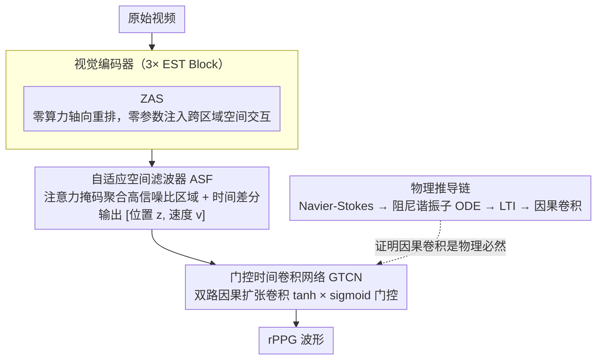

# PHASE-Net: Physics-Grounded Harmonic Attention System for Efficient Remote Photoplethysmography Measurement

**会议**: CVPR 2026  
**arXiv**: [2509.24850](https://arxiv.org/abs/2509.24850)  
**代码**: [GitHub](https://github.com/Alex036225/PhaseNet)  
**领域**: 人体理解  
**关键词**: rPPG, 物理信息网络, 时间卷积网络, 血流动力学, Navier-Stokes, 轻量模型

## 一句话总结

从Navier-Stokes方程出发，通过严格数学推导揭示rPPG脉搏信号遵循二阶阻尼谐振子模型，其离散解形式等价于因果卷积算子，从而为TCN架构的选择提供了第一性原理依据，设计出仅0.29M参数的PHASE-Net在多个数据集上达到SOTA。

## 研究背景与动机

**领域现状**：远程光电容积脉搏波（rPPG）通过普通摄像头捕捉皮肤血容量微变化来提取心率等生理信号，是非接触生理监测的关键技术。深度学习方法（PhysNet、PhysFormer、RhythmMamba等）已成为主流范式。

**现有痛点**：

1. 现有深度学习模型大多是启发式设计——将rPPG视为通用时空信号处理任务，架构选择依赖经验试错
2. 缺乏物理理论基础导致模型可能过拟合数据集特定噪声模式，跨域泛化差
3. 头部运动和光照变化产生的伪影远强于真实脉搏信号，"黑箱"模型难以提供可靠性保证

**核心矛盾**：高性能深度学习模型 vs 缺乏物理可解释性和理论保证。

**本文目标** 能否从物理第一性原理出发，设计一个架构本身就是信号物理规律直接体现的rPPG模型？

**切入角度**：从Navier-Stokes方程推导血流脉搏动力学，严格证明TCN是物理正确的架构选择。

**核心 idea**：rPPG信号的物理动力学等价于因果卷积，因此TCN不是启发式选择而是物理必然。

## 方法详解

### 整体框架

PHASE-Net 想回答一个被前人忽略的问题：rPPG 网络该用什么架构，能不能不靠经验试错、而是从血流的物理规律里推出来？整条流水线很短：原始视频先经过视觉编码器（3 个 EST Block，每块内嵌一个 ZAS 模块）提取时空特征；再交给自适应空间滤波器（ASF），它给每一帧生成一张注意力掩码、只聚合信噪比高的皮肤区域得到 1D 特征，并顺手算出脉搏的时间差分；最后送进门控时间卷积网络（GTCN）建模长程时间动态，直接吐出 rPPG 波形。整个网络只有 0.29M 参数，而它之所以敢这么瘦，正是因为架构本身就是信号物理规律的直接体现——下面四个设计逐一展开。

### 关键设计

**1. 物理推导链：从 Navier-Stokes 一路推到 TCN，证明因果卷积是物理必然**

这是全文的灵魂，要解决的痛点是"现有 rPPG 模型都是启发式拼架构、缺物理依据"。作者把脉搏信号的来龙去脉串成一条严密的数学链：先用 Beer-Lambert 定律把像素亮度变化 ΔI(t) 和皮下血容量变化 ΔV(t) 线性挂钩，再借血管顺应性把 ΔV(t) 关联到局部血压脉动 z(t)；接着对 Navier-Stokes 方程做线性化，取 1D 动量方程与连续性方程消去速度变量，得到一个阻尼波动方程 $\frac{\partial^2 p'}{\partial t^2} + \alpha \frac{\partial p'}{\partial t} = c^2 \frac{\partial^2 p'}{\partial x^2}$。把观测点固定在皮肤某点 $x_0$，它退化成一个二阶常微分方程，也就是经典的阻尼谐振子：

$$\ddot{z} + \alpha \dot{z} + \omega^2 z = u(t)$$

关键的一步是离散化：对这个 ODE 做半隐式 Euler 离散，得到一个线性时不变（LTI）状态空间模型。Proposition 1 证明它的解恰好是一个因果卷积 $z_t = \sum_{m=0}^{\infty} g[m] \cdot a_{t-m}$，Proposition 2 进一步证明有限长 FIR 滤波器能以任意精度 ε 逼近这个无限长 IIR 响应。两条命题合起来就说明：**TCN（因果扩张卷积）不是某种好用的经验选择，而是这个物理过程精确的计算实现**。这条从血流动力学第一原理直推到网络结构的逻辑链是 rPPG 领域首次，把"为什么用 TCN"从玄学变成了定理。

**2. Zero-FLOPs Axial Swapper (ZAS)：零算力零参数注入跨区域空间交互**

视觉编码器需要让面部不同区域的特征互相"通气"，但常规的空间注意力会带来不小的算力开销，和这篇追求的极致轻量相悖。ZAS 给出一个近乎免费的方案：只对 feature map 后 $k=\lfloor pC \rfloor$ 个通道动手，把它们的 $H\times W$ 切成 $b\times b$ 的小块、在块内做矩阵转置，剩下的通道原封不动。这等于纯粹的元素重排，没有任何乘加，所以 FLOPs 和参数都是零。它之所以能放心嵌进每个 Block，靠的是两条数学性质：自逆性 ZAS(ZAS(X))=X 保证操作可逆、梯度稳定不会丢信息；能量守恒 ‖ZAS(X)‖₂=‖X‖₂（1-Lipschitz）保证它只搬运不放大信号，不会把噪声越搅越大。靠这一手，远距面部区域的特征得以充分混合，代价却是零。

**3. 自适应空间滤波器 (ASF)：用注意力替代全局平均池化，并补上脉搏"速度"**

把空间特征压成 1D 时序，最朴素的做法是全局平均池化（GAP），但人脸上前额、面颊的信噪比高，其余区域几乎全是噪声，一视同仁地平均显然是次优的。ASF 改成自适应加权：每帧先用一个轻量卷积生成空间 logit 图，经 spatial softmax 归一化成注意力掩码 $M_t$，再以它为权重聚合空间维度，得到一个被"提纯"过的 1D 特征向量 $z_t$。更巧的是它不只输出强度，还顺手算了一阶时间差分 $\mathbf{v}_t = \mathbf{z}_t - \mathbf{z}_{t-1}$ 来编码脉搏的"速度"，最终把 $[z_t, v_t]$ 沿通道拼起来输出。这样下游的物理模型同时拿到了"位置"和"速度"——恰好对应二阶谐振子状态空间所需的完整状态信息。

**4. 门控时间卷积网络 (GTCN)：把推导出的因果卷积真正落地**

有了设计 1 的结论，剩下的就是把因果卷积实现得够强。GTCN 用双路因果扩张 TCN：一路走 tanh 激活提供候选信号，一路走 sigmoid 充当门控，两路逐元素相乘融合。这个门控结构让网络能选择性地放行与抑制不同时间尺度的成分，正是 Proposition 1 和 2 中那个因果卷积算子的具体载体，负责把长程时间动态建模出来、还原成干净的脉搏波形。

### 损失函数 / 训练策略

负Pearson相关损失：$\mathcal{L}_{\text{pred}} = -\frac{\sum_t (\hat{y}_t - \bar{\hat{y}})(y_t - \bar{y})}{\sqrt{\sum_t (\hat{y}_t - \bar{\hat{y}})^2 \sum_t (y_t - \bar{y})^2}}$，直接优化预测波形与GT的形态相似性。

## 实验关键数据

### 主实验（域内评估）

| 方法 | UBFC MAE↓ | UBFC RMSE↓ | PURE MAE↓ | PURE RMSE↓ | BUAA MAE↓ | MMPD MAE↓ | 参数量 |
|------|-----------|------------|-----------|------------|-----------|-----------|--------|
| PhysNet | 2.95 | 3.67 | 2.10 | 2.60 | 10.89 | 4.80 | 大 |
| PhysFormer | 0.92 | 2.46 | 1.10 | 1.75 | 8.45 | 11.99 | 大 |
| RhythmFormer | 0.50 | 0.78 | 0.27 | 0.47 | 9.19 | 4.69 | 中 |
| Contrast-Phys+ | 0.21 | 0.80 | 0.48 | 0.98 | - | - | 中 |
| Style-rPPG | 0.17 | 0.41 | 0.39 | 0.62 | - | - | 中 |
| LST-rPPG | 0.16 | 0.57 | 0.32 | 0.62 | - | - | 中 |
| **PHASE-Net** | **0.15** | **0.53** | **0.14** | **0.35** | **5.89** | **4.78** | **0.29M** |

### 消融实验（跨域泛化，Leave-One-Out）

| 方法 | Others→U MAE↓ | Others→P MAE↓ | Others→B MAE↓ | Others→M MAE↓ |
|------|---------------|---------------|---------------|---------------|
| PhysFormer | 10.29 | 19.75 | 22.09 | 13.90 |
| RhythmFormer | 14.71 | 21.11 | 6.04 | 16.14 |
| EfficientPhys | 12.87 | 7.15 | 32.30 | 12.87 |
| **PHASE-Net** | **10.04** | **2.86** | - | - |

### 关键发现

- PURE上MAE 0.14 bpm，比RhythmFormer(0.27)减半——物理先验的归纳偏置显著提升精度
- 仅0.29M参数即达SOTA——理论严谨与极致轻量的统一
- 跨域泛化Others→PURE MAE 2.86 bpm，大幅优于PhysFormer(19.75)和RhythmFormer(21.11)——物理先验增强泛化
- BUAA/MMPD等挑战性数据集上，PhysFormer等出现负相关(R<0)，PHASE-Net仍保持正相关

## 亮点与洞察

- **首次从第一性原理推导rPPG网络架构**：从Navier-Stokes → ODE → SSM → 因果卷积 → TCN的完整数学证明链，将架构选择从经验升级为物理必然
- **ZAS零FLOPs模块**：纯排列操作即增强跨区域特征交互，自逆性和能量守恒保证训练稳定性的数学证明优雅
- **ASF的时间差分设计**：将空间聚合和时间微分统一在一个模块中，为下游物理模型提供"位置+速度"的完整状态信息
- **理论严谨+工程极简的范式**：0.29M参数说明好的归纳偏置可以大幅减少模型复杂度

## 局限与展望

- 物理推导依赖多个简化假设（层流、线性化、单点观测、弹性恢复力近似），在极端运动或非典型血管条件下假设可能不成立
- ZAS的块大小b和通道比例p需手动设定，缺少自适应机制
- 未在VIPL-HR等大规模野外数据集上验证
- 跨域泛化表格部分数据缺失(Others→B, Others→M)，不够完整

## 相关工作与启发

- **vs PhysFormer/RhythmMamba**：这些方法用Transformer/SSM建模时序，属于通用序列模型；PHASE-Net从物理角度证明因果卷积(TCN)才是rPPG任务的正确计算原语
- **vs PINN传统范式**：经典PINN将物理方程嵌入损失函数；PHASE-Net的创新在于用物理规律约束网络架构本身——"物理决定结构"而非"物理约束训练"
- 启发：这种"从PDE推导出网络结构"的方法论可推广到其他有明确物理模型的信号处理任务（如地震波、声学信号）

## 评分

- 新颖性: ⭐⭐⭐⭐⭐ 首次从第一性原理推导rPPG网络架构，方法论意义重大
- 实验充分度: ⭐⭐⭐⭐ 4个数据集域内+跨域评估，消融完整，但部分跨域数据缺失
- 写作质量: ⭐⭐⭐⭐⭐ 推导严谨、从物理到架构的逻辑链清晰流畅
- 价值: ⭐⭐⭐⭐⭐ 物理驱动架构设计范式有普适意义，0.29M参数的极致效率适合部署

<!-- RELATED:START -->

## 相关论文

- [\[CVPR 2026\] SVC 2026: The Second Multimodal Deception Detection Challenge and the First Domain Generalized Remote Physiological Measurement Challenge](svc_2026_the_second_multimodal_deception_detection_challenge_and_the_first_domai.md)
- [\[CVPR 2025\] Remote Photoplethysmography in Real-World and Extreme Lighting Scenarios](../../CVPR2025/human_understanding/remote_photoplethysmography_in_real-world_and_extreme_lighting_scenarios.md)
- [\[CVPR 2026\] RegFormer: Transferable Relational Grounding for Efficient Weakly-Supervised HOI Detection](regformer_transferable_relational_grounding_for_weakly-supervised_hoi_detection.md)
- [\[CVPR 2026\] TriLite: Efficient WSOL with Universal Visual Features and Tri-Region Disentanglement](trilite_efficient_weakly_supervised_object_localization_with_universal_visual_fe.md)
- [\[CVPR 2026\] Efficient Onboard Spacecraft Pose Estimation with Event Cameras and Neuromorphic Hardware](efficient_onboard_spacecraft_pose_estimation_with_event_cameras_and_neuromorphic_hardware.md)

<!-- RELATED:END -->
