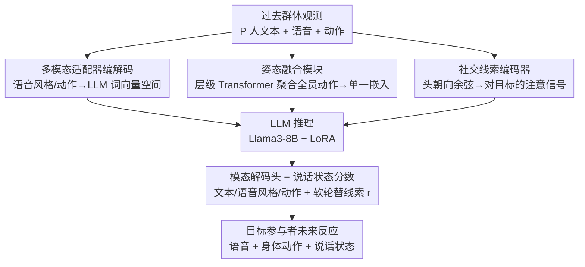

# PolySLGen: Online Multimodal Speaking-Listening Reaction Generation in Polyadic Interaction

**会议**: CVPR 2026  
**论文**: [CVF Open Access](https://openaccess.thecvf.com/content/CVPR2026/html/Lin_PolySLGen_Online_Multimodal_Speaking-Listening_Reaction_Generation_in_Polyadic_Interaction_CVPR_2026_paper.html)  
**代码**: https://github.com/zylinzy/PolySLGen  
**领域**: 人体理解 / 多模态反应生成  
**关键词**: 多人交互, 反应生成, 说话-倾听, 轮替建模, 多模态LLM

## 一句话总结
PolySLGen 把多人群体的过去语音和动作喂进一个 LoRA 微调的 LLM，在线生成目标参与者未来的语音、身体动作和"说话状态分数"，靠姿态融合模块与社交线索编码器统一建模多人非语言信号，从而既能说也能听，在动作质量、语音-动作对齐、说话状态预测上都显著超过把双人方法硬扩到多人的基线。

## 研究背景与动机

**领域现状**：让具身 AI 在群体里自然交互，需要它把语音和身体动作协调起来，并在恰当时机切换"说"与"听"（即 turn-taking 轮替），以此传达注意、意图并维持对话流。近年多模态 LLM 在动作理解生成、社交线索解读、多模态问答上展现出强能力，让"用统一模型协调语音+动作"成为可能。

**现有痛点**：现有反应生成方法几乎都有硬伤——照片级方法输出像素完美但缺 3D 物理基础，无法用于需要骨架重定向与控制的具身/机器人；很多方法是单模态的（motion-to-motion、text-to-motion、audio-to-motion），只从一种模态生成另一种；大量方法依赖**未来上下文**，做不到从过去观测因果地在线生成；没有语音生成的方法只靠身体动作建模群体动态，无法真正参与对话。最接近的 SOLAMI 虽用多模态 LLM 同时建模动作与语音，但只关注"说"的行为，且局限在**双人**场景——不说话时就回退到默认动作，显得突兀不连续。

**核心矛盾**：把双人架构直接扩到多人，既计算低效又抓不住高阶依赖关系。参与者越多，由语音、手势、朝向共同塑造的相互依赖反应越复杂；而"说"与"听"的统一生成（尤其是轮替）在多人场景几乎没人做。

**本文目标**：把在线多模态反应生成形式化为——给定所有参与者的过去语音与动作，生成**单个目标参与者**未来的语音、身体/手部动作，外加一个刻画轮替倾向的说话状态分数。

**切入角度**：现实里具身 AI 是"对他人做出反应"，而非预测整组人的完整动态，所以聚焦目标参与者的反应更贴近部署需求；同时借鉴轮替与视觉身体线索（如头朝向）之间的关系，用头朝向当作"注意力"代理信号来辅助判断该不该说。

**核心 idea**：用一个预训练 LLM 作骨干做对话推理，配上**姿态融合模块**把全员动作压成紧凑嵌入、**社交线索编码器**捕捉他人对目标参与者的注意，再加上一个**软**的说话状态分数引导轮替，从而在多人场景统一生成"说+听"的多模态反应。

## 方法详解

### 整体框架
PolySLGen 的输入是 $P$ 个参与者过去的文本 $X^t$、语音风格 $X^s$ 和身体/手部动作 $X^m$（其中只有 $P'$ 人在过去说过话），输出是目标参与者未来的文本 $y^t$、语音风格 $y^s$、动作 $y^m$ 和一个说话状态分数 $r$。整体可写成 $(y^t,y^s,y^m,r)=\text{PolySLGen}(X^t_{P'},X^s_{P'},X^m_{P})$。骨干是 Llama3-8B-Instruct（仅对 Q/K/V 投影做 LoRA 微调），它负责跨模态的交互推理；前端用一组轻量适配器把语音风格、动作、社交线索都映射进 LLM 的词向量空间，后端用模态专属解码头把 LLM 的输出嵌入映回各模态。关键是两个为"群体动态"量身设计的模块：姿态融合模块联合考虑全员动作，社交线索编码器从他人头朝向里读出对目标的注意信号。整条管线是在线、因果的——只看过去，不偷看未来。

### 关键设计

**1. 多模态适配器编解码：让 LLM 不靠预训练编码器就吃下语音与动作**

针对"把语音、动作塞进 LLM 很难、缺对齐的多模态数据"这个痛点，本文用端到端的适配器学习而非单独预训练的编解码器。语音侧先用 pyannote-audio 按话语切分，再用 stable-ts（Whisper 骨干）转写成文本、用 StyleTTS 2 抽出语音风格特征 $x^s\in\mathbb{R}^{d_s}$（编码语速、语调、表现力等韵律情感）；一个风格适配器 $\phi_{style}$ 把它投影成 LLM 兼容的嵌入 $e^s=\phi_{style}(x^s)\in\mathbb{R}^{d_{llm}}$，转写文本则直接成为文本嵌入 $e^t$。输出侧对称地用可学习投影头 $f^{style}$ 把 LLM 输出的风格嵌入 $h^s$ 映回风格空间得到 $y^s$，再连同生成文本 $y^t$ 经 StyleTTS 2 解码器合成语音。这套"适配器进、解码头出"的设计避免了为每个模态单独训练庞大编码器，也保住了 LLM 的上下文容量。

**2. 姿态融合模块：把多人动作压成一条嵌入，避免挤占 LLM 上下文**

如果把每个参与者的动作序列依次喂进 LLM，因果设置会让模型忽略参与者之间的协同，而且多人动作会吃掉大量上下文、留给语言的容量变少。姿态融合模块 $\phi_{motion}:\mathbb{R}^{P\times d_m}\to\mathbb{R}^{d_{llm}}$ 把全员动作学成**一条**联合姿态嵌入 $e^m$，参与者增多也不增加输入长度。它是一个层级 Transformer 块：先用自注意力 $x'^m_P=\text{SelfAtt}(x^m_P)$ 编码同一参与者内部的动作动态，再用交叉注意力把目标动作 $x'^m_P$ 与其余参与者动作 $x^m_{others}$ 聚合，最后过 MLP 得到 $e^m=\text{MLP}(\text{CrossAtt}(x'^m_P, x^m_{others}))$。这样既抓住了跨参与者的相互作用，又给 LLM 提供了一份紧凑的群体动作表示，对可变人数天然友好。

**3. 社交线索编码器：用头朝向当注意力代理，读出"谁在看目标"**

低层动作之外，本文还想要高层的社交信号。社交线索编码器 $\phi_{social}$ 从非目标参与者的**头朝向**里学出社交线索嵌入 $e^c$。对每个非目标参与者 $i$ 在帧 $k$，用其头朝向向量 $u_i^k$ 与指向目标的相对位置向量 $v_{i\to P}^k$ 算社交线索分数 $s_i^k=\cos(u_i^k, v_{i\to P}^k)\in[0,1]$，值越高表示越朝向目标（即越在注意目标）。逐帧信号 $s^k$ 在全部过去帧上聚合成时序社交信号 $S\in\mathbb{R}^{H_m\times(P-1)}$，再经一个多阶段 MLP 沿时间与参与者维度逐步投影聚合，得到 $e^c$。这条线索把"群体把注意力放在谁身上"显式注入，是判断轮替的有力依据。

**4. 说话状态分数：一个软的轮替线索，不强制硬切换**

PolySLGen 额外预测一个说话状态分数 $r\in\mathbb{R}$，表示"目标此刻应该说话"的置信度，由 LLM 生成的第一个嵌入算出 $r=f^{state}(h_0)$（$f^{state}$ 是 MLP）。关键在于：文本 $y^t$ 与语音风格 $y^s$ 的生成**独立于** $r$，$r$ 只作为引导轮替的**软**线索，而不是强制"说/听"硬切换——这与人机交互里的最佳实践一致，避免了 SOLAMI 那种"不说话就回退默认动作"的突兀感。基线在这项上几乎只能给出随机水平（AP≈0.50），凸显了任务难度，而 $r$ 让 PolySLGen 能动态在说与听之间自然交替。

### 损失函数 / 训练策略
总损失 $L_{total}=\lambda_{text}L_{text}+\lambda_{style}L_{style}+\lambda_{state}L_{state}+L_{motion}$。其中文本损失 $L_{text}$ 用预测 token 的交叉熵；语音风格损失 $L_{style}$ 用预测与真值风格特征的均方误差；说话状态损失 $L_{state}$ 用二分类交叉熵；动作损失 $L_{motion}$ 含表示级损失、局部 3D 关键点损失、根关节位置损失，以及借自既有工作的正则项（约束时序平滑与地面接触一致）。训练用 Llama3-8B-Instruct + LoRA（rank=16，$\alpha$=32，dropout=0.1，仅 Q/K/V），最大输入 1024 token，AdamW，batch=16，LLM 学习率 1e-4、其余模块 2e-4，单张 A100 训练 20 epoch。维度 $d_s/d_m/d_{rot}/d_{llm}=256/327/6/3072$，DnD 数据集群体规模 $P=5$，社交线索嵌入长度 $n=2$，语音历史 $H=512$ 帧（约 20.48 秒）、动作历史 $H_m=64$ 帧（约 2.56 秒）。

## 实验关键数据

数据集采用 DnD Group Gesture（五人桌面角色扮演，同步音频/视频/全身手部 3D 动作，四个 session 共六小时，最后一个留作测试），以交互最频繁多样的 Dungeon Master 为目标参与者。评测指标里几个自定义项需说明：**BeatAlign Diff.** 衡量生成语音与肢体动作的节拍同步差；**说话状态 AP** 是说话状态分数预测的 PR 曲线下面积；**MAE_head** 是目标头朝向的平均角误差（度）；**社交线索分数误差** 衡量生成的注意分配与真值差多少（Diversity 越接近真值 117.09 越好）。

### 主实验

| 方法 | Root↓(mm) | MPJPE↓(mm) | FID↓ | BERTScore↑ | WER↓ | 说话状态 AP↑ |
|------|-----------|-----------|------|------------|------|--------------|
| Random | 140.4 | 200.4 | 17.82 | 0.458 | 1.699 | 0.50† |
| NN cond. | 134.7 | 187.7 | 16.36 | 0.451 | 2.075 | 0.52† |
| SOLAMI（双人扩多人） | 188.6 | 180.9 | 14.86 | 0.428 | 1.854 | 0.50† |
| Motion Forecast（仅动作变体） | 127.0 | 153.8 | 13.93 | — | — | — |
| **PolySLGen（本文）** | **108.7** | **144.9** | **12.18** | **0.508** | **1.436** | **0.67** |

†：说话状态由生成文本推断（基线无显式预测）。多个 SOTA 基线在动作误差上甚至不如 Random/NN，说明把双人方法硬扩到多人会破坏其归纳偏置；PolySLGen 在动作、语音、说话状态三类指标上几乎全面领先，尤其说话状态 AP 从基线的随机水平 0.50 提升到 0.67。

社交语义上（Table 2），PolySLGen 的 MAE_head 为 26.46°，优于 SOLAMI 的 27.46° 与 LM-L2L 的 31.7°，四个非目标参与者的社交线索分数误差也全部最低，说明生成行为在社交层面更连贯。

### 消融实验

| Pose Fusion | Social Cue | MPJPE↓ | FID↓ | 说话状态 AP↑ |
|-------------|-----------|--------|------|--------------|
| ✗ | ✗ | 153.3 | 14.01 | 0.60 |
| ✓ | ✗ | 148.2 | 12.97 | 0.66 |
| ✗ | ✓ | 152.5 | 13.53 | 0.59 |
| ✓ | ✓ | **144.9** | **12.18** | **0.67** |

动作观测的增量实验（Table 4）显示：只用语音观测时 MPJPE 高达 202.5、FID 19.42；加入说话者动作降到 175.5/16.36；再加入非说话者动作进一步降到 153.3/14.01——证明说话与非说话参与者的动作都提供了有价值的上下文与人际信息。

### 关键发现
- **姿态融合是主力**：单加姿态融合就让动作、语音相似度、说话状态 AP 全面提升；而社交线索编码器单独加（第三行）几乎没用，因为它在高层特征上运作、缺乏动作动态的接地。两者**组合**（最后一行）才在动作质量和说话状态 AP 上拿到额外增益，代价是 WER/BERTScore 的微小回退——说明多人动作理解是社交行为生成的地基，高层社交线索要和低层动作表示结合才最有效。
- **对缺失参与者鲁棒**（Table 5）：随机移除 1–3 个非目标参与者，MPJPE 从 144.9 升到最多 189.6、说话状态 AP 仅从 0.67 微降到 0.65；即便在不完整输入下，PolySLGen 仍略胜拥有完整观测的 SOLAMI，因为通常只有约两个非目标参与者活跃。
- **人类主观评测**（Table 6，23 人 5 分制）：PolySLGen 在动作连贯（3.6 vs 2.7）、动作连续（3.8 vs 2.4）、语音语义（3.6 vs 2.3）、语音语调（3.9 vs 3.1）上全面优于 SOLAMI，与定量结果一致。

## 亮点与洞察
- **把"听"也当一等公民**：用一个软的说话状态分数引导轮替，而非硬切换，避免了"不说话就回退默认动作"的机器感——这是让群体交互看起来自然的关键，也是和 SOLAMI 的本质区别。
- **用一条嵌入装下整组动作**：姿态融合模块把人数与上下文长度解耦，参与者增多不挤占 LLM 的语言容量，这个"固定长度群体表示"的思路可迁移到任何要把可变数量实体喂进 LLM 的场景。
- **头朝向当注意力代理**：用 $\cos(u_i^k, v_{i\to P}^k)$ 把"谁在看谁"量化成 $[0,1]$ 的社交分数，是个便宜又物理可解释的群体注意信号，可复用到会议、教育等多人分析任务。
- **适配器+解码头的轻量多模态接入**：不依赖单独预训练的编解码器就把语音风格、动作接入 LLM，缓解了对齐多模态数据稀缺的问题。

## 局限与展望
- **数据单一**：实验只在 DnD Group Gesture 一个数据集上做（五人桌游、即兴对话），目标参与者固定为 Dungeon Master；论文也坦承多数现有数据集因模态缺失/无 3D 姿态/局限双人而不可用，泛化到其他群体场景（会议、教学）尚待验证。
- **语音语义难比**：由于 D&D 的即兴性质，生成语音的语义本就难与真值对齐，BERTScore/WER 等指标的绝对意义需打折看；不同活跃人数下的鲁棒性结论也受"通常只两人活跃"这一数据特性影响，不宜外推到更密集的群体。
- **社交线索接地弱**：社交线索编码器单独使用几乎无效，必须依附姿态融合才生效，说明高层社交信号当前还缺乏独立的动作接地，未来可探索更强的社交-动作联合表示。
- **轮替仍是软线索**：说话状态分数只引导不强制，复杂多轮抢话/打断等更细粒度的轮替行为没有显式建模。

## 相关工作与启发
- **vs SOLAMI**：SOLAMI 也用多模态 LLM 同时建模动作与语音，但只生成"说"的反应、局限双人，不说话时回退默认动作显得突兀。本文统一建模说+听、扩到多人，并用姿态融合/社交线索抓群体动态，动作与说话状态全面领先，且在缺失参与者时仍胜过有完整观测的 SOLAMI。
- **vs LLM + ConvoFusion**：后者先用 LLM 从过去对话文本生成回应，再用离线共语音全身动作模型 ConvoFusion 生成动作。这种"先文后动"的串联在多人场景里时机把握差（WER 高达 13.318），本文联合建模语音+动作+全员非语言线索因而对齐更好。
- **vs LM-L2L Adapted**：把双人 text-to-face 的 LM-Learn-to-Listen 扩到多人全身动作，动作误差反而很高（Root 185.2），印证"简单扩展双人架构难以捕捉高阶依赖"。

## 评分
- 新颖性: ⭐⭐⭐⭐⭐ 首个在线、多人、说+听统一的多模态反应生成框架，说话状态分数 + 姿态融合 + 社交线索的组合是真问题上的新解法。
- 实验充分度: ⭐⭐⭐⭐ 指标多维（动作/语音/状态/社交语义/鲁棒性/用户研究），消融清晰；但只在单一 DnD 数据集上验证，泛化性证据不足。
- 写作质量: ⭐⭐⭐⭐ 动机与模块职责讲得清楚，图文对应；部分自定义指标（社交线索分数误差）的解读门槛偏高。
- 价值: ⭐⭐⭐⭐ 对具身 AI 的群体社交交互有直接价值，"固定长度群体表示 + 软轮替"思路可迁移，代码开源。

<!-- RELATED:START -->

## 相关论文

- [\[CVPR 2026\] ARMFlow: AutoRegressive MeanFlow for Online 3D Human Reaction Generation](armflow_autoregressive_meanflow_for_online_3d_human_reaction_generation.md)
- [\[CVPR 2026\] UniLS: End-to-End Audio-Driven Avatars for Unified Listening and Speaking](unils_end-to-end_audio-driven_avatars_for_unified_listening_and_speaking.md)
- [\[CVPR 2026\] ReMoGen: Real-time Human Interaction-to-Reaction Generation via Modular Learning from Diverse Data](remogen_real-time_human_interaction-to-reaction_generation_via_modular_learning_.md)
- [\[CVPR 2026\] HandX: Scaling Bimanual Motion and Interaction Generation](handx_scaling_bimanual_motion_and_interaction_generation.md)
- [\[CVPR 2026\] Real-Time Multimodal Fingertip Contact Detection via Depth and Motion Fusion for Vision-Based Human-Computer Interaction](real-time_multimodal_fingertip_contact_detection_via_depth_and_motion_fusion_for.md)

<!-- RELATED:END -->
