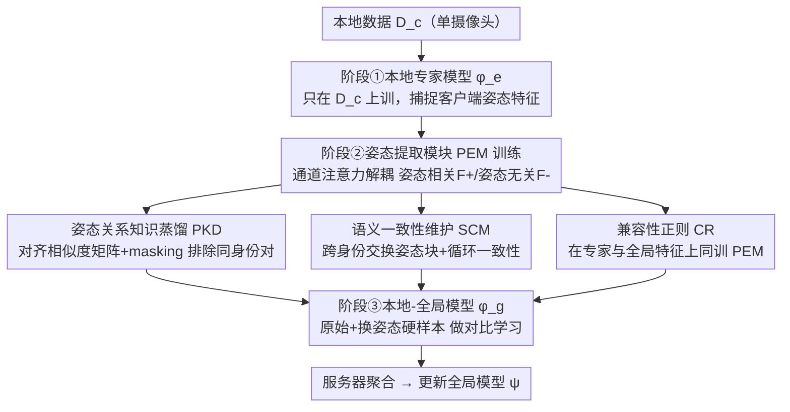

# Pose-guided Enriched Feature Learning for Federated-by-camera Person Re-identification

**会议**: CVPR 2026  
**论文**: [CVF Open Access](https://openaccess.thecvf.com/content/CVPR2026/html/Oh_Pose-guided_Enriched_Feature_Learning_for_Federated-by-camera_Person_Re-identification_CVPR_2026_paper.html)  
**代码**: 待确认  
**领域**: 人体理解 / 行人重识别 / 联邦学习  
**关键词**: 行人重识别, 联邦学习, 姿态解耦, 特征增强, 对比学习

## 一句话总结
本文针对"每个客户端=单台摄像头、只能看到很少姿态"的 federated-by-camera 行人重识别场景，提出姿态提取模块 PEM 把特征解耦成"姿态相关/姿态无关"两部分，再跨身份交换姿态分量合成"换姿态"的硬正样本，用姿态关系知识蒸馏、语义一致性维护、兼容性正则三招保证解耦质量与全局兼容性，从而补足对比学习缺失的姿态多样性，在 Market1501 / MSMT17 上刷到联邦 ReID 的 SOTA。

## 研究背景与动机
**领域现状**：行人重识别（ReID）要从图库里检出与查询同身份的人，主流靠对比学习（尤其 triplet loss）学细粒度特征。但 ReID 数据敏感（含外观和位置信息），集中式训练有隐私和存储压力，于是联邦 ReID（FedReID）兴起——中心服务器只聚合各客户端本地训练的模型，不碰原始数据。FedReID 分两种：federated-by-dataset（每个客户端是一个完整多机位数据集）和 federated-by-camera（每个客户端只有单台摄像头的图）。

**现有痛点**：作者认为 federated-by-camera 才更现实，但它被**样本多样性不足**严重困扰——单台摄像头拍到的同一身份图像视角/姿态高度冗余相似。这直接打击对比学习：triplet loss 的有效性**根本依赖于难样本**（具备足够类内/类间变化的样本），而单机位场景里检出的"难样本"其实姿态都和锚点雷同，约等于没有难度。结果每个客户端模型迅速过拟合到自己同质的本地数据，引发联邦学习里典型的 **client drift**，损害模型聚合与全局泛化。

**核心矛盾**：作者用实验坐实了根因——对比学习（triplet loss）在集中式（CL）下带来明显增益（Market1501 mAP +14.6），但在联邦（FL）下增益微乎其微（+1.5）。问题不在客户端间异质性（已有 FL 方法都盯着这个），而在**每个客户端内部缺少姿态多样性**，导致拿不到真正的硬正/硬负对。

**本文目标**：在不泄露原始数据的前提下，为每个训练 batch 凭空"造"出带新姿态、但保持原身份的硬样本，把缺失的姿态多样性直接注入对比学习。

**切入角度**：既然姿态多样性是瓶颈，那就把特征拆成"姿态相关"和"姿态无关"两块，**跨身份交换姿态块再重组**——这样能合成"A 的身份配 B 的姿态"的新特征，相当于无中生有地造出换姿态的硬样本。

**核心 idea**：用一个可学习的姿态提取模块（PEM）在特征空间做姿态/身份解耦 + 交换重组，用知识蒸馏和循环一致性保证解耦正确、用兼容性正则保证合成特征对全局模型有用，从而以可忽略的通信开销补足对比学习的姿态多样性。

## 方法详解

### 整体框架
系统是一个含 $C$ 个客户端的 FedReID，每个客户端 $c$ 持私有本地数据集 $D_c=\{(x_i,y_i)\}$（来自一台摄像头），服务器要协同训出全局模型 $\psi$。每轮里本地模型用交叉熵 $L_{ce}$ 和三元组损失 $L_{tri}$ 训练，服务器按数据量加权平均聚合参数。

本文的方法分**三个顺序阶段**：(i) 训练本地专家模型 $\phi^e_c$（只在 $D_c$ 上训，捕捉该客户端特有的姿态特征）；(ii) 训练姿态提取模块 PEM $\pi_c$（学会把特征解耦成姿态相关/无关并合成换姿态特征）；(iii) 训练本地-全局模型 $\phi^g_c$（用原始特征 + PEM 合成的姿态增强特征一起做对比学习）。三阶段跑完后服务器聚合各客户端参数（含 PEM）更新 $\psi$ 并广播。PEM 训练里又串了三个关键约束：姿态关系知识蒸馏（PKD）、语义一致性维护（SCM）、兼容性正则（CR）。

### 关键设计

**1. 姿态提取模块 PEM：用通道注意力把特征拆成姿态相关/无关两块再交换重组**

这是直击"单机位缺姿态多样性"痛点的核心。PEM $\pi_c$ 是两层卷积，对本地专家模型 $\phi^e_c$ 抽的特征图 $F_i\in\mathbb{R}^{d\times h\times w}$ 输出一张通道注意力图 $A_i=\pi_c(F_i)\in\mathbb{R}^{d\times1\times1}$，经 sigmoid 约束到 $[0,1]$。据此把特征图分成姿态相关与姿态无关两部分：

$$F^+_i=A_i\odot F_i,\qquad F^-_i=(1-A_i)\odot F_i$$

有了这个解耦，就能在 mini-batch 内**跨身份交换姿态相关块**合成新特征：$F^{\delta(i)}_i=F^-_i+F^+_{\delta(i)}$（保 $i$ 的身份、换上 $\delta(i)$ 的姿态），其中 $\delta(i)$ 是随机选的、满足 $y_i\neq y_{\delta(i)}$ 的索引。这些合成特征就是缺失的"换姿态硬正样本"，直接喂进对比学习，从源头解决了单摄像头造不出难样本的问题。

**2. 姿态关系知识蒸馏 PKD：用现成姿态检测器在相似度结构上监督解耦，并 mask 掉同身份对**

光有 PEM 没法保证 $F^+_i$ 真只含姿态信息。作者引一个现成姿态检测器 $\varphi$ 得 oracle 姿态向量 $z_i=\varphi(x_i)$。由于 $z_i$ 和 $F^+_i$ 在不同空间，没法直接特征级监督，于是改为对齐 mini-batch 内的**成对相似度结构**：分别算姿态相似度矩阵 $S_z[i,j]=\frac{z_i\cdot z_j}{\|z_i\|\|z_j\|}$ 和 $S_{F^+}[i,j]=\frac{\hat F^+_i\cdot \hat F^+_j}{\|\hat F^+_i\|\|\hat F^+_j\|}$，让后者去逼近前者。但这里有个陷阱：$D_c$ 里身份和姿态高度相关，同身份对的 oracle 姿态向量往往很像，若 PEM 退化成恒等映射 $F^+_i\approx F_i$，$S_{F^+}$ 也会虚假地匹配 $S_z$，根本学不到解耦。为此用二值 mask $M$ 把同身份对（$y_i=y_j$）排除掉：

$$L_{pose}=\frac{\sum_{i,j}M[i,j]\cdot(S_z[i,j]-S_{F^+}[i,j])^2}{\sum_{i,j}M[i,j]},\quad M[i,j]=0\text{ if }y_i=y_j\text{ else }1$$

这样逼 PEM 去学真正的姿态关系，而不是钻身份相关的空子。

**3. 语义一致性维护 SCM：循环一致性保证交换后的特征仍保对应语义**

交换姿态块造出 $F^{\delta(i)}_i$ 后，怎么确认它真的"留了 $i$ 的身份、换了 $\delta(i)$ 的姿态"？作者用循环一致性。把增强特征再过一遍 PEM 重新解耦，拿到对应的姿态相关/无关块，再重组回原始特征 $F^{rec}_i=F^{\delta(i)-}_i+F^{i+}_{\delta(i)}$，用 L1 约束它逼近原始 $F_i$：

$$L_{cyc}=\frac{1}{2|B|}\sum_{i=1}^{|B|}\big\{\|F_i-F^{rec}_i\|_1+\|F_{\delta(i)}-F^{rec}_{\delta(i)}\|_1\big\}$$

只有当 $F^{\delta(i)-}_i$ 和 $F^{i+}_{\delta(i)}$ 分别忠实保留了 $i$ 的身份和姿态信息，重组才能还原原图，从而保证交换是语义上干净的。PEM 总损失 $L_{PEM}=L_{pose}+L_{cyc}$。

**4. 兼容性正则 CR：让 PEM 同时服务专家模型和全局模型，防止过拟合单客户端**

PEM 学解耦重度依赖本地专家 $\phi^e_c$ 去捕捉该客户端的姿态特征，但这有过拟合风险——PEM 可能只对单客户端的数据分布有效，导致它的特征空间和全局模型 $\psi$ 的特征空间错位，合成特征对训全局模型反而无用甚至有害。CR 的做法是**用同一个 PEM 同时在两路特征上训练**：来自本地专家 $\phi^e_c$ 的特征，和来自本地-全局模型 $\phi^g_c$（每轮从 $\psi$ 接收参数）的特征。这种对称策略当正则项，逼 PEM 泛化到既适配专精的本地特征空间、又适配通用的全局特征空间，保证合成的姿态增强特征对训本地-全局模型立刻可用、兼容。

### 损失函数 / 训练策略
本地专家与本地-全局模型都用 $L_{ce}$（式 1）+ $L_{tri}$（式 2，margin $m$）训练；PEM 用 $L_{PEM}=L_{pose}+L_{cyc}$ 训练，CR 通过在专家与全局两路特征上同训 PEM 实现。骨干用 ImageNet 预训练的 ResNet-50，每客户端各持本地分类器、只共享聚合骨干；SGD（momentum 0.9，lr 1e-3），300 epoch、batch 32，单张 TITAN Xp，遵循 MEDA 的训练流程。

## 实验关键数据

### 主实验
Market1501（6 摄像头→6 客户端）和 MSMT17（15 摄像头→15 客户端），federated-by-camera 设定，评 mAP 与 Rank-1。

| 类别 | 方法 | Market mAP | Market R-1 | MSMT mAP | MSMT R-1 |
|------|------|-----------|-----------|----------|----------|
| 上界 | Centralized | 77.3 | 90.0 | 42.3 | 69.5 |
| 特征增强 | ISE (CVPR'22) | 34.8 | 56.6 | 10.0 | 22.5 |
| 联邦学习 | MOON (CVPR'21) | 33.2 | 55.7 | 13.2 | 31.2 |
| 联邦学习 | FedRCL (CVPR'24) | 29.6 | 53.4 | 7.3 | 17.9 |
| 联邦 ReID | DACS (AAAI'24) | 40.0 | 63.1 | 11.4 | 29.3 |
| 联邦 ReID | MEDA (ICASSP'24) | 41.4 | 66.1 | 9.7 | 24.8 |
| — | **Proposed** | **45.9** | **66.4** | **14.5** | **32.7** |

本文在两个数据集上全面超越所有 baseline。作者解释：特征增强方法（为任务增强而非造硬样本）效果有限；常规 FL 方法假设全局模型能给本地足够指导，但单机位场景本地模型本就不够 informative、聚合后的全局模型也缺泛化；FedReID 方法里 DACS（虽为 federated-by-dataset 设计）靠客户端内合成多样样本表现尚可，但它只做像素级颜色/纹理增强，而本文合成的是**语义上有意义的换姿态特征**，才是真正的硬样本。值得注意的是 Rank-1 增益有时小于 mAP——因为本文抑制了对姿态特异特征的过拟合、引导网络学姿态无关表示（mAP 受益更大），而姿态偏置表示在匹配相似姿态实例时 Rank-1 更高但泛化差。

### 消融实验
PEM 三组件消融（PKD / SCM / CR）：

| 配置 | Market mAP | Market R-1 | MSMT mAP | MSMT R-1 |
|------|-----------|-----------|----------|----------|
| Baseline | 36.6 | 59.4 | 11.3 | 25.5 |
| 仅 PKD | 28.0 | 53.1 | 9.7 | 24.8 |
| 仅 SCM | 27.9 | 53.2 | 11.2 | 28.1 |
| PKD + SCM | 42.8 | 62.9 | 12.5 | 29.3 |
| PKD + SCM + CR（Full） | **45.9** | **66.4** | **14.5** | **32.7** |

masking 与采样策略消融：

| 配置 | Market mAP | Market R-1 | MSMT mAP | MSMT R-1 |
|------|-----------|-----------|----------|----------|
| Without masking | 41.4 (Δ-4.5) | 62.1 (Δ-4.3) | 10.7 (Δ-3.8) | 26.3 (Δ-6.4) |
| Hard-pose sampling | 29.1 (Δ-16.8) | 53.9 (Δ-12.5) | 11.6 (Δ-2.9) | 29.0 (Δ-3.7) |
| Proposed | **45.9** | **66.4** | **14.5** | **32.7** |

### 关键发现
- **PKD 和 SCM 必须配合用**：单独用任何一个反而比 baseline 还差（仅 PKD 28.0、仅 SCM 27.9 vs baseline 36.6），两者互补——共同保住姿态相关/无关特征的语义；CR 再叠加把 Market mAP 从 42.8 推到 45.9。
- **masking 很关键**：去掉排除同身份对的 mask，Market mAP 掉 4.5、MSMT R-1 掉 6.4，印证了"不 mask 会让 PEM 钻身份-姿态相关性的空子退化成恒等映射"这一设计动机。
- **随机交换优于刻意挑硬姿态**：Hard-pose sampling（专挑差异大的姿态交换）反而暴跌（Market mAP -16.8），说明过激的姿态交换会破坏语义一致性、造出无意义特征。
- **通信开销可忽略**：PEM 仅 0.53M 参数，总通信量 48.1M（与基线 47.0M 相当、远小于 MOON 70.5M），且 PEM 只在训练用，推理延迟保持 0.96 ms 不变。

## 亮点与洞察
- **重新定位了 federated-by-camera 的真正瓶颈**：不是大家盯的客户端间异质性，而是**客户端内姿态多样性缺失**，并用 CL vs FL 的 triplet 增益对比（+14.6 vs +1.5）干净地坐实了这一点——问题诊断本身就很有价值。
- **在特征空间做姿态交换造硬样本很巧**：不碰原始图像、不传数据，只在特征级解耦+跨身份交换就凭空补出对比学习缺的硬正样本，天然契合联邦隐私约束，开销可忽略。
- **masking 防退化的细节点睛**：识别出"身份-姿态相关→恒等映射捷径"这个隐蔽陷阱并用 mask 化解，是让相似度蒸馏真正学到姿态而非身份的关键，这种"防捷径"思路可迁移到其他解耦任务。
- **循环一致性保证交换语义干净**：用重组回原特征的 L1 约束来验证"身份留住、姿态换掉"，把抽象的解耦质量变成可优化的监督信号。

## 局限与展望
- 解耦质量重度依赖现成姿态检测器 $\varphi$ 的 oracle 姿态向量质量，检测器在遮挡、低分辨率、罕见视角下出错会级联影响 PKD。
- 只在 Market1501（6 客户端）和 MSMT17（15 客户端）两个数据集验证，客户端数仍较少；更大规模、更极端非 IID 的真实监控网络下的可扩展性待验证。
- 与集中式上界仍有明显差距（Market 45.9 vs 77.3，MSMT 14.5 vs 42.3），联邦场景的性能天花板还远未触及。
- 方法专注"姿态"这一种多样性缺失，对光照、遮挡、分辨率等其他单机位冗余维度未涉及，可探索把解耦推广到多属性。

## 相关工作与启发
- **vs 常规联邦学习（MOON / FedRCL / SCAFFOLD / FedProx）**：它们主攻客户端间异质性（proximal 项、模型对比、控制变量），但在单机位 ReID 下因本地模型本身 informative 不足而失效；本文转而解决客户端内多样性缺失。
- **vs DACS（联邦 ReID 特征/像素增强）**：DACS 做像素级风格化只改颜色纹理等图像统计量，造不出真正的硬样本；本文在特征空间合成语义上换姿态的硬样本，对对比学习更有信息量。
- **vs MEDA（federated-by-camera 元知识增强）**：MEDA 同样针对单机位数据稀缺，但未指明哪种稀缺最致命；本文明确把瓶颈归到"姿态多样性"并显式合成姿态多样硬样本，刷新 SOTA。

## 评分
- 新颖性: ⭐⭐⭐⭐ 重新诊断瓶颈 + 特征空间姿态交换造硬样本的组合有新意，masking 防退化是亮点
- 实验充分度: ⭐⭐⭐⭐ 三组对比 + 两套消融（组件/masking-采样）+ 通信开销分析较完整，但仅两个数据集
- 写作质量: ⭐⭐⭐⭐ 动机用实验坐实、三阶段结构清晰、公式推导完整
- 价值: ⭐⭐⭐⭐ 以可忽略开销刷新隐私友好的联邦 ReID SOTA，对真实监控部署有意义

<!-- RELATED:START -->

## 相关论文

- [\[CVPR 2026\] Composite-Attribute Person Re-Identification via Pose-Guided Disentanglement](composite-attribute_person_re-identification_via_pose-guided_disentanglement.md)
- [\[CVPR 2026\] Spatial-Frequency Collaborative Learning for Occluded Visible-Infrared Person Re-Identification](spatial-frequency_collaborative_learning_for_occluded_visible-infrared_person_re.md)
- [\[CVPR 2026\] WHU-MARS: A Multispectral Aerial-Ground Benchmark Towards Any-Scenario Person Re-Identification](whu-mars_a_multispectral_aerial-ground_benchmark_towards_any-scenario_person_re-.md)
- [\[CVPR 2026\] SSM-Aware Token-Efficient VMamba via Adaptive Patch Pruning and Merging for Person Re-Identification](ssm-aware_token-efficient_vmamba_via_adaptive_patch_pruning_and_merging_for_pers.md)
- [\[CVPR 2026\] Dynamic Magic: Unleashing Restricted Knowledge for Lifelong Person Re-Identification](dynamic_magic_unleashing_restricted_knowledge_for_lifelong_person_re-identificat.md)

<!-- RELATED:END -->
