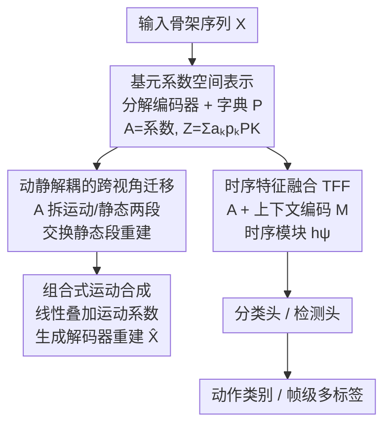

# PRISM: Learning a Shared Primitive Space for Transferable Skeleton Action Representation

**会议**: CVPR 2026  
**论文**: [CVF Open Access](https://openaccess.thecvf.com/content/CVPR2026/html/Yang_PRISM_Learning_a_Shared_Primitive_Space_for_Transferable_Skeleton_Action_CVPR_2026_paper.html)  
**代码**: [项目页](https://walker1126.github.io/PRISM-project)  
**领域**: 人体理解 / 骨架动作识别  
**关键词**: 骨架动作, 运动基元, 可迁移表征, 动静解耦, 长尾识别

## 一句话总结
PRISM 把骨架动作表示成「一组可复用原子运动基元的加权组合」(基元系数空间)，先用多视角合成数据通过生成目标学出这个物理可解释、视角无关的结构化表征，再以轻量任务头把同一表征顺序迁移到分类与逐帧检测，在长尾、多标签、多视角的真实数据集上一致超过专用模型。

## 研究背景与动机
**领域现状**：骨架动作理解因为对背景/外观/光照鲁棒、且利于隐私保护，近年进展显著。但生成、分类、检测三类任务通常各训各的模型——生成靠无约束隐空间、分类学整体时空 embedding、检测在帧级特征上叠时序模块，彼此割裂、知识无法共享。

**现有痛点**：真实场景同时存在长尾类别分布、视角变化、组合式复杂动作。分类网络学到的整体 embedding 把动作语义和视角/上下文纠缠在一起；生成模型的隐空间缺乏物理可解释性和运动分解。这些表征都难以跨任务迁移，生成与感知之间始终存在鸿沟。

**核心矛盾**：现有模型缺一个**共享、结构化、可迁移**的运动表征。即便有少数联合训练工作 (如 SymGCN 共享多分支骨干、UmURL 早融合多模态)，它们的共享特征仍然没有显式的运动分解或基元结构，迁移性有限。

**本文目标**：用一个统一的结构化表征，同时撑起生成与感知，并在长尾、多视角、组合动作上都能泛化。

**切入角度**：作者的关键假设是——复杂动作可以由一组固定的原子子运动 (motion primitives) 组合表达。比如「挥手」和「投掷」共享手臂摆动基元，「坐下」和「系鞋带」共享屈腿基元。这些基元跨动作、跨视角共享，天然带来结构、组合性和物理可解释性；稀有动作也能用常见基元的有意义组合表示，从而对数据不平衡不敏感。

**核心 idea**：把动作编码成「基元系数空间」里的一条轨迹 (每帧用一组学到的基元系数表示)，先用生成目标学出这个空间，再单向迁移到感知任务，而非强行联合训练。

## 方法详解

### 整体框架
PRISM 围绕一个**共享的结构化基元空间**搭建：输入骨架序列 $\mathbf{X}\in\mathbb{R}^{T\times J\times C}$ ($C=2/3$ 对应 2D/3D)，分解编码器把它投影成基元系数 $\mathbf{A}\in\mathbb{R}^{T\times K}$，配合一个基元字典 $\mathbf{P}\in\mathbb{R}^{K\times D}$ 得到隐式运动表征 $\mathbf{Z}_t=\sum_k a_{t,k}\mathbf{p}_k$。这个空间被三类头共用：生成头重建/合成运动、分类头预测动作标签、检测头做帧级多标签预测。

整个流程分阶段训练：**第一阶段**只在大规模多视角合成数据上用「运动重建 + 物理正则 + 跨视角一致性」训练分解编码器与字典；**第二阶段**冻结基元编码器，把基元系数与上下文特征融合，在真实带标注数据上训练分类/检测头 (允许感知模块联合微调，但保持基元编码器不变)。这种「先生成、后感知」的单向迁移让各任务共享结构、又各自保留监督方式。

### 关键设计

**1. 基元系数空间表示：把动作分解成可复用原子运动的加权和**

针对「整体 embedding 把语义和视角纠缠、稀有动作学不好」的痛点，PRISM 不在关节坐标上直接建模，而是用分解编码器 + MLP 把序列投影到一个紧凑的系数空间 $\mathbf{A}$，其中第 $t$ 帧第 $k$ 维 $a_{t,k}$ 表示第 $k$ 个学到的基元对该帧运动的贡献强度。基元本身是特征空间里的隐式基向量 $\mathbf{p}_k\in\mathbb{R}^D$ (而非直接在关节空间)，让模型聚焦高层运动语义。每帧表征是基元的加权和 $\mathbf{Z}_t=\sum_{k=1}^K a_{t,k}\mathbf{p}_k$，再由解码器 $\hat{\mathbf{X}}=\text{Decoder}_\phi(\mathbf{Z})$ 重建骨架。因为很多动作共享相同基元模式 (如「坐」「摔」都涉及类似腿部运动)，这种分解降低冗余、对长尾更鲁棒——稀有动作可以用常见基元的组合来表达。

**2. 动静解耦的跨视角迁移：让运动系数对视角/身份不变**

为了把动态运动从身体形状、视角等静态属性里剥离，作者把字典与系数都切成两段：$\mathbf{A}_t=[\mathbf{A}^{\text{motion}}_t, \mathbf{A}^{\text{static}}_t]$，$K=K_m+K_s$。运动段用于下游任务，静态段吸收视角/身份信息；静态段被沿时间维取平均后复制，强制其时间不变。训练时用**跨视角交换重建**：给定同一动作、不同视角/主体的两条序列 $\mathbf{X}^{(1)},\mathbf{X}^{(2)}$，交换它们的静态段 $\tilde{\mathbf{A}}^{(1)}=[\mathbf{A}^{(1)}_{\text{motion}};\mathbf{A}^{(2)}_{\text{static}}]$ 后重建，并最小化 $\mathcal{L}_{\text{swap}}=\|\mathbf{X}^{(1)}-\hat{\mathbf{X}}^{(1)}_{\text{swap}}\|_1+\|\mathbf{X}^{(2)}-\hat{\mathbf{X}}^{(2)}_{\text{swap}}\|_1$。这迫使运动段只编码纯运动、静态段只编码视角/身份，从而得到视角无关、对尺度/身份鲁棒的运动描述子，正是它在多视角、长尾上泛化好的根源。

**3. 组合式运动合成：基元线性可加，天生支持多标签**

由于每个运动系数反映一个基元的激活强度，把不同动作的运动系数线性相加 $\mathbf{A}_{\text{composite}}=\mathbf{A}^{(a)}_{\text{motion}}+\mathbf{A}^{(b)}_{\text{motion}}$ 就能合成混合/并发动作 (对应真实世界的多标签场景)，无需重训。这把「多标签动作」从一个需要专门建模的难题，变成基元空间里的一次向量加法，也解释了为什么 PRISM 在含并发动作的检测基准上更稳。

**4. 时序特征融合 (TFF)：把结构化基元与上下文细节融合做感知**

基元系数虽结构化、视角不变，却可能丢掉下游任务关键的短时上下文 (关节交互、细粒度过渡)。作者引入一个通用骨架编码器 $g_\phi$ 提取帧级上下文特征 $\mathbf{M}=g_\phi(\mathbf{X})$，空间池化得 $\tilde{\mathbf{M}}$，再与投影到同维的 $\mathbf{A}$ 逐元素相加 $\mathbf{F}=\mathbf{A}+\text{Pool}_{\text{spatial}}(\mathbf{M})$，最后过时序模块 $\mathbf{H}=h_\psi(\mathbf{F})$ 建模长程依赖。分类对 $\mathbf{H}$ 做时序平均池化，检测则逐帧预测多标签概率。基元提供结构先验、上下文补充细节，二者互补，这是同一表征能同时撑分类与检测的关键。

### 损失函数 / 训练策略
分解阶段总目标 $\mathcal{L}_{\text{gen}}=\mathcal{L}_{\text{rec}}+\mathcal{L}_{\text{swap}}+\lambda_{\text{orth}}\mathcal{L}_{\text{orth}}+\lambda_{\text{sparse}}\mathcal{L}_{\text{sparse}}+\lambda_{\text{phys}}\mathcal{L}_{\text{phys}}$：$\mathcal{L}_{\text{rec}}=\|\mathbf{X}-\hat{\mathbf{X}}\|_1$ 重建；$\mathcal{L}_{\text{phys}}=\mathcal{L}_{\text{bone}}+\mathcal{L}_{\text{joint}}+\mathcal{L}_{\text{acc}}$ 惩罚骨长不一致、关节越界、过大加速度等物理违例；$\mathcal{L}_{\text{orth}}=\|\mathbf{P}^\top\mathbf{P}-\mathbf{I}\|_F^2$ 保证字典多样、解耦；$\mathcal{L}_{\text{sparse}}=\lambda\|\mathbf{A}\|_1$ 稀疏化系数。感知阶段：裁剪视频分类用交叉熵，未裁剪多标签用逐帧二元交叉熵。

## 实验关键数据

### 主实验
覆盖 Posetics、Toyota Smarthome Trimmed (TST)、Toyota Smarthome Untrimmed (TSU)、Charades、NTU-RGB+D 120 等真实数据集，分类、检测、生成 (运动迁移) 全面评测。

| 任务 / 数据集 | 指标 | 之前 SOTA | PRISM | 提升 |
|--------------|------|-----------|-------|------|
| Posetics 分类 | Top-1 (%) | 48.0 (ViA) | **52.3** | +4.3 |
| Posetics 分类 | Top-5 (%) | 72.6 (ViA) | **76.5** | +3.9 |
| TST 分类 | CS (%) | 67.0 (LLM-AR) | **70.7** | +3.7 |
| TST 分类 | CV1 / CV2 (%) | 36.1 / 66.6 | **50.1 / 72.5** | +14.0 / +5.9 |
| TSU 检测 | CS / CV (%) | 36.8 / 23.1 (LAC) | **40.1 / 28.1** | +3.3 / +5.0 |
| Charades 检测 | mAP (%) | 25.6 (LAC) | **26.8** | +1.2 |

> CS/CV：跨主体 / 跨视角协议 (Cross-subject / Cross-view)；CV1、CV2 为 TST 的两个跨视角划分。最显著的增益出现在最难的跨视角设定 (TST CV1 +14.0)，印证动静解耦带来的视角鲁棒性。

### 消融实验
在 Mixamo 跨视角运动迁移上逐项加入正则，验证各损失项的作用 (指标为 MSE，越低越好)。

| 配置 | Mixamo MSE | 说明 |
|------|-----------|------|
| PRISM Base | 1.35 | 仅重建，无正则 |
| + 正交损失 $\mathcal{L}_{\text{orth}}$ | 0.83 | 字典解耦后大幅改善 (1.35→0.83) |
| + 稀疏损失 $\mathcal{L}_{\text{sparse}}$ | 0.82 | 稀疏化系数，小幅提升 |
| + 物理损失 $\mathcal{L}_{\text{phys}}$ | 0.80 | 完整模型，优于 LAC (0.82)、ViA (0.86) |

### 关键发现
- **正交损失贡献最大**：从 Base 1.35 直接降到 0.83，说明让基元字典彼此解耦、避免坍缩是分解质量的关键；稀疏与物理正则各带来边际改善。
- **稀有类增益最明显**：按类别增益排序，TST-CV2 上「Usetablet」「Cutbread」等罕见动作分别 +70.2、+66.6，远超平均 +7.3；TSU-CV 上「Wipetable」+26.6 (平均 +5.0)，验证基元为稀有动作提供了更均衡的表示基础。
- **组合动作更可分**：涉及「Walk + Telephone」这类组合的动作因可用稀疏可复用基元表达，被更好地分离。
- **3D 完整性**：仅用 3D 骨架 + 分类头，PRISM 在 NTU-120 的 CS/CSet 标准设定上也优于此前双流方法，证明基元表征的通用性。

## 亮点与洞察
- **用「生成目标」学感知表征**：不靠分类标签、而靠多视角合成数据上的生成/重建学出基元空间，再单向迁移到感知——绕开了联合训练的监督冲突，是「以生成促感知」的一个干净范例。
- **动静交换重建是个可复用 trick**：交换两条同动作不同视角序列的静态段并要求重建回各自原序列，无需视角标签就逼出视角不变的运动表征，可迁移到任何需要解耦风格/内容的序列任务。
- **多标签 = 向量加法**：把组合/并发动作建模成基元系数的线性叠加，既可解释又零成本，避免了为多标签单独设计模块。
- **物理正则注入先验**：骨长、关节限位、加速度惩罚把人体运动学常识直接写进损失，让重建的运动物理可信，也提升了分解质量。

## 局限与展望
- **依赖合成数据与现成骨干**：第一阶段需要大规模多视角合成运动 (Mixamo) 来学基元，上下文编码器 $g_\phi$ 也直接用现成骨架编码器，基元空间的质量受合成数据覆盖度限制。
- **基元数 $K$、动静切分 $K_m/K_s$ 等是关键超参**：⚠️ 论文正文未在此处给出完整敏感性分析 (作者称放在附录)，实际部署时这些维度的取值可能需要按数据集调。
- **静态/动态的二分假设**：把变化因素简化为「运动 vs 静态 (视角/身份)」两段，对于运动本身随时间剧烈变形或风格强耦合的动作，这种线性可分假设是否仍成立有待检验。
- **改进方向**：把基元字典做成可增量扩展的开放集合，或引入文本/语义约束让基元更可命名，可能进一步提升对全新组合动作的零样本泛化。

## 相关工作与启发
- **vs LAC / MoDi / T2M-GPT (运动分解)**：它们也做运动分解 (隐式因子分解、基元/token)，但隐因子未显式绑定物理结构或视角不变性，主要用于数据增强、难以直接迁到感知；PRISM 的基元绑定物理正则 + 跨视角解耦，能直接当感知表征用，在 Mixamo 迁移上 MSE 0.80 < LAC 0.82。
- **vs SymGCN / UmURL (联合训练)**：它们共享骨干/早融合多模态来联合多任务，但共享特征仍无显式基元结构、任务头各自独立；PRISM 提供的是单一基元系数空间，结构层面共享而监督方式各保留。
- **vs ViA / 自监督跨视角方法**：ViA 等靠对比/自监督提升视角鲁棒性，PRISM 则用动静交换重建从生成角度做视角不变，且额外获得可组合、可生成的能力。

## 评分
- 新颖性: ⭐⭐⭐⭐⭐ 「基元系数空间 + 以生成促感知 + 动静交换重建」三者组合是骨架动作领域少见的统一视角
- 实验充分度: ⭐⭐⭐⭐ 跨 5 个真实数据集、分类/检测/生成三任务全覆盖，但部分超参敏感性放在附录、正文消融集中在生成迁移
- 写作质量: ⭐⭐⭐⭐ 动机与方法层次清晰，公式记号偶有 OCR 噪声但逻辑完整
- 价值: ⭐⭐⭐⭐ 长尾/多视角/组合动作的统一表征对真实场景动作理解有较强实用价值

<!-- RELATED:START -->

## 相关论文

- [\[CVPR 2026\] Beyond Binary Contrast: Modeling Continuous Skeleton Action Spaces with Transitional Anchors](beyond_binary_contrast_modeling_continuous_skeleton_action_spaces_with_transitio.md)
- [\[CVPR 2026\] RegFormer: Transferable Relational Grounding for Efficient Weakly-Supervised HOI Detection](regformer_transferable_relational_grounding_for_weakly-supervised_hoi_detection.md)
- [\[CVPR 2026\] ActAvatar: Temporally-Aware Precise Action Control for Talking Avatars](actavatar_temporally-aware_precise_action_control_for_talking_avatars.md)
- [\[CVPR 2026\] Superman: Unifying Skeleton and Vision for Human Motion Perception and Generation](superman_unifying_skeleton_and_vision_for_human_motion_perception_and_generation.md)
- [\[CVPR 2026\] RegFormer: Transferable Relational Grounding for Efficient Weakly-Supervised Human-Object Interaction Detection](regformer_transferable_relational_grounding_for_efficient_weakly-supervised_huma.md)

<!-- RELATED:END -->
