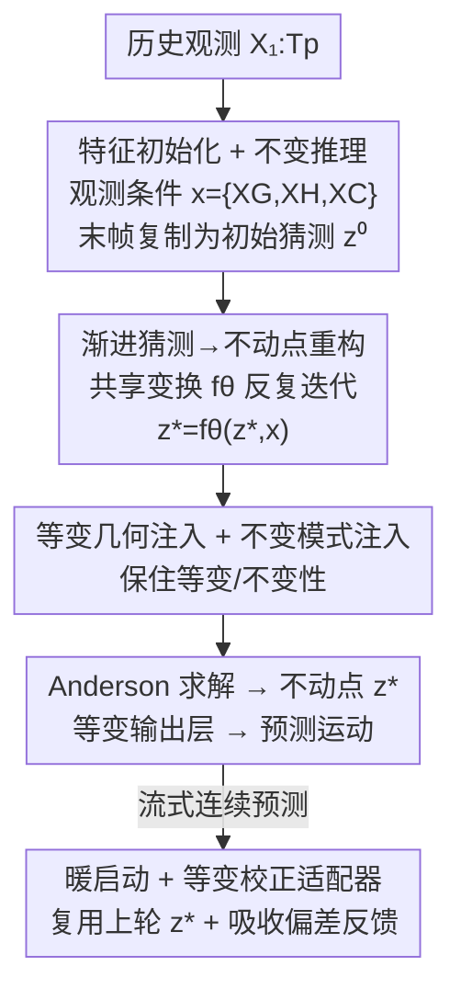

# Progressive Guessing to Fixed Point: Rethinking Human Motion Prediction with Deep Equilibrium Models

**会议**: CVPR 2026  
**论文**: [CVF Open Access](https://openaccess.thecvf.com/content/CVPR2026/html/Wei_Progressive_Guessing_to_Fixed_Point_Rethinking_Human_Motion_Prediction_with_CVPR_2026_paper.html)  
**代码**: 无  
**领域**: 人体理解 / 人体运动预测  
**关键词**: 运动预测, 深度均衡模型, 不动点, 等变建模, 流式预测

## 一句话总结
MotionDEQ 把人体运动预测里「多阶段渐进猜测」的级联框架重写成一个隐式层内的**不动点求解问题**——等价于无限多次精化但只需 $O(1)$ 训练显存，再把欧氏几何等变性注入这个均衡过程，并利用相邻预测的时间连贯性把上一轮不动点当「暖启动」复用，在 Human3.6M 上用不到 300K 参数取得 400ms@55.3mm 的 SOTA 精度、训练显存比多阶段对手省 2 倍多。

## 研究背景与动机
**领域现状**：人体运动预测 (从过去姿态预测未来姿态) 近年常用「由粗到精」的多阶段精化框架 (如 PGBIG)。一个常见预处理是把最后观测帧复制到整个预测时段当作「初始猜测」(initial guess)，模型只需在此基础上做小幅调整逼近目标；多阶段框架则堆叠多个不共享参数的精化阶段，逐级产出更好的猜测，并用递归平滑的 GT 在每阶段提供中间监督。

**现有痛点**：这种级联设计有三个硬伤——① **参数不高效**：每个精化阶段都有自己的参数，显存冗余且过拟合风险高，计算/显存随网络深度至少线性增长；② **缺乏停止准则**：精化深度 $L$ 只能凭经验设，太少则预测粗糙、太多则浪费算力，是个 trade-off；③ **阶段间不一致**：人工设的中间目标让早期阶段倾向平滑、后期阶段才补细节，且最终猜测**依赖中间轨迹** (path-dependent)。

**核心矛盾**：多阶段精化的本质是「有限步、独立参数、轨迹依赖」，而我们真正想要的是「足够深、参数共享、与轨迹无关、有收敛停止准则」的精化。

**本文目标**：在不改 EqMotion 的等变/不变特征学习设计前提下，只改造**精化过程本身**，让它既深又省。

**切入角度**：作者借鉴隐式深度学习里的深度均衡模型 (DEQ)——把多阶段精化看成对一个共享变换 $f_\theta$ 反复迭代直到收敛，输出定义为不动点 $\mathbf{z}^*=f_\theta(\mathbf{z}^*,\mathbf{x})$，这天然实现「无限层猜测」且训练只需常数显存。

**核心 idea**：用单个共享变换的不动点求解，替代多阶段独立参数的有限精化；并把等变性、稀疏监督、流式暖启动三件事补齐，让 DEQ 真正适配运动预测。

## 方法详解

### 整体框架
给定过去 $T_p$ 帧观测 $\mathbf{X}_{1:T_p}$ (每帧 $J$ 个关节的 3D 坐标)，目标是预测后续 $T_f$ 帧。MotionDEQ 以 EqMotion 为底座：先经**特征初始化 + 不变推理模块**把观测构造成「观测条件」$\mathbf{x}=\{\mathbf{X}_G,\mathbf{X}_H,\mathbf{X}_C\}$ (几何特征、模式特征、关节交互图)，并把末帧复制作为初始猜测 $\mathbf{z}^{(0)}$；再把 EqMotion 原本堆叠的 $L$ 个独立精化阶段，替换成**单个共享参数变换在隐式层里反复迭代**，用黑盒求解器 (Anderson mixing) 解出不动点 $\mathbf{z}^*=(\mathbf{G}^*,\mathbf{H}^*)$；最后经等变输出层把 $\mathbf{z}^*$ 解码成预测运动，保证整网等变。

直接套 DEQ 会失败：因为 DEQ 路径无关，$\mathbf{z}^*$ 对初始猜测不敏感，观测信息会在无限精化中被稀释；而把观测注入又会破坏等变/不变性。所以作者补了等变/不变注入、稀疏不动点监督，并为流式场景加了暖启动 + 等变校正适配器。

### 关键设计

**1. 把渐进猜测重写成不动点问题：用无限层共享精化换 $O(1)$ 显存**

针对「多阶段参数冗余、无停止准则、轨迹依赖」三个痛点，作者把 EqMotion 第 $\ell$ 阶段的几何特征学习 $\mathcal{F}^{(\ell)}_{\text{EGFL}}$ 和模式特征学习 $\mathcal{F}^{(\ell)}_{\text{IPFL}}$ 从「各阶段独立参数」改成「全程共享 $\theta$」，整个精化变成均衡过程，输出即不动点 $\mathbf{z}^*=f(\mathbf{z}^*,\mathbf{x}\mid\theta)$，求解化为找根 $g(\mathbf{z},\mathbf{x}\mid\theta)=f-\mathbf{z}=0$ (Anderson mixing)。前向直接解不动点；反向用隐函数定理 $\frac{\partial\mathcal{L}}{\partial\theta}=\frac{\partial\mathcal{L}}{\partial\mathbf{z}^*}\big(\mathbf{I}-\frac{\partial f}{\partial\mathbf{z}^*}\big)^{-1}\frac{\partial f}{\partial\theta}$，**只依赖最终不动点 $\mathbf{z}^*$、不需回传所有精化步**，于是训练显存从 $L$ 阶段的 $O(L)$ 降到 $O(1)$，深度也由收敛残差 $\epsilon$ 自动决定 (天然停止准则)，且与中间轨迹无关。

**2. 等变几何注入 + 不变模式注入：让观测信息进得来、又不破坏等变性**

直接把观测当条件注入会破坏 EqMotion 的等变/不变结构。作者用 $\mathcal{F}_{\text{DL}}$ 把初始猜测 (末帧复制 $\mathbf{X}_{rep}$) 分解成等变几何特征 $\mathbf{G}^{(0)}$ 与不变模式特征 $\mathbf{H}^{(0)}$，再设计两个保结构的注入层：几何注入 $\mathcal{F}_{\text{EGI}}$ 全程对均值做中心化再加回 ($\mathbf{P}=\phi_{g_2}(\mathbf{g}+\mathbf{X}_G-\bar{\mathbf{g}}-\bar{\mathbf{X}}_G)+\bar{\mathbf{X}}_G$，线性层无偏置)，对平移/旋转 $R,t$ 保持等变；模式注入 $\mathcal{F}_{\text{IPI}}$ 用带 SiLU 的 MLP 保持不变。论文给出 Theorem 1 证明初始化、DEQ 更新层、校正适配器、Anderson 前向乃至不动点复用都保持等变/不变。这一步是「把 DEQ 和等变运动建模真正桥接起来」的关键——少了它，注入观测反而掉点。

**3. 稀疏不动点监督 + 截断相位梯度：稳住 DEQ 训练且不靠人工平滑 GT**

PGBIG 靠递归平滑 GT 给每阶段中间监督，但这会引入阶段间不一致。MotionDEQ 改用**稀疏不动点监督**：从求解轨迹 $(\mathbf{z}^{(0)},\dots,\mathbf{z}^*)$ 里均匀采几个中间态直接对齐 GT，损失 $\mathcal{L}_{total}=\|\mathcal{F}_{\text{EOL}}(\mathbf{z}^*)-\mathbf{Y}\|_2^2+\gamma\|\mathcal{F}_{\text{EOL}}(\mathbf{z}^{(\ell)})-\mathbf{Y}\|_2^2$ (无需手工平滑、无需密集逐阶段监督，更契合 DEQ 路径无关本性)。反向因逆 Jacobian 太贵，放弃纯 JFB 单步近似 (会显著伤收敛)，改用 2 步 Neumann 级数的截断相位梯度 $\frac{\partial\mathcal{L}}{\partial\theta}\approx\frac{\partial\mathcal{L}}{\partial\mathbf{z}^*}\big(\mathbf{I}+\frac{\partial f}{\partial\mathbf{z}^*}\big)\frac{\partial f}{\partial\theta}$，在效率与精度间取平衡。

**4. 流式运动的暖启动 + 等变校正适配器：把时间连贯性变成省算力的杠杆**

真实运动是流式到达的，相邻预测轮高度连贯。作者观察到连续「行走」序列中第 105、106 轮的不动点几乎一致 (150 轮才明显变化)，于是把上一轮不动点当下一轮的**暖启动** $\mathbf{z}^{(0)}_{r+1}=\mathbf{z}^*_r$，让求解器从近收敛态出发，大幅减少迭代。此外，流式设定下上一轮 GT 在下一轮开始时已可得，于是引入轻量**等变校正适配器** $\mathcal{F}_{\text{ECA}}$：把上一轮预测与新观测的偏差 $\hat{\mathbf{Y}}_r-\mathbf{X}_{r+1}$ 经 $\mathcal{F}_{\text{DL}}$ 分解后注入，$\mathbf{H}=\mathbf{H}^*_{r+1}+\text{MLP}(\mathbf{H}')$，再过一层等变 EGNN 输出，吸收上一轮的预测偏差反馈而不破坏等变性。

### 损失函数 / 训练策略
几何特征维 $C=72$ (长时 96)、模式特征维 $D=64$；DEQ 求解训练 $T_{\text{train}}=20$ 次、推理 $T_{\text{infer}}=30$ 次迭代，相对残差 $<\epsilon=1\text{e-}3$ 时早停；稀疏正则权重 $\gamma=0.8$。Adam，初始 lr $5\text{e-}4$ (每 2 epoch 衰减 0.98)，batch 100，训练 100 epoch，单张 RTX-3090。

## 实验关键数据

### 主实验
在 Human3.6M、CMU-MoCap、3DPW 三个基准上以 MPJPE (平均每关节位置误差，mm，越低越好) 评测，重点对比多阶段精化方法 PGBIG 与 EqMotion。

| 数据集 | 指标 | PGBIG | EqMotion | MotionDEQ |
|--------|------|-------|----------|-----------|
| Human3.6M | 平均 MPJPE @80ms | 10.3 | 9.2 | **8.9** |
| Human3.6M | 平均 MPJPE @400ms | 58.5 | 55.9 | **55.3** |
| CMU-MoCap | 平均 MPJPE | 33.54 | 32.61 | **32.42** |
| 3DPW | 平均 MPJPE | 70.40 | 67.07 | **65.95** |
| 3DPW | @200ms / @400ms | — | 32.05 / 63.41 | **30.63 / 61.38** |

> 相对多阶段对手，Human3.6M 上对 EqMotion/PGBIG 分别在 80/160/320/400ms 提升 3.4%/15.7%、2.5%/12.9%、1.1%/7.5%、1.0%/5.8%；最难的 3DPW 在 200/400ms 各提升 4.6%/3.3%。

### 消融实验
网络结构消融 (Human3.6M，平均 MPJPE) 验证不动点重构与等变注入的必要性。

| 配置 | 平均 MPJPE | 说明 |
|------|-----------|------|
| DEQ with Eq.(2) | 71.4 | 直接用观测当初始猜测，均衡学习严重失效 |
| w/o $\mathcal{F}_{\text{EGI}}$ (去等变几何注入) | 38.1 | 掉点明显 |
| w/o $\mathcal{F}_{\text{IPI}}$ (去不变模式注入) | 35.3 | 同样掉点 |
| Ours (完整) | **32.1** | 等变 + 不变注入缺一不可 |

### 关键发现
- **不动点收敛质量 ≈ 预测精度**：前向迭代越多误差越低，约 10 次迭代后趋于强性能；暖启动让求解更快收敛 (比冷启动少迭代)，而 ESL-8 (EqMotion 共享 8 阶段) 几乎无法收敛。
- **显存优势显著**：batch 100 训 Human3.6M 时，MotionDEQ 训练显存比 EqMotion 省 2.3×、比 ESL-8 省 4.1×；暖启动复用又把 DEQ 求解的推理开销拉回到接近前馈基线。
- **参数-精度最优折中**：仅 298K 参数达 400ms@55.3mm；SiMLPe 虽更小 (140K) 但误差 57.3 明显更差；EqMotion 需 635K。
- **ECA 对大幅度运动收益更大**：「行走」等大位移动作偏差大，ECA 提供的校正信息更有用；「拍照」等微小动作收益较小。
- **平滑 GT 反而有害**：在 DEQ 设定下把稀疏监督换成 PGBIG 式平滑 GT，虽略稳训练却降精度 (密集校正甚至 NaN)，印证稀疏不动点监督更契合路径无关本性。
- **JFB 单步梯度不够**：直接用不精确 JFB 梯度性能次优，截断相位梯度更稳。

## 亮点与洞察
- **「多阶段精化 = 不动点」是个干净的重述**：把一类启发式级联框架统一成隐式层的均衡求解，一次性解决参数冗余、深度选择、轨迹依赖三个老问题——这种「把堆叠换成迭代到收敛」的视角可迁移到其它由粗到精的预测/重建任务。
- **等变性 × 隐式深度学习的首次结合**：论文是把 DEQ 引入人体运动预测的首个工作，并给出完整等变/不变性证明，说明隐式网络可以和强几何先验兼容，而非二选一。
- **流式连贯性变成算力杠杆**：暖启动复用上一轮不动点这一招几乎零成本，却把 DEQ 最被诟病的「求解慢」问题大幅缓解，是利用数据时间结构降本的好例子。
- **与已有等变架构即插即用**：MotionDEQ 保留 EqMotion 的特征学习设计、只改精化过程，意味着可嫁接到其它多阶段等变预测器上。

## 局限与展望
- **额外的不动点求解开销**：虽然暖启动缓解了，但 DEQ 前向仍需迭代求解，标准 (非流式) 设定下推理时间相对纯前馈仍有代价；收敛速度也依赖求解器与残差阈值的设置。
- **依赖 EqMotion 底座**：方法是在 EqMotion 上做精化过程改造，等变/不变注入的设计与该底座耦合较紧，迁到非等变骨干时需重新设计注入层。
- **短时为主**：⚠️ 正文主表集中在 ≤400ms 短时预测，长时结果作者称放在附录，超长时序下不动点能否稳定收敛、暖启动是否仍有效有待更多验证。
- **改进方向**：把求解迭代数做成按动作难度自适应、或学一个更强的不动点初始化网络，可能进一步压低推理开销。

## 相关工作与启发
- **vs PGBIG (多阶段渐进猜测)**：PGBIG 堆叠不共享参数的有限阶段 + 递归平滑 GT 中间监督；MotionDEQ 用单一共享变换解无限层不动点、稀疏监督，Human3.6M 平均 MPJPE 全程更低且显存大降。
- **vs EqMotion (等变多阶段)**：本文以 EqMotion 为底座但把其有限精化替换为均衡求解，参数从 635K 降到 298K、3DPW 平均 67.07→65.95，证明「无限层共享精化」优于「有限层独立精化」。
- **vs RNN 变体 (共享参数循环)**：把 EqMotion 阶段直接改成共享参数 RNN (RNN-origin/RNN-initial) 虽参数同样少，但随深度增加要么不稳、要么优化困难，精度次优；DEQ 的隐式求解在相近规模下取得最佳精度。
- **vs DeFeeNet (流式预测基线)**：DeFeeNet 也利用前一轮反馈，MotionDEQ 的等变校正适配器在保持等变前提下吸收偏差，对大幅度运动收益更明显。

## 评分
- 新颖性: ⭐⭐⭐⭐⭐ 首次把 DEQ 引入人体运动预测，并把「多阶段精化↔不动点」的统一视角与等变建模、流式暖启动打通
- 实验充分度: ⭐⭐⭐⭐ 三基准 + 显存/参数/收敛/流式多维消融扎实，但长时预测主要放在附录
- 写作质量: ⭐⭐⭐⭐ 动机层层递进、理论与方法自洽，公式记号偶有 OCR 噪声
- 价值: ⭐⭐⭐⭐ 在精度、参数、显存间取得优秀折中，对资源受限/流式运动预测部署有实际意义

<!-- RELATED:START -->

## 相关论文

- [\[CVPR 2026\] Towards Decompositional Human Motion Generation with Energy-Based Diffusion Models](towards_decompositional_human_motion_generation_with_energy-based_diffusion_mode.md)
- [\[CVPR 2026\] Gaussian-Mixture Latent Flow for Stochastic 3D Human Motion Prediction](gaussian-mixture_latent_flow_for_stochastic_3d_human_motion_prediction.md)
- [\[AAAI 2026\] mmPred: Radar-based Human Motion Prediction in the Dark](../../AAAI2026/human_understanding/mmpred_radar-based_human_motion_prediction_in_the_dark.md)
- [\[CVPR 2026\] Next-Scale Autoregressive Models for Text-to-Motion Generation](next-scale_autoregressive_models_for_text-to-motion_generation.md)
- [\[CVPR 2026\] Anatomical Domain Shifts: Test-time Heterogeneous Adaptation for 3D Human Pose Prediction](anatomical_domain_shifts_test-time_heterogeneous_adaptation_for_3d_human_pose_pr.md)

<!-- RELATED:END -->
