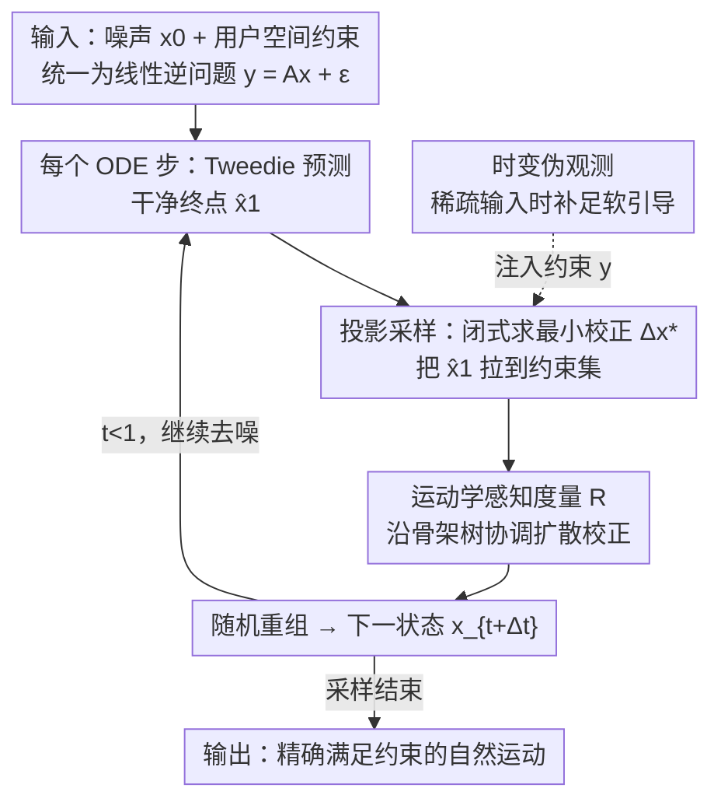

# ProjFlow: Projection Sampling with Flow Matching for Zero-Shot Exact Spatial Motion Control

**会议**: CVPR 2026  
**论文**: [CVF Open Access](https://openaccess.thecvf.com/content/CVPR2026/html/Watanabe_ProjFlow_Projection_Sampling_with_Flow_Matching_for_Zero-Shot_Exact_Spatial_CVPR_2026_paper.html)  
**代码**: 未提供（论文未给出公开链接）⚠️ 以原文为准  
**领域**: 人体运动生成 / 3D视觉 / 扩散与流匹配  
**关键词**: 流匹配, 空间运动控制, 线性逆问题, 投影采样, 运动学度量

## 一句话总结
把一大类人体运动控制任务（轨迹跟随、2D→3D 抬升、运动补全、循环动作等）统一成线性逆问题，提出 ProjFlow——一个无需训练的流匹配采样器，在每一步去噪时用闭式投影把"干净运动估计"拉到约束集上，并用一个编码骨架拓扑的"运动学感知度量"让校正沿骨骼协调扩散，从而在零样本、无内层优化的条件下**精确**满足硬约束、同时保持运动自然度。

## 研究背景与动机
**领域现状**：空间运动控制要求生成的全身运动严格符合用户给定的空间线索（某关节的轨迹、目标姿态、起止帧等）。当前主流做法是驱动预训练扩散/流匹配运动先验去满足这些约束。

**现有痛点**：现有方法基本走两条路且都有硬伤——要么为每类条件训练专门的条件分支（ControlNet 式），要么在推理时跑慢速的内层优化。前者需要任务特定的再训练、迁移性差；后者交互性差、易陷入局部极小。更根本的是，它们都把约束当成**软目标**（可微惩罚 / 引导项），无法保证精确满足，残余违例始终存在。

**核心矛盾**：用户往往只对身体的一小部分（如单只手或脚的轨迹）下约束，问题本身是欠定的——很多运动都能满足稀疏约束。需要在"精确满足硬约束"与"保持运动先验下的自然度"之间同时达标，而软约束范式做不到前者。

**本文目标**：要一个采样器，同时做到（i）精确强制等式约束、（ii）零样本、不做任务特定再训练、（iii）推理时无内层优化，且全程保留预训练运动先验。

**切入角度**：作者观察到——轨迹跟随、关键帧、相机/根路径控制、部分身体编辑这一大类任务都能写成**线性逆问题** $y = Ax + \epsilon$。线性逆问题在图像生成里已有成熟的零样本投影解法（如 DDNM 的零空间投影），把这套思路搬到流匹配 + 人体运动上即可。

**核心 idea**：在每个去噪步把预测的干净运动**投影**到满足约束的集合上，投影"最小调整量"在一个新设计的、反映骨架拓扑的**运动学感知度量**下度量；再用流匹配的随机重组步把校正后的终点拼回采样轨迹，从而既精确满足约束又不破坏运动先验。

## 方法详解

### 整体框架
ProjFlow 不改训练、不加分支，只改采样过程。先把所有用户约束统一成一个线性观测模型 $y=Ax+\epsilon$（硬约束对应观测噪声协方差 $\Sigma\to 0$ 的极限）。采样时基于 Rectified Flow，在每个 ODE 步 $t$ 做三件事：① 用 Tweedie 公式从当前状态 $x_t$ 和预测速度 $v_\theta$ 推出干净终点估计 $\hat{x}_1$；② 求一个**最小校正** $\Delta x^\star_1$，在运动学感知度量 $R$ 下把 $\hat{x}_1$ 投到约束集上（有闭式解）；③ 用 FlowDPS 式的随机重组把校正后的终点 $\hat{x}^\star_1$ 与混入少量噪声的初值拼成下一状态 $x_{t+\Delta t}$。循环直到 $t=1$。对于稀疏输入（如关键帧间长间隙补全），额外引入随采样衰减的"时变伪观测"补足引导。

### 关键设计

**1. 线性逆问题统一建模：把异构空间控制收敛成一个观测模型**

现有方法对每类约束都要单独设计条件机制，迁移成本高。ProjFlow 把轨迹跟随、关键帧、根路径、部分身体编辑等统一写成 $y = Ax + \epsilon,\ \epsilon\sim\mathcal{N}(0,\Sigma)$：$x\in\mathbb{R}^d$（$d=3JN$，$J$ 关节、$N$ 帧、世界绝对坐标）是要生成的运动，$A$ 是已知线性算子，$y$ 是用户观测。硬约束作为 $\Sigma$ 对应行方差趋零的极限恢复，不确定/部分观测则按置信度（方差大小）加权。这样一来，"满足约束"就退化成一个标准的线性逆问题求解，不再需要任务特定分支——这是后续闭式投影能成立的前提。

**2. 投影采样 + 流匹配随机重组：每步闭式校正，零内层优化**

针对"软约束保证不了精确满足"的痛点，ProjFlow 在每个去噪步直接解一个凸二次问题求最小校正：

$$\min_{\Delta x_1}\ \tfrac{1}{2}\lVert\Delta x_1\rVert_R^2 + \tfrac{1}{2}\lVert y - A(\hat{x}_1+\Delta x_1)\rVert_{\Sigma^{-1}}^2$$

它有唯一闭式解 $\Delta x^\star_1 = R^{-1}A^\top(AR^{-1}A^\top+\Sigma)^{-1}(y-A\hat{x}_1)$，加到 Tweedie 估计 $\hat{x}_1 = x_t+(1-t)v_\theta(x_t,t)$ 上得到校正终点 $\hat{x}^\star_1$。当 $\Sigma\to 0$ 时投影把残差压到零，**硬约束精确满足到数值精度**。随后用 FlowDPS 式随机重组 $\tilde{x}_0=\sqrt{1-\eta_t}\,x_0+\sqrt{\eta_t}\,\epsilon$、$x_{t+\Delta t}=\alpha_{t+\Delta t}\hat{x}^\star_1+\sigma_{t+\Delta t}\tilde{x}_0$ 拼回采样路径——混入噪声 $\eta_t$ 是为了让状态留在学到的运动流形上（消融显示去掉它 FID 从 0.097 暴涨到 3.429）。整套过程没有任何迭代内层优化。

**3. 运动学感知度量：让校正沿骨架协调扩散，而非孤立抖动**

校正的"大小"由度量 $R$ 决定。若用欧氏度量（$R=I$），所有坐标等权，几个关节的小改动在 $\ell_2$ 下看着"小"却可能破坏运动学连贯性，产生孤立抽搐的假象（消融里欧氏度量 FID 从 0.097 恶化到 1.152）。ProjFlow 把"小"重新定义为"沿骨架树连贯"：

$$R = w_{\text{kin}}(I_3\otimes I_N\otimes L_{\text{kin}}) + \lambda I_d$$

其中 $L_{\text{kin}}=D_{\text{kin}}-A_{\text{kin}}$ 是骨架拓扑的图拉普拉斯（$A_{\text{kin}}$ 为关节邻接矩阵）。直觉是：相邻关节间的不一致被 $w_{\text{kin}}L_{\text{kin}}$ 强惩罚、非直连关节几乎不耦合，于是校正会沿运动链协调传播；$\lambda I$ 项给逐帧全局平移这类拉普拉斯惩罚不到的方向加一个基线 $\ell_2$ 正则，并保证 $R$ 严格正定可逆。作者指出在欧氏、无噪、确定性极限下该框架恰好退化为 DDNM，但额外支持结构化度量、含噪观测和时变算子。

**4. 时变伪观测：稀疏输入下"先密集引导、再逐步淡出"**

运动补全时硬观测极稀疏（只有几个关键帧），单靠硬约束引导不足。ProjFlow 用逐关节线性插值造一批"软"伪观测 $y_{\text{src}}$ 提供更密的引导，但插值不总可靠，于是用两个机制控制其信任度：**动态掩码**——伪观测只在硬约束的时间邻域内激活，邻域半径 $\ell(t)=(1-t)\ell_{\max}+t\ell_{\min}$ 随采样线性收缩，到 $t\to 1$ 只剩硬约束；**自适应方差**——给每个伪观测按可靠性赋非零方差 $\sigma_i^2(t)$，可靠性由全局时间衰减项 $\tau(t)$ 和局部曲率惩罚 $s_n(\hat{x}_1)=\lVert(\hat{x}_1)_{n+1}-2(\hat{x}_1)_n+(\hat{x}_1)_{n-1}\rVert_R$ 共同决定（时间越晚、曲率越大越不信任，因为此时模型自身预测更可信、且线性插值在高曲率处更差）。硬观测始终保持零方差（精确等式）。

### 损失函数 / 训练策略
ProjFlow 本身**不引入任何训练**——它复用预训练的 Rectified Flow 运动模型（实验用 ACMDM-S-PS22 作基模型）。基模型按标准条件流匹配损失 $\mathcal{L}_{\text{FM}}=\mathbb{E}\lVert v_\theta(x_t,t)-(x_1-x_0)\rVert_2^2$ 训练（其中 $x_t=(1-t)x_0+t x_1$）。所有空间控制能力都来自采样阶段的投影 + 度量 + 伪观测，零任务特定再训练。

## 实验关键数据

### 主实验
数据集为 HumanML3D（14,646 条带文本标注的人体运动），基模型为 ACMDM-S-PS22，对照 OmniControl/MaskControl/CtrlNet（需训练）与 DNO（零样本优化）。控制精度用 Traj./Loc./Avg. 误差（轨迹、关键帧、平均距离偏差），自然度用 FID，物理合理性用 Foot Skating Ratio（脚部滑步比例，越低越好）。

| 设置 | 方法 | 零样本 | FID↓ | Avg. err.↓ | Foot Skating↓ |
|------|------|--------|------|-----------|---------------|
| Pelvis 控制 | OmniControl（需训练） | ✗ | 0.081 | 0.0338 | 0.0547 |
| Pelvis 控制 | MaskControl（需训练） | ✗ | **0.066** | 0.0093 | 0.0543 |
| Pelvis 控制 | DNO（零样本优化） | ✓ | 0.151 | 0.0089 | 0.0610 |
| Pelvis 控制 | **ProjFlow** | ✓ | 0.107 | **0.0000** | 0.0629 |
| 全关节均值 | MaskControl（需训练） | ✗ | **0.095** | 0.0065 | 0.0545 |
| 全关节均值 | DNO（零样本优化） | ✓ | 0.147 | 0.0121 | 0.0600 |
| 全关节均值 | **ProjFlow** | ✓ | 0.097 | **0.0000** | 0.0603 |

ProjFlow 是唯一把轨迹/关键帧/平均误差全部压到 **0.0000**（精确满足）的零样本方法；其 FID 优于同为零样本的 DNO（0.097 vs 0.147），与需训练的 ControlNet 系（0.067–0.095）处于同一自然度档位，但完全免训练。2D→3D 抬升任务上，ProjFlow 在 Average 协议下 FID 0.349 优于 SOTA 的 Sketch2Anim（0.525），且 MPJPE-2D=0.000（重投影零误差），而 Sketch2Anim 仍有残余 2D 误差。

### 消融实验
在运动补全任务上逐一去掉三个组件（所有变体都仍精确满足约束，差异只在自然度）：

| 变体 | FID↓ | Diversity→ | 说明 |
|------|------|-----------|------|
| ProjFlow (Full) | **0.097** | 10.651 | 完整模型 |
| 换欧氏度量 $R=I$ | 1.152 | 10.107 | 校正不沿骨架扩散，自然度崩坏 |
| 去随机重组 $\eta_t=0$ | 3.429 | 9.307 | 离开运动流形，质量与多样性骤降 |
| Plain masking（去伪观测） | 0.880 | 10.187 | 稀疏补全引导不足，自然度明显变差 |

### 关键发现
- 三个组件都是"维持自然度"的关键，而非"满足约束"的关键——约束精确满足由投影机制保证，各变体均为 0.0000，差异全部体现在 FID。
- 贡献最大的是**随机重组**：去掉后 FID 从 0.097 飙到 3.429，说明把状态拉回学到的运动流形至关重要。
- 运动学感知度量是把"零样本投影"用到人体运动上的核心适配点：换成欧氏度量 FID 恶化十倍以上。

## 亮点与洞察
- 把图像逆问题里的零空间/投影思想（DDNM）干净地迁移到流匹配 + 人体运动，并在数学上证明欧氏无噪极限下退化为 DDNM——是一次漂亮的"先归一化问题、再借成熟解法"的范式迁移。
- 用图拉普拉斯把骨架拓扑塞进度量矩阵 $R$，让"最小校正"自动尊重运动链——这个 trick 可迁移到任何有图结构的逆问题（如点云、网格变形）。
- "约束精确满足 vs 自然度"被彻底解耦：投影保证前者，重组 + 度量 + 伪观测保证后者，消融表里二者正交得非常干净。

## 局限与展望
- 作者承认：方法**只能处理能写成线性逆问题的约束**，原生支持不了非线性约束（如"某关节始终在某平面之上"这类不等式）。把闭式投影扩展到非线性场景是公开难题。
- 自己观察：需要已知相机参数（2D→3D 中 $s$、$R_{\text{cam}}$ 假定已知），实际应用里相机标定误差会直接进入硬约束；伪观测的若干超参（$\ell_{\max},\ell_{\min},\tau_{\min}$ 等）需要按数据调，论文未给敏感性分析 ⚠️。
- 改进思路：对不等式约束可考虑投影到凸集（如半空间）的迭代变体，或把 $A$ 局部线性化做序列线性投影。

## 相关工作与启发
- **vs ControlNet 系（OmniControl / MaskControl）**：它们为每个关节训练条件分支，需任务特定训练且约束仍是软目标（残余误差 0.006–0.04）；ProjFlow 免训练且精确满足，自然度处同一档。
- **vs 零样本优化（DNO）**：DNO 在推理时优化初始噪声，慢且约束不精确（Avg. err. 0.0089）；ProjFlow 闭式一步到位、无内层优化、误差 0.0000。
- **vs DDNM / 图像逆问题解法**：ProjFlow 在欧氏无噪极限恢复 DDNM，但用运动学度量、含噪观测、时变算子三处扩展，专门适配结构化的人体运动数据。

## 评分
- 新颖性: ⭐⭐⭐⭐ 范式迁移 + 运动学度量是实在创新，但投影/DDNM 思想本身有先例
- 实验充分度: ⭐⭐⭐⭐ 两类任务 + 完整消融，但缺超参敏感性与更大规模数据集验证
- 写作质量: ⭐⭐⭐⭐⭐ 问题归一、方法推导、消融解耦都讲得非常清楚
- 价值: ⭐⭐⭐⭐ 给交互式精确运动编辑提供了免训练、可即插的实用方案

<!-- RELATED:START -->

## 相关论文

- [\[CVPR 2026\] FMPose3D: monocular 3D pose estimation via flow matching](fmpose3d_monocular_3d_pose_estimation_via_flow_matching.md)
- [\[CVPR 2026\] Humanoid-GPT: Scaling Data and Structure for Zero-Shot Motion Tracking](humanoid-gpt_scaling_data_and_structure_for_zero-shot_motion_tracking.md)
- [\[CVPR 2026\] Unified Number-Free Text-to-Motion Generation Via Flow Matching](unified_number-free_text-to-motion_generation_via_flow_matching.md)
- [\[CVPR 2026\] MotionHiFlow: Text-to-Motion via Hierarchical Flow Matching](motionhiflow_text-to-motion_via_hierarchical_flow_matching.md)
- [\[CVPR 2026\] HandDreamer: Zero-Shot Text to 3D Hand Model Generation](handdreamer_zero_shot_text_to_3d_hand_model_generation.md)

<!-- RELATED:END -->
