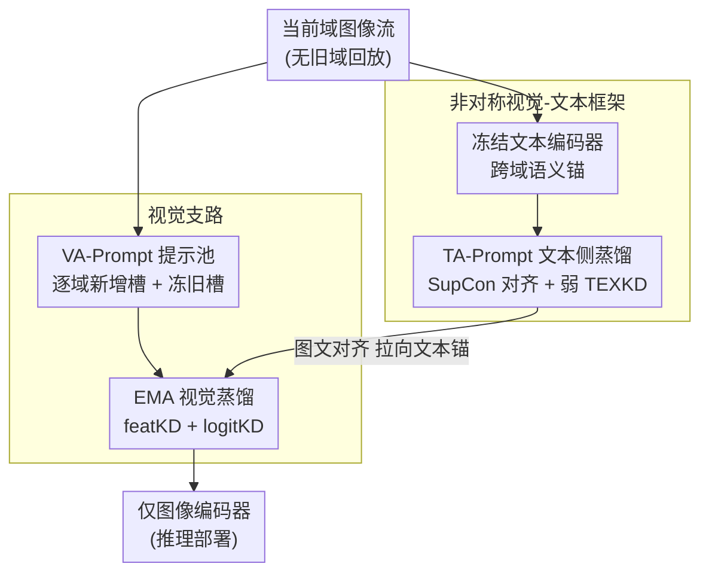

# Prompt-Anchored Vision–Text Distillation for Lifelong Person Re-identification

**会议**: CVPR 2026  
**arXiv**: [2605.05027](https://arxiv.org/abs/2605.05027)  
**代码**: https://github.com/zu-zi/PAD (有)  
**领域**: 人体理解 / 行人重识别 / 持续学习  
**关键词**: 终身行人重识别, 无样本回放, 视觉-文本蒸馏, 提示学习, CLIP

## 一句话总结
PAD 把 CLIP 冻结文本编码器当成跨域不变的"语义锚"，用一套**非对称的视觉-文本蒸馏**——文本侧弱蒸馏保语义稳定、视觉侧强 EMA 蒸馏保持塑性——在无样本回放的终身行人重识别上同时压住灾难遗忘和语义漂移，在已见域平均 mAP 70.7、未见域 78.6，全面超过此前 SOTA。

## 研究背景与动机
**领域现状**：终身行人重识别（LReID）要在按域顺序到达的数据流上训一个能不断吸收新身份、又不忘旧身份的模型。现实监控系统不断遇到新相机、新场景、新时段的数据，从头重训不现实，所以必须做增量学习。

**现有痛点**：为规避存原始图像带来的隐私/存储问题，主流的"无样本"（exemplar-free）方法靠存类原型或分布统计，做**纯视觉模态**的知识蒸馏（如 LSTKC、DKP）或参数正则。但只在视觉空间里做蒸馏有个根本缺陷：当域分布漂移时，特征空间会"局部仍可区分、但整体逐渐偏离身份语义"——即**语义漂移**（semantic drift），原本可分的身份慢慢混淆。行人 ReID 尤其敏感，因为类内差异大（光照、视角、遮挡）、类间差异小（细粒度），稳定的身份语义本就难维持。

**核心矛盾**：稳定性（不忘旧域）与塑性（学好新域）之间的 trade-off。纯视觉蒸馏要想稳，就得强约束 backbone，反过来压制新域适应；要想适应新域，又会冲掉旧语义。两者在同一个视觉空间里互相打架。

**切入角度**：作者注意到一个被忽视的资源——预训练视觉-语言模型（CLIP）里**冻结的文本编码器本身就是一个跨域不变的稳定语义坐标系**。"一个穿红夹克的人"这种文本描述不会因为姿态、光照变化而改变。如果把视觉表征锚定到这个固定文本空间上，就能把"保稳定"和"保塑性"两个任务**解耦到两个模态**去做，不必在视觉一个空间里硬权衡。

**核心 idea**：用一套**非对称视觉-文本框架**——文本侧只负责语义锚定（弱蒸馏、防过约束），视觉侧负责域适应（强 EMA 蒸馏 + 可增长的提示池），让冻结文本空间充当贯穿整个终身序列的"全局参考"，而不是主导学习信号。

## 方法详解

### 整体框架
PAD（Prompt-Anchored vision–text Distillation）由一条**文本支路**和一条**视觉支路**组成，两条支路角色非对称：文本支路保跨域语义、视觉支路保新域塑性。输入是当前域的行人图像流，训练时两支路协同，但**推理时只保留图像编码器**（文本支路只在训练期提供语义引导），因此部署开销小。

整体流程：冻结的 CLIP 文本编码器定义一个固定语义坐标系，可学习的 **TA-Prompt**（Text-Anchor Prompt）在这个坐标系里为每个身份生成类级文本嵌入，用对称的图文 SupCon 损失把视觉特征拉向这些文本锚；跨域时再叠加一个**弱文本蒸馏 TEXKD**，用上一域的冻结文本教师防止 TA-Prompt 的类得分漂离历史。视觉侧，图像编码器只解冻最后几层 + 分类头 + 一个可增长的 **VA-Prompt** 提示池，由一个 **EMA 动量教师**做**强视觉蒸馏 VISKD**（特征级 MSE + 文本锚定的 logit 级 KL），压住细粒度漂移。新域到来时 VA-Prompt 分配一批新槽位、冻结旧槽位，实现"长而不忘"的提示池增长。

整体训练目标为
$$\mathcal{L}_{\mathrm{overall}}=\mathcal{L}_{\mathrm{supcon}}+\mathcal{L}_{\mathrm{ID}}+\mathcal{L}_{\mathrm{triplet}}+\mathcal{L}_{\mathrm{KD}},$$
其中 $\mathcal{L}_{\mathrm{KD}}=\lambda_{\text{text}}\mathcal{L}_{\text{TEXKD}}+\lambda_{\text{feat}}\mathcal{L}_{\text{featKD}}+\lambda_{\text{logit}}\mathcal{L}_{\text{logitKD}}$ 把文本侧和视觉侧的所有蒸馏项汇总。

### 关键设计

**1. 非对称视觉-文本框架：把"保稳定"和"保塑性"拆到两个模态**

这是整篇的设计哲学，直接针对"在视觉单一空间里硬权衡稳定-塑性"的痛点。PAD 让文本和视觉**分工**：冻结的 CLIP 文本编码器提供一个跨域不变的语义坐标系，作为全局参考；而视觉支路保持可适应。关键在于"非对称"——文本侧只施加**弱**约束（充当语义锚而非主导学习信号），视觉侧施加**强**蒸馏（视觉表征粒度细、对域漂移敏感，需要强锚定）。这跟以往要么纯视觉蒸馏、要么在视觉空间里做提示适应的工作根本不同：文本空间天然就是稳定的，不需要额外正则去"保"它，于是稳定性几乎免费获得，视觉侧就能放心地腾出塑性去学新域。作者强调 PAD 不是"提示 + 蒸馏"模块的简单拼接，而是为 LReID 的稳定-塑性权衡量身设计的视觉-文本表述。

**2. TA-Prompt 文本侧：隐式 SupCon 对齐 + 刻意保弱的显式蒸馏**

文本侧做的是**双层语义对齐**：隐式对齐 + 显式蒸馏，且显式部分故意保弱。隐式部分——对每个身份 $y_i$ 取视觉特征 $\mathbf{v}_i$，把 TA-Prompt 生成的类专属 token 插进固定文本模板、过冻结文本编码器得到文本特征 $\mathbf{t}_i$，二者 $\ell_2$ 归一化后用对称图文监督对比损失优化：
$$\mathcal{L}_{\mathrm{supcon}}=\mathrm{SupCon}(\mathbf{v}\!\to\!\mathbf{t})+\mathrm{SupCon}(\mathbf{t}\!\to\!\mathbf{v}).$$
因为文本编码器冻结，这一步只更新 prompt 参数，却把所有域都绑到同一个由冻结文本骨干决定的跨模态语义空间上——视觉簇被一致地拉向一组跨域共享的类级文本锚。作者实验发现，即便完全关掉显式文本蒸馏，光这个 SupCon 隐式对齐就已经是个很强的域无关语义正则（这解释了为何 baseline 已很稳）。

显式部分 TEXKD 只是**轻量补丁**：对每个域，载入上一 checkpoint 只保留其文本支路当冻结教师，把所有身份标签过教师得到全局文本库 $t^{\mathrm{tea}}\in\mathbb{R}^{C\times d}$（缓存复用）。定义温度缩放的 softmax 余弦相似度
$$q(v,t,\tau,\gamma)=\frac{\exp(\gamma\,(v\cdot t_{+})/\tau)}{\sum_{i=1}^{K}\exp(\gamma\,(v\cdot t_{i})/\tau)},$$
其中 $K$ 是采样身份子集大小（batch 身份 + 随机负身份），$\gamma$ 是可学习的 logit 缩放因子。然后用温度缩放 KL 让学生 TA-Prompt 的得分分布对齐教师：$\mathcal{L}_{\mathrm{TEXKD}}=\tau^2 D_{\mathrm{KL}}\!\left(q(v,t^{\mathrm{tea}},\tau,\gamma)\,\|\,q(v,t^{\mathrm{stu}},\tau,\gamma)\right)$。一个细节是：文本侧**故意不用 EMA 教师**——因为文本编码器冻结、只更新 prompt，EMA 教师几秒就会塌缩成学生使 KL 项消失，所以用固定的旧域教师当稳定参考。TEXKD 权重刻意取小（$\lambda_{\text{text}}=0.5$），因为太强的文本约束会过度束缚新域的 prompt 适应。

**3. VA-Prompt 视觉提示池 + 选择性解冻：可增长却不互扰的塑性来源**

视觉侧的塑性靠 VA-Prompt，借鉴 DualPrompt，分两部分：**G-Prompt**（全局共享 token）+ **E-Prompt**（专家提示池）。对图像编码器每一层，当前输入表征当 query，按余弦相似度选出 Top-$k$ 最相关的专家，拼成 $[\text{CLS},G,E,\text{patches}]$ 的扩展序列过 transformer 块，处理完再把插入的 prompt 剥掉，保证不污染原始视觉表征结构。**跨域时每个新域激活一批全新槽位、冻结旧域槽位**，于是提示池随域增长却互不干扰——这是"长而不忘"的机制核心。实现上用 6 个 general + 6 个 expert token/层、池大小 36、Top-K=4。

配套的选择性解冻：进入终身序列前，先在首域上把 CLIP backbone 不带蒸馏地适配到 ReID 任务（从通用特征转到 ReID 专用特征）；后续域只解冻**最后几个 transformer 块 + 分类头**（遗忘和迁移最集中的地方），低层冻结以保域不变表征。这避免了纯提示法不能容纳大规模解冻、而传统蒸馏法又依赖深层微调的两难，既省算力又不过约束。

**4. EMA 视觉蒸馏 VISKD：特征级 + logit 级双重锚定防细粒度漂移**

视觉表征粒度细、对域漂移最敏感，所以视觉侧用**强**蒸馏。维护一个动量教师，每次迭代后更新 $\theta_{tea}\leftarrow\alpha\theta_{tea}+(1-\alpha)\theta_{stu}$（$\alpha=0.997$），提供时间平滑的目标、滤掉噪声波动。从学生和 EMA 教师各取三层视觉表征 $\{v_{11},v_{12},v_{proj}\}$（倒数第二层 token、最后一层 token、最终投影嵌入），用 MSE 回归对齐：
$$\mathcal{L}_{\mathrm{featKD}}=\frac{1}{3}\sum_{i=1}^{3}\|v_i^{stu}-v_i^{tea}\|_2^2.$$
同时做一个 logit 级蒸馏，但锚在**域专属文本库**上：把学生和教师的图像特征都投到同一组固定文本嵌入上，得到两个视觉-文本相似度分布（这里用纯内积、不带可学习缩放因子），再用温度平滑 KL 对齐：$\mathcal{L}_{\mathrm{logitKD}}=\tau^2 D_{\mathrm{KL}}\!\left(q(v^{\mathrm{tea}},t,\tau)\,\|\,q(v^{\mathrm{stu}},t,\tau)\right)$。视觉蒸馏权重取得相对大（$\lambda_{\text{feat}}=\lambda_{\text{logit}}=0.5$，$\tau=4.0$），配合选择性解冻的后几层，既给新域足够塑性，又用 EMA 教师当锚防止特征空间塌缩或漂离旧知识。

### 损失函数 / 训练策略
- **总损失**：$\mathcal{L}_{\mathrm{overall}}=\mathcal{L}_{\mathrm{supcon}}+\mathcal{L}_{\mathrm{ID}}+\mathcal{L}_{\mathrm{triplet}}+\mathcal{L}_{\mathrm{KD}}$，其中 ID 为 logit 级交叉熵、triplet 为特征级三元组损失。
- **蒸馏权重**：$\lambda_{\text{text}}=0.5$（文本侧只用 logit 级 KL，$\tau=0.07$、$\gamma$ 初始化 7.0）；$\lambda_{\text{feat}}=\lambda_{\text{logit}}=0.5$（视觉侧 $\tau=4.0$）。文本弱、视觉强，体现非对称设计。
- **骨干**：CLIP ViT-B/16，图像 resize 到 $256\times128$，随机翻转 + 擦除增强，身份均衡采样；Adam，batch 64，单张 RTX 3090，backbone 基础学习率 $5\times10^{-6}$，EMA 动量 $\alpha=0.997$。
- **协议**：5 个已见域顺序训练，无任何旧域回放，每阶段后在当前+已见域以及全部未见域上评测。

## 实验关键数据

数据集：5 个已见域（Market1501、CUHK-SYSU、DukeMTMC-reID、MSMT17、CUHK03）+ 7 个未见域（CUHK01/02、VIPeR、PRID2011、i-LIDS、GRID、SenseReID），共 12 域。采用 AKA-order1 / order2 两种顺序，指标为 mAP 与 Rank-1。

### 主实验

AKA-order1（Market→CUHK-SYSU→Duke→MSMT17→CUHK03）最终阶段平均结果：

| 方法 | 来源 | 已见域 mAP | 已见域 R1 | 未见域 mAP | 未见域 R1 |
|------|------|-----------|----------|-----------|----------|
| LSTKC | AAAI'24 | 50.0 | 63.1 | 57.0 | 49.9 |
| DKP | CVPR'24 | 51.8 | 64.1 | 59.2 | 51.6 |
| PAEMA | IJCV'24 | 61.8 | 72.7 | 70.3 | 63.2 |
| DAFC | Arxiv'25 | 65.6 | 75.9 | — | — |
| **PAD（本文）** | — | **70.7** | **81.0** | **78.6** | **71.4** |

AKA-order2（Duke→MSMT17→Market→CUHK-SYSU→CUHK03）：

| 方法 | 已见域 mAP | 已见域 R1 | 未见域 mAP | 未见域 R1 |
|------|-----------|----------|-----------|----------|
| PAEMA | 60.4 | 71.1 | 69.4 | 62.5 |
| DAFC | 64.7 | 76.2 | — | — |
| **PAD（本文）** | **69.3** | **80.0** | **76.2** | **68.6** |

两个顺序下 PAD 在已见域和未见域都拿到最优平均。尤其在最难的 MSMT17 上，PAD 的 mAP 46.9（order1）大幅领先次优 DAFC 的 27.1。7 个随机种子上 order1 最终阶段稳定在 70.30±0.49 mAP / 80.98±0.31 R1。

### 消融实验

从全微调 CLIP-ReID baseline 出发，逐步叠加冻结方案（Freeze）、VA-Prompt、TEXKD、VISKD（AKA-order1，已见域平均）：

| ID | Freeze | VA | TEXKD | VISKD | Seen mAP | Seen R1 | 说明 |
|----|--------|----|----|------|----------|---------|------|
| S0 | | | | | 66.2 | 78.5 | 全微调 baseline，适应新域好但旧域遗忘强 |
| S1 | ✓ | | | | 66.8 | 78.4 | 只冻结，偏旧域保持、牺牲适应 |
| S2 | ✓ | ✓ | | | 68.2 | 80.1 | 加 VA-Prompt 恢复塑性 |
| S3 | ✓ | ✓ | ✓ | | 68.4 | 80.4 | 文本侧 TEXKD 进一步稳语义 |
| S4 | ✓ | ✓ | | ✓ | 69.9 | 80.4 | 视觉侧 VISKD 提升更明显 |
| S5 | ✓ | ✓ | ✓ | ✓ | **70.7** | **81.0** | 完整 PAD，最佳稳定-塑性平衡 |

文本蒸馏强弱对比（AKA-order1，已见域 mAP/R1）：

| 配置 | 弱设置 | 强设置 |
|------|--------|--------|
| No KD | 68.2 / 80.1 | 68.2 / 80.1 |
| TEXKD only | 68.4 / 80.4 | 67.6 / 79.3 |
| VISKD only | 69.9 / 80.4 | 69.9 / 80.4 |
| TEXKD + VISKD | **70.7 / 81.0** | 69.5 / 80.2 |

### 关键发现
- **VISKD 比 TEXKD 贡献更大**：S2→S4（加 VISKD）涨 1.7 mAP，S2→S3（加 TEXKD）只涨 0.2 mAP。印证非对称设计——视觉侧需要强蒸馏，文本侧只需弱锚定。
- **TEXKD 必须保弱**：强设置反而把 TEXKD+VISKD 从 70.7 拉低到 69.5。因为冻结文本编码器 + SupCon 已提供强隐式锚定，再加强文本约束只会过度正则、压制 prompt 适应。
- **语义漂移被实证压住**：用图像嵌入与冻结文本原型的最大余弦相似度量化漂移，PAD 在代表性域上平均提升约 +0.09（Duke 0.151→0.243、Market 0.188→0.277、CUHK-SYSU 0.192→0.287）。
- **提示路由有语义意义**：VA-Prompt 激活相似度与域间特征相似度强相关（$\rho=0.77$）。
- **开销极小**：5 域 AKA 上提示存储峰值仅 13.71M 参数（FP16 约 26.1 MiB），多数域可训练比例仅 1–1.6%（CUHK-SYSU 因身份长尾密集约 7.8%），远低于需全模型训练的旧方法。

## 亮点与洞察
- **"冻结文本空间当全局锚"是真正的巧思**：以往无样本 LReID 都在视觉空间里硬权衡稳定-塑性，PAD 发现 CLIP 文本编码器本身就是个免费的、跨域不变的稳定坐标系，于是把"保稳定"的活外包给文本模态，视觉侧就能轻装上阵学新域。这个"换个模态来稳定"的思路可迁移到任何带语义漂移的持续学习场景。
- **非对称权重是点睛之笔**：同样是蒸馏，文本弱、视觉强不是拍脑袋——消融显示强文本蒸馏反而掉点。背后逻辑是"哪边天生稳就少管哪边"，这种"按模态固有稳定性分配约束强度"的原则很有启发。
- **文本侧不用 EMA 的工程洞察**：因为文本编码器冻结、只更新 prompt，EMA 教师会秒塌缩成学生使 KL 消失——所以改用固定旧域教师。这个细节说明蒸馏教师的更新策略要看被蒸馏对象的可塑性，不能无脑套 EMA。
- **推理零额外开销**：文本支路只在训练用，部署时只留图像编码器，这让方法在落地上很友好。

## 局限性 / 可改进方向
- **作者承认**：部分域（如 CUHK03）仍然有挑战，未来可做自适应蒸馏权重、以及扩展到多模态/换装等更复杂设置。
- **自己发现**：① 蒸馏权重 $\lambda$、温度 $\tau$、缩放 $\gamma$ 都是手调固定值，论文也承认"自适应加权"是未来工作，说明当前对超参敏感且需要 per-benchmark 调；② 依赖 CLIP 这类预训练 VLM 的文本编码器，若文本编码器本身对某些细粒度行人属性（如换装、罕见服饰）覆盖不足，文本锚的稳定性就打折扣；③ 评测仍限于标准 5 域 AKA 协议，域数更多、序列更长时提示池增长和槽位冻结策略能否持续有效未充分验证。
- **改进思路**：可探索让 TEXKD 强度随域间语义距离自适应（域差大时多约束、域差小时放松），而非全局固定弱权重。

## 相关工作与启发
- **vs CLIP-ReID**：CLIP-ReID 用文本语义做**静态** ReID（两阶段训练学习提示），但不考虑持续适应。PAD 把它的跨模态对齐思想扩展到终身设置，关键加了 TA-Prompt 的跨域蒸馏和视觉侧 EMA 蒸馏来抗遗忘。
- **vs 纯视觉无样本法（LSTKC / DKP / DKP++）**：它们存特征原型/分布做纯视觉蒸馏，只在视觉模态内操作，域漂移时难维持身份语义一致性。PAD 引入文本模态当稳定锚，已见域 mAP 从 ~50 提到 70.7。
- **vs PAEMA**：同样是无样本 LReID + 提示引导 + EMA 知识保持，但 PAEMA 仍在视觉空间内做，PAD 的差异是围绕**冻结文本语义空间**这个持久锚来组织、且文本-视觉非对称分工，order1 已见域 mAP 70.7 vs 61.8。
- **vs DualPrompt**：PAD 的 VA-Prompt 直接借鉴 DualPrompt 的 G-Prompt/E-Prompt 互补提示设计，但把它放进视觉-文本框架并加了逐域槽位冻结来抗遗忘。
- **vs DAFC**：DAFC 强调无样本 LReID 的分布感知遗忘补偿，是 order1 上次优（已见 mAP 65.6）。PAD 用文本锚 + 非对称蒸馏在已见域（70.7）和未见域上都更强。

## 评分
- 新颖性: ⭐⭐⭐⭐⭐ "冻结文本空间当跨域语义锚 + 视觉-文本非对称蒸馏"在 LReID 上是新颖且自洽的框架，不是模块拼接。
- 实验充分度: ⭐⭐⭐⭐⭐ 两种顺序 × 12 域、7 种子方差、组件/强弱/参数三类消融、语义漂移定量与提示路由相关性分析都齐备。
- 写作质量: ⭐⭐⭐⭐ 动机推导清晰、非对称设计讲得透，但部分超参/教师塌缩细节藏在正文，框架图需对照才好读。
- 价值: ⭐⭐⭐⭐⭐ 大幅刷新无样本 LReID SOTA，推理零额外开销、提示存储极小，落地友好且思路可迁移。

<!-- RELATED:START -->

## 相关论文

- [\[CVPR 2026\] Vision-Language Attribute Disentanglement and Reinforcement for Lifelong Person Re-Identification](vision-language_attribute_disentanglement_and_reinforcement_for_lifelong_person_.md)
- [\[CVPR 2026\] Dynamic Magic: Unleashing Restricted Knowledge for Lifelong Person Re-Identification](dynamic_magic_unleashing_restricted_knowledge_for_lifelong_person_re-identificat.md)
- [\[CVPR 2026\] COPE: Consistent Occlusion and Prompt Enhancement Network for Occluded Person Re-identification](cope_consistent_occlusion_and_prompt_enhancement_network_for_occluded_person_re-.md)
- [\[CVPR 2026\] Composite-Attribute Person Re-Identification via Pose-Guided Disentanglement](composite-attribute_person_re-identification_via_pose-guided_disentanglement.md)
- [\[CVPR 2026\] View-Aware Semantic Alignment for Aerial-Ground Person Re-Identification](view-aware_semantic_alignment_for_aerial-ground_person_re-identification.md)

<!-- RELATED:END -->
