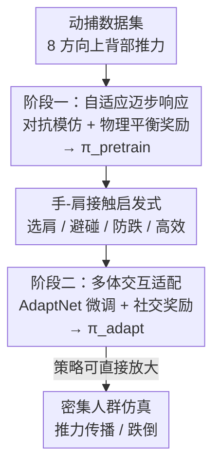

# Push-and-Step: From RL-Based Balance Recovery to Physical Simulation of Dense Crowds

**会议**: CVPR 2026  
**论文**: [CVF Open Access](https://openaccess.thecvf.com/content/CVPR2026/html/Jensen_Push-and-Step_From_RL-Based_Balance_Recovery_to_Physical_Simulation_of_Dense_CVPR_2026_paper.html)  
**代码**: https://github.com/alexis-jensen/Push-and-Step  
**领域**: 人体理解 / 物理仿真 / 强化学习  
**关键词**: 密集人群仿真, 平衡恢复, 物理人形仿真, 两阶段强化学习, 社交感知接触

## 一句话总结
用两阶段深度强化学习训练全身物理人形 agent：第一阶段靠动作模仿 + 物理平衡奖励学会被推后"迈步恢复平衡"，第二阶段用 AdaptNet 微调并引入"手-肩接触"启发式，让 agent 在密集人群里通过推扶邻居来社交化地耗散冲击，从而首次用纯物理仿真复现真实密集人群中推力传播、跌倒和拥挤踩踏等现象。

## 研究背景与动机
**领域现状**：传统人群仿真把人简化成 2D 圆盘 / 椭圆 / 粒子，关注的是中等密度下的导航与社交行为（避碰、寻路），主流模型只刻画"非接触式"的局部交互规则。

**现有痛点**：在地铁车厢、演唱会这种**极高密度**场景里，人与人之间的交互本质是**物理接触**——推力会沿着身体一层层传播、引发连锁失衡甚至跌倒。2D 几何表示根本无法刻画力如何在肢体层面传导、放大；即便是最精细的基于粒子的 2D 密集人群模型也只能近似推力传播波，看不到接触背后"力 / 运动 / 能量"的真实机制。

**核心矛盾**：要理解并预警拥挤踩踏这类真实危害，必须把人群当成**全身、有关节、受物理约束的 3D 人形**来仿真；但全身物理仿真的状态空间、控制难度比 2D 高几个量级，而且密集人群里 agent 恢复平衡时会无意中推到邻居，扰动会被传播放大——以前没人用纯物理仿真完整做过密集人群。

**本文目标**：训练一个能在密集人群中、被不可预测外力推搡时，靠**迈步**和**对邻居施加接触力**来恢复平衡的全身物理控制策略，并且这种接触要符合人类"社交得体"的习惯（轻碰肩膀而非乱推后腰）。

**切入角度**：作者从人类生物力学的平衡恢复策略出发——人靠肌肉刚度、踝/髋转动、迈步三种策略，分别对应 CoM（质心）、CoP（压力中心）、BoS（支撑面）等物理量；密集环境下手还能搭在邻居身上扩大恢复区。把这些物理原理直接编码进 RL 奖励，就能让策略从很小的专家数据集泛化到各种推力。

**核心 idea**：用"先单体学迈步平衡、再多体学社交接触"的两阶段 RL，把生物力学平衡原理（CoM/CoP 目标）当奖励 grounding，再用一个在线启发式决定"该扶哪个邻居的哪个肩膀"，从而把单人策略平滑扩展到任意配置的密集人群。

## 方法详解

### 整体框架
方法要解决的是"被推之后如何站稳"这一全身物理控制问题。所有 agent 都被物理仿真，关节由比例-微分（PD）伺服直接驱动，控制策略 π 的输出是喂给 PD 伺服的**目标姿态**（target posture），由伺服换算成关节力矩。整套训练分两阶段串行：

第一阶段（**自适应迈步响应**）只面对单个 agent，用对抗式模仿学习从一个小型动捕数据集里学会被推后的反射式迈步 / 抬手动作，得到策略 $\pi_\text{pretrain}$；为了泛化到数据集之外的各种推力，额外加入反映质心、压力中心等物理量的平衡奖励和动作质量奖励。第二阶段（**多体交互适配**）不重新训练，而是用 AdaptNet 架构对 $\pi_\text{pretrain}$ 微调成 $\pi_\text{adapt}$，扩展到多 agent 场景，并引入一个"手-肩接触"在线启发式：它读取受控 agent 和周围所有 agent 的状态，输出双手该去触碰哪个邻居肩膀的目标位置 / 朝向，把这个目标拼进状态向量喂给 $\pi_\text{adapt}$。最终 $\pi_\text{adapt}$ 在任意人群配置下都能边迈步边用手推扶邻居耗散能量，并能直接放大到 5 人队列乃至整片密集人群。

### 关键设计

**1. 两阶段训练流水线：先把单体平衡学扎实，再迁移到多体接触**

直接在多 agent 密集环境里从零学"既要站稳又要得体地推邻居"几乎无法收敛，状态空间太大、奖励太稀疏。作者把任务拆成两段：第一段 $\pi_\text{pretrain}$ 只学单人被推后的迈步 / 抬手，把"反射式平衡"这一基础能力练到能扛各方向、各强度的推力；第二段不另起炉灶，而是用 AdaptNet 的**迁移学习**对 $\pi_\text{pretrain}$ 微调。具体做法是冻结 $\pi_\text{pretrain}$，对生成器网络做两类增量：**潜空间注入**（latent space injection）加新的 embedding 层以容纳变长的状态向量（多了手部接触目标），**内部适配**（internal adaptation）在已有 MLP 旁并联新的 MLP 来产生新动作。这样既学到新的手-肩接触行为，又保留了预训练阶段学到的迈步能力——消融显示，单靠 $\pi_\text{pretrain}$ 无法应付多体复杂度，适配阶段不可或缺。PPO 作为后端 RL 算法，策略梯度优化目标为 $\mathcal{L}_\pi = \mathbb{E}_t[A_t \log \pi(a_t|s_t)]$，状态 $s_t$ 是 agent 各身体连杆在最近 4 帧（$t-3$ 到 $t$）的位置 / 朝向 / 线速度 / 角速度。

**2. 阶段一：把生物力学平衡原理编码成奖励，让迈步泛化到数据集之外**

小数据集（单受试者、8 个推力方向）只够模仿，无法覆盖真实世界各种推力。作者用对抗模仿学习（GAN 式框架，$\pi_\text{pretrain}$ 当生成器，判别器 $D$ 用 hinge loss 评估姿态轨迹和参考动作的相似度，给出模仿奖励 $r_\text{imit}=\text{clip}(D(o_t),-1,1)$），再叠加两个物理 grounded 的奖励项把策略"拽"向稳定姿态。平衡奖励比较当前 CoM/CoP 与启发式推断的目标值：

$$r_\text{balance} = e^{-\|\text{CoM}-\text{CoM}_\text{target}\|} + e^{-\|\text{CoP}-\text{CoP}_\text{target}\|}$$

其中目标 CoM 取支撑面中心、抬到静息高度（鼓励直立）；目标 CoP 用动量调节模型计算——当双脚着地时调 CoP 让身体弯曲来不迈步维持平衡，当必须迈步时把摆动脚落点放到能抵消身体动量的位置，落点由质心位置加上线动量 $p$、角动量 $L$ 与垂直地反力 $f_z$ 的耦合项决定（带无量纲阻尼系数 $d_l=4,\,d_h=6$ 来预判速度变化）。此外动作质量奖励 $r_\text{quality}=\tfrac13(r_\text{foot}+r_\text{heading}+r_\text{effort})$ 分别惩罚脚部滑动（双脚着地时的合速度）、朝向偏离原始航向、以及多余肢体动作（用各肢体动能 $E_k=\tfrac1M\sum_l \tfrac12 m_l v_l^2$ 近似）。预训练总奖励为

$$r_\text{pretrain} = w_i \tfrac12(r_\text{imit}+1) + w_g r_\text{balance} + w_q r_\text{quality},\quad w_i{=}0.6,\,w_g{=}0.2,\,w_q{=}0.2$$

训练时从动捕数据集随机采初始姿态和扰动力（水平、各方向、70–200 N、持续 0.7–1.3 s，对应真实人际交互测量），还额外加入一段"静止站立"参考动作让策略在无推力时知道回到中性姿态，并对关节加 ±10° 噪声增强鲁棒性。

**3. 阶段二：手-肩接触启发式 + 社交奖励，把单体策略社交化地放大到人群**

要把单人策略扩到密集人群，难点是"被推时该用哪只手去扶哪个邻居的哪个肩膀"。作者不学这个决策，而是设计一个**在线启发式**：候选接触点限定在受控 agent 正前方 5 m 内邻居的左右肩（实证研究表明肩膀是密集人群中最常见、力学最高效的接触点）。启发式按三步选肩：① **碰撞检测**——根据当前线动量预测受控 agent 自己肩膀在未来 1 s 的轨迹 $p_\text{shoulder}(t)$，若它到某候选肩的最小距离低于阈值 $\delta=0.25\,\text{m}$（半个躯干宽）就判定有碰撞风险，选最近的肩作手部目标以避免头 / 躯干被撞；② **防跌**——对没分到目标的手，从可达的候选肩里选（外推肩位 $p_\text{shoulder}(1)$ 到候选肩距离在 0.1–0.6 m，对应人臂长），用 $(p_\text{shoulder}(1)-S_i)$ 与线动量 $\vec L$ 的**共线性**衡量哪个肩耗散能量最高效；③ 推力在肩部水平高效施加。把这两个手部目标拼进状态向量喂给 $\pi_\text{adapt}$，并加两个奖励引导：手部放置奖励 $r_\text{hands}=\sum_{\text{hand}\in\{L,R\}}(e^{-\|p_\text{hand}-\hat p_\text{hand}\|}+e^{-\|\theta_\text{hand}-\hat\theta_\text{hand}\|})$ 惩罚手位 / 朝向与启发式目标的偏差，社交接触奖励 $r_\text{social}$ 在接触帧上累积惩罚最大接触误差 $\Delta^\tau_\text{hand}$ 和累计反作用力 $F_\text{contact}$，鼓励持续而克制的接触。最终适配奖励为

$$r_\text{adapt} = w_p r_\text{pretrain} + w_h r_\text{hands} + w_s r_\text{social},\quad w_p{=}0.5,\,w_h{=}0.2,\,w_s{=}0.3$$

适配训练每个 episode 用三类场景：三人成列 / 并排（只训中间 agent，邻居由 $\pi_\text{adapt}$ 控制）、单人全向推、以及无扰动 baseline；推力从后方 $[-\tfrac\pi2,\tfrac\pi2]$ 范围采样（正面推一般不引发手接触）。

### 损失函数 / 训练策略
后端用 PPO；模仿项靠 GAN 式判别器 hinge loss。预训练奖励权重 $(w_i,w_g,w_q)=(0.6,0.2,0.2)$，适配奖励权重 $(w_p,w_h,w_s)=(0.5,0.2,0.3)$，均为经验设定。每个训练场景最多 3 个 agent（假设一个被推者最多与两个邻居物理交互），但得益于策略泛化性，推理时可直接放大到任意人数。底层用球 / 盒 / 椭球等简单几何体仿真，渲染时套 SMPL 模型呈现。

## 实验关键数据

### 主实验（预训练 + 适配的能力验证）
预训练策略 $\pi_\text{pretrain}$ 生成的质心轨迹 / 速度与参考动捕数据一致：推力越强（60→240 N），迈步越长，最终走向跌倒，运动随需耗散的能量自然缩放。适配策略 $\pi_\text{adapt}$ 只在邻居挡路时才用手-肩接触耗散能量、否则双手放下，能复现真实密集人群现象：

| 场景 | 设置 | 复现的真实现象 |
|------|------|----------------|
| 5 人队列 | 按 [10] 实验设置，后方 agent 被推 | 多米诺式推力传播；臂长间距(0.8m)远端不受影响、肘距(0.6m)前排耗散部分能量、近距(0.4m)动量累积猛推末位 |
| 密集人群 | 随机姿态、移动墙施加强推力 | 极高密度下小扰动即触发快速混乱扩散和跌倒，放大行为与队列一致 |
| 冲量-速度关系 | 不同人际距离 | 模拟的推力冲量-速度关系与实验线性回归一致，传播距离吻合 |

### 消融实验

预训练奖励消融（80 次推力试验，16 方向 × 5 强度 50–300 N）：

| 配置 | 航向偏离↓ | 脚部滑动↓ | 动能↓ |
|------|-----------|-----------|-------|
| $\pi_\text{pretrain}$（完整） | 5.93° | 22 cm | 933 J |
| No $r_\text{imit}$ | 44.81° | 24 cm | 2381 J |
| No $r_\text{quality}$ | 13.19° | 49 cm | 1444 J |

适配奖励消融（90 次试验，9 方向 × 2 队形 × 5 强度，中性手高 0.81 m）：

| 配置 | 最终手高↓ | 最大手高* | 传递冲量↓ |
|------|-----------|-----------|-----------|
| $\pi_\text{adapt}$（完整） | 0.81 m | 0.85 m | 40 Ns |
| No $r_\text{hand}$ | 1.16 m | 1.16 m | 75 Ns |
| No $r_\text{social}$ | 0.81 m | 0.81 m | 74 Ns |

### 关键发现
- **平衡奖励 $r_\text{balance}$ 是站稳的命门**：去掉它后 agent 平均只能扛住约 21 N 的最大推力，而完整策略能扛约 230 N——差了一个数量级。
- **模仿奖励管"方向感"，质量奖励管"干净度"**：去掉 $r_\text{imit}$ 航向偏离从 5.93° 暴涨到 44.81°（动作乱晃）；去掉 $r_\text{quality}$ 脚部滑动从 22 cm 翻倍到 49 cm、动能也明显升高（迈步拖泥带水）。
- **两个社交奖励各司其职**：去掉 $r_\text{hand}$ 手收不回中性位（最终手高从 0.81 m 升到 1.16 m，一直举着）；去掉 $r_\text{social}$ 手停在骨盆 / 体侧不抬，导致头 / 躯干被未缓冲地撞上。两者都会让传递冲量从 40 Ns 升到 74–75 Ns。
- **适配阶段不可省**：补充实验证明单靠 $\pi_\text{pretrain}$ 无法应对多体复杂度。

## 亮点与洞察
- **把生物力学当奖励 grounding**：直接拿 CoM/CoP/BoS、线动量 / 角动量这些经过验证的平衡物理量构造奖励，让策略只用单受试者小数据集就泛化到各方向各强度推力——这是"少数据 + 物理先验"克服仿真泛化难题的范例，可迁移到任意需要物理稳定性的人形控制任务。
- **启发式 + 学习的分工很巧**：作者没有硬学"该扶谁"这个组合爆炸的决策，而是用一个力学/社交可解释的启发式（选肩 → 避碰 → 防跌 → 高效）把目标算出来，再让 RL 学"怎么把手准确放上去"。这种"决策交给启发式、执行交给策略"的拆法，在数据稀缺时比端到端更稳。
- **AdaptNet 复用预训练能力**：用潜空间注入 + 内部适配做增量微调，既扩展输入维度（加手部目标）又不破坏已学的迈步反射，是把单体技能平滑迁移到多体场景的实用工程手段。
- **首次纯物理仿真复现拥挤踩踏机制**：第一次端到端用全身物理仿真复现密集人群推力传播、跌倒，并与真人实验的冲量-速度线性关系定量吻合，为人群安全研究提供了可放大的实验平台。

## 局限与展望
- **数据稀缺与风格偏差**：仅用单受试者小动捕数据集，运动多样性有限、带个人风格偏差；正因数据少，才不得不手工设计手-肩接触启发式（作者承认若有更丰富的多人交互数据，这个启发式可换成学习模块）。
- **只针对静态场景**：当前只建模"站着被推后恢复平衡"，没有行走。作者指出扩展到 locomotion 才能让平衡恢复与导航协同，迈向更通用动态人群；不过高密度下人流本就趋于静态（如交通拥堵），所以静态平衡恢复是合理的起点。
- **渲染失真**：底层用简单几何体仿真、渲染时套 SMPL，二者身体差异会产生视觉穿插伪影。
- ⚠️ 部分奖励公式（尤其 $r_\text{social}$ 中 $\Delta^\tau_\text{hand}$ 的累积形式和 Eq.9 指数符号）在 OCR 文本里较乱，具体形式以原文为准。

## 相关工作与启发
- **vs 基于粒子的 2D 密集人群模型 [14,50,57]**：它们用 2D 粒子近似推力传播波，能看到宏观波动但看不到肢体层面的力如何传导 / 放大；本文用全身 3D 物理仿真，能解释接触背后"力 / 运动 / 能量"的真实机制，代价是计算复杂度高得多。
- **vs 传统人群仿真（避碰 / 寻路）**：传统方法关注中等密度下的非接触社交行为，本文专注高密度下不可避免的物理接触与推力传播，是互补而非替代。
- **vs 仅研究瞬时扰动 / 跌倒后恢复的物理人形工作 [40,66,21]**：本文复现的是肩部水平、随时间动态变化的"有机推力"，冲量更强、初始姿态中性、惯性变化更大，平衡更难维持，目标是学到通用的"推 + 迈步"行为而非模仿固定参考动作。
- **vs AdaptNet [66]**：本文复用其潜空间注入 + 内部适配的迁移学习机制，但用途是从单体平衡迁移到多体社交接触，并叠加了原创的手-肩接触启发式与社交奖励。

## 评分
- 新颖性: ⭐⭐⭐⭐⭐ 首次用纯全身物理仿真做密集人群平衡恢复，把生物力学平衡量 grounding 进 RL 奖励、用启发式解决多体接触决策，方向新颖且打开了人群安全研究的新空间。
- 实验充分度: ⭐⭐⭐⭐ 预训练 + 适配奖励都有定量消融，且与真人实验的冲量-速度关系定量吻合；但仅单受试者数据、缺与其他 baseline 的横向定量对比。
- 写作质量: ⭐⭐⭐⭐ 物理原理与方法动机讲得清楚，两阶段逻辑顺；奖励公式偏密集、部分符号需对照原文。
- 价值: ⭐⭐⭐⭐⭐ 为拥挤踩踏预警、大型集会安全设计提供可放大的物理仿真平台，应用价值明确。

<!-- RELATED:START -->

## 相关论文

- [\[CVPR 2026\] AssistMimic: Physics-Grounded Humanoid Assistance via Multi-Agent RL](assistmimic_physics_grounded_humanoid_assistance.md)
- [\[CVPR 2026\] Beyond Scanpaths: Graph-Based Gaze Simulation in Dynamic Scenes](beyond_scanpaths_graph-based_gaze_simulation_in_dynamic_scenes.md)
- [\[CVPR 2026\] MetricHMSR: Metric Human Mesh and Scene Recovery from Monocular Images](metrichmsr_metric_human_mesh_and_scene_recovery_from_monocular_images.md)
- [\[CVPR 2026\] Mocap-2-to-3: Multi-view Lifting for Monocular Motion Recovery with 2D Pretraining](mocap-2-to-3_multi-view_lifting_for_monocular_motion_recovery_with_2d_pretrainin.md)
- [\[CVPR 2026\] SAM 3D Body: Robust Full-Body Human Mesh Recovery](sam_3d_body_robust_full-body_human_mesh_recovery.md)

<!-- RELATED:END -->
