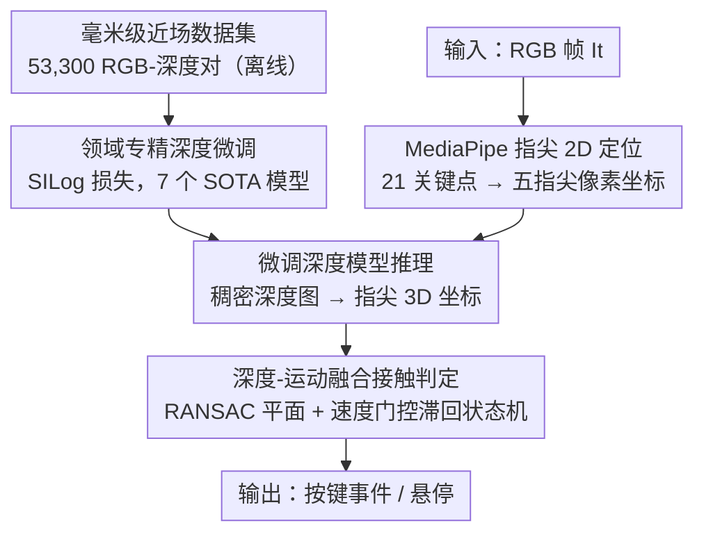

# Real-Time Multimodal Fingertip Contact Detection via Depth and Motion Fusion for Vision-Based Human-Computer Interaction

**会议**: CVPR 2026  
**论文**: [CVF Open Access](https://openaccess.thecvf.com/content/CVPR2026/html/Toshpulatov_Real-Time_Multimodal_Fingertip_Contact_Detection_via_Depth_and_Motion_Fusion_CVPR_2026_paper.html)  
**代码**: https://muxiddin19.github.io/Multimodal-Fingertip-Contact-Detection-via-Depth-and-Motion-Fusion  
**领域**: 人体理解 / 单目深度估计 / 人机交互  
**关键词**: 指尖接触检测, 单目深度估计, 领域微调, 深度-运动融合, VR文本输入

## 一句话总结
这篇论文不发明新网络，而是用一个专门采集的 53,300 对毫米级 RGB-深度数据集，把现成单目深度模型微调到近场指尖场景，再叠加"深度+运动"融合的速度门控状态机判定接触——只用一只普通 RGB 摄像头就把深度误差从 12.3 mm 砍到 3.84 mm（降 68%），接触检测 F1 达 94.4%，让用户在桌面上"盲打"达到 45.6 WPM、字符错误率 3.1%，逼近专用深度硬件与商用 VR 输入。

## 研究背景与动机

**领域现状**：在 VR/AR 里用手直接操作虚拟物体是大势所趋，而其中最关键的一环是**接触事件检测**——精确知道指尖"什么时候"碰到了真实或虚拟表面（虚拟键盘打字、虚拟钢琴、手术模拟等都靠它）。理想方案要么用商用动捕（Vicon、OptiTrack，亚毫米精度），要么用专用深度传感器。

**现有痛点**：通用单目深度模型（在 KITTI、NYU Depth V2 这类米级室内外场景上训练）的深度误差在 12–25 mm 量级，而要区分"指尖悬停在表面上方 5–10 mm"和"真正接触（≤3 mm）"，需要 <3 mm 的精度——通用模型差了整整一个数量级，导致大量误触与漏触；商用动捕虽精度够，但单套 1.5 万–5 万美元，把高精度手部追踪锁死在少数实验室里。

**核心矛盾**：精度与可及性（成本）之间存在硬性 trade-off——便宜的单 RGB 方案精度不够，够精度的方案太贵。而作者认为，现有深度模型在该任务上失败的根因**不是架构不行，而是缺少近场专用训练数据导致的领域鸿沟**（domain gap）。

**本文目标**：只用一只普通 RGB 摄像头 + 一张印在任意平面上的键盘布局，做到毫米级、实时、跨视角（桌面 webcam / 头显前置相机）的指尖接触检测。

**切入角度**：与其设计新网络，不如**采集目标域数据 + 谨慎微调**——把"缩小领域鸿沟"当成核心，把架构创新让位给数据与微调策略。再用运动线索弥补单帧深度的不稳定。

**核心 idea**：用专用近场数据集做领域微调把深度打到毫米级，再用"深度阈值 + 速度门控滞回状态机"融合判定接触，在普通 RGB 上逼近专用硬件。

## 方法详解

### 整体框架
系统是一条**实时三模块串行管线**：① MediaPipe 在 RGB 帧上检测 21 个手部关键点，取五个指尖的 2D 像素坐标作为查询点；② 用在专用数据集上**领域微调过的单目深度模型**预测稠密深度图，在指尖 2D 位置索引出深度，结合相机内参重建指尖 3D 坐标；③ 对表面做 RANSAC 平面拟合得到参考平面，算指尖到平面的带符号垂直距离，再送入**速度门控+深度滞回的状态机**判定是否构成一次按键，过滤悬停假阳。背后支撑这一切的是离线采集的 53,300 对毫米级 RGB-深度数据集——它让步骤②的微调成为可能。

### 关键设计

**1. 毫米级近场专用数据集：把领域鸿沟从根上补上**

方法成败的前提是数据，而不是网络。作者搭了多相机采集台：主传感器是 Intel RealSense D405 深度相机，以 45° 架在白桌面上方 35 cm 处提供真值深度，外加 30°/60° 两个 RGB 相机做多视角评测；所有相机先独立内参标定再联合外参恢复，从单个深度传感器就能为三个视角输出同步的 RGB-深度对。在白桌、木纹、半反光层压板三种表面、5000K/800lux 散射光下，招募 15 名手型与肤色（Fitzpatrick II–V）多样的被试做自然打字，60 FPS、640×480 同步采集。原始数据经时间戳同步、SDK 硬件对齐，再用三条质检规则剔除低质帧（手-桌 ROI 内有效深度 <80%、MediaPipe 未检全 21 关键点、拉普拉斯方差过低的运动模糊）。最终得到 53,300 对高质量样本，按被试 ID 分层 8:1:1 划分（防止个体手型/肤色特征跨划分泄漏，保证跨用户泛化评测的严谨）。一块平参考靶验证 D405 在 35 cm 的噪声底为 0.3±0.1 mm ⚠️（远低于最终 3.84 mm MAE，即真值不确定性可忽略）。

**2. 领域专精深度微调（SILog 损失）：让通用模型在近场变成精密仪器**

有了数据，就对 7 个 SOTA 深度模型（DepthAnythingV2、ZoeDepth、DepthAnything、DPT、MiDaS、NeWCRFs、AdaBins）系统微调。策略刻意保守，避免灾难性遗忘预训练特征：AdamW、低学习率 $1\times10^{-5}$ + 余弦退火，训练 200,000 步、batch 16，只做随机水平翻转和颜色抖动，**刻意不做旋转/缩放等几何增广**（它们会破坏接触检测所依赖的精确空间关系）。损失上不用对所有距离一视同仁的 L1/L2，而用**尺度不变对数损失（SILog）**——它惩罚相对深度误差，这对在近场区分"接触（3 mm）vs 悬停（8 mm）"至关重要；在专用数据上训练时，SILog 会隐式把梯度集中到 0–15 mm 这个指尖-表面关键区。结果上，DepthAnythingV2-ft 的 MAE 从预训练 12.3 mm 降到 3.8 mm，δ1 从 87.2% 升到 95.96%。

**3. 深度-运动融合接触判定（RANSAC 平面 + 速度门控滞回状态机）：用时序运动压住单帧抖动**

即便深度变准，单凭"距离<阈值"判接触仍然脆弱——运动模糊和模型微小误差会让快速划过接触区的手指被误判成按键。作者先用 RANSAC 在图像下 40%（桌面稳定出现处）拟合鲁棒平面 $ax+by+cz+d=0$，对每个指尖用其 2D 坐标、深度值与相机内参重建 3D 点 $P_i$，算到平面的带符号垂直距离。接触判定不是单阈值，而是一个**速度门控 + 深度滞回的状态机**：用非对称进/出阈值——距离低于 $\tau_{\text{contact}}=4.5$ mm 才触发接触、高于 $\tau_{\text{exit}}=6.0$ mm 才释放（滞回抑制边界处的快速抖动）；同时**速度门**要求指尖呈现真实的下压模式——下降时垂直速度峰值需超过 $\tau_{\text{velocity}}=15.0$ px/s，触底瞬间又要减速到 6.0 px/s 以下，从而滤掉那些满足深度条件、却没有"刻意敲击"运动学签名的瞬态悬停。所有阈值与速度参数（最小接近 8.0、峰值 15.0、停止 6.0 px/s）由验证集上对 25 组候选做网格搜索、以最大化 F1 得到，且在最优点 ±1 mm 内 F1 仍 >92%，鲁棒性好。

### 损失函数 / 训练策略
深度微调用尺度不变对数损失 SILog（惩罚相对误差，集中梯度于 0–15 mm 近场区），优化器 AdamW、学习率 $1\times10^{-5}$ + 余弦退火、200,000 步、batch 16，仅用光度增广不用几何增广。评测指标含 MAE、AbsRel/SqRel、RMSE、δ1/δ2/δ3、SILog，其中 MAE 与 δ1 对本任务最关键（δ1 = 预测落在真值 ±25% 内的像素比例）。

## 实验关键数据

### 主实验
硬件：i7-10700K + RTX 3090 + RAMA-WC100 webcam；D405（7–50 cm 优化）采真值，D415（0.3–10 m）当消费级深度基线。下表为各深度模型微调前后对比（Pre/Fine）：

| 模型 | MAE(mm) Pre/Fine | RMSE(mm) Pre/Fine | FPS | 接触检测准确率 |
|------|------|------|------|------|
| **DepthAnythingV2-ft** | **12.3 / 3.8** | 18.4 / 4.8 | 14.8 | **94.2%** |
| NeWCRFs-ft | 13.9 / 3.9 | 19.7 / 5.8 | 16.9 | 92.3% |
| ZoeDepth-ft | 14.2 / 4.1 | 20.1 / 6.2 | 18.1 | 91.8% |
| MiDaS-ft | 12.9 / 4.9 | 18.7 / 5.1 | 15.9 | 91.3% |
| RealSense D415（硬件基线） | 2.0 (规格) | — | 30.0 | 96.1% |
| MediaPipe only（无深度） | — | — | 60.0 | 68.4% |

最佳模型 DepthAnythingV2-ft 把 MAE 压到 3.84 mm（降 68%），δ1 升到 95.96%——纯靠数据+微调就接近了需专用硬件的 D415（96.1%），而 MediaPipe 无深度基线只有 68.4%。

### 消融实验（接触检测算法）

| 配置 | Precision | Recall | F1 | 假阳率 |
|------|------|------|------|------|
| Proximity-only | 72.3% | 68.5% | 70.3% | 27.7% |
| Depth threshold | 81.4% | 75.2% | 78.2% | 18.6% |
| w/o Depth | 88.2% | 84.6% | 86.4% | 11.8% |
| w/o Velocity | 90.1% | 87.3% | 88.7% | 9.9% |
| **Full system** | 94.8% | 94.1% | **94.4%** | 4.2% |

端到端打字性能上，Ours(848×480) 达 **45.6 WPM / 3.1% CER**，对比 MediaPipe-only(28.3 WPM/12.4% CER) 与 3D 手形基线(32.7 WPM/6.9% CER) 大幅领先；首次使用的新手用户也有 38.3 WPM / 5.3% CER。

### 关键发现
- **运动融合是主导因素**：去掉深度（w/o Depth）F1 从 94.4% 掉到 86.4%、去掉速度门（w/o Velocity）掉到 88.7%——作者指出移除运动融合时退化最大，时序稳定性是压制假阳的关键。
- **微调 > 架构创新**：无监督域适应（AdaBN/DANN/MMD）在 NYU 上只能到 8.7–9.2 mm MAE，远不及监督微调的 3.8 mm，印证"极端精度场景下，目标域有标注微调才是正解"。
- **手指间存在精度梯度**：从食指（96.2% P / 95.1% R）到小指（88.4% / 86.2%）单调下降，且环指+小指贡献 62% 的错字却只占 28% 击键——符合人手运动学直觉。
- **跨视角可迁移**：30° 头戴自我中心视角下仍有 91.3% F1、MAE 4.21 mm ⚠️（来自补充材料），桌面与头显两种部署共用同一管线、无需改算法。

## 亮点与洞察
- **"数据胜架构"的干净证据**：在毫米级近场这个极端精度场景，论文用控制变量的方式（同样网络、只换训练数据）证明领域微调能把通用模型变精密仪器，比无监督域适应高一大截，结论很有说服力。
- **速度门控滞回状态机**：把"接触"从单帧深度阈值升级为带运动学签名的事件检测（非对称进出阈值 + 速度峰/停约束），这套思路可直接迁到任何"hover vs touch"或"接近 vs 触发"的交互判定。
- **SILog 用得巧**：在近场用相对误差损失而非绝对误差，把梯度自然集中到 0–15 mm 关键区，是个值得复用的细节——绝对误差损失会被远处大数值主导。
- **可及性价值**：把任意平面+普通摄像头变成输入设备，对无菌临床、工厂、移动办公等"插不上常规外设"的场景有现实意义。

## 局限与展望
- **接触真值是几何代理，非物理压力**：用 D405 深度 ≤3 mm 标接触、>5 mm 标悬停，3–5 mm 模糊区直接排除；作者也承认软组织形变让几何接近不完全等于物理接触，压力传感器验证留作未来工作。
- **依赖一次性尺度标定**：相机到表面距离要用户测量来把相对深度转米制（$\alpha=d_{GT}/d_{pred}$），换部署位置需重标。
- **角度/距离有适用窗口**：外置相机需 25–45 cm、30–60° 安装才稳；超出训练范围精度未验证。
- **场景较受限**：基本围绕"平面打字"任务，复杂三维交互（抓取、多指协同手势）未覆盖；环/小指精度偏低也会拖累全键盘体验。

## 相关工作与启发
- **vs Wilson / MRTouch / EgoTouch / TouchInsight（触摸检测）**：这些方法要么需专用深度传感器、要么空间分辨率不足以做精确击键；本文只用单 RGB + 领域微调 + 速度滤波，同时支持桌面与头显视角且不改架构。
- **vs AdaBN / DANN / MMD（无监督域适应）**：它们为中等域差设计、无毫米级保证，实测都卡在 8.7–9.2 mm；本文构建目标域数据做监督微调，降到 3.8 mm，说明极端精度下"对齐特征分布"补不上几何与尺度的鸿沟。
- **启发**：当任务对精度的要求远超通用 benchmark 时，与其换更大更新的网络，不如先问"训练数据的域对不对"——一个针对性的中等规模数据集 + 谨慎微调，往往比架构创新更划算。

## 评分
- 新颖性: ⭐⭐⭐ 没有新网络，核心是数据集+微调+融合工程，新颖性在系统与数据而非方法本身。
- 实验充分度: ⭐⭐⭐⭐⭐ 7 模型对比、算法消融、域适应/商用系统对比、跨视角/跨表面泛化、端到端打字 WPM/CER 全覆盖，非常扎实。
- 写作质量: ⭐⭐⭐⭐ 动机与管线清晰、阈值给得具体；部分关键数据（头显视角、SILog 公式）压在补充材料里，正文略需脑补。
- 价值: ⭐⭐⭐⭐ 把高精度指尖接触检测从专用硬件下放到普通 RGB 摄像头，数据集与代码开源，实用与可复现价值高。

<!-- RELATED:START -->

## 相关论文

- [\[CVPR 2026\] IMU-HOI: A Symbiotic Framework for Coherent Human-Object Interaction and Motion Capture via Contact-Conscious Inertial Fusion](imu-hoi_a_symbiotic_framework_for_coherent_human-object_interaction_and_motion_c.md)
- [\[CVPR 2026\] ReMoGen: Real-time Human Interaction-to-Reaction Generation via Modular Learning from Diverse Data](remogen_real-time_human_interaction-to-reaction_generation_via_modular_learning_.md)
- [\[CVPR 2026\] MimicTalker: A Multimodal Interactive and Memory-Enhanced Framework for Real-Time Dyadic 3D Head Generation](mimictalker_a_multimodal_interactive_and_memory-enhanced_framework_for_real-time.md)
- [\[CVPR 2026\] Unleashing Vision-Language Semantics for Deepfake Video Detection](unleashing_vision-language_semantics_for_deepfake_video_detection.md)
- [\[CVPR 2026\] RegFormer: Transferable Relational Grounding for Efficient Weakly-Supervised Human-Object Interaction Detection](regformer_transferable_relational_grounding_for_efficient_weakly-supervised_huma.md)

<!-- RELATED:END -->
