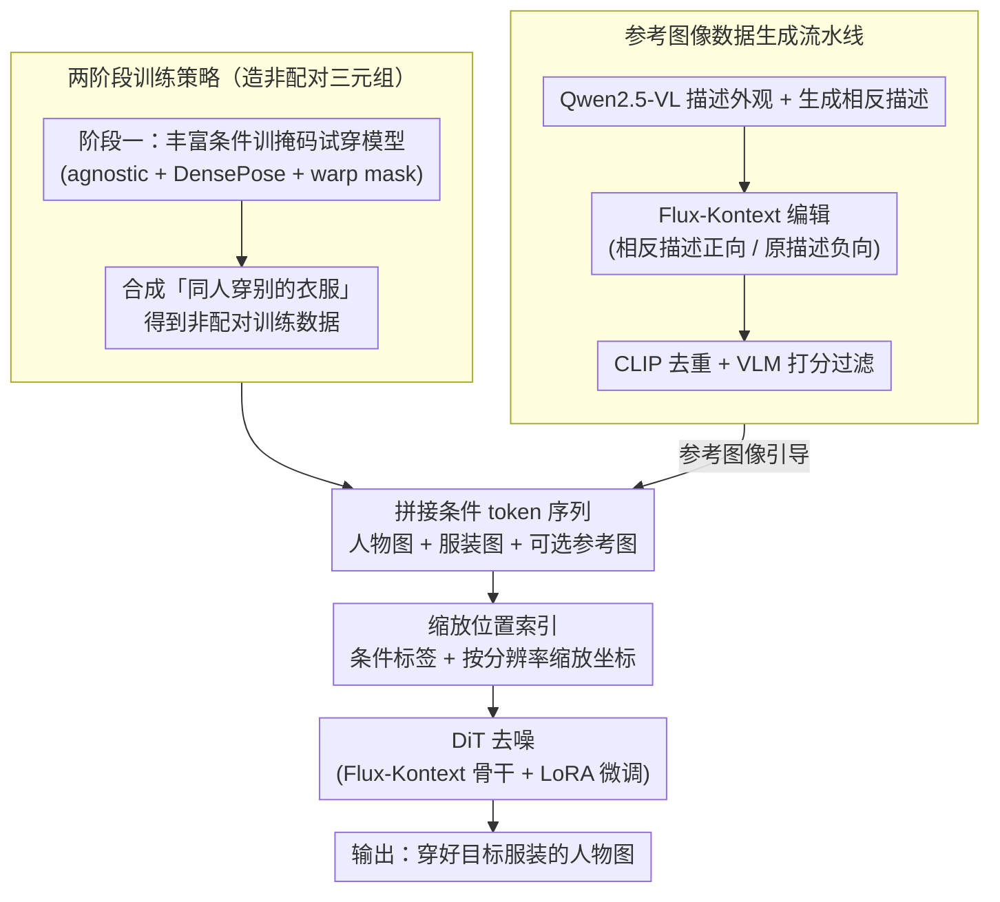

# RefTon: Reference Person Shot Assist Virtual Try-on

**会议**: CVPR 2026  
**arXiv**: [2511.00956](https://arxiv.org/abs/2511.00956)  
**代码**: [https://github.com/360CVGroup/RefTon](https://github.com/360CVGroup/RefTon)  
**领域**: 人体理解  
**关键词**: 虚拟试穿, 参考图像引导, Flux-Kontext, 无遮罩试穿, 扩散模型

## 一句话总结
本文提出 RefTon，一个基于 Flux-Kontext 的人对人虚拟试穿框架，通过引入额外参考图像（其他人穿着目标服装的照片）来提供更准确的服装细节信息，同时通过两阶段训练策略和缩放位置索引机制实现了无需辅助条件（如 DensePose、分割掩码）的端到端试穿，在 VITON-HD 和 DressCode 上达到 SOTA。

## 研究背景与动机
1. **领域现状**：虚拟试穿（ViTON）已从 GAN 方法发展到基于扩散模型的方法，后者在服装变形和纹理保真度上有显著进步。
2. **现有痛点**：(a) 大量方法依赖复杂外部模型——姿态估计器、人体解析、分割模型等来处理不同条件输入，增加了框架复杂度且掩码质量直接影响最终结果。(b) 更关键的是，仅从"衣服平铺图"无法完整感知服装的样式、纹理和设计细节——比如无法判断一件衣服是绿色透明面料还是浅绿色不透明面料，无法识别蕾丝领口设计。
3. **核心矛盾**：在真实购物场景中，用户更关注模特穿着效果而非平铺衣物图。但现有方法不支持"参考模特图"作为额外输入，因为公开数据集中缺乏这类配对数据。
4. **本文目标** (a) 去除对外部模型和辅助条件的依赖 (b) 引入参考图像来更准确地传达服装的穿着效果 (c) 构建包含参考图像的训练数据。
5. **切入角度**：利用 Flux-Kontext 强大的图像编辑能力，自动合成不同人穿同一件衣服的参考图像，构建训练数据集。同时改进位置编码以支持多条件多分辨率输入。
6. **核心 idea**：通过参考图像（其他人穿着目标服装的照片）为虚拟试穿提供更直观的视觉指导，配合无掩码两阶段训练和缩放位置索引，实现简洁高效的端到端试穿。

## 方法详解

### 整体框架
RefTon 要解决的是「人对人虚拟试穿」：给一张源人物图和一件目标服装，让源人物穿上这件衣服，而且额外允许塞一张「别人穿着这件衣服」的参考图来补全服装细节。整条 pipeline 建在 Flux-Kontext 骨干上——源人物图（或其遮罩版）、目标服装图、可选参考图都先经 VAE 编码成潜变量，再沿序列维拼成一条 token 序列，丢进 DiT（Diffusion Transformer）去噪还原出穿好衣服的目标图。难点不在去噪本身，而在两件事：训练人对人模型需要的「非配对三元组」数据现实中根本不存在，以及多张异构条件图怎么在一个序列里被模型分清楚。RefTon 用两阶段训练造数据、用缩放位置索引区分条件、再用一条数据流水线把参考图也造出来，逐一拆掉这些障碍。

### 关键设计

**1. 两阶段训练策略：把不存在的非配对数据造出来**

人对人试穿要的训练样本是非配对三元组 $[\bar{\mathbf{p}}_{i,\mathbf{c}_j}, \mathbf{c}_i, \mathbf{p}_{i,\mathbf{c}_i}]$——一个穿着别的衣服 $\mathbf{c}_j$ 的人、目标衣服 $\mathbf{c}_i$、以及这个人穿上目标衣服后的结果。但公开数据集只给得起配对样本 $[\mathbf{c}_i, \mathbf{p}_{i,\mathbf{c}_i}]$（一件衣服 + 一个穿它的人），缺的恰恰是「同一个人换上别的衣服」那一张。RefTon 的办法是先借配对数据训出一个能力较弱但够用的掩码模型，再用它去补造缺失的那一张：阶段一用 agnostic 图、DensePose、warp mask 等一整套丰富条件训练掩码试穿模型，然后让它给每个人合成「穿上各种别的衣服」的图像；阶段二拿这些合成图当非配对输入训练真正的人对人模型，并以 50% 概率在 agnostic 图和合成人物图之间随机切换输入，避免模型只认一种来源。思路和 CatVTON 同源，但阶段一刻意堆更丰富的条件，就是为了让合成出来的非配对数据质量足够高——因为阶段二的上限直接被这批数据的质量卡住。

**2. 缩放位置索引（Rescaled Position Index）：让一条序列里多张异构条件图各归各位**

把 person、garment、reference 多张图拼进同一条 token 序列后，模型得知道每个 token 来自哪张图、又落在那张图的哪个位置，否则就会串味。原版 Flux-Kontext 的位置索引只有三通道，第一通道是个二值标记（区分噪声 vs 条件图），后两通道编码空间坐标——二值显然不够用，分不清三种以上的异构条件。RefTon 把第一通道从二值升级成离散条件标签，直接给每类输入挂上不同的 ID；同时对每个条件独立生成它自己的位置索引，并把空间坐标按「目标图分辨率 / 条件图分辨率」的比例缩放，使不同尺寸的条件图都能和目标图的坐标系对齐。这种「各算各的索引再拼」比 Any2AnyTryon 那种「在像素空间拼成一张大画布」更灵活，条件图的数量和分辨率都不再受画布尺寸约束。消融里把缩放位置索引和原版对比，FID 和 KID 都更低（如 VITON-HD FID 5.29 → 5.09 ⚠️ 以原文为准）。

**3. 参考图像引导机制：把平铺图传不出来的穿着效果补回来**

一张平铺的衣服图说不清很多事——这块料子是绿色透明还是浅绿不透明、领口那圈到底是不是蕾丝、衣服上身后怎么垂坠。这些恰恰是用户网购时最在意、也最影响生成保真度的细节。RefTon 在训练时以 25% 的概率额外喂一张参考图 $\mathbf{r}_i$（别人穿着这件目标服装的照片），通过上面那套独立位置索引和 person/garment 图一起进模型；推理时这张参考图是可选的，有就用、没有也能跑。效果是实打实的：加上参考图后所有指标一起改善，VITON-HD 的 paired FID 从 5.45 降到 4.69。

**4. 参考图像数据生成流水线：参考图本身也得先被造出来**

参考图这个想法好，但公开数据里同样没有「不同人穿同一件衣服」的配对，所以得自己合成。RefTon 先用 Qwen2.5-VL 描述目标图里人物的外观，再让它生成一段「相反描述」（换肤色、换发型等），然后调 Flux-Kontext 编辑目标图——把相反描述当正向 prompt、原始描述当负向 prompt，逼出一张「服装没变、但人换了个样」的参考图，期间非目标服装和动作也从描述库里随机采样以增加多样性。整条流水线靠三条约束保证质量：参考图必须忠实保留目标服装、人物外观要和目标明显不同（否则模型会学到「直接照抄参考图里的人」这种捷径）、非目标服装也要各不相同；造完再用 CLIP 特征去重、VLM 质量打分过滤，把劣质样本筛掉。

### 损失函数 / 训练策略
使用标准 flow matching 损失训练。冻结 Flux-Kontext 的编码器和解码器，仅用 LoRA（rank=64, $\alpha=128$）微调 Transformer blocks。单数据集实验：VITON-HD 20k steps / DressCode 48k steps，batch=128，8×H100 GPU。混合数据集（VFR）训练用于增强泛化。

## 实验关键数据

### 主实验（VITON-HD + DressCode）

| 方法 | 输入条件 | VITON-HD LPIPS↓ | SSIM↑ | FID↓(paired) | FID↓(unpaired) |
|------|---------|----------------|-------|-------------|---------------|
| CatVTON | Mask | 0.057 | 0.870 | 5.43 | 9.02 |
| IDM-VTON | Mask+Pose | 0.102 | 0.870 | 6.29 | - |
| **RefTon** | **Mask** | **0.057** | 0.873 | 5.45 | 8.58 |
| **RefTon+R** | **Mask+Ref** | **0.049** | **0.879** | **4.69** | **8.43** |
| RefTon/MF | 无掩码 | 0.061 | 0.866 | 5.98 | 8.40 |
| RefTon+R/MF | 无掩码+Ref | 0.053 | 0.872 | 5.11 | **8.32** |

### 消融实验

| 设置 | VITON-HD FID↓ | DressCode FID↓ | 说明 |
|------|-------------|---------------|------|
| 有掩码，无参考 | 5.45 | 3.48 | 基准 |
| 有掩码，有参考 | **4.69** | **2.94** | 参考图显著提升 |
| 无掩码，无参考 | 5.98 | 3.84 | 去掉掩码轻微下降 |
| 无掩码，有参考 | 5.11 | 3.34 | 参考图弥补了掩码缺失 |
| 原版位置索引 (0.5×) | 5.29 | - | 无缩放 |
| 缩放位置索引 (0.5×) | **5.09** | - | 缩放后改善 |

### 关键发现
- **参考图像一致性提升所有指标**：在有掩码设置下，加入参考图像使 VITON-HD paired FID 从 5.45 降至 4.69（↓14%），LPIPS 从 0.057 降至 0.049（↓14%）。DressCode 上 FID 从 3.48 降至 2.94（↓15%）。
- **无掩码模式依然强劲**：即使完全去除 agnostic 掩码，性能仍与需要掩码的基线方法持平或更优（FID 8.40 vs CatVTON 9.02），展示了实际部署的便利性。
- **跨数据集泛化**：在混合 VFR 数据集上训练后，未单独在 VITON-HD/DressCode 上训练也能超越 OOTDiffusion 等基线。
- **StreetTryOn 跨域评估**：在从未训练过的 StreetTryOn 数据集上也取得了 SOTA 的 FID，证明了强泛化能力。
- **掩码质量问题**：消融可视化表明过度裁剪的掩码会丢失人物携带的物品（如手提包），保守掩码会保留不需要的区域。无掩码模式避免了这些问题。

## 亮点与洞察
- **从人类购物行为出发的参考图像设计**：真实用户在网购时确实更关注模特穿着效果而非平铺图片。参考图像捕获了平铺图无法展示的信息——透明材质、蕾丝细节、面料垂坠效果。这个设计直觉精准。
- **参考数据生成流水线**的设计很巧妙——利用 VLM 自动生成外观描述及其反面，配合 Flux-Kontext 进行编辑，在保持目标服装不变的同时改变人物外观和其他服装。三个约束（服装保真、人物不同、服装多样）有效防止了训练时的捷径学习。
- **统一框架处理多种输入模式**：一个模型同时支持有掩码/无掩码 × 有参考/无参考的四种组合，通过条件标签和概率采样优雅实现。

## 局限与展望
- 参考图像生成依赖 Flux-Kontext 的编辑质量，若编辑模型在某些服装类型上表现不佳，参考图像质量会下降。
- 仅评估了静态图片试穿，未扩展到视频试穿场景。
- LoRA 微调的表达能力可能有限，全参数微调（或更大 rank）是否能进一步提升有待探索。
- 参考图像在训练时仅以 25% 概率出现，是否存在更优的采样策略未充分研究。
- 未考虑多视角参考图像的融合。

## 相关工作与启发
- **vs CatVTON**: 同样使用两阶段训练和无掩码设计，但 CatVTON 缺少参考图像机制。RefTon 在此基础上引入参考图像显著提升了细节保真度。
- **vs TryOffDiff/ViTON-GUN**: 采用"先脱再穿"策略，引入误差累积且丢失服装细节。RefTon 直接利用参考图像避免了脱衣阶段。
- **vs Any2AnyTryon**: 也支持人对人试穿，但在拼接画布上生成位置索引。RefTon 对每个条件独立生成索引，更灵活地支持多分辨率输入。
- **vs OmniVTON**: 需要额外姿态和文本条件，RefTon 更简洁。

## 评分
- 新颖性: ⭐⭐⭐⭐ 参考图像引导的虚拟试穿思路新颖且实用，数据生成流水线设计巧妙
- 实验充分度: ⭐⭐⭐⭐⭐ 多数据集、多设置（掩码/无掩码×参考/无参考）、跨域评估、消融充分
- 写作质量: ⭐⭐⭐⭐ 动机清晰，方法描述详细，图表丰富
- 价值: ⭐⭐⭐⭐ 解决了虚拟试穿中服装细节信息不足的实际问题，有直接应用价值

<!-- RELATED:START -->

## 相关论文

- [\[CVPR 2026\] Mobile-VTON: High-Fidelity On-Device Virtual Try-On](mobile_vton_ondevice_virtual_tryon.md)
- [\[CVPR 2026\] Reference-Free Image Quality Assessment for Virtual Try-On via Human Feedback](reference-free_image_quality_assessment_for_virtual_try-on_via_human_feedback.md)
- [\[ECCV 2024\] Wear-Any-Way: Manipulable Virtual Try-on via Sparse Correspondence Alignment](../../ECCV2024/human_understanding/wear-any-way_manipulable_virtual_try-on_via_sparse_correspondence_alignment.md)
- [\[CVPR 2025\] VTON 360: High-Fidelity Virtual Try-On from Any Viewing Direction](../../CVPR2025/human_understanding/vton_360_high-fidelity_virtual_try-on_from_any_viewing_direction.md)
- [\[CVPR 2026\] HandDreamer: Zero-Shot Text to 3D Hand Model Generation](handdreamer_zero_shot_text_to_3d_hand_model_generation.md)

<!-- RELATED:END -->
