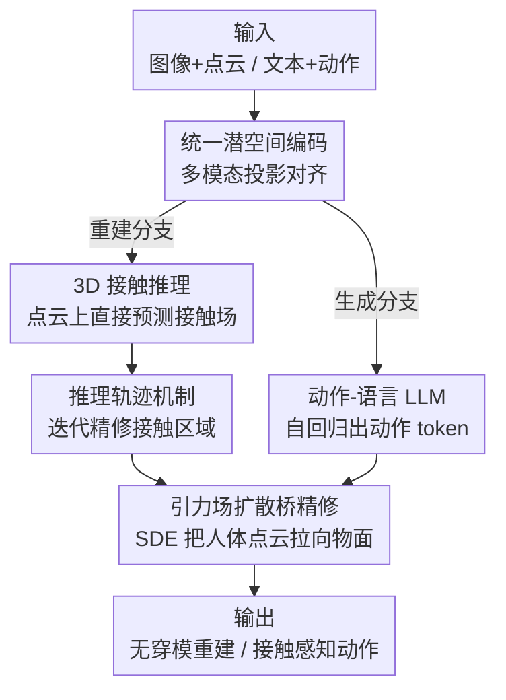

# ReGenHOI: Unifying Reconstruction and Generation for 3D Human-Object Interaction Understanding

**会议**: CVPR 2026  
**论文**: [CVF Open Access](https://openaccess.thecvf.com/content/CVPR2026/html/Xu_ReGenHOI_Unifying_Reconstruction_and_Generation_for_3D_Human-Object_Interaction_Understanding_CVPR_2026_paper.html)  
**代码**: https://github.com/xumiao66/ReGenHOI  
**领域**: 3D视觉 / 人体理解  
**关键词**: 人物-物体交互, 接触推理, 重建与生成统一, 扩散桥, 共享潜空间

## 一句话总结
ReGenHOI 把 3D 人物-物体交互（HOI）的"重建"（从图像还原观测到的接触）和"生成"（按语言指令想象未来交互）塞进同一个共享的语义-几何潜空间，靠"直接在 3D 点云上做接触推理 + 推理轨迹迭代精修 + 引力场扩散桥精修接触几何"三件套，在接触估计、重建精度和动作生成质量上同时刷过各自领域的 SOTA。

## 研究背景与动机
**领域现状**：理解 3D HOI 其实对应人类两种认知能力——感知（reconstruction，从图像还原身体和物体的空间关系）和想象（generation，按意图合成未来的交互动作）。但绝大多数方法把这两件事当成彼此独立的任务：重建方法（如 InteractVLM、DECO）专注还原观测到的几何，生成方法（如 OMOMO、SemGeoMo）专注从语言/视觉提示合成新的人-物配置。

**现有痛点**：割裂带来两边各自的硬伤。重建模型缺语义推理、泛化不出训练分布；生成模型又难以保证几何和物理一致性，常出现穿模、接触不贴合。更细的一层痛点是：现有接触估计大多在 2D 上预测、再 lift 到 3D，深度歧义会污染接触定位；而身体侧和物体侧的接触标注往往各标各的、不强制对齐，缺乏细粒度的双射接触对应。

**核心矛盾**：重建和生成本质共享同一套空间智能——维持几何一致、保证语义连贯、对 3D 空间关系做推理。把它们拆开训练，等于让两个本该互补的能力各自瞎子摸象：重建拿不到生成先验提供的语义/物理合理性，生成拿不到真实观测提供的几何 grounding。

**本文目标**：建一个统一框架，学一个横跨重建与生成的共享语义-几何表示，让两个任务在同一个推理空间里互相托底——重建受益于生成先验的合理性，生成被真实观测几何约束。

**切入角度**：作者认为"接触区域"是连接两个任务的关键枢纽。无论是还原观测还是想象未来，模型都得先搞清楚人和物在哪儿接触、怎么接触。于是把"在人-物接触区域上做显式推理"作为构建共享潜表示的地基。

**核心 idea**：用一个共享潜空间统一编码图像/文本/点云，在 3D 上直接对接触做推理并迭代精修，再用引力场扩散桥把粗接触几何细化成物理可信、无穿模的最终结果——重建分支和生成分支共用这套表示。

## 方法详解

### 整体框架
ReGenHOI 是一个 encoder–decoder 架构：编码器把多模态输入 $X$（重建走图像+点云，生成走文本+动作）映射成统一潜表示 $z = \text{Encoder}(X;\theta_{enc})$，解码器再据此产出重建的 3D 配置或生成的动作序列 $\hat{y} = \text{Decoder}(z\mid\theta_{dec})$。关键在于重建潜码 $z_{rec}$ 和生成潜码 $z_{gen}$ 被对齐进**同一个共享潜空间**，从而两个任务能共享知识、互相约束。

整条管线分三大块：**统一潜空间编码**把异构输入投影并对齐到共享潜空间；编码后接**双分支解码**——重建分支让 LLM 预测稠密接触概率场、经推理轨迹精修出接触区域并做粗对齐，生成分支让动作-语言 LLM 自回归预测动作 token 再解码成序列；最后**引力场扩散桥精修**把粗接触几何细化成物理可信的无穿模结果。其中 3D 接触推理和推理轨迹机制是构建共享表示的两大支柱。

### 关键设计

**1. 统一潜空间编码：让图像、文本、点云在同一个空间里说同一种话**

重建和生成的输入天差地别（一个是 RGB 图像、一个是语言指令），但它们要驱动的是同一套接触推理，所以必须先对齐到共享潜空间。重建侧：从图像 $I$ 抽视觉特征 $f_I$，用 SMPL-X 回归器拿到人体姿态/形状参数 $(\theta,\beta)$ 并经 SMPL-X 层生成人体网格 $H$；再按视觉/文本相似度从物体池检索类别匹配的物体网格 $O$ 并归一化到统一度量尺度；$H$、$O$ 经 PointNet++ 抽层级几何特征 $f_H$、$f_O$，最后线性投影相加成 $z_{rec} = W_H f_H + W_O f_O + W_I f_I$。同时一个轻量回归器预测身体/手/物体的边界框 $B=\{b_{body}, b_{hand}, b_{object}\}$ 作为空间先验。生成侧：文本特征 $f_T$ 加上 VQ-VAE 量化后的离散动作 token $c_{1:L}$ 组合成 $z_{gen} = W_T f_T + W_C \text{Embed}(c_{1:L})$。$z_{rec}$ 与 $z_{gen}$ 通过对比/跨模态对齐损失被拉进同一空间——这正是两个任务能互相托底的物理基础：消融里把潜空间拆开（w/o Gen、w/o Rec）两边都掉点。

**2. 3D 接触推理 + 推理轨迹机制：直接在 3D 上推接触，再迭代把它磨准**

针对"2D 预测再 lift 到 3D 带来深度歧义"这个痛点，作者让模型直接在 3D 点云上推理。重建解码时，以 $z_{rec}$、边界框先验 $B$、可选文本 $T$ 为条件，LLM 输出每个点的稠密接触概率场 $\Psi(x) = \text{MLP}(\text{LLM}(z_{rec}, B, [T]))$，概率超过阈值 $\tau$ 的点构成候选接触集 $C$。光有一遍前向还不够准，于是引入**推理轨迹机制（RTM）**：以边界框为锚，模型显式推断人、手、物三个区域之间的相对距离、重叠、接近方向等结构化空间关系，沿一条可解释的推理轨迹**迭代精修**候选区域，得到最终接触区域 $\hat{C}$，并优化物体的变换矩阵与尺度做粗对齐。消融显示去掉 RTM（改成单次前向）会让接触估计 F1 等全线明显下降（Table 1），并连带拖垮重建精度——迭代式推理对接触定位是刚需而非锦上添花。

**3. 引力场扩散桥精修：把"人被物体吸过去"建成一条物理可解释的 SDE 轨迹**

粗接触对齐后几何仍可能穿模或不贴合，作者改编引力场扩散桥（GBDB），把人-物交互看成"引力驱动"过程——人体点云在学到的势场下被逐步拉向物面，同时保住 SMPL-X 的解剖结构先验。精修被写成一条随机微分方程：

$$dH_t = -\alpha\nabla\varphi(H_t)\,dt - \lambda_1\nabla L_{\text{SMPL-X}}\,dt - \lambda_2\nabla L_{normal}\,dt + g(H_t)\,dW_t$$

其中 $\varphi(H_t)$ 是以物体 $O$ 为固定参考的势场，鼓励人体点移向物理合理的接触区且避免互相穿透；$L_{\text{SMPL-X}}$ 维持肢体比例、关节角度限制与表面平滑；$L_{normal}$ 让人面与物面的法向对齐、保证接触面朝向一致；扩散项 $g(H_t)dW_t$ 注入受控随机性帮助逃离局部最优。用 Euler–Maruyama 自适应步长求解直到收敛，就在初始粗配置和最终物理一致配置之间架起一座连续"精修桥"。消融里去掉 GBDB（w/o GBDB），交互体积 IV 和穿透距离 PD 都变大，证明它确实把接触几何拉向了物理可信。

### 损失函数 / 训练策略
框架基于预训练的 MotionGPT 与人体重建模块；先微调动作生成组件，随后将它和人体重建模块冻结再训后续部分。接触定位的统一目标 $L_{LLM} = \lambda_c L_{contact} + \lambda_s L_{semantic} + \lambda_r L_{reason}$：$L_{contact}$ 是逐点接触预测的二元交叉熵；$L_{semantic}$ 是几何特征与文本特征间的对比对齐损失（保证语义一致）；$L_{reason} = \|\Phi_{geo}-\Phi_{sem}\|_2^2 + \|\Phi_{sem}-\Phi_{cont}\|_2^2$ 约束几何→语义→接触三阶段的潜推理路径连续。扩散桥单独优化 $L_{bridge} = \lambda_p\|H_T - H^*\|_2^2 + \lambda_m L_{\text{SMPL-X}} + \lambda_n L_{normal}$。权重设为 $\lambda_c{=}1.0,\lambda_s{=}0.5,\lambda_r{=}0.1,\lambda_p{=}1.0,\lambda_m{=}\lambda_n{=}0.3$；LLM 用 AdamW 训 30 epoch，扩散桥单独训 50k 步，8×A100，生成端用 7B Vicuna 作 backbone。

## 实验关键数据

### 主实验

接触估计（DAMON 数据集，二元人体接触）：

| 方法 | F1 ↑ | Precision ↑ | Recall ↑ | Geodesic (cm) ↓ |
|------|------|-------------|----------|------------------|
| BSTRO | 46.0 | 51.0 | 53.0 | 38.06 |
| DECO | 55.0 | 65.0 | 57.0 | 21.32 |
| InteractVLM | 75.6 | 75.2 | 76.0 | 2.89 |
| **Ours** | **78.4** | **77.8** | **78.6** | **2.65** |

动作生成（FullBodyManipulation 数据集）：

| 方法 | HandJPE ↓ | MPJPE ↓ | F1 ↑ | FID ↓ | R-score ↑ | Div. ↑ |
|------|-----------|---------|------|-------|-----------|--------|
| OMOMO | 33.18 | 18.06 | 0.75 | 1.98 | 0.38 | 8.99 |
| CHOIS | 31.68 | 17.12 | 0.59 | 2.27 | 0.49 | 6.04 |
| SemGeoMo | 27.84 | 16.62 | 0.77 | 1.17 | 0.66 | 10.15 |
| **Ours** | **26.91** | **16.28** | **0.79** | **1.02** | **0.68** | **10.42** |

重建上接触估计相比 InteractVLM 提升约 2.8 F1、测地误差更低；生成上 contact F1 更高、FID 更低，接触更真实一致。

### 消融实验

PICO 数据集上的重建精度与消融（PA-CD 越低越好，IV/PD 越低越好）：

| 配置 | PA-CDh ↓ | PA-CDo ↓ | IV (cm³) ↓ | PD (mm) ↓ | 说明 |
|------|----------|----------|------------|-----------|------|
| InteractVLM | 6.38 | 13.91 | 2.78 | 3.15 | 之前 SOTA |
| Ours w/o GBDB | 6.41 | 12.84 | 1.20 | 2.45 | 去扩散桥，IV/PD 变大 |
| Ours w/o RTM | 6.05 | 12.47 | 1.06 | 2.30 | 去推理轨迹，接触变差 |
| Ours w/o Gen | 5.76 | 12.15 | 0.98 | 2.23 | 只重建、拆掉共享潜空间 |
| **Ours** | **5.42** | 12.68 | **0.87** | **2.08** | 完整模型 |

### 关键发现
- **共享潜空间是双赢而非折中**：单做重建（w/o Gen）或单做生成（w/o Rec）两边都掉点，说明重建/生成确实在共享表示里互相提供了语义先验和几何 grounding。⚠️ 注意 w/o Gen 在 PA-CDh 上反而略优于完整模型（5.76 vs 5.42 量级接近、个别列互有胜负），整体趋势是联合训练更好，但单列对比需谨慎。
- **RTM 对接触定位贡献最直接**：去掉迭代推理改单次前向，DAMON 上接触 F1 等全线下降并连累重建精度——证明结构化的迭代空间推理比一遍 LLM 前向靠谱得多。
- **GBDB 主攻物理合理性**：去掉它穿透距离 PD 和交互体积 IV 明显变大，说明它的价值集中在消穿模、贴合接触面，而非提升接触语义。
- **直接 3D 推理避开深度歧义**：相比 2D 预测+lift 的路线，点云上直接推接触在测地误差上优势明显。

## 亮点与洞察
- **用"接触区域"做枢纽统一两个任务**：把重建和生成都归结为"先搞清楚人和物在哪接触"，这个抽象很巧——接触既是观测里能测到的，又是想象未来时必须满足的约束，天然连接感知与想象。
- **把接触精修建模成引力 SDE**：不是简单几何 ICP 拟合，而是引力势场 + 解剖约束 + 法向对齐 + 受控噪声的随机微分方程，使精修走一条物理可解释、能逃局部最优的轨迹，这个视角可迁移到任何"点云贴面/避穿模"的任务（如手部抓取、衣物贴合）。
- **推理轨迹机制带来可解释性**：以边界框为锚显式推断相对距离/重叠/接近方向，让接触预测不是黑箱，而是能看到中间推理步骤——对需要可解释 HOI 的下游（机器人、动画）很有价值。

## 局限性 / 可改进方向
- **依赖外部模块拼接**：人体网格靠 off-the-shelf 重建模型、物体靠从 ShapeNet 检索类别匹配网格，检索失败或形状偏差会直接污染下游接触推理；in-the-wild 罕见物体仍受物体池覆盖限制。
- **生成 backbone 偏重**：动作生成用 7B Vicuna、8×A100 训练，推理成本不低，实时/端侧部署存疑。
- **文本标注依赖增强**：BEHAVE 原始文本只有粗动作标签，作者自己补了 phase-specific 标注才喂得动语义对齐——说明方法对细粒度语义监督有一定依赖，迁移到无细标注场景时效果未知。⚠️ 论文未给出在原始粗标注下的对照。
- **物体侧仍是刚体假设**：扩散桥把物体当固定参考、只变形人体点云，对可形变物体（衣物、软体）的交互建模留白。

## 相关工作与启发
- **vs InteractVLM / DECO（接触估计）**：它们多在 2D 上预测接触再 lift，且身体/物体接触各标各的不对齐；本文直接在 3D 点云推理、并把 DECO 身体接触标签经几何推理投影到物面得到细粒度双射接触对，泛化到 80 个物体类（接触）/32 类（affordance），远超 affordance 方法常见的 21 类。
- **vs SemGeoMo / OMOMO / CHOIS（动作生成）**：它们是纯生成模型，缺真实观测的几何 grounding；本文让生成分支共享重建潜空间，被真实接触几何约束，在 FullBodyManipulation/BEHAVE 上 contact F1 更高、FID 更低。
- **vs 引力场扩散桥原作（GBDB，手-物交互）**：本文把原本用于 hand-object 的扩散桥改编适配到全身 HOI 的接触几何精修，并接进统一框架的双分支输出端。

## 评分
- 新颖性: ⭐⭐⭐⭐ 用共享潜空间+接触枢纽统一重建与生成，3D 直接推理+引力 SDE 精修的组合有新意，但各组件多为改编已有模块。
- 实验充分度: ⭐⭐⭐⭐ 覆盖 DAMON/PICO/FullBodyManipulation/BEHAVE 四个 benchmark、重建与生成双侧对比 + 三组消融，较完整。
- 写作质量: ⭐⭐⭐⭐ 动机-方法-实验脉络清晰，公式齐全；个别符号（编码图里的乱码标注）排版欠佳。
- 价值: ⭐⭐⭐⭐ 把割裂的重建/生成统一进一个可解释框架，对 HOI 理解与下游机器人/动画有实用价值。

<!-- RELATED:START -->

## 相关论文

- [\[CVPR 2026\] Superman: Unifying Skeleton and Vision for Human Motion Perception and Generation](superman_unifying_skeleton_and_vision_for_human_motion_perception_and_generation.md)
- [\[CVPR 2026\] Decoupled Generative Modeling for Human-Object Interaction Synthesis](decoupled_generative_modeling_for_human-object_interaction_synthesis.md)
- [\[CVPR 2026\] GenHOI: Towards Object-Consistent Hand-Object Interaction with Temporally Balanced and Spatially Selective Object Injection](genhoi_towards_object-consistent_hand-object_interaction_with_temporally_balance.md)
- [\[CVPR 2026\] RegFormer: Transferable Relational Grounding for Efficient Weakly-Supervised Human-Object Interaction Detection](regformer_transferable_relational_grounding_for_efficient_weakly-supervised_huma.md)
- [\[CVPR 2026\] Stability-Driven Motion Generation for Object-Guided Human-Human Co-Manipulation](stability-driven_motion_generation_for_object-guided_human-human_co-manipulation.md)

<!-- RELATED:END -->
