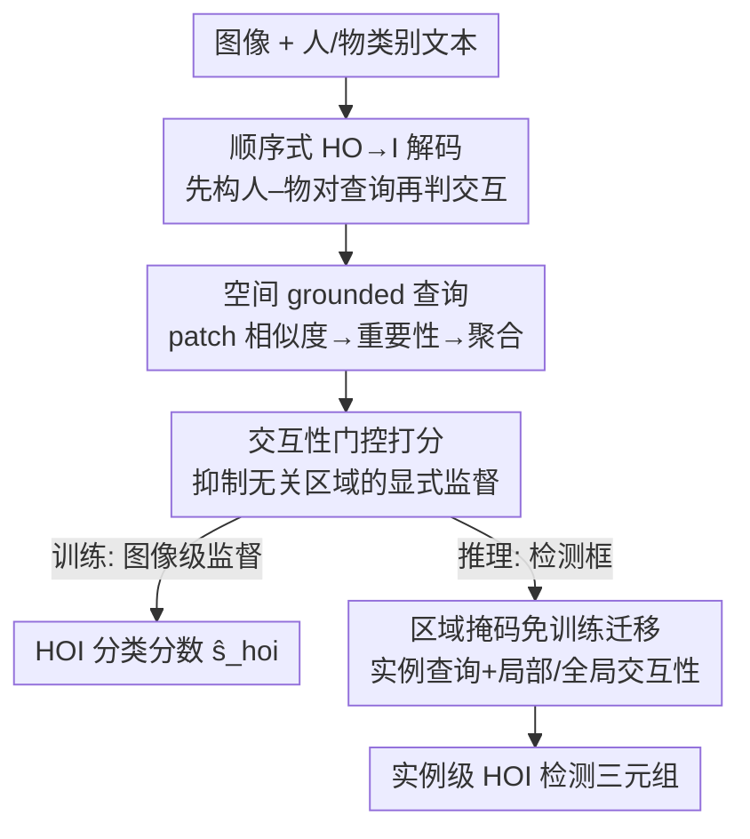

# RegFormer: Transferable Relational Grounding for Efficient Weakly-Supervised Human-Object Interaction Detection

**会议**: CVPR 2026  
**论文**: [CVF Open Access](https://openaccess.thecvf.com/content/CVPR2026/html/Park_RegFormer_Transferable_Relational_Grounding_for_Efficient_Weakly-Supervised_Human-Object_Interaction_Detection_CVPR_2026_paper.html)  
**代码**: https://github.com/mlvlab/RegFormer  
**领域**: 人体理解 / 弱监督 / HOI 检测  
**关键词**: 人物交互检测, 弱监督, 空间 grounding, 交互性打分, 免训练迁移

## 一句话总结
RegFormer 是一个轻量的交互识别模块：只用图像级标签训练时，它把人–物对查询构造成"空间 grounded"表示并引入交互性打分作为门控；推理做实例级 HOI 检测时，只需用检测框给查询和打分加一层区域掩码，**无需额外训练**即可从图像级迁移到实例级，比此前弱监督方法大幅领先、并逼近全监督，同时推理速度快 ~128×。

## 研究背景与动机
**领域现状**：人物交互（HOI）检测要在图像里定位人和物、并判断它们的交互，输出 ⟨human, interaction, object⟩ 三元组。全监督需要给每个人–物对标注框和交互类，标注成本随数据规模爆炸。弱监督只用图像级标签（图里出现了哪些 HOI 三元组类），不标人/物位置，因此可扩展。

**现有痛点**：弱监督没有定位信号，主流做法只能先用现成检测器枚举所有人–物候选对，再交给一个交互分类模块逐对推理。这条路线有两个硬伤：(1) 候选对数量是 $\tilde N_h \times \tilde N_o$，传统做法对每一对都裁剪 union 区域、各跑一次前向，计算量巨大，场景越密越慢；(2) union 区域常包含无关实例，导致对特定人–物对的分类被误导，产生大量假正例。后来有人用 RoI-Align 从骨干特征图一次性取 union 特征（单次前向），但 union 区域仍混入无关区域、泛化差；也有人直接用检测器的实例特征，但这样分类器和检测器**强耦合**，换检测器就得重训。

**核心矛盾**：弱监督下既要"高效处理海量候选对"，又要"判别性地把非交互对滤掉"，而图像级标签里**根本没有定位信息**——模型无从知道哪块区域对应哪个人/物。

**本文目标**：做一个轻量、通用的交互分类模块，能在单一框架里统一图像级（HOI 分类）和实例级（HOI 检测）推理，并能不重训就迁移过去。

**切入角度**：作者观察到，只要让查询自己"隐式地"学到人和物的空间线索，图像级学到的推理能力就能直接搬到实例级——关键是把空间信息**注入查询构造和一个可监督的交互性信号**里，而不是依赖外部检测框去训练。

**核心 idea**：用"空间 grounded 的人–物查询 + 交互性门控"代替"枚举 union 区域裁剪"，让模型在图像级监督下学会聚焦交互区域；推理时只用检测框给查询/打分加区域掩码即可免训练迁移。

## 方法详解

### 整体框架
RegFormer 基于 ML-Decoder（一种用类别文本嵌入做 query 的多标签分类器）改造，把"一次性枚举所有 HOI 三元组 query"改成**顺序式 HO→I**：先在 **pairwise instance encoder** 里为每个"人类别–物类别"对构造查询 $q^{ho}_k$，再送进 **interaction decoder** 预测这一对的交互类别分数 $\hat s^a_k$。与此并行，模型为每个人–物对算一个**交互性分数** $r^{ho}_k$，作为门控乘到交互分数上、并接受图像级 HOI 标签的显式监督。训练全程视觉/文本编码器（CLIP、DINOv2）冻结。

推理做实例级检测时，只引入一处改动：给定检测器输出的人/物实例框，用**区域掩码** $m(p)$ 把查询构造和交互性打分都约束到各自实例区域内，于是图像级模块直接变成实例级检测器，**不需要任何额外训练**。

### 关键设计

**1. 顺序式 HO→I 解码：把"枚举三元组"换成"先配对再判交互"**

传统 ML-Decoder 用全部 HOI 类别（如"human ride bicycle"）的文本嵌入当 query，一次性预测，候选对一多就吃不消。RegFormer 改成两步顺序结构：先按"人类别–物类别"对（HO）分组生成查询，再在解码器里只为每个 HO 对预测它的交互类别（I），即 $HO \to I$。这样查询数从"人数×物数×交互数"降到"人数×物数"，能在不显著增加开销的前提下处理大量实例对——这是后面"单次前向、128× 提速"的结构基础。

**2. 空间 grounded 查询：让查询自己学到人和物在哪里**

弱监督最大的缺口是查询里没有空间信息。作者不靠外部框，而是用**patch 级相似度**把空间线索注入查询。先把骨干特征图上每个 patch 特征 $x(p)$ 和"人"文本嵌入 $e^h$、第 $k$ 类物体文本嵌入 $e^o_k$ 投到共享空间算余弦相似度，得到 objectiveness 分数 $s^h(p)$、$s^o_k(p)$（式 3）；再沿 patch 维做 softmax 得到 patch 重要性权重：

$$\alpha^h(p)=\frac{\exp(s^h(p)/\tau_p)}{\sum_{p'}\exp(s^h(p')/\tau_p)},\quad \alpha^o_k(p)=\frac{\exp(s^o_k(p)/\tau_p)}{\sum_{p'}\exp(s^o_k(p')/\tau_p)}$$

然后按权重聚合 patch 特征得到人/物的空间表示 $q^h=\sum_p\alpha^h(p)x(p)$、$q^o_k=\sum_p\alpha^o_k(p)x(p)$，拼接后过投影层 $P_q$ 得到空间 grounded 的人–物查询 $q^{ho}_k=P_q([q^h;q^o_k])$。这一步让查询"长在"图里人和物真正出现的位置上，把图像级推理能力变得可迁移——消融里它单独带来分类 +1.8 mAP、检测 Full +4.59。

**3. 交互性门控打分：用一个可监督的信号压住无关区域**

弱监督下所有人–物类别对都被拿去训练交互预测，哪怕该物体根本没出现在图里，模型也会对无关区域产生虚假响应、污染优化。作者引入**交互性打分**：先对 patch 级相似度过 sigmoid 得到 patch 级交互性 $\hat s^h(p)=\sigma(s^h(p))$、$\hat s^o_k(p)=\sigma(s^o_k(p))$，再用 patch 重要性权重加权求和得到图像级交互性 $r^h=\sum_p\alpha^h(p)\hat s^h(p)$、$r^o_k=\sum_p\alpha^o_k(p)\hat s^o_k(p)$，人–物对交互性取几何平均 $r^{ho}_k=(r^h r^o_k)^{0.5}$。它作为门控乘进最终 HOI 分数并接受 focal loss 监督：

$$\mathcal{L}=\mathcal{L}_{\text{focal}}(\hat s^{hoi},c^{hoi}),\quad \hat s^{hoi}_k=\hat s^a_k\,(r^{ho}_k)^{\gamma}$$

因为交互性是从"与该人–物对相关的空间区域"算出来的，模型既会抑制无关区域、又会突出交互相关区域。这是涨点主力——加入它分类 +3.6 mAP，检测 Full 从 23.38 跳到 30.01。

**4. 区域掩码的免训练迁移：检测框只在推理时介入查询与打分**

训练完成后迁到实例级检测，作者不重训，而是给每个检测到的人/物实例框做**区域掩码** $m(p)$（框内为 1、框外为 0），并把掩码的对数加进 patch 重要性的 logit 里，得到实例级 patch 重要性 $\alpha^{\tilde h}_i(p)$、$\alpha^{\tilde o}_j(p)$（式 9），从而把查询构造约束到这一对实例的区域内，得到实例级查询 $\tilde q^{ho}_{ij}$，后续解码与训练时完全一致。交互性也同样实例化，并且作者发现只用框内"局部交互性"有时会因强语义对齐给非交互实例打高分，于是额外加一项**masked global interactiveness**（用图像级 patch 重要性在框内的响应），把局部与全局相乘（式 10），全局项能放大交互/非交互区域的对比、有效压住非交互对。最终预测还会乘上检测器置信度：$\tilde s^{hoi}_{ij}=\tilde s^a_{ij}\cdot(\tilde r^{ho}_{ij})^{\gamma}\cdot(\tilde s^h_i\tilde s^o_j)^{\lambda}$。由于训练阶段不碰检测框，模块是**detector-agnostic**的，可即插任意检测器、避免检测器偏差和误差传播。

### 损失函数 / 训练策略
训练目标是图像级 HOI 多标签 focal loss（式 8），监督信号是门控后的 HOI 分数 $\hat s^{hoi}_k=\hat s^a_k(r^{ho}_k)^{\gamma}$。视觉编码器（CLIP-RN50 / DINOv2 ViT-S/B）与文本编码器（CLIP-RN50 / ViT-B）全程冻结，只训练查询投影、解码器等轻量参数；默认配置用 DINO-B + CLIP-B + DETR。$\gamma$、$\lambda$ 为门控/检测分数的缩放因子（具体取值见原文补充材料，⚠️ 以原文为准）。

## 实验关键数据

### 主实验
HICO-DET 上与全监督/弱监督方法对比（mAP，节选）：

| 方法 | 监督 | 检测器 | 视觉骨干 | Full | Rare | Non-rare |
|------|------|--------|----------|------|------|----------|
| Weakly HOI-CLIP | 弱 | Faster R-CNN | CLIP-RN50 | 22.89 | 22.41 | 23.03 |
| RegFormer | 弱 | Faster R-CNN | CLIP-RN50 | **25.08** | 25.76 | 24.88 |
| RegFormer | 弱 | Faster R-CNN | DINO-B | 33.33 | 35.04 | 32.82 |
| RegFormer | 弱 | DETR | DINO-B | 32.90 | 35.18 | 32.21 |
| RegFormer | 弱 | H-DETR | DINO-B | **38.14** | 40.31 | 37.49 |
| ADA-CM（全监督） | 全 | DETR | CLIP-B | 33.80 | 31.72 | 34.42 |
| HOICLIP（全监督） | 全 | DETR | CLIP-B | 34.69 | 31.12 | 35.74 |

同骨干下比此前弱监督 SOTA（Weakly HOI-CLIP）Full +2.19；换强骨干后逼近甚至在 Rare 上超过全监督方法。V-COCO 上 RegFormer 用 DETR 达 57.5 AProle2，刷新弱监督 SOTA（此前 Weakly HOI-CLIP 48.1）。

### 消融实验
组件逐项消融（HICO 分类 mAP / HICO-DET 检测，DINO-S 骨干）：

| 配置 | HO→I | SG | IA | HICO | HICO-DET Full |
|------|------|----|----|------|---------------|
| (a) ML-Decoder 基线 | | | | 52.6 | 17.49 |
| (b) +顺序解码 | ✓ | | | 53.7 | 17.63 |
| (c) +空间 grounded 查询 | ✓ | ✓ | | 54.4 | 22.08 |
| (e) 完整模型 | ✓ | ✓ | ✓ | **57.6** | **30.01** |

交互性打分内部局部/全局消融（HICO-DET）：

| 局部 | 掩码全局 | Full | Rare | Non-rare |
|------|---------|------|------|----------|
| ✗ | ✗ | 22.08 | 23.91 | 21.53 |
| ✓ | ✗ | 23.44 | 25.77 | 22.75 |
| ✓ | ✓ | **30.01** | **32.05** | **29.39** |

### 关键发现
- **交互性打分贡献最大**：在检测上把 Full 从 22.08（仅 SG）拉到 30.01，是涨点主力；它通过抑制无关区域、突出交互区域来提升细粒度推理。
- **局部 + 全局必须配合**：只用局部交互性 Full 仅 23.44，加上 masked global 才到 30.01——局部给"对特异"的定位线索，全局负责放大对比、压住非交互对。
- **零样本泛化强**：RF-UC 未见组合上比弱监督基线 OpenCat 高出 10.07 mAP，而 OpenCat 还额外用了 75 万张图做大规模预训练，RegFormer 没用却更强。
- **效率**：随候选对数增长，RegFormer 推理时间几乎不变（单次骨干前向），而 ML-Decoder 急剧变慢，作者报告约 128× 提速。
- **密集场景受益于显式交互性**：稀疏场景仅靠空间 grounding 就能定位，密集多人场景必须靠交互性监督才能一致定位所有交互个体。

## 亮点与洞察
- **把"空间线索"做成可学查询而非外部框**：用 patch-文本相似度 + softmax 聚合，让查询天然带空间信息，绕开了"要么裁 union 区域低效、要么绑定检测器要重训"的两难。
- **免训练迁移的巧思**：训练阶段完全不碰检测框，推理时只用区域掩码加进 patch 重要性的 logit，一行掩码就把图像级模块变成实例级检测器，detector-agnostic、可即插任意检测器。
- **局部 vs 掩码全局交互性的对照**很有启发：强语义对齐会让非交互实例的局部分数虚高，引入"全局上下文里的对比"来纠偏，这个思路可迁移到其他弱监督定位/grounding 任务里去抑制假正例。
- 门控用几何平均 $r^{ho}=(r^h r^o)^{0.5}$ 而非加法，保证人和物**都**要交互性高才放行，天然偏向"两端都对"的对。

## 局限与展望
- 仍依赖现成目标检测器提供实例框，检测器漏检/错检会限制上限（虽然训练时解耦减轻了误差传播，但推理仍受检测质量约束）。
- 强烈依赖冻结的 CLIP/DINOv2 文本-视觉对齐质量：patch 相似度若对某些罕见类别对齐不好，空间 grounding 会失准；论文也显示骨干越强（DINO-B、CLIP-B）收益越大，反过来说弱骨干下空间线索可能不够。
- 交互性门控的缩放因子 $\gamma$、$\lambda$ 是超参，跨数据集的鲁棒性、敏感性正文未充分展开（⚠️ 细节见补充材料）。
- 只在 V-COCO / HICO-DET 两个标准 benchmark 验证，更开放词表、更复杂多人多物场景下的表现待考。

## 相关工作与启发
- **vs ML-Decoder（基座）**：ML-Decoder 用全 HOI 类别文本 query 一次性预测，对每个 union 区域裁剪前向、低效且易被无关区域误导；RegFormer 改顺序式 HO→I + 空间 grounded 查询 + 交互性门控，单次前向、更判别，分类 +5.0 mAP、检测 Full +12.52。
- **vs Weakly HOI-CLIP（弱监督 SOTA）**：同为 CLIP 弱监督，但前者仍靠 union 区域特征；RegFormer 把空间线索注入查询并显式监督交互性，同骨干 Full +2.19，换强骨干后差距更大。
- **vs 直接用检测器实例特征的方法**：那类设计把分类器和检测器强耦合、换检测器要重训；RegFormer 训练时不碰检测框，推理用掩码迁移，detector-agnostic 可即插换。

## 评分
- 新颖性: ⭐⭐⭐⭐⭐ 把空间 grounding 注入查询 + 交互性门控 + 区域掩码免训练迁移，三件套自洽且解决弱监督核心缺口
- 实验充分度: ⭐⭐⭐⭐⭐ 两 benchmark、多检测器/骨干、零样本、效率、逐组件消融都覆盖
- 写作质量: ⭐⭐⭐⭐ 方法叙述清晰，公式 OCR 后略乱但逻辑完整
- 价值: ⭐⭐⭐⭐⭐ 弱监督即逼近全监督 + 128× 提速 + 即插任意检测器，实用性强

<!-- RELATED:START -->

## 相关论文

- [\[CVPR 2026\] RegFormer: Transferable Relational Grounding for Efficient Weakly-Supervised HOI Detection](regformer_transferable_relational_grounding_for_weakly-supervised_hoi_detection.md)
- [\[CVPR 2026\] Decoupled Generative Modeling for Human-Object Interaction Synthesis](decoupled_generative_modeling_for_human-object_interaction_synthesis.md)
- [\[CVPR 2026\] ReGenHOI: Unifying Reconstruction and Generation for 3D Human-Object Interaction Understanding](regenhoi_unifying_reconstruction_and_generation_for_3d_human-object_interaction_.md)
- [\[CVPR 2026\] GenHOI: Towards Object-Consistent Hand-Object Interaction with Temporally Balanced and Spatially Selective Object Injection](genhoi_towards_object-consistent_hand-object_interaction_with_temporally_balance.md)
- [\[CVPR 2026\] Real-Time Multimodal Fingertip Contact Detection via Depth and Motion Fusion for Vision-Based Human-Computer Interaction](real-time_multimodal_fingertip_contact_detection_via_depth_and_motion_fusion_for.md)

<!-- RELATED:END -->
