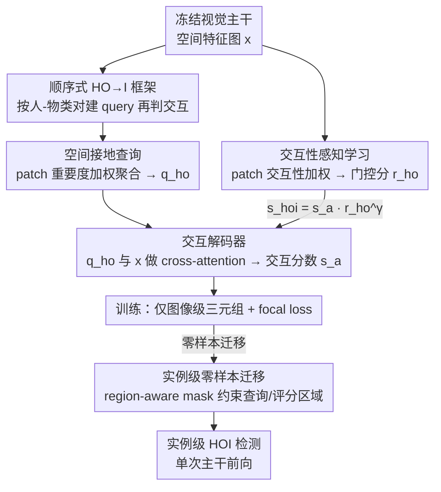

# RegFormer: Transferable Relational Grounding for Efficient Weakly-Supervised HOI Detection

**会议**: CVPR 2026  
**论文**: [CVF Open Access](https://openaccess.thecvf.com/content/CVPR2026/html/Park_RegFormer_Transferable_Relational_Grounding_for_Efficient_Weakly-Supervised_Human-Object_Interaction_Detection_CVPR_2026_paper.html)  
**代码**: [https://github.com/mlvlab/RegFormer](https://github.com/mlvlab/RegFormer)  
**领域**: 人体理解 / 人-物交互检测 (HOI) / 弱监督  
**关键词**: 人-物交互检测, 弱监督, 空间接地查询, 交互性评分, 零样本迁移

## 一句话总结
RegFormer 把弱监督 HOI 检测从「枚举所有人-物对、逐对裁切区域分类」改成「在 CLIP 空间特征图上把人和物的关系接地成查询、再用交互性分数门控非交互对」，只用图像级标注训练却能直接迁到实例级检测、单次主干前向、HICO-DET 上配 H-DETR 达到 38.14 mAP 反超全监督方法。

## 研究背景与动机

**领域现状**：HOI 检测要在图像里识别 ⟨人, 交互, 物⟩ 三元组（如 human-ride-bicycle）。全监督要为每个人-物对标注框 + 交互标签，随数据集扩大代价不可承受，于是弱监督 HOI 兴起——训练只给图像级标签（图里出现了哪些 HOI 三元组），不给人/物的定位。但没有定位信号，弱监督方法只能先用现成检测器产出一堆人/物候选，再把所有人-物对送进一个交互分类模块去判。

**现有痛点**：这个「检测器 + 配对分类」范式有两个老毛病。一是**慢**：主流做法对每个候选对裁出 union region 再各跑一次前向，候选数一多前向次数 $\tilde N_h\times\tilde N_o$ 爆炸（Fig.1-A）。即便改用 RoI-Align 从主干特征图一次性抽 union 特征，union 区域又常混进无关实例，把某一对的分类带偏（Fig.1-B），泛化差。二是**假阳性多**：弱监督下所有人-物组合都被拿去训交互预测，模型会对那些根本没在交互的组合也产生强响应，制造大量假阳性，污染实例级推理。

**核心矛盾**：要么用 union 区域特征（高效但不分人/物、易被无关区域误导），要么用检测器的实例特征（精确但把分类器和检测器死死绑在一起，换检测器就得重训）——效率、可迁移性、精度三者难以兼得。

**本文目标**：做一个轻量、通用的交互分类模块，既能在图像级监督下学好交互推理，又能**无需额外训练**地迁到实例级，且对检测器无关。

**核心 idea**：用「空间接地的 HO 查询」代替「穷举三元组查询」，把交互所需的空间线索从特征图里聚合进查询；再加一条「交互性评分」分支当门控压住非交互对。这两样都是位置感知的，于是推理时只要用检测器给的实例框去约束查询构建与评分区域，图像级学到的能力就能零样本搬到实例级。

## 方法详解

### 整体框架

RegFormer 的底座是 ML-Decoder（一个 cross-attention 的多标签分类器，用 HOI 类的文本 embedding 当 query）。但 RegFormer 不再像 ML-Decoder 那样一次性塞进所有 HOI 类的 query，而是改成**顺序式 HO→I**：先在「成对实例编码器」里按人-物类对（HO）构造 query，再在「交互解码器」里为每个 HO 对预测它的交互类别（I）。这一步把组合空间从「所有三元组」降到「人类×物类对」，让大量实例对也能低开销处理。

训练时（图像级）：从冻结的视觉主干（CLIP / DINOv2）拿空间特征图 $x$，**成对实例编码器**用 patch 级相似度算出人/物各自的 patch 重要度 $\alpha$，按权重聚合特征得到空间接地的 HO 查询 $q^{ho}$；**交互解码器**让 $q^{ho}$ 与 $x$ 做 cross-attention，输出交互分数 $\hat s^a$；同时一条**交互性感知**分支为每个人-物对算出门控分 $r^{ho}$，与 $\hat s^a$ 相乘成最终 $\hat s^{hoi}$，用 focal loss 接图像级三元组标签。

推理时（实例级）：检测器给出人/物实例框后，对每个实例造一张 **region-aware mask**，把 HO 查询的聚合区域和交互性评分都约束到该实例框内——其余流程与训练时完全一致，于是无需再训就完成实例级 HOI 检测，且全程只需**一次主干前向**（Fig.1-A 标注约 ×128 加速）。

### 关键设计

**1. 顺序式 HO→I 框架：把穷举三元组 query 拆成「先配人物类对、再判交互」**

ML-Decoder 把所有 HOI 类（如「human ride bicycle」「human hold cup」）的文本 embedding 一股脑当 query，query 数等于 HOI 类数，再叠加候选对枚举就极贵。RegFormer 借鉴顺序解码思路把它拆成两段：先按人-物**类对**（HO）组织 query，每个 HO 对只解出它对应的交互类（I）。形式上，给定文本编码器 $T$，HO query 由人/物类的语义先验初始化、再注入空间线索（见设计 2），交互解码阶段做 $\bar q^{ho}_k=\text{Att}(q^{ho}_k,x,x)$、$\hat s^a_k=\sigma(\cos(P_a(\bar q^{ho}_k),e^a))$。好处是组合规模从「三元组数」压到「人类×物类对」，海量实例对也能在单次前向里处理，这是后面效率优势的结构基础。

**2. 空间接地查询：用 patch 级相似度把「谁在哪」聚合进 HO query**

纯文本初始化的 query 没有空间信息，没法在不重训的情况下注入框坐标等局部先验，图像级到实例级的迁移就断了。RegFormer 改成从特征图聚合空间线索：先在每个 patch $x(p)$ 上算它与人/物类文本 embedding 的余弦相似度（各自投到共享空间），$s^h(p)=\cos(P^h_v(x(p)),P^h_t(e^h))$、$s^o_k(p)=\cos(P^o_v(x(p)),P^o_t(e^o_k))$；再沿 patch 维做带温度的 softmax 得到 patch 重要度 $\alpha^h(p)=\frac{\exp(s^h(p)/\tau_p)}{\sum_{p'}\exp(s^h(p')/\tau_p)}$（物体同理）；最后按重要度加权聚合 $q^h=\sum_p\alpha^h(p)x(p)$、$q^o_k=\sum_p\alpha^o_k(p)x(p)$，拼接后过投影层 $q^{ho}_k=P_q([q^h;q^o_k])$。这样 query 天生带着「人和物大概出现在哪、长什么样」的局部表征，模型是在隐式学交互所需的空间关系，而不是死记某个检测器的实例 embedding，迁移时才不会被检测器绑架。

**3. 交互性感知学习：学一个门控分，把非交互对在训练里就压下去**

弱监督下所有人-物类对都被拿去训交互预测，无论该物体是否真在图里，模型容易对无关区域产生虚假响应、学坏。RegFormer 引入交互性评分：对 patch 级相似度过 sigmoid 得 patch 交互性 $\hat s^h(p)=\sigma(s^h(p))$，再用 patch 重要度加权求和得到图像级交互性 $r^h=\sum_p\alpha^h(p)\hat s^h(p)$（物体同理），人-物对的成对交互性取几何平均 $r^{ho}_k=(r^h r^o_k)^{0.5}$。它以**乘性门控**接到交互分数上：$\hat s^{hoi}_k=\hat s^a_k\,(r^{ho}_k)^{\gamma}$，再用 focal loss $\mathcal L=\mathcal L_{\text{focal}}(\hat s^{hoi},c^{hoi})$ 接图像级标签。由于 $r$ 是从该对相关的空间区域算出来的，模型既学会压低无关区域响应、又学会突出交互相关区域，等于在判交互类别之前先做了一道筛选，假阳性被门在外面。消融里它单独带来最大增益。

**4. 实例级零样本迁移：region-aware mask 把图像级线索约束到具体实例**

要把上面图像级的能力搬到实例级，RegFormer 不加训练，只加一个 mask。对检测器给的第 $i$ 个人实例，定义指示掩码 $m^{\tilde h}_i(p)=1$（$p$ 在框内）否则 0，物体同理；把掩码的对数加进相似度再做 softmax，得到**实例感知的 patch 重要度** $\alpha^{\tilde h}_i(p)=\frac{\exp((s^h(p)+\log m^{\tilde h}_i(p))/\tau_p)}{\sum_{p'}\exp((s^h(p')+\log m^{\tilde h}_i(p'))/\tau_p)}$——框外 patch 因 $\log 0=-\infty$ 被彻底压掉。用它替换设计 2 里的 $\alpha$ 就得到只聚合该实例区域的 HO 查询，后续解码不变。交互性也同样实例化，并刻意拆成**局部 × 掩码全局**两项：$r^{\tilde h}_i=\underbrace{(\sum_p\alpha^{\tilde h}_i(p)\hat s^h(p))}_{\text{局部交互性}}\underbrace{(\sum_p\alpha^h(p)m^{\tilde h}_i(p))}_{\text{掩码全局交互性}}$。这是因为只看局部时，某些非交互实例会因强语义对齐被打出虚高分（Fig.3 第三列 0.768）；引入图像级重要度在该框内的掩码全局项后，能在全局语境里放大交互/非交互区域的反差，把虚高分纠正回 0.01。最终推理再融合检测置信度：$\tilde s^{hoi}_{ij}=\tilde s^a_{ij}\cdot(r^{\tilde{ho}}_{ij})^{\gamma}\cdot(\tilde s^h_i\tilde s^o_j)^{\lambda}$。因为训练时是「不看检测器 proposal」的 detector-agnostic 方式，迁移时反而避免了检测器偏置与误检的误差传播，对罕见类更友好。

### 损失函数 / 训练策略

只用图像级 HOI 三元组标签，单一 focal loss $\mathcal L_{\text{focal}}(\hat s^{hoi},c^{hoi})$，其中 $\hat s^{hoi}_k=\hat s^a_k(r^{ho}_k)^\gamma$ 把交互分数与交互性门控相乘。视觉与文本编码器全程冻结以保留预训练表征。默认配置：视觉 DINO-B、文本 CLIP-B、检测器 DETR。

## 实验关键数据

### 主实验

HICO-DET 上与全/弱监督方法对比（Full / Rare / Non-rare mAP）：

| 方法 | 监督 | 检测器 | 视觉/文本主干 | Full | Rare | Non-rare |
|------|------|--------|--------------|------|------|----------|
| QPIC | 全 | DETR | RN50 / — | 29.07 | 21.85 | 31.23 |
| GEN-VLKT | 全 | DETR | RN50 / CLIP-B | 33.75 | 29.25 | 35.10 |
| HOICLIP | 全 | DETR | CLIP-B / CLIP-B | 34.69 | 31.12 | 35.74 |
| Weakly HOI-CLIP | 弱 | Faster R-CNN | CLIP-RN50 / CLIP-RN50 | 22.89 | 22.41 | 23.03 |
| **RegFormer** | 弱 | Faster R-CNN | CLIP-RN50 / CLIP-RN50 | **25.08** | 25.76 | 24.88 |
| **RegFormer** | 弱 | Faster R-CNN | DINO-B / CLIP-B | **33.33** | 35.04 | 32.82 |
| **RegFormer** | 弱 | DETR | DINO-B / CLIP-B | **32.90** | 35.18 | 32.21 |
| **RegFormer** | 弱 | H-DETR | DINO-B / CLIP-B | **38.14** | 40.31 | 37.49 |

同主干同检测器下，RegFormer 比之前弱监督 SOTA（Weakly HOI-CLIP）高 **+2.19** Full；换更强主干后持续提升，配 H-DETR + DINO-B 达 38.14，**反超全监督的 HOICLIP（34.69）**，且在罕见类（Rare 40.31）上尤其强——而这正是全监督方法的弱区。V-COCO 上 RegFormer（DETR）AProle2 达 **57.5**，远高于 Weakly HOI-CLIP 的 48.1。

### 消融实验

组件级消融（Tab.1，DINO-S 主干；SG=空间接地查询，IA=交互性评分；Forward 为主干前向次数）：

| 配置 | HICO 分类 mAP | HICO-DET Full | Forward |
|------|--------------|---------------|---------|
| (a) ML-Decoder 基线 | 52.6 | 17.49 | $\tilde N_h\tilde N_o$ |
| (b) +HO→I | 53.7 | 17.63 | $\tilde N_h\tilde N_o$ |
| (c) +HO→I +SG | 54.4 | 22.08 | 1 |
| (d) +HO→I +IA | 56.2 | 23.38 | 1 |
| (e) 完整 (HO→I+SG+IA) | **57.6** | **30.01** | 1 |

交互性评分内部拆解（Tab.5，HICO-DET，DINO-S）：

| 配置 | Full | Rare | Non-rare |
|------|------|------|----------|
| 无交互性学习 | 22.08 | 23.91 | 21.53 |
| 仅掩码全局（无 IA 学习） | 26.02 | 26.81 | 25.79 |
| IA 学习 + 仅局部 | 23.44 | 25.77 | 22.75 |
| IA 学习 + 局部+全局 | **30.01** | **32.05** | **29.39** |

### 关键发现

- **三组件互补，IA 贡献最大**：从基线 17.49 到完整 30.01（Full +12.52）。其中 SG 让检测从 17.63→22.08 并把前向次数从 $\tilde N_h\tilde N_o$ 降到 1（既提点又提速），IA 再从 23.38→30.01 靠压制非交互对显著提精度，两者叠加才最大化互补。
- **局部与全局交互性缺一不可**：只用局部只有 23.44（易被强语义对齐打出虚高分），只用掩码全局 26.02，两者合并才到 30.01——局部给「这一对专属的定位线索」，全局负责「在场景语境里压非交互对」。
- **零样本与可迁移性强**：RF-UC 未见组合上 RegFormer 31.53，比弱监督基线 OpenCat（用了 75 万图大规模预训练）高 **+10.07**，甚至超过多数全监督方法；detector-agnostic 训练让它能插到 Faster R-CNN / DETR / H-DETR 任意检测器上，越强的检测器收益越大（H-DETR 把 Full 推到 38.14）。
- **效率优势来自单次前向**：实例对数增加时推理时间几乎不变（Fig.1-A 标约 ×128 加速），而 ML-Decoder 因逐对裁切前向急剧变慢。

## 亮点与洞察

- **「空间接地」把可迁移性问题转成特征聚合问题**：不靠检测器实例特征、而靠 patch 重要度从冻结特征图聚合空间线索，既保留 CLIP/DINO 的语义先验，又让 query 带定位，是 detector-agnostic + 零样本迁移得以成立的根。
- **乘性门控 $\hat s^a(r^{ho})^\gamma$ 是简洁有效的去假阳性手段**：把「这对到底在不在交互」单独学成一个分数再门控交互类别，比把判别压力全压给分类器更稳，消融里贡献最大。
- **局部 × 掩码全局的对照很有启发**：作者用 Fig.3 直观展示「局部分数会被强语义对齐骗高、全局上下文能纠回」，这个「单一信号易被语义对齐误导、需全局对照」的观察可迁移到其它弱监督定位/打分任务。
- **训练不看 proposal 反而更鲁棒**：detector-agnostic 训练规避了检测器偏置与误检误差传播，解释了为何在罕见类上反超全监督。

## 局限与展望

- 推理仍依赖外部检测器，人/物漏检会直接限制上限（虽然 detector-agnostic 缓解了误差传播，但没消除）。
- 交互性门控用幂次 $\gamma,\lambda$ 与温度 $\tau_p$ 调控，论文正文未给敏感性分析（置于补充材料），实际部署的超参鲁棒性待验证。
- 仍只在 V-COCO / HICO-DET 这类闭集 benchmark 上评，开放词表/真实长尾场景下的表现需进一步检验。
- patch 级相似度依赖 CLIP/DINO 的对齐质量，主干语义对齐差时空间接地可能失准。

## 相关工作与启发

- **vs ML-Decoder（基础架构）**：ML-Decoder 用全体 HOI 类文本 query、对每个候选对裁 union region 各跑一次前向，慢且 union 易混无关实例；RegFormer 改顺序式 HO→I + 空间接地 query，单次前向、按人/物区域聚合，Full 从 17.49→30.01。
- **vs Weakly HOI-CLIP（弱监督 SOTA）**：同 CLIP-RN50 主干、同 Faster R-CNN 下 RegFormer 25.08 vs 22.89（+2.19），且引入交互性门控显式压假阳性。
- **vs 用实例特征的弱监督方法（Explanation-HOI/MX-HOI）**：它们用检测器实例特征、分类器与检测器强耦合，换检测器需重训；RegFormer detector-agnostic，一次训练可插任意检测器。
- **vs 全监督 HOI（QPIC/GEN-VLKT/HOICLIP）**：RegFormer 仅用图像级标注却在 H-DETR 配置下反超 HOICLIP，并在罕见类与零样本未见组合上更强，标注成本大幅降低。

## 评分
- 新颖性: ⭐⭐⭐⭐ 空间接地 query + 交互性门控 + 零样本迁移到实例级的组合设计清晰且有针对性
- 实验充分度: ⭐⭐⭐⭐ HICO-DET/V-COCO/零样本三套基准、多主干多检测器、组件与交互性双重消融，效率分析在 Fig 较粗
- 写作质量: ⭐⭐⭐⭐ 公式与图示（Fig.3 交互性可视化）把机制讲清，部分超参细节放补充
- 价值: ⭐⭐⭐⭐ 弱监督逼近/反超全监督且高效、检测器无关，对降低 HOI 标注成本有实际意义

<!-- RELATED:START -->

## 相关论文

- [\[CVPR 2026\] RegFormer: Transferable Relational Grounding for Efficient Weakly-Supervised Human-Object Interaction Detection](regformer_transferable_relational_grounding_for_efficient_weakly-supervised_huma.md)
- [\[CVPR 2026\] Learning to Diversify and Focus: A Reinforcement Framework for Open-Vocabulary HOI Detection](learning_to_diversify_and_focus_a_reinforcement_framework_for_open-vocabulary_ho.md)
- [\[CVPR 2026\] PRISM: Learning a Shared Primitive Space for Transferable Skeleton Action Representation](prism_learning_a_shared_primitive_space_for_transferable_skeleton_action_represe.md)
- [\[CVPR 2026\] Learning Long-term Motion Embeddings for Efficient Kinematics Generation](learning_long-term_motion_embeddings_for_efficient_kinematics_generation.md)
- [\[CVPR 2026\] IMU-HOI: A Symbiotic Framework for Coherent Human-Object Interaction and Motion Capture via Contact-Conscious Inertial Fusion](imu-hoi_a_symbiotic_framework_for_coherent_human-object_interaction_and_motion_c.md)

<!-- RELATED:END -->
