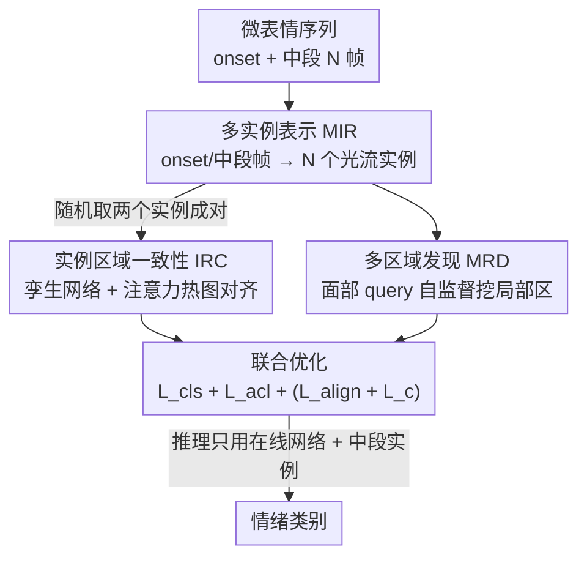

# Region-Aware Instance Consistency Learning for Micro-Expression Recognition

**会议**: CVPR 2026  
**论文**: [CVF Open Access](https://openaccess.thecvf.com/content/CVPR2026/html/Cai_Region-Aware_Instance_Consistency_Learning_for_Micro-Expression_Recognition_CVPR_2026_paper.html)  
**代码**: 无  
**领域**: 人体理解 / 微表情识别  
**关键词**: 微表情识别, 无 apex 标注, 实例一致性, 注意力一致性, 自监督

## 一句话总结
把一段微表情序列看成「onset 帧 + 多个中段帧」组成的多实例集合，用孪生网络强制不同实例的注意力热图对齐（IRC）、再用可学习面部 query 挖出被忽略的微弱激活区（MRD），从而彻底甩掉昂贵的 apex 帧标注，在四个公开数据集上全面超过 SOTA。

## 研究背景与动机
**领域现状**：微表情（Micro-Expression）是人想压抑却泄露出来的、持续时间极短、强度极弱的不自主面部运动，在测谎、心理健康评估里很有价值。主流微表情识别（MER）做法是先人工标出序列里运动强度最大的 **apex 帧**，再算 onset→apex 之间的光流（TV-L1 / 光学应变等），喂给分类模型映射到情绪标签。

**现有痛点**：这套范式有两个死结。一是 apex 标注极贵——人工要逐帧扫一遍序列、还得是专家，才能定位那个"最明显"的瞬间；二是微表情数据本身就难采难标，数据量很小，一段序列只产出**一个** onset/apex 对，可用样本极少，模型很容易过拟合到某几个固定的激活区域。近期像 AVF-MAE++ 这类自监督方法虽然能缓解过拟合，但要在外部大规模数据集上预训练，算力开销大。

**核心矛盾**：大家默认"判别性运动线索只藏在 apex 帧里"，所以非标 apex 不可。但这就把一段几十帧的序列压缩成了一个样本，数据利用率极低。

**切入角度**：作者观察到一个关键现象（Fig.1）——序列里**中段的每一帧相对 onset 帧，激活的面部区域在空间上是一致的，只是运动强度沿时间轴在变**（弱→强→弱）。空间稳定性说明"有效运动信息不是 apex 帧独占的"；强度变化则天然提供了一种数据增强。

**核心 idea**：与其死磕单个 onset/apex 对，不如把一段序列表示成 **多个 onset/中段帧光流实例的集合**，用"弱但多样"的运动线索替代"强但唯一"的 apex 线索；再设计两个模块逼模型从这些弱实例里学到一致、全面的激活区表征——这就是 Region-aware Instance Consistency Learning（Ra-ICL）。

## 方法详解

### 整体框架
Ra-ICL 要解决的是"没有 apex 标注，怎么从一段弱运动序列里学到可靠的微表情表征"。整体分三块：**MIR** 负责把序列转成一组光流实例（造数据），**IRC** 用孪生网络在实例间对齐注意力、定位全局激活区（监督主干），**MRD** 用可学习面部 query 自监督地补挖被忽略的微弱局部区（查漏补缺）。三者共享同一个 ResNet18 主干、联合训练；推理时只用在线网络、输入序列中段那个实例做分类。

### 关键设计

**1. 多实例表示 MIR：用一组弱光流实例替掉单个 apex 实例**

这一步直接对症"apex 标注贵 + 数据量小"。作者不再只取 onset/apex 一对，而是从序列**中段连续采 $N$ 帧**，对每个采样帧 $n$ 与 onset 帧用 TV-L1 算光流场 $O_n=\{(u_n(x,y),v_n(x,y))\}$（水平场 $u_n$ + 垂直场 $v_n$），再补上光学应变（optical strain，光流的一阶导）作为第三通道，凑成类 RGB 的三维张量 $I_n=[u_n,v_n,\epsilon_n]$，最终得到实例集 $\{I_n\}_{n=1}^N$。为什么取"中段"？理想情况下中段窗口会盖住 apex 帧；即便没盖住，整个窗口要么落在 activation 段、要么落在 decay 段，至少**避开了序列首尾那种运动幅度近乎为零的废帧**。这组实例共享相似激活区、强度各异，作者直言"不保证含最高强度，但至少排除了最低强度，并顺便实现了数据增强"——把一个样本撑成 $N$ 个，正面解决过拟合。

**2. 实例区域一致性 IRC：靠实例间注意力对齐，从弱实例里抠出不变激活区**

光有多实例还不够，得让模型知道"哪些区域是真·激活区"。IRC 基于空间稳定性假设——同一集合内的实例标签相同、应激活一致的区域。它**随机抽两个实例多次成对**，这样低强度实例就会被反复和高强度实例配在一起，在海量实例对里"被高强度实例带着学"。网络采用 BYOL 式孪生结构：在线网络 $E_\theta$ 与目标网络 $E_\xi$ 同构，目标参数用指数滑动平均更新 $\xi=\tau\xi+(1-\tau)\theta$（$\tau=0.99$）。对一对 $(I_\theta,I_\xi)$，先对 $I_\xi$ 做水平翻转，两支各出特征图后经 GAP + FC 算分类损失 $\mathcal{L}_{\text{cls}}=-\log\!\big(e^{\mathbf{W}_y\cdot f'_\theta}/\sum_j e^{\mathbf{W}_j\cdot f'_\theta}\big)$，并用 CAM 得到每类注意力热图 $\mathbf{M}_j(x,y)=\sum_c \mathbf{W}_j(c)\cdot\mathbf{F}_c(x,y)$。核心是**翻转语义一致性**：要求 $I_\theta$ 的热图和翻转回来的 $I_\xi$ 热图对齐，

$$\mathcal{L}_{\text{acl}}=\frac{1}{LHW}\sum_{j=1}^{L}\big\|\mathbf{M}_{\theta j}-Flip(\mathbf{M}_{\xi j})\big\|_2.$$

这样高强度实例就成了低强度实例的"老师"，弱运动区域也能被定位出来；相比外接显著性检测模型，这是纯靠数据内部一致性自我监督，不需要额外标注/模型。

**3. 多区域发现 MRD：用可学习面部 query 自监督补回被 IRC 丢掉的微弱区**

监督式的 IRC 有个老毛病：只认最判别的那块区域，强度更低但同样重要的区域会被丢掉，导致类间高度相似的微表情误判。MRD 专门补这个洞——用一组**可学习面部 query**（learnable positional embeddings）主动"扫描整张脸"。一个 Transformer decoder 以 $N$ 个 query 为 Query、特征图 $\mathbf{F}$ 为 Key/Value，解出 $N$ 个面部区域 $\mathbf{Q}\in\mathbb{R}^{N\times D}$；每个区域 $\mathbf{Q}_m$ 和投影后的稠密特征 $\mathbf{F}^{dense}$ 算余弦相似度得到 2D 热图 $\mathbf{S}_m=\mathrm{sim}(\mathbf{Q}_m,\mathbf{F}^{dense}_m)$，逐像素归一化成概率分布 $\mathbf{P}(u,v)$（把每个像素软分配到 $N$ 个区域）。同样基于实例对的空间一致性，两支的像素分配要对齐，用交叉熵约束 $\mathcal{L}_{\text{align}}=\frac{1}{HW}\sum_{u,v}\text{CrossEntropy}(\mathbf{P}_\xi(u,v),\mathbf{P}_\theta(u,v))$（目标网络给稳定目标）；再把稠密特征按热图加权池化（WAP）得到局部区域嵌入 $\mathbf{z}_m=H(\mathbf{P}_m\otimes\mathbf{F}^{dense})$，用余弦相似度约束两支局部嵌入一致 $\mathcal{L}_c=\frac{1}{N}\sum_m\text{sim}(\mathbf{z}_{\theta m},\mathbf{z}_{\xi m})$。如此模型注意力被强行"摊开"到更多微弱运动模式上，避免只押注局部判别区。

### 损失函数 / 训练策略
在线网络和目标网络联合更新（EMA），分类、IRC、MRD 同时跑，总目标为

$$\mathcal{L}=\lambda_1\mathcal{L}_\text{cls}+\lambda_2\mathcal{L}_\text{acl}+\lambda_3(\mathcal{L}_\text{align}+\mathcal{L}_c),$$

实现里 $\lambda_1=\lambda_2=\lambda_3=0.5$。主干为随机初始化的 ResNet18，$\tau=0.99$，MIR 采样 $N=16$ 帧、MRD 用 8 个面部 query，Adam（lr=0.001，weight decay=1e-4），batch 128、100 epoch、指数学习率衰减 gamma=0.9，单卡 3090 Ti。推理只用在线网络、且输入**中段实例**（同样为了避开强度过低的实例）。

## 实验关键数据

四个公开数据集：CASME II、SAMM、SMIC-HS（三者按 Composite Database Evaluation/CDE 合成评测）和 CAS(ME)³。指标用 UF1（Unweighted F1）和 UAR（Unweighted Average Recall），均为 LOSO 交叉验证。

### 主实验
CDE 设定下与 SOTA 对比（UF1 / UAR，%）：

| 数据集 | 指标 | Ra-ICL (本文) | 之前最好 | 提升 |
|--------|------|------|----------|------|
| Composite | UF1 | **88.05** | 86.03 (HTNet) | +2.02 |
| Composite | UAR | **89.11** | 86.88 (MFDAN) | +2.23 |
| CASME II | UF1 | **96.20** | 95.32 (HTNet) | +0.88 |
| SAMM | UF1 | **86.68** | 81.31 (HTNet) | +5.37 |
| SAMM | UAR | **88.85** | 82.60 (MPFNet) | +6.25 |
| SMIC-HS | UF1 | **81.79** | 80.49 (HTNet) | +1.30 |

CAS(ME)³ 上 3/4/7 类全设定也都登顶（UF1 / UAR，%）：

| 设定 | 指标 | Ra-ICL | 之前最好 | 提升 |
|------|------|--------|----------|------|
| 3-class | UF1 | **75.85** | 68.19 (Lite-Point-GCN) | +7.66 |
| 4-class | UF1 | **61.03** | 47.64 (Lite-Point-GCN) | +13.39 |
| 7-class | UF1 | **44.32** | 35.64 (Lite-Point-GCN) | +8.68 |

值得强调：以上全程**不用任何 apex 帧标注**，SAMM 与 CAS(ME)³ 难数据集上的大幅领先尤其能说明问题。

### 消融实验
CDE 设定，以全配置 M6 为基准，Composite 上 UF1 / UAR（%）：

| 配置 | MIR | IRC | MRD | UF1 | UAR | 说明 |
|------|-----|-----|-----|-----|-----|------|
| M1 | →Apex* | ✗ | ✗ | 83.22 | 82.64 | 单 onset/apex 实例基线 |
| M2 | ✓ | ✗ | ✗ | 84.91 | 83.72 | 仅 MIR，已超 apex 基线 |
| M4 | ✓ | ✗ | ✓ | 86.18 | 85.92 | MIR+MRD，缺监督主干 |
| M5 | ✓ | ✓ | ✗ | 85.81 | 85.46 | MIR+IRC，缺微弱区补挖 |
| M6 (ours) | ✓ | ✓ | ✓ | **88.05** | **89.11** | 完整模型 |

不同采样策略（均带 IRC+MRD）：

| 配置 | 采样 | UF1 | UAR | 说明 |
|------|------|-----|-----|------|
| M6 | 中段 16 帧 | 88.05 | 89.11 | 无需 apex、光流开销小 |
| M7 | →apex 居中 16 帧 | 87.73 | 88.73 | 用 apex 标注，反而不占优 |
| M8 | →全帧 | 88.26 | 88.21 | 多样性更高但引入噪声 |
| M9 | →随机 16 帧 | 87.89 | 87.87 | 随机也有效 |
| M11 | →activation 段 | 86.62 | 87.63 | 显式排除 apex，仍有竞争力 |
| M12 | →decay 段 | 87.61 | 87.55 | 同上，证明非 apex 帧也含有效运动 |

### 关键发现
- **MIR 是地基**：M1→M2（仅换成多实例表示）就涨了约 1.7% UF1，作者据此论证"运动线索的多样性比强度更重要"，直接动摇了"apex 帧最判别"的旧信条。
- **IRC、MRD 缺一不可且互补**：去掉 IRC（M4，仅 MRD 自监督、无标签监督）或去掉 MRD（M5，仅 IRC、漏掉微弱区）都明显掉点，二者一个负责定位全局不变激活区、一个负责补回被忽略的微弱区。
- **apex 真的可以不要**：M7 用 apex 居中采样反而没赢过 M6（中段采样运动多样性更高），M11/M12 显式排除 apex 帧仍有竞争力——强证据表明模型确实从非 apex 帧学到了有效运动信息。
- **误差来源**：混淆矩阵显示主要错在"把 Positive 误判成 Negative"，作者归因于 Negative 类样本最多带来的偏置。

## 亮点与洞察
- **重新定义了输入单位**：把"一段序列=一个 onset/apex 样本"改成"一段序列=一组弱实例集合"，一招同时解决标注贵和数据少两个老问题——这种"换数据表示而非堆模型"的思路很值得迁移到其它低资源、弱信号识别任务。
- **用一致性当免费监督**：IRC 的翻转注意力一致性 + MRD 的像素分配/局部嵌入一致性，全靠实例对内部的空间稳定性自我监督，不接外部显著性模型、不预训练外部大数据，算力友好。
- **"高强度实例带低强度实例"的配对设计**很巧：随机成对让弱实例反复跟强实例同框，相当于隐式蒸馏，把弱运动区也照亮了。
- **MRD 对抗"只看最判别区"**：用可学习 query 主动扫脸、强制注意力摊开，是对 CAM 类方法天然偏向局部显著区的针对性修补，对类间高相似的微表情尤其关键。

## 局限与展望
- 作者承认模型对类别不均衡敏感：Negative 样本最多导致 Positive→Negative 的系统性误判，未做显式再平衡。
- 中段采样依赖"中段大概率覆盖或贴近 activation/decay"的先验，$N=16$ 由帧率先验定（细节在补充材料），对帧率差异很大或极短序列是否稳健存疑 ⚠️。
- 仍依赖 TV-L1 光流作为运动表征，光流质量会传导到下游；端到端从原始帧学运动是可改进方向。
- 推理固定取"中段实例"，未探索多实例集成推理是否能进一步提升。

## 相关工作与启发
- **vs apex-based 方法（HTNet / MFDAN / FRL-DGT 等）**：它们都需 onset/apex 对、依赖 apex 标注且每序列只产一个样本；本文用多实例集合彻底去掉 apex 标注，并把数据利用率撑高，SAMM 上 UF1 直接领先 5.37%。
- **vs 外部预训练自监督（AVF-MAE++ / Micron-BERT）**：那类方法靠外部大规模数据/额外模态预训练补数据，算力贵；Ra-ICL 不接外部数据集，纯从小规模 ME 数据内部采样实例对自监督。
- **vs 随机帧对方法（FRL-DGT / MARNet）**：同样"采足够多帧对"避免依赖外部数据，但本文进一步用 IRC+MRD 的双一致性显式约束激活区，并配套中段采样去掉首尾废帧。

## 评分
- 新颖性: ⭐⭐⭐⭐⭐ 把"序列→多弱实例集合"作为新范式，从根上绕开 apex 标注，观察—方法闭环漂亮
- 实验充分度: ⭐⭐⭐⭐⭐ 四数据集 + 多设定 + 采样策略/模块消融详尽，结论有据
- 写作质量: ⭐⭐⭐⭐ 动机和模块讲得清楚，公式记号略密
- 价值: ⭐⭐⭐⭐⭐ 去 apex 标注对微表情这种低资源任务是实打实的工程与方法价值

<!-- RELATED:START -->

## 相关论文

- [\[CVPR 2026\] CLEX: Complementary Label Exchange Learning for Noisy Facial Expression Recognition](clex_complementary_label_exchange_learning_for_noisy_facial_expression_recogniti.md)
- [\[CVPR 2026\] Active Inference for Micro-Gesture Recognition: EFE-Guided Temporal Sampling and Adaptive Learning](active_inference_for_micro-gesture_recognition_efe-guided_temporal_sampling_and_.md)
- [\[CVPR 2026\] A Two-Stage Dual-Modality Model for Facial Expression Recognition](a_two_stage_dual_modality_model_for_facial_expression_recognition.md)
- [\[CVPR 2026\] OMG-Bench: A New Challenging Benchmark for Skeleton-based Online Micro Hand Gesture Recognition](omg-bench_a_new_challenging_benchmark_for_skeleton-based_online_micro_hand_gestu.md)
- [\[CVPR 2026\] Dynamic Label Noise Suppression with Optimal Teacher Pool for Facial Expression Recognition](dynamic_label_noise_suppression_with_optimal_teacher_pool_for_facial_expression_.md)

<!-- RELATED:END -->
