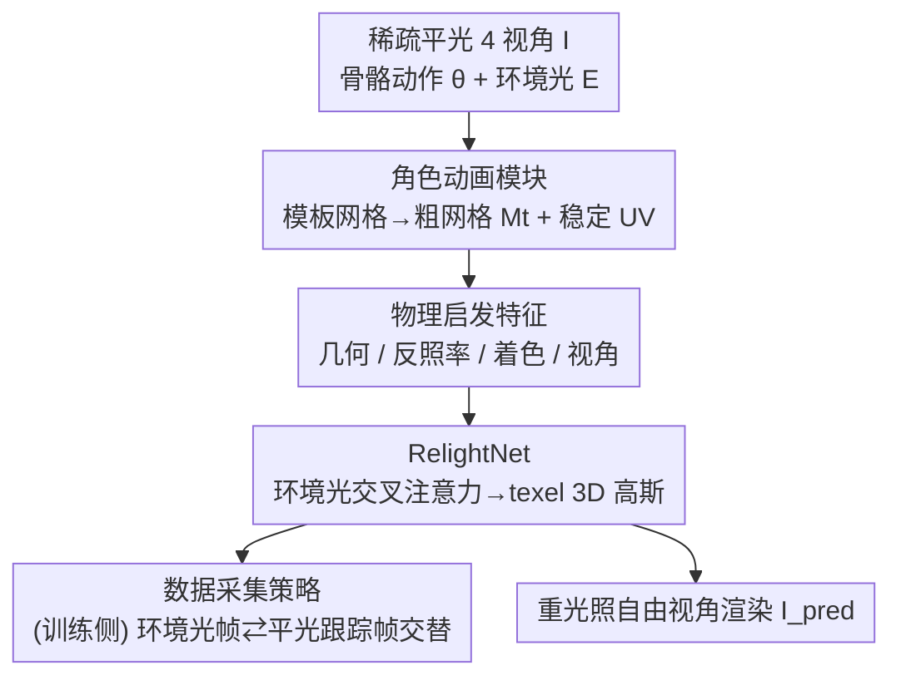

# Relightable Holoported Characters: Capturing and Relighting Dynamic Human Performance from Sparse Views

**会议**: CVPR 2026  
**论文**: [CVF Open Access](https://openaccess.thecvf.com/content/CVPR2026/html/Singh_Relightable_Holoported_Characters_Capturing_and_Relighting_Dynamic_Human_Performance_from_CVPR_2026_paper.html)  
**代码**: 无  
**领域**: 3D视觉 / 人体重建与重光照  
**关键词**: 全身重光照, 稀疏视角, 3D高斯, 渲染方程, Light Stage

## 一句话总结
RHC 用一个 transformer 网络 RelightNet，把"物理启发特征（几何/反照率/着色/视角）"和环境光做交叉注意力，在**单次前向**里隐式求解渲染方程，从 4 路平光相机就能对未见动作的全身人物做照片级自由视角重光照——既不用慢吞吞的 OLAT 基底采集，又比逆渲染类方法清晰得多。

## 研究背景与动机
**领域现状**：把真人变成可任意换视角、换光照的"数字孪生"是 VR 远程在场、影视、游戏的刚需。主流分两派：一派从单/多目自然光视频里做**逆渲染**（inverse rendering），用解析 BRDF（Microfacet / Disney / Lambertian）把外观分解成几何、材质、光照；另一派用 **Light Stage** 配可编程 LED，拍 OLAT（one-light-at-a-time，逐光源）数据，靠光传输线性叠加来合成任意光照。

**现有痛点**：逆渲染派受困于几何/材质/光照之间的内在歧义，加上过度简化的 BRDF 又无法补偿跟踪误差，重光照清晰度上不去。OLAT 派要求人体静止、且要穷举"光×视角×动态几何"的组合，对动态全身人物完全不现实——动起来衣物非刚性形变，线性叠加假设静态场景，几何误差会累积污染重光照。于是这派要么只做易跟踪的刚性局部（脸、手），要么只能"回放"预拍好的固定表演，无法泛化到新动作。

**核心矛盾**：要照片级真实就得 Light Stage 精确控光，但精确控光的 OLAT 采集天然和"动态全身 + 任意新动作"互斥；而能处理动态的逆渲染又因显式求解渲染方程不可行、只能用粗糙 BRDF 近似，牺牲真实感。

**本文目标**：从推理时仅有的**稀疏平光视角**（4 个相机），对未见动作的动态全身人物做可控、照片级重光照，且单次前向完成。

**切入角度**：作者不再显式求解渲染方程，而是**让网络隐式学会它**——把渲染方程里的各项（几何、反照率、着色、视角）分别近似成 UV 空间的特征图喂给网络，再用交叉注意力把"每个表面点对所有入射方向积分光照"这件事建模成 texel 对环境光的 attention。

**核心 idea**：用"物理启发特征 + 环境光交叉注意力"在单次前向里隐式计算渲染方程，输出贴在粗网格上的 texel 对齐 3D 高斯。

## 方法详解

### 整体框架
输入是 4 路平光下的稀疏多视角图像 $I$、骨骼动作 $\theta$、目标环境光 HDR 贴图 $E$、目标相机参数。输出是该相机视角下、该环境光下的照片级重光照图像 $I_{pred}$。整条管线分三步走：先用**角色动画模块**把个性化模板网格按骨骼驱动成与观测大致吻合的粗网格 $M_t$，拿到稳定的 UV 参数化；再在这套 UV 空间里抽出**物理启发特征**（几何/反照率/着色/视角），它们分别近似渲染方程里的各项；最后 **RelightNet** 把这些特征和环境光做交叉注意力，回归出 texel 对齐的 3D 高斯参数 $g$，摆回全局空间后光栅化成图。关键在于：推理时不评估渲染方程的积分，只跑一次前向。

### 关键设计

**1. 物理启发特征：把渲染方程拆成 UV 空间的可学习近似**

渲染方程 $L_o(x,\omega_o)=\rho(x)\int_{\omega_i} f_r(x,\omega_i,\omega_o)L_i(x,\omega_i)V(x,\omega_i)\langle\omega_i,n\rangle\,d\omega_i$ 对一个会形变、还带跟踪噪声的人体网格几乎无法直接求解：几何被过度平滑、简单 BRDF 又描述不了皮肤/布料这种复杂材质。作者的破法是：不去恢复真实 albedo 和 BRDF，而是把方程里"几何、反照率、着色、视角"四项各自**近似成一张 UV 特征图**，让 RelightNet 后面去补真实外观与这些近似之间的残差。

具体地：**几何特征**用 3 帧网格法线堆叠 $\tilde n=\{n_{t-2},n_{t-1},n_t\}$ 提供时序粗结构，再用 Sapiens 从输入图估高频法线、转到世界系后反投影到 UV（多视角平均）得到 $\hat n$ 补细节，外加一张位置图 $p$ 编码全局 texel 位置以建模近场互反射；**反照率特征**利用"平光外观≈表面 albedo"这一近似，把输入图反投影进模板 UV 得到带空洞的 $\rho$，再用 AlbedoNet $\hat\rho=\mathcal H(\rho,\tilde n,\gamma)$ 把缺失/畸变区域 inpaint 修补；**着色特征**只算直接环境光的预积分漫反射 $d=\int_{\omega_i}L_i(x,\omega_i)V(x,\omega_i)\langle\omega_i,n\rangle\,d\omega_i$，让网络专注高频外观而非低频光照；**视角特征** $\gamma$ 是每个 texel 从位置图指向相机原点的方向。这套"把物理项喂进去、让网络学残差"的设计，既绕开了显式逆渲染的歧义，又给网络保留了物理先验。

**2. RelightNet：用环境光交叉注意力把"对所有方向积分光照"建模成 attention**

痛点是渲染方程里那个对入射方向的积分根本算不动。RelightNet 的做法是把它变成 attention：网络 $g=\mathcal F(f;E),\ f=\{\tilde n,\hat n,p,\hat\rho,d,\gamma\}$ 是个 UV 空间的 2D 卷积网络，混合卷积、自注意力和**交叉注意力**层。它把展平的环境光（拼上 2D 正弦位置编码）线性投影成 $(K_e,V_e)$，每个 texel 特征投影成 $Q_f$，做多头交叉注意力——这正对应渲染方程里"每个 texel 聚合来自所有方向的光贡献"。注意输出**不是直接预测 RGB**，而是预测贴在网格上的 texel 对齐 3D 高斯参数：每个 texel 对应一个高斯 $(p_i,s_i,r_i,o_i,c_i)$，位置和尺度从网格表面初始化 $\bar p_i,\bar s_i$、网络只预测偏移 $p_i=\bar p_i+\delta p_i,\ s_i=\bar s_i\odot\delta s_i$。虽然漫反射和自遮挡已被 $d$ 显式建模，端到端的 RelightNet 还能学到完整光传输——镜面反射（靠 $\gamma$ 和对 $E$ 的交叉注意力）、次表面散射（靠 $\tilde n,p$ 几何编码和 UV 自注意力），最后用相机参数把高斯光栅化成 $I_{pred}$。

**3. 交错式数据采集：环境光帧与平光跟踪帧交替，一次拿齐光照与跟踪监督**

训练 RelightNet 需要同时满足三件互相打架的事：丰富光照覆盖、丰富动作覆盖、可靠几何跟踪。传统 OLAT 要求静止且逐光输出，开销随光照条件线性爆炸；动态拍 OLAT 又因衣物非刚性形变导致线性叠加假设失效、几何误差累积。作者在多视角 Light Stage 里**交替拍两类帧**：① 用随机环境光贴图投到 LED 上模拟真实世界光照的"重光照帧"；② 均匀平光的"跟踪帧"。两类帧交错保证几何与光照在时间上密集对齐，平光帧既能稳健跟踪非刚性衣物形变、又能当相邻重光照帧的近似纹理参考，从而**无需解析地分解材质和光照**就能端到端训练前馈 RelightNet。配套发布了 5 个受试者、1000+ 自然光照条件的大规模数据集作为 benchmark。

### 损失函数 / 训练策略
每个受试者**单独训练**一套模型（角色动画 $G$、AlbedoNet $\mathcal H$、RelightNet $\mathcal F$）。40 路相机中 37 路训练、3 路测试；训练用 Laval Indoor 的 1015 张 HDR 环境光，测试用 8 张未见环境光。每受试者每相机 28420 训练帧 + 14336 测试帧，平光帧与重光照帧各半，60 Hz 采集；测试序列单独录制、含未见动作。高斯投影、渲染与训练细节在补充材料中（⚠️ 正文未给完整 loss 形式，以原文/补充材料为准）。

## 实验关键数据

### 主实验
在 5 个穿不同衣服的受试者上，用 PSNR / LPIPS / SSIM 评测（取每三视角、每 10 帧平均）。下表为各受试者数值（LPIPS、SSIM 原文为 ×100 形式）：

| 方法 | S1 PSNR↑ | S1 LPIPS↓ | S1 SSIM↑ | S5 PSNR↑ | S5 LPIPS↓ | S5 SSIM↑ |
|------|----------|-----------|----------|----------|-----------|----------|
| R4D + GT Env | 29.89 | 10.31 | 87.15 | 29.11 | 8.48 | 84.04 |
| IA + GT Env | 27.25 | 18.25 | 81.39 | 28.61 | 16.94 | 80.35 |
| MA + GT Env | 28.52 | 10.44 | 82.76 | 30.01 | 8.42 | 84.20 |
| HPC | 25.84 | 11.41 | 88.04 | 27.08 | 9.00 | 84.37 |
| HPC + NG | 30.52 | 8.75 | 87.49 | 30.52 | 8.41 | 80.41 |
| **Ours (RHC)** | **31.38** | **7.01** | **90.00** | **32.07** | **5.55** | **89.34** |

RHC 在几乎所有受试者、所有指标上领先。注意逆渲染派的 IA/MA 即便喂了真值环境光，仍受限于 SMPL 跟踪、隐式 3D 表示和 BRDF 假设，清晰度上不去；HPC 平光下细节锐利但本身不可重光照，套上 NG 重光照又引入不一致着色、破坏脸部等细结构。

### 消融实验
| 配置 | PSNR↑ | LPIPS↓ | SSIM↑ | 说明 |
|------|-------|--------|-------|------|
| Ours w/o geometry features | 31.73 | 5.58 | 89.01 | 去全部几何特征，失去纠正姿态误差能力 |
| Ours w/o albedo feature | 31.82 | 5.78 | 88.53 | 无法纠正跟踪导致的纹理漂移 |
| Ours w/o diffuse shading | 31.59 | 5.74 | 88.80 | 丢掉显式自阴影，遮挡区变差 |
| Ours w/o camera encoding | 31.52 | 5.68 | 88.77 | 无法建模视角相关效应 |
| Ours w/o cross attention | 31.88 | 5.56 | 89.18 | 改成 concat 环境光，光照条件化变弱 |
| Ours w/ sparse-view tracking | 30.72 | 6.06 | 87.83 | 仅 4 视角跟踪（实际用例），主要手部跟踪误差 |
| Ours w/ 0 input views (pose only) | 31.39 | 6.23 | 87.50 | 纯姿态无图像观测 |
| Ours w/ 2 input views | 32.00 | 5.74 | 89.20 | 视角更少→遮挡更多 |
| OLAT data capture | 26.42 | 10.46 | 89.86 | 用 OLAT 采集训练，逐光渲染误差累积，PSNR 暴跌 |
| **Ours (full)** | **32.07** | **5.55** | **89.34** | 完整模型 |

### 关键发现
- **几何特征贡献最大**：去掉后掉点最明显，因为模型失去了对姿态相关误差（粗网格跟踪不准）的纠正能力，同时丢了高频法线带来的褶皱保真。
- **采集策略本身就是核心贡献**：把"OLAT 采集"换进来训练，PSNR 从 32.07 暴跌到 26.42，直接验证了"环境光帧⇄平光帧交错"相比 OLAT 的巨大优势——OLAT 在动态场景下逐光渲染误差会累积。
- **重光照帧 + 真值环境光对 baseline 也有效**：R4D 从平光帧训练换成重光照帧 + GT 环境光后大幅提升，反向佐证了作者 Light Stage 采集方案的价值。
- **泛化到未训练的 OLAT 光照**：模型没在 OLAT 环境上训练，却能泛化到 OLAT 光照条件。

## 亮点与洞察
- **把"算不动的积分"变成"attention"**：渲染方程里对所有入射方向的积分，被改写成 texel-Query 对环境光-Key/Value 的交叉注意力，物理直觉和网络结构对得严丝合缝，是最漂亮的一笔。
- **物理启发特征 = 给网络喂物理先验、只让它学残差**：不强求显式分解材质/光照（那是逆渲染歧义的根源），而是把几何/albedo/shading/view 近似图喂进去，网络补真实与近似之间的差，既稳又真。
- **采集策略的工程巧思**：用平光帧当"跟踪锚点 + 邻帧纹理参考"，环境光帧当"重光照监督"，一套交错就把"动态全身 OLAT 不可行"这个死结解开，且省掉解析分解。这个"双帧交错"思路可迁移到任何需要同时拿几何跟踪和外观监督的动态采集任务。
- **输出 3D 高斯而非 RGB**：预测 texel 对齐高斯并从网格初始化、只学偏移，天然带 3D/时序一致性，避开了纯 2D 扩散重光照的不一致问题。

## 局限与展望
- **强 person-specific**：每个受试者单独训一套模型（$G,\mathcal H,\mathcal F$），不跨身份泛化，落地一个新人就要重训。
- **依赖多视角 Light Stage 训练数据**：虽然推理只要 4 路平光相机，但训练强依赖昂贵的 Light Stage 采集，门槛高。
- **稀疏视角跟踪的手部误差**：实际 4 视角骨骼跟踪相比密集视角掉点（30.72 vs 32.07），主要瓶颈在手部跟踪。
- **未与 Relightable Full Body Gaussian Codec Avatars [52] 直接对比**（因对方代码未开源），同类全身 OLAT-based 方法的横向定位略有缺口。
- 完整 loss、高斯投影与训练细节都在补充材料，正文未给（⚠️ 复现需查补充材料）。

## 相关工作与启发
- **vs 逆渲染派（R4D / IA / MA）**：他们从自然光显式分解几何+材质+光照、用解析 BRDF 显式渲染；本文不分解、用物理启发特征 + 网络隐式求渲染方程。优势是绕开了分解歧义、清晰度更高（IA/MA 即便喂真值环境光仍受 BRDF 与跟踪所限）。
- **vs OLAT / Light Stage 派**：他们靠 OLAT 基底线性叠加，只能处理静态或回放预拍表演；本文用环境光⇄平光交错采集 + 前馈网络，能泛化到未见动作的动态全身。
- **vs HPC（Holoported Characters）**：HPC 同样从稀疏视角做照片级自由视角渲染但**不可重光照**，套外接重光照网络（NG）会破坏细结构；本文把重光照原生融进表示，输出可控光照的 3D 高斯。
- **vs 2D 扩散重光照**：图像空间方法缺 3D 与时序一致性；本文用显式动态 3D 几何 + 光栅化，时序一致。

## 评分
- 新颖性: ⭐⭐⭐⭐⭐ 把渲染方程积分改写成环境光交叉注意力、用物理启发特征单次前向隐式求解，思路漂亮且自洽
- 实验充分度: ⭐⭐⭐⭐ 5 受试者 × 多 baseline + 丰富消融，但 person-specific、缺与 [52] 直接对比
- 写作质量: ⭐⭐⭐⭐⭐ 动机—方法—消融逻辑紧扣渲染方程，叙述清晰
- 价值: ⭐⭐⭐⭐⭐ 首个稀疏视角、未见动作、单次前向的全身重光照方法，VR/影视刚需且配套发布 benchmark

<!-- RELATED:START -->

## 相关论文

- [\[ECCV 2024\] 3DFG-PIFu: 3D Feature Grids for Human Digitization from Sparse Views](../../ECCV2024/human_understanding/3dfg-pifu_3d_feature_grids_for_human_digitization_from_sparse_views.md)
- [\[CVPR 2026\] FusionAgent: A Multimodal Agent with Dynamic Model Selection for Human Recognition](fusionagent_a_multimodal_agent_with_dynamic_model_selection_for_human_recognitio.md)
- [\[CVPR 2026\] FisherPoser: Human Motion Estimation from Sparse Observations with Hierarchical Region-Wise Fisher-Matrix Uncertainty Modeling](fisherposer_human_motion_estimation_from_sparse_observations_with_hierarchical_r.md)
- [\[CVPR 2026\] Ultra Diffusion Poser: Diffusion-Based Human Motion Tracking From Sparse Inertial Sensors and Ranging-Based Between-Sensor Distances](ultra_diffusion_poser_diffusion-based_human_motion_tracking_from_sparse_inertial.md)
- [\[CVPR 2026\] Beyond Scanpaths: Graph-Based Gaze Simulation in Dynamic Scenes](beyond_scanpaths_graph-based_gaze_simulation_in_dynamic_scenes.md)

<!-- RELATED:END -->
