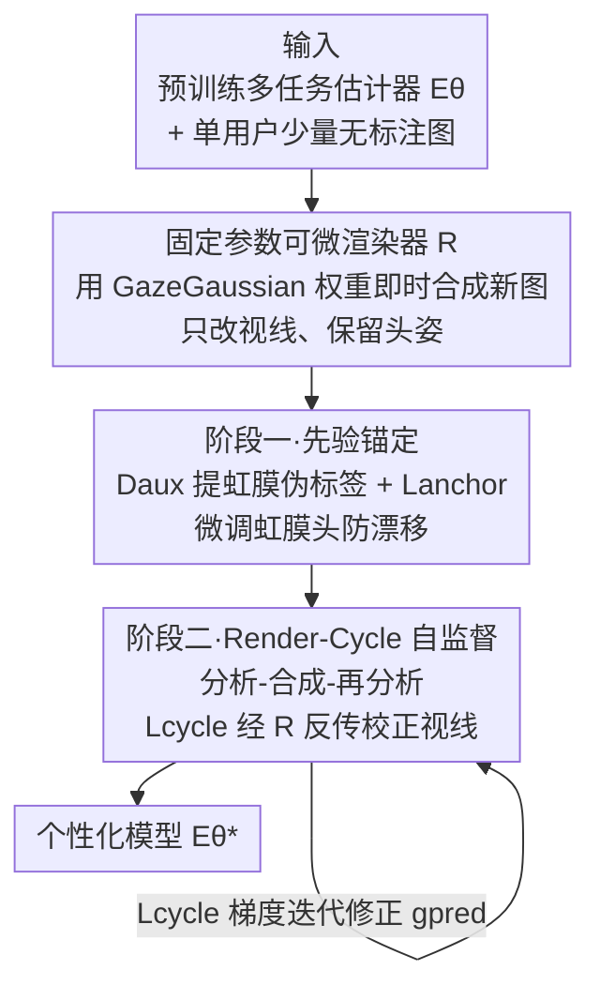

# Render-to-Adapt: Unsupervised Personal Adaptation for Gaze Estimation

**会议**: CVPR 2026  
**论文**: [CVF Open Access](https://openaccess.thecvf.com/content/CVPR2026/html/Ge_Render-to-Adapt_Unsupervised_Personal_Adaptation_for_Gaze_Estimation_CVPR_2026_paper.html)  
**代码**: 未提及  
**领域**: 人体理解 / 视线估计  
**关键词**: 视线估计, 无监督个性化适配, 可微渲染, 自监督, 测试时适配

## 一句话总结
本文指出主流"无监督域适配（UDA）"的群体级假设与"系统每次只服务单个新用户"的真实场景脱节，提出**无监督个性化适配（UPA）**新范式，并用一个固定参数的可微渲染器构造 **Render-Cycle 一致性**自监督信号——把模型预测的视线渲染成新图、再让模型读回虹膜位置，用前后虹膜是否一致来反传校正视线偏差，在跨数据集的逐人适配上对**每一个用户都稳定提升**，整体显著超过现有 SOTA。

## 研究背景与动机

**领域现状**：基于外观的视线估计（appearance-based gaze estimation）靠深度网络从人脸/眼部图像直接回归视线方向，已经很成熟。但模型一旦换到新用户、新背景或新光照，误差会急剧上升，这是该领域公认的核心挑战。为缩小这个差距，社区大量采用**无监督域适配（UDA）**：假设有带标注的源域 + 无标注的目标域，通过对齐两个群体的数据分布来提升模型在目标域上的**平均**表现。

**现有痛点**：作者用两组验证实验戳破了 UDA 在真实部署中的两重缺陷。其一，**任务设定不现实**——消费电子、驾驶监控等场景里系统每次只面对**一个**新用户，而 UDA 却要求先攒一个"该用户 + 几十个其他人"的目标数据集，做群体级适配，再把群体最优模型套回原用户，流程与需求严重错位。其二，**个体级不可靠**——复现 SOTA 的 UnReGA 后逐人分析误差，发现适配后有一部分被试误差不降反升（图 2a）。把这些失败者在外观特征空间用 UMAP 可视化，它们几乎全落在 80% 置信椭圆之外（图 2c），是**离群用户**。也就是说，UDA 把模型拉向群体均值，恰恰损害了最需要适配的离群个体。

**核心矛盾**：UDA 追求的"群体平均误差最小"与真实需求"当前这个用户的误差和可靠性"之间存在根本错位；而单用户、无标签的设定下又缺少几何标定所需的个体数据。

**本文目标**：定义并解决一个更贴近落地的新任务——给定一个预训练通用模型和**单个新用户的少量无标注图像**，如何快速且稳健地把模型校准到这个特定用户上，让其视线误差最小。

**切入角度**：作者注意到 GazeNeRF、GazeGaussian 这类高保真**可微渲染**技术，已经能为新用户即时合成几何一致的人脸图像。这给出了一个绕开"无标签"瓶颈的新工具：用渲染器现场造数据。核心假设是——如果模型对真实图的初始视线预测是对的，那么把这个预测视线喂回渲染器合成一张新图，模型从真图和合成图里提取的关键视线线索（虹膜位置）应当**自洽**。

**核心 idea**：用"预测视线 → 渲染新图 → 读回虹膜 → 比对一致性"的 **Render-Cycle 一致性**当作无标签误差信号，经可微渲染器反传，直接校正初始视线预测的偏差。

## 方法详解

### 整体框架

R2A（Render-to-Adapt）要解决的是 UPA 任务：输入一个在源域预训练好的**多任务估计器** $E_\theta$（同时输出视线向量和虹膜轮廓点）和单个新用户的少量无标注图 $I_U=\{I_{real}\}$，输出针对该用户优化的个性化模型 $E_{\theta^*}$。整个流程是一个"分析—合成—再分析"的闭环：$E_\theta$ 先分析真图得到预测视线 $g_{pred}$ 和虹膜位置；固定参数的可微渲染器 $R$ 用 $g_{pred}$ 把真图合成成新图 $I_{recon}=R(I_{real},g_{pred})$（只改视线方向、保留头姿）；$E_\theta$ 再分析 $I_{recon}$ 读回虹膜位置。当两次虹膜不一致时，一致性损失 $\mathcal{L}_{cycle}$ 经可微渲染器反传，无监督地校正 $g_{pred}$ 的偏差。整条标定流程分两阶段：先用渲染器造数据 + 辅助先验稳住虹膜预测头，再跑自监督循环校正视线头。

### 关键设计

**1. 固定参数可微渲染器 R：把渲染器当成即时个性化数据生成器**

UPA 的根本困境是单用户、无标签下没有可供几何标定的个体数据。R2A 引入一个参数 $\phi$ 冻结的可微渲染器 $R$，$I_{recon}=R(I_{source},g_{target};\phi)$：以 $I_{source}$ 作外观模板（提取身份、纹理、光照），以 $g_{target}$ 作目标视线合成新图，且合成时**保留源图头姿、只改视线方向**。实现上直接用 GazeGaussian 的预训练权重。关键在"可微"——$R$ 对其输入（尤其 $g_{target}$）可导，因此在 $I_{recon}$ 上算出的损失能经链式法则把梯度回传到输入视线上。作者还做了假设验证（图 3b）：用真值视线 $g_{gt}$ 当控制信号时，合成图 $I_{recon}$ 的虹膜位置与原图几乎一致，说明 $R$ 能把视线向量的变化忠实翻译成虹膜位置的变化，为后面的自监督信号打下基础。

**2. 阶段一·先验锚定损失 $\mathcal{L}_{anchor}$：用传统视觉先验稳住虹膜头、防自监督漂移**

自监督循环很容易让模型在无标签下漂移甚至塌缩，所以正式校正前先强化虹膜预测能力。具体做法：用渲染器 $R$ 把用户的少量真图 $I_{real}$ 配上**随机视线和随机头姿**合成多样化的 $I_{synth}$ 做数据增强；再用一个**非学习**的辅助检测器 $D_{aux}$（Dlib 定位眼区 landmark + OpenCV Hough 圆变换估计虹膜中心）为增强集提取稳定的虹膜伪标签 $iris_{pseudo}$。锚定损失对真图域和重建图域分别监督：

$$\mathcal{L}_{anchor}=\mathcal{L}_1(iris_{pred\_real},iris_{pseudo\_real})+\mathcal{L}_1(iris_{pred\_recon},iris_{pseudo\_recon})$$

$D_{aux}$ 的作用不是给完美标签，而是把虹膜子任务**锚定**在一个稳定先验上，阻止 $E_\theta$ 在自监督过程中跑偏。

**3. 阶段二·Render-Cycle 一致性 $\mathcal{L}_{cycle}$：经可微渲染器反传的核心自监督校正信号**

这是框架的核心。在自监督循环里，对每张 $I_{real}$ 依次执行：先验分析 $iris_{pseudo\_real}=D_{aux}(I_{real})$、初始分析 $(g_{pred},iris_{pred\_real})=E_\theta(I_{real})$、合成 $I_{recon}=R(I_{real},g_{pred})$、再分析 $iris_{pred\_recon}=E_\theta(I_{recon})$。一致性损失取两次虹膜预测的 $\mathcal{L}_1$ 距离：

$$\mathcal{L}_{cycle}=\mathcal{L}_1(iris_{pred\_real},iris_{pred\_recon})$$

其因果链是：若初始 $g_{pred}$ 错了，渲染出的 $I_{recon}$ 视线就是错的，导致 $iris_{pred\_recon}$ 偏离 $iris_{pred\_real}$，$\mathcal{L}_{cycle}\neq 0$；该损失梯度经可微的 $R$ 反传，正好把 $g_{pred}$ 往真值方向拉。总损失为两者加权和 $\mathcal{L}_{total}=\lambda_{anchor}\mathcal{L}_{anchor}+\lambda_{cycle}\mathcal{L}_{cycle}$，经验上 $\lambda_{anchor}=\lambda_{cycle}=1$。$\mathcal{L}_{anchor}$ 负责在自监督中防漂移，$\mathcal{L}_{cycle}$ 在这个稳定底座上做精确的视线校正，二者协同。

### 损失函数 / 训练策略
估计器 $E_\theta$ 用 ResNet 共享骨干 + 两个输出头：视线头出 2D 向量（yaw, pitch），虹膜头出 68 维向量（两眼共 34 个 2D 轮廓点）。源域预训练用 Adam、学习率 $10^{-4}$、训练 10 个 epoch。适配阶段渲染器全程冻结，只更新 $E_\theta$；阶段一只用 $\mathcal{L}_{anchor}$ 微调虹膜头，阶段二用 $\mathcal{L}_{total}$ 更新整个估计器。整个过程仅需单用户的少量无标注图（实验中 1～20 张）。

## 实验关键数据

实验把目标数据集里**每个被试当作一个独立、无标签的适配任务**：以 ETH-XGaze（DE）或 Gaze360（DG）为带标注源域，在 MPIIGaze（DM）、EyeDiap（DD）、GazeCapture（DC）的每个个体上分别微调测试。指标为视线角误差（度，越低越好）。

### 主实验
四种适配策略对比（角误差°，越低越好）：

| 策略 | 方法 | DE→DM | DE→DD | DG→DM | DG→DD |
|------|------|-------|-------|-------|-------|
| 不适配 | Baseline | 8.75 | 9.08 | 10.13 | 9.58 |
| 群体级 UDA | UnReGA | 5.11 | 5.70 | 5.42 | 5.80 |
| 有监督个性化（上界） | Baseline + 有标注微调 | 4.30 | 4.12 | 5.38 | 4.96 |
| **无监督个性化（本文）** | **R2A** | **4.84** | **5.28** | **4.92** | **5.43** |

R2A 在所有跨数据集设定上都大幅优于"不适配"和群体级 UDA，并把与"有监督个性化上界"的差距压得很小；尤其 DG→DM 上 R2A（4.92°）甚至**反超**有监督微调（5.38°）。与各范式 SOTA 的横向对比（表 2）中，把 PnP-GA、UnReGA 等群体级 UDA 机制复现并改造到 UPA 任务（标 ∗）后表现明显退化，印证了"群体级对齐机制不适合单用户优化"的论断；而专为 UPA 设计的 R2A 在所有基准上取得 SOTA。

### 消融实验
组件逐项叠加（DE→DM / DE→DD / DG→DM / DG→DD，角误差°）：

| 配置 | DE→DM | DE→DD | DG→DM | DG→DD | 说明 |
|------|-------|-------|-------|-------|------|
| ResNet-18（基线） | 8.75 | 9.08 | 10.13 | 9.58 | 直接套用 |
| + oma | 7.23 | 7.49 | 7.69 | 8.50 | 预训练加虹膜任务 |
| + oma + js | 6.29 | 6.45 | 6.24 | 6.17 | 阶段一虹膜预微调 |
| **+ oma + js + sg（完整 R2A）** | **4.84** | **5.28** | **4.92** | **5.43** | 加阶段二自监督循环 |
| 仅 $\mathcal{L}_{anchor}$ | 6.29 | 6.45 | 6.24 | 6.17 | 缺自监督校正 |
| 仅 $\mathcal{L}_{cycle}$ | 5.21 | 5.86 | 5.43 | 6.07 | 缺先验锚定 |
| $\mathcal{L}_{anchor}+\mathcal{L}_{cycle}$ | 4.84 | 5.28 | 4.92 | 5.43 | 二者协同最优 |

样本量影响（同四列）：num=1 为 5.78 / 6.11 / 6.03 / 6.05，num=10 为 4.84 / 5.28 / 4.92 / 5.43，num=20 仅微降到 4.77 / 5.20 / 4.89 / 5.12。

### 关键发现
- **阶段二自监督循环贡献最大**：从 +oma+js 到完整 R2A，DE→DM 由 6.29° 直降到 4.84°，是单步最大增益；说明 Render-Cycle 校正才是误差下降的主力，而非单纯的虹膜预微调。
- **两个损失缺一不可**：只用 $\mathcal{L}_{cycle}$（5.21°）比只用 $\mathcal{L}_{anchor}$（6.29°）好，但都不及二者协同（4.84°）——$\mathcal{L}_{anchor}$ 防漂移、$\mathcal{L}_{cycle}$ 做校正，互补明显。
- **极少样本即可**：仅 1 张图就能把误差从基线大幅拉低，10 张趋于饱和，20 张几乎不再改善，说明 R2A 对无标注样本的需求很低。
- **对离群用户更友好**：图 5 显示适配不仅整体下移误差，还显著压制了极端离群值，正好补上了 UDA 在离群个体上不可靠的短板。
- **渲染器可换**：用 GazeNeRF（5.13°）或 GazeGaussian（4.84°）当 $R$ 均有效，后者更优。

## 亮点与洞察
- **重新定义任务比刷指标更有价值**：作者先用验证实验证明 UDA 的群体级假设在"单用户部署"下既不现实也不可靠，再顺势提出 UPA。这种"先证伪旧范式、再立新任务"的叙事，让方法的必要性站得很稳。
- **可微渲染器从"生成工具"变"梯度通道"**：最巧的是把渲染器当成可反传的"中介"——损失算在合成图上，梯度却能穿过 $R$ 回到输入视线，等于免标签地给视线头提供监督。这个"render-in-the-loop"思路可迁移到任何"预测量能被某个可微生成器消费"的任务（如头姿、表情、关键点）。
- **用一致性绕开无标签**：循环一致性的本质是"自洽即正确"的代理监督，这里落到虹膜位置这个几何强相关线索上，比起弱相关的辅助自监督任务（前作做法）更直接对准视线几何。
- **辅助先验防塌缩**：用非学习的传统 CV 模块（Dlib + Hough）提供锚定伪标签，廉价却有效地阻止自监督漂移，是值得复用的稳定化 trick。

## 局限与展望
- **强依赖渲染器保真度**：整套自监督信号建立在"$R$ 能把视线变化忠实映射到虹膜变化"这个假设上；若渲染器在极端头姿、遮挡或光照下保真度下降，$\mathcal{L}_{cycle}$ 的方向性就不可靠。⚠️ 论文用真值视线验证了保真度，但未充分讨论渲染失败时的退化行为。
- **校正信号绑定虹膜位置**：一致性只用虹膜轮廓点，对那些虹膜位置变化不敏感的视线分量（如极端俯仰）可能监督偏弱，作者未给出这类情形的细分分析。
- **辅助检测器是潜在瓶颈**：$D_{aux}$ 基于 Dlib/Hough，在低质量或非正面图像上本身就不稳，伪标签噪声会直接污染锚定损失，论文未量化这一影响。
- **可改进方向**：把锚定先验从手工 CV 换成更鲁棒的可学习关键点；或引入多线索（虹膜 + 眼角 + 巩膜）的多视一致性，缓解单一虹膜信号的局限。

## 相关工作与启发
- **vs 群体级 UDA（UnReGA / PnP-GA / CRGA）**：它们对齐源/目标两个群体的分布以提升目标域平均误差，本文证明这种机制会把离群用户拉向均值反而变差；R2A 转为逐人、无群体统计的个性化校正，对每个用户都稳定提升。
- **vs 有监督/少样本个性化**：那类方法依赖极少量带标注标定点、核心难题是稀疏数据上的过拟合（meta-learning、偏移预测器等）；R2A 完全无标签，靠渲染自监督，部署成本更低。
- **vs 前作 ELF-UA 等无监督测试时适配**：前作依赖与视线几何**弱相关**的辅助自监督任务；R2A 用可微渲染把监督**直接对准视线-虹膜几何**，信号更强、更对口。
- **vs GazeNeRF / GazeGaussian**：这些是被本文当作工具复用的可微渲染器，R2A 的贡献不在渲染本身，而在把它接入"分析-合成-再分析"的自监督校正闭环。

## 评分
- 新颖性: ⭐⭐⭐⭐⭐ 提出 UPA 新范式并证伪 UDA，Render-Cycle 一致性的"渲染当梯度通道"用法很有想象力。
- 实验充分度: ⭐⭐⭐⭐ 5 个数据集、多源-目标设定、组件/损失/样本量/渲染器消融齐全；但缺渲染器失败与离群细分的深入分析。
- 写作质量: ⭐⭐⭐⭐⭐ 动机用验证实验层层推进，方法因果链交代清楚，图文对照清晰。
- 价值: ⭐⭐⭐⭐ 直击消费电子/驾驶监控的真实部署痛点，少样本无标签即可个性化，落地性强。

<!-- RELATED:START -->

## 相关论文

- [\[CVPR 2026\] GazeShift: Unsupervised Gaze Estimation and Dataset for VR](gazeshift_unsupervised_gaze_estimation_and_dataset_for_vr.md)
- [\[CVPR 2026\] See Through the Noise: Improving Domain Generalization in Gaze Estimation](see_through_the_noise_improving_domain_generalization_in_gaze_estimation.md)
- [\[CVPR 2026\] GazeOnce360: Fisheye-Based 360° Multi-Person Gaze Estimation with Global-Local Feature Fusion](gazeonce360_fisheye-based_360_multi-person_gaze_estimation_with_global-local_fea.md)
- [\[CVPR 2026\] Gaze Target Estimation Anywhere with Concepts](gaze_target_estimation_anywhere_with_concepts.md)
- [\[CVPR 2026\] HamiPose: Hamiltonian Optimization for Unsupervised Domain Adaptive Pose Estimation](hamipose_hamiltonian_optimization_for_unsupervised_domain_adaptive_pose_estimati.md)

<!-- RELATED:END -->
