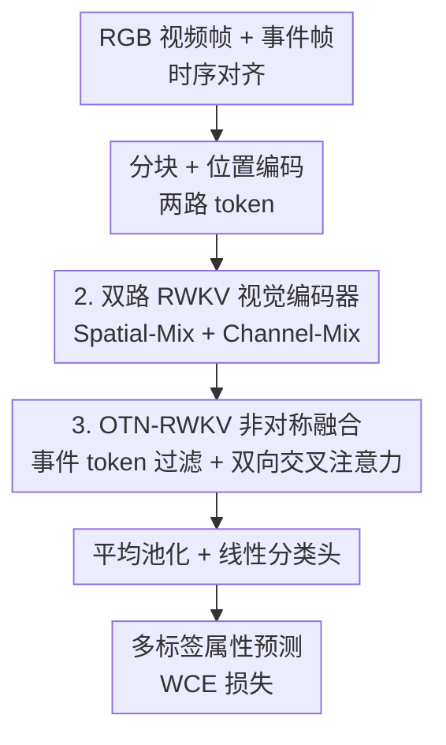

# RGB-Event based Pedestrian Attribute Recognition: A Benchmark Dataset and An Asymmetric RWKV Fusion Framework

**会议**: CVPR 2026  
**论文**: [CVF Open Access](https://openaccess.thecvf.com/content/CVPR2026/html/Wang_RGB-Event_based_Pedestrian_Attribute_Recognition_A_Benchmark_Dataset_and_An_CVPR_2026_paper.html)  
**代码**: https://github.com/Event-AHU/OpenPAR  
**领域**: 人体理解 / 行人属性识别  
**关键词**: 行人属性识别, RGB-Event 多模态, RWKV, 情绪属性, 基准数据集

## 一句话总结
本文首次提出 RGB-Event 多模态行人属性识别任务，构建了首个 10 万对 RGB-事件帧、含 6 类情绪属性的大规模数据集 EventPAR，并设计一个非对称 RWKV 融合框架（双路 RWKV 编码 + OTN-RWKV 事件 token 过滤与双向交叉融合），在三个数据集上取得 SOTA。

## 研究背景与动机

**领域现状**：行人属性识别（PAR）让模型从给定行人图像/视频中，从预定义属性列表里选出匹配项（发型、性别、上下身衣着、携带物等），广泛用于行人检测跟踪、行人重识别、文图检索。但现有 PAR 系统几乎全部基于 RGB 帧相机单模态。

**现有痛点**：其一，RGB 相机受光照敏感、背景杂乱、运动模糊等固有限制约束，性能上不去；多模态融合在其他视觉任务里早已普及，PAR 却仍死守单模态 RGB，是个明显的创新空白。其二，现有 PAR 基准定义的属性都只描述**可见外观线索**，没有一个考虑"不可见"的**情绪信息**——而识别焦虑、愤怒、喜悦等情绪对理解行人行为意图、提升安全与风险评估、做个性化服务都很重要。

**核心矛盾**：要补上模态空白就得有配对的 RGB-事件数据，但该领域**没有任何数据集**；要补上情绪维度也没有现成标注。无数据则无从训练和评测。

**本文目标**：（1）造一个大规模、多模态（RGB+Event）、含情绪属性、覆盖多场景/多季节、带退化与对抗噪声的基准数据集；（2）在其上重训主流 PAR 方法建立 benchmark；（3）设计一个能高效融合 RGB 空间特征与事件时序信息的框架。

**切入角度**：事件相机在高动态范围、高时间分辨率、低功耗、低光/高速场景上有天然优势，但事件流含噪声、对静态目标不敏感，因此必须与 RGB 帧互补而非替代。融合骨干选用 RWKV——它用线性复杂度的 WKV 注意力同时具备 Transformer 的并行性和 RNN 的时序建模能力，适合处理长序列视频 token。

**核心 idea**：用事件模态补 RGB 在复杂环境下的信息损失，靠一个**非对称**融合模块（事件 token 先过滤去冗余、再与 RGB 做双向交叉注意力）实现高效互补，并把情绪纳入属性识别。

## 方法详解

### 整体框架
给定时序对齐的 RGB 视频帧序列 $X_r\in\mathbb{R}^{T\times H\times W\times C}$ 和按曝光时间堆叠成的事件帧序列 $X_e$，先做分块 + 位置编码得到两路 token，分别送入 Visible-RWKV 与 Event-RWKV 编码器提取特征；两路特征进入 OTN-RWKV 非对称融合模块——事件侧先用相似度矩阵过滤掉冗余 token，只保留最具代表性的，再与 RGB token 做线性复杂度的双向交叉注意力融合；融合表征经平均池化 + 线性分类头输出多标签属性预测。

### 关键设计

**1. EventPAR 数据集：首个含情绪属性的大规模 RGB-Event 行人属性基准**

针对"没有 RGB-Event 配对数据、且无情绪标注"的空白，作者用 DVS346 事件相机采集**时空对齐**的可见光 + 事件双流，构建 EventPAR：10 万对 RGB-事件样本，12 个属性组、50 个细粒度属性，其中除常规外观属性外**首次纳入 6 类基本情绪**（高兴、悲伤、愤怒、惊讶、恐惧、厌恶）。数据跨季节（夏/冬）、跨场景、跨天气（白天/夜晚、晴/雨）采集数月，并人工注入多种噪声、遮挡和**对抗攻击**退化，模拟真实复杂环境；规模与 PA100K 相当，呈真实长尾分布。作者还在其上重训 17 个代表性 PAR 方法（CNN/Transformer/Mamba/人本预训练/视觉-语言模型五类）建立完整 benchmark，为后续研究提供数据与算法基线。

**2. 双路 RWKV 视觉编码器：用线性复杂度注意力分别编码 RGB 与事件**

两路 token 各自送入 Vision-RWKV 编码器（L 层块堆叠，每块含 Spatial-Mix + Channel-Mix）。Spatial-Mix 里 token 先做 Q-Shift（专为视觉设计的 token 位移，捕获局部上下文），再过三个线性层得到 $R_s,K_s,V_s$；用 Bi-WKV 双向注意力算出全局结果 $wkv=\text{Bi-WKV}(K_s,V_s)$，再用 $\sigma(R_s)\odot wkv$ 经输出投影得到 $O_i$（$i\in\{r,e\}$，$\sigma$ 为 sigmoid 门控）。随后 Channel-Mix 做通道维融合：$O'_i=(\sigma(R_c)\odot V_c)W_O$，其中 $V_c=\text{SquaredReLU}(K_c)W_V$，并用残差连接缓解梯度消失。选 RWKV 的动机是其 WKV 注意力是**线性复杂度**，比 Transformer 的二次复杂度更适合处理视频长 token 序列，消融里 RWKV 骨干也优于 ViT/ResNet-50。

**3. OTN-RWKV 非对称融合：先过滤冗余事件 token，再与 RGB 做双向交叉注意力**

这是框架核心、也是"非对称"的由来。痛点是事件相机异步成像导致事件帧含大量**冗余信息**，直接融合会增加计算负担、削弱辅助效果。OTN-RWKV 先对事件输出 $O'_e$ 用相似度矩阵挑出 top-K 最相似的 token 对、只保留最具代表性的：$O''_e=\text{KNPfilter}(\text{sim}(O'_e,O'_e))\odot O'_e$，过滤后两路 token 数量对齐。融合阶段不用简单的拼接/相加/1×1 卷积（它们会丢细粒度多模态细节），而是借鉴交叉注意力做线性复杂度的双向交互：

$$O_{fusion}=\sigma(R_s)\odot \text{LN}(K_s\odot \text{Bi-WKV})+O'_e$$

其中 Bi-WKV 是带相对位置衰减 $e^{-(|t-i|-1)/M\cdot v_s}$ 的双向注意力。与所借鉴的 LCR 不同，本文把其可学习向量 $w$ 替换为来自编码器的 $V_s$，让融合更聚焦当前样本。"非对称"体现在：事件 token 被过滤而 RGB 不过滤，两侧地位不对等地融合。消融显示 OTN-RWKV（mA 87.70）显著优于 Concat/Add/1×1Conv，且相似度聚合策略优于 Max/Mean/GNN 池化。

### 损失函数 / 训练策略
融合表征经平均池化 + 线性分类头得到属性预测 $P_{attr}$。训练用加权交叉熵损失（WCE）缓解属性长尾不均衡：

$$\mathcal{L}_{wce}=-\frac{1}{N}\sum_{i=1}^{N}\sum_{j=1}^{M}\omega_j\big(y_{ij}\log(p_{ij})+(1-y_{ij})\log(1-p_{ij})\big)$$

其中 $\omega_j$ 是第 $j$ 个属性的权重，$N$ 为样本数、$M$ 为属性数。

## 实验关键数据

### 主实验
在 EventPAR、MARS-Attribute、DukeMTMC-VID-Attribute 三个数据集上评测，指标为 mean Accuracy（mA）、Accuracy（Acc）、Precision、Recall、F1。后两个公共集仅含 RGB，故模拟生成对应事件数据保证公平。

EventPAR 上与代表性方法对比（节选）：

| 方法 | 发表 | mA | Acc | F1 |
|------|------|------|------|------|
| RethinkingPAR | arXiv20 | 81.37 | 80.84 | 86.93 |
| VTB | TCSVT22 | 88.41 | 83.83 | 88.53 |
| PromptPAR | TCSVT24 | 86.51 | 82.27 | 87.64 |
| SequencePAR | PR25 | 86.27 | 84.42 | 88.83 |
| **OTN-RWKV（仅 RGB）** | - | 79.32 | 76.00 | 83.22 |
| **OTN-RWKV（RGB+Event）** | - | **87.70** | **84.94** | **89.18** |

仅用 RGB 时本文表现一般（mA 79.32），**加入事件模态后 mA/Acc/F1 分别提升到 87.70/84.94/89.18**，跃居整体最佳——直接量化了事件数据对复杂环境鲁棒性的贡献。

跨数据集（MARS-Attribute / DukeMTMC-VID-Attribute，RWKV-B 骨干）：

| 数据集 | Acc | Prec | Recall | F1 |
|--------|------|------|--------|------|
| MARS-Attribute | **73.21** | **85.63** | 81.53 | **83.22** |
| DukeMTMC-VID-Attribute | **73.15** | **84.45** | 82.16 | **82.78** |

两个集上多数指标取得最佳，说明框架在不同数据环境下稳定可迁移。

### 消融实验
| 配置 | 关键指标(mA/Acc/F1) | 说明 |
|------|---------------------|------|
| RGB(1) + Event(5) | 87.70 / 84.94 / 89.18 | 完整最优设置 |
| 仅 RGB(1) | 79.41 / 76.22 / 83.27 | 单 RGB 受噪声拖累 |
| 仅 Event(5) | 87.14 / 84.52 / 88.91 | 单事件已很强 |
| RGB(3) + Event(5) | 85.97 / 81.91 / 86.61 | RGB 帧过多反而掉点 |
| 融合用 Concat | 87.63 / 84.60 / 88.96 | 弱于 OTN-RWKV |
| 融合用 1×1 Conv | 83.77 / 80.33 / 86.44 | 信息损失明显 |

### 关键发现
- **模态互补但 RGB 不是越多越好**：RGB 与 Event 单独都不错，组合更强；但 RGB 帧数从 1 增到 3/5 反而掉点（86.61/86.75），因为冗余和噪声加重了特征提取负担、削弱语义聚焦——这也反向印证了对事件 token 做过滤的必要性。
- **OTN-RWKV 融合 > 朴素融合**：相似度聚合 + 双向交叉注意力优于 Concat/Add/1×1Conv 和 Max/Mean/GNN 聚合。
- **RWKV 骨干 > ViT/ResNet-50**：同设置下 RWKV 的 mA/Acc/F1（87.70/84.94/89.18）领先，验证线性注意力骨干在 PAR 上的优势。

## 亮点与洞察
- **开任务 + 造数据 + 立基准三件套一次做齐**：首个 RGB-Event PAR 任务、首个含 6 类情绪属性的 10 万对数据集、17 个方法的 benchmark，奠基性强，后续工作有现成数据和基线可比。
- **把情绪纳入行人属性识别**是个被忽视的维度，对行为意图理解、安全风险评估有实际意义，可启发"人本感知"类任务扩展标注维度。
- **"非对称融合"思路可迁移**：当两个模态信息密度不对等（一密一稀/一稳一噪）时，对冗余侧先过滤再交叉融合，比对称拼接更高效——这套 token 过滤 + Bi-WKV 交叉的范式可搬到其他 RGB-Event/RGB-X 多模态任务。

## 局限与展望
- **公共集上的事件是模拟生成的**：MARS/DukeMTMC 的事件数据由 RGB 仿真而来，与真实 DVS346 采集存在域差，跨集结论的说服力受限。
- **情绪属性的标注主观性**：6 类情绪从视觉外观判定本身困难且主观，正文未讨论情绪子任务的单独精度和标注一致性，情绪识别的可靠性存疑（⚠️ 以原文为准）。
- **推理开销不低**：RGB+Event 版测试时间 361s、参数 201MB，远高于仅 RGB 版（68s/107MB），事件分支带来的成本与收益权衡在部署时需考量。
- **OTN-RWKV 的 top-K 过滤超参 K** 的敏感性、以及"OTN"具体含义正文交代有限，复现细节依赖代码。

## 相关工作与启发
- **vs 传统单模态 PAR（DeepMAR / RethinkingPAR / SequencePAR）**：它们只用 RGB，受光照/模糊限制且无情绪维度；本文引入事件模态补信息损失、并扩展情绪属性。
- **vs 朴素多模态融合（Concat / Add / 1×1Conv）**：这些方法兼容性强但丢细粒度细节；OTN-RWKV 先过滤冗余事件 token 再双向交叉注意力，保留细节且更鲁棒。
- **vs 其他 RWKV 视觉工作（RWKV-SAM / BSBP-RWKV）**：它们把 RWKV 用于分割等任务；本文是首个把 RWKV 用于行人属性识别，并提出非对称跨模态融合变体。

## 评分
- 新颖性: ⭐⭐⭐⭐ 首开 RGB-Event PAR 任务 + 情绪属性 + 非对称 RWKV 融合，任务和数据层面新意足；模型层面是已有组件的巧妙组合
- 实验充分度: ⭐⭐⭐⭐ 三数据集 + 17 方法 benchmark + 多角度消融较充分；公共集事件为模拟、情绪子任务无单独分析
- 写作质量: ⭐⭐⭐⭐ 数据集协议、框架和模块图清晰，贡献点交代明确
- 价值: ⭐⭐⭐⭐⭐ 奠基性数据集 + 基准，对推动事件相机行人感知有长期价值

<!-- RELATED:START -->

## 相关论文

- [\[CVPR 2026\] ImmerIris: A Large-Scale Dataset and Benchmark for Off-Axis and Unconstrained Iris Recognition in Immersive Applications](immeriris_a_large-scale_dataset_and_benchmark_for_off-axis_and_unconstrained_iri.md)
- [\[CVPR 2026\] EventGait: Towards Robust Gait Recognition with Event Streams](eventgait_towards_robust_gait_recognition_with_event_streams.md)
- [\[ECCV 2024\] Event-based Head Pose Estimation: Benchmark and Method](../../ECCV2024/human_understanding/event-based_head_pose_estimation_benchmark_and_method.md)
- [\[CVPR 2026\] IMU-HOI: A Symbiotic Framework for Coherent Human-Object Interaction and Motion Capture via Contact-Conscious Inertial Fusion](imu-hoi_a_symbiotic_framework_for_coherent_human-object_interaction_and_motion_c.md)
- [\[CVPR 2026\] OMG-Bench: A New Challenging Benchmark for Skeleton-based Online Micro Hand Gesture Recognition](omg-bench_a_new_challenging_benchmark_for_skeleton-based_online_micro_hand_gestu.md)

<!-- RELATED:END -->
