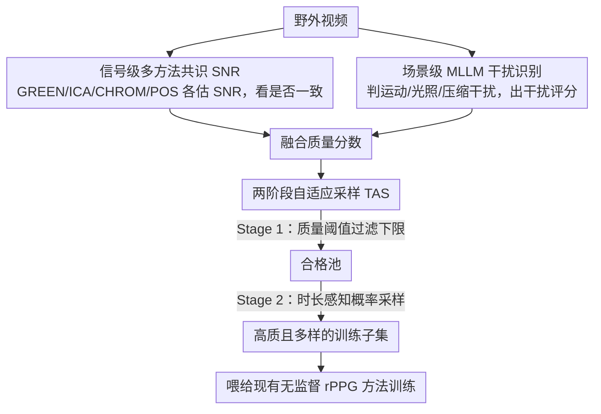

# rPPG-VQA: A Video Quality Assessment Framework for Unsupervised rPPG Training

**会议**: CVPR 2026  
**arXiv**: [2604.11156](https://arxiv.org/abs/2604.11156)  
**代码**: [https://github.com/Tianyang-Dai/rPPG-VQA](https://github.com/Tianyang-Dai/rPPG-VQA)  
**领域**: 人体理解  
**关键词**: 远程光体积描记, 视频质量评估, 无监督学习, 多模态大语言模型, 数据筛选

## 一句话总结
rPPG-VQA 提出首个面向远程心率检测（rPPG）的视频质量评估框架，结合信号级多方法共识 SNR 和场景级 MLLM 干扰识别，配合两阶段自适应采样策略筛选野外视频构建训练集。

## 研究背景与动机

**领域现状**：无监督 rPPG 旨在利用无标注视频数据学习非接触式心率检测，但研究主要集中在方法创新，忽略了数据质量问题。

**现有痛点**：(1) 野外视频中运动、光照等噪声可能淹没微弱的生理信号；(2) AI 生成视频完全缺乏真实生理基础；(3) 传统 VQA 评估人类感知质量，与 rPPG 需求脱节；(4) 单一 SNR 指标易被周期性非生理信号（如闪光灯）欺骗。

**核心矛盾**：视觉质量好的视频可能不含可提取的生理信号，而视觉质量差的视频可能仍包含有效信号——传统 VQA 无法区分。

**核心 idea**：双分支评估——信号级用多方法共识 SNR 排除方法偏差，场景级用 MLLM 识别运动/光照等干扰。

## 方法详解

### 整体框架
这篇论文要解决的不是"怎么训 rPPG 模型"，而是"喂给它的野外视频到底有没有可用的生理信号"。它把每段视频同时送进两条互补的分支：信号级分支用多种 rPPG 算法各自提取脉搏波、看它们是否一致地给出高信噪比；场景级分支让 MLLM 像人一样看画面、判断有没有运动/光照/压缩这类会破坏信号的干扰。两条分支的判断融合成一个统一的质量分数后，再交给两阶段自适应采样从海量未审查视频里挑出一批既高质又多样的子集，作为无监督 rPPG 的训练集。

### 关键设计

**1. 信号级多方法共识 SNR：用"多算法是否一致"代替单一 SNR 来判定信号真伪**

单看一个 SNR 指标很容易被骗——闪光灯、屏幕刷新这类周期性噪声会伪装成类心跳信号，让某个算法误报出很高的 SNR。这里的关键观察是：真正的生理脉搏对算法是"方法无关"的，GREEN、ICA、CHROM、POS 等基于不同色彩/盲源分离假设的传统方法，只要面对的是真血流信号，就该不约而同地给出高 SNR；而一段被周期性噪声污染的视频，往往只在某些算法下"碰巧"高、换个算法就垮。于是框架对每段视频跑多种算法、分别估 SNR，再看这组分数是否一致地高。一致才算可靠，分歧大就判为假阳性剔除——本质是用算法间的共识当作信号真实性的交叉验证。

**2. 场景级 MLLM 干扰识别：补上信号级指标看不到的场景上下文**

信号级分支只盯着提取出的波形，看不见画面里到底发生了什么，因此无法区分"信号本身弱"和"信号被场景干扰冲掉"这两种情况。场景级分支让 MLLM 直接看视频帧，做类人的场景推理：判断有没有不稳定光照、剧烈头部/相机运动、压缩伪影等会破坏脉搏提取的因素，并输出一个干扰评分。它弥补的正是 SNR 的盲区——有些视频信号级看着还行，但场景里的运动会让后续真训练时彻底失效；反过来也帮忙排除那些视觉上像人脸、实则缺乏真实生理基础的内容（如 AI 生成视频）。两条分支因此互补：一个查信号一致性，一个查场景可信度。

**3. 两阶段自适应采样（TAS）：先过滤再概率采样，兼顾质量与多样性**

如果只用质量分数做硬阈值过滤，留下的往往是一批"高质但同质"的视频，训练集会缺乏多样性。TAS 把选样拆成两步：Stage 1 先用质量阈值把明显低质的视频剔除，保证下限；Stage 2 在合格池里做时长感知的概率采样——不再非黑即白，而是按质量给采样概率、同时考虑视频时长，让高质视频更可能被选中但不至于把多样性挤掉。这样最终训练集在质量、多样性和数据规模/效率之间取得平衡，而不是单纯堆质量最高的少数样本。

### 损失函数 / 训练策略
框架本身不引入新的训练目标，而是把筛选出的子集喂给现有无监督 rPPG 方法（如 ContrastPhys、SiNC）照常训练，以此验证"数据质量筛选"这一环节本身带来的增益。

## 实验关键数据

### 主实验

| 采样策略 | PURE 测试集 HR MAE | 说明 |
|---------|-------------------|------|
| All（全部数据） | 高误差 | 低质量数据损害训练 |
| Random | 中等误差 | 随机采样好于全部 |
| rPPG-VQA | 最低误差 | 质量筛选效果显著 |

### 消融实验

| 配置 | HR MAE | 说明 |
|------|--------|------|
| 信号级+场景级 | 最优 | 双分支互补 |
| 仅信号级 | 次优 | 场景干扰遗漏 |
| 仅场景级 | 中等 | 信号质量评估缺失 |

### 关键发现
- 使用全部野外视频训练反而不如使用质量筛选后的子集
- 双分支互补效果明显，单一分支都有盲区
- TAS 策略在保证质量的同时维持了训练集的多样性

## 亮点与洞察
- **首次系统研究 rPPG 的数据质量问题**：填补了无监督 rPPG 中数据侧的空白
- **方法无关的信号质量度量**：利用多算法共识排除偏差，思路可迁移到其他信号处理任务

## 局限与展望
- MLLM 推理的计算成本较高
- 质量阈值的设定需要一定的人工调优
- 未来可探索端到端的质量感知训练框架

## 相关工作与启发
- **vs 传统 VQA (PSNR/SSIM)**: 面向人类感知，与 rPPG 需求脱节
- **vs 信号后验评估**: 需要先提取信号，无法预筛选原始视频

## 评分
- 新颖性: ⭐⭐⭐⭐ 首次系统解决 rPPG 数据质量问题
- 实验充分度: ⭐⭐⭐⭐ 多种采样策略对比充分
- 写作质量: ⭐⭐⭐⭐ 问题定义精准
- 价值: ⭐⭐⭐⭐ 解锁了无监督 rPPG 利用野外数据的能力

<!-- RELATED:START -->

## 相关论文

- [\[CVPR 2026\] Reference-Free Image Quality Assessment for Virtual Try-On via Human Feedback](reference-free_image_quality_assessment_for_virtual_try-on_via_human_feedback.md)
- [\[CVPR 2026\] AVATAR: Reinforcement Learning to See, Hear, and Reason Over Video](avatar_reinforcement_learning_to_see_hear_and_reason_over_video.md)
- [\[CVPR 2026\] GazeShift: Unsupervised Gaze Estimation and Dataset for VR](gazeshift_unsupervised_gaze_estimation_and_dataset_for_vr.md)
- [\[CVPR 2026\] From Intuition to Investigation: A Tool-Augmented Reasoning MLLM Framework for Generalizable Face Anti-Spoofing](from_intuition_to_investigation_a_tool-augmented_reasoning_mllm_framework_for_ge.md)
- [\[CVPR 2026\] Render-to-Adapt: Unsupervised Personal Adaptation for Gaze Estimation](render-to-adapt_unsupervised_personal_adaptation_for_gaze_estimation.md)

<!-- RELATED:END -->
