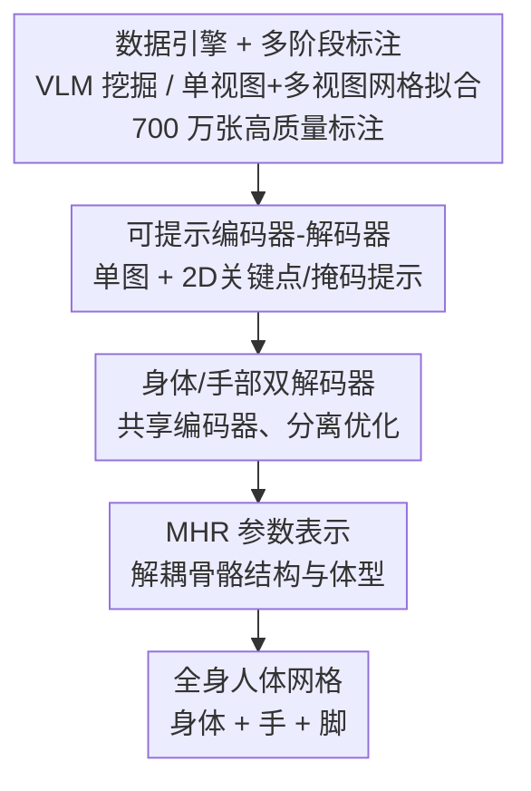

# SAM 3D Body: Robust Full-Body Human Mesh Recovery

**会议**: CVPR 2026  
**论文**: [CVF Open Access](https://openaccess.thecvf.com/content/CVPR2026/html/Yang_SAM_3D_Body_Robust_Full-Body_Human_Mesh_Recovery_CVPR_2026_paper.html)  
**代码**: 开源（论文称 3DB 与 MHR 均已开源）  
**领域**: 人体理解  
**关键词**: 人体网格恢复、提示式推理、全身姿态、数据引擎、MHR

## 一句话总结
SAM 3D Body（3DB）是一个 SAM 风格的可提示单图全身人体网格恢复模型：它用共享编码器 + 身体/手部双解码器架构，基于解耦骨骼与体型的 MHR 表示，配上一个能挖掘困难样本、产出 700 万张高质量标注的数据引擎，在野外图像上把身体和手部姿态同时做到 SOTA。

## 研究背景与动机

**领域现状**：从单张图像估计 3D 人体姿态（骨骼结构）和形状（软组织）是视觉与具身 AI 理解人、与人交互的基础能力。人体网格恢复（HMR）已有不少进展，主流靠 SMPL/SMPL-X 参数化模型，近年也从 body-only 转向 body+hands+feet 的全身方法。

**现有痛点**：现有方法在野外图像上鲁棒性不足——遇到挑战性姿态、严重遮挡、罕见视角时频繁失败，也很难在统一框架里既估准整体身体姿态、又估准手/脚的精细细节。作者把根因归到数据和模型两方面：（1）大规模、多样、带高质量网格标注的人体数据天生难收集且算力昂贵，现有数据集要么因实验室采集导致姿态多样性低，要么因伪标注导致网格质量差；（2）现有架构没有针对身体和手部姿态估计所需的不同优化机制做处理，也缺乏应对单目图像歧义的训练策略。

**核心矛盾**：身体和手部的优化目标本质冲突——它们在输入分辨率、相机估计、监督目标上都不同，硬塞进一个解码器会互相拖累；而 SMPL 这类表示又把骨骼结构和软组织质量纠缠在形状空间里，限制了可解释性和可控性。

**本文目标**：造一个在野外条件下鲁棒、身体和手部都准、且支持交互式引导的单图全身 HMR 模型，并为它配一套能规模化产出高质量多样数据的数据引擎。

**切入角度**：借鉴 SAM 家族的"可提示推理"思路——允许用户或下游系统用 2D 关键点/掩码作为提示来引导预测，这在歧义或挑战性场景里能自然地提供交互式指导。同时用解耦骨骼与体型的新表示 MHR 替代 SMPL。

**核心 idea**：用"可提示编码器-解码器 + 身体/手部双解码器 + MHR 表示"三件套解决模型侧问题，用"VLM 挖掘困难样本 + 多阶段网格拟合"的数据引擎解决数据侧问题，二者合力把全身 HMR 在野外做鲁棒。

## 方法详解

### 整体框架
3DB 的输入是一张人体裁剪图（可选附带手部裁剪图、2D 关键点提示、掩码提示），输出是 MHR 参数表示的全身人体网格（姿态、形状、相机、骨骼）。模型是一个**可提示编码器-解码器**：共享图像编码器把图编码成稠密特征，提示（2D 关键点、掩码）被编成额外 token；然后**身体解码器**和**手部解码器**分别用一组 query token 通过交叉注意力融合提示信息与视觉上下文，回归出 MHR + 相机参数，手部输出可合并进身体输出以精修手部。

这一切的前提是数据——作者用一个**数据引擎**先用 VLM 挖掘困难/信息量大的野外图像，再用**多阶段网格拟合**（单视图 + 多视图优化、稠密关键点检测）产出 700 万张高质量标注，作为模型训练的监督来源。整体可看成"数据引擎喂数据 → 可提示编码器-解码器 → 双解码器分工 → MHR 参数输出"。

### 关键设计

**1. 数据引擎 + 多阶段标注流水线：用 VLM 挖困难样本，自动产 700 万张高质量网格标注**

针对"高质量 3D 监督稀缺、野外数据集规模和多样性都不足"这个数据侧根因，作者造了一个半自动数据引擎。核心是 **VLM 驱动的挖掘策略**：VLM 从数千万张图里识别对姿态估计有挑战性的场景——遮挡、罕见姿态（杂技/舞蹈）、人物交互、极端尺度、低可见度（弱光/运动模糊）、手身协调（手语/运动）——把这些信息量最大的样本路由去标注，且挖掘规则会基于当前模型的失败分析迭代更新，自适应聚焦最难样本。挑出的图先用当前版 3DB 给初始 2D 关节，由标注员修正并按严格标准打可见性标签；再做**单视图网格拟合**——以 3DB 预测和高容量检测器产出的 595 个稠密 2D 关键点为目标，梯度优化 MHR 参数，损失含 2D 关键点重投影损失 $L_{\text{2D}}$、初始锚定正则（用 L2 惩罚偏离初始预测、防漂移）、姿态/形状先验（学习的高斯混合先验）。对多视图数据集还做**多视图拟合**：先三角化得稀疏 3D 关键点初始化网格，再用二阶优化联合拟合所有相机视角和帧，额外加 3D 关键点损失和时序平滑损失 $L_{\text{multi}}=\sum_k \lambda_k L_k$，跨帧联合优化体型。595 个稠密关键点被选为能捕捉多样体型和手势的"最小流形"，其检测器用迭代训练方案（先在 3D 数据上训、再投影 MHR 网格到稠密关键点做第二轮训练）训两遍。这套引擎让标注既高质量又多样。

**2. 可提示编码器-解码器：把 SAM 式交互引入 HMR，用提示消解单目歧义**

针对"单目图像歧义大、挑战场景下难估准"的痛点，3DB 借鉴 SAM 家族设计成可提示架构。图像经视觉骨干编成稠密特征 $F$，可选提示有两类：2D 关键点提示被位置编码加学习嵌入后作为额外 token 喂给姿态解码器；掩码提示经卷积嵌入后与图像嵌入逐元素相加。解码器吃一组 query token——包括 MHR+相机 token、2D 关键点提示 token、辅助 2D/3D 关键点 token、可选手部位置 token——这些 token 拼成完整 query $T=[T_{\text{pose}},T_{\text{prompt}},T_{\text{keypoint2D}},T_{\text{keypoint3D}},T_{\text{hand}}]$，通过交叉注意力 $O=\text{Decoder}(T,F)$ 把提示信息与视觉上下文融合。这种设计让模型既能全自动跑、也能在歧义/挑战场景下接受用户或检测器的提示做交互式引导，训练时也通过多轮随机采样提示来模拟交互式设置、增强鲁棒性。

**3. 身体/手部双解码器：共享编码器 + 分离解码，化解 body 与 hand 的优化冲突**

身体和手部姿态估计在输入分辨率、相机估计、监督目标上都不同，塞进单一解码器会互相冲突。3DB 用**共享图像编码器 + 两个独立解码器**：身体解码器输出全身人体 rig（已含手），手部解码器额外吃手部裁剪特征 $F_{\text{hand}}$ 给出精修手部输出 $O_{\text{hand}}$。手部位置 token $T_{\text{hand}}\in\mathbb{R}^{2\times D}$ 用于在身体解码器里定位手在图中的位置（可选，没有它身体解码器也能产全身）。推理时默认用身体解码器输出，检测到手就合并手部解码器结果——具体用手部解码器预测的腕部位置 + 身体解码器的肘部位置反过来提示身体解码器，生成精修的全身姿态，再按网格的运动学树合并成全身配置。这种分工让手部能享受专门的手部数据训练和自由活动的腕部预测头，同时不牺牲身体估计。

**4. MHR 表示：解耦骨骼结构与体型，替代纠缠的 SMPL**

3DB 不用主流的 SMPL，而是建在 **Momentum Human Rig（MHR）** 上——它是 ATLAS 的增强版，显式地把骨骼结构和体型解耦开（SMPL 把两者纠缠在形状空间里，限制可解释性和可控性）。模型回归的 MHR 参数 $\theta=\{P,S,C,Sk\}$ 分别是姿态、形状、相机位姿、骨骼。解耦带来更丰富的控制和可解释性；评测时为兼容 SMPL 基准，会把 MHR 网格映射到 SMPL 网格格式再比。这是 3DB 区别于绝大多数 SMPL-based 工作的表示层选择。

> ⚠️ 框架图四个节点（数据引擎 → 可提示编码器-解码器 → 双解码器 → MHR）与四个关键设计同序一一对应；末端"全身人体网格"为输出脚手架，已并入设计 4 交代。

### 损失函数 / 训练策略
模型训练用综合多任务损失 $L_{\text{train}}=\sum_i \lambda_i L_i$，每个 $L_i$ 针对特定预测头或解剖结构（2D/3D 关键点定位、MHR 参数回归、手部检测），$\lambda_i$ 经验设定。为稳定训练，部分损失项（如 3D 关键点）用 warm-up 调度逐步加权；训练时随机多轮采样提示模拟交互式设置。具体损失列在补充材料。训练数据是单视图 + 多视图 + 合成的混合（共约 700 万规模），含 MS COCO、MPII、3DPW、AIChallenger、SA-1B 子集（单视图野外），Ego-Exo4D、Harmony4D、Goliath、InterHand2.6M 等（多视图），以及 Goliath 的高保真合成扩展。

## 实验关键数据

### 主实验
在五个标准基准上与众多 SOTA 对比，报告 PA-MPJPE / MPJPE / PVE（毫米，越低越好）和 PCK@0.05（越高越好）。3DB 有两个变体：3DB-H 用 ViT-H（632M）骨干，3DB-DINOv3 用 DINOv3（840M）编码器。下表节选 3DB-H 与代表性单图方法（部分对比含视频方法）：

| 模型 | 3DPW PA-MPJPE ↓ | EMDB MPJPE ↓ | EMDB PVE ↓ | RICH PA-MPJPE ↓ | COCO PCK ↑ | LSPET PCK ↑ |
|------|-----------------|--------------|-----------|-----------------|-----------|-------------|
| HMR2.0b | 54.3 | 118.5 | 140.6 | 48.1 | 86.1 | 53.3 |
| CameraHMR | 35.1 | 70.3 | 81.7 | 34.0 | 80.5 | 49.1 |
| PromptHMR | 36.1 | 71.7 | 84.5 | 37.3 | 79.2 | 55.6 |
| NLF-L+fit | 33.6 | 68.4 | 80.6 | 28.7 | 74.9 | 54.9 |
| **3DB-H（本文）** | **33.2** | **62.9** | **74.3** | 31.9 | **86.8** | **68.9** |

3DB-H 超过所有单图方法，甚至能与额外利用时序信息的视频方法（WHAM/TRAM/GENMO）竞争；在域外（OOD）的 EMDB 和 RICH 上优势尤其明显（EMDB MPJPE 62.9 vs 次优 68.4），说明其野外泛化更强。

> 指标说明：MPJPE 为每关节平均位置误差，PA-MPJPE 为 Procrustes 对齐后的版本（消去全局旋转/平移/尺度），PVE 为每顶点误差，PCK@0.05 为在阈值内正确关键点占比；EMDB/RICH 对 3DB 是训练未见的域外数据集。

### 消融 / 用户研究
论文核心的人类偏好研究：7,800 名参与者的用户研究中，3DB 以约 **5:1 的胜率**被偏好。论文称这是首个单一模型既能达到身体专用模型的最佳性能、又能逼近手部专用模型性能，同时提供交互控制和强鲁棒性。

| 评估维度 | 结果 | 说明 |
|----------|------|------|
| 用户偏好（7800 人） | ~5:1 胜率 | 定性偏好显著领先先前方法 |
| 标准量化（5 基准） | 单图 SOTA | 身体 + 手部统一框架内最佳 |
| 域外泛化（EMDB/RICH） | 显著领先 | 训练未见数据集上提升最大 |

### 关键发现
- **域外泛化是最大亮点**：3DB 在 EMDB、RICH 这类训练未见数据集上提升最明显，印证"数据引擎挖困难样本 + 多阶段高质量标注"对野外鲁棒性的直接贡献。
- **身体与手部可兼得**：双解码器让单一模型同时达到身体专用 SOTA 和接近手部专用的性能，打破了"全身方法手部不如专用方法"的惯例。
- **交互提示带来鲁棒性**：可提示设计在歧义/挑战场景下能用 2D 关键点/掩码引导，配合训练时的多轮提示采样，提升了困难姿态下的稳定性。
- **更大骨干进一步受益**：3DB-DINOv3（840M）相对 3DB-H（632M）提供了额外的编码器容量选项。

## 亮点与洞察
- **把 SAM 的"可提示交互"范式迁移到 3D 人体恢复**：用 2D 关键点/掩码当提示 token 直接进 transformer，既能全自动又能人在环引导，这套思路对任何存在单目歧义的 3D 估计任务都可借鉴。
- **双解码器是"全身 + 手部都准"的关键工程解**：把 body 和 hand 的优化冲突（分辨率/相机/监督目标差异）用共享编码器 + 分离解码 + 腕肘互提示的方式化解，比强行统一一个头更务实。
- **数据引擎才是真正的护城河**：VLM 按失败分析迭代地挖困难样本 + 595 稠密关键点多阶段拟合，把"数据多样性和标注质量"这对老矛盾用自动化流水线同时拿下，700 万规模高质量标注是 SOTA 的底座。
- **换表示（MHR 替 SMPL）解耦骨骼与体型**：在表示层就把骨骼结构和软组织分开，为可解释、可控的全身重建提供了更干净的参数空间。

## 局限与展望
- **依赖大规模专有/授权数据**：700 万标注来自授权图库、多视图采集和合成数据，数据引擎和标注流水线复现成本高，外部团队难以完全复制其数据规模。
- **手部解码器依赖手部裁剪/检测**：精修手部需要手部裁剪特征和腕部定位，检测失败时手部增益受限；推理还依赖现成 FOV 估计器（MoGe-2）提供相机内参，引入外部模块误差。⚠️ 具体失败模式以原文/补充材料为准。
- **损失细节放在补充材料**：正文只给出多任务损失的高层结构，warm-up 调度和各 $\lambda_i$ 权重等关键训练细节未在主文充分披露，复现需查补充。
- **MHR 评测需映射回 SMPL**：为兼容现有 SMPL 基准要做网格格式映射，映射本身可能引入误差，跨表示比较的公平性需谨慎看待。

## 相关工作与启发
- **vs SMPL/SMPL-X 系**：主流 HMR 建在 SMPL 上、骨骼与软组织纠缠；3DB 改用 MHR 显式解耦骨骼结构与体型，可解释性和可控性更好。
- **vs body-only 方法（HMR 2.0）**：早期方法只估身体、不含 articulated 手脚；3DB 走全身路线，且在统一前馈框架里把手部也做到接近专用方法水平。
- **vs 手部专用方法**：手部专用模型通常比全身方法更准，3DB 靠双解码器 + 手部数据缩小了这一差距，做到"一个模型两头都强"。
- **vs PromptHMR 等可提示工作**：同样支持 2D 关键点/掩码提示，但 3DB 把提示 token 直接整合进 transformer，并配合双解码器和 MHR，在域外数据集上取得更强泛化（EMDB MPJPE 62.9 vs PromptHMR 71.7）。

## 评分
- 新颖性: ⭐⭐⭐⭐ 可提示 + 双解码器 + MHR 的组合务实有效，单点创新不极端但工程整合到位
- 实验充分度: ⭐⭐⭐⭐⭐ 五基准量化 + 7800 人用户研究 + 域外泛化分析，证据链扎实
- 写作质量: ⭐⭐⭐⭐ 数据/模型双线动机清晰，但部分损失与训练细节甩给补充材料
- 价值: ⭐⭐⭐⭐⭐ 开源模型 + MHR，野外鲁棒全身 HMR 对机器人/具身/生物力学落地价值大

<!-- RELATED:START -->

## 相关论文

- [\[CVPR 2026\] MetricHMSR: Metric Human Mesh and Scene Recovery from Monocular Images](metrichmsr_metric_human_mesh_and_scene_recovery_from_monocular_images.md)
- [\[CVPR 2026\] PAMotion: Physics-Aware Motion Generation for Full-Body Interaction with Multiple Objects](pamotion_physics-aware_motion_generation_for_full-body_interaction_with_multiple.md)
- [\[CVPR 2026\] ViBES: A Conversational Agent with Behaviorally-Intelligent 3D Virtual Body](vibes_a_conversational_agent_with_behaviorally_intelligent_3d_virtual_body.md)
- [\[CVPR 2026\] Occluded Human Body Capture with Frequency Domain Denoising Prior](occluded_human_body_capture_with_frequency_domain_denoising_prior.md)
- [\[CVPR 2026\] AudioAvatar: Personalized Audio-driven Whole-body Talking Avatars](audioavatar_personalized_audio-driven_whole-body_talking_avatars.md)

<!-- RELATED:END -->
