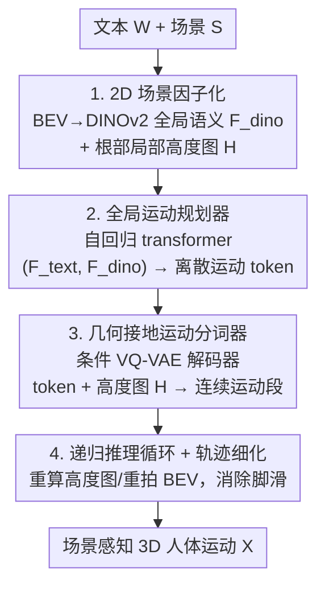

# SceMoS: Scene-Aware 3D Human Motion Synthesis by Planning with Geometry-Grounded Tokens

**会议**: CVPR 2026  
**论文**: [CVF Open Access](https://openaccess.thecvf.com/content/CVPR2026/html/Ghosh_SceMoS_Scene-Aware_3D_Human_Motion_Synthesis_by_Planning_with_Geometry-Grounded_CVPR_2026_paper.html)  
**代码**: https://anindita127.github.io/SceMoS  
**领域**: 人体理解  
**关键词**: 场景感知运动合成, 人-场景交互, BEV, 高度图, 几何接地分词  

## 一句话总结
SceMoS 用两种轻量级 2D 场景线索取代昂贵的 3D 体素/点云监督——鸟瞰图 DINOv2 特征做全局语义规划、局部 2D 高度图把表面物理直接焊进运动 token 词表，从而在 TRUMANS 上达到 SOTA 的运动真实度与接触精度，同时把场景编码的可训练参数砍掉一个数量级（约 4M vs 约 50M）。

## 研究背景与动机
**领域现状**：文本驱动的场景感知人体运动合成（HSI）既要懂语义意图（"走到沙发那"），又要满足物理可行（不能穿过家具）。现有方法多用统一的生成框架同时学高层规划与低层接触推理，并依赖昂贵的 3D 场景表示——体素占据格、点云、SDF。

**现有痛点**：场景表示存在两难——场景级表示要么笨重要么缺细节、撑不起精细接触推理；而点云/体素这类密集 3D 格式计算昂贵、难以扩展到完整场景。体素格的立方级内存复杂度、点云的无结构性，都迫使方法上重型 3D backbone（体素 CNN、transformer）仅仅为了"看懂"场景，对以近表面交互为主的任务引入了大量冗余空间细节。

**核心矛盾**：现有方法被迫在**单一纠缠的生成过程里**同时学三件事——感知复杂几何、规划空间意图、执行精细运动。在真实嘈杂无标注的场景里，运动既要语义符合文本（"坐到沙发上"）又要物理贴合几何（不穿家具走过去），这个双重要求让"泛化能力"和"效率"持续冲突。

**本文目标**：在不依赖密集 3D 体积输入的前提下，生成既语义连贯、又物理合规的长程目标导向人体运动。

**切入角度**：人和环境交互主要靠两类互补的 2D 信息——全局布局线索指导空间推理、局部几何线索指导物理接触。据此把"全局规划"和"局部执行"显式拆开，两层都只用轻量 2D 表示。

**核心 idea**：用"BEV 语义（全局）+ 局部高度图（接触）"这套 2D 分解替代全 3D 监督，并把场景几何直接编码进离散运动 token 词表。

## 方法详解

### 整体框架
人体运动表示为 $N$ 帧 SMPL-X 姿态序列 $X=\{x_i\}$，每帧 $x_i$ 含根平移偏移、6D 关节朝向、根不变局部关节偏移、关节速度、四维足-地接触指示。给定文本指令 $W$（经 T5 编码为 $F_{text}$）和场景 $S$，模型学映射 $\mathcal{G}:(F_{text}, F_{dino}, H)\to X$。整体分两阶段：① **全局运动规划器**——一个自回归 transformer 在文本 $F_{text}$ 与 BEV 图的 DINOv2 特征 $F_{dino}$ 条件下，逐 token 预测离散运动 token 序列 $\{z_i\}$；② **几何接地运动分词器**——一个条件 VQ-VAE，其解码器额外吃局部 2D 高度图 $H$，把每个 token 解码回连续运动段。推理时用一个递归循环：每解一段就以新根位置重算高度图、重拍 BEV，从而把长程轨迹拼起来；末尾再过一个轨迹细化模块消除脚滑。

### 关键设计

**1. 2D 场景因子化：用 BEV 语义 + 局部高度图取代密集 3D**

针对"密集 3D 表示昂贵又冗余"的痛点，作者把场景用两种互补 2D 模态表示。**全局**侧：从场景一个抬高的角落渲染单张鸟瞰 RGB 图 $I_{bev}$（相机指向角色起点以减少遮挡），抽取 DINOv2 patch 特征序列 $F_{dino}$——它捕捉空间布局（哪些区域可走）与主要物体的语义位置（"沙发""桌子"相对角色起点在哪），且计算高效，与现有大体素格形成鲜明对比。**局部**侧：在第 $i$ 帧以根关节为中心、按身体前向定向，提取一张 $g\times g$ 的 2D 高度图 $H$，覆盖角色根关节周围预定范围。这种表示天然支持因果自回归——它由上一个 token 末尾的场景状态算出。两种线索一个管"去哪/做什么"、一个管"脚踩多高",既保留必要空间几何又避开 3D 体积推理的冗余与成本。

**2. 全局运动规划器：把长程运动建成离散空间里的自回归 token 预测**

针对"长程目标导向运动既要语义连贯又要空间合理"的需求，作者把它建模成离散运动空间的自回归 token 预测。一个 $L=8$ 层、8 头的因果 transformer $G$ 在压缩的视觉+文本线索（$F_{dino}$、$F_{text}$）上工作，建模条件分布 $P(z_i\mid z_{<i}, F_{text}, F_{dino})$，每步从类别分布采样 $z_i'=\arg\max_{z_i} P(z_i\mid z_{<i},F_{text},F_{dino})$，逐 token 拼出尊重语义意图与场景布局的高层运动计划。每个输入 token 由"学习嵌入 + 位置编码 + 条件向量 $F_{text}/F_{dino}$ 的线性投影"拼接而成。训练用交叉熵最大化真值 token 的对数似然 $L_{plan}=-\sum_i\log P(z_i=z_i^*\mid\cdot)$，并以固定概率随机丢弃 $F_{text}/F_{dino}$ 做无分类器引导（CFG），使推理时可调条件强度。把规划放在离散 token 空间，使长时序连贯与文本对齐都更稳。

**3. 几何接地运动分词器：把表面物理焊进 VQ-VAE 的 token 词表**

针对"运动 token 若与场景无关，落到真实环境就会违反接触/穿模"的痛点，作者训一个**条件** VQ-VAE 学码本 $C=\{c_k\}_{k=1}^K$（$K=1024$，维度 $D_z=512$）。编码器 $E$ 把运动序列下采样为隐序列 $Z=E(X)$，每个 $z_i$ 量化到码本最近邻得 $Z_q$。与标准运动 VQ-VAE 不同，交互解码器 $D$ 被显式条件在局部场景几何上：$\hat X = D(Z_q, H)$，其中 $H$ 是上一个 token 末姿对应的局部高度图（保证因果与自回归一致）。这迫使离散 token 不只编码运动学模式、还编码**几何特定**的运动行为——比如不再是泛泛的"弯膝"token，而是"弯膝以接触高度为 $h$ 的表面"。训练时解码器只有当所选 token 在给定 $H$ 下物理兼容才能压低重建损失，于是局部接触物理被直接嵌进 token 空间。总损失 $L_{VQ}=\lambda_{rec}L_{rec}+\beta\|\mathrm{sg}[Z_q]-Z\|_2$（$L_{rec}$ 覆盖关节位置/朝向/速度/足接触），用 EMA 更新 + reset 机制防码本坍缩。

**4. 递归推理循环 + 轨迹细化：拼接长程并消除脚滑**

针对"单段生成无法覆盖长程、且根轨迹估计残差会带来脚滑"的问题，作者设计递归推理。推理时把 $F_{text}$、$F_{dino}$ 作前缀喂给规划器 $G$ 自回归采样 token 序列，每个 token 经交互解码器解成连续运动段；解当前 token 用的局部高度图从**更新后的场景状态**重算（以上一段末帧根位置为中心）。每生成一段就重拍一张新 BEV、重算高度图，让规划器随场景演化无缝延展长程轨迹。此外用一个轻量轨迹细化模块 $R$ 从局部运动特征 $x^{local}_i=[j_r,j_p,j_v,c_f]_i$ 预测平滑后的根速度 $\hat t_{\delta,i}=R(x^{local}_i)$，用 L1 损失 $L_{traj}=\lambda_r\|t_\delta-\hat t_\delta\|_1+\lambda_v\|\Delta t_\delta-\Delta\hat t_\delta\|_1$ 训练，推理时用细化轨迹替换原始根轨迹，显著减少脚滑、改善接触一致性。

### 损失函数 / 训练策略
VQ-VAE 训约 5K epoch（约 70 万迭代），Adam，基础学习率 $10^{-5}$，batch 128，$\lambda_{rec}=1.0,\beta=0.1$；输入 $N=80$ 帧、下采样率 4 得 $\hat n=20$ 个 token；高度图 grid size 32、半径 ±0.6m。规划器 transformer 8 层 8 头、hidden 512，序列 20 token，batch 32（V100）。$F_{dino}$ 维度 768/49 patch，$F_{text}$ 维度 1024。VQ-VAE 阶段约 98 小时收敛、规划阶段约 75 小时，完整推理生成 80 帧约 8 秒。

## 实验关键数据

### 主实验
在 TRUMANS（15 小时 SMPL-X 人体运动、100 个室内场景，按官方划分 1–70 训练 / 71–80 验证 / 81–100 测试）上评估。指标：FID↓（运动真实度）、Div→（多样性，越接近真值越好）、PFC↓（物理足接触合理性）、Cont.↑（接触分）、Penetration↓（穿模均值/最大）。

| 方法 | 场景表示 | 场景参数 | FID↓ | PFC↓ | Cont.↑ | 穿模(均值/最大)↓ |
|------|----------|---------|------|------|--------|------|
| TRUMANS | 体素 3D 占据格 | ~86M | 0.34 | 0.58 | 0.98 | 1.83 / 11.75 |
| TeSMo | 2D 地图+3D 点云 | ~35M | 0.48 | 0.65 | 0.92 | 2.11 / 11.98 |
| Humanise | 3D 点云 | ~55M | 0.82 | 1.21 | 0.96 | 1.95 / 14.37 |
| SceneDiffuser | 3D 点云 | ~55M | 0.75 | 1.09 | 0.91 | 1.71 / 17.49 |
| **SceMoS** | BEV 图 + 2D 高度图 | **~4M** | **0.31** | 0.61 | **0.98** | **1.81 / 11.12** |

SceMoS 取得全场最低 FID（0.31）与最高接触分（0.98），与用体素 3D、场景编码参数高一个数量级的 TRUMANS 持平甚至更优，而它的场景可训练参数仅约 4M（< 5M）。

### 消融实验
VQ 重建质量（MPJPE/MPJVE 单位 mm）消融，验证"加场景几何"与各设计选择：

| 变体 | MPJPE↓ | MPJVE↓ | Cont.↑ | 穿模(均值/最大)↓ |
|------|--------|--------|--------|------|
| A1: 场景无关 VQ-VAE | 25.89 | 15.98 | 0.86 | 4.43 / 18.91 |
| A2a: 高度图 16×16 | 21.48 | 11.02 | 0.98 | 2.12 / 15.01 |
| A2b: 高度图 64×64 | 22.56 | 10.99 | 0.97 | 1.88 / 14.21 |
| A3: 体素占据格 | 21.32 | 12.39 | 0.92 | 3.88 / 16.95 |
| A4a: FiLM 调制融合 | 27.89 | 15.66 | 0.91 | 2.12 / 14.89 |
| A4b: 交叉注意力融合 | 22.86 | 13.24 | 0.97 | 2.25 / 15.01 |
| A7: 去轨迹细化 | 26.89 | 15.57 | 0.79 | 2.78 / 15.56 |
| **场景感知 VQ-VAE (ours, 32×32)** | **21.88** | **10.45** | **0.99** | **1.83 / 14.23** |

（运动生成侧另有 A5 单阶段 transformer FID 升到 0.78、A6 用 CLIP 替 DINOv2 FID 0.81，均明显变差。）

### 关键发现
- **加局部几何 = 大幅提升真实度**：从场景无关 A1 到 32×32 高度图，MPJPE 25.89→21.88、MPJVE 15.98→10.45，接触 0.86→0.99、穿模 4.4/18.9→1.8/14.2，说明轻量局部几何让码本学到"贴地"运动、压住穿模。
- **两阶段拆分是关键**：去掉规划/解码分离的单 transformer（A5）FID 显著退化，证明"全局规划 vs 局部执行"显式因子化的价值。
- **2D 够用、3D 冗余**：把高度图换成 3D 体素（A3）MPJPE 略好但 MPJVE 与穿模反而更差——近表面交互不需要密集体积输入。
- **融合方式与 backbone 很重要**：简单特征拼接优于 FiLM/交叉注意力（后者扰乱量化、增穿模）；DINOv2 语义明显优于 CLIP。32×32 是高度图分辨率的最佳折中（更粗丢细节、更密增噪声）。

## 亮点与洞察
- **用"对的 2D 投影"替代 3D 监督**：BEV 管全局语义、局部高度图管接触物理，两张 2D 图就拿下与体素法持平的效果且参数砍一个数量级——核心洞察是"近表面交互任务本就不需要密集体积细节"。
- **把物理焊进 token 词表**：让 VQ-VAE 解码器条件在高度图上，使每个离散 token 编码"在高度 $h$ 表面上弯膝接触"这种几何特定语义，而非泛泛动作——这是把场景几何嵌入离散运动表示的可复用范式。
- **因果高度图设计**：高度图从上一 token 末姿的场景状态算出，天然契合自回归生成、支持递归重算以延展长程轨迹，思路可迁移到其他需要"边走边感知"的具身任务。

## 局限与展望
- 假设**静态场景**，且面向宏观全身交互（坐、走）；精细物体操作（灵巧手-物接触）仍难，因高度图为大尺度几何设计、不刻画手部 affordance。
- 2D 线索为室内调优，扩展到**室外**不平地形/重遮挡需在多样室外数据上重训全局规划器。
- 推理仍有中等延迟（80 帧约 8 秒），源于迭代规划与高度图重算；作者提出自适应高度图缩放、动态场景感知作为提速方向。
- 强依赖 TRUMANS 单一基准，跨数据集泛化未充分验证；BEV 渲染相机位姿（抬高角落）也是需人为设定的先验。

## 相关工作与启发
- **vs TRUMANS**: TRUMANS 用体素 3D 占据格 + ViT-B 编码器（~86M 场景参数）做自回归扩散；SceMoS 用 2D BEV+高度图（~4M）拿到更低 FID（0.31 vs 0.34）与同等接触，证明轻量 2D 足以匹敌密集 3D。
- **vs TeSMo**: TeSMo 用 2D 地图作中层代理但仍配 3D 点云、走扩散路线；SceMoS 全程 2D 且把几何接地进离散 token，参数更少、接触更稳。
- **vs SceneDiffuser / Humanise**: 二者分别基于点云扩散、语言条件 cVAE，场景编码 ~55M；SceMoS 在 FID、接触、穿模上全面更优且场景参数低一个量级。
- **vs T2M-GPT / MoMask 类 token 化文生动**: 这些方法在场景无关运动上做 VQ-VAE+GPT；SceMoS 把该范式扩到场景感知，引入几何接地分词，弥合语言意图与物理交互的鸿沟。

## 评分
- 新颖性: ⭐⭐⭐⭐⭐ "2D 场景因子化 + 几何接地 token"是对 HSI 场景表示的清晰反共识贡献。
- 实验充分度: ⭐⭐⭐⭐ 主表+两张消融表覆盖表示/融合/分辨率/backbone，消融详尽；但仅 TRUMANS 单基准、跨数据集验证不足。
- 写作质量: ⭐⭐⭐⭐⭐ 动机—方法—消融逻辑顺畅，2D 因子化的直觉讲得很清楚。
- 价值: ⭐⭐⭐⭐⭐ 参数砍一个数量级仍 SOTA，对动画/VR/具身的可部署性强。

<!-- RELATED:START -->

## 相关论文

- [\[CVPR 2026\] SyncMos: Scalable Motion Synchronisation for Multi-Agent Scene Interaction](syncmos_scalable_motion_synchronisation_for_multi-agent_scene_interaction.md)
- [\[CVPR 2026\] HSI-GPT2: A Dual-Granularity Large Motion Reasoning Model with Diffusion Refinement for Human-Scene Interaction](hsi-gpt2_a_dual-granularity_large_motion_reasoning_model_with_diffusion_refineme.md)
- [\[CVPR 2026\] MetricHMSR: Metric Human Mesh and Scene Recovery from Monocular Images](metrichmsr_metric_human_mesh_and_scene_recovery_from_monocular_images.md)
- [\[CVPR 2026\] RAM: Recover Any 3D Human Motion in-the-Wild](ram_recover_any_3d_human_motion_in-the-wild.md)
- [\[CVPR 2026\] ParTY: Part-Guidance for Expressive Text-to-Motion Synthesis](party_part-guidance_for_expressive_text-to-motion_synthesis.md)

<!-- RELATED:END -->
