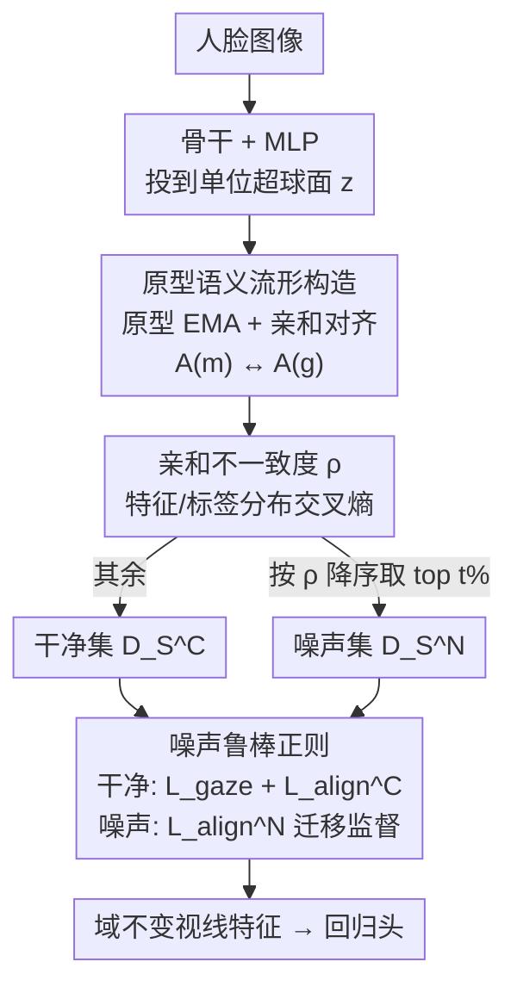

# See Through the Noise: Improving Domain Generalization in Gaze Estimation

**会议**: CVPR 2026  
**arXiv**: [2604.16562](https://arxiv.org/abs/2604.16562)  
**代码**: 待确认  
**领域**: 人体理解 / 视线估计 / 域泛化  
**关键词**: 视线估计, 域泛化, 标签噪声, 语义流形, 噪声鲁棒正则

## 一句话总结
SeeTN 首次把"视线估计跨域泛化差"归因到源域标签噪声，通过原型构造的语义流形对齐特征与连续标签的亲和关系来识别噪声样本，再对干净/噪声样本分别施加正则把干净监督迁移给噪声样本，在四个跨域设置上把角度误差降低 12–18% 且不牺牲源域精度。

## 研究背景与动机

**领域现状**：基于外观的视线估计（appearance-based gaze estimation）用 CNN 从人脸/眼部图像回归 3D 视线方向，已在受控环境下做得很好。但模型部署到未见域（不同相机、光照、头姿）时性能骤降，所以近年大量工作聚焦"跨域泛化"，靠对抗学习、对比学习、一致性约束等手段去学习域不变（domain-invariant）表征。

**现有痛点**：这些泛化方法几乎都默认源域标签是干净的，忽略了视线数据集里普遍存在的**标签噪声**。视线标注本身极难精确——人的注意力不稳定、光照/头姿/遮挡多变，导致 Gaze360 等常用数据集里有相当比例的标签明显偏离真实视线方向。作者做了预实验：往 Gaze360 标签注入标准差 60° 的高斯噪声，跨域到 MPIIGaze 的误差从 7.94° 涨到 20% 噪声下的 12.17°、30% 噪声下的 14.38°——噪声越多，泛化越垮。

**核心矛盾**：直接搬运分类领域的噪声标签学习（LNL）方法救不了，因为这里有两个本质难点。其一，视线是**回归任务**：标签噪声不是离散的类别错分，而是连续偏移，特征空间也没有清晰的簇，分类常用的 small-loss 选择、转移矩阵估计都不可靠，无法画出干净/噪声的清晰边界。其二，跨域场景下**单纯纠正标签也不够**——纠错只是提升源域内的标签质量，并不能弥合源域和目标域之间的分布鸿沟。

**本文目标**：在不访问任何目标域数据的前提下，同时解决"回归任务下的噪声识别"和"跨域泛化"两个问题。

**切入角度**：作者的关键观察是——视线角度是连续的，相似的标签应当对应相似的特征，这种"标签亲和关系 ↔ 特征亲和关系"的拓扑一致性，本身就是一个不依赖单样本绝对标签的、鲁棒的监督信号。如果某个样本在标签空间和特征空间里的"邻居关系"对不上，它大概率就是噪声样本。

**核心 idea**：构造一个语义流形把连续视线标签和特征绑在一起，用"特征-标签亲和不一致度"当噪声探测器，再对干净/噪声样本分别正则、把干净样本的视线语义迁移到噪声样本上，从而既滤噪又学到域不变特征。

## 方法详解

### 整体框架

SeeTN（See-Through-Noise）要解决的是"源域含噪标签拖垮跨域泛化"。它不去逐个纠正标签，而是建立一套基于**样本间相对关系**的语义结构：把骨干网络提取的特征 $f$ 经 MLP 投到单位超球面得到 $z$，用一组可学习原型 $\mu_k$ 把 $z$ 张成语义流形 $\mathcal{M}$；在流形上算特征亲和矩阵 $A^{(m)}$ 并对齐标签亲和矩阵 $A^{(g)}$，使"相似标签→相似特征"的拓扑被显式保留。基于这个流形，用特征分布与标签分布的交叉熵不一致度 $\rho$ 把每个 epoch 的样本排序、按比例切成噪声集 $D_S^N$ 和干净集 $D_S^C$；最后对两者分别施加正则——干净样本直接用标签监督、噪声样本则靠流形亲和把干净监督迁移过来。推理时只用骨干 + 回归头，所有流形/正则机制都退场，零额外开销。

整个流程是"建流形 → 切干净/噪声 → 分别正则"的三段串行管线：

### 关键设计

**1. 原型语义流形构造：用相对关系把连续标签绑进特征空间**

针对的痛点是回归常用的 MAE 损失只盯着单样本的数值精度，完全不管特征/标签空间的语义结构——结果标签相近的样本，特征却散落在空间各处，特征-标签的语义对应被破坏，更别提识别噪声。SeeTN 显式构造语义流形 $\mathcal{M}$ 来强化这种对应：先把特征投到单位超球面 $z = \mathrm{Norm}(\mathrm{MLP}(f))$ 以突出视线语义、抑制无关信息；再在超球面上随机初始化 $K$ 个原型 $\mu_k$ 作为流形基向量，用 EMA 把原型逐步推向特征中心，

$$r = \mathrm{Softmax}(z\,\mu^T/\tau), \qquad \mu_k \leftarrow \tau\mu_k + (1-\tau)\frac{\sum_i r_{i,k} z_i}{\sum_i r_{i,k}}$$

其中 $r\in\mathbb{R}^{B\times K}$ 是 $z$ 对各原型的软分配，EMA 动量取 0.95。样本在流形上的表示 $p = z\,\mu^T$。关键在于约束流形拓扑要和标签空间一致：用余弦相似度算流形特征亲和 $A^{(m)}_{i,j}=\frac{p_i\cdot p_j}{\|p_i\|\|p_j\|}$ 和标签亲和 $A^{(g)}_{i,j}=\frac{y_i\cdot y_j}{\|y_i\|\|y_j\|}$，再最小化 $|A^{(m)}-A^{(g)}|$。这等于强迫"标签上谁和谁像，特征流形上也得谁和谁像"，为后续噪声筛选和鲁棒学习打下结构基础。之所以有效，是因为它绕开了"给单个连续标签定噪声边界"这个回归难题，转而用**成对相对关系**这个更稳的量。

**2. 亲和不一致度 ρ：回归任务专用的噪声探测器**

分类里靠交叉熵 small-loss 选干净样本，回归里行不通。SeeTN 借语义流形把"亲和不一致"量化成可比较的分布。把流形亲和矩阵的行向量归一化成分布 $\hat y^{(m)}_i=\mathrm{Softmax}(A^{(m)}_{i,:})$（样本 $x_i$ 在特征流形里相对其他样本的关系分布），同理 $\hat y^{(g)}_i=\mathrm{Softmax}(A^{(g)}_{i,:})$ 是标签空间里的关系分布。两者的交叉熵就是噪声指示器：

$$\rho_i = -\sum_{j=1}^{B}\hat y^{(g)}_{i,j}\log \hat y^{(m)}_{i,j}$$

直觉是：噪声样本在标签空间的"邻居关系"和特征空间的"邻居关系"会对不上，$\rho$ 越大越可能是噪声。划分时把所有样本按 $\rho$ 降序排，取 top $t\%$ 当噪声集 $D_S^N$，其余当干净集 $D_S^C$；并且**每个 epoch 训练前用更新后的 $\rho$ 重新划分**，以缓解确认偏置（confirmation bias），避免一次划错就一路错下去。消融里把 $\rho$ 换成 L1-loss 判据后性能明显变差（如 $D_E\!\to\!D_M$ 7.73° vs 6.58°），说明这个基于成对关系的探测器比单样本 loss 更可靠。

**3. 噪声鲁棒正则：干净样本严格监督、噪声样本迁移监督**

切完干净/噪声后，SeeTN 对两者用不同强度的约束。干净集标签可信，直接监督视线回归 $L_{gaze}=\frac{1}{B_C}\sum_{x_i\in D_S^C}|g(x_i)-y_i|$，同时用刚性 MAE 对齐流形亲和 $L^C_{align}=\frac{1}{B_C(B_C-1)}\sum_{i\neq j}|A^{(g)}_{i,j}-A^{(m)}_{i,j}|$，精确锚定语义结构。噪声集标签不可信，丢掉又浪费信息，于是不用其标签、改用**由干净样本监督出来的流形亲和 $A^{(m)}$ 去约束噪声样本的特征亲和** $A^{(f)}_{i,j}=\frac{f^N_i\cdot f^C_j}{\|f^N_i\|\|f^C_j\|}$（噪声样本与干净样本之间的特征相似度），

$$L^N_{align} = -\frac{1}{B_N}\sum_{x_i\in D_S^N}\frac{A^{(f)}_{i,:}\cdot A^{(m)}_{i,:}}{\|A^{(f)}_{i,:}\|\|A^{(m)}_{i,:}\|}$$

注意这里用的是**行向量余弦相似**的软对齐，而非干净集那种逐元素 MAE 的硬对齐——目的是只精修噪声样本与干净样本之间的成对关系、把干净的视线语义"传染"过去，同时保留特征在高维空间里的可分性，不强行把噪声样本拉到某个具体标签上。这一软一硬的差别正是设计精髓：干净样本要"准"，噪声样本只要"关系对"。

### 损失函数 / 训练策略

总损失为 $L_{al}=L_{gaze}+L^C_{align}+\lambda\,L^N_{align}$，其中权重 $\lambda=0.1$（⚠️ 原文公式 12 处权重记号略有歧义，以原文为准）。骨干用 ResNet-18 / ResNet-50，Adam，学习率 1e-4；Gaze360 训 100 epoch、ETH-XGaze 训 10 epoch；前期分别 warm-up 10 / 2 个 epoch 先得到可靠的 $\rho$ 再开始划分。原型数 $K=12$，batch size 128。推理时只跑骨干 + 回归头。

## 实验关键数据

四个数据集：ETH-XGaze（$D_E$）、Gaze360（$D_G$）、MPIIFaceGaze（$D_M$）、EyeDiap（$D_D$），以 $D_E$、$D_G$ 分别作源域，其余作目标域，指标为平均角度误差（°，越低越好）。

### 主实验

不同骨干上即插即用的提升（节选自 Tab. 1）：

| 设置 | ResNet-18 | +SeeTN | ResNet-50 | +SeeTN |
|------|-----------|--------|-----------|--------|
| $D_E\!\to\!D_M$ | 8.07 | **6.58** (↓18.5%) | 7.64 | **6.31** (↓17.4%) |
| $D_E\!\to\!D_D$ | 8.78 | **7.18** (↓18.2%) | 8.39 | **6.84** (↓18.4%) |
| $D_G\!\to\!D_M$ | 7.94 | **6.57** (↓17.2%) | 7.68 | **6.75** (↓12.1%) |
| $D_G\!\to\!D_D$ | 8.73 | **7.57** (↓13.3%) | 8.65 | **7.42** (↓14.2%) |
| within $D_E$ | 4.64 | 4.40 (↓5.1%) | 4.32 | 4.16 (↓3.7%) |
| within $D_G$ | 11.14 | 10.73 (↓3.7%) | 10.78 | 10.45 (↓3.1%) |

与 SOTA 视线泛化方法对比（Tab. 2，源域 $D_G$ 上）：SeeTN（ResNet-18）在 $D_G\!\to\!D_M$ 取 6.57°、$D_G\!\to\!D_D$ 取 7.57°，超过 AGG 2.63°、FSCI 0.49°。但在源域 $D_E$ 上略逊于 AGG/FSCI，作者归因于 baseline 跨域不稳定，以及 $D_G$ 比 $D_E$ 噪声更多——恰好印证 SeeTN 的增益主要来自对噪声标签的显式处理。

与噪声标签学习方法对比（Tab. 3）：分类领域代表方法 DivideMix 在视线回归上甚至不如 baseline（$D_E\!\to\!D_D$ 高达 20.09° vs baseline 8.78°），因其 MixMatch 是为分类设计的；SUGE 仅在 $D_G$ 略有改善，$D_E$ 上不理想。SeeTN 全面领先。

### 消融实验

损失项消融（Tab. 4）与关键超参（Tab. 5）：

| 配置 | $D_E\!\to\!D_M$ | $D_G\!\to\!D_M$ | 说明 |
|------|------|------|------|
| baseline（仅 $L_{gaze}$） | 8.07 | 7.94 | 不处理噪声 |
| + $L^C_{align}$ | 7.14 | 7.26 | 加干净样本流形对齐 |
| + $L^N_{align}$（Full） | **6.58** | **6.57** | 再加噪声样本迁移监督 |
| $K=8$ / 12 / 16 | 7.37 / **6.58** / 7.59 | 6.90 / 6.57 / 6.44 | 原型数，$K{=}12$ 综合最好 |
| 指示器 L1 vs $\rho$ | 7.73 / **6.58** | 7.25 / **6.57** | $\rho$ 优于 small-loss |

### 关键发现
- **$L^N_{align}$（噪声样本迁移监督）贡献最大**：去掉它在四个跨域设置上分别掉 0.56 / 0.77 / 0.69 / 0.54°，说明"用干净监督去救噪声样本"而非简单丢弃是核心增益来源。
- **原型数 $K$ 不是越多越好**：回归任务里原型缺乏显式语义区分，$K$ 太大反而更容易吸进域内风格（within-domain style），$K=12$ 是源域上的甜点。
- **噪声比例 $t\%$ 按数据集噪声水平设**：实验室采集、噪声低的 $D_E$ 取 $t{=}5\%$，街拍、噪声高的 $D_G$ 取 $t{=}10\%$；$t$ 增大性能略降但仍远好于 baseline。
- **不牺牲源域精度**：很多泛化方法靠牺牲 within-domain 精度换跨域提升，SeeTN 在 within $D_E$/$D_G$ 上反而还降 3–5%。

## 亮点与洞察
- **把"跨域泛化"重新框成"标签去噪"问题**：这是首个从标签噪声视角切入视线域泛化的工作，视角新颖且预实验（注噪后误差翻倍）把动机砸得很实。
- **用成对相对关系绕开回归噪声边界难题**：连续标签无法定干净/噪声硬边界，但"标签邻居关系 vs 特征邻居关系是否一致"是个稳健且可量化的代理信号——这个 $\rho$ 指示器思路可迁移到任何连续标签回归的去噪场景（年龄估计、姿态回归、深度估计）。
- **一软一硬的双正则很巧**：干净样本逐元素硬对齐保"准"，噪声样本行余弦软对齐保"关系不崩"，既迁移了监督又不强行把噪声样本拉向错标签，避免了硬纠错带来的二次误差。
- **零推理开销**：流形、原型、正则都只在训练期工作，推理只跑骨干+回归头，工程落地友好。

## 局限与展望
- **划分策略偏简单**：按 $\rho$ 取 top $t\%$ 是硬阈值，作者自己承认噪声集可能混入"尚未学好的难样本"、干净集可能残留小偏差噪声；$t$ 还要按数据集手动设，缺乏自适应机制。
- **超参敏感**：$K$ 和 $t$ 在不同源域上的最优值不同（$K=12$、$t$ 在 $D_E$/$D_G$ 分别 5%/10%），换新数据集需重新调。
- **噪声模型假设**：预实验用标准差 60° 的高斯噪声合成，真实标注噪声未必服从高斯/对称分布，对系统性偏置噪声的鲁棒性未充分验证。
- **改进方向**：把硬阈值换成基于 $\rho$ 分布的自适应/软划分（如 GMM 拟合），或让 $t$ 随训练动态调整；也可探索把语义流形扩展到无标签目标域做半监督一致性。

## 相关工作与启发
- **vs PureGaze / AGG / FSCI（视线域泛化）**：它们靠净化视线特征、替换 FC 层、特征一致性等手段学域不变表征，默认源域标签干净；SeeTN 指出标签噪声才是被忽视的元凶，从去噪角度切入，在 $D_G$ 源域上反超 AGG 2.63°，但在低噪声的 $D_E$ 源域上优势收窄——印证其增益专门来自处理噪声。
- **vs DivideMix（分类 LNL）**：DivideMix 的 small-loss 选择 + MixMatch 半监督是为离散分类设计的，搬到连续回归上水土不服甚至劣于 baseline；SeeTN 用流形亲和不一致度替代 small-loss，专治回归。
- **vs SUGE（视线噪声学习）**：SUGE 首次在视线任务用 co-training + 不确定性抑制噪声并近邻打伪标，但只管 within-domain；SeeTN 直面更实际的 cross-domain 设置，并把噪声样本当作可迁移监督的载体而非单纯抑制对象。

## 评分
- 新颖性: ⭐⭐⭐⭐⭐ 首个从标签噪声视角解视线域泛化，成对亲和不一致度的回归噪声探测器思路有普适性。
- 实验充分度: ⭐⭐⭐⭐ 四跨域+两within域、对比 SOTA/LNL 方法、损失与超参消融齐全；但噪声模型仅高斯合成、缺更真实噪声分布验证。
- 写作质量: ⭐⭐⭐⭐ 动机用预实验砸实、方法层次清晰；个别公式记号（权重 $\lambda$）转述略有歧义。
- 价值: ⭐⭐⭐⭐ 即插即用、零推理开销、跨域稳定提升 12–18%，对落地友好且方法可迁移到其他连续回归去噪任务。

<!-- RELATED:START -->

## 相关论文

- [\[CVPR 2026\] Render-to-Adapt: Unsupervised Personal Adaptation for Gaze Estimation](render-to-adapt_unsupervised_personal_adaptation_for_gaze_estimation.md)
- [\[CVPR 2026\] Gaze Target Estimation Anywhere with Concepts](gaze_target_estimation_anywhere_with_concepts.md)
- [\[CVPR 2026\] GazeOnce360: Fisheye-Based 360° Multi-Person Gaze Estimation with Global-Local Feature Fusion](gazeonce360_fisheye-based_360_multi-person_gaze_estimation_with_global-local_fea.md)
- [\[CVPR 2026\] HamiPose: Hamiltonian Optimization for Unsupervised Domain Adaptive Pose Estimation](hamipose_hamiltonian_optimization_for_unsupervised_domain_adaptive_pose_estimati.md)
- [\[CVPR 2026\] GazeShift: Unsupervised Gaze Estimation and Dataset for VR](gazeshift_unsupervised_gaze_estimation_and_dataset_for_vr.md)

<!-- RELATED:END -->
