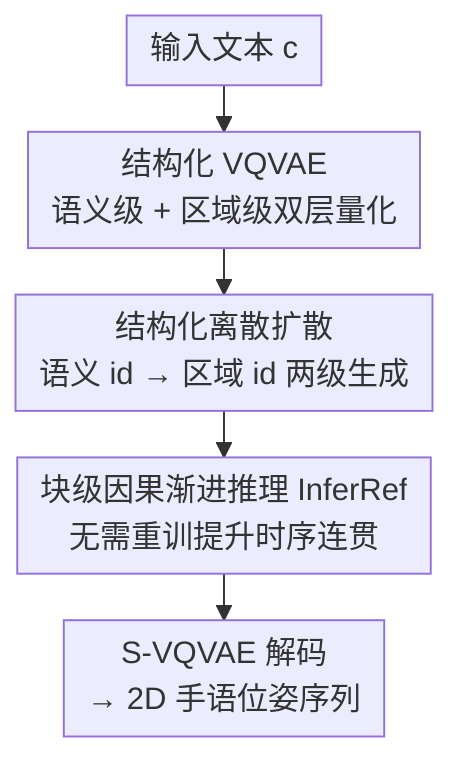

# SignPR: A Progressive Vector-Quantized Diffusion Framework for Sign Language Production

**会议**: CVPR 2026  
**论文**: [CVF Open Access](https://openaccess.thecvf.com/content/CVPR2026/html/Liu_SignPR_A_Progressive_Vector-Quantized_Diffusion_Framework_for_Sign_Language_Production_CVPR_2026_paper.html)  
**代码**: 未提及  
**领域**: 人体理解  
**关键词**: 手语生成, Text2Pose, 向量量化扩散, 离散扩散, 时序连贯

## 一句话总结
SignPR 针对无 gloss 的 Text2Pose 手语生成任务，提出一个「结构 + 时序」双重渐进的向量量化扩散框架：用结构化 VQVAE 把每帧位姿拆成语义级（整体）和区域级（手/脸/身）两层离散 token，扩散先生成语义一致的粗位姿再细化区域细节，并在推理时用块级因果渐进细化保证时序连贯，在 Phoenix14T / CSL-Daily / USTC-CSL 上全面超过此前 T2P 方法。

## 研究背景与动机
**领域现状**：手语生成（Sign Language Production, SLP）要把口语文本转成手语序列，其中「文本→手语位姿序列」是核心子任务（生成的位姿可进一步驱动手语视频）。按是否用 gloss（手语词）中介，分为 Text2Gloss2Pose（T2G2P）和 Text2Pose（T2P）。T2G2P 靠 gloss 标注简化文本-手语对齐，效果通常更好，但 gloss 标注稀缺且昂贵；T2P 直接从文本映射到连续位姿、无需 gloss，更实用也更难。主流 T2P 用 VQ-VAE 把连续位姿压成离散 token，再用自回归（AR）或扩散模型按文本预测 token 序列。

**现有痛点**：T2P 在三件事上同时吃力——语义一致性、动作准确性、时序连贯性。（1）**结构建模顾此失彼**：一类方法（T2S-GPT、MS2SL、SOKE）把整帧/多帧整身位姿压成**单个 token**，语义抓得住但手型、表情等细粒度动作丢失；另一类方法独立建模各身体区域，细节保住了却因区域间交互少、融合简单而**全局语义不一致**、组合错乱。（2）**时序控制弱**：AR 方法保时序因果但有曝光偏差、解码慢；扩散方法并行生成快、多样，但缺显式时序控制，尤其离散扩散并行更新所有时间 token，进一步削弱因果，导致抖动和帧间不平滑。

**核心矛盾**：「整身单 token 的语义一致」与「分区独立建模的动作细节」二者天然冲突；「扩散的并行高效」与「时序因果连贯」二者也冲突。现有方法只能押一边。

**本文目标**：让结构建模同时兼顾语义一致与动作准确，让时序生成同时兼顾并行高效与因果连贯。

**切入角度**：用「渐进细化」的思路把冲突拆解——结构上先粗（语义）后细（区域），时序上把全并行扩散改成块级因果渐进，且**只在推理阶段**改、不动训练。

**核心 idea**：用「双层量化 + 语义→区域两级渐进扩散 + 块级因果推理」替代「单层 token 一次性并行扩散」，在结构和时序两个维度都做渐进精化。

## 方法详解

### 整体框架
SignPR 的目标是从文本 $c$ 生成 2D 手语位姿序列 $X=\{x_s\}_{s=1}^S$（$x_s\in\mathbb{R}^{J\times2}$，$J$ 个关键点）。流程分两阶段：阶段 1 训练一个结构化 VQVAE（S-VQVAE），把位姿序列量化成一条语义 id 序列 $I_{se}$（抓整身动态/语义）和四条区域 id 序列 $I_{re}$（身体、左手、右手、头，抓细节）；阶段 2 用结构化离散扩散（S-Diffusion）从文本先去噪出语义 id $\hat I_{se}$，再以语义 id + 文本为条件去噪出区域 id $\hat I_{re}$；推理时再叠加块级因果渐进细化（InferRef）。最终把 $\hat I_{se}$、$\hat I_{re}$ 经码本查表反量化、拼接后由 S-VQVAE 解码器重建位姿序列。另有一个两层 Transformer 长度预测器估计目标帧数 $S$。

### 关键设计

**1. 结构化 VQVAE：语义级 + 区域级双层离散表示，并用一致性约束把两层绑住**

针对「单 token 丢细节 / 分区丢语义」的两难，S-VQVAE 把每帧位姿同时量化到两个层级。**语义层**：编码器 $E_{se}$（一层 GCN + 两层 Transformer）把整身位姿编码成 $z^{se,s}$，在语义码本 $C^{se}$ 中按 $\ell_2$ 最近邻取 id：$i^{se,s}=\arg\min_j\lVert z^{se,s}-C^{se}_j\rVert_2$，得到一条整身语义 id，捕捉语义意图。**区域层**：把位姿切成身体/左手/右手/头四个区域，每区域用独立 GCN + 两层 Transformer 编码并配独立码本，得四条区域 id，强调细粒度动作。解码时把反量化的区域嵌入与语义嵌入拼接，由解码器 $D^{re}$ 重建位姿。关键在于两层不能各管各的——作者加了**结构一致性约束**：用轻量两层 MLP $\phi_p$ 从语义潜变量 $\hat z^{se,s}$ 预测同帧各区域 id，$L_{cons}=\frac{1}{S}\sum_s\sum_{p}L_{CE}(\phi_p(\hat z^{se,s}),i^{p,s})$，逼着语义表示「知道」自己对应哪套区域细节，从而语义层与区域层结构对齐。S-VQVAE 总损失含 L1 重建 + $L_{cons}$ + 码本承诺损失 + 量化更新损失。消融显示去掉 $L_{cons}$ 后 BLEU1 从 31.91 暴跌到 24.08，证明这条「绑带」至关重要。

**2. 结构化离散扩散：语义扩散打底、区域扩散补细节的两级渐进生成**

建立在双层离散空间上，S-Diffusion 先做**语义离散扩散**：按 VQ-Diffusion 的离散前向过程 $q(i^{se}_t\mid i^{se}_0)$，把真值 id 序列经马尔可夫链逐步腐蚀（每步以一定概率替换成随机码本项或 [MASK]），反向用 U-Net 去噪网络 $\phi_g$ 从噪声 id、时间步 $t^{se}$ 和文本 $c$ 预测干净语义 id：$\hat I^{se}_0=\phi_g(I^{se}_t,t^{se},c)$；每个语义 U-Net 块含时间自注意力、文本交叉注意力和 FFN（均接自适应层归一化 ALN）。再做**区域离散扩散** $\hat I^{re}_0=\phi_l(I^{re}_t,t^{re},c,\hat I^{se}_0)$：在语义骨干上额外加两个模块——区域注意力 RT（让四区域间交换信息，解决「分区建模区域间交互不足」的老问题）和一个以语义位姿为条件的交叉注意力 $CA_{se}$（让区域扩散在补细节时仍贴着语义走）。这种「先生成语义一致的粗位姿、再在语义+文本双条件下细化区域动作」的渐进顺序，正是同时拿下语义一致与动作准确的关键。消融中仅语义扩散或仅区域扩散都明显更差，两级合用才最强。

**3. 块级因果渐进推理 InferRef：不重训、只改推理就修好时序抖动**

离散扩散每步并行更新所有时间 token，缺乏显式因果建模，导致抖动。InferRef 借鉴自回归的因果顺序，把推理改成**块级因果渐进细化**，且无需重训。具体：先用长度预测器估目标帧数 $S$，固定块大小 $K$ 把序列切成 $N=\lceil S/K\rceil$ 个连续块 $\{B_i\}$，生成建模为 $p(I\mid c)=\prod_i p(B_i\mid c,B_{<i})$。施加**块级因果掩码**：块 $B_i$ 内的 token 能注意到所有已生成块 $B_{<i}$ 和块内 token，但屏蔽未来块；预测 $B_i$ 时同时对已生成块 $B_{<i}$ 做再细化（refine），从而既建立时序因果、又能回头修正前面段落，产出平滑连贯的序列。它对语义扩散和区域扩散的推理过程都施加。因为只动推理、不动训练，部署成本低，可视化显示去掉 InferRef 会出现明显的运动不连续和帧间抖动。

### 损失函数 / 训练策略
关键点用 HRNet 抽 2D（42 手部 + 68 面部 + 11 上半身）。S-VQVAE 码本维度 768、语义/区域码本各 1024 项；S-VQVAE 与 S-Diffusion 分别 75.50M / 680.04M 参数。均用 AdamW、batch size 32、100K 迭代，初始学习率 1e-4 + 余弦衰减，8 张 A6000 训练。S-VQVAE 损失含 L1 重建、结构一致性 $L_{cons}$、语义/区域码本承诺与量化更新四项。

## 实验关键数据

### 主实验
数据集：Phoenix14T（德语手语，1066 gloss / 2877 词）、CSL-Daily（中文）、USTC-CSL（中文，两种划分）。评测用回译（back-translation）得 ROUGE-L、BLEU1–4 评语义，用 DTW-MJE 评时序对齐，用 FID、MPJPE 评动作准确（FID 在 S-VQVAE 冻结编码器特征上算，MPJPE 在关键点坐标上算）。下表为 Phoenix14T TEST 主结果（↓越低越好）：

| 类型 | 方法 | BLEU1 | BLEU4 | FID↓ | MPJPE↓ |
|------|------|-------|-------|------|--------|
| T2G2P | Sign-IDD | 26.45 | 8.66 | 2.46 | 47.19 |
| T2P | MoMP | 16.87 | 4.58 | 2.97 | 45.71 |
| T2P | **SignPR（本文）** | **31.91** | **9.41** | **2.15** | **23.04** |

即便不用 gloss，SignPR 仍在所有指标上超过用了 gloss 的 SOTA T2G2P 模型 Sign-IDD：BLEU1 26.45→31.91、MPJPE 47.19→23.04（近乎腰斩）。对比 T2P 基线 MoMP，BLEU1 16.87→31.91、FID 2.97→2.15。CSL-Daily 上 BLEU4 2.14→3.01、FID 2.95→2.47、MPJPE 48.24→44.22；USTC-CSL Split-I 上 ROUGE 25.09→95.48、MPJPE 183.14→51.40，提升显著。

### 消融实验
Phoenix14T TEST 上的组件消融：

| 配置 | BLEU1 | FID↓ | MPJPE↓ | 说明 |
|------|-------|------|--------|------|
| 完整 SignPR | 31.91 | 2.15 | 23.04 | 双层量化 + 两级扩散 + InferRef |
| w/o $L_{cons}$ | 24.08 | 2.80 | 38.63 | 去结构一致性约束 |
| w/o GCN（换 Transformer 编码） | 26.65 | 2.35 | 28.07 | 编码器换成 Transformer |
| 仅语义扩散 | 22.26 | 2.85 | 42.96 | 去区域扩散 |
| 仅区域扩散 | 23.12 | 2.58 | 40.32 | 去语义扩散 |

### 关键发现
- **结构一致性约束 $L_{cons}$ 贡献最大**：去掉后 BLEU1 从 31.91 掉到 24.08、MPJPE 从 23.04 涨到 38.63，是单项里掉点最猛的，印证「把语义层和区域层绑住」是这套双层设计能成立的前提。
- **语义/区域扩散缺一不可**：单独任一级都只有 22–23 BLEU1，两级渐进合用才到 31.91，说明「先语义后区域」的顺序本身就是收益来源，而非简单堆模块。
- **GCN 比 Transformer 更适合编码人体位姿**：把 GCN 换成 Transformer 后 BLEU1 跌 5 个点，因为人体位姿天然是带结构的图。
- **区域模块还能纠语义阶段的错**：可视化显示区域细化不仅补手型细节，还能修正手臂位置、改善面部表情；去掉 InferRef 则明显抖动、不连贯。

## 亮点与洞察
- **「先粗后细」的双层渐进把一对老矛盾同时化解**：语义层管整身一致、区域层管细粒度，再用结构一致性损失把两层缝合，避开了「单 token 丢细节 vs 分区丢语义」的两难——这种「整体+局部分层量化 + 一致性绑带」思路可迁移到全身动作生成、舞蹈生成等任务。
- **InferRef 是「免训练」的时序补丁**：只在推理改成块级因果 + 回看细化，就把离散扩散的并行抖动问题压下去，且不需重训，部署友好——可直接套到其他离散扩散序列生成上。
- **回头细化（refine $B_{<i}$）很关键**：不只是单向因果生成，预测当前块时同步修已生成块，兼得 AR 的因果性与扩散的可修正性。
- **无 gloss 却超过有 gloss 方法**：说明把结构/时序性质建模到位后，gloss 中介带来的对齐收益可以被「渐进精化」替代。

## 局限与展望
- 参数量偏大（S-Diffusion 680M），8×A6000 训练，推理为两级扩散 + 块级因果，速度/成本未充分讨论，实时手语生成可能受限。⚠️ 以原文为准。
- 块大小 $K$ 是关键超参，论文未给出其对时序连贯-效率权衡的敏感性分析。
- 生成的是 2D 关键点位姿，离可用手语视频还需接 pose2video，端到端真实感未验证。
- USTC-CSL Split-I 上 ROUGE 25.09→95.48 这类跳变巨大，需注意基线 PT-GN 是否过弱导致横向比较失真。⚠️ 不同数据集/划分难度不同，数值不可直接跨表比较。

## 相关工作与启发
- **vs 整身单 token 类（T2S-GPT / MS2SL / SOKE）**：它们把整帧压成单 token，语义在但细节糊；SignPR 加区域层 + 区域扩散补细节，Phoenix14T MPJPE 大幅下降。
- **vs 分区独立建模类**：它们各区域独立、区域间交互弱致全局不一致；SignPR 用结构一致性损失 + 区域注意力 RT 把区域重新缝回语义，兼顾局部保真与全局一致。
- **vs 自回归 T2P（PT-GN 等）**：AR 保时序但有曝光偏差、解码慢；SignPR 用扩散 + 块级因果，既快又因果，且无需像 AR 那样逐帧。
- **vs 普通离散扩散 / 现有因果方法**：普通离散扩散并行更新削弱因果致抖动；与需改训练的因果方法不同，InferRef 只在推理做块级渐进细化，免重训。

## 评分
- 新颖性: ⭐⭐⭐⭐⭐ 结构（双层量化+两级扩散）与时序（免训练块级因果）双重渐进设计在 T2P 上少见，组合新颖
- 实验充分度: ⭐⭐⭐⭐ 三数据集 + 系统消融 + 可视化，但缺速度/块大小敏感性分析，个别基线偏弱
- 写作质量: ⭐⭐⭐⭐ 动机层次清晰、公式完整，但缓存中部分公式被噪声污染需核对原文
- 价值: ⭐⭐⭐⭐ 无 gloss 即超有 gloss SOTA，分层量化 + 免训练时序修复思路实用且可迁移

<!-- RELATED:START -->

## 相关论文

- [\[CVPR 2026\] Focal–General Diffusion Model with Semantic Consistent Guidance for Sign Language Production](focal-general_diffusion_model_with_semantic_consistent_guidance_for_sign_languag.md)
- [\[ACL 2026\] Hybrid Autoregressive-Diffusion Model for Real-Time Sign Language Production](../../ACL2026/human_understanding/hybrid_autoregressive-diffusion_model_for_real-time_sign_language_production.md)
- [\[CVPR 2026\] BoostSLT: Boosting Sign Language Translation via a Plug-and-Play Diffusion-Based Semantic Enhancer](boostslt_boosting_sign_language_translation_via_a_plug-and-play_diffusion-based_.md)
- [\[CVPR 2026\] Sign Language Recognition in the Age of LLMs](sign_language_recognition_llms.md)
- [\[CVPR 2026\] Learning Effective Sign Features without Text for Gloss-free Sign Language Translation](learning_effective_sign_features_without_text_for_gloss-free_sign_language_trans.md)

<!-- RELATED:END -->
