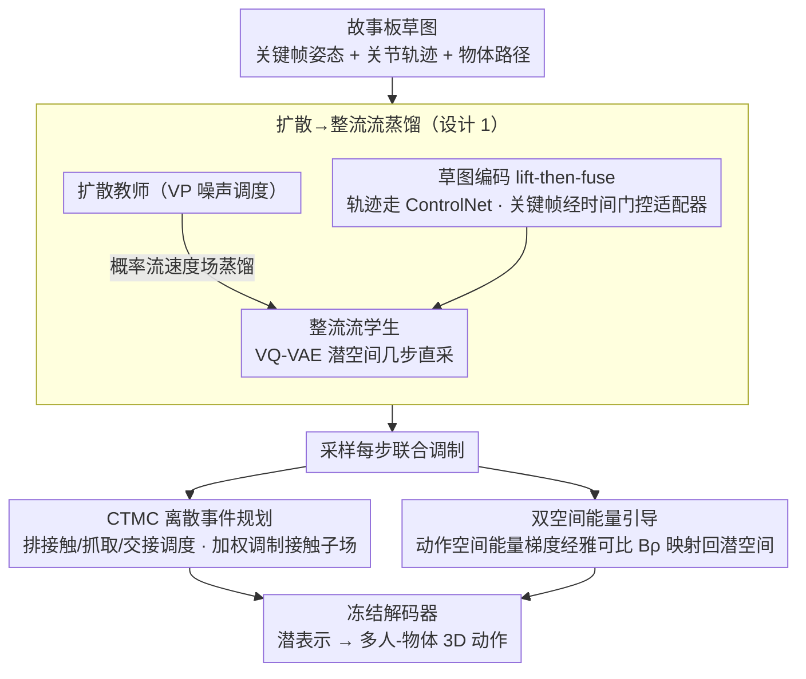

# Sketch2Colab: Sketch-Conditioned Multi-Human Animation via Controllable Flow Distillation

**会议**: CVPR 2026  
**arXiv**: [2603.02190](https://arxiv.org/abs/2603.02190)  
**代码**: 无  
**领域**: 人体理解  
**关键词**: 多人动作生成, 草图引导, 整流流蒸馏, 人-物-人协作, CTMC离散事件

## 一句话总结

提出 Sketch2Colab，通过将草图驱动的扩散先验蒸馏为整流流学生网络，结合能量引导和连续时间马尔可夫链（CTMC）离散事件规划，从故事板草图生成协调的多人-物体交互 3D 动作，在 CORE4D 和 InterHuman 上实现 SOTA 约束遵从度和感知质量。

## 研究背景与动机

**领域现状**: 扩散模型在单人动作生成已取得很好效果，文本/轨迹/风格条件控制均有成熟方案。多人+物体的协作场景（如两人搬桌子）仍是未解难题，代表性工作 COLLAGE 用 LLM 规划+潜扩散实现了初步探索。

**现有痛点**: (1) 文本作为控制通道过于粗糙——时序、空间布局难以精确表达；(2) 扩散模型在多实体强约束下实现精确遵从需要昂贵的后验引导或专用控制模块，采样慢且效果不稳定；(3) 多实体交互涉及离散事件（接触、抓取、交接），纯连续流难以建模。

**核心矛盾**: 草图提供了比文本更精确的时空控制信号，但将草图约束扩展到多人+物体场景面临：关键帧不对齐、多智能体相位漂移、接触/交接的离散状态难以优化。

**本文目标** 如何从故事板草图（关键帧姿态+关节轨迹+物体路径）生成协调的多人-物体 3D 动作序列？

**切入角度**: 扩散→整流流蒸馏获得快速稳定采样 + 能量引导实现精确约束 + CTMC 处理离散接触事件。

**核心 idea**: 蒸馏扩散教师为整流流学生，用可微能量函数在双空间（原始动作空间+潜空间）引导约束遵从，用 CTMC 规划离散交互事件调制连续流。

## 方法详解

### 整体框架

Sketch2Colab 要做的事是：把一份故事板草图（每个角色的关键帧姿态、关节轨迹，加上物体的运动路径，可选还有一句文本说明）翻译成多个人和物体协调一致的 3D 动作序列。整条管线先用一个对齐编码器把草图里的 2D/3D 控制信号编进特征，再让一个整流流学生网络在 VQ-VAE 潜空间里把动作"流"出来；流的过程中，一条连续时间马尔可夫链（CTMC）负责安排接触、抓取、交接这些离散事件，把它们调度进连续流；与此同时，一组可微能量函数在动作空间和潜空间两侧同时施压，把生成结果拉向草图给定的约束。最后冻结的解码器把潜表示还原成最终的多人-物体动作。三个核心部件分工明确——整流流管连续动力学、CTMC 管离散事件、能量引导管精确约束——但在采样的每一步紧密耦合。

### 关键设计

**1. 扩散→整流流蒸馏（PF-Distillation）：用一个慢但准的扩散教师，换出一个快且稳的整流流学生**

直接从头训练一个多人-物体的整流流模型很难——实体多、约束强，运动分布本身就不好学。作者的做法是先训一个草图驱动的扩散教师（VP 噪声调度），从它身上读出概率流速度场 $v_\theta^{PF}$，再让学生网络一边最小化标准的整流流目标 $\mathcal{L}_{RF}$、一边最小化向教师对齐的蒸馏目标 $\mathcal{L}_{distill}$。这样学生既继承了教师辛苦学到的运动先验，又拿到了整流流"几步直采"的快采样能力。草图条件不是简单拼接进去，而是走 lift-then-fuse 两步：关节/物体轨迹经一条 ControlNet 式的路径注入，关键帧姿态则经一个时间门控的关键帧适配器在对应时刻才"开门"加入，避免关键帧信息在非关键帧处污染整段生成。

**2. 双空间能量引导（Dual-Space Conditioning）：在动作空间和潜空间各放一只手，一只保几何精度、一只保留在运动流形上**

光在潜空间里采样并不能保证生成结果真的贴合草图——关键帧要对得上、轨迹要跟得住、两人接触要恰好接上、脚不能打滑。作者把这些约束写成可微能量函数：$E_{key}$ 管关键帧对齐、$E_\tau$ 管轨迹跟踪、$E_{int}$ 管接触与间距、$E_{phys}$ 管防滑脚和地面平面等物理约束。难点在于这些能量定义在原始动作空间，而采样发生在潜空间，梯度得跨空间传过去。直接对解码器做自动微分太贵，作者改用一个学习得到的低秩块-Toeplitz 雅可比近似 $\mathbf{B}_\rho$，把原始空间的能量梯度廉价地映射回潜空间；同时加一项潜空间锚点 $\mathcal{L}_{lat}$ 把样本钉在运动流形上。纯原始空间引导容易把样本推离流形、生成不自然的姿态，纯潜空间引导又缺乏对关键帧/接触的几何精度——两侧同时施压正好互补。

**3. CTMC 离散事件规划：把接触、抓取、交接当成离散事件单独排时序，而不是指望连续流自己悟出来**

两人搬桌子这类协作里，"什么时候手碰到桌子""什么时候把桌子交给对方"本质是离散的开关事件。如果只靠连续流去拟合，模式切换会变得模糊、接触点会出现闪烁和相位错位。作者在接触状态上定义一条连续时间马尔可夫链，用物理信息目标学习状态之间的转移率，得到一份接触/交接调度 $\boldsymbol{\pi}_t$。这份调度并不是事后贴上去的，而是反过来调制连续流——它通过重要性加权去调整流的子场和接触权重，让连续流在"该接触"的时刻被推着去接触、在"该松手"的时刻被推着松手。于是离散事件有了干脆、相位正确的安排，连续动作又保持平滑。

### 一个完整示例：两人协作搬一张桌子

以一份"甲、乙两人合力把桌子从 A 抬到 B"的故事板为例，走一遍三个部件如何串起来。输入是甲乙各自的几张关键帧姿态（弯腰、抓握、起身、平移）、双手的关节轨迹，以及桌子从 A 到 B 的物体路径。对齐编码器先把这些信号编码：轨迹走 ControlNet 路径、关键帧经时间门控适配器只在对应帧注入。整流流学生在潜空间起步生成连续动作。与此同时 CTMC 排出离散事件时间表 $\boldsymbol{\pi}_t$——比如"第 0.4s 甲手接触桌沿、第 0.5s 乙手接触、第 2.1s 两人同步抬起"，并按这张表去加权调制流的接触子场，于是抓取动作准确卡在该发生的帧上、不再闪烁。生成的每一步里，双空间能量同时介入：$E_{key}$ 把起身那帧的姿态拉向草图给定的关键帧，$E_\tau$ 让手沿轨迹走，$E_{int}$ 维持两人抓桌时的接触和彼此间距，$E_{phys}$ 保证支撑脚不滑、桌子不穿地——这些能量的原始空间梯度经 $\mathbf{B}_\rho$ 映射回潜空间施加。几步整流流采样后，冻结解码器把潜表示还原成甲乙协调一致、接触干净的搬桌动作。

### 损失函数 / 训练策略

总训练损失叠加了 $\mathcal{L}_{RF}$（整流流）、$\mathcal{L}_{distill}$（向扩散教师蒸馏）、$\mathcal{L}_{Lyap}$（Lyapunov 势能，稳定动力学）、$\mathcal{L}_{CTMC}$（离散事件转移率）、$\mathcal{L}_{lat}$（潜空间锚点）以及各能量项。采样时用分类免引导（10% 条件 dropout，引导强度 $\omega \in [1.4, 1.8]$）。动作表示采用 SMPL-X 的 22 关节、6D 旋转。

## 实验关键数据

### 主实验（CORE4D 和 InterHuman）

| 方法 | 约束遵从度 | FID↓ | 感知质量 | 推理速度 |
|------|-----------|------|---------|---------|
| COLLAGE | 基线 | - | 基线 | 慢（扩散） |
| Sketch2Anim | 仅单人 | - | - | 中等 |
| **Sketch2Colab** | **SOTA** | **最低** | **最高** | **快（整流流）** |

### 消融实验

| 配置 | 约束遵从度 | 说明 |
|------|-----------|------|
| Full model | 最优 | 完整方案 |
| w/o CTMC | 下降（接触模糊） | 离散事件丢失 |
| w/o dual-space | 下降（几何偏差） | 缺少精确引导 |
| w/o distillation | 大幅下降 | 从头训练整流流不稳定 |

### 关键发现

- 扩散→整流流蒸馏比直接扩展扩散基线到多实体场景效果显著更好（避免关键帧不对齐和相位漂移）
- CTMC 对接触质量贡献最大——没有它接触会出现闪烁和时序错误
- 双空间引导比纯原始空间或纯潜空间都更有效

## 亮点与洞察

- **蒸馏+能量+CTMC 的三层架构**：连续动力学用整流流、精确约束用能量引导、离散事件用 CTMC——三者各司其职又紧密耦合，设计非常优雅
- **草图比文本更适合交互控制**：草图天然编码时空信息（何时何处何姿态），比文本描述精确得多
- **雅可比近似桥接双空间**：学习低秩块-Toeplitz 雅可比做原始→潜空间梯度映射，避免了昂贵的自动微分

## 局限与展望

- 需要故事板级别的输入——创建精确的关键帧草图仍需动画师技能
- CTMC 的离散状态空间固定（接触/非接触），更复杂的交互语义（如"小心地"、"用力地"）未建模
- 评估主要在 CORE4D 和 InterHuman 上，实际影视/游戏场景的复杂度更高

## 相关工作与启发

- **vs COLLAGE**: COLLAGE 用文本+LLM 规划+潜扩散；Sketch2Colab 用草图+整流流+CTMC，控制更精确且推理更快
- **vs Sketch2Anim**: Sketch2Anim 仅支持单人，Sketch2Colab 扩展到多人+物体的协作场景
- **vs MotionLab**: MotionLab 也用整流流但面向单人生成/编辑统一，Sketch2Colab 专攻多实体草图控制

## 评分

- 新颖性: ⭐⭐⭐⭐⭐ 蒸馏+能量+CTMC 的组合在动作生成中首创
- 实验充分度: ⭐⭐⭐⭐ CORE4D 和 InterHuman 两个多人交互基准
- 写作质量: ⭐⭐⭐⭐ 方法描述系统但公式密集
- 价值: ⭐⭐⭐⭐⭐ 对动画和游戏行业的多人协作动作生成有重大推动

<!-- RELATED:START -->

## 相关论文

- [\[CVPR 2026\] LaScA: Language-Conditioned Scalable Modelling of Affective Dynamics](lasca_language-conditioned_scalable_modelling_of_affective_dynamics.md)
- [\[CVPR 2026\] OpenFS: Multi-Hand-Capable Fingerspelling Recognition with Implicit Signing-Hand Detection and Frame-Wise Letter-Conditioned Synthesis](openfs_multi-hand-capable_fingerspelling_recognition_with_implicit_signing-hand_.md)
- [\[CVPR 2025\] X-Dyna: Expressive Dynamic Human Image Animation](../../CVPR2025/human_understanding/x-dyna_expressive_dynamic_human_image_animation.md)
- [\[ECCV 2024\] HUMOS: Human Motion Model Conditioned on Body Shape](../../ECCV2024/human_understanding/humos_human_motion_model_conditioned_on_body_shape.md)
- [\[CVPR 2026\] MMGait: Towards Multi-Modal Gait Recognition](mmgait_multi_modal_gait_recognition.md)

<!-- RELATED:END -->
