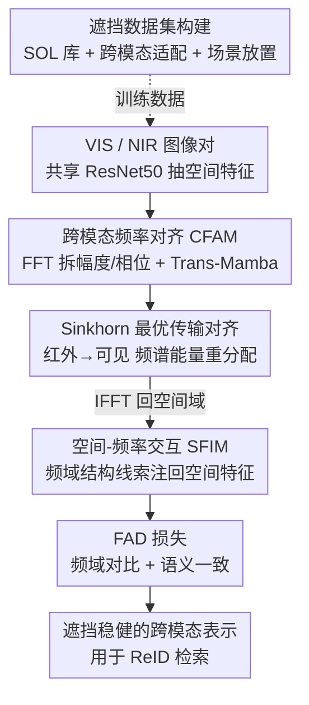

# Spatial-Frequency Collaborative Learning for Occluded Visible-Infrared Person Re-Identification

**会议**: CVPR 2026  
**论文**: [CVF Open Access](https://openaccess.thecvf.com/content/CVPR2026/html/Yu_Spatial-Frequency_Collaborative_Learning_for_Occluded_Visible-Infrared_Person_Re-Identification_CVPR_2026_paper.html)  
**代码**: 无  
**领域**: 人体理解 / 跨模态行人重识别  
**关键词**: 可见光-红外ReID, 遮挡, 频域学习, 幅度-相位分解, 最优传输

## 一句话总结
针对带遮挡的可见光-红外行人重识别（Occluded VI-ReID），本文提出 SFCL 框架：用 FFT 把特征拆成幅度（编码模态外观）和相位（保留身份结构），在频域用最优传输对齐两模态、再把频域结构线索注回空间特征，并配一个频域对比 + 语义一致的 FAD 损失，在自建的两个遮挡数据集上超过此前 SOTA（Occ-SYSU-MM01 全搜索 Rank-1 65.97%，+4.31%）。

## 研究背景与动机

**领域现状**：可见光-红外行人重识别（VI-ReID）要在白天可见光相机和夜间红外相机之间匹配同一行人，是跨设备安防检索、夜间监控的核心技术。主流做法绝大多数假设行人完整可见，靠空间域线索——局部身体部件、显著区域、姿态——来对齐两个模态的特征。

**现有痛点**：真实场景里遮挡（路牌、车辆、行人互相遮挡）无处不在，而且 VI-ReID 里有个特殊麻烦：**同一个人在可见光和红外图上的遮挡往往出现在不同位置**，结构对应关系直接被打乱，部件级对齐变得不可靠。更糟的是，模态差异（颜色、亮度、成像机理）本身就和身份线索纠缠在一起，遮挡又是形状随机、位置随机的局部扰动——纯空间域对齐同时被这两种噪声干扰，很容易失效。此前唯一的跨模态遮挡方法和几个单模态方法都还停在空间域里做文章。

**核心矛盾**：身份信息既要躲开模态差异、又要躲开遮挡扰动，但空间域里这三者（身份 / 模态 / 遮挡）混在一起难以解耦。

**切入角度**：作者观察到频域提供了一个物理可解释的解耦视角。通过 FFT 把图像/特征拆成幅度谱和相位谱后：**幅度反映整体外观能量、会随模态亮度衰减（即编码模态特有的"风格"）**；**相位保留精细结构细节、跨模态几乎不变（即编码模态共享的"几何身份"）**。论文的图 1 用"交换两模态的幅度和相位"验证了这点——重组出的混合图继承了"提供方的外观 + 接收方的结构"。进一步看，模态差异集中在特定频段、幅度方差大；遮挡引起的差异则更弥散、幅度更弱。两种干扰在频域里呈现出**可区分的模式**，而身份相关的结构因为相位不变性反而更稳定。

**核心 idea**：用"空间-频率协同"代替"纯空间"——在频域用幅度-相位分解解耦模态风格与身份结构、对齐跨模态频谱，再把对齐后的频域结构先验注回空间分支，让全局频域约束与局部空间细节互补，从而在遮挡下做稳健的跨模态匹配。

## 方法详解

### 整体框架

SFCL 是个双分支（VIS / NIR，共享 ResNet50 主干）+ 双域（空间/频率）协同的架构。给定一对可见光和红外图像，主干先各自抽出空间特征；随后 **CFAM（跨模态频率对齐模块）** 把空间特征做 FFT 拆成幅度/相位，用 Trans-Mamba 块分别建模、跨模态注意力交换信息、再用 Sinkhorn 最优传输把两模态的频谱对齐，IFFT 回空间域得到频域表示 $O^{vis}_{fre}, O^{nir}_{fre}$；接着 **SFIM（空间-频率交互模块）** 把这些频域结构线索自适应地注回空间特征，得到融合表示 $O^{vis}_{sf}, O^{nir}_{sf}$；最后 **FAD 损失** 在频域做跨模态对比、在语义空间做一致性约束，联合监督整个网络。

### 关键设计

**1. CFAM：在频域解耦模态风格与身份结构，并用最优传输对齐两模态**

这一模块直击"空间域里模态差异和遮挡纠缠"的痛点。它把主干输出的空间特征 $X^m_{spa}$（当成 2D 响应场）做 FFT 分解：$A_m, P_m = \text{FFT}(X^m_{spa})$，幅度 $A_m$ 编码模态特有外观、相位 $P_m$ 保留身份结构。然后用一个 **Trans-Mamba（TM）块**联合建模二者——考虑到幅度对局部频谱波动和高频扰动敏感、相位跨频段变化平滑，作者让幅度分支走 Vmamba 编码器 + refiner 做全局频谱建模，相位分支走 Transformer 捕局部结构，再用跨分支 MLP 做双向交互（$[A^m_{tm}, P^m_{tm}] = \text{TM}(A_m, P_m)$）。之后做跨模态频率注意力：可见光把自己的幅度当 query、和红外的 key/value 交互，对称地在相位域也做一遍，让每个模态自适应聚合对方的频谱线索。

真正的核心是 **CFS（Cross-modality Frequency Sinkhorn）**：把跨模态频谱匹配建成一个熵正则的最优传输问题。遮挡下两模态幅度会有局部能量丢失和分布失衡，导致对应不稳定；CFS 把红外设为源分布、可见光设为目标分布，通过 Sinkhorn 迭代重分配频谱能量、建立"语义一致且能量守恒"的映射。先定义谱代价矩阵 $C_{ij} = \|\tilde{A}^{vis}_i - \tilde{A}^{nir}_j\|_2^2$，再解

$$Z^* = \arg\min_{Z \in U(a,b)} \langle Z, C\rangle - \varepsilon H(Z)$$

其中边缘约束 $U(a,b)=\{Z \mid Z\ell = a, Z^\top\ell = b\}$ 保证频谱能量守恒，熵项 $H(Z)=-\sum_{ij} Z_{ij}\log Z_{ij}$ 让传输平滑稳定。通过可微的迭代缩放 $Z^{(t+1)} = u^{(t)}\exp(-C/\varepsilon)(v^{(t)})^\top$ 求解，把红外里可靠的频率响应重分配到可见光域。对齐后的幅度 $\tilde{A}^{vis}=Z^*\tilde{A}^{vis}$、相位同理，最后 IFFT 把对齐的幅度和相位合回空间域：$O^{vis}_{fre}=\text{IFFT}(\tilde A^{vis}, \tilde P^{vis}, \tilde P^{nir})$。相比直接在空间域对齐，这种做法把"对齐"放到了一个模态差异天然可分离、且对遮挡更稳健的空间里做。

**2. SFIM：把频域结构线索自适应注回空间特征，补回局部细节**

CFAM 建立了跨模态频域一致性，但频域表示缺完整的局部结构信息，SFIM 负责把频域结构线索"还"给空间域。给定空间嵌入 $X^{vis}_{spa}$ 和频域表示 $O^{vis}_{fre}$，先算一个余弦相似度相关矩阵 $S^{vis}_{ij} = \langle x^{vis}_{spa,i}, o^{vis}_{fre,j}\rangle / (\|x^{vis}_{spa,i}\|_2 \|o^{vis}_{fre,j}\|_2)$ 当自适应权重，让每个空间位置选择性地关注最相关的频率响应，得到频率引导的增强空间表示 $X^{vis}_{sf} = S \cdot O^{vis}_{fre}$。

由于遮挡会引入破坏频谱稳定性的高频噪声，SFIM 用 **Gabor 调制**强调结构相关频段、抑制不可靠的高频成分：$G(O^{vis}_{fre})[k,:] = O^{vis}_{fre}[k,:] \cdot \exp(-(\omega_k-\omega_0)^2 / 2\sigma_\omega^2)$，$\omega_0$ 是 Gabor 核中心频率、$\sigma_\omega$ 控带宽。再用一个带软阈值 $\tau$ 的自适应注意力图（$A_{ij} \propto \max((X^{vis}_{sf}F^{vis\top}_{fre})_{ij}-\tau, 0)$，归一化后抑制弱相关）按结构相关性聚合频率线索，得到增强空间特征 $\hat F^{vis}_{spa}$。最后对 $\hat F^{vis}_{spa}$ 和 $\hat F^{vis}_{fre}$ 做**跨协方差池化**（先均值中心化，$T^{vis}_{spa}=\frac{1}{\sqrt{N_sN_f}}(\hat F^{vis}_{spa}-\ell\mu_s^\top)^\top(\hat F^{vis}_{fre}-\ell\mu_f^\top)$）捕捉空间-频率的高阶相关，经幂归一化 + 轻量 MLP 得到紧凑、抗遮挡的融合表示 $O^{vis}_{sf}$。这一步是双向交互：不是简单拼接，而是让空间纹理和频域结构互相校正。

**3. FAD 损失：频域对比 + 语义一致，双重约束对抗模态差与遮挡**

为了在遮挡下提升判别力、缓解语义-频谱不一致，FAD 损失把两个互补约束放进一个目标。**频域对比项**把 CFAM 的频域嵌入 $O^{vis}_{fre}, O^{nir}_{fre}$ 投影成单位向量 $r^{vis}, r^{nir}$，按 $s_{ij}=\langle r^{vis}_i, r^{nir}_j\rangle/\tau$ 算相似度，对每个可见光样本取同 ID 红外样本为正集、异 ID 为负集，做 InfoNCE 形式的对比，双向求和得 $L_{cfc}=\frac{1}{2}(L_{v\to n}+L_{n\to v})$——直接在频谱嵌入层面拉近同 ID、推开异 ID。**语义一致项**把 SFIM 的融合特征 $O^{vis}_{sf}, O^{nir}_{sf}$ 送进共享分类器得分布 $p^{vis}, p^{nir}$，对每个可见光样本检索其 K 近邻红外样本算邻域平均分布 $\bar p^{nir}_i$，用对称参考 $r_i=\frac{1}{2}(p^{vis}_i+\bar p^{nir}_i)$ 做双向 KL 约束（$L_{csc}$），软对齐两模态的决策边界。总损失 $L_{total}=L_{id}+L_{tri}+(\lambda_1 L_{cfc}+\lambda_2 L_{csc})$。两项一个管频谱层面的特征对齐、一个管语义层面的边界一致，互补地抗模态差和遮挡。

**4. 语义化遮挡数据集构建（SOL + 跨模态适配 + 场景感知放置）**

VI-ReID 数据集里遮挡样本太少，模型对真实遮挡很脆弱，而传统随机裁剪/黑块填充既无语义真实性、又不处理模态差异。作者构建了两个新数据集 Occ-SYSU-MM01 和 Occ-RegDB。先用 **语义遮挡库 SOL**：YOLOv8-seg 检测常见监控物体 + SAM 拿到像素级实例掩码，按掩码完整度/边界可靠性/最小区域筛选并做类别再平衡，每个遮挡物带属性元组 $\phi(o_i)=(c_i, s^{sce}_i, p^{pt}_i, s^{siz}_i)$（类别、场景先验、位置倾向、相对尺寸）。为保证跨模态一致，每个可见光遮挡 $o^{vis}$ 经"灰度化 → 强度归一化到 NIR 域 → 直方图对齐 → 高斯平滑"轻量校准生成 NIR 风格版本 $o^{nir}$。放置时按语义属性走场景感知规则（$X_o = m_{\epsilon,p}\odot X + (1-m_{\epsilon,p})\odot o_{\epsilon,p}$，含随机缩放 $\epsilon\sim U(0.1,0.7)$、类别轮转、羽化融合）。遵循固定协议：训练集 50% 图遮挡、所有 query 遮挡、gallery 保持干净。

### 损失函数 / 训练策略
总损失 $L_{total}=L_{id}+L_{tri}+\lambda_1 L_{cfc}+\lambda_2 L_{csc}$，前两项是 ReID 标准的身份分类 + triplet，后两项是 FAD。最优权重 $\lambda_1=1.0, \lambda_2=0.8$。实现基于 PyTorch + 2×RTX 4090，图像 resize 到 288×144，用随机裁剪、水平翻转、通道增强。

## 实验关键数据

### 主实验（遮挡数据集对比，Occ-SYSU-MM01 全搜索 / Occ-RegDB V-I）

| 方法 | 来源 | Occ-SYSU R1 | Occ-SYSU mAP | Occ-RegDB(V-I) R1 | Occ-RegDB(V-I) mAP |
|------|------|------|------|------|------|
| DTRM | TIFS-2022 | 48.45 | 49.95 | 62.09 | 50.10 |
| DEEN | CVPR-2023 | 56.27 | 54.43 | 71.69 | 52.15 |
| CSDN | TMM-2025 | 60.25 | 59.16 | 73.35 | 52.88 |
| MPL | TCSVT-2025 | 60.92 | 60.43 | 72.82 | 52.71 |
| DNS（次优） | ECCV-2024 | 61.66 | 60.59 | 73.51 | 53.39 |
| **SFCL（本文）** | CVPR-2026 | **65.97** | **64.77** | **77.18** | **56.31** |

在 Occ-SYSU-MM01 全搜索模式下比次优 DNS 高 **+4.31% R1 / +4.18% mAP**；Indoor 搜索达 67.46% / 71.35%；Occ-RegDB I-V 模式 76.46% / 55.46%，两个搜索模式都领先。

### 消融实验（Occ-SYSU-MM01，逐模块叠加 + 复杂度）

| 配置 | R1 | mAP | 参数(M) | FLOPs(G) | 时延(ms) | 说明 |
|------|------|------|------|------|------|------|
| Base | 59.22 | 59.89 | 23.55 | 9.21 | 0.40 | 仅主干 |
| + CFAM | 61.63 | 61.57 | 60.85 | 14.36 | 0.91 | 频域对齐，R1 +2.41% |
| + CFAM + SFIM | 63.79 | 63.93 | 70.50 | 22.26 | 1.25 | 注回空间，再 +2.16% |
| + CFAM + SFIM + FAD（Full） | **65.97** | **64.77** | 70.50 | 22.26 | 1.25 | 全配置，较 Base +6.57% R1 |

### 关键发现
- **三个模块逐级有效**：CFAM 带来 +2.41% R1（频域对齐是地基）、SFIM 再 +2.16%（把频域线索注回空间补局部细节）、FAD 损失不增参数和算力却再涨 +2.18% R1，说明判别约束这步"性价比"最高。
- **代价适中**：CFAM/SFIM 引入参数从 23.55M 涨到 70.50M、时延从 0.40ms 到 1.25ms，但增益（+6.57% R1）远大于推理开销的温和上升；FAD 是纯损失项，推理时零额外成本。
- **超参不算敏感**：$\lambda_1, \lambda_2$ 在 0.6–1.4 扫描，$\lambda_1=1.0, \lambda_2=0.8$ 最佳（65.97% R1 / 64.77% mAP），说明频域对比和语义一致两项需要一个恰当的权衡。
- **泛化到无遮挡场景**：虽为遮挡设计，在 holistic SYSU-MM01 全搜索也达 79.13% R1 / 76.28% mAP，比次优 DNS 高 +1.86% / +1.93%，说明学到的表示既抗遮挡又普遍判别。

## 亮点与洞察
- **用幅度/相位天然解耦"模态风格 vs 身份结构"**：这是全文的物理直觉支点——幅度=外观能量（随模态亮度衰减）、相位=结构（跨模态近不变）。把"对齐模态、抗遮挡"从纠缠的空间域搬到可分离的频域，是很漂亮的换视角。这个思路可迁移到任何"风格/内容需要解耦"的跨域任务（域适应、风格迁移、跨模态检索）。
- **把跨模态频谱对齐建成最优传输**：CFS 用 Sinkhorn 做"红外→可见光的频谱能量重分配"，且能量守恒 + 可微，比简单的特征拼接或注意力更有约束力，尤其针对遮挡导致的局部能量丢失。OT 用在频域对齐是个少见但合理的组合。
- **数据集构建本身是贡献**：SOL（YOLOv8-seg + SAM 拿实例掩码）+ 跨模态校准（灰度→归一化→直方图对齐→高斯平滑生成 NIR 风格遮挡）+ 场景感知放置，比随机黑块真实得多，且专门解决了 VI-ReID 里遮挡需要跨模态一致这一独有问题。
- **FAD 双项分工清晰**：一个在频谱嵌入层面对比、一个在语义分布层面 KL 软对齐决策边界，覆盖了从特征到决策的两个层次。

## 局限与展望
- **算力翻倍**：参数从 23.55M 涨到 70.50M（近 3 倍），主要来自 CFAM 的 Trans-Mamba（Vmamba + Transformer 双分支）和频域注意力；对部署到边缘监控设备是个负担，论文未讨论轻量化。
- **依赖自建数据集评测**：核心遮挡结论建立在 Occ-SYSU-MM01 / Occ-RegDB 这两个本文合成的数据集上，遮挡是 SOL + 规则放置生成的（虽比黑块真实），与真实街景遮挡分布是否一致、跨数据集泛化如何，仍待外部验证 ⚠️。
- **Sinkhorn 迭代成本**：CFS 的最优传输需迭代求解，论文未给迭代次数与收敛对推理时延的细分影响；遮挡严重、能量分布极度失衡时 OT 是否还稳定收敛，值得关注。
- **相位"跨模态近不变"是近似**：作者的解耦假设来自图 1 的可视化观察，强遮挡或剧烈视角变化下相位是否仍稳定、幅度-相位是否真正干净分离，是个偏经验的前提 ⚠️。

## 相关工作与启发
- **vs 纯空间域遮挡 ReID（单模态 PIC / DSCNet / 部件法）**：它们靠身体部件、显著区域、姿态重建遮挡区域，只在单模态内做、且对齐易被遮挡位置错位破坏；本文转到频域用全局频谱先验，对"两模态遮挡位置不同"这一 VI-ReID 独有难点更稳健。
- **vs 唯一的跨模态遮挡方法 OCMF（TMM-2023）**：OCMF 仍在空间域处理遮挡（Occ-SYSU 全搜索 54.66% R1），本文 65.97%，差距来自频域解耦 + OT 对齐 + 频域语义双损失这套组合。
- **vs 主流 VI-ReID（DEEN / DNS 等模态共享/特定特征学习）**：这些方法默认行人完整可见、不显式建模遮挡；本文在 holistic 数据集上同样超过 DNS（+1.86% R1），说明频域协同不只对遮挡有效，也提升了一般跨模态判别力。
- **启发**：FFT 幅度-相位解耦 + OT 频谱对齐这套机制，本质是"在更可分离的表示空间里做跨域对齐"，可迁移到跨模态分割、夜间检测、医学跨模态配准等需要解耦风格与结构的任务。

## 评分
- 新颖性: ⭐⭐⭐⭐⭐ 首次从"空间-频率协同"视角做遮挡 VI-ReID，幅度/相位解耦 + Sinkhorn 频谱对齐组合新颖
- 实验充分度: ⭐⭐⭐⭐ 遮挡+holistic 四数据集、逐模块消融 + 复杂度 + 超参分析齐全，但核心遮挡结论依赖自建数据集
- 写作质量: ⭐⭐⭐⭐ 动机用图 1 频域可视化层层铺垫，方法逻辑清晰；符号略密集
- 价值: ⭐⭐⭐⭐ 解决真实监控中常见的跨模态遮挡难题，并贡献两个语义化遮挡基准，实用性强

<!-- RELATED:START -->

## 相关论文

- [\[CVPR 2026\] MFEN: Multi-Frequency Expert Network for Visible-Infrared Person Re-ID](mfen_multi-frequency_expert_network_for_visible-infrared_person_re-id.md)
- [\[CVPR 2026\] Towards Cross-Modal Preservation, Consistency and Alignment for Privacy-Preserving Visible-Infrared Person Re-Identification](towards_cross-modal_preservation_consistency_and_alignment_for_privacy-preservin.md)
- [\[CVPR 2026\] BIT: Matching-based Bi-directional Interaction Transformation Network for Visible-Infrared Person Re-Identification](bit_matching-based_bi-directional_interaction_transformation_network_for_visible.md)
- [\[CVPR 2026\] COPE: Consistent Occlusion and Prompt Enhancement Network for Occluded Person Re-identification](cope_consistent_occlusion_and_prompt_enhancement_network_for_occluded_person_re-.md)
- [\[ICCV 2025\] Weakly Supervised Visible-Infrared Person Re-Identification via Heterogeneous Expert Collaborative Consistency Learning](../../ICCV2025/human_understanding/weakly_supervised_visible-infrared_person_re-identification_via_heterogeneous_ex.md)

<!-- RELATED:END -->
