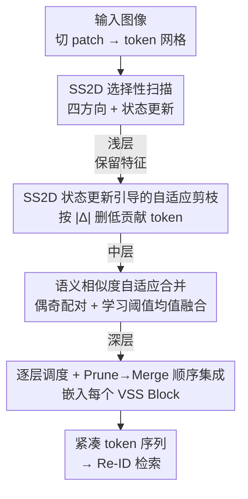

# SSM-Aware Token-Efficient VMamba via Adaptive Patch Pruning and Merging for Person Re-Identification

**会议**: CVPR 2026  
**论文**: [CVF Open Access](https://openaccess.thecvf.com/content/CVPR2026/html/Huang_SSM-Aware_Token-Efficient_VMamba_via_Adaptive_Patch_Pruning_and_Merging_for_CVPR_2026_paper.html)  
**代码**: https://github.com/YuanHuang0982/TE-VMamba  
**领域**: 人体理解 / 行人重识别 / 模型效率  
**关键词**: 行人重识别、视觉状态空间模型、VMamba、Token 剪枝、Token 合并

## 一句话总结
TE-VMamba 让 VMamba 的 SS2D 状态更新强度（步长 $\Delta$）和 token 相似度自己说话，在浅层按 $\Delta$ 剪掉对状态几乎没贡献的冗余 token、在深层把语义相似的 token 合并，在 Market-1501 上把 FLOPs 砍掉 60% 以上而 Rank-1 不降反升。

## 研究背景与动机
**领域现状**：行人重识别（Re-ID）一直在「判别能力」和「部署效率」之间找平衡。CNN 时代靠 PCB/OSNet 的部件级建模，Transformer 时代靠 TransReID/DC-Former 的全局注意力刷点，最近 VMamba 这类视觉状态空间模型（SSM）凭借线性复杂度的选择性扫描（SS2D）成为新的高效骨干候选。

**现有痛点**：VMamba 号称线性时间，但「线性复杂度」并不等于「实际推理快」。它仍然在一个稠密的 $H\times W$ token 网格上做串行状态更新，并行度受限；水平/垂直交替扫描还带来不小的数据搬运开销。在高分辨率输入、batch size = 1、边缘硬件这种真实部署条件下，GPU 利用率很低，token 数量直接拖住延迟、显存和能耗。

**核心矛盾**：减少 token 是公认的提效手段，但现有剪枝/合并方法（DynamicViT、EViT、ToMe 等）都是为「全局注意力的 ViT」设计的。直接搬到 SSM 上会忽视 SS2D 「有方向、有递归」的状态更新本质——它沿扫描路径顺序更新一个共享隐藏状态，乱删 token 会打断扫描顺序、破坏携带身份信息的结构，造成状态不一致。

**本文目标**：设计一套「懂 SSM」的 token 缩减机制，让删/合并的决策来自状态更新动力学本身，而不是外部启发式，从而在不掉点的前提下大幅减 token。

**切入角度**：作者注意到 SS2D 里输入相关的步长 $\Delta_k$ 直接决定了某个 token 对隐藏状态的改写幅度——$\Delta_k$ 接近 0 的 token 等于「在递归里几乎不出力却照样占算力」，这天然就是一个 SSM 原生的重要性指标，比 ViT 的注意力分数更贴合 Mamba 的传播方式。

**核心 idea**：用 SS2D 的状态更新强度 $\Delta$ 定义 token 重要性，浅层按自适应阈值剪枝、深层按语义相似度合并，并用可学习的逐层阈值动态平衡精度与算力。

## 方法详解

### 整体框架
TE-VMamba 沿用 VMamba 的四阶段层级结构：输入图像切成 patch，依次过若干 VSS Block，每个 Block 内部先做 SS2D 选择性扫描更新状态。本文的改动是在**每个 SS2D 块之后**插入两个轻量模块——先剪枝、再合并——既保留 SS2D 的状态更新通路，又顺手把冗余 token 砍掉。

整条流程按深度分工（depth-wise schedule）：**浅层（早期）不动**，专心做基础特征提取；**中层（约第 5–10 层）做 $\Delta$ 引导的自适应剪枝**，删掉对状态更新几乎无影响的 token；**深层（约第 12–18 层）做相似度合并**，把幸存 token 里语义重复的部分融合掉。因为身份线索本就稀疏、背景高度重复，这种「先去噪、后压缩」的安排能在大幅减 token 的同时保住判别力。剪枝和合并在每个 SS2D 块后顺序执行（Prune→Merge），整体仍保持线性复杂度。

### 关键设计

**1. SS2D 状态更新引导的自适应剪枝：让 $\Delta$ 自己指认冗余 token**

痛点很直接：SS2D 是递归扫描，每个 token 顺序改写一个共享隐藏状态，那些更新强度极小的 token 几乎不改变状态、却照样占着递归计算，纯属冗余。作者把 Mamba 的门控步长当成重要性度量：$\Delta_k = \mathrm{Softplus}(W_\Delta x_k + U_\Delta h_{k-1})$，$\Delta_k$ 越大说明该 token 对状态更新影响越强，接近 0 则几乎不参与递归动力学。于是用一个逐层自适应阈值来筛：$\theta = \mu - \alpha\sigma$，其中 $\mu,\sigma$ 是当前层 $|\Delta_k|$ 的 batch 统计量，$\alpha$ 控制剪枝激进度（实验取 0.7）。凡 $|\Delta_k| < \theta$ 的 token 直接剪掉。这样剪枝就成了一个由状态更新统计量驱动的「模型内生」操作，而不是外接的注意力启发式——它删掉的是递归里不活跃的 token，反而让扫描轨迹更稳定（实测剪枝后第 5–10 层的 $|\Delta|$ 均值曲线明显更低更平），在简单场景里更稀疏、在遮挡/大视角变化时自动多留 token。

**2. 语义相似度自适应合并：把幸存 token 里的重复区域融成一个**

剪枝之后，剩下的 token 里仍有大量相邻 token 表示几乎相同的语义区域（如均匀背景、衣服纹理）。为先保持空间连贯，TE-VMamba 用交替扫描——奇数层水平扫、偶数层垂直扫——让空间相邻的 token 在序列里也相邻，再把序列切成固定的偶奇配对 $(a_k, b_k)$ 作为合并单元。对每一对算归一化点积相似度 $s_k = \dfrac{a_k^\top b_k}{\lVert a_k\rVert_2 \lVert b_k\rVert_2}$。关键是阈值不写死：一个轻量门控头（tau head，两层 MLP + sigmoid）吃全局特征统计量，逐层逐实例地预测阈值 $\theta$，对不同纹理/姿态/遮挡自适应。当 $s_k > \theta$ 就用均值融合 $z_k = \dfrac{a_k + b_k}{2}$，否则保留。浅层合并保守留细节、深层更激进地把语义一致区域平均掉，得到紧凑又有表达力的表征。可学习的 MLP 门控取代了人工常数，实现了实例感知的 token 压缩，又不破坏空间连贯——这正好和剪枝互补：剪枝去掉噪声 token 提效率，合并整合信息 token 提表征质量。

**3. 逐层调度 + Prune→Merge 顺序集成：把两个模块塞进递归而不打断它**

两个模块都插在 SS2D 块之后、状态更新之后，且**先剪枝再合并**。这个顺序不是随便定的：剪枝先把 $\Delta$ 引导下无贡献的弱 token 拦在后续递归之外，避免它们继续污染状态传播；合并再只在「真正影响隐藏状态」的幸存 token 上做整合。作者明确对比了另两种顺序的坏处——Merge→Prune 会让冗余 token 在被剪掉前就改写了特征分布、扰乱递归；Simultaneous（同时做）会让本该被剪的 token 被提前合并，造成不稳定的特征轨迹和 $\Delta$ 剪枝与相似度合并之间的决策冲突。只有 Prune→Merge 既维持了递归关系 $h_t = \bar{A}h_{t-1} + \bar{B}x_t$、保持线性复杂度，又避免了上述不稳定。推理时缓存 mask 和合并索引，保证相同输入下 token 轨迹确定可复现。

### 损失函数 / 训练策略
端到端训练，沿用标准 Re-ID 协议：标签平滑交叉熵 $L_{CE}$ + Batch-Hard 三元组损失 $L_{Tri}$，总损失 $L = L_{CE} + \lambda L_{Tri}$（$\lambda=1.0$，margin 0.3，smoothing 0.1）。剪枝/合并阈值 $\theta_p,\theta_m$ 用 softplus 参数化学习，提供平滑梯度、避免硬性 token mask 带来的不稳定；前向虽是二值选择，但 softplus 形式保证 $\theta$ 连续可优化。$\Delta$ 重要性分数本身随 token 平滑变化，故不对 $\Delta$ 加正则；剪枝阈值 $\theta$ 则朝目标稀疏度正则化以稳定剪枝行为。优化器 AdamW，学习率 3e-4，batch size 128。

## 实验关键数据

### 主实验
在 Market-1501、CUHK03-NP、MSMT17 上与 CNN / Transformer / Mamba 方法对比（无 re-ranking，Rank-1 / mAP）：

| 方法 | Market-1501 R-1 | CUHK03-NP(Lab) R-1/mAP | CUHK03-NP(Det) R-1/mAP | MSMT17 R-1/mAP |
|------|------|------|------|------|
| DC-Former (Transformer) | 96.0 | 84.4 / 83.3 | 79.6 / 77.5 | 86.9 / 70.7 |
| PHA (Transformer) | 96.1 | 84.5 / 83.0 | 83.2 / 80.3 | 86.1 / 68.9 |
| TE-VMamba-Tiny (本文) | 93.6 | 96.3 / 92.1 | 94.0 / 90.6 | 82.8 / 62.9 |
| TE-VMamba-Base (本文) | **96.7** | **97.3 / 94.0** | **95.4 / 91.7** | 83.3 / 62.7 |

TE-VMamba-Base 在 Market-1501 拿到最高 Rank-1（96.7%），在 CUHK03-NP 两个 split 上都是 SOTA；MSMT17 上与强 Transformer 基本持平。遮挡数据集 Occluded-ReID 上同样亮眼：

| 方法 | Rank-1 | mAP |
|------|------|------|
| ADP | 89.2 | 85.1 |
| FLaN-Net | 92.6 | **89.5** |
| TE-VMamba (本文) | **95.5** | 85.3 |

### 消融实验
Market-1501 上拆分剪枝/合并的贡献（四种配置：无缩减 / 仅合并 / 仅剪枝 / 剪枝+合并）：

| Backbone | 配置 | Rank-1 (ΔR-1) | mAP (ΔmAP) | FLOPs(G) (ΔFLOPs) |
|------|------|------|------|------|
| VMamba-Tiny | 无缩减 | 98.2 | 91.6 | 5.02 |
| | 仅合并 | 98.5 (+0.3) | 91.1 (−0.5) | 5.02 (0) |
| | 仅剪枝 | 93.9 (−4.3) | 84.3 (−7.3) | 1.86 (−3.16) |
| | 剪枝+合并 | 93.6 (−4.6) | 84.2 (−7.4) | 1.86 (−3.16) |
| VMamba-Base | 无缩减 | 98.2 | 91.6 | 15.46 |
| | 仅合并 | 98.5 (+0.3) | 92.1 (+0.5) | 15.46 (0) |
| | 剪枝+合并 | 96.7 (−1.5) | 87.1 (−4.5) | 3.82 (−11.64) |

合并/剪枝顺序消融（Base）与相似度度量消融：

| 顺序配置 | Rank-1 | mAP | FLOPs(G) |
|------|------|------|------|
| Prune→Merge | 96.7 | 87.1 | **3.82** |
| Merge→Prune | 96.7 | 87.4 | 7.69 |
| Simultaneous | 95.5 | 86.4 | 3.83 |

相似度度量上点积（96.7 / 87.1）略优于 cosine / KNN / RBF / L2。推理时把 token 缩减对称用于 query 和 gallery（Base），Market-1501 上 FLOPs 从 15.46G → 3.82G、延迟 397ms → 218ms、吞吐 322 → 590 im/s。

### 关键发现
- **合并比剪枝「友好」得多**：仅合并几乎不掉点甚至涨点（FLOPs 不变），因为它只是整合冗余；仅剪枝掉点明显（$\Delta$ 重要性和身份判别线索并非完全对齐，会误删中等重要 token）。两者结合才在大幅减 FLOPs 下保住精度——剪枝去噪、合并重建结构，互补。
- **Base 比 Tiny 更扛剪枝**：同样剪枝+合并，Tiny 掉 4.6% Rank-1，Base 只掉 1.5%，说明容量更大的骨干冗余更多、更经得起裁剪。
- **顺序至关重要**：Prune→Merge 在同等精度下 FLOPs 最低（3.82G vs Merge→Prune 的 7.69G），印证了「先剪后合并」与递归扫描结构对齐的论点。
- **逐层分析为「在哪剪/合并」给出依据**：baseline 在第 5–10 层 $|\Delta|$ 均值飙升（大量低显著 token 制造噪声更新），剪枝后该区间曲线更低更平；第 12–18 层 token 相似度更高，正好适合合并。

## 亮点与洞察
- **用 $\Delta$ 当 token 重要性度量，是「免费」且 SSM 原生的**：步长 $\Delta_k$ 本就是 Mamba 选择性扫描里现成的量，拿来判断 token 该不该留，既不引入额外打分网络，又比硬搬 ViT 注意力分数更贴合状态更新动力学——这是全文最巧的一笔。
- **剪枝/合并的「浅剪深合」深度分工有实证支撑**：不是拍脑袋分层，而是先用 block-wise 的 $|\Delta|$ 曲线和相似度曲线找到「哪层噪声大该剪、哪层冗余高该合并」，再据此排程。
- **可迁移**：「用模型内部某个现成的门控/选择量当重要性指标做 token 缩减」这套思路，可迁移到任何带选择性机制的 SSM 视觉骨干（分类、检测、分割），不限于 Re-ID。

## 局限与展望
- **剪枝单独用会明显掉点**：作者自己承认 $\Delta$ 重要性与身份判别线索并非完全对齐，仅剪枝会误删中等重要 token，必须靠合并兜底，说明 $\Delta$ 作为重要性代理仍不够精准。
- **评测主要在标准 Re-ID benchmark**：⚠️ 论文报告的延迟/吞吐均在单张 RTX 5080 上测得，对其主打的「边缘硬件、batch=1」真实部署场景缺乏直接实测，泛化到低端设备的实际收益待验证。
- **超参偏经验**：剪枝层 5–10、合并层 12–18、$\alpha=0.7$、$\tau=0.1$ 等设定较多依赖针对 VMamba 结构的经验调参，换骨干/换任务可能需重调。
- 改进方向：让重要性度量同时融合 $\Delta$ 与身份判别监督（而非纯状态更新强度），或把剪枝阈值也做成实例自适应，可能进一步减小仅剪枝时的精度损失。

## 相关工作与启发
- **vs ViT 的 token 缩减（DynamicViT / EViT / ToMe）**: 它们基于全局注意力分数选/合并 token，本文指出直接搬到 SSM 会忽视 SS2D 的方向性与递归性、打断扫描顺序；TE-VMamba 改用状态更新强度 $\Delta$ 和扫描感知的偶奇配对，决策与递归动力学对齐。
- **vs Transformer-based Re-ID（TransReID / DC-Former / PHA）**: 它们靠全局注意力刷判别力但算力随 token 平方增长；本文走 SSM 线性骨干 + token 缩减路线，在 CUHK03-NP / Occluded-ReID 上反超，同时 FLOPs 砍到 1/4。
- **vs 混合 CNN–Mamba Re-ID**: 已有工作证明 SSM 骨干在 Re-ID 上可竞争，本文进一步在 SSM 内部做「懂状态更新」的 token 缩减，把效率优势从「线性复杂度」落到「实际 FLOPs/延迟」。

## 评分
- 新颖性: ⭐⭐⭐⭐ 用 SS2D 的 $\Delta$ 步长定义 token 重要性、做 SSM 原生的剪枝+合并，角度新且贴合 Mamba 本质。
- 实验充分度: ⭐⭐⭐⭐ 四个数据集 + 组件/顺序/相似度度量/推理多组消融，但边缘硬件部署缺直接实测。
- 写作质量: ⭐⭐⭐⭐ 动机—机制—顺序论证清晰，图表配合到位。
- 价值: ⭐⭐⭐⭐ 给「高效 SSM 视觉骨干」提供了可复用的 token 缩减范式，FLOPs 减 60%+ 不掉点有实用意义。

<!-- RELATED:START -->

## 相关论文

- [\[CVPR 2026\] View-Aware Semantic Alignment for Aerial-Ground Person Re-Identification](view-aware_semantic_alignment_for_aerial-ground_person_re-identification.md)
- [\[CVPR 2026\] Composite-Attribute Person Re-Identification via Pose-Guided Disentanglement](composite-attribute_person_re-identification_via_pose-guided_disentanglement.md)
- [\[CVPR 2026\] Pose-guided Enriched Feature Learning for Federated-by-camera Person Re-identification](pose-guided_enriched_feature_learning_for_federated-by-camera_person_re-identifi.md)
- [\[CVPR 2026\] WHU-MARS: A Multispectral Aerial-Ground Benchmark Towards Any-Scenario Person Re-Identification](whu-mars_a_multispectral_aerial-ground_benchmark_towards_any-scenario_person_re-.md)
- [\[CVPR 2026\] Vision-Language Attribute Disentanglement and Reinforcement for Lifelong Person Re-Identification](vision-language_attribute_disentanglement_and_reinforcement_for_lifelong_person_.md)

<!-- RELATED:END -->
