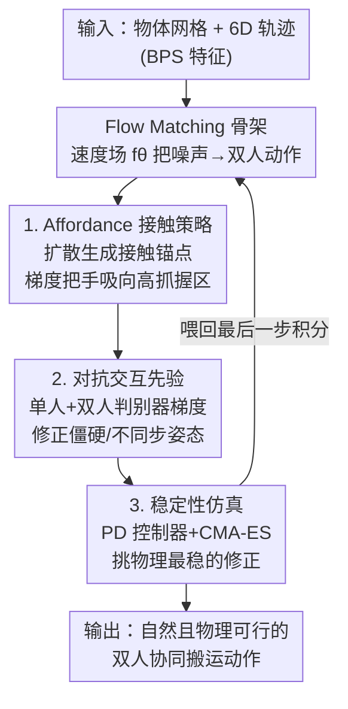

# Stability-Driven Motion Generation for Object-Guided Human-Human Co-Manipulation

**会议**: CVPR 2026  
**arXiv**: [2604.20336](https://arxiv.org/abs/2604.20336)  
**代码**: https://github.com/boycehbz/StaCOM (有)  
**领域**: 人体运动生成 / 人-物交互 / 物理仿真  
**关键词**: 双人协同搬运, flow matching, 抓握 affordance, 对抗交互先验, 稳定性仿真

## 一句话总结
给定一个物体的网格和它的运动轨迹，本文用 flow matching 框架生成两个人协同搬运这个物体的全身动作，并通过「affordance 引导的接触策略 + 对抗交互先验 + 基于采样的稳定性仿真」三个模块，让生成动作同时满足意图正确（手抓对地方）、姿态自然、物理稳定（不漂浮、不穿模），在 Core4D 上接触准确率、穿模、分布保真度都显著超过现有 HOI 基线。

## 研究背景与动机
**领域现状**：人体运动生成已经从单人场景（一个人在静态环境里走动、或跟随预定物体轨迹）发展到多人交互（社交、双人舞蹈）。人-物交互（HOI）生成这一支也从「接触感知的扩散」走向「affordance 驱动的推理」，代表工作有 OMOMO、InterDiff、CG-HOI 等。

**现有痛点**：现有方法几乎都为单人或不含物体操纵的多人场景设计。单人 HOI 方法（如 OMOMO）缺乏「人与人之间互相沟通、互相适配」的机制，硬扩展到双人会出现协调不稳、频繁穿模；多人交互方法（InterGen、ComMDM）专注社交/舞蹈，不带物体操纵，直接套用无法保证合理的物理动力学和人-物协调。RL 类物理方法（CooHOI）虽能保证物理可行，但策略无法泛化到不同物体和任务。

**核心矛盾**：真实的协同搬运是「人-人-物」三方紧耦合的三元交互——每个人既要适配物体的运动，又要适配搭档的行为，还要扛住负载带来的动力学（payload-induced dynamics）。现有生成范式要么只建模运动学（kinematics-only，会漂浮穿模），要么用 RL 做物理但泛化差，两者都顾不全。

**本文目标**：作者把「真实协同搬运」拆成三个必须同时满足的标准——意图（Intention）：抓握策略要由物体形状/affordance/目标状态决定；自然性（Naturalness）：动作要自然且对搭档动作有响应；有效性（Effectiveness）：搬运过程要稳定、符合物理定律。

**切入角度**：用确定性的 flow matching 作为生成骨架（相比扩散的随机去噪，flow matching 是确定性向量场，便于把各种条件当 guidance 注入引导），再分别针对意图、自然性、有效性三条标准挂三个外部模块去「掰」生成轨迹。

**核心 idea**：在 flow matching 的每一步 Euler 积分里，用「接触锚点梯度（管意图）+ 对抗判别器梯度（管自然）+ 物理仿真校正（管稳定）」三股力量同时修正速度场，得到既听话又自然又物理可行的双人搬运动作。

## 方法详解

### 整体框架
输入是一个物体网格 $\mathcal{O}$ 和它的刚体运动轨迹 $\{(R^o_t,\mathbf{d}^o_t)\}$，输出是两个人（SMPL-X 表示）的协同搬运动作序列。核心是一个 transformer 形式的 flow matching 网络 $f_\theta$：它学一个连续速度场，把噪声 $\mathbf{x}_0$ 沿向量场逐步传输到干净的双人动作 $\mathbf{x}_1$，条件 $\mathbf{c}$ 包含物体 6D 位姿、BPS 形状特征和缓存的接触锚点。

在这个生成骨架之上，作者挂了三个独立预训练、推理时联合执行的模块，分别对应意图/自然/有效三条标准：(b) **affordance 引导的接触策略**——一个扩散模型根据物体 affordance 生成「手该抓哪里」的接触锚点，作为显式梯度把手往高抓握概率区域吸；(c) **对抗交互先验**——两个判别器（单人姿态 + 双人交互）打分动作自然度，把梯度回传去掉僵硬/不同步的姿态；(d) **稳定性仿真**——在倒数第二个积分步把当前动作丢进物理引擎（PD 控制器 + CMA-ES 采样优化），挑出物理最稳的修正结果再喂回最后一步积分。三个模块的梯度/校正都作用在同一个 flow 速度场上。

### 关键设计

**1. Flow matching 协同生成骨架：用确定性向量场把噪声传输成双人动作**

针对「双人协同搬运需要一个能高效注入多种条件的生成器」这一需求，作者用 flow matching 而非扩散：它把运动生成建模为速度场回归，学一个把噪声样本 $\mathbf{x}_0$ 传输到数据分布 $\mathbf{x}_1$ 的连续向量场，积分更新为 $\mathbf{x}_{\tau+\Delta\tau}=\mathbf{x}_\tau+\Delta\tau\, f_\theta(\mathbf{x}_\tau,\tau,\mathbf{c})$，推理只需 $K=10$ 步 Euler 积分。条件 $\mathbf{c}$ 拼接了物体位姿、BPS 嵌入（$\mathbf{b}_t\in\mathbb{R}^{1024}$，从物体表面固定采样算出，给网络逐帧的动态形状感知）和缓存接触锚点。

训练目标是均方流匹配损失 $\mathcal{L}_{\text{flow}}=\mathbb{E}_{\tau,\mathbf{x}_\tau}[\|f_\theta(\mathbf{x}_\tau,\tau,\mathbf{c})-(\mathbf{x}_1-\mathbf{x}_0)\|_2^2]$。为了让铰接关节解码更稳，额外加了对解码 SMP​L-X 参数的 L1 监督 $\mathcal{L}_{\text{SMPL}}=\mathbb{E}_\tau[\|\hat{\mathbf{x}}_1-\mathbf{x}_1^{\text{gt}}\|_1]$；为抑制脚滑，加足部接触损失 $\mathcal{L}_{\text{foot}}=\|(\mathbf{J}_f^{t+1}-\mathbf{J}_f^t)\cdot f^t\|_2^2$（在接触帧惩罚足部位移）。相比扩散的随机去噪，确定性向量场让「在每个积分步把外部梯度叠加进速度」变得自然——这正是后面三个模块能介入的接口。

**2. Affordance 引导的接触策略：让「手抓哪里」由物体可抓性决定，而非硬背轨迹**

针对「同一个物体运动可以由很多种手部动作产生，光靠 flow 网络生成的接触不够多样也不够语义一致」的痛点，作者先用一个回归网络在物体表面采样点上预测 affordance 概率 $\alpha_k$（可抓性），再用一个扩散模型以 affordance + BPS 为条件、从纯噪声生成接触策略 $\mathcal{C}=\{(\mathbf{p},\mathbf{n},\boldsymbol{\delta},s)\}$（接触点位置、法向、局部偏移、是否接触）。该扩散模型受三项约束：接触锚点损失 $\mathcal{L}_{\text{anchor}}$（生成锚点贴近真值接触点）、法向对齐 $\mathcal{L}_{\text{normal}}=\frac{1}{Z_{\text{pos}}}\sum s(1-\hat{\mathbf{n}}\cdot\mathbf{n})$、以及 affordance 正则 $\mathcal{L}_{\text{aff}}=-\frac{1}{Z_{\text{pos}}}\sum s\log\alpha(\hat{\mathbf{p}})$——在预测锚点处评估 affordance 场，鼓励采样落在高可抓性区域。

预测出的接触锚点随后作为显式梯度去引导 flow：定义可微距离损失 $\mathcal{L}_{\text{contact}}=\frac{1}{Z}\sum_{a,h}\mathcal{V}_{a,h}\|\mathbf{w}_{a,h}-\hat{\mathbf{p}}_{a,h}\|_2^2$（把手腕 $\mathbf{w}$ 拉向接触锚点 $\hat{\mathbf{p}}$），在每个 Euler 步把流预测按该损失梯度修正：$\tilde{f}_\theta(\mathbf{x}_\tau)=f_\theta(\mathbf{x}_\tau)-\gamma\nabla_{\mathbf{x}_\tau}\mathcal{L}_{\text{contact}}$。这样既保证手跟物体轨迹一致，又因为 affordance 加权而允许多样的抓握方案——几何一致但动作多样。

**3. 对抗交互先验：用双判别器把僵硬、不同步的协同姿态「磨」自然**

针对「只靠接触引导会出现僵硬或不同步的姿态、损害自然度」的痛点，作者在「单人姿态」和「双人交互」两个层面各设一个对抗判别器。单人姿态判别器 $\mathcal{D}_\phi^{\text{body}}$ 输入逐关节旋转矩阵 + SMPL 形状系数，对 21 个关节旋转块做 $1\times1$ 卷积提取关节级真实性线索，再与形状分支融合输出真实度分数；交互判别器 $\mathcal{D}_\phi^{\text{int}}$ 处理双人旋转拼接 + 相对根变换 + 融合形状描述子，捕捉单人观测推不出来的「人际协调」线索。每个判别器用非饱和 BCE 训练，真样本是数据集真值姿态、假样本是生成姿态；值得注意的是 Core4D 的单人姿态本身可能有瑕疵，所以训单人判别器时把 Core4D 排除出真样本集。

除了训练时把对抗梯度回传给 flow 解码器，作者还把训好的判别器复用为推理时的引导器：用聚合梯度 $\nabla_{\mathbf{x}_\tau}\log\mathcal{D}_\phi^k$ 去修正预测状态，$\tilde{f}_\theta(\mathbf{x}_\tau)=f_\theta(\mathbf{x}_\tau)+\eta\sum_{k\in\{\text{body,int}\}}\nabla_{\mathbf{x}_\tau}\log\mathcal{D}_\phi^k$，把积分推向判别器认可的「真实人类动作模式」区域。和以往只看单人的判别器不同，这里的交互先验专门盯协作线索、惩罚不对齐的反应。

**4. 稳定性驱动仿真：用物理引擎把「漂浮/穿模」的不稳定动作采样优化掉**

针对「生成动作虽然轨迹对、交互看着合理，但手和物体之间常严重漂浮、穿模，导致物体不稳、物理上不可能」的痛点，作者引入基于采样的物理仿真（而非 RL，因为现有 RL 策略无法泛化到不同物体/任务）。在 flow 的倒数第二个积分步执行：把 $\mathbf{x}_\tau$ 转成 SMPL-X 参数、在 PyBullet 里实例化人形模型，用 PD 控制器配合 CMA-ES 算法调整身体姿态——从多元正态 $\mathcal{N}(\boldsymbol{m},\boldsymbol{C})$ 采样校正量 $\Delta\mathbf{x}_\tau$ 构造目标 $\bar{\mathbf{x}}_\tau=\mathbf{x}_\tau+\Delta\mathbf{x}_\tau$，PD 控制器产生关节力矩驱动人形朝目标姿态运动。

每个采样用代价 $\mathcal{L}_{\text{phys}}=\mathcal{L}_{\text{sim}}+\mathcal{L}_{\text{sta}}$ 评估：相似度损失 $\mathcal{L}_{\text{sim}}$ 衡量仿真后的人体/物体位姿与输入的偏差；稳定性损失 $\mathcal{L}_{\text{sta}}=\frac{\|\vec{f}(t)-M_o\vec{a}\|_2^2}{\|M_o\vec{g}\|_2^2}+\frac{\|\vec{\mu}(t)-I_o\vec{\alpha}\|_2^2}{\|I_o\vec{\alpha}\|_2^2}+e^{-m(t)}$，三项分别约束「合外力要匹配物体应有的线加速度」「合外力矩要匹配角加速度」和一个能量正则（$M_o$、$I_o$ 是物体质量与惯量，$\vec{a}$、$\vec{\alpha}$ 由输入轨迹算出，$\vec{g}$ 是重力）。CMA-ES 迭代优化采样分布，取代价最低的仿真结果 $\tilde{\mathbf{x}}_\tau$ 喂回最后一步积分。由于仿真结果物理上稳但可能因缺先验而姿态略不自然，最后这一步 flow 积分恰好把自然度找回来——这也是 FID 在加仿真后几乎不变的原因。

### 损失函数 / 训练策略
- 总损失 $\mathcal{L}_{\text{total}}=\mathcal{L}_{\text{flow}}+\mathcal{L}_{\text{SMPL}}+\mathcal{L}_{\text{foot}}+\mathcal{L}_{\text{prior}}$，其中 $\mathcal{L}_{\text{prior}}=\mathcal{L}_{\text{prior}}^{\text{body}}+\mathcal{L}_{\text{prior}}^{\text{int}}$ 是对抗损失。
- 接触策略扩散模型单独训，损失 $\mathcal{L}_{\text{str}}=\mathcal{L}_{\text{anchor}}+\mathcal{L}_{\text{normal}}+\mathcal{L}_{\text{aff}}$。
- 三大模块（接触策略 b、flow matching a、交互先验 c）均**分别提前独立训练**，推理时**联合执行**；稳定性仿真 d 无需训练（采样优化）。
- 训练配置：单张 RTX 4090，batch size 10，学习率 $1\times10^{-4}$，AdamW + cyclic cosine 调度。推理用 $K=10$ 步 Euler 积分 + 稳定性精修；物理仿真器跑 240 Hz、PD 控制器 60 Hz。生成一段 128 帧序列，flow 网络耗时 1.19 s、物理仿真耗时约 3 min。

## 实验关键数据

### 主实验
数据集：Core4D（大规模人-物-人协同交互，提供物体轨迹真值，用官方 train/test 划分，分 S1/S2 两个 split）+ Inter-X（人-人交互，用于增强生成质量与多样性）。由于没有现成开源的人-人-物方法可直接对比，作者把 ComMDM、InterGen 的文本条件换成物体 6D 位姿+BPS，并把单人 HOI 方法 OMOMO 扩展到双人当基线。

指标：IDF↓（交互距离场，人-物空间关系保真度）、Contact Acc.↑（手-物二值接触帧级精度）、FID↓（分布真实度）、Div.↑（生成序列两两距离的多样性）、Pene.↓（人体网格与物体的有符号穿模深度）。

| 方法 | IDF↓ (S1) | Contact Acc.↑ (S1) | FID↓ (S1) | Pene.↓ (S1) | IDF↓ (S2) | Contact Acc.↑ (S2) | FID↓ (S2) | Pene.↓ (S2) |
|------|-----------|--------------------|-----------|-------------|-----------|--------------------|-----------|-------------|
| ComMDM | 0.41 | 0.11 | 52.5 | 0.19 | 0.43 | 0.12 | 49.4 | 0.21 |
| OMOMO | 0.38 | 0.21 | 45.8 | 0.15 | 0.37 | 0.23 | 44.4 | 0.15 |
| InterGen | 0.47 | 0.13 | 35.4 | 0.11 | 0.47 | 0.10 | 30.2 | 0.12 |
| **Ours** | **0.22** | **0.44** | **25.5** | **0.05** | **0.20** | **0.46** | **21.6** | **0.06** |

本文在 IDF、接触准确率、FID、穿模上全面领先：接触准确率从次优的 ~0.21（OMOMO）翻倍到 0.44，穿模深度从 0.11（InterGen）降到 0.05，FID 从 35.4 降到 25.5；多样性 Div.（1.15/1.18）与基线相当，说明提升保真度没牺牲多样性。

### 消融实验
在 Core4D-S1 上从 Flow Matching 基线逐步叠加模块：

| 配置 | IDF↓ | Contact Acc.↑ | FID↓ | Div.↑ | Pene.↓ | 说明 |
|------|------|---------------|------|-------|--------|------|
| Flow Matching | 0.25 | 0.35 | 26.3 | 1.16 | 0.15 | 仅 6D 位姿轨迹的裸骨架 |
| + BPS feature | 0.24 | 0.37 | 26.1 | 1.15 | 0.14 | 加形状感知 |
| + Contact | 0.24 | 0.40 | 26.0 | 1.16 | 0.20 | 加 affordance 接触引导，接触准确率 0.35→0.40 |
| + GT Contact | 0.25 | 0.42 | 26.1 | 1.15 | 0.20 | 用真值接触做上界 |
| + Individual Prior | 0.22 | 0.34 | 25.5 | 1.15 | 0.16 | 单人判别器，IDF 0.25→0.22、FID→25.5 |
| + Interaction Prior | 0.23 | 0.35 | 25.4 | 1.16 | 0.16 | 双人判别器，接触准确率回升到 0.35 |
| + Simulation | 0.23 | 0.42 | 28.6 | 1.15 | 0.02 | 仿真把穿模压到 0.02、接触准确率拉到 0.42，但 FID 升到 28.6（姿态略不自然） |
| **Ours** | **0.22** | **0.44** | **25.5** | 1.15 | **0.05** | 仿真后再走最后一步 flow，FID 找回 25.5、穿模 0.05 |

### 关键发现
- **稳定性仿真贡献最大也最关键**：去掉仿真，接触准确率从 0.44 掉到 0.37、穿模从 0.05 暴涨到 0.16，证明物理反馈对稳定准确的协同搬运不可或缺。
- **仿真 + 最后一步 flow 的配合很巧**：单看「+ Simulation」行，穿模降到 0.02（最低）但 FID 反升到 28.6——因为仿真只管物理稳定、不管姿态自然；再走最后一步 flow 积分后 FID 回到 25.5、穿模略升到 0.05，说明最后这步成功把物理校正后的自然度找回来。
- **接触引导直接拉接触准确率**：affordance 锚点引导让接触准确率 0.35→0.40；用 GT 接触可达 0.42（上界），说明预测锚点已接近理想。
- **单人先验提保真、双人先验提协调**：单人判别器把 IDF/FID 拉低（局部姿态变好），但接触准确率暂时降到 0.34；再加双人判别器把接触准确率回拉到 0.35 且 FID 保持 25.4，说明对抗引导能在不牺牲真实度的前提下增强人际协调。

## 亮点与洞察
- **把生成的「不可控」拆成三条标准、各挂一个外挂模块去掰**：意图→affordance 接触梯度、自然→对抗判别器梯度、有效→物理仿真校正，三股力量都作用在同一个确定性 flow 速度场的每个积分步上。这种「确定性向量场 + 多源 guidance 叠加」的接口设计很值得借鉴——比扩散的随机去噪更容易把异质约束插进去。
- **判别器一物两用**：训练时回传对抗梯度，推理时复用为采样引导器（classifier guidance 式），无需额外训练就能在推理期持续把动作往真实流形拉。
- **物理仿真放在倒数第二步、最后留一步 flow 收尾**：这个顺序很关键——仿真保物理但伤自然度，最后一步 flow 专门补自然度，FID 不升反稳。这个「物理校正夹在生成中间、再用生成收尾」的 trick 可迁移到任何「物理可行 vs 视觉自然」有冲突的生成任务。
- **用 CMA-ES + PD 控制器做无需训练的物理精修**：绕开了 RL 策略泛化差的问题，对任意物体/任务都能即插即用，代价是单序列 3 分钟的推理开销。

## 局限与展望
- **物理仿真很慢**：生成 128 帧 flow 只要 1.19 s，但稳定性仿真要约 3 min，实时性差，难用于交互式/实时场景。
- **依赖物体轨迹作为输入**：方法是「给定物体 6D 轨迹生成人体动作」，并不自己规划物体怎么动；真正的协同搬运里物体轨迹是人协商出来的，这里被当成已知条件。
- **数据集质量影响先验**：作者自己提到 Core4D 单人姿态有瑕疵，不得不把它排除出单人判别器的真样本集——说明先验质量受限于现有人-物-人数据集的标注质量。
- **只做双人**：框架建模 $a\in\{1,2\}$ 两个 agent，扩展到三人及以上的协同搬运（耦合更复杂）未验证。
- **无直接可比的开源方法**：所有基线都是把人-人或人-物方法「魔改」适配过来的，缺一个原生人-人-物 SOTA 做对照，绝对数值的说服力打折。

## 相关工作与启发
- **vs OMOMO（单人 HOI）**：OMOMO 从物体轨迹重建单人交互、施加接触约束，但启发式扩到双人会出现协调不稳和频繁穿模（Contact Acc. 仅 0.21、Pene. 0.15）；本文原生双人建模 + 物理仿真，接触准确率翻倍、穿模降到 0.05。
- **vs InterGen / ComMDM（多人交互）**：它们用 Transformer + cross-attention 做双人自然交互，但不含物体接触约束，导致严重的手-物错位（IDF 0.47、Contact Acc. 0.10–0.13）；本文用 affordance 接触梯度显式把手吸到物体上。
- **vs CooHOI（RL 物理 HOI）**：CooHOI 用强化学习实现物理可行的协作交互，但策略无法跨物体/任务泛化；本文改用基于采样的 CMA-ES 优化，无需训练策略，对不同物体即插即用，代价是推理慢。
- **启发**：「确定性 flow + 多源梯度 guidance」是把 affordance、对抗先验、物理仿真这类异质约束统一注入生成过程的好接口；「物理校正夹生成中间、生成收尾」的两阶段顺序能化解物理可行与视觉自然的冲突。

## 评分
- 新颖性: ⭐⭐⭐⭐ 首个把 flow matching + affordance 接触 + 对抗交互先验 + 采样式物理仿真整合到双人协同搬运生成的工作，问题设定（人-人-物三元）也较新。
- 实验充分度: ⭐⭐⭐⭐ Core4D 双 split + 逐模块消融较完整，关键模块贡献讲得清楚；但缺原生可比 SOTA、未做实时性/多人扩展验证。
- 写作质量: ⭐⭐⭐⭐ 三标准（意图/自然/有效）对三模块的逻辑主线清晰，公式与图配合好；个别符号略密。
- 价值: ⭐⭐⭐⭐ 协同搬运对机器人协作、VR、动画有实际价值，模块设计（尤其物理夹生成中间的 trick）可迁移；推理慢限制落地。

<!-- RELATED:START -->

## 相关论文

- [\[CVPR 2026\] Towards Highly-Constrained Human Motion Generation with Retrieval-Guided Diffusion Noise Optimization](towards_highly-constrained_human_motion_generation_with_retrieval-guided_diffusi.md)
- [\[CVPR 2026\] ReGenHOI: Unifying Reconstruction and Generation for 3D Human-Object Interaction Understanding](regenhoi_unifying_reconstruction_and_generation_for_3d_human-object_interaction_.md)
- [\[CVPR 2026\] MoLingo: Motion-Language Alignment for Text-to-Human Motion Generation](molingo_motion-language_alignment_for_text-to-motion_generation.md)
- [\[CVPR 2026\] MotionMaster: Generalizable Text-Driven Motion Generation and Editing](motionmaster_generalizable_text-driven_motion_generation_and_editing.md)
- [\[CVPR 2026\] Towards Decompositional Human Motion Generation with Energy-Based Diffusion Models](towards_decompositional_human_motion_generation_with_energy-based_diffusion_mode.md)

<!-- RELATED:END -->
