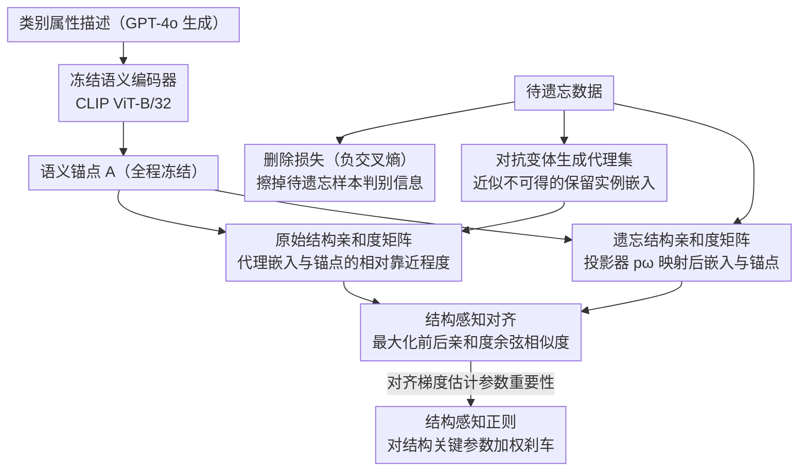

# Stake the Points: Structure-Faithful Instance Unlearning

**会议**: CVPR2026  
**arXiv**: [2603.12915](https://arxiv.org/abs/2603.12915)  
**代码**: 待确认  
**领域**: 人体理解  
**关键词**: machine unlearning, instance-level unlearning, structural preservation, semantic anchors, CLIP

## 一句话总结

提出 Structguard，通过语义锚点（semantic anchors）保持遗忘过程中保留实例间的语义关系结构，避免结构性崩塌，在图像分类/人脸识别/检索三任务上平均提升 32.9%/19.3%/22.5%。

## 背景与动机

1. **数据保护法规驱动**：GDPR 等法规要求模型能删除特定用户数据的影响，从头重训代价过高，催生了机器遗忘（Machine Unlearning, MU）研究
2. **实例级遗忘更实际**：真实删除请求通常针对具体个体而非整个类别，实例级遗忘比类级遗忘更具现实意义
3. **现有方法忽视语义结构**：已有 MU 方法（如 Neggrad、Adv、L2UL）在删除目标实例时，破坏了保留实例之间的语义关系，导致表征空间的渐进式结构崩塌
4. **结构崩塌与性能负相关**：作者实验发现结构崩塌程度与删除-保留平衡准确率呈显著负相关，结构保持越好，遗忘效果越好
5. **无需保留集**：真实场景中原始训练数据往往因策略、存储等限制不可访问，方法仅依赖预训练模型和待遗忘数据
6. **知识编码在关系中**：深度模型的知识不是孤立存储的，而是通过语义关系来组织的，遗忘过程必须保护这种关系结构

## 方法详解

### 整体框架

Structguard 想解决的是实例级机器遗忘里一个被忽视的副作用：删着删着，连保留实例之间的语义关系也一起删坏了，表征空间发生渐进式的结构崩塌。作者的核心观察是——模型的知识并不孤立地存在每个样本里，而是编码在实例之间的关系结构中，所以遗忘时必须把这套结构当成显式的保护对象。

整体怎么转：先给每个类别造一批固定的"语义锚点"（stakes）当桩子，把保留实例的嵌入与这些锚点的亲和度记成一份"原始结构"；遗忘时一手用负交叉熵擦掉待遗忘样本的判别信息，另一手强制让擦除后的嵌入-锚点亲和度对齐回原始结构，同时对那些对结构最关键的参数加正则刹车。由于真实场景里原始保留集往往不可访问，保留实例的嵌入用对待遗忘样本生成的对抗变体来近似。整个过程只依赖预训练模型和待遗忘数据，不需要保留集。

### 关键设计

**1. 语义锚点：造一批数据无关的固定参照桩，给遗忘过程立锚**

崩塌之所以发生，是因为遗忘的梯度没有任何外部参照，嵌入可以自由漂移。Structguard 给每个类别 $c$ 用 GPT-4o 生成一段属性描述（纹理、形状、典型上下文等），把描述拼接后送进冻结的语义编码器 $T(\cdot)$（CLIP ViT-B/32），得到类级锚点 $a_c$，所有锚点堆成矩阵 $A \in \mathbb{R}^{b \times d}$ 并在遗忘全程冻结。选语言而非图像来造锚点，是因为属性描述天然数据无关、稳定，不会随训练数据被删而失效——消融里语义锚点比视觉原型锚点在 CIFAR-10 上高 7.84%，印证了语言引导的参照点确实更牢靠。

**2. 结构定义与代理集：把"知识结构"量化成嵌入-锚点亲和度矩阵，再用对抗样本补出缺失的保留集**

有了锚点，"结构"就被具体化成亲和度矩阵：原始结构 $S^{\text{ori}} = V^{\text{ori}} \cdot A^\top$ 记录保留实例嵌入 $V^{\text{ori}}$ 与各锚点的相对靠近程度，遗忘结构 $S^{\text{unl}} = V^{\text{unl}} \cdot A^\top$ 则是经可学习投影器 $p_\omega$ 映射后的嵌入与锚点的亲和度。这里的关键现实约束是保留集 $V^{\text{ori}}$ 拿不到，作者的做法是对待遗忘样本生成对抗变体来近似保留实例的嵌入分布，构成一个代理集，从而在没有真实保留数据的前提下也能算出 $S^{\text{ori}}$ 作为对齐目标。

**3. 结构感知对齐：直接把遗忘前后的结构余弦相似度顶到最大**

擦除信息容易，难的是擦除时别动到关系。对齐损失把这件事写成一条最直接的约束——逼遗忘前后每个实例的亲和度向量尽量同向：

$$\mathcal{L}_{\text{align}} = -\frac{1}{b} \sum_{i=1}^{b} \cos(S_i^{\text{ori}}, S_i^{\text{unl}})$$

它最大化 $S^{\text{ori}}$ 与 $S^{\text{unl}}$ 的余弦相似度，保住的是实例相对于锚点的"模式"而非绝对位置，因此遗忘可以改变样本被分到哪一类，却不打乱保留实例彼此的相对几何。消融显示它是最关键的组件，去掉后性能下降最多。

**4. 结构感知正则：对结构关键的参数按重要性加权刹车**

对齐约束的是输出端的结构，正则则从参数端再上一道保险：

$$\mathcal{L}_{\text{reg}} = \frac{1}{2} \sum_i I_i \cdot (\psi_i^{\text{unl}} - \psi_i^{\text{ori}})^2$$

其中 $I_i$ 是第 $i$ 个参数的结构重要性得分，由对齐损失对该参数的梯度绝对值估计得到——梯度越大说明这个参数对维持结构越要紧。于是更新量 $(\psi_i^{\text{unl}} - \psi_i^{\text{ori}})^2$ 被按重要性加权惩罚，对结构关键的参数动得小、对无关参数放得开，让擦除集中在不破坏结构的方向上。

### 损失函数

总损失把"擦除"和"保留"拆成走不同通路的两支：删除损失 $\mathcal{L}_{\text{del}}$ 绕过投影器，用负交叉熵把待遗忘样本的判别信息擦掉；保留损失 $\mathcal{L}_{\text{ret}}$ 走投影器的交叉熵，把语义关系留住。两者再叠加上面的结构对齐与正则：

$$\mathcal{L} = \mathcal{L}_{\text{del}} + \mathcal{L}_{\text{ret}} + \mathcal{L}_{\text{align}} + \mathcal{L}_{\text{reg}}$$

## 实验关键数据

### 图像分类（CIFAR-10 / CIFAR-100 / ImageNet-1K）

| 方法 | CIFAR-10 $\mathcal{A}_{\text{test}}$ (k=256) | CIFAR-100 $\mathcal{A}_{\text{test}}$ (k=256) | ImageNet-1K $\mathcal{A}_{\text{test}}$ (k=256) | $\mathcal{A}_f$ |
|------|:---:|:---:|:---:|:---:|
| L2UL | 45.44 | 48.71 | 31.19 | 100.0 |
| Adv | 36.69 | 46.45 | 21.27 | 100.0 |
| **Structguard** | **56.32** | **56.91** | **41.15** | **100.0** |

- 在 CIFAR-10（k=256）上超越 Oracle 17.73%（$\mathcal{A}_{\text{test}}$）和 21.77%（$\mathcal{A}_r$）
- ImageNet-1K 上平均超越所有 baseline 21.57%（$\mathcal{A}_{\text{test}}$）
- 随 k 增大，Structguard 的退化幅度远小于 L2UL（CIFAR-100 中 L2UL 下降 22.21% vs Structguard 仅 9.68%）

### 人脸识别（Lacuna-10）

| 方法 | k=3 $\mathcal{A}_{\text{test}}$ | k=64 $\mathcal{A}_{\text{test}}$ | $\mathcal{A}_f$ |
|------|:---:|:---:|:---:|
| L2UL | 75.37 | 12.26 | 100.0 |
| **Structguard** | **77.29** | **27.71** | **100.0** |

平均超越 L2UL 5.92%（$\mathcal{A}_{\text{test}}$）和 5.23%（$\mathcal{A}_r$）。

### 消融实验

| SA | SR | CR | CIFAR-10 $\mathcal{A}_{\text{test}}$ | CIFAR-100 $\mathcal{A}_{\text{test}}$ |
|:---:|:---:|:---:|:---:|:---:|
| ✗ | ✓ | ✓ | 最大下降 | 最大下降 |
| ✓ | ✗ | ✓ | 小幅下降 | 较大下降 |
| ✓ | ✓ | ✗ | 较大下降 | 小幅下降 |
| ✓ | ✓ | ✓ | **最优** | **最优** |

- **SA（结构感知对齐）** 是最关键组件，去除后性能下降最多
- CIFAR-10 上 CR > SR（类别少时分类器正则更重要），CIFAR-100 上 SR > CR（类别多时参数约束更重要）
- 锚点类型：语义锚点优于视觉原型锚点（CIFAR-10 上 +7.84%），表明语言引导的语义锚点提供了更好的结构化参考

## 亮点

- **概念新颖**：首次将"结构保持"形式化为 MU 的核心目标，揭示结构崩塌与删除-保留平衡的因果关系
- **语义锚点设计精巧**：利用 LLM 生成属性描述 + CLIP 编码，构建稳定、数据无关的参考点
- **三任务全面验证**：分类/识别/检索三个不同任务均有显著提升，证明方法的通用性
- **表征一致性极佳**：Grad-CAM 和表征余弦相似度分析显示，保留样本的表征几乎未受遗忘过程影响
- **无需保留集**：仅依赖预训练模型和遗忘集，更贴近真实应用场景

## 局限与展望

- 依赖 CLIP 和 GPT-4o 生成锚点，对模型和提示的选择可能影响效果，且增加了部署成本
- 代理集通过对抗样本近似保留集，当遗忘样本数量较少时近似质量可能不足
- 投影器 $p_\omega$ 引入额外参数和计算开销
- 仅评估了 ResNet 架构，未验证在 ViT 等 Transformer 架构上的效果
- 未讨论多轮连续遗忘请求的场景（锚点是否需要更新）
- 类级锚点对类内多样性的刻画有限，细粒度场景可能需要子类锚点

## 与相关工作的对比

| 方法 | 目标 | 粒度 | 需保留集 | 结构保持 |
|------|------|------|:---:|:---:|
| Fisher [Golatkar'20] | undo | 实例 | ✓ | ✗ |
| UNSIR [Tarun'23] | undo | 类 | ✓ | ✗ |
| L2UL [Chen'24] | misclassify | 实例 | ✗ | ✗ |
| LoTUS [Kim'24] | undo | 实例 | ✓ | ✗ |
| **Structguard** | misclassify | 实例 | ✗ | **✓** |

Structguard 是首个同时满足"无需保留集"和"结构保持"的实例级遗忘方法。与 L2UL 同样采用误分类目标且无需保留集，但通过语义锚点显式维护知识结构，在所有任务上全面超越。

## 评分

- 新颖性: ⭐⭐⭐⭐ — 结构保持视角新颖，语义锚点设计独具匠心
- 实验充分度: ⭐⭐⭐⭐ — 三任务全面评估，消融/可视化/锚点分析丰富
- 写作质量: ⭐⭐⭐⭐ — 图示清晰，动机论证逻辑严密
- 价值: ⭐⭐⭐⭐ — 为 MU 领域提供了新的结构保持范式，实用性强

<!-- RELATED:START -->

## 相关论文

- [\[CVPR 2026\] Region-Aware Instance Consistency Learning for Micro-Expression Recognition](region-aware_instance_consistency_learning_for_micro-expression_recognition.md)
- [\[CVPR 2026\] Humanoid-GPT: Scaling Data and Structure for Zero-Shot Motion Tracking](humanoid-gpt_scaling_data_and_structure_for_zero-shot_motion_tracking.md)
- [\[CVPR 2025\] Structure-Aware Correspondence Learning for Relative Pose Estimation](../../CVPR2025/human_understanding/structure-aware_correspondence_learning_for_relative_pose_estimation.md)
- [\[CVPR 2026\] BarbieGait: An Identity-Consistent Synthetic Human Dataset with Versatile Cloth-Changing for Gait Recognition](barbiegait_an_identity-consistent_synthetic_human_dataset_with_versatile_cloth-c.md)
- [\[CVPR 2026\] MOFA-VTON: More Fashion Possibilities with Fine-Grained Adaptations in Virtual Try-On](mofa-vton_more_fashion_possibilities_with_fine-grained_adaptations_in_virtual_tr.md)

<!-- RELATED:END -->
