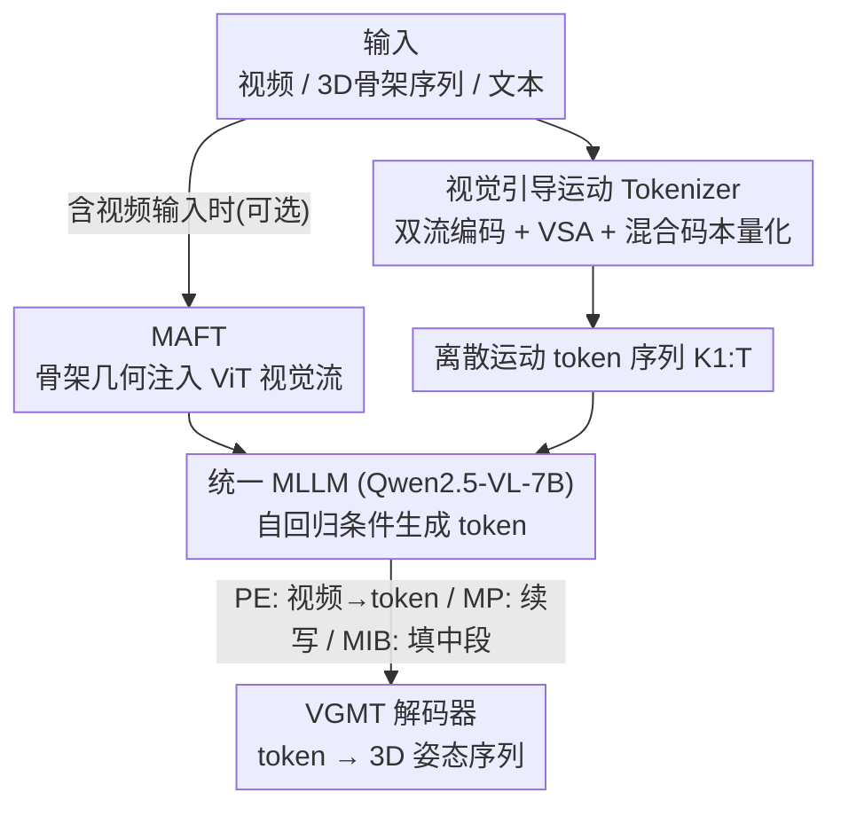

# Superman: Unifying Skeleton and Vision for Human Motion Perception and Generation

**会议**: CVPR 2026  
**论文**: [CVF Open Access](https://openaccess.thecvf.com/content/CVPR2026/html/Wang_Superman_Unifying_Skeleton_and_Vision_for_Human_Motion_Perception_and_CVPR_2026_paper.html)  
**代码**: https://github.com/BradleyWang0416/Superman  
**领域**: 人体理解 / 3D 姿态 / 多模态MLLM  
**关键词**: 人体运动, 3D 姿态估计, 运动预测, 运动插值, VQ-VAE, MLLM

## 一句话总结
Superman 把"从视频感知 3D 姿态"和"基于骨架生成运动"统一成一个条件序列生成问题：先用一个**视觉引导的运动 tokenizer**（VQ-VAE + 视觉/几何双流 + 混合码本）把连续运动量化成跨模态离散 token，再让单个 MLLM（Qwen2.5-VL-7B）自回归地预测这些 token，从而用一套模型同时做 3D 姿态估计、运动预测、运动插值，在 Human3.6M 上相比专用 SOTA 提升约 11~12%。

## 研究背景与动机

**领域现状**：人体运动分析里，3D 姿态估计、运动预测、运动插值（in-betweening）长期是三个互相隔离的任务，各自有专门优化的模型。近年 MLLM 的兴起让"用一个模型统一"看起来有希望——把连续运动表示成离散 token，再当作语言建模来做。

**现有痛点**：作者指出这套生态有三道裂缝。① **感知 / 生成割裂**：MotionLLM、LLaVA-Pose 这类"感知"模型能从视频读懂动作，但只输出文本、不会生成新的姿态；MotionGPT 这类"生成"模型能从文本生成运动，却无法处理原始视觉输入——形成"只读" vs "只写"的二分。② **只能处理静态单帧**：ChatPose、PoseLLaVA、UniPose 等生成式 MLLM 多用稠密参数化的 SMPL、只吃单帧图像，丢掉了视频的时序动态。③ **运动词表与视觉脱节**：现有运动 token 词表只用骨架数据训练，切断了与视觉域的联系。

**核心矛盾**：感知和生成本是同一枚硬币的两面、应当互相促进，但现有范式被迫用完全不同的架构去做这些本质相通的任务，既低效又无法共享知识；而要统一它们，关键卡点是缺一个**既懂视觉又懂骨架几何**的跨模态运动词表。

**本文目标**：用单个 MLLM 当"统一运动处理器"，让它能吃视频/骨架序列/文本等多种输入，输出结构化的 3D 运动 token，从而把姿态估计（感知）与运动预测、插值（生成）收进同一架构。

**核心 idea**：把运动当成一门"通用语言"——先造一个视觉引导的运动 tokenizer，让每个 token 同时由视觉外观和 3D 骨架几何共同决定（混合码本），再让一个 MLLM 在这门语言上做自回归条件生成，所有任务都变成"给定条件、续写 token 序列"。

## 方法详解

### 整体框架

Superman 把多任务人体运动分析统一成一个**条件序列生成**问题，分两个阶段。第一阶段是 **视觉引导的运动 Tokenizer（VGMT）**：它是一个 VQ-VAE，输入一段视频片段及其对应 3D 骨架序列，经视觉流与骨架流双路编码、再对一个混合码本做量化，把 $F$ 帧连续运动压成 $T$ 个离散整数 token，并能反解回 3D 姿态。这一阶段单独训练后**冻结**，得到一套视觉接地的运动词表。第二阶段是 **统一 MLLM**：以 Qwen2.5-VL-7B 为骨干，把不同任务通过改变"条件输入"统一表达——3D 姿态估计 = 把视频翻译成 token 序列；运动预测 = 自回归续写 token；运动插值 = 在首尾 token 之间填中段。视觉输入侧可选挂一个轻量 **MAFT** 模块，把骨架几何注入 ViT 视觉流以增强带视觉输入的任务。

### 关键设计

**1. 视觉引导的运动 Tokenizer（VGMT）：用混合码本把视觉外观与骨架几何绑进同一个 token**

针对"现有运动词表只由骨架训练、与视觉脱节"的痛点，VGMT 用**双流编码 + 混合码本**让每个 token 天生跨模态。视觉流先用视觉骨干（如 HRNet）抽每帧特征图 $F_f$，再用每个关节投影到图像的 2D 位置 $p_{j,f}$ 作参考点采样初始查询 $q_{j,f}$；为对抗遮挡，引入 **Visual-Skeleton Attention（VSA）**——它从 query 预测采样偏移和聚合权重、自适应地汇聚特征，得到关节视觉特征 $v_{j,f}=\mathrm{VSA}(q_{j,f},F_f,p_{j,f})$。骨架流则用一组轻量 2D 卷积在"关节—时间"网格上建模时空运动学，把坐标映射到隐空间得到骨架特征 $S$。

关键在量化：为了让一个 token 表示一小段运动模式而非静态单帧，先对两路特征做时序下采样得到窗口级表示 $z^v_w,z^s_w$，再用一个**成对的混合码本** $C=\{(c^v_k,c^s_k)\}_{k=1}^K$，每个码字同时含视觉原型和几何原型。窗口 $w$ 选中的 token 索引由**两模态联合距离最小**决定：

$$k_w=\arg\min_k \big(\lVert z^v_w-c^v_k\rVert_2^2+\lVert z^s_w-c^s_k\rVert_2^2\big)$$

这样离散化过程被视觉与几何共同牵引，token 把视觉证据和运动语义内在地链接起来。训练用 VQ 目标，把重建项和两个模态各自的 commitment 项加在一起：$L_{VQ}=\lVert X_w-\hat X_w\rVert_2^2+\beta_s\lVert \mathrm{sg}[z^s_w]-\hat c^s_w\rVert_2^2+\beta_v\lVert \mathrm{sg}[z^v_w]-\hat c^v_w\rVert_2^2$，其中 $\mathrm{sg}[\cdot]$ 是停梯度，$\beta_s=\beta_v=0.5$。消融显示双模态融合（重建误差 4.7mm）显著优于纯视觉（22.5mm）和纯骨架（7.7mm）。

**2. 统一 MLLM 条件序列生成：用同一个 LLM、靠变换条件把三个任务变成"续写 token"**

针对"感知/生成被迫用不同架构"的痛点，作者把 VGMT 冻结后产出的运动 token 当作一门语言，让单个 decoder-only MLLM（Qwen2.5-VL-7B）自回归建模，所有任务只是**条件不同**。3D 姿态估计：以视频增强视觉特征 $\hat Z_{grid}$ 为条件生成 token，目标 $L_{est}=\sum_t \log P(k_t\mid K_{<t},\hat Z_{grid})$，再解码成 3D 姿态。运动预测：给历史 token $K_{1:T'}$，自回归续写未来 $K_{T'+1:T}$，目标 $L_{pred}=\sum_{t=T'+1}^T \log P(k_t\mid K_{<t})$。运动插值：用 `[START] k1 [MIDDLE] kT [END]` 形式的 prompt，训 LLM 填补中段。

训练分两阶段——先单独训 VGMT 并冻结，再用 LoRA 在所有任务混合数据上训 MLLM（标准自回归交叉熵、跨任务样本求和）。这种**联合多任务**策略带来正向知识迁移：消融里统一模型在三项上都优于各自的专用模型（PE 44.9 vs 46.5、MP 26.1 vs 27.3、MIB 30.6 vs 33.1），印证"一起学比分开学更好"。

**3. Motion-Aware Fine-Tuning（MAFT）：用 <0.2% 参数把骨架几何注回 ViT 视觉流，专补带视觉输入的任务**

只有"视频→token"这条感知路径吃原始视觉，而 ViT 的网格特征缺乏对人体姿态的几何敏感性。MAFT 是一个可选轻量模块：ViT 抽出网格 patch 特征 $Z_{grid}$，同时用 2D 关节投影作参考点、经多尺度可变形采样汇聚姿态中心特征 $Z_{pose}$；再用一个 VSA（实现为 cross-attention + FFN、以网格 token 为 query、姿态 token 为 key/value）融合，得增强视觉 token $\hat Z_{grid}=\mathrm{VSA}(Z_{grid},Z_{pose})$，喂给 LLM 解码器生成运动 token。它仅增加 <0.2% 参数、占总计算 <0.03%，却让带视觉输入的姿态估计明显变好（表 2 中 Superman w/ MAFT 的 N-MPJPE 从 44.90 降到 39.41）。注意 MP/MIB 只吃 3D 骨架、无视觉输入，MAFT 自动失效，故两列结果相同。

### 损失函数 / 训练策略
- VGMT 阶段：$L_{VQ}$（重建 + 双模态 commitment，$\beta_s=\beta_v=0.5$），单独训练后冻结。
- MLLM 阶段：标准自回归交叉熵，在 PE/MP/MIB 混合样本上联合训练；Qwen2.5-VL-7B 用 LoRA（+可选 MAFT），可训参数占原模型 12.67%（w/o MAFT）/ 12.87%（w/ MAFT）。码本规模 $K=8192$，仅用 2×NVIDIA H20 训练。

## 实验关键数据

数据集：Human3.6M（训练 + 测试）与 3DPW（仅测试，做零样本泛化）。指标统一用 MPJPE（毫米，越低越好），其中 PE 报 N-MPJPE/MPJPE，MP/MIB 报不同时间步与中段/末段误差。

### 主实验（Human3.6M，表 2，MPJPE↓）

| 模型 | 类型 | T | PE (MPJPE) | MP (Avg) | MIB (Avg) |
|------|------|---|-----------|----------|-----------|
| MotionBERT (ICCV'23) | 传统多任务 | 16 | 56.70 | 26.82 | 44.86 |
| Skeleton-in-Context (CVPR'24) | 传统多任务 | 16 | 55.57 | 30.48 | 36.66 |
| Human-in-Context (Arxiv'25) | 传统多任务 | 16 | 53.86 | 23.58 | 37.01 |
| PoseLLaVA (AAAI'25) | MLLM·单帧 | 1 | 62.43 | N/A | N/A |
| MotionGPT3 (ICLR'26) | LLM | 16 | N/A | 42.70 | 42.70 |
| **Superman (w/ MAFT)** | 本文 | 16 | **51.61** | **23.30** | **35.99** |

- PE 上相比传统多任务 SOTA（Human-in-Context）提升约 11.97%、相比 MLLM SOTA（PoseLLaVA）提升约 10.91%（以原文报告为准）。
- 单帧 MLLM（UniPose/PoseLLaVA/LocLLM）无法做 MP/MIB；纯 LLM（MotionGPT/MotionGPT3）无法做 PE——Superman 是表中唯一三项全做且全 SOTA 的模型。

### 泛化（3DPW 零样本，表 4，仅在 Human3.6M 训练）

| 模型 | MP Avg↓ | MIB Avg↓ |
|------|---------|----------|
| Skeleton-in-Context | 140.71 | 127.68 |
| Human-in-Context | 141.90 | 131.99 |
| MotionGPT3 | 228.17 | 204.71 |
| **Superman** | **62.05** | **60.68** |

跨数据集零样本下 Superman 大幅领先（MP 62.05 vs 次优 140.71，约降一半以上），说明跨模态词表带来的鲁棒性在"野外"未见数据上尤其明显。

### 消融实验

**Tokenizer 设计与融合权重（表 6）**

| 配置 | 重建误差↓ | PE (N-MPJPE)↓ |
|------|-----------|---------------|
| 纯视觉 | 22.5 | 51.3 |
| 纯骨架 (MotionGPT 式) | 7.7 | 47.8 |
| 融合 $\beta_s,\beta_v=0.3,0.7$ | 6.8 | 45.8 |
| 融合 $\beta_s,\beta_v=0.7,0.3$ | 5.3 | 45.1 |
| **融合 $\beta_s,\beta_v=0.5,0.5$** | **4.7** | **44.9** |

**统一多任务训练 vs 专用模型（表 7，MPJPE↓）**

| 训练策略 | PE | MP | MIB |
|----------|----|----|-----|
| 专用·只做 PE | 46.5 | N/A | N/A |
| 专用·只做 MP | N/A | 27.3 | N/A |
| 专用·只做 MIB | N/A | N/A | 33.1 |
| **统一** | **44.9** | **26.1** | **30.6** |

### 关键发现
- **双模态融合是命门**：纯视觉重建误差高达 22.5mm（几乎不可用），纯骨架 7.7mm，而平衡融合降到 4.7mm——视觉和几何缺一不可，且 0.5/0.5 等权最优。
- **联合多任务全面正迁移**：统一模型在 PE/MP/MIB 三项均优于对应专用模型，说明感知与生成共享表示确实互相促进。
- **MAFT 性价比极高**：<0.2% 参数、<0.03% 计算，却把视觉输入任务的 N-MPJPE 从 44.90 拉到 39.41。
- **可扩展性**：模型从 3B→7B、码本从 4096×1024→8192×2048，PE/MP 误差一致下降；码本利用率高（Human3.6M 上 65.4% 码字 Active、仅 1.0% Unused，码字间余弦相似度集中在 0 附近，说明学到了高度去相关的离散表示）。

## 亮点与洞察
- **"混合码本"是真正的桥**：让每个码字成对持有视觉原型 + 几何原型、量化时按两模态联合距离选码，这个设计把"运动语言"第一次接地到视觉，比单纯在 loss 上加约束更彻底，是统一感知/生成的关键支点。
- **用条件而非架构来统一任务**：PE/MP/MIB 不靠不同网络头，而是靠改变 LLM 的条件输入（视觉特征 / 历史 token / 首尾 token + 模板 prompt），这套"运动即语言"的抽象很优雅，也解释了为何联合训练能正迁移。
- **MAFT 的"按需失效"很巧**：只在有视觉输入时介入、纯骨架任务自动不启用，既增强感知又不污染生成任务，可迁移到其他"部分模态缺失"的多任务设置。

## 局限与展望
- 训练数据只用 Human3.6M（室内、关节数固定为 Human3.6M 骨架格式），虽然 3DPW 零样本表现好，但更复杂的多人/强遮挡/野外长视频未充分验证。
- 依赖一个固定的 2D 姿态估计器作参考点（传统模型走 RGB→2D→3D），2D 估计误差会传导进 VSA 采样；⚠️ 端到端去掉 2D 中介的可行性原文未深入讨论。
- 骨架表示固定为关节坐标，未含 SMPL 那样的体型/表面信息，难以直接支持需要稠密网格的下游应用（如服装、接触）。
- 全模型仍以 7B MLLM 为主体（占 99.7% GFLOPs、98.6% 延迟），实时性受限；可探索更小骨干或蒸馏。

## 相关工作与启发
- **vs MotionGPT / MotionGPT3（生成式 LLM）**：它们把运动当语言但只从文本/非视觉模态生成、无法做姿态估计；Superman 把视觉接进 tokenizer 与 MLLM，既能感知又能生成，且 MP/MIB 误差更低。
- **vs MotionLLM / LLaVA-Pose（感知式 MLLM）**：它们能读懂动作但只输出文本、不生成结构化姿态；Superman 输出离散运动 token 再解码成 3D 姿态，打通"只读 vs 只写"。
- **vs UniPose / PoseLLaVA / ChatPose（单帧生成）**：它们多基于 SMPL、只处理静态单帧；Superman 以骨架为表示、原生处理视频时序，能做需要时序的运动预测与插值。
- **vs Skeleton-in-Context / Human-in-Context（传统多任务）**：它们词表只由骨架构建、不吃原始视觉；Superman 的跨模态混合码本带来更强的感知精度与跨数据集泛化。

## 评分
- 新颖性: ⭐⭐⭐⭐⭐ 混合码本把视觉外观与骨架几何绑进同一个运动 token，首次让"运动语言"视觉接地，统一感知与生成。
- 实验充分度: ⭐⭐⭐⭐ 三任务主实验 + 跨数据集泛化 + tokenizer/多任务/缩放/码本利用率多维消融，较充分；但仅 Human3.6M 训练、多人野外场景偏少。
- 写作质量: ⭐⭐⭐⭐ 三道"裂缝"动机清晰、方法两阶段分明、图表对照到位。
- 价值: ⭐⭐⭐⭐⭐ 给人体运动分析提供了一条"单模型统一感知+生成"的可扩展范式，且模块开销极低、易复用。

<!-- RELATED:START -->

## 相关论文

- [\[CVPR 2026\] ReGenHOI: Unifying Reconstruction and Generation for 3D Human-Object Interaction Understanding](regenhoi_unifying_reconstruction_and_generation_for_3d_human-object_interaction_.md)
- [\[CVPR 2026\] MoLingo: Motion-Language Alignment for Text-to-Human Motion Generation](molingo_motion-language_alignment_for_text-to-motion_generation.md)
- [\[CVPR 2026\] Seeing without Pixels: Perception from Camera Trajectories](seeing_without_pixels_perception_from_camera_trajectories.md)
- [\[CVPR 2026\] Real-Time Multimodal Fingertip Contact Detection via Depth and Motion Fusion for Vision-Based Human-Computer Interaction](real-time_multimodal_fingertip_contact_detection_via_depth_and_motion_fusion_for.md)
- [\[CVPR 2026\] FrankenMotion: Part-level Human Motion Generation and Composition](frankenmotion_part-level_human_motion_generation_and_composition.md)

<!-- RELATED:END -->
