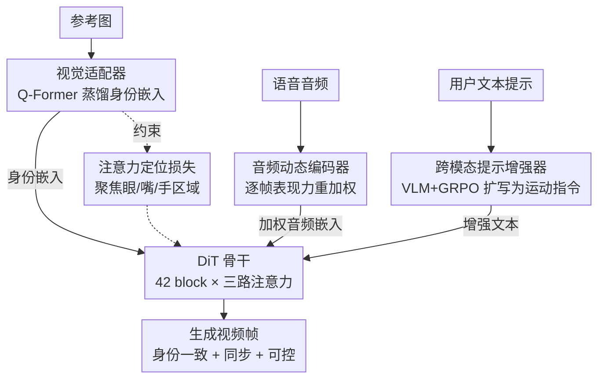

# SyncDreamer: Controllable and Expressive Avatar Generation Beyond the Talking Head

**会议**: CVPR 2026  
**论文**: [CVF Open Access](https://openaccess.thecvf.com/content/CVPR2026/html/Nazarieh_SyncDreamer_Controllable_and_Expressive_Avatar_Generation_Beyond_the_Talking_Head_CVPR_2026_paper.html)  
**代码**: 无（仅项目页 https://fnazarieh.github.io/SyncDreamerWeb/）  
**领域**: 数字人生成 / 扩散模型 / 多模态  
**关键词**: 音频驱动说话人、Diffusion Transformer、身份保持、文本控制运动、GRPO

## 一句话总结
SyncDreamer 用一个 Diffusion Transformer 框架，只靠单张参考图 + 语音 + 文本提示就能生成既保身份、又有情感表现力、还能用文字精细控制手势/视线的说话人视频；它通过视觉适配器（配注意力定位损失）锁住身份、用音频动态编码器把语音节奏/能量转成表情驱动、再用 GRPO 训练的跨模态提示增强器把短文本变成真正能控运动的指令，在人像和全身两类基准上都刷到 SOTA。

## 研究背景与动机

**领域现状**：音频驱动的说话人/数字人生成是数字人合成的核心任务。主流分两类——人像类（head–shoulders 裁剪，只做面部表情、唇动和小幅头动）和全身类（EchoMimicV2、CyberHost 这类，靠外部 pose encoder 把动作扩展到上半身/全身手势）。底座大多是扩散模型，近期转向 Diffusion Transformer（DiT）。

**现有痛点**：三个具体问题。其一，全身方法依赖 3D landmark、pose 序列这类**中间表示**来生成身体运动，既限制运动灵活度、又容易在大姿态下出现视觉畸变。其二，表情控制大多靠**离散情感标签**（happy/disgust/surprised 这种粗类别），无法刻画语音里连续、细粒度的节奏、能量、强度变化，结果表情平淡、与语音情绪对不上。其三，DiT 类方法**只把文本当描述性先验**（传背景/风格），加一句"turn left""raise the right hand"对生成几乎没影响，导致手势、视线、头动这些细粒度行为根本控不了。

**核心矛盾**：要的是"情感化音频动态 + 空间身份一致性 + 文本行为控制"三者统一，但现有方法各管一摊且互相牵制——想保身份就靠固定 pose 牺牲表现力，想要表现力又控不住身份漂移，文本则始终是个摆设。

**本文目标**：在不依赖任何中间 pose 表示的前提下，端到端做到（a）大姿态/长序列下的身份保持，（b）连续可变的情感化运动，（c）文本真正驱动身体行为。

**核心 idea**：在一个共享 DiT 骨干上插三个专用模块——视觉适配器锁身份、音频动态编码器把声学表现力显式建模成时序权重、跨模态提示增强器用强化学习把"被动文本"改造成"主动运动控制信号"。

## 方法详解

### 整体框架

SyncDreamer 的骨干是一个 DiT：参考图经 3D VAE 编码、文本经 umT5 编码、再叠加高斯噪声，进入由 42 个 Transformer block 堆成的去噪网络，每个 block 内含 Self-Attention、Visual-Cross-Attention、Audio-Cross-Attention 三路注意力，最后 3D VAE 解码出视频帧。三个创新模块分别接在这三个条件入口上：

- **视觉适配器（Visual Adapter）**从参考图蒸馏出紧凑的身份嵌入，喂给 Visual-Cross-Attention，并由**注意力定位损失**约束让注意力聚焦到眼/嘴/手等关键区域；
- **音频动态编码器（Audio Dynamics Encoder）**把 Wav2Vec2 特征按"表现力显著度"逐帧重加权，再喂给 Audio-Cross-Attention；
- **跨模态提示增强器（Cross-Modal Prompt Enhancer）**在文本进 umT5 之前，把用户的短提示结合参考图的视觉线索扩写成"可控运动指令"。

训练分两阶段：Stage 1 在 HumanVID 的文本–视频对上学运动与场景构图先验；Stage 2 引入音频条件（Hallo3 / HDTF / AVSpeech），并以 0.1 概率随机丢弃某个模态做 classifier-free guidance。

### 关键设计

**1. 视觉适配器 + 注意力定位损失：在大姿态和长序列下把身份钉住**

痛点是表情剧烈或头大幅旋转时外观会漂移（面部特征错位、细节跑飞）。视觉适配器先用 Image Encoder 把参考图编成视觉 token，再用一个类 Q-Former 的 Query-Based Encoder：一组可学习的 query 通过 cross-attention 从视觉 token 里**选择性聚合**最关乎身份的信息（五官、衣着、背景上下文），得到一组紧凑的参考嵌入，注入骨干里的 Visual-Cross-Attention 引导生成朝目标身份靠。

但光注入不够——长序列里 cross-attention 会"发散"，把嘴附近的 latent 注意到无关区域。注意力定位损失就是给这件事加空间先验：用分割模型拿到参考图里眼/嘴/发/下颌等关键区域的语义 mask，定义监督 mask $M_{ij}\in\{0,1\}$（第 $i$ 个空间 latent query 若对应第 $j$ 个参考 token 的语义区域则为 1），然后惩罚落在区域外的注意力权重：

$$L_{loc}=\frac{1}{N}\sum_{i=1}^{N}\sum_{j=1}^{K}A_{ij}(1-M_{ij})$$

其中 $A_{ij}$ 是归一化注意力权重，$N$、$K$ 分别是空间 latent 与参考 token 数。最终目标是 $L=L_{diff}+\lambda_{loc}\cdot L_{loc}$，$\lambda_{loc}=0.4$，且只施加在中层注意力（身份/语义特征最具判别性的地方）。这是一种"软监督"——参考嵌入本身并不空间锚定，但通过惩罚发散注意力，逼出紧凑、语义连贯的对应关系，从而显著改善大旋转、遮挡和长序列下的身份一致性。

**2. 音频动态编码器：把语音的节奏/能量显式变成可驱动表情的时序权重**

痛点是 Wav2Vec2、Whisper 这类编码器只抓语言内容，丢掉了节奏、声强、非语言音（哼唱）这些表现力线索；而靠离散情感标签的做法又只能给几个粗类别，刻画不了连续的情感起伏。该编码器在 Wav2Vec2 上加一个时序上下文模块，用滑动窗口算"逐帧表现力显著度"。记 $A\in\mathbb{R}^{T\times d}$ 为 Wav2Vec2 特征序列，对每帧 $t$ 取局部窗口 $A_{t-k:t+k}$（窗口 $k=3$，前后各三帧）送进时序 MLP $f_{temp}$，输出一个标量权重 $w_t=f_{temp}(A_{t-k:t+k})\in[0,1]$，再把特征重加权 $\tilde A_t=w_t\cdot A_t$。这样高表现力片段（节拍重音、强度峰值、情感转折）被放大，平淡或静音段被压制，让生成的面部/身体运动跟着语音的情感节奏走，从对话到唱歌都能同步。

**3. 跨模态提示增强器（GRPO）：把"被描述的文本"改造成"会动手的运动控制信号"**

痛点是现有系统里文本只是个被动描述符，用户对手势/头动/视线几乎没有控制力，而且用户提示往往太短、欠规约。这个模块分三步落地（见原文 Fig. 4）：(A) **配对数据集构建**——标准说话脸数据集只有视频和音频，作者从每段视频抽一帧当参考图，用 LLM 生成 <77 token 的简短对齐 caption，攒出图文对；(B) **跨模态属性抽取**——用 Qwen2-VL 从参考图抽结构化语义属性（衣着、背景、物体、身体姿态、隐含动作，如"歪头""握笔"），与用户原始提示融合成"运动感知指令"；(C) **GRPO 训练**——用 Group Relative Policy Optimization（一种基于排序的 RL，无需显式奖励模型）：对每个输入生成多个候选提示，由一个面向"视觉相关性、动作具体性、语言流畅度"的任务特定奖励打分排序，让模型偏好那些能产出更接地气、更连贯生成的候选。增强后的提示经 T5 编码后作为身体运动生成的条件，从而能用一句话精确控住手势、转身、视线——把"delivering a talk with confident gestures"这类欠规约提示变成真正可执行的运动指令。

### 损失函数 / 训练策略

骨干基于 DiT，扩散重建损失 $L_{diff}$ 叠加注意力定位损失：$L=L_{diff}+0.4\cdot L_{loc}$。两阶段训练：Stage 1 学运动/场景先验（HumanVID 文本–视频对），Stage 2 加音频条件（Hallo3 + HDTF + AVSpeech）。训练用 2 张 A100，42 个 Transformer block，训练与推理均 100 步去噪；以 0.1 概率随机丢弃音频/图像/文本任一模态实现 classifier-free guidance。数据侧聚合 full-body（HumanVID 19K）、upper-body（Hallo3 10K）、面部特写（HDTF + AVSpeech），经 SyncNet 音视对齐与 InsightFace 过滤后保留 65 万段单说话人片段（5–30 秒）。

## 实验关键数据

### 主实验

人像基准 HDTF 上，SyncDreamer 在所有指标上都最好（FID/FVD 越低越好，Sync-C 越高越好，Sync-D 越低越好，IQA 越高越好）：

| 数据集 | 方法 | FID ↓ | FVD ↓ | Sync-C ↑ | Sync-D ↓ | IQA ↑ |
|--------|------|-------|-------|----------|----------|-------|
| HDTF | HunyuanVideo Avatar | 54.9 | 528.3 | 7.34 | 6.48 | 3.56 |
| HDTF | OmniAvatar | 53.7 | 514.7 | 7.92 | 6.36 | 3.68 |
| HDTF | **SyncDreamer** | **52.8** | **508.1** | **8.04** | **6.15** | **3.72** |

野外语音基准 AVSpeech 上同样领先大多数指标（Sync-D 略逊于 OmniAvatar 的 6.73）：

| 数据集 | 方法 | FID ↓ | FVD ↓ | Sync-C ↑ | Sync-D ↓ | IQA ↑ |
|--------|------|-------|-------|----------|----------|-------|
| AVSpeech | OmniAvatar | 68.4 | 73.8 | 6.24 | **6.73** | 2.78 |
| AVSpeech | **SyncDreamer** | **67.9** | **72.6** | **6.31** | 7.05 | **2.81** |

全身基准 EMTD 上，相比依赖 pose 表示的方法全面胜出，CSIM（身份相似度）从 0.393 跳到 0.598 是最大亮点：

| 数据集 | 方法 | FID ↓ | FVD ↓ | PSNR ↑ | SSIM ↑ | CSIM ↑ |
|--------|------|-------|-------|--------|--------|--------|
| EMTD | EchoMimicV2 | 42.69 | 528.10 | 22.09 | 0.741 | 0.393 |
| EMTD | **SyncDreamer** | **41.77** | **483.59** | **22.38** | **0.746** | **0.598** |

### 消融实验

论文以定性图为主（Fig. 8/10/9）报告三个模块的作用，未给完整数值消融表：

| 配置 | 现象 | 说明 |
|------|------|------|
| Full model | 身份稳、表情同步、文本可控 | 完整模型 |
| w/o 注意力定位损失 | 身份漂移、五官错位 | 大动作（翻页/手势）时尤其明显（Fig. 8） |
| w/o 音频动态编码器 | 表情扁平、情感保真度降 | 唱歌/哼唱等节奏能量变化时退化最重（Fig. 10） |
| w/o 提示增强器（仅最简提示） | 动作泛化弱、物体消失 | 笔记本/笔等上下文元素丢失（Fig. 9） |

### 关键发现
- 三个模块互补：视觉适配器+定位损失管空间与身份一致性，音频动态编码器管节奏/声强同步，提示增强器管文本可控性，缺一类就掉一类能力。
- 全身场景下 CSIM 的大幅提升（0.393→0.598）说明端到端从音频+文本学运动、不靠 pose 模板，反而比 pose-driven 方法更能保住身份。
- 提示增强器对"物体连续性"特别关键：手动扩写提示能改善物体留存但仍缺表现力，只有图文接地的自动增强提示才能同时做到上下文感知手势、物体连续、跨帧清晰。

## 亮点与洞察
- 把"文本能不能控运动"这个老问题归结为"提示本身欠规约"，用 RL（GRPO）训练一个**提示增强器**而不是改生成网络结构来解决——这是个可迁移的思路：与其让下游模型更强，不如把上游条件做"可控化"预处理。
- 注意力定位损失是一种很轻量的"软空间先验"：参考嵌入并不需要真的空间锚定，只要惩罚跨注意力发散到无关区域，就能逼出身份一致性，工程代价低。
- 音频动态编码器把"表现力"显式量化成 $[0,1]$ 的逐帧权重 $w_t$，相当于给情感一个连续标量度量，绕开了离散情感标签的天花板。

## 局限与展望
- 消融以定性图为主，缺少把各模块逐一关闭后的数值消融表，"掉多少点"难以量化（⚠️ 完整奖励公式与部分细节在补充材料，正文未给）。
- AVSpeech 上 Sync-D 略逊于 OmniAvatar，说明唇同步精度在野外场景还有提升空间。
- 提示增强器依赖外部 VLM（Qwen2-VL）和 LLM caption，属性抽取的错误会直接传导到运动控制；对极端罕见姿态/物体的接地能力未充分验证。
- 100 步去噪 + 42 block 的 DiT 在交互式应用里实时性存疑，论文未报推理速度。

## 相关工作与启发
- **vs EchoMimicV2 / CyberHost（pose-driven 全身）**: 它们靠 3D landmark、手指关键点和运动轨迹驱动上半身，运动灵活度和细粒度控制受限；SyncDreamer 端到端从音频+文本学运动、无中间 pose 表示，EMTD 上 CSIM 大幅领先。
- **vs Hallo3 / FantasyTalk / OmniAvatar（DiT，文本当风格）**: 它们把文本当静态风格/场景先验，加运动指令几乎无效；SyncDreamer 用 GRPO 把文本改造成主动运动控制信号，能真正控住手势、转身、视线。
- **vs 离散情感标签方法**: 那类用 happy/disgust 等粗类别监督表情；本文用连续的逐帧表现力权重建模，更贴合语音节奏与情感转折。

## 评分
- 新颖性: ⭐⭐⭐⭐ 三模块组合中"用 GRPO 训练提示增强器把文本变运动控制信号"较有新意，但整体仍是 DiT + 条件注入范式的拼装。
- 实验充分度: ⭐⭐⭐⭐ 覆盖人像/野外/全身三类基准且全面 SOTA，但数值消融缺失、推理速度未报。
- 写作质量: ⭐⭐⭐⭐ 动机层层递进、模块职责清晰；部分细节（奖励公式）甩给补充材料。
- 价值: ⭐⭐⭐⭐ 给"可控、表现力强、无需 pose 的数字人"提供了一个可扩展底座，对交互/创作类应用实用。

<!-- RELATED:START -->

## 相关论文

- [\[CVPR 2026\] Avatar Forcing: Real-Time Interactive Head Avatar Generation for Natural Conversation](avatar_forcing_real-time_interactive_head_avatar_generation_for_natural_conversa.md)
- [\[ICCV 2025\] Controllable and Expressive One-Shot Video Head Swapping](../../ICCV2025/human_understanding/controllable_and_expressive_one-shot_video_head_swapping.md)
- [\[CVPR 2026\] OMG-Avatar: One-shot Multi-LOD Gaussian Head Avatar](omg-avatar_one-shot_multi-lod_gaussian_head_avatar.md)
- [\[CVPR 2026\] Beyond Scanpaths: Graph-Based Gaze Simulation in Dynamic Scenes](beyond_scanpaths_graph-based_gaze_simulation_in_dynamic_scenes.md)
- [\[ECCV 2024\] Avatar Fingerprinting for Authorized Use of Synthetic Talking-Head Videos](../../ECCV2024/human_understanding/avatar_fingerprinting_for_authorized_use_of_synthetic_talking-head_videos.md)

<!-- RELATED:END -->
