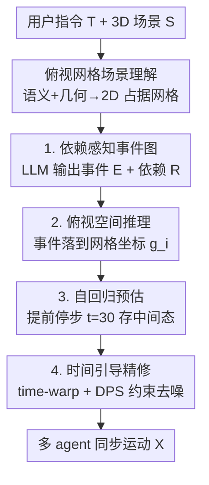

# SyncMos: Scalable Motion Synchronisation for Multi-Agent Scene Interaction

**会议**: CVPR 2026  
**论文**: [CVF Open Access](https://openaccess.thecvf.com/content/CVPR2026/html/Li_SyncMos_Scalable_Motion_Synchronisation_for_Multi-Agent_Scene_Interaction_CVPR_2026_paper.html)  
**代码**: 无  
**领域**: 人体理解 / 3D 场景人体运动生成  
**关键词**: 多智能体运动生成, 时间同步, 扩散模型, LLM 事件规划, 人-场景交互

## 一句话总结
SyncMos 用一个 LLM 事件规划器把自然语言指令拆成带时序依赖的事件图，再在**不重训**单人扩散运动模型的前提下，靠 time-warping + 扩散后验采样（DPS）做后处理，让任意数量 agent 的动作（如递接物品）在时间上对齐，实现可扩展的多人 3D 场景交互生成。

## 研究背景与动机
**领域现状**：文本引导的 3D 场景人体运动生成近年进展很快，单人模型（如 LINGO 的自回归长程合成、InterGen 的双人交互）能根据场景上下文和自然语言生成可控行为。

**现有痛点**：要把单人能力扩到多智能体，难点不在空间而在**时间**。像「A 把瓶子递给 B、B 接过来再喝」这种交互，动作之间存在因果次序和同步关系——递与接必须在同一时刻发生。现有多人方法要么固定 agent 数量、要么只建模成对（pairwise）关系：每来一种新的交互/关系配置就得重训或重设计模型，扩展性差；而且时间同步常被忽略，即便单人动作看着真实，多人凑在一起也会出现「手伸过去了对方还没接」的时序错位。

**核心矛盾**：单人模型不带跨 agent 的全局时序协调机制，而专门训练多人/分组关系又不可扩展（agent 数一变就失效）。把时序对齐做进网络训练里，本质和「可扩展到任意 agent 数」相冲突。

**本文目标**：(1) 把自由文本指令解析成显式的、可机读的事件时序依赖；(2) 在不重训底层单人模型的情况下，对多个 agent 的动作做全局时间对齐；(3) 让方案对 agent 数量可扩展、且与具体单人扩散生成器解耦（model-agnostic）。

**切入角度**：作者把「多人协调」拆成两层——高层用 LLM 把叙事变成结构化事件图（谁、做什么、什么次序、在哪），低层把时间同步当成一个**对已生成轨迹的后处理修正**问题，而不是生成时的约束。既然单人模型自己已经能生成合理动作，那只要把生成出来的粗轨迹按计划「拉/推」到正确时刻、再用扩散先验把拉扯造成的失真修回去就行。

**核心 idea**：用「LLM 事件规划 + 把 time-warping 后的轨迹视作含噪观测、用 DPS 做约束引导去噪」来替代「为多人关系专门训模型」，从而在零重训下实现可扩展的多 agent 时间同步。

## 方法详解

### 整体框架
SyncMos 是一个两层架构：**高层文本引导事件规划器**把用户指令 $T$ 和场景 $S$ 转成结构化事件依赖图 $G$；**低层时间同步模块**以单人扩散模型（实现里用 LINGO）为骨干，按事件图先粗生成每个 agent 的动作，再做时间对齐精修，最终输出多人同步运动 $X$。整条管线对底层生成器不做任何重训。

高层规划器内部又含三个子模块：场景理解（抽语义+几何，并构造一个俯视网格作为统一 2D 坐标系）、依赖感知故事规划（LLM 输出事件集 $E$ 和时序依赖 $R$）、俯视空间推理（把每个抽象事件落到网格上的具体位置）。低层同步模块分两步：自回归预估（提前停步、只去噪一部分，存中间状态到 buffer）、时间引导精修（对存下的中间态做 time-warping + DPS 约束去噪）。

### 关键设计

**1. 依赖感知故事规划器：把叙事文本变成可机读的时序依赖图**

针对「多人交互的因果次序和同步关系没有显式表示」这个痛点，规划器把用户文本 $T$ 和场景描述 $D$ 喂给 LLM，输出一个事件依赖图 $G=(E, R)$，其中 $E=\{e_i\}_{i=1}^{N}$ 是单演员事件集合，每个 $e_i=(\text{actor}_i, \text{event description}_i)$ 指明「谁做什么」（如「用右手拿起 1 号瓶」）；$R=R_{\text{seq}}\cup R_{\text{par}}$ 编码时序依赖，分两类：**顺序型** `{"after":e_i,"before":e_j}` 表示因果/前置（拿起 → 递出），**并行型** `{"parallel":[e_i,e_j]}` 表示需同步发生的交互（递的人和接的人同时动）。

实现上用 few-shot + Chain-of-Thought 提示，让 LLM 在**单次响应内分两步**：先基于 $(D,T)$ 列出所有单演员事件，再按结构化范例推断它们的时序依赖。把这两种依赖模板放进 in-context 示例，LLM 就能一次性产出既含语义又机读的 $E$ 和 $R$。这比 Event-Driven Storytelling 那种「自回归逐个生成事件、没有全局依赖建模」更能处理并发与长因果链——后者在事件数变多时会因冗余重生成而 token 爆炸，本文方法 token 量基本恒定。

**2. 俯视网格空间推理：把抽象事件落到场景里具体的位置**

故事规划器只定义了事件的语义和时序，没说动作发生在**哪**。这一步先用 LLM 场景描述器抽出物体间关系语义（「椅子靠近桌子」「瓶子在台面上」）得到文本描述 $D$，并引入一张**俯视网格** $M$ 把场景占据和可通行区域编码成 2D 图像，作为指令与运动生成之间的统一坐标接口——用户可以用「at grid (10, 18)」指定动作发生地，推理器也用同一坐标去推断合理空间布局（比如把两个交互角色摆在可达且物理合理的距离上）。

对每个事件 $e_i$，空间推理器预测一个落地表示 $g_i=(\text{grid}_i, \text{action}_i, \text{hand\_target}_i)$：网格上的 2D 位置、动作标签、可选的交互物体。它用空间占据和可达性约束保证位置不重叠、相邻事件连续、且与物理环境一致（如服务员上菜和收盘子时都待在同一张桌边）。这给下游运动生成提供了明确的位置和交互线索。

**3. 自回归预估 + 提前停步缓存：为后续时间修正留出「半成品」状态**

普通自回归扩散会把每段动作**完全去噪**后再生成下一段，这样一旦想改时序就只能重生成。本文反其道——只跑**部分**反向扩散到中间步 $t$（实现取 $t=30$），从 $x_t$ 用 DDPM 重构式预测干净估计 $\hat{x}_0=\frac{1}{\sqrt{\bar{\alpha}}}\left(x_t-\sqrt{1-\bar{\alpha}}\,\epsilon_\theta(x_t,t)\right)$，得到一条「能用但粗」的预备轨迹 $\mathcal{D}$。

为什么停在 $t=30$？因为预估与真值的差为 $\hat{x}_0-x_0=\frac{\sqrt{1-\bar{\alpha}}}{\sqrt{\bar{\alpha}}}(\epsilon-\epsilon_\theta(x_t,t))$，对 LINGO（线性 beta，$T=100$）取 $t=30$ 时系数 $\frac{\sqrt{1-\bar{\alpha}}}{\sqrt{\bar{\alpha}}}\approx 0.3$，既能拿到稳定可精修的粗轨迹又省时间。关键是它把 $x_t$、时间步元数据、条件项一并存进缓冲区 $B$——这些中间态正是后面做时间引导精修的「半成品原料」，避免了从纯噪声重新生成。

**4. 时间引导精修：把 time-warping 后的轨迹当含噪观测，用 DPS 修回真实感**

直接 time-warping 能移动关键事件时刻，但会引入不自然的失真，因为它不尊重扩散模型的生成先验。本文把时间扭曲后的轨迹 $y$ 当成一个「含噪的时间观测」，再用约束引导去噪修正。先用基于样条的 time-warping 对预备估计 $\mathcal{D}$ 做处理：总长度固定，靠拉/推特定关键帧调时序——帧索引 $l$ 指定要改的关键事件、$\delta$ 是期望的时间偏移，把帧往前拉会压缩前面的动作段、往后推则拉伸它们，用经典 Motion Warping 得到一条显式但可能带噪的目标轨迹 $y$。

然后对每段动作施加简单的 L2 时序约束 $C(\hat{x}_0)=\|y-\hat{x}_0\|^2$。做法是从缓冲区 $B$ 取回该段的中间态 $x_t$，先通过前向扩散（q-sampling）重新注入受控噪声让模型有探索空间，再做梯度引导去噪：

$$x_{i-1}\gets\mu_\theta(x_i,i)-\lambda\nabla_{x_i}C(\hat{x}_0)+\sigma_i z$$

其中 $\mu_\theta$ 是预测的去噪均值，$\sigma_i$ 是噪声方差，$z\sim\mathcal{N}(0,I)$，$\lambda$ 控制时序约束的强度。这一步在满足时序约束（把关键事件挪到目标时刻）的同时，保留扩散模型生成的平滑性和连贯性。通过「自回归预估 → 约束引导精修」两段式，系统在不重训底层模型的前提下实现了跨 agent 的全局时间同步。

## 实验关键数据

评测分三层：(1) 依赖感知故事规划器 vs 基线 LLM 规划器；(2) 时间同步模块的受控时序编辑（无直接 prior work，做消融/控制实验）；(3) 端到端多 agent 可扩展性。

### 规划器主实验
在自建 30 个多角色叙事 benchmark（House/Office/Restaurant 三类场景，每场景 2-5 个 agent；含 Synchronisation 15 例测并行、Dependency 15 例测长因果链）上对比 Event-Driven Storytelling 基线，指标含事件覆盖率 EC、依赖准确率 DA、通过场景数 PS、场景通过率 SPR。

| 子集 | backbone | DA 基线(%) | DA 本文(%) | SPR 基线(%) | SPR 本文(%) |
|------|----------|-----------|-----------|------------|------------|
| Synchronisation | Qwen-3-235B | 68.4 | **89.9** | 33.3 | **53.3** |
| Synchronisation | GPT-4o | 67.1 | **86.3** | 33.3 | **53.3** |
| Dependency | GPT-4o | 20.5 | **96.9** | 0.0 | **80.0** |
| Dependency | Qwen-3-235B | 17.2 | **84.4** | 6.7 | **66.7** |

Dependency 子集（长因果链）提升最猛：DA 从 11.8–20.5% 拉到 80–97%，SPR 从近零升到最高 80%（GPT-4o）。

### 时间同步控制实验
用 LINGO 数据构 15 个抓取测试用例，对参考抓取时刻施加 ±0.5/±1.0/±1.5 s 偏移，每条件每例跑 10 次；成功判定为时间误差在目标偏移 0.1 s 内（用 DTW 衡量预估与精修轨迹的对齐，发散则判失败）。

| 模型 | +0.5s | +1.0s | +1.5s | −0.5s | −1.0s | −1.5s |
|------|-------|-------|-------|-------|-------|-------|
| LINGO（无同步） | 0.0 | 0.0 | 0.0 | 0.0 | 0.0 | 0.0 |
| SyncMos | **84.7** | **78.0** | 76.0 | **88.0** | 75.3 | 37.3 |

±1.0 s 内成功率 >70%，小偏移（±0.5 s）达 88%；但靠近动作边界时大偏移会让扩散过程不稳，成功率掉到约 35–40%（−1.5 s 仅 37.3%）。Table 3 显示各偏移下实现帧移的四分位距很窄，说明 −1.5 s 掉点主要是「位移量不够」而非轨迹离散度变大。

### 关键发现
- **token 可扩展性是规划器的核心优势**：Synchronisation 场景下本文每例稳定约 10k token 且 EC/DA/SPR 随事件数增加保持稳定；基线在 Dependency 场景超过 8 个事件后因冗余重生成 token 量暴涨，本文几乎恒定。
- **不重训也能可靠改时序**：LINGO 原生对时序编辑完全无能（成功率全 0），加上同步模块后中等幅度偏移可靠可控。
- **多 agent 不累积时序漂移**：把链式 handover 从 $N\in\{2,3,5,10\}$ 测下来，时间同步误差 TSM 随 agent 数仅轻微上升、同步误差 TSE 保持稳定（10-agent 链也无漂移累积），接触距离 CD 也稳定——说明它是个有效轻量的后处理同步模块。
- **失败模式集中在边界大偏移**：把关键帧推到动作段两端附近、且偏移大时，扩散过程不稳定是主要失败来源。

## 亮点与洞察
- **把时间同步重定义为「后处理 + 含噪观测修正」**：不在生成时加约束、也不重训，而是先让单人模型自由生成，再把 time-warping 结果当噪声观测、用 DPS 拉回先验流形——这是实现「零重训 + 可扩展」的关键巧思，也让框架与具体生成器解耦。
- **提前停步缓存中间态的复用**：只去噪到 $t=30$ 并把中间态存进 buffer，既省算力又为后续精修保留了「可二次编辑」的扩散状态，避免从纯噪声重生成。这个「半成品状态缓存」思路可迁移到任何需要对扩散输出做后续可控编辑的任务。
- **俯视网格作统一坐标接口**：用一张 2D 网格同时承担「用户指定位置」和「模型空间推理」，让自然语言里的 "at grid (10,18)" 直接对应到 3D 场景坐标，是个直观且几何 grounded 的人机交互设计。
- **LLM 单次响应内两步出依赖图**：先列事件再推依赖、并用 sequential/parallel 两类模板做 in-context 示范，把 token 成本压到几乎恒定，对长叙事可扩展。

## 局限与展望
- 边界处大偏移（如 −1.5 s）成功率仅约 37%，扩散过程在动作段两端不稳定，时序可调范围受限。
- 时间同步依赖单人骨干（LINGO）的生成质量；若底层模型本身动作不真实，后处理无法凭空修好。
- ⚠️ 规划器的 DA/SPR 高低明显受 LLM backbone 影响（GPT-4o 与 Qwen-3-235B 远好于各自 mini/8B 版本），实际部署效果与所选 LLM 强相关。
- benchmark 规模偏小（30 个叙事、15+15 子集），且场景类型只有三类；更复杂的非链式依赖（如多对多并发交互）尚未充分验证。
- 同步只用了简单 L2 时序约束 + 单一物体抓取的接触判定，更精细的物理接触（受力、抓握姿态）未建模。

## 相关工作与启发
- **vs InterGen**: InterGen 做双人交互但靠固定大小的关节联合建模、无显式时序控制，难扩展到更多 agent 且难产生同步/时序多样的行为；本文用通用框架 + 不重训的后处理同步，可扩展到任意 agent 数并显式控时。
- **vs LINGO（骨干）**: LINGO 能做长程单人人-场景自回归生成，但缺跨 agent 时序对齐机制（实验里时序编辑成功率全 0）；本文把它当骨干，在其上叠加规划器 + DPS 同步，零重训地补上多人协调能力。
- **vs Event-Driven Storytelling**: 它把叙事拆成顺序事件做可扩展多角色生成，但缺显式时序依赖建模和跨 agent 精确同步；本文同时建模顺序与并行依赖、并用 time-warping 实现跨 agent 同步，长因果链上 DA/SPR 大幅领先且 token 不爆炸。
- **vs 经典 Motion Warping / Laplacian 优化**: 经典方法靠插值和约束编辑调时序，但不尊重生成先验、易失真；本文把扭曲结果当含噪观测、用扩散 DPS 修回真实感，兼顾时序可控与运动自然。

## 评分
- 新颖性: ⭐⭐⭐⭐ 把多人时间同步重构成「单人模型 + 时间扭曲含噪观测 + DPS 后处理修正」，零重训实现可扩展，角度新颖。
- 实验充分度: ⭐⭐⭐ 三层评测设计清晰，但 benchmark 规模小、缺对照基线（同步模块「无直接 prior work」），边界失败率偏高。
- 写作质量: ⭐⭐⭐⭐ 两层架构和两阶段同步讲得清楚，算法伪代码和公式完整。
- 价值: ⭐⭐⭐⭐ 提供了一个 model-agnostic、可插到现有单人扩散生成器上的轻量多人同步模块，对具身 AI / 虚拟人仿真有实用价值。

<!-- RELATED:START -->

## 相关论文

- [\[CVPR 2026\] InterAgent: Physics-based Multi-agent Command Execution via Diffusion on Interaction Graphs](interagent_physics-based_multi-agent_command_execution_via_diffusion_on_interaction_graphs.md)
- [\[CVPR 2026\] HSI-GPT2: A Dual-Granularity Large Motion Reasoning Model with Diffusion Refinement for Human-Scene Interaction](hsi-gpt2_a_dual-granularity_large_motion_reasoning_model_with_diffusion_refineme.md)
- [\[CVPR 2026\] AssistMimic: Physics-Grounded Humanoid Assistance via Multi-Agent RL](assistmimic_physics_grounded_humanoid_assistance.md)
- [\[CVPR 2026\] SceMoS: Scene-Aware 3D Human Motion Synthesis by Planning with Geometry-Grounded Tokens](scemos_scene-aware_3d_human_motion_synthesis_by_planning_with_geometry-grounded_.md)
- [\[CVPR 2026\] PAMotion: Physics-Aware Motion Generation for Full-Body Interaction with Multiple Objects](pamotion_physics-aware_motion_generation_for_full-body_interaction_with_multiple.md)

<!-- RELATED:END -->
