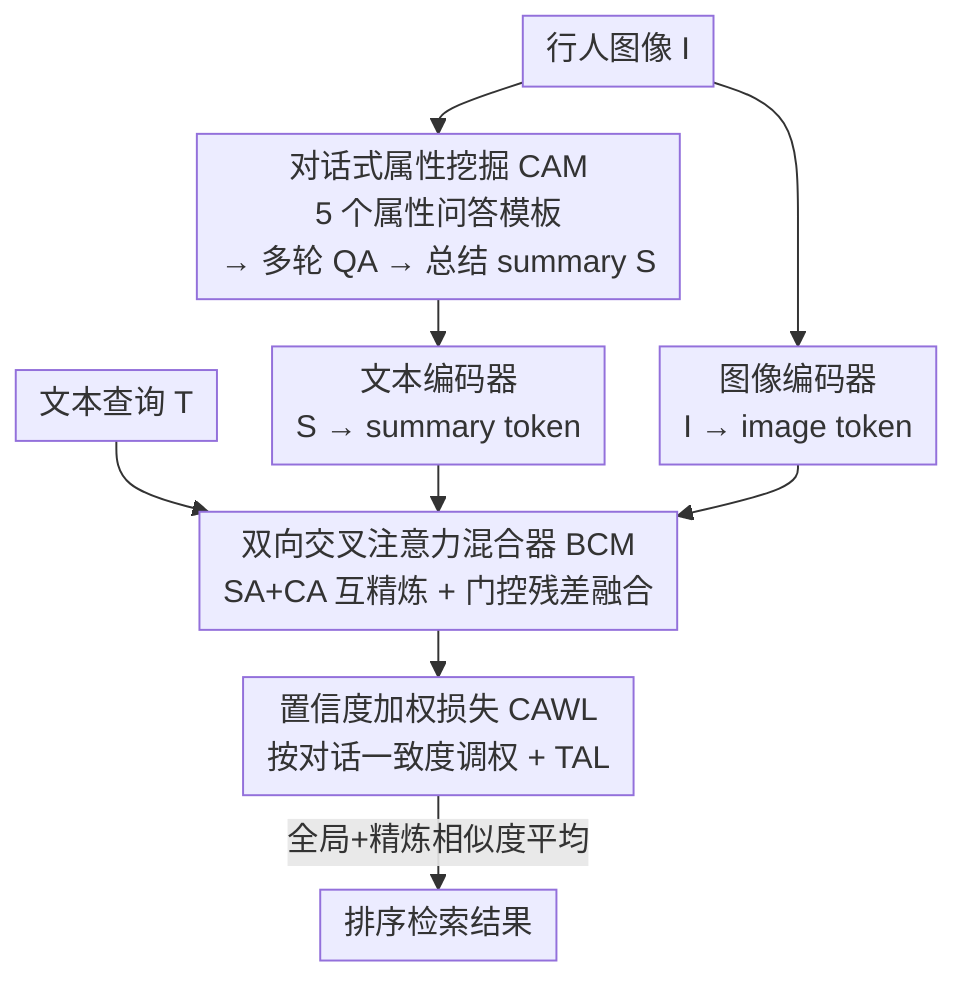

# Tackling Alignment Ambiguity in Person Retrieval through Conversational Attribute Mining

**会议**: CVPR 2026  
**论文**: [CVF Open Access](https://openaccess.thecvf.com/content/CVPR2026/html/Zou_Tackling_Alignment_Ambiguity_in_Person_Retrieval_through_Conversational_Attribute_Mining_CVPR_2026_paper.html)  
**代码**: https://github.com/sugelamyd123/CECA  
**领域**: 多模态VLM / 文本-图像行人检索  
**关键词**: 文本行人检索, 跨模态对齐, 多模态大模型, 对话式属性挖掘, 置信度加权

## 一句话总结
针对「文本-图像行人检索」里查询和图像对不齐的老大难问题，本文用多模态大模型以「多轮问答」方式从行人图里挖出细粒度属性并总结成一段描述，再用双向交叉注意力把这段总结和图像 token 互相精炼，最后用置信度加权损失压住大模型生成的噪声对话，在三个基准上把 Rank-1 刷到新高。

## 研究背景与动机
**领域现状**：文本-图像行人检索（Text-to-Image Person Retrieval, TIPR）是给一句自然语言描述（"穿蓝白黑条纹衫、蓝牛仔裤、绿鞋的男人"）去图库里捞出对应行人。主流做法是用 CLIP/ALBEF 这类视觉-语言预训练模型当 backbone，把图像和文本投到同一个嵌入空间里算相似度；近期还有人构建 ReID 领域的大规模图文数据集做领域内预训练。

**现有痛点**：跨模态对齐天生有「对齐歧义」——模型常常只能抓到局部、粗粒度的线索，对行人细粒度属性（上衣花色、是否戴帽、有没有背包）理解不到位，于是把查询匹配到「长得像但身份其实不对」的人身上。一批工作开始引入多模态大模型（MLLM），但用法都很「粗」：要么拿它扩写文本/造伪标注做数据增强或预训练，要么拿它当裁判对候选重排序。

**核心矛盾**：MLLM 生成的描述里其实藏着丰富、可学习的细粒度信息，但现有方法只做了「简单判断」或「预训练监督」这种浅层利用，没把生成文本和原图之间的细粒度对应关系真正学进检索模型里——对齐依旧模糊且不可解释。同时，MLLM 的生成也并不总是可靠，直接全盘信任噪声对话反而会拖垮对齐。

**本文目标**：(1) 把 MLLM 的细粒度属性线索显式地、结构化地抽出来；(2) 让这些线索和视觉特征在 token 级别充分互相精炼；(3) 在训练时识别并压制低质量对话。

**核心 idea**：用「对话式属性挖掘」代替「一句话扩写」——让 MLLM 以多轮问答方式把行人属性逐项问清再总结成一段 summary，把这段 summary 当作第三个模态，通过双向交叉注意力与图像 token 互相精炼，并用置信度加权损失自适应地相信/怀疑每条对话。

## 方法详解

### 整体框架
CECA（Conversation-Enhanced Cross-modal Alignment）以 CLIP-ViT/B-16 为骨干，输入是「行人图像 + 文本查询」，输出是按相似度排序的检索结果。整条管线分三块：先用 **对话式属性挖掘（CAM）** 让 MLLM 把图里行人的属性问答出来并总结成 summary；这段 summary 经文本编码器后，和图像 token 一起送进 **双向交叉注意力混合器（BCM）** 做 token 级互相精炼，得到「对话增强」的视觉表征；训练时用 **置信度加权损失（CAWL）** 根据每条对话和图/文的一致程度动态调权，把噪声对话压下去。最终检索分数取「全局相似度 + 精炼相似度」的平均。

### 关键设计

**1. 对话式属性挖掘 CAM：用多轮问答把细粒度属性逐项问清，而不是让大模型一口气扩写**

痛点是直接让 MLLM "描述这个人" 会漏项、笼统。CAM 预定义 5 个面向视觉细节的问题模板，针对上衣、帽子、裤子、鞋子、手持物等关键外观线索，把 MLLM 当作「回答者（Answerer）」逐项交互。给定图像 $I$ 和问题模板集合 $Q=\{q_t\}_{t=1}^{T}$，Answerer（带编码器和多模态解码器的 MLLM）对每个问题 $q_t$ 先把图像和问题文本联合编码，再解码出答案 $a_t$。这种多轮 QA 分解相比一次性 captioning，能强迫模型把多方面线索组织得更完整、更聚焦，减少遗漏。拿到完整对话记录 $D=[q_1,a_1,\dots,q_T,a_T]$ 后，再做一次 encode-decode：把图像连同对话一起编码、解码出一段紧凑的总结 $S$（即 $\text{Summary}=\text{Dec}(I,Q_1,A_1,\dots,Q_N,A_N)$），这段 summary 描述了行人的关键属性，是结构化、可解释的语义线索。实测对话轮数越多 Rank-1 越高，但第 3 轮后收益递减，综合精度和效率作者把轮数定为 5。

**2. 双向交叉注意力混合器 BCM：让 summary token 和图像 token 在 token 级互相精炼，而不是简单拼接**

光有 summary 还不够，得让它和视觉特征真正做细粒度对应。先把 summary 全局 token 和图像全局 token 加权融合成增强表征 $\mathbf{c}_{cls}=(1-\omega)\mathbf{v}_{cls}+\omega\mathbf{s}_{eos}$（$\omega\in[0,1]$ 是融合权重，论文取 0.3）。去掉特殊 token 后得到图像、summary、文本三路 token 序列 $f_v,f_s,f_t$。BCM 对图像和 summary 两路各先做自注意力（SA）精炼，再做交叉注意力（CA）从对方分支换取互补信息：

$$\mathbf{f}_v'=\mathrm{CA}(\mathbf{f}_v,\mathbf{f}_s)+\mathrm{SA}(\mathbf{f}_v),\quad \mathbf{f}_s'=\mathrm{CA}(\mathbf{f}_s,\mathbf{f}_v)+\mathrm{SA}(\mathbf{f}_s)$$

随后用门控残差把精炼信号融回去：$\mathbf{s}_{mix}=\mathbf{f}_s+\sigma(g_t)\,\mathrm{MLP}(\mathbf{f}_s')$、$\mathbf{v}_{mix}=\mathbf{f}_v+\sigma(g_v)\,\mathrm{MLP}(\mathbf{f}_v')$，其中 $\sigma$ 是 sigmoid 门、$g_t,g_v$ 是可学习参数，自适应控制精炼强度。文本分支只保留自注意力精炼 $\mathbf{t}_{mix}=\mathbf{f}_t+\sigma(g_t)\,\mathrm{MLP}(\mathrm{SA}(\mathbf{f}_t))$，以保住全局语义一致性。每路 token 再经 token refine 模块 $\mathbf{x}_{re}=\mathrm{MaxPool}(\mathrm{MLP}(\mathbf{x})+\mathrm{FC}(\mathbf{x}))$ 投到更高维并用最大池化强调最显著的局部线索，得到 $v_{re},s_{re},t_{re}$，最后再加权融合出对话增强的视觉表征 $\mathbf{c}_{re}=(1-\omega)\mathbf{v}_{re}+\omega\mathbf{s}_{re}$，与文本 $t_{re}$ 对齐算相似度。这种双向设计让图像和对话两个模态彼此精炼细粒度对应，同时保持与文本表征的语义连贯。

**3. 置信度加权损失 CAWL：按每条对话和图/文的一致度动态调权，把噪声对话压下去**

MLLM 生成的对话可能含和视觉不符的噪声，直接全盘当监督会损害对齐。CAWL 把它建模成一个「门控的 InfoNCE 混合」：

$$\mathcal{L}_{\text{CAWL}}=\sum_{i=1}^{K}\Big(\tilde\alpha_i\big(\mathcal{L}^{i}_{s2t}+\mathcal{L}^{i}_{s2v}\big)+(1-\tilde\alpha_i)\mathcal{L}^{i}_{t2v}\Big)$$

其中 $K$ 是 batch 内样本数，$\tilde\alpha_i$ 是归一化置信度权重——$\tilde\alpha_i$ 越高表示这条「对话-文本」和「对话-图像」越一致，就越多地相信 summary 监督（$\mathcal{L}_{s2t},\mathcal{L}_{s2v}$）；反之就退回去更信原始的文本-图像对齐 $\mathcal{L}_{t2v}$。置信度由 $\alpha_i=\sqrt{p_{s2t}(i)\cdot p_{s2v}(i)}$ 给出（两个方向相似度的几何平均），再归一化 $\tilde\alpha_i=\alpha_i/\sum_{\ell}\alpha_\ell$；这里 $p_{s2t}(i)$ 是 summary 全局 token 对文本的 softmax 相似度（$p_{s2v}$ 同理），用来估计这条对话的可靠程度。整体训练目标 $\mathcal{L}_{\text{total}}=\mathcal{L}_{\text{global}}+\mathcal{L}_{\text{refined}}+\mathcal{L}_{\text{CAWL}}$，其中 $\mathcal{L}_{\text{global}}$、$\mathcal{L}_{\text{refined}}$ 都用 Triplet Alignment Loss（TAL）分别监督全局特征 $(c_{cls},t_{eos})$ 和精炼特征 $(c_{re},t_{re})$，做到全局+局部双重一致。推理时取全局相似度和精炼相似度之和最大的图像作为结果：$I^*=\arg\max_i(\mathrm{sim}^{global}(I_i,T_j)+\mathrm{sim}^{refined}(I_i,T_j))$。

### 损失函数 / 训练策略
backbone 用 CLIP-ViT/B-16，隐层维度 512、8 个注意力头，沿用 IRRA 的全部超参以求公平对比。训练 60 epoch，Adam 优化器；CLIP 主干学习率 $1\times10^{-5}$、融合模块 $1\times10^{-4}$，前 5 epoch 从 $1\times10^{-6}$ 线性 warmup 到 $1\times10^{-5}$。TAL 的 margin $m=0.1$、温度 $\tau=0.015$、融合权重 $\omega=0.3$。MLLM 默认用 Qwen2-VL-7B-Chat 做属性挖掘，图像以 RGB 原尺寸读入。

## 实验关键数据
在 CUHK-PEDES、ICFG-PEDES、RSTPReid 三个 TIPR 基准上评测，指标为 Rank-1/5/10 和 mAP。

### 主实验
两种设定下（无 ReID 领域预训练 / 有 ReID 领域预训练）CECA 的 Rank-1 都拿到最高。下表为 Rank-1 对比（%）：

| 设定 | 方法 | CUHK-PEDES | ICFG-PEDES | RSTPReid |
|------|------|-----------|-----------|----------|
| 无 ReID 预训练 | ICL (CVPR'25) | 77.91 | 69.02 | 70.55 |
| 无 ReID 预训练 | GAHR (TIFS'25) | 76.64 | 68.69 | 68.85 |
| 无 ReID 预训练 | **CECA** | **78.30** | **72.25** | **71.40** |
| 有 ReID 预训练 | ICL♮ (CVPR'25) | 79.06 | 70.05 | 72.55 |
| 有 ReID 预训练 | GA-DMS (EMNLP'25) | 77.60 | 69.51 | 71.25 |
| 有 ReID 预训练 | **CECA** | **79.65** | **74.32** | **73.45** |

无 ReID 预训练时 CECA 三个数据集 Rank-1 分别超第二名 +0.39%、+3.23%、+0.85%；加上 ReID 领域预训练后在 CUHK-PEDES 取得 79.65/92.35/95.27 的 Rank-1/5/10，多数指标刷新 SOTA。⚠️ 注意 CECA 在 mAP 上并不总领先（如无预训练 CUHK-PEDES mAP 仅 65.92，低于 RaSa 的 69.38），它的优势主要体现在 Rank-1/5/10 这种命中率指标上。

### 消融实验
三模块逐一去除（在三数据集 Rank-1 / mAP 上）：

| 编号 | CAM | BCM | CAWL | CUHK R-1 | ICFG R-1 | RSTP R-1 |
|------|-----|-----|------|----------|----------|----------|
| #1 (Full) | ✔ | ✔ | ✔ | 78.30 | 72.25 | 71.40 |
| #2 | ✔ | ✘ | ✔ | 75.26 | 70.17 | 69.35 |
| #3 | ✔ | ✔ | ✘ | 77.66 | 71.02 | 69.10 |
| #4 | ✔ | ✘ | ✘ | 74.42 | 69.12 | 65.35 |
| #5 (Baseline) | ✘ | ✘ | ✘ | 73.57 | 65.70 | 63.60 |

### 关键发现
- **CAM 贡献最大**：从 #5 到 #4（只加 CAM）在 ICFG-PEDES 上带来 +3.42% Rank-1，说明把细粒度属性显式挖出来是核心增益来源。
- **BCM 是第二大功臣**：对比 #2 vs #1，BCM 在 CUHK-PEDES、RSTPReid 上分别贡献 +3.24%、+3.75% Rank-1，token 级双向精炼确实拉开了细粒度对齐。
- **CAWL 稳训练**：去掉 CAWL（#3）后各数据集普遍掉点（如 RSTPReid 71.40→69.10），印证压制噪声对话对稳定优化的作用。
- **对话轮数**：Rank-1 随轮数上升，第 3 轮后收益递减，权衡精度与效率取 5 轮。
- **换 MLLM 仍稳**：把 Qwen2-VL-7B 换成 LLaVA-1.5-7B、BLIP-2-OPT-6.7B，性能基本持平（如 CUHK Rank-1 78.30/78.12/77.60），说明框架对具体 MLLM 不敏感、泛化性好。

## 亮点与洞察
- **把「对话」当成第三模态**：不是用 MLLM 扩写文本或当裁判，而是把多轮问答总结成的 summary 当作一路独立 token 送进双向注意力，让生成内容真正参与表征学习——这是相比以往「粗利用 MLLM」的关键差异。
- **置信度几何平均很巧**：用 $\sqrt{p_{s2t}\cdot p_{s2v}}$ 同时要求对话和文本、对话和图像都一致才给高权重，单边一致（可能是幻觉碰巧对上文本）会被几何平均拉低，是个简洁有效的去噪信号。
- **可迁移性**：CAM 这种「预定义属性模板 → 多轮 QA → 总结」的范式，能搬到任何需要细粒度属性的检索/识别任务（如车辆 ReID、商品检索）；CAWL 的置信度加权思路也适用于任何「用大模型伪标注做监督」的场景。

## 局限与展望
- **mAP 偏弱**：CECA 在多个数据集的 mAP 上落后于部分对手，说明它擅长把正确目标推到前几名，但整体排序质量（召回靠后的相关样本）还有提升空间。
- **训练期依赖 MLLM 推理**：每张训练图都要跑一遍 MLLM 多轮问答生成对话和 summary，预处理成本不低（虽然推理检索时不需要 MLLM）。⚠️ 论文未明确报告这部分的时间/算力开销。
- **属性模板是手工预定义的 5 个问题**：覆盖面受限于人工设计，对模板没问到的属性（如纹身、特殊配饰）可能仍然抓不住；自动生成或自适应问题或许更好。
- **轮数固定为 5**：对简单/复杂样本一刀切，按样本难度动态决定问答轮数可能更高效。

## 相关工作与启发
- **vs 生成式方法（HAM / NAM / GA-DMS）**：它们用 MLLM 造伪 caption 或大规模图文对做领域预训练，依赖昂贵的伪标注生成和大规模训练，且忽略细粒度视觉语义；CECA 直接显式挖掘并 token 级利用这些细粒度线索，不靠堆数据。
- **vs 判断式方法（ICL）**：ICL 把 MLLM 当评估器、用结构化提问对候选重排序，属于「事后裁判」；CECA 把对话信息前置融进表征学习，对齐更深、更可解释。
- **vs IRRA / RDE（CLIP 微调路线）**：它们靠损失设计或预训练骨干迁移 CLIP 的对齐能力，受限于骨干容量和数据规模；CECA 在同样 CLIP 骨干和超参下，通过引入对话模态和双向精炼把 Rank-1 进一步抬高。

## 评分
- 新颖性: ⭐⭐⭐⭐ 把 MLLM 对话当独立模态做 token 级精炼 + 置信度去噪，思路清晰且区别于既有「粗利用」范式。
- 实验充分度: ⭐⭐⭐⭐ 三基准、两设定、模块消融、轮数分析、换 MLLM 泛化、跨数据集泛化、注意力可视化都覆盖。
- 写作质量: ⭐⭐⭐⭐ 结构完整、含算法伪代码；个别公式排版（CVF 抽取）有噪声，但逻辑可复现。
- 价值: ⭐⭐⭐⭐ 在 TIPR 上稳定刷 SOTA，CAM/CAWL 范式对其他细粒度检索任务有迁移价值。

<!-- RELATED:START -->

## 相关论文

- [\[CVPR 2026\] Vision-Language Attribute Disentanglement and Reinforcement for Lifelong Person Re-Identification](vision-language_attribute_disentanglement_and_reinforcement_for_lifelong_person_.md)
- [\[CVPR 2026\] Composite-Attribute Person Re-Identification via Pose-Guided Disentanglement](composite-attribute_person_re-identification_via_pose-guided_disentanglement.md)
- [\[CVPR 2026\] Towards Cross-Modal Preservation, Consistency and Alignment for Privacy-Preserving Visible-Infrared Person Re-Identification](towards_cross-modal_preservation_consistency_and_alignment_for_privacy-preservin.md)
- [\[CVPR 2026\] View-Aware Semantic Alignment for Aerial-Ground Person Re-Identification](view-aware_semantic_alignment_for_aerial-ground_person_re-identification.md)
- [\[CVPR 2026\] ViBES: A Conversational Agent with Behaviorally-Intelligent 3D Virtual Body](vibes_a_conversational_agent_with_behaviorally_intelligent_3d_virtual_body.md)

<!-- RELATED:END -->
