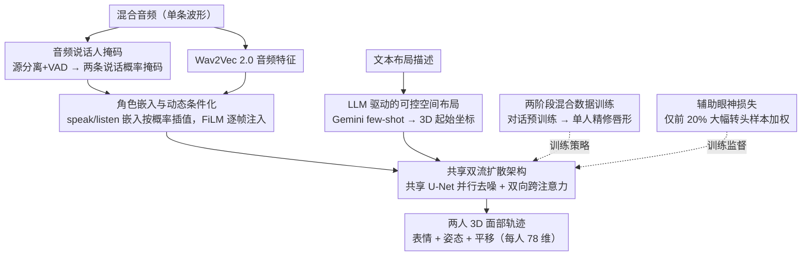

# Talking Together: Synthesizing Co-Located 3D Conversations from Audio

**会议**: CVPR 2026  
**arXiv**: [2603.08674](https://arxiv.org/abs/2603.08674)  
**代码**: 无  
**领域**: 人体理解  
**关键词**: 双人对话, 3D面部动画, 扩散模型, 共处空间, 眼神交互

## 一句话总结

首次提出从单一混合音频流生成两个**共处同一3D空间**的对话参与者完整面部动画的方法，通过双流扩散架构（共享 U-Net + 跨注意力）、两阶段混合数据训练策略、LLM 驱动的文本-空间布局控制以及辅助眼神损失，实现自然的互视、转头和空间感知的双人对话3D动画合成。

## 研究背景与动机

- **已有研究局限**: 现有音频驱动3D面部动画方法要么只关注单个说话人（CodeTalker、FaceFormer、SelfTalk），要么将对话双方生成为"视频会议"式的独立头像（DualTalk），忽略了真实面对面对话中关键的物理共处空间关系——相对位置、朝向和互相注视。
- **核心挑战**: (1) 大规模共处双人3D对话数据极度匮乏；(2) 从单一混合音频中分离双方语音并建模说话-倾听交互动态非常困难；(3) 需要合成包含空间位置关系（平移、旋转）和眼神接触的完整3D动画。
- **本文突破**: 提出首个显式建模双人3D空间关系的对话生成系统，构建了覆盖 200 万+ 交互对的大规模数据集，实现了从"视频会议头像"到"同室面对面对话"的范式转换。
- **应用场景**: VR/AR 远程共现、沉浸式社交交互、虚拟数字人对话。

## 方法详解

### 整体框架

这篇论文要解决的是一个此前没人正面碰过的问题：给一段两人混在一起的音频，同时生成两个**站在同一个3D空间里**的人的面部动画，让他们会互相看、会转头、会随对方的话点头。系统的输入只有一条混合音频波形 $\mathbf{A} \in \mathbb{R}^T$，输出则是两个参与者各自的3D面部动画序列——表情向量 $\bm{\psi} \in \mathbb{R}^{L \times 63}$、骨骼姿态 $\bm{\theta} \in \mathbb{R}^{L \times 4 \times 3}$（颈、头、左右眼四个关节）和全局平移 $\mathbf{t} \in \mathbb{R}^{L \times 3}$，三者拼成每人一条 $\mathbf{x} = \text{concat}(\psi, \theta, \mathbf{t}) \in \mathbb{R}^{L \times 78}$ 的轨迹，长度 $L=250$（10秒 @ 25fps）。整条流程是：先从混合音频里解出"谁在何时说话"，把它变成角色条件喂给一个条件扩散模型；这个扩散模型用一套共享权重的双流 U-Net 同时给两个人去噪，中间靠跨注意力让两路互相"看见"，再用角色嵌入和 FiLM 把说话/倾听状态逐帧注进去，最后输出两条面部轨迹。

### 关键设计

**1. 音频说话人掩码：先从一条混合音频里标出"谁在说话"**

模型要做出反应性动作（你说我听、我转头看你），首先得知道任意时刻轮到谁开口，但输入只有一条混在一起的波形。这里用 Looking to Listen 模型做音源分离，再过一遍 WebRTC VAD，得到两条二值说话概率掩码 $\mathbf{m}_A, \mathbf{m}_B \in [0,1]^{T \times 1}$。掩码并不要求完全准确——作者刻意接受它的轻微误差，把这点不精确当成有益噪声，反而让模型在面对真实对话中频繁的语音重叠时更稳。工程上掩码在训练前预计算存好，推理时再在线估计。

**2. 共享双流扩散架构：一套权重同时去噪两个人，再让两路互相看**

两个人的动画既要风格一致（都是自然的人脸运动），又要彼此呼应（一个说、另一个反应）。做法是只用一个 U-Net 骨干、以共享权重并行去噪 $\mathbf{x}_{t,A}$ 和 $\mathbf{x}_{t,B}$，逼模型学一套说话人无关的通用面部运动表示，保证两路输出同质；再在解码器里插入双向跨注意力，让每一路都能读到对方的特征：

$$\mathbf{h}'_A = \text{Attention}(\mathbf{Q}_A, \mathbf{K}_B, \mathbf{V}_B), \quad \mathbf{h}'_B = \text{Attention}(\mathbf{Q}_B, \mathbf{K}_A, \mathbf{V}_A)$$

正是这条跨注意力通道让点头回应、转头注视这类反应性行为有了来源——没有它，两个流就只是各说各话的独立头像。

**3. 角色嵌入与动态条件化：用连续插值表达"说—听"之间的过渡**

如果只给每个人贴一个离散的"说话/倾听"标签，就没法刻画过渡时刻和两人同时开口的情形。作者引入两个可学习嵌入 $\mathbf{e}_{\text{speak}}$ 和 $\mathbf{e}_{\text{listen}}$，按逐帧说话概率 $\mathbf{m}^{(k)}$ 做线性插值，得到一个连续的角色向量：

$$\mathbf{e}_{\text{role}}^{(k)} = \mathbf{m}^{(k)} \mathbf{e}_{\text{speak}} + (1 - \mathbf{m}^{(k)}) \mathbf{e}_{\text{listen}}$$

这样说话到倾听的渐变、抢话时的"半说半听"都能被平滑表达。条件向量 $\mathbf{c}^{(k)}$ 再把 Wav2Vec 2.0 音频特征 $\mathbf{a}^{(k)}$、双方角色嵌入和说话概率掩码拼到一起，并走两条路注入网络：一是直接与噪声输入拼接，二是通过 FiLM 调制中间特征，实现逐帧的自适应控制：

$$\text{FiLM}(\mathbf{h}, \mathbf{c}^{(k)}) = (\bm{\gamma}(\mathbf{c}^{(k)}) + 1) \odot \mathbf{h} + \bm{\beta}(\mathbf{c}^{(k)})$$

**4. 两阶段混合数据训练：先从嘈杂对话里学交互，再用干净单人精修唇形**

两类数据各有短板：网上扒来的双人对话视频分辨率低、常有遮挡，唇部标注不准；而单人正面视频唇形精确，却根本没有交互。硬把它们混在一起训，唇同步和交互会互相拖累。作者的解法是分两步走——阶段1在大规模对话数据上预训练双流模型，让它学会转头、点头、表情反应这些交互动态，损失覆盖表情、旋转和平移；阶段2再在高质量单人数据和超分辨率增强后的对话子集上微调，其中单人样本**只**对说话者的 20 个唇部/下颌表情参数算 L2 损失、其余损失全部归零，专门把嘴形磨细。先学怎么互动、再修嘴怎么动，两类数据的长处就各取了一份。

**5. LLM 驱动的可控空间布局：让一句话决定两人的3D站位**

要让用户能用自然语言指挥两人的空间关系，关键是别让模型去硬记绝对坐标。训练时以两人第一帧的真实全局平移 $\mathbf{t}_A^{(0)}, \mathbf{t}_B^{(0)}$ 作为条件，模型只学预测相对位移 $\Delta\mathbf{t}^{(k)} = \mathbf{t}^{(k)} - \mathbf{t}^{(0)}$；这一步归一化把问题简化成"给定布局下该怎么动"，头部转动、眼神方向都挂靠在相对位置上而非绝对位置。推理时则用 Gemini 做 few-shot prompting，把"亲密对话""桌对面争吵"这类文字描述翻成具体的3D起始坐标，喂给模型当条件。

**6. 辅助眼神损失：只在"真的会对视"的片段上加码**

互视和眼神回避是面对面对话的灵魂，但直接对所有帧约束眼神，会被大量静态、低质量片段稀释。这个损失先把左右眼的旋转参数换算成3D注视方向向量、取均值，再对预测与真值的注视方向算余弦相似度。真正的巧思在于**选择性施加**：只在头部旋转方差排名前 20% 的对话样本上加更高权重——大幅度转头的片段直觉上更可能藏着有意义的眼神交互（转头去看对方），从这些样本里学到的眼神模式才有价值。

### 数据集构建

支撑上述训练的是两个互补的大规模数据集：

- **双人对话数据集（50,000+ 小时，10k+ 身份）**：从在线视频里筛真实的双人同场景对话，经过场景过滤（排除视频会议式分屏）、质量过滤（遮挡/模糊/过小人脸）、面部超分辨率增强、再做带时序平滑项的3D面部重建，拿到完整的3D参数。它提供的是交互的多样性。
- **合成配音数据集（50,000+ 小时，10k+ 身份）**：从高质量单人正面视频里随机采样、裁切语音片段，交替拼接成伪对话音频。因为是人工拼的，说话人掩码有完美真值、唇部运动也精确——它补的是干净监督这一块。

### 损失函数与训练策略

总损失为多项重建加正则的加权和：表情重建（$\lambda_{expr}=1$）+ 旋转重建（$\lambda_{rot}=8$）+ 平移重建（$\lambda_{trans}=1$）+ 顶点速度正则（$\lambda_{vel}=1$）+ 辅助眼神损失（$\lambda_{gaze}=5$）。旋转和眼神两项权重明显偏高，对应这篇论文最看重的头部朝向与互视。训练资源为 16×A100、200K steps，分上述预训练 / 微调两阶段进行。

## 实验关键数据

### 主实验：定量对比（Table 2）

| 方法 | FD ↓ | P-FD ↓ | MSE-FULL ↓ | MSE-ROT ↓ | MSE-EYE ↓ | MSE-LIP ↓ | vMSE-FULL ↓ | SID-SPE ↑ | SID-LIS ↑ |
|------|------|--------|------------|-----------|-----------|-----------|-------------|-----------|-----------|
| CodeTalker | 47.23 | 70.54 | 10.47 | 14.28 | 3.07 | 2.95 | 12.49 | 0 | 0 |
| SelfTalk | 43.58 | 53.98 | 8.21 | 11.59 | 2.47 | 2.41 | 10.98 | 1.68 | 1.27 |
| FaceFormer | 52.66 | 59.84 | 13.89 | 12.34 | 2.96 | 2.84 | 10.47 | 1.59 | 0.43 |
| DualTalk | 28.41 | 38.29 | 9.91 | 8.42 | 2.11 | 2.50 | 8.32 | 1.57 | 1.95 |
| L2L | 38.92 | 66.13 | 11.32 | 10.15 | 2.35 | 2.94 | 11.21 | 1.78 | 1.58 |
| Ours (Single) | 19.58 | 29.03 | 6.32 | 6.74 | 1.23 | 1.14 | 6.86 | 2.23 | 1.40 |
| **Ours** | **10.43** | **18.24** | **4.03** | **3.50** | **0.98** | **0.35** | **7.99** | **2.28** | **2.48** |

### 消融实验（Table 3）

| 消融配置 | FD ↓ | P-FD ↓ | MSE-EXP ↓ | MSE-TRAN ↓ | MSE-ROT ↓ |
|----------|------|--------|-----------|------------|-----------|
| 仅单人数据 | 50.45 | 50.05 | 10.01 | 2.32 | 3.88 |
| 去掉第二阶段（仅对话预训练） | 60.12 | 64.44 | 7.73 | 1.71 | 2.94 |
| 去掉角色嵌入 | 35.92 | 35.93 | 7.18 | 1.80 | 2.87 |
| 去掉跨注意力 | 30.49 | 40.87 | 6.87 | 1.54 | 2.98 |
| 去掉眼神损失 | 37.46 | 42.90 | 7.33 | 2.59 | 2.77 |
| **完整模型** | **21.71** | **22.56** | **5.97** | **1.50** | **2.48** |

### 人类评估偏好率（Table 4，%）

| 方法 | 唇同步 | 说话者运动 | 倾听者运动 | 交互质量 | 眼神质量 |
|------|--------|-----------|-----------|---------|---------|
| SelfTalk | 0.9 | 0.9 | 1.6 | 1.6 | 2.4 |
| DualTalk | 3.9 | 6.3 | 7.2 | 5.6 | 7.9 |
| Ours (仅阶段1) | 15.9 | 19.0 | 18.2 | 21.4 | 21.4 |
| **Ours** | **79.3** | **73.8** | **73.0** | **71.4** | **68.3** |

### 关键发现

1. **FD 指标碾压式领先**: 本方法 FD=10.43 是最强基线 DualTalk (28.41) 的 1/3 不到，MSE-LIP=0.35 相比 DualTalk 的 2.50 降低 86%
2. **两阶段缺一不可**: 仅用对话数据（去掉第二阶段）FD 暴涨至 60.12，仅用单人数据 FD=50.45——说明交互学习和唇部精修必须结合
3. **跨注意力是交互建模的关键**: 去掉后 P-FD 从 22.56 上升到 40.87，表明双向信息交换对捕获说话-倾听反应至关重要
4. **眼神损失显著改善空间感**: 去掉后 MSE-TRAN 从 1.50 上升到 2.59，说明眼神约束间接改善了整体空间位置预测
5. **人类评估压倒性优势**: 在所有五个维度上偏好率均超过 68%，唇同步偏好率高达 79.3%

## 亮点与洞察

1. **从"视频会议"到"同室对话"的范式转换**：首次显式建模共处3D空间关系（相对位置、朝向、互视），这是此前所有对话生成方法忽略的核心要素
2. **数据集工程极具价值**：两个互补数据集的设计思路巧妙——对话数据提供交互多样性，合成配音数据提供唇部精度和完美掩码真值，两阶段训练策略将两者优势完美结合
3. **眼神损失的选择性施加**：只在头部运动大的前 20% 样本上加权的策略非常聪明，避免了在静态/低质量片段上强行学习无意义的眼神模式
4. **LLM 驱动的空间控制**：将文本描述映射为3D坐标的 few-shot 方案简洁高效，为生成式模型的可控性提供了优雅的接口

## 局限性

1. 依赖音源分离和 VAD 的质量，在高噪声或强重叠语音场景下掩码可能不可靠
2. 3DMM 参数化模型限制了表情的细腻度（如微表情、非对称表情），63 维表情编码可能不够
3. 当前仅建模面部和头部动画，全身姿态（手势、身体倾斜等）的共处交互未涵盖
4. LLM 文本到空间坐标的映射基于 few-shot，对复杂或罕见场景描述的泛化能力有限
5. 训练资源需求大（16×A100，200K steps），复现成本高

## 相关工作与启发

- **音频驱动单人3D头像**: FaceFormer、CodeTalker、SelfTalk 聚焦单人生成，缺乏交互建模；本文通过双流架构+跨注意力自然地扩展到双人场景
- **对话生成**: DualTalk 建模双人但限于"视频会议"风格无空间关系，L2L 为特定身份训练独立模型且不能同时生成——本方法统一了说话/倾听角色在同一个共享模型中
- **空间感知群体交互**: 现有多人身体运动生成关注碰撞避免和步态协调，但缺乏高保真面部表情——本方法填补了面部级空间交互生成的空白
- **启发**: 角色嵌入的连续插值策略（而非离散角色标签）值得借鉴；"从噪声数据学交互+从干净数据学细节"的两阶段策略具有通用性

## 评分

| 维度 | 分数 (1-10) | 说明 |
|------|-------------|------|
| 新颖性 | 9 | 首次显式建模共处3D空间的双人对话生成，问题定义本身即为贡献 |
| 技术深度 | 8 | 双流扩散+跨注意力+FiLM+两阶段训练+眼神损失，模块设计完整且相互配合 |
| 实验充分性 | 9 | 定量对比全面（11个基线）、消融彻底（5个变体）、人类评估有力（19人×14组×5维度） |
| 工程贡献 | 9 | 两个大规模数据集（各50,000+小时）的构建流水线工程价值极高 |
| 应用前景 | 8 | VR/AR远程共现直接适用，但计算成本和模型复杂度可能限制实际部署 |
| **总分** | **8.6** | 问题定义新颖、系统设计完整、实验说服力强，是共处对话生成方向的开创性工作 |

<!-- RELATED:START -->

## 相关论文

- [\[CVPR 2026\] AudioAvatar: Personalized Audio-driven Whole-body Talking Avatars](audioavatar_personalized_audio-driven_whole-body_talking_avatars.md)
- [\[CVPR 2026\] PC-Talk: Precise Facial Animation Control for Audio-Driven Talking Face Generation](pc-talk_precise_facial_animation_control_for_audio-driven_talking_face_generatio.md)
- [\[ECCV 2024\] ScanTalk: 3D Talking Heads from Unregistered Scans](../../ECCV2024/human_understanding/scantalk_3d_talking_heads_from_unregistered_scans.md)
- [\[ECCV 2024\] Audio-Driven Talking Face Generation with Stabilized Synchronization Loss](../../ECCV2024/human_understanding/audio-driven_talking_face_generation_with_stabilized_synchronization_loss.md)
- [\[CVPR 2026\] LiveGesture: Streamable Co-Speech Gesture Generation Model](livegesture_streamable_co-speech_gesture_generation_model.md)

<!-- RELATED:END -->
