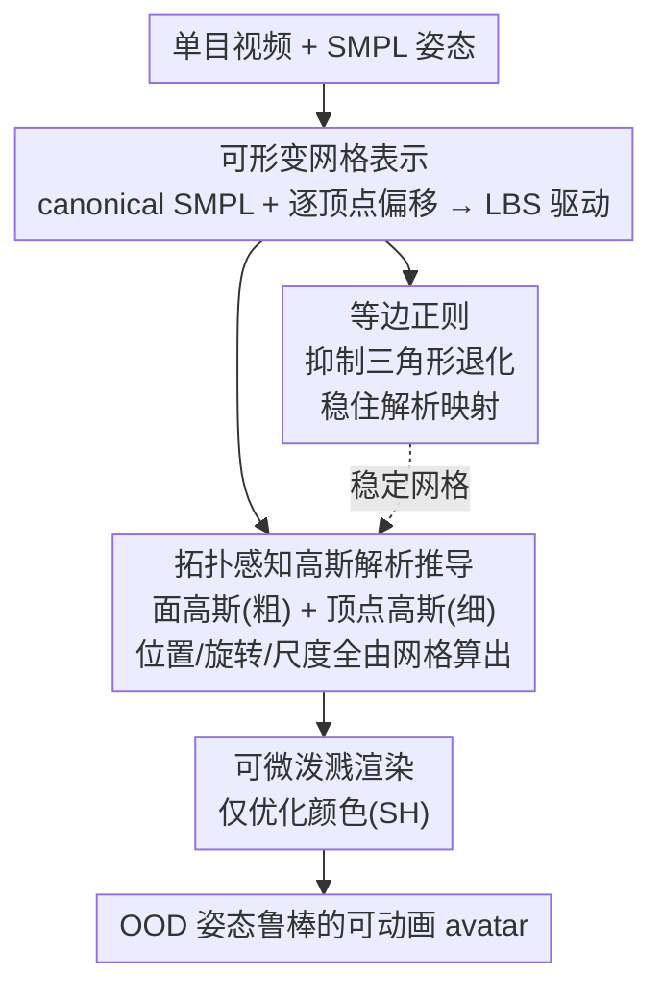

# Tavatar: Topology-Aware Gaussian Attribute Derivation for Animatable Human Avatars

**会议**: CVPR 2026  
**论文**: [CVF Open Access](https://openaccess.thecvf.com/content/CVPR2026/html/Luo_Tavatar_Topology-Aware_Gaussian_Attribute_Derivation_for_Animatable_Human_Avatars_CVPR_2026_paper.html)  
**代码**: 无（仅有项目页 https://hailin545.github.io/tavatar/）  
**领域**: 3D视觉 / 可驱动数字人  
**关键词**: 高斯泼溅, 可动画数字人, 拓扑一致性, 网格绑定, OOD 姿态泛化

## 一句话总结
Tavatar 不再把每个 3D 高斯的旋转和尺度当作自由优化的参数，而是从底层可形变网格的三角形几何中**解析地推导**出来，让高斯天然锚定在网格拓扑上，从而在没见过的复杂姿态（OOD）下也不会脱落或穿洞——在 X-Avatar 上法向误差比最优 baseline 降低 13.8%，PeopleSnapshot 上降低 17.9%，同时渲染质量保持竞争力。

## 研究背景与动机

**领域现状**：从单目视频重建可驱动的人体 avatar，主流是把参数化人体模型（SMPL）与神经渲染结合。NeRF 系方法画质高但体渲染太慢、对训练外姿态泛化差；3DGS（3D 高斯泼溅）因显式表达 + 实时渲染成为近年主流，方法多把高斯绑到 SMPL 形变上。

**现有痛点**：现有 3DGS-based 方法把高斯当成"自由漂浮"的实体——位置、旋转、尺度都各自独立优化。这种自由度在拟合训练姿态时很灵活，但**缺乏拓扑一致性**。人在动作时，穿衣体表会随底层网格被拉伸/压缩，而自由优化的高斯一旦脱离网格形变规律，就会过拟合训练姿态（如简单转身），在 OOD 姿态（如复杂手势）下出现**高斯脱落**或**表面破洞**，严重破坏沉浸感。

**核心矛盾**：即便是较新的改进方法（IHuman、GomAvatar）也只约束了高斯的**朝向（rotation）**，却把**尺度（scale）**留给自由优化。作者认为 scale 恰恰是适配 OOD 姿态的关键——网格在关节附近发生大形变时，没有 topology-aware 的尺度推导，高斯无法跟随局部表面的伸缩，必然出现 artifacts。这是一个"部分约束不够"的问题。

**核心 idea**：与其优化高斯的几何属性，不如**直接从网格几何解析推导**它们。把高斯解析地锚定在网格的面（face）和顶点（vertex）上，旋转和尺度都由三角形属性、局部边长算出来，让每个高斯"继承"网格的空间结构和形变行为，从设计上就强制了拓扑一致性。

## 方法详解

### 整体框架

Tavatar 输入单目视频，输出一个可任意驱动、对 OOD 姿态鲁棒的高斯人体。整条管线把"可形变网格"当作几何脚手架，让所有高斯属性都从这个脚手架上算出来，只把颜色留给优化。它由三块串起来：先用一个 canonical SMPL 模板 + 学到的逐顶点偏移构造**个性化可形变网格**，再经 LBS 蒙皮驱动到目标姿态；然后在这张随姿态形变的网格上**解析推导每个高斯的位置/旋转/尺度**（面高斯管粗粒度覆盖、顶点高斯管细节与接缝）；最后用**等边正则**保证网格三角形不退化，因为解析映射的稳定性完全依赖网格质量。网格几何和高斯外观端到端联合优化。

### 关键设计

**1. 解析式高斯属性推导：把 scale 和 rotation 从网格几何里"算"出来而不是"学"出来**

这是全文的核心，直接针对"自由优化的高斯在 OOD 姿态下脱落"的痛点。作者设计了两类互补高斯，所有几何属性 $(\mu, R, s)$ 都从网格解析推导，**不进优化器**。

*面高斯（Face Gaussian）* 管粗粒度表面覆盖：对每个三角面 $f_i$，中心放在按对边长加权的**内心**（incenter）$\mu_f^i = \frac{l_1 v_{i,1} + l_2 v_{i,2} + l_3 v_{i,3}}{l_1 + l_2 + l_3}$；朝向 $R_f^i = [t_1^i, t_2^i, n_f^i]$ 对齐三角面的局部坐标系（法向 + 两个正交切向）；**尺度绑定到三角形内切圆半径** $r_i = A_i / s_i$（$A_i$ 是面积、$s_i$ 是半周长），即 $s_{f,x}^i = s_{f,y}^i = \epsilon \cdot r_i$，$s_{f,z}^i = \vartheta$（$\epsilon=0.5$，$\vartheta=10^{-3}$ 压成扁盘），不透明度固定 1.0 保证完整覆盖。三角形被拉大时内切圆半径随之变大，高斯尺度自动跟着变——这正是 scale 该有的行为。

*顶点高斯（Vertex Gaussian）* 管细节与面接缝处的无缝衔接：每个顶点一个，中心就在顶点 $\mu_v^j = v_j^p$，朝向对齐由相邻面法向按面积加权平均得到的**顶点法向**；尺度则取到一环邻居的**最小边长** $s_{v,x}^j = s_{v,y}^j = \varpi \cdot \min_{v_k \in N_1(j)} \lVert v_k^p - v_j^p \rVert$，让高斯密度自适应局部网格密度。

整套表示共 $M+N$ 个高斯（$M$ 面 + $N$ 顶点），**只优化颜色 SH 系数**。作者还刻意**放弃了标准 3DGS 的自适应稠密化（densification）**，因为那会破坏高斯与网格的严格对应关系，而这个对应正是动画稳定性的来源。

**2. 等边正则（Equilateral Regularization）：保住网格质量，解析映射才稳得住**

既然高斯尺度被解析绑定在局部网格上（面靠内切圆、顶点靠边长），那么 LBS 在关节附近引入的网格畸变（如被拉伸的细长三角形）就会**直接传播到高斯属性**——退化三角形会产生极端尺度值和渲染不稳。这个设计就是为了堵住这条传播链。

作者对个性化网格 $M_s$ 施加等边约束：$L_{tri} = \sum_{f \in F_s}\big(\mathrm{Var}(\{\lVert e_1\rVert, \lVert e_2\rVert, \lVert e_3\rVert\}) + \sum_{\theta \in \Theta_f}(1 - \cos\theta)^2\big)$。它由两项构成：**边长方差项**逼三条边长趋于一致，**角度项**惩罚内角偏离 60°。两者合力防止三角形退化，从而保证从网格几何推导出来的高斯 scale/rotation 始终稳定、表面覆盖完整。配合标准的 Laplacian 平滑与法向一致性正则 $L_{mesh}$，网格在大形变和手部/衣褶等精细区域都能保持良态。

### 损失函数 / 训练策略

端到端优化两组量：形状编码器 $E_s$（多分辨率 hash 编码，预测逐顶点偏移）的参数，以及所有高斯的 SH 颜色系数；几何属性 $(\mu, R, s)$ 全程**不优化**。光度损失 $L_{rgb}$ 和法向损失 $L_{normal}$ 都用 L1 + SSIM 组合（$\lambda_{SSIM}=0.2$），法向用预训练 Sapiens 估计器给的伪 GT 监督（渲染时把 SH 换成网格法向）。总目标 $L_{total} = L_{rgb} + \lambda_n L_{normal} + \lambda_m L_{mesh} + \lambda_t L_{tri}$（$\lambda_n=0.05$，$\lambda_m=0.01$，$\lambda_t=0.01$）。单卡 RTX-3090、每个 subject 训练 2000 iters、Adam（lr $10^{-3}$）。

## 实验关键数据

数据集：**PeopleSnapshot**（24 人简单转身动作，测 in-distribution 重建质量）与 **X-Avatar**（12 人复杂动作，训练/测试姿态分布差距大，专测 OOD 泛化，且带 GT 网格）。指标：渲染质量 PSNR/SSIM/LPIPS；几何精度法向误差 Normal（用 Sapiens 伪 GT，所有方法统一），X-Avatar 额外有 Chamfer Distance（CD）和 Point-to-Surface（P2S）这类**预测器无关**的指标。Baseline：3DGS 系 GART / IHuman / GomAvatar，NeRF 系 InstantAvatar。

### 主实验：几何精度（核心优势）

| 数据集 | 指标 | 本文 | 最优 baseline | 提升 |
|--------|------|------|----------------|------|
| PeopleSnapshot | Normal ↓ | 1.687 | IHuman 2.055 | −17.9% |
| X-Avatar | Normal ↓ | 1.772 | IHuman 2.056（P2S） / 2.0 级 | −13.8% |
| X-Avatar | CD ↓ | 0.111 | IHuman 0.132 | 明显更低 |
| X-Avatar | P2S ↓ | 0.107 | IHuman 0.126 | 明显更低 |

几何指标全面领先，直接验证核心假设：从网格拓扑解析推导高斯属性能保证动画中的几何一致性。可视化上，GART/IHuman 在 OOD 姿态下出现漂浮高斯和表面破洞，而 Tavatar 的高斯始终保持结构化、严格跟随网格形变。

### 主实验：渲染质量（X-Avatar 上 SOTA，PeopleSnapshot 上有取舍）

| 数据集 | 子集 | 指标 | 本文 | 对比 |
|--------|------|------|------|------|
| X-Avatar | 00016 | PSNR ↑ | 29.03 | GomAvatar 28.86 |
| X-Avatar | 00019 | SSIM ↑ | 0.9813 | GomAvatar 0.9772 |
| PeopleSnapshot | male-3 | PSNR ↑ | 28.93 | GART 30.21（更高） |
| PeopleSnapshot | male-3 | LPIPS ↓ | 0.0168 | 全场最佳 |

在 X-Avatar 的 OOD 姿态上 Tavatar 取得 SOTA 渲染质量；PeopleSnapshot 的简单转身上 GART 的 PSNR 略高——作者解释为自由漂浮高斯在简单动作上更容易过拟合，而这正是 Tavatar 的设计取舍：牺牲少量拟合灵活性，换取大幅的 OOD 鲁棒性。

### 消融实验（X-Avatar subject 00019）

| 配置 | PSNR ↑ | SSIM ↑ | Normal ↓ | CD ↓ | 说明 |
|------|--------|--------|----------|------|------|
| w/o FG | 26.89 | 0.9721 | 2.143 | 0.128 | 去面高斯（顶点尺度改为可学），表示稀疏、出现渲染空洞 |
| w/o VG | 25.67 | 0.9654 | 2.687 | 0.145 | 去顶点高斯，细节丢失、面接缝处不连续 |
| w/o ER | 27.83 | 0.9798 | 1.834 | 0.115 | 去等边正则，网格参数化退化、高斯分布混乱错位 |
| Full | **28.11** | **0.9813** | **1.772** | **0.111** | 完整模型 |

### 关键发现
- **面高斯负责粗粒度几何完整性**：去掉后即使把顶点高斯尺度改成可学（类似 IHuman），仍出现稀疏表示和明显渲染空洞，说明解析推导的面高斯不可或缺。
- **顶点高斯与面高斯互补**：去掉顶点高斯，掉点最严重（PSNR 25.67、Normal 2.687），细节和接缝崩坏，证明双 primitive 设计的协同价值。
- **等边正则是解析映射的"地基"**：去掉它网格退化，解析映射随之失效，高斯分布变得混乱——印证"解析属性推导的稳定性 = 底层网格几何的质量"这一核心原则。

## 亮点与洞察
- **范式转变：从"优化高斯"到"推导高斯"**。把 scale/rotation 从可学参数变成网格几何的解析函数，是一个干净利落的思路——它把拓扑一致性变成"by design"而非靠 loss 软约束，这也是它在 OOD 姿态下不脱落的根因。
- **抓住了被忽视的 scale**。前作只约束 rotation 是"半截子约束"，作者点明 scale 才是适配大形变的关键，并给出内切圆半径/最小边长这种几何直觉很强的推导方式，简单且可解释。
- **刻意放弃 densification 反而是优点**。为保证高斯与网格的严格 1:1 对应，主动舍弃 3DGS 的稠密化，这个"反直觉"的取舍换来了动画稳定性，是个可迁移的设计哲学：表达力 vs 结构约束的权衡。
- **等边正则可迁移**：任何"把基元属性绑定到网格局部几何"的方法都会面临三角形退化导致基元爆炸的问题，最小化边长方差 + 角度偏离 60° 是一个轻量通用的解法。

## 局限性 / 可改进方向
- **强依赖参数化人体模型的拟合质量**（作者承认）：精度与初始 body model fitting 耦合，SMPL 拟合不准会直接拖累 avatar 质量。
- **网格拓扑固定**：方法继承 SMPL 的 canonical 拓扑，对宽松衣物、长发等显著偏离人体网格的几何可能力不从心；作者提到未来想接入基于物理的动态衣物。
- ⚠️ 主结果表里 X-Avatar 的几何提升 13.8% 是相对"最优 baseline"，而 Tab.3 中各 baseline 的最优项不同（IHuman 法向最好但 GART/GomAvatar 在别处更强），跨方法横比时需注意各指标基准不一致（X-Avatar 法向具体数值以原文为准 ⚠️）。
- 仅单目视频、每 subject 单独训练 2000 iters，未报告跨身份的泛化/复用能力。

## 相关工作与启发
- **vs IHuman**：IHuman 用网格法向约束高斯**朝向**，但 scale 仍自由优化，大形变下表面不一致；Tavatar 把 scale 也纳入解析推导，补上了这"半截子约束"。
- **vs GomAvatar**：GomAvatar 把高斯绑到 SMPL 表面，但**缺网格质量正则**，三角形畸变时尺度不稳；Tavatar 的等边正则正是针对这一点，保证解析映射稳定。
- **vs GART**：GART 用自由漂浮高斯，简单姿态（PeopleSnapshot 转身）下渲染 PSNR 更高，但 OOD 姿态下漂浮 + 破洞严重；Tavatar 牺牲少量简单场景拟合度，换取复杂姿态的鲁棒泛化。

## 评分
- 新颖性: ⭐⭐⭐⭐☆ 从优化转向解析推导高斯属性的范式转变清晰，抓住了被忽视的 scale，思路干净。
- 实验充分度: ⭐⭐⭐⭐☆ 两数据集、光度 + 几何（含预测器无关的 CD/P2S）多指标、消融完整；但仅 4 subjects/数据集、未测跨身份泛化。
- 写作质量: ⭐⭐⭐⭐☆ 动机推导（部分约束不够→scale 关键）和方法叙述清晰，公式完整。
- 价值: ⭐⭐⭐⭐☆ OOD 姿态鲁棒的可驱动 avatar 实用价值高，几何驱动绑定 + 等边正则是可迁移的设计。

<!-- RELATED:START -->

## 相关论文

- [\[CVPR 2026\] ActAvatar: Temporally-Aware Precise Action Control for Talking Avatars](actavatar_temporally-aware_precise_action_control_for_talking_avatars.md)
- [\[ICCV 2025\] Avat3r: Large Animatable Gaussian Reconstruction Model for High-fidelity 3D Head Avatars](../../ICCV2025/human_understanding/avat3r_large_animatable_gaussian_reconstruction_model_for_hi.md)
- [\[AAAI 2026\] Generating Attribute-Aware Human Motions from Textual Prompt](../../AAAI2026/human_understanding/generating_attribute-aware_human_motions_from_textual_prompt.md)
- [\[CVPR 2026\] Gaussian-Mixture Latent Flow for Stochastic 3D Human Motion Prediction](gaussian-mixture_latent_flow_for_stochastic_3d_human_motion_prediction.md)
- [\[CVPR 2026\] Egocentric Visibility-Aware Human Pose Estimation](egocentric_visibility-aware_human_pose_estimation.md)

<!-- RELATED:END -->
