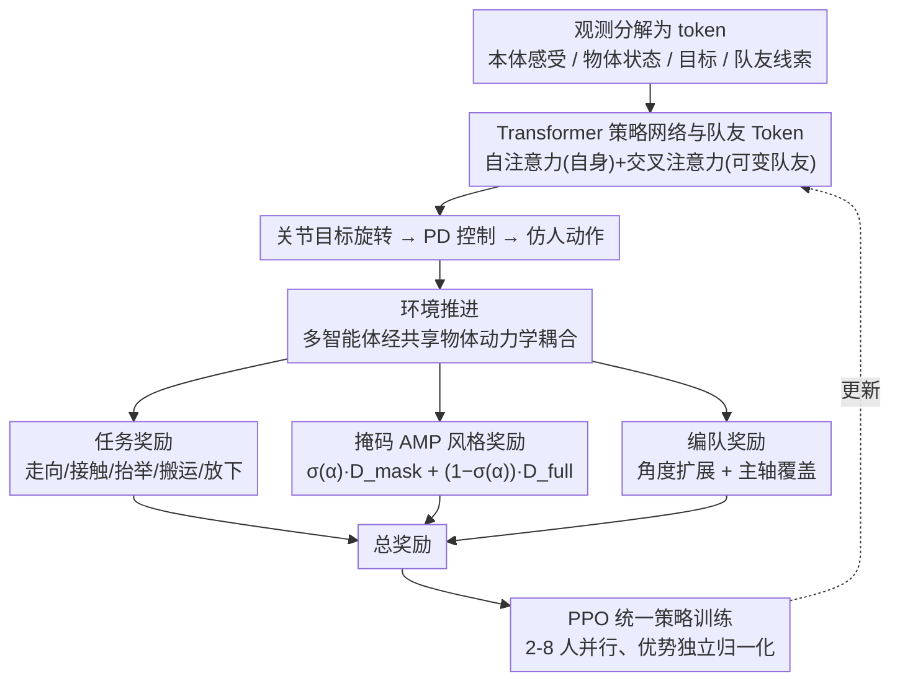

# TeamHOI: Learning a Unified Policy for Cooperative Human-Object Interactions with Any Team Size

**会议**: CVPR 2026  
**arXiv**: [2603.07988](https://arxiv.org/abs/2603.07988)  
**代码**: [项目主页](https://splionar.github.io/TeamHOI)  
**领域**: 其他  
**关键词**: 多智能体协作, 基于物理的人体控制, 人-物交互, Transformer策略网络, 对抗运动先验

## 一句话总结

提出 TeamHOI 框架，通过基于 Transformer 的去中心化策略网络和掩码对抗运动先验（Masked AMP），使单一策略能够泛化到任意数量智能体的协作搬运任务，2-8 个仿人智能体协作搬桌子成功率达 97%+。

## 研究背景与动机

**单智能体已成熟但多智能体协作缺失**：基于物理的仿人控制在单智能体行为（行走、抓取、操控）上已取得显著进展，但现实中许多任务（如搬运大型重物）需要多智能体协调物理动作，现有框架难以处理协作场景。

**固定团队规模限制**：现有方法多采用固定大小输入的 MLP 策略网络，导致策略被限制在固定的团队规模上（如 SMPLOlympics 只支持固定小规模团队），无法灵活适应不同数量的协作者。

**缺乏显式智能体间通信**：CooHOI 等方法完全不建模智能体间的感知，仅依赖共享物体动力学作为隐式通信渠道，无法捕捉人类协作中持续感知队友并动态调整的本质。

**多人协作运动数据稀缺**：AMP 需要参考运动数据来保证动作真实性，但多人协作的动捕数据几乎不存在，直接使用单人参考运动会严重限制可学到的协作行为多样性。

**协作模式单一化**：现有方法（如 CooHOI）由于依赖完整单人参考运动，协作模式被限制为仅前后抬举，无法产生侧向步行搬运等多样化协作策略。

**编队策略缺乏自主性**：CooHOI 需要预先为每个智能体指定接触点（oracle 指派），智能体无法自主推断合适的站位以实现稳定搬运。

## 方法详解

### 整体框架

TeamHOI 把 AMP 框架扩展为可变规模的多智能体强化学习设置，方法围绕三个核心设计展开。每个智能体在自己的局部坐标系下，把观测拆成本体感受、物体状态、目标位置、队友线索等多组 token，送入 **Transformer 策略网络**：自注意力处理自身 token，交叉注意力关注数量可变的队友 token，从而让同一套网络支持任意团队规模。网络输出关节目标旋转，经 PD 控制驱动仿人动作，多个智能体之间通过共享的物体动力学相互耦合。

奖励侧由三路汇合：分阶段的任务奖励（走向 / 接触 / 抬举 / 搬运 / 放下）、解耦"运动真实性"与"物体交互"的**掩码 AMP（Masked AMP）风格奖励**、以及让智能体自主围绕物体均匀站位的**编队奖励**。整套策略用 PPO 优化，训练时并行实例化 2-8 人的不同团队规模、对各规模的优势值独立归一化以稳定训练，最终得到一个能通吃任意人数的统一策略。

### 关键设计

**1. Transformer 策略网络与队友 Token**

观测组成（均在智能体局部坐标系下）：

- 本体感受 $\in \mathbb{R}^{223}$：关节状态和根节点运动学
- 物体中心 $\in \mathbb{R}^{3}$：桌子中心 3D 坐标
- 候选接触点 $\in \mathbb{R}^{64 \times 3}$：沿桌面周长均匀采样的 64 个点
- 最近手-物体点 $\in \mathbb{R}^{2 \times 3}$：距两只手最近的候选接触点
- 目标位置 $\in \mathbb{R}^{3}$：桌子的目标 x,y 坐标和高度/升降指示
- 队友线索 $\in \mathbb{R}^{(n-1) \times 9}$：每个队友的根位置(2D)、朝向(6D旋转)、相对角度(1D)

每个观测组件通过独立的三层 MLP tokenizer 编码为 64 维 token。Transformer 由 3 层交替的自注意力和交叉注意力组成，各 2 个注意力头，512 维前馈层。更新后的可学习嵌入 $e$ 经 MLP `[1024, 512, 28]` 输出目标关节旋转。

**2. 掩码对抗运动先验（Masked AMP）**

训练两个判别器网络：
- $D_{\text{full}}$：评估完整身体参考运动
- $D_{\text{mask}}$：排除与物体交互的身体部位（手和前臂）

混合风格奖励：
$$r_t^{\text{style}} = \sigma(\alpha_t) \, r_t^{\text{mask}} + (1 - \sigma(\alpha_t)) \, r_t^{\text{full}}$$

其中 $\sigma$ 为 sigmoid 函数，$\alpha_t$ 为连续交互指示器（如智能体-物体距离）。不与物体交互时使用完整判别器保证全身动作真实，交互时使用掩码判别器释放手部自由度让任务奖励引导。

**3. 编队奖励（Formation Reward）**

由两部分互补组成：

- **角度扩展奖励** $r_{\text{ang}}$：鼓励 $m$ 个智能体围绕桌子均匀分布，理想间距 $2\pi/m$：
$$r_{\text{ang}} = \exp\!\left(-k_\theta \frac{1}{2}\left[(\Delta\phi_i^{\text{ccw}} - \frac{2\pi}{m})^2 + (\Delta\phi_i^{\text{cw}} - \frac{2\pi}{m})^2\right]\right)$$

- **主轴覆盖奖励** $r_{\text{cov}}$：测量智能体支撑区域对物体主轴的覆盖程度，通过凸包投影计算每轴覆盖比例 $g_i = \min(d_i^+ / \ell_i^+, d_i^- / \ell_i^-)$，最终 $r_{\text{cov}} = \frac{1}{2}(g_1 + g_2)$。

综合编队奖励：$r_{\text{form}} = 0.25 \, r_{\text{ang}} + 0.75 \, r_{\text{cov}}$

### 损失函数

总体奖励组合：$r_t = r_t^{\text{task}} + \lambda_{\text{AMP}} \, r_t^{\text{style}}$

- **任务奖励** $r_t^{\text{task}}$：包含走向物体、接触、抬举、搬运、放下五个阶段的分量，以及编队奖励
- **风格奖励** $r_t^{\text{style}}$：掩码 AMP 混合判别器输出
- **判别器损失**：标准 GAN 损失，$D_{\text{full}}$ 和 $D_{\text{mask}}$ 分别训练，区分参考/策略产生的状态转移

策略通过 PPO 优化，不同团队规模的优势值独立归一化。

## 实验

### 主实验结果

在协作搬桌子任务上评估，桌子有方形（1.6m×1.6m）、矩形（2.0m×1.2m）和圆形（直径2.0m）三种几何形状，重量50-70kg。每次评估运行10,000个仿真回合。

| 方法 | 编队方式 | 2人SR(%) | 4人SR(%) | 8人SR(%) | 4人协作率 | 8人协作率 |
|------|---------|---------|---------|---------|----------|----------|
| CooHOI*-2 | 预定义 | 97.5 | 73.2 | 10.1 | 54.6% | 1.0% |
| CooHOI*-4 | 预定义 | 95.5 | 94.5 | 61.5 | 92.1% | 27.2% |
| CooHOI*-8 | 预定义 | 29.4 | 52.4 | 42.2 | 93.6% | 81.6% |
| **TeamHOI** | **自主学习** | **99.1** | **99.2** | **97.5** | **96.1%** | **90.1%** |

**重载设置（5×桌重）**：4人场景 TeamHOI 达 3.5% SR（小团队几乎无法抬起），8人场景 TeamHOI 达 **81.1%** SR，而所有 CooHOI* 基线均 < 15%。

### 消融实验

| 消融项 | 效果 |
|--------|------|
| 去掉 Masked AMP | 抬举阶段成功率显著下降，手-物体交互失败频繁 |
| 仅用角度扩展奖励（无主轴覆盖） | 智能体不沿主轴分布，出现不自然的对角步态 |
| 完整方法 | 智能体沿主轴对齐，自然对称步态，稳定搬运 |

### 关键发现

- **单一策略通吃**：TeamHOI 用一个策略在 2-8 人所有配置上均达到高成功率，而每个 CooHOI* 变体只在其训练的团队规模上表现良好
- **零样本泛化**：模型可零样本泛化到 16 个智能体的配置
- **自主编队 vs 预定义编队**：TeamHOI 的智能体需自主推断站位，任务更难，但仍大幅超越使用预设接触点的基线
- **Masked AMP 的关键作用**：掩码策略使单人侧向行走参考动作可被重用为侧向搬运动作，极大扩展了可行协作行为的多样性

## 亮点

1. **可扩展的去中心化架构**：通过 Transformer 交叉注意力处理可变数量的队友 token，优雅地解决了固定输入大小的限制，单策略支持任意团队规模
2. **Masked AMP 的精巧设计**：仅掩码与物体交互的身体部位，非交互时保持全身运动真实性，用任务奖励引导被掩码区域，从有限单人数据中解锁多样化协作行为
3. **编队奖励的通用性**：角度扩展 + 主轴覆盖的组合对团队规模和物体形状均不敏感，且主轴覆盖奖励可推广到不规则几何和非均匀质量分布
4. **无需 oracle 指派**：智能体从随机初始位置出发，自主推断合理站位并形成稳定编队

## 局限性

1. **任务单一**：目前仅在搬桌子任务上验证，未扩展到其他协作 HOI 任务（如推、拉、抛接等）
2. **简化的手部模型**：使用无手指的球形手，未涉及精细抓取
3. **仅限水平搬运**：桌面高度固定略低于站立手位，回避了需要弯腰/举高等更复杂的交互
4. **参考运动有限**：仍依赖 AMASS 中少量行走和拾取动作，对更复杂的协作模式可能不够
5. **无异构智能体**：所有智能体共享相同策略和体型，未探索异构团队协作

## 相关工作

- **AMP / ASE / PMP**：对抗运动先验系列工作，TeamHOI 的 Masked AMP 灵感源于 PMP 的部分先验思想，但采用掩码+任务奖励而非直接学习分部先验
- **TokenHSI**：Transformer 策略网络+任务 token 化的先驱，TeamHOI 借鉴其架构并扩展为多智能体交叉注意力
- **CooHOI**：最相关的协作 HOI 工作，仅通过物体动力学隐式通信，无智能体间感知，且行为多样性受限，是本文的主要对比基线
- **PHC**：物理仿人控制基础框架，被多个多角色交互工作采用

## 评分

- 新颖性: ⭐⭐⭐⭐ — Masked AMP 和主轴覆盖奖励设计新颖，Transformer 队友 token 思路自然但有效
- 实验充分度: ⭐⭐⭐⭐ — 10k 回合评估、多种几何形状、2-8人配置、重载测试、消融全面，缺少更多任务类型验证
- 写作质量: ⭐⭐⭐⭐⭐ — 结构清晰，公式推导完整，图示直观，问题动机阐述扎实
- 价值: ⭐⭐⭐⭐ — 为可扩展多智能体物理协作提供了坚实基础，但需更多任务验证泛化性

<!-- RELATED:START -->

## 相关论文

- [\[CVPR 2026\] RAM: Recover Any 3D Human Motion in-the-Wild](ram_recover_any_3d_human_motion_in-the-wild.md)
- [\[ICCV 2025\] HUMOTO: A 4D Dataset of Mocap Human Object Interactions](../../ICCV2025/human_understanding/humoto_a_4d_dataset_of_mocap_human_object_interactions.md)
- [\[CVPR 2026\] LLaMo: Scaling Pretrained Language Models for Unified Motion Understanding and Generation with Continuous Autoregressive Tokens](llamo_scaling_pretrained_language_models_for_unified_motion_understanding_and_ge.md)
- [\[CVPR 2026\] Decoupled Generative Modeling for Human-Object Interaction Synthesis](decoupled_generative_modeling_for_human-object_interaction_synthesis.md)
- [\[CVPR 2026\] Stability-Driven Motion Generation for Object-Guided Human-Human Co-Manipulation](stability-driven_motion_generation_for_object-guided_human-human_co-manipulation.md)

<!-- RELATED:END -->
