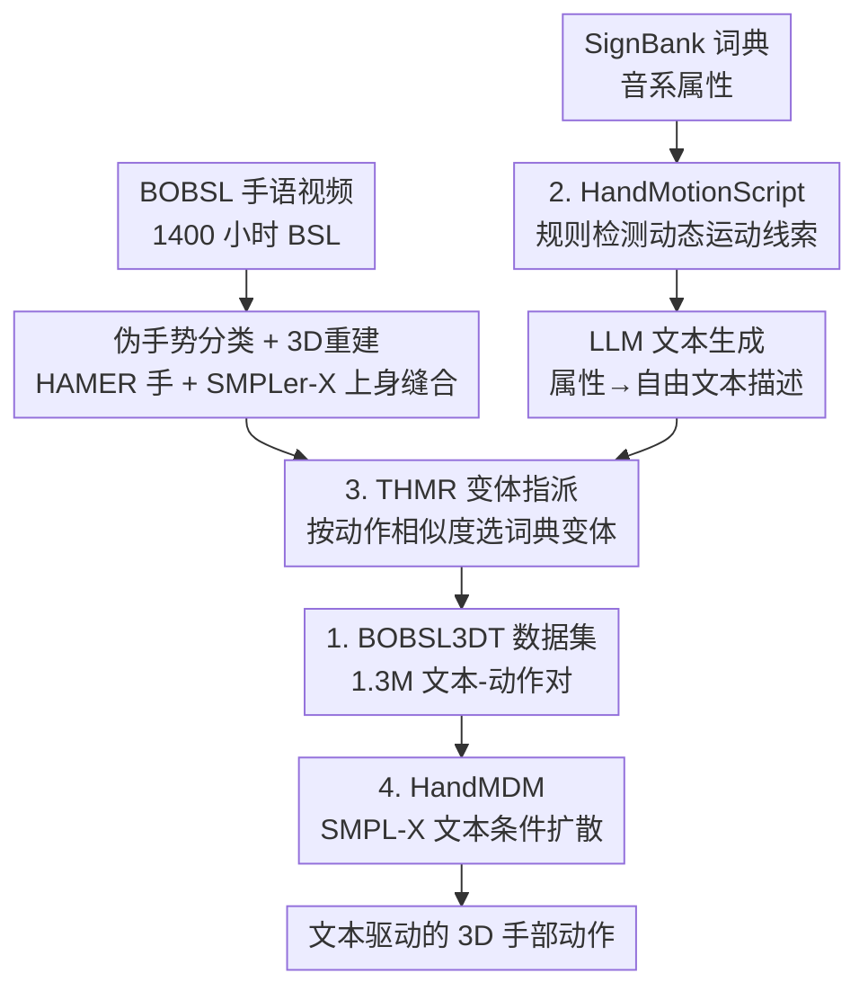

# Text-Driven 3D Hand Motion Generation from Sign Language Data

**会议**: CVPR 2026  
**论文**: [CVF Open Access](https://openaccess.thecvf.com/content/CVPR2026/html/Bensabath_Text-Driven_3D_Hand_Motion_Generation_from_Sign_Language_Data_CVPR_2026_paper.html)  
**代码**: 无（项目页 https://imagine.enpc.fr/~leore.bensabath/HandMDM，作者承诺开源模型与数据）  
**领域**: 3D视觉 / 人体理解 / 扩散模型  
**关键词**: 手部动作生成, 文本条件扩散, 手语数据, 数据规模化, SMPL-X

## 一句话总结
本文借助大规模手语视频 + 手语词典 + LLM，自动构建了 130 万条「文本-3D手部动作」配对数据集 BOBSL3DT，并在其上训练出能由自由文本描述（手型、位置、手指/手臂运动）驱动的手部动作扩散模型 HandMDM，且对未见手势、异种手语乃至非手语手部动作都有不错的泛化。

## 研究背景与动机
**领域现状**：文本驱动的人体动作生成（text-to-motion）这几年很火，从 HumanML3D、Motion-X 到 MDM/MotionDiffuse 等扩散模型层出不穷，但绝大多数工作生成的是**身体骨架**，手部要么被忽略、要么只有粗糙的腕部位置。

**现有痛点**：要让生成的人体动作真正「有表现力」，精细的手部运动是关键，但这一块卡在**数据**上——常用动捕数据集压根不含手指关节，对应的文本标注也从不描述手；Motion-X 虽然用规则脚本编码了手型，但只逐帧看手指位置、不含动作级别标注，且整体仍以身体为中心；BOTH57M 专门人工标了手，却因标注成本高昂只有约 1.8k 条样本，规模太小。

**核心矛盾**：手部动作生成需要**大规模带文本描述的 3D 手部数据**，而高质量人工标注（精确、低噪）与规模（百万级）之间存在根本的成本矛盾——你不可能让人手工标百万条手势文本。

**本文目标**：(1) 找到一种能把「文本-手部动作」配对规模化到百万级的自动化方法；(2) 验证在这种高规模、但不可避免带噪的数据上，能不能训出鲁棒的文本条件手部动作生成模型。

**切入角度**：手语视频天然蕴含丰富、精细的手型和手部运动，而且已有 BOBSL 这种 1400 小时、被密集伪标注过手势类别的超大规模 BSL（英国手语）数据；同时 SignBank 这类手语词典对每个手势词条都标注了手型、起止位置等**音系学（phonology）属性**。把「视频里的 3D 动作」和「词典里的属性描述」对接起来，就能批量生产配对。

**核心 idea**：拥抱「高规模 & 高噪声」路线——用单目 3D 重建从手语视频抽动作、用 LLM 把词典属性翻译成自由文本描述、再用检索模型把两者自动对齐，造出百万级数据，然后只对标准扩散模型做最小改动来训练，让规模本身扛起鲁棒性。

## 方法详解

### 整体框架
方法分两大块：**自动数据构建**（Sec 3.1，本文真正的贡献）和**扩散模型训练**（Sec 3.2，刻意做最小改动）。数据构建要解决的根本问题是：手语视频里有动作但没有「手部文本描述」，词典里有属性描述但没有连续 3D 动作，二者需要被自动配对成可训练的「文本→动作」监督信号。

整条管线是双路汇合：一路从 **BOBSL 手语视频**出发，用伪手势分类器打出帧级 pseudo-gloss，再用 HAMER（手）+ SMPLer-X（上身）做单目 3D 重建并缝合，得到「动作-手势」对；另一路从 **SignBank 词典**出发，取每个手势词条的音系属性、辅以本文的 HandMotionScript 检测出的动态线索，喂给 LLM 生成自由文本，得到「手势-文本」对。两路在「指派」环节汇合：因为一个 pseudo-gloss 词可能对应词典里多个手势变体，用 THMR 检索模型按动作相似度挑最匹配的变体，最终落成 130 万条「文本-3D动作」对（BOBSL3DT）。最后把这批数据喂给 HandMDM 扩散模型训练。

### 关键设计

**1. BOBSL3DT 数据构建总管线：把手语视频「翻译」成百万级文本-动作监督**

这是本文的命脉，针对的就是「手部文本数据规模上不去」这个痛点。作者把规模化拆成几个互补的零件串起来：① **视频源**用 BOBSL 的 1400 小时 BSL 广播，配上已有工作训出的强手势分类器（VideoSwin，输入 16 帧、输出 8k 词表内的手势类别），密集滑窗打出帧级 pseudo-gloss；过滤低置信帧、保留至少 $m=6$ 连续帧的片段并合并近邻片段，得到约 190 万「视频-手势」对。② **3D 估计**对每段视频用 HAMER 估精确的 MANO 手部姿态（手型和腕部朝向准），再用 SMPLer-X 估上身（全局位置稳），把 HAMER 的手腕和手缝合到 SMPLer-X 身体上，并对手臂关节做轻量优化让手臂旋转更自然。③ **文本侧**取 SignBank 的音系属性 + HandMotionScript 线索，交给 LLM（Gemini 2.5 Pro）做 in-context 生成自由文本。

为做文本增强，每个 gloss 让 LLM 生成 3 条描述，且分「带/不带 HMS」两种共 6 条/动作——不带 HMS 的更偏手型、带 HMS 的含更多动态信息。一个关键决策是**绝不把 gloss 词本身喂给 LLM**：作者发现 LLM 对大词表或非 ASL 手势几乎没有知识，直接问 gloss 会高置信度地胡编（比如把 BSL 手势说成 ASL 手势），所以一律只走「外部词典属性」这条路绕开幻觉。最终 190 万对在保留 SignBank 词表内手势后降到 180 万，再经变体指派过滤到 130 万，划掉测试集后用 120 万训练。

**2. HandMotionScript（HMS）：给静态词典属性补上「动起来」的描述**

SignBank 属性虽准，却常常**说不清运动**——它标的是「平手型」之类的静态标签，但像 SKY 这种「双手向两侧分开」的动态过程在属性里根本没有体现。HMS 针对的就是这个缺口。它仿照 PoseScript 实现一套规则，逐帧检测手到相关身体部位的距离、以及手掌朝向，并用 SignBank 属性来决定该测哪些身体部位的距离。这些距离按阈值离散成 `close`、`spread` 等标签（阈值专门为精细手部场景调过），于是一段序列 `[close, spread]` 就能被后续 LLM 解读成「双手相互张开」的运动。实践中距离和朝向沿三个轴分别提取。它的价值在于：把「起止位置」之外的连续运动线索显式化，让 LLM 生成的文本既有手型又有动态，实验中加 HMS 在异种手语迁移上能稳定涨点。

**3. THMR 变体指派：消解「一词多手势」造成的对齐噪声**

把词典描述指派回视频动作并不是简单查表：即便 pseudo-gloss 指向了正确的词，也不知道视频里具体做的是哪个**手势变体**，更不知道该变体在 SignBank 里有没有。作者训了一个文本→手部动作的检索模型 THMR（结构类似 TMR），用它的动作编码器输出当 embedding，对每个 BOBSL 动作，在该 gloss 的多个词典变体里挑动作相似度最高的那个；实践中还用 k-medoids 聚类把无法匹配到任何变体的动作剔掉。有意思的细节是：训这个用于指派的 THMR 时用的是**随机变体指派**，但因为只用动作编码器、丢掉文本编码器，动作间排序依然可靠。消融显示，相比随机指派，THMR 指派把 seen R@1 从 18.77 提到 21.68，确实压下了噪声。

**4. HandMDM：基于 SMPL-X 的文本条件扩散，刻意做最小改动**

为了把研究焦点放在「自动造数据」而非模型花活上，生成器对标准扩散模型只做最小改动。它沿用 MDM-SMPL（在 MDM 上加 SMPL 支持），并进一步换成 **SMPL-X** 表达式身体模型以支持手部和脸部关节，称为 HandMDM。动作用 6D 旋转表示上身，向量维度 $\mathbb{R}^{274}$（每只手 15 个 6D 关节旋转、上身 13 个 6D 旋转、脸部 16 个参数）。Transformer 编码器输入是 CLIP 文本 token + 扩散步 token + 两个 register token + 带噪动作，用 MSE 预测去噪后的动作。训练时从一个动作的多条文本里随机采一条；5% 概率丢弃条件以支持测试时的 classifier-free guidance，扩散步数 100。这一块「朴素」恰恰是论文想传达的点：数据规模够大时，标准扩散模型就能扛起鲁棒生成。

### 损失函数 / 训练策略
扩散模型用预测去噪动作的 MSE 损失训练；条件丢弃率 5% 以启用 classifier-free guidance；扩散步数 100。评测侧另训了一个 THMR 检索模型（用自动指派后的 BOBSL3DT 配对），与生成所用的同一表示，用于算检索分数和 FID。

## 实验关键数据

### 主实验（域内 + 跨域迁移）
域内评测在 BOBSL3DT 人工校验的测试集上做，分 seen（722 个）/unseen（87 个）手势，主指标是「动作→动作」检索 R@k 和 FID。

| 输入控制方式 | Seen R@1 ↑ | Seen R@3 ↑ | Unseen R@1 ↑ | Unseen R@3 ↑ |
|--------------|-----------|-----------|--------------|--------------|
| Gloss（封闭词表） | 21.71 | 37.53 | n/a | n/a |
| Phonology（原始属性） | 17.14 | 28.78 | 20.98 | 34.48 |
| LLM(Gloss) | 1.00 | 2.29 | 5.17 | 10.06 |
| LLM(Phonology) | 19.95 | 33.14 | 22.99 | 37.07 |
| **LLM(Phonology+HMS)** | **21.68** | **34.18** | 17.53 | **36.20** |

LLM(Gloss) 几乎全崩（R@1≈1），实锤了「只给 gloss、LLM 不懂手语」的判断；而 Phonology+HMS 的自由文本模型在保持 seen 性能的同时还能处理未见手势和自由文本输入。

跨手语（BSL→ASL）零样本迁移：

| 训练数据 | ASL-Text R@1 ↑ | ASL-Text R@3 ↑ | MS-ZSSLR-W R@1 ↑ | MS-ZSSLR-W R@3 ↑ |
|----------|---------------|---------------|------------------|------------------|
| 仅 ASL-Text（baseline） | 5.98 | 16.21 | 6.43 | 16.85 |
| 仅 MS-ZSSLR-W（baseline） | 6.47 | 16.31 | 5.01 | 13.08 |
| BOBSL3DT (Phon.) | 14.29 | 27.51 | 12.41 | 24.52 |
| **BOBSL3DT (Phon.+HMS)** | **17.09** | **35.43** | **15.39** | **31.50** |

在另一种手语 ASL 上零样本迁移，本文模型远超用对应小数据集从头训练的 baseline（R@3 几乎翻倍），说明大规模 BSL 数据迁移得动。

### 消融实验

| 配置 | Seen R@1 ↑ | Seen R@3 ↑ | Unseen R@1 ↑ | 说明 |
|------|-----------|-----------|--------------|------|
| 随机变体指派 | 18.77 | 32.27 | 16.09 | 不消歧手势变体 |
| **THMR 变体指派** | **21.68** | **34.18** | **17.53** | 按动作相似度选变体，降噪 |
| 训练数据 100% | 最高 | — | 最高 | R@1 随数据量单调上升 |
| 训练数据更少 | 更低 | — | 更低 | 截取部分训练数据，性能单调下降 |

### 关键发现
- **变体指派是关键降噪步**：THMR 指派相比随机指派把 seen R@1 提了约 3 个点，验证了「百万级数据里一词多手势的对齐噪声」确实值得专门处理。
- **数据规模单调增益**：R@1 随训练数据比例单调上升且没饱和，呼应「高规模高噪声」路线——scale 还能继续推。
- **HMS 不是万灵药**：在 ASL 迁移上加 HMS 涨点，但在 BOTH57M（描述更偏手型、少手臂/全局位置）上 HMS 收益有限——⚠️ BOTH57M 上两个变体的强弱以原文论述为准（作者明确说该集缺动态描述时 HMS 帮助不大）。
- **LLM 幻觉的工程绕法**：只喂词典属性、绝不喂 gloss 名，是把 LLM 用进手语场景的实操关键。

## 亮点与洞察
- **把「词典 + 视频 + LLM」三件套拼成数据工厂**：手语视频出动作、手语词典出语义属性、LLM 出自由文本，三者本来各自独立，作者用一条检索式指派把它们焊在一起，造出比现有手部数据集大两个数量级的 BOBSL3DT。这种「拿现成的大规模带噪资源、自动对齐造监督」的思路可迁移到任何「有动作但缺文本」的领域。
- **绕开 LLM 幻觉的姿势很实用**：明知 LLM 不懂大词表手语，干脆不给它 gloss、只给结构化属性，把它降级成「属性→自然语言」的翻译器，幻觉就基本消失——这是用 LLM 做领域数据标注时值得复用的安全模式。
- **「用随机标签训检索器、却只取动作端」**：训 THMR 做指派时文本对齐是随机的，但因为只用动作编码器算动作-动作相似度，照样可靠——一个反直觉但聪明的工程取巧。
- **拥抱噪声换规模**：明确选「高规模高噪声」而非「小而精」，并用实验证明 scale 能扛起鲁棒性，是数据工程层面的态度示范。

## 局限与展望
- 作者承认：模型对**接触/触碰**类精细动作不够准（如手指没贴到下巴），fine-grained 手型或文本细节过多时也常跟不全。
- 评测偏向性：THMR 在 BOBSL3DT 上训练，跨域迁移评测可能偏向其训练分布；作者只用相关特征子集（手臂+手旋转）来缓解，但偏置无法完全消除。⚠️ 跨数据集 R@k 数值因任务难度/动作长度差异不可直接横比。
- 数据噪声叠加：pseudo-label 本身可能错、3D 重建可能不精、LLM 可能漏细节、变体指派可能错配——多源噪声共存，目前靠规模硬扛，未来可在去噪、主动校验上做文章。
- 缺真实代码/数据放出时间表，复现门槛取决于 BOBSL、SignBank 等资源的可获取性。

## 相关工作与启发
- **vs Motion-X**：Motion-X 用规则脚本逐帧从手指位置编码手型，但只到帧级、不含动作级标注，且整体以身体为中心；本文专攻手部、有动作级自由文本描述，且规模大一个量级以上。
- **vs BOTH57M**：BOTH57M 人工精标手 + 身体，质量高但仅约 1.8k 条且其目标是「由身体运动生成手」；本文以**文本为唯一控制信号**，靠自动管线把规模做到 130 万。
- **vs 手语生成（SLP）类工作**（Progressive Transformers、SignAvatars、NeuralSignActors 等）：它们多由 gloss/句子翻译生成手语、或只有「翻译」文本而无**手部描述**；本文反过来用手语数据当原料、生成由手型/运动自由文本驱动的通用手部动作，并能迁移到非手语手部动作。
- **vs MDM / MDM-SMPL**：本文在 MDM-SMPL 基础上换 SMPL-X 以支持手部，模型本身刻意最小改动，把创新点全压在数据侧。

## 评分
- 新颖性: ⭐⭐⭐⭐⭐ 首次把「纯文本→3D手部动作」这一新任务做到百万级数据，数据构建管线设计巧妙。
- 实验充分度: ⭐⭐⭐⭐ 域内 + 跨手语 + 非手语三档迁移 + 多项消融，较完整；但部分跨域结论受评测器偏置影响。
- 写作质量: ⭐⭐⭐⭐ 动机和管线讲得清楚，噪声来源诚实交代；部分细节压进附录。
- 价值: ⭐⭐⭐⭐⭐ 数据集与模型承诺开源，为「有表现力手部动作生成」这一新方向提供了关键的规模化基座。

<!-- RELATED:START -->

## 相关论文

- [\[CVPR 2026\] HandDreamer: Zero-Shot Text to 3D Hand Model Generation](handdreamer_zero_shot_text_to_3d_hand_model_generation.md)
- [\[CVPR 2026\] MoLingo: Motion-Language Alignment for Text-to-Human Motion Generation](molingo_motion-language_alignment_for_text-to-motion_generation.md)
- [\[CVPR 2026\] MotionMaster: Generalizable Text-Driven Motion Generation and Editing](motionmaster_generalizable_text-driven_motion_generation_and_editing.md)
- [\[CVPR 2026\] Learning Effective Sign Features without Text for Gloss-free Sign Language Translation](learning_effective_sign_features_without_text_for_gloss-free_sign_language_trans.md)
- [\[CVPR 2026\] Hierarchical Enhancement of Semantic Priors for Disentangled Text-Driven Motion Generation](hierarchical_enhancement_of_semantic_priors_for_disentangled_text-driven_motion_.md)

<!-- RELATED:END -->
