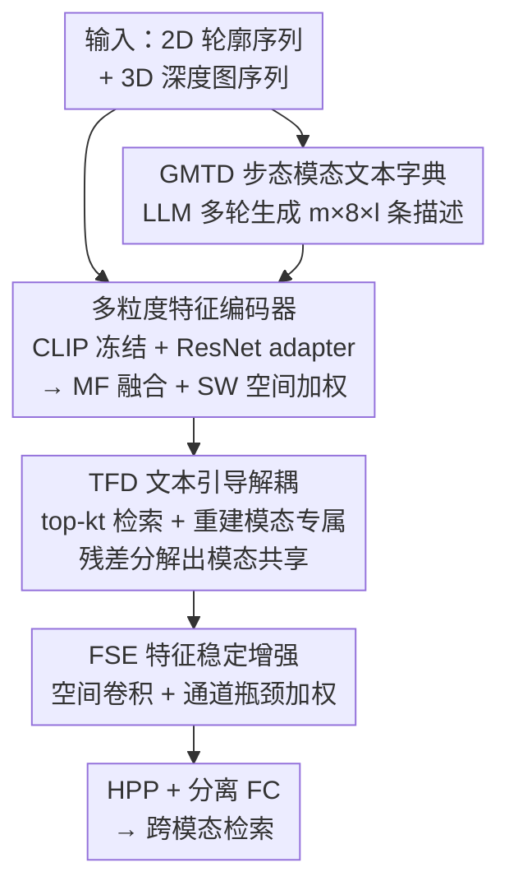

# Text-guided Feature Disentanglement for Cross-modal Gait Recognition

**会议**: CVPR 2026  
**论文**: [CVF Open Access](https://openaccess.thecvf.com/content/CVPR2026/html/Lu_Text-guided_Feature_Disentanglement_for_Cross-modal_Gait_Recognition_CVPR_2026_paper.html)  
**代码**: 无  
**领域**: 人体理解 / 跨模态步态识别  
**关键词**: 步态识别, LiDAR-相机跨模态, 特征解耦, CLIP, 文本先验

## 一句话总结
用 LLM 生成「模态+视角」感知的步态文本字典，借 CLIP 把文本当语义锚点引导视觉特征解耦，从而把 LiDAR 与相机两种模态的步态特征拆成「模态专属 + 模态共享」两部分、仅用共享特征做检索，在 SUSTech1K、FreeGait 两个跨模态步态基准上刷到新 SOTA（FreeGait 上 3D→2D Rank-1 从 43.3 涨到 57.9）。

## 研究背景与动机
**领域现状**：步态识别靠走路姿态认人，相比人脸/虹膜有「非接触、远距离、难伪装」的优势。但现实部署里传感器异构——既有 RGB 相机（输出 2D 轮廓视频），又有 LiDAR（输出 3D 点云序列），于是「LiDAR-相机跨模态步态识别（LCCGR）」成为多设备协同检索的关键场景：拿一个模态的查询去另一个模态的库里检索同一个人。

**现有痛点**：2D 视频和 3D 点云之间的**模态鸿沟巨大，甚至超过类内差异**，直接对齐很难。已有路线各有硬伤：CL-Gait 用合成 2D-3D 数据做对比学习预训练，但合成与真实数据的 domain gap 引入了偏差；CrossGait 学一组可学习的「共享原型」并用注意力加权，但原型泛化性差、把不同模态特征硬往一起拉容易**类塌缩**。更要命的是，现有特征解耦网络本质上是个不可解释的黑盒——你无法知道它到底解出了什么、解得对不对。

**核心矛盾**：跨模态步态要的是「模态共享」的判别特征，但「怎么把模态专属信息从视觉特征里可靠地剥出来」缺乏一个有语义、可解释的监督信号。纯靠特征空间里的对比/正交约束，解耦过程像盲人摸象。

**切入角度**：视觉-语言模型（CLIP）提供了一个新视角——既然「这是从正面看的相机二值轮廓」「这是从左视角的 LiDAR 深度图」这类**模态特性是可以用语言描述**的，那就可以把模态专属信息用文本写出来、投到视觉空间里，用文本当「语义锚点」去**显式地、可解释地**引导解耦：和文本对得上的那部分就是模态专属信息，剩下的残差就是模态共享信息。

**核心 idea**：用 LLM 造一本「模态+视角」感知的步态文本字典，借 CLIP 把文本嵌到视觉空间当锚点，通过「重建模态专属 → 残差分解出模态共享」的方式做文本引导的特征解耦（TCFDNet）。

## 方法详解

### 整体框架
TCFDNet 要解决的是 LCCGR：输入一段步态序列（相机侧是 $s$ 帧二值轮廓、LiDAR 侧是 $s$ 帧深度图，都 resize 到 $64\times64$），输出一个**只含模态共享信息**的判别特征用于跨模态检索。整条管线分四步串起来：先离线用 LLM 造一本步态模态文本字典 GMTD（每个模态 × 8 视角 × $l$ 轮，共 $m\times8\times l$ 条描述）；在线时，多粒度特征编码器用冻结的 CLIP 视觉/文本编码器分别抽视觉特征和文本嵌入，再叠一个 ResNet 旁路 adapter 补细粒度信息，经 MF（多粒度融合）和 SW（空间加权）得到融合后的视觉特征；接着 TFD 模块拿当前视觉特征去 GMTD 里检索 top-$k_t$ 条最匹配的文本，用它们**重建出模态专属特征**，再用「原特征 − 模态专属 = 模态共享」的残差分解拿到共享特征；最后 FSE 模块从空间和通道两个维度增强这个「脆弱的」共享特征的鲁棒性，再过 HPP+分离 FC 出 part-based 判别特征。训练侧另配一个跨模态 Patch Exchange 数据增强，在输入层交换两模态的局部区域以提升泛化。

### 关键设计

**1. GMTD 步态模态文本字典：把「模态专属信息」写成可检索的语义锚点**

解耦缺一个有语义、可解释的监督信号——这是前面说的「黑盒解耦」痛点。作者的做法是先离线造一本字典 GMTD，把每个模态在每个视角下「长什么样」用自然语言描述出来，比如相机侧「A photo of a binary silhouette of a person walking from the front」、LiDAR 侧「A LiDAR-based image of a human walking from the left view」。构造上分三件事：先按惯例把视角离散成 8 个方向，用一份含 formulation/protocol/examples 的指令让 LLM（ChatGPT）生成「模态感知 + 视角感知」的描述（指令本身鼓励 LLM 做 instruction-following、CoT、in-context 生成）；再用 $l$ 轮多轮交互（multi-turn）把每条描述扩写成 $l$ 组不同表述，提升语义多样性并贴合 CLIP 预训练的文本格式。最终字典规模为 $m\times8\times l$ 条（$m\in\{2d,3d\}$）：

$$\text{GMTD}=\{t^m_j \mid m\in\{2d,3d\},\, j=1,2,\dots,8l\}$$

这些文本随后过冻结的 CLIP 文本编码器 + 两层 MLP adapter，变成模态专属文本嵌入 $v^m_j\in\mathbb{R}^{1\times d}$。它有效的关键在于：文本天然落在 CLIP 的视觉-语言共享空间里，能直接和视觉特征算相似度，于是「哪部分视觉特征是模态专属的」就有了一组现成的、人能读懂的锚点，而不是凭空在特征空间里硬解。

**2. 多粒度特征编码器（MF + SW）：补齐 CLIP 缺失的细粒度步态线索**

CLIP 视觉编码器擅长全局粗粒度语义，但步态识别要的是细粒度的时空动态，单靠冻结 CLIP 不够。编码器因此设计成双路：一路冻结 CLIP 视觉编码器 + 一个轻量 adapter（两层 MLP）出全局 token $\tilde g^m_i\in\mathbb{R}^{(1+o)\times d}$（含 [CLS] 和 $o$ 个 token，时间维用 Maxpool 聚合）；另一路用可训练的 ResNet-9 旁路捕捉细粒度局部时空特征 $\tilde f^m_i\in\mathbb{R}^{h'\times w'\times d}$。MF（Multi-grained Fusion）模块用多头交叉注意力做**双向融合**——全局 query 局部、局部也 query 全局，逐层更新后再聚合多层输出成 $u^m_i$；SW（Spatial Weighting）模块再用 $1\times1$ 卷积 + BN + LeakyReLU 算一张空间注意力图 $w^m_i\in\mathbb{R}^{h'\times w'\times1}$，按 Hadamard 积重标定特征 $\tilde u^m_i=w^m_i\odot u^m_i$，**自适应突出身份判别区域、压制无关区域**。这一路保证了进入解耦阶段的视觉特征既有 CLIP 的语义对齐能力，又有足够细粒度的步态判别信息。

**3. TFD 文本引导特征解耦：先重建模态专属，再残差分解出模态共享**

这是全文的核心。痛点是「怎么用文本锚点把模态专属信息从视觉特征里剥出来」。TFD 分三步：① **检索**——用 CLIP 的 [CLS] 特征 $\tilde g^{*m}_i$ 和 GMTD 文本嵌入算余弦相似度 $\cos(\tilde g^{*m}_i, v^m_j)$，选出 top-$k_t$ 条最匹配的模态专属语义原型；② **重建模态专属**——把这 $k_t$ 条原型投到共享潜空间并 L2 归一化得 $\hat V^m_i$，把展平归一后的视觉特征 $\hat u^m_i$ 和它算亲和度并 Softmax 得权重图 $\Omega=\varphi(\cos(\hat u^m_i,\hat V^m_i))\in\mathbb{R}^{h'w'\times k_t}$，按权重加权融合文本原型、reshape 回空间得模态专属特征 $F^m_{(mod),i}$；为防训练早期发散，还加了一个**门控**——用 $\tilde u^m_i$ 经 Avgpool+MLP+Sigmoid 算出通道调制因子 $\alpha$，$\tilde F^m_{(mod),i}=\alpha\odot F^m_{(mod),i}$，早期小步引入专属分量；③ **残差分解**——

$$F^m_{(shared),i}=\tilde u^m_i-\tilde F^m_{(mod),i}$$

直接把「原特征减去模态专属」当作模态共享特征。它有效是因为整个解耦由文本语义显式驱动、可解释（专属那部分确实对应某些可读的模态描述），又通过正交/独立性损失（见下）强约束共享与专属在统计上互相独立，避免了 CrossGait 那种硬拉原型导致的类塌缩。

**4. FSE 特征稳定增强：给「脆弱的」残差共享特征加鲁棒性**

残差分解出来的共享特征有个问题：它只是个减法残差，残留的模态专属噪声和局部扰动让它对特征扰动很敏感、判别力受限。FSE 从两个互补视角加固它：先用 $3\times3$ 卷积建模**局部空间感受野**得 $\hat F^m_{(shared),i}$；再用一个**瓶颈层**把下采样特征展平投到低维 $d'\ll d$ 再投回 $d$ 维（$\bar F^m_{(shared),i}\in\mathbb{R}^{1\times d}$），随后用核大小为 3 的 1D 卷积 + Softmax 建模**通道间依赖**算出每个通道的权重 $\beta\in\mathbb{R}^{1\times d}$，按 $\tilde F^m_{(shared),i}=\beta\odot F^m_{(shared),i}$ 做通道自适应加权。直觉是：不同通道维度编码了不同的跨模态语义模式，建模通道间依赖并自适应加权能让共享特征更稳、更具判别性。最后过 HPP + 分离 FC 出 part-based 特征。

### 损失函数 / 训练策略
总损失把三类约束协同起来——语义对齐、特征解耦、统计去相关：

$$\mathcal{L}_{all}=\gamma_1(\mathcal{L}_{tri}+\mathcal{L}_{ce})+\gamma_2\mathcal{L}^m_{align}+\gamma_3(\mathcal{L}^m_{ortho}+\mathcal{L}^m_{HSIC})$$

- **MA Loss（模态对齐）** $\mathcal{L}^m_{align}=1-\frac1N\sum\cos(\bar F^m_{(mod),i},\bar V^m_i)$：让重建出的模态专属特征和对应文本嵌入的均值在语义上对齐，确保「专属特征」真的反映了文本编码的模态语义。
- **MO Loss（模态正交）** $\mathcal{L}^m_{ortho}=\frac1N\sum \frac{|\langle \tilde F^m_{(shared),i},\tilde F^m_{(mod),i}\rangle|}{\|\tilde F^m_{(shared),i}\|\|\tilde F^m_{(mod),i}\|}$：用余弦正交约束逼共享与专属互相独立。
- **HSIC Loss（统计独立）** $\mathcal{L}^m_{HSIC}=\mathrm{tr}(K_cL_c)/(N-1)^2$：从统计依赖角度（中心化线性核 Gram 矩阵）进一步去相关两部分特征分布，比单纯正交更强。
- 另配常规 triplet loss 和 cross-entropy。默认 $\gamma_1=1.0,\gamma_2=0.5,\gamma_3=0.1$。

训练细节：ResNet-9 作 adapter，$d=512$，part token $o=16$；每序列随机采 10 帧，batch = 8 身份 × 8 序列；Adam，初始 lr $3\times10^{-4}$，共 25000 epoch，在 10000/20000 步 ×0.1 衰减；基于 OpenGait 框架，2×RTX 3090。另用 Patch Exchange 增强：在输入层交换两模态的局部区域、保持语义一致，提升对跨模态差异的适应性。

## 实验关键数据

### 主实验
在 SUSTech1K（25239 序列 / 1050 人，12 视角 8 种行走条件）和 FreeGait（11921 序列 / 1195 人，室外野外采集）两个跨模态基准上评测，报 Rank-1/Rank-5。SUSTech1K 上两个检索方向都刷新 SOTA：

| 数据集 / 方向 | 指标 | TCFDNet | 之前最好 | 提升 |
|--------------|------|---------|---------|------|
| SUSTech1K 2D→3D | Rank-1 | **55.9** | 54.9 (SCR) | +1.0 |
| SUSTech1K 3D→2D | Rank-1 | **61.7** | 57.7 (SCR) | +4.0 |
| SUSTech1K 3D→2D | Rank-5 | **82.5** | 79.5 (SCR) | +3.0 |
| FreeGait 2D→3D | Rank-1 | **52.1** | 40.1 (SCR) | +12.0 |
| FreeGait 3D→2D | Rank-1 | **57.9** | 43.3 (SCR) | +14.6 |
| FreeGait 3D→2D | Rank-5 | **87.2** | 75.9 (SCR) | +11.3 |

在更难、更野外的 FreeGait 上提升尤其大（Rank-1 提了 12~15 个点），说明文本引导的解耦在真实分布偏移下泛化更强。SUSTech1K 上在 Clothing、Occlusion 等困难子集也保持鲁棒。

### 消融实验
在 SUSTech1K（LiDAR→Camera）逐组件做消融（每次只动一个功能组、其余保持完整集成）：

| 配置 | Rank-1 | Rank-5 | 说明 |
|------|--------|--------|------|
| 完整模型 | **61.7** | **82.5** | 全部模块 |
| w/o GMTD（去文本字典） | 56.2 | 77.3 | 掉 5.5，文本先验贡献最大 |
| w/o ResNet 旁路（只 ViT） | 54.9 | 74.6 | 掉 6.8，细粒度旁路关键 |
| w/o SW（空间加权） | 58.4 | 78.9 | 掉 3.3 |
| w/o MF（去多粒度融合） | 56.7 | 76.5 | 掉 5.0 |
| w/o FSE | 59.8 | 80.6 | 掉 1.9 |
| w/o TFD（去解耦核心） | 58.9 | 79.3 | 掉 2.8 |

⚠️ 消融表（原文 Table 4）用勾叉矩阵排版、布局较密，上表各行的对应关系按「每步只改一个功能组」的描述与正文重点（去 GMTD 显著掉点）整理，具体数值以原文为准。

### 关键发现
- **GMTD（文本先验）和细粒度旁路是两根支柱**：去掉 GMTD 掉 5.5、只留 ViT 不要 ResNet 旁路掉 6.8，说明「文本锚点引导解耦」和「补 CLIP 缺的细粒度」缺一不可。
- **top-$k_t$ 选 16 最优**：检索的文本原型数 $k_t=16$ 时性能最好，是「语义丰富度」和「噪声引入」之间的平衡点——太多会引入弱相关文本噪声。
- **Night 条件普遍掉点**：所有方法在夜间都退化，作者归因于新引入的「昼夜跨域 + 跨模态」双重差异，列为未来方向。

## 亮点与洞察
- **把「模态差异」翻译成语言再用来解耦**，是个很漂亮的视角转换：模态专属信息（视角、传感器成像特性）本来抽象难界定，写成 CLIP 能读懂的文本后，「哪部分是专属」就变成一个可检索、可解释的对齐问题，残差自然就是共享——比在纯特征空间里盲解干净得多。
- **「重建专属 + 残差拿共享」的解耦范式可迁移**：任何「想从混合特征里剥出某种 nuisance 因子」的任务（跨域 ReID、跨光照/天气识别），只要那个 nuisance 能被文本描述，都能套这套 top-k 文本重建 + 残差分解 + 正交/HSIC 约束的模板。
- **门控 + 早期小步引入专属分量**的小 trick 实用：用 Sigmoid 门控 $\alpha$ 控制重建专属特征在训练早期的影响，避免一上来就被噪声重建带偏发散。
- **三损失分工明确**：MA 管「专属对得上文本」、MO 管「专属与共享正交」、HSIC 管「统计独立」，从语义/几何/统计三个层次约束，比单一正交更彻底。

## 局限与展望
- 作者承认 **Night 夜间条件下显著退化**，是昼夜跨域叠加跨模态的新难题，本文未解决。
- **重依赖 GMTD 的文本质量**：字典由 LLM 生成 + 人工检查过滤，描述写得准不准、视角划分够不够细，直接决定解耦上限；视角只离散成 8 个方向，对连续/极端视角可能不够。
- ⚠️ 训练 25000 epoch、双路编码 + MF 交叉注意力 + TFD 检索，**训练/推理成本不低**；CLIP 虽冻结，但具体开销原文未给量化分析。
- **只在 LiDAR-相机两模态、SUSTech1K/FreeGait 两数据集上验证**，对更多模态（如毫米波雷达、热成像）或更大规模真实场景的泛化待考察。Patch Exchange 的具体增益放在补充材料，正文未拆开看。

## 相关工作与启发
- **vs CL-Gait（ECCV'24）**：CL-Gait 用合成 2D-3D 数据做对比预训练统一模态空间，但合成↔真实的 domain gap 引入偏差且依赖大量额外预训练数据（表中标 ♠）；TCFDNet 不需合成数据预训练，靠文本锚点直接在真实数据上解耦，FreeGait 上大幅领先。
- **vs CrossGait（IJCB'24）**：CrossGait 学可学习共享原型 + 注意力加权，但硬拉不同模态特征易类塌缩、原型泛化差；TCFDNet 用「重建专属→残差共享」+ 正交/HSIC 约束，显式保证共享与专属独立，t-SNE 上类内更紧、类间更分离（intra/inter 余弦相似度从 CrossGait 的 0.67/0.45 改善）。
- **vs SCR（IF'25）等 SOTA**：SCR 是此前最强基线，TCFDNet 在 SUSTech1K 3D→2D 上 +4.0、FreeGait 上 +12~15 点，主要增益来自把文本作为「可解释的解耦监督信号」这一新维度，而非单纯堆网络容量。
- **vs 可见光-红外 ReID 方法（IDKL/TVI-LFM 等）**：作者把这些跨模态 ReID 方法适配到 LCCGait 当更强基线，TCFDNet 仍全面超过，说明步态跨模态的模态鸿沟比 ReID 更大、更需要语义层面的对齐引导。

## 评分
- 新颖性: ⭐⭐⭐⭐⭐ 「LLM 造模态文本字典 + 文本重建专属 + 残差分解共享」给跨模态步态解耦提供了可解释的新范式
- 实验充分度: ⭐⭐⭐⭐ 两数据集双向 + 逐组件消融 + top-k 分析 + t-SNE/相似度可视化，较扎实；但效率/开销分析欠缺、部分细节进了补充材料
- 写作质量: ⭐⭐⭐⭐ 框架与模块叙述清晰、图示完整；消融表勾叉布局偏密、个别行对应关系需对照正文
- 价值: ⭐⭐⭐⭐ 在 FreeGait 野外场景大幅提升，跨模态生物识别有现实应用价值，解耦范式可迁移到其他跨模态任务

<!-- RELATED:START -->

## 相关论文

- [\[CVPR 2026\] MMGait: Towards Multi-Modal Gait Recognition](mmgait_multi_modal_gait_recognition.md)
- [\[CVPR 2026\] EventGait: Towards Robust Gait Recognition with Event Streams](eventgait_towards_robust_gait_recognition_with_event_streams.md)
- [\[CVPR 2026\] HyperGait: Unleashing the Power of Parsing for Gait Recognition in the Wild via Hypergraph](hypergait_unleashing_the_power_of_parsing_for_gait_recognition_in_the_wild_via_h.md)
- [\[CVPR 2026\] Composite-Attribute Person Re-Identification via Pose-Guided Disentanglement](composite-attribute_person_re-identification_via_pose-guided_disentanglement.md)
- [\[CVPR 2026\] Unlocking Motion from Large Vision Models with a Semantic and Kinematic Duality for Gait Recognition](unlocking_motion_from_large_vision_models_with_a_semantic_and_kinematic_duality_.md)

<!-- RELATED:END -->
